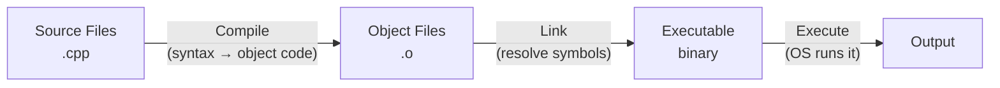

# Environment Setup

> Setting up C++ means installing a compiler — there's no runtime to download — then choosing an editor and learning the compile-link-execute cycle.

## Table of Contents
- [Core Concepts](#core-concepts)
- [Code Examples](#code-examples)
- [Common Pitfalls](#common-pitfalls)
- [Key Takeaways](#key-takeaways)

## Core Concepts

### What "Installing C++" Actually Means

Unlike Python or Node.js, C++ has no runtime you install. There's no `cpp` binary that interprets your code. When people say "install C++," they mean **install a C++ compiler** — a program that translates your source code into a native executable.

The two major compilers are:

| Compiler | Command | Platforms | Notes |
|----------|---------|-----------|-------|
| **Clang** | `clang++` | macOS, Linux, Windows | Default on macOS via Xcode tools. Excellent error messages. |
| **GCC** | `g++` | Linux, Windows (MinGW), macOS | The original open-source C++ compiler. Widest platform support. |

Both fully support C++17. For this curriculum, either works — the code is standard C++ and compiles on both.

### The Compile-Link-Execute Cycle

Every C++ program goes through three stages before it runs. Understanding this cycle is essential — many confusing errors become obvious once you know *which stage* failed.



**Compile.** The compiler reads each `.cpp` file independently, checks syntax, resolves types, and produces an object file (`.o`). Errors at this stage are **compiler errors** — typos, type mismatches, missing includes. These are your friends: they catch bugs before your code ever runs.

**Link.** The linker takes all object files and combines them into a single executable, resolving function calls across files. Errors here are **linker errors** — "undefined reference to X" means you called a function the linker can't find. This usually means you forgot to compile a source file or link a library.

**Execute.** The OS loads your binary into memory and runs it. Errors here are **runtime errors** — segfaults, logic bugs, bad output. The compiler can't catch these.

### IDE and Editor Options

You need a text editor that understands C++. The key feature to look for is **language server support** — specifically **clangd**, which provides autocomplete, error highlighting, go-to-definition, and refactoring.

**Recommended: VS Code + clangd extension.** Free, cross-platform, and the clangd extension provides IDE-quality C++ intelligence. This is the best option for learners because it's lightweight and works on every platform.

**Alternatives:**
- **CLion** (JetBrains) — full-featured C++ IDE with built-in CMake support. Excellent but paid.
- **Xcode** (macOS only) — Apple's IDE. Heavy but well-integrated with Apple toolchains.
- **Visual Studio** (Windows only) — Microsoft's IDE with MSVC compiler. The Community edition is free.

## Code Examples

### macOS

**Install the compiler:**

macOS doesn't ship with a C++ compiler out of the box, but Apple provides one through Xcode Command Line Tools. This gives you Apple Clang, which is a customized build of the Clang/LLVM compiler.

```bash
# Install Xcode Command Line Tools (includes Apple Clang)
xcode-select --install

# Verify the installation
clang++ --version
# Expected output: Apple clang version 15.x.x (or similar)
```

**Write and compile your first program:**

Create a file called `hello.cpp`:

```cpp
#include <iostream>

int main() {
    std::cout << "Hello, C++!\n";
    return 0;
}
```

```bash
# Compile and run
clang++ -std=c++17 -Wall -Wextra -Werror hello.cpp -o hello
./hello
# Output: Hello, C++!
```

### Windows

**Install the compiler:**

On Windows, the cleanest path to a working C++ compiler is **MSYS2**, which provides MinGW-w64 (a Windows port of GCC).

```bash
# 1. Download and install MSYS2 from https://www.msys2.org
#    Run the installer and follow the defaults.

# 2. Open the MSYS2 UCRT64 terminal and install g++:
pacman -S mingw-w64-ucrt-x86_64-gcc

# 3. Add to your system PATH:
#    Add C:\msys64\ucrt64\bin to your Windows PATH environment variable.
#    (Settings → System → About → Advanced system settings → Environment Variables)

# 4. Open a NEW Command Prompt or PowerShell and verify:
g++ --version
# Expected output: g++ (Rev..., Built by MSYS2 project) 13.x.x (or similar)
```

**Write and compile your first program:**

Create a file called `hello.cpp` (same source code as macOS — it's standard C++):

```cpp
#include <iostream>

int main() {
    std::cout << "Hello, C++!\n";
    return 0;
}
```

```bash
# Compile and run (in Command Prompt or PowerShell)
g++ -std=c++17 -Wall -Wextra -Werror hello.cpp -o hello.exe
.\hello.exe
# Output: Hello, C++!
```

### Understanding Compiler Flags

The flags matter. Here's what each one does and why you should always use them:

```bash
# Full recommended command (same flags for both clang++ and g++)
clang++ -std=c++17 -Wall -Wextra -Werror hello.cpp -o hello
```

```cpp
// Demonstration: this code compiles without -Wall, but warns with it
#include <iostream>

int main() {
    int x;                // uninitialized variable
    std::cout << x;       // -Wall catches this: "variable 'x' is uninitialized"
    return 0;
}
```

| Flag | What it does | Why you want it |
|------|-------------|-----------------|
| `-std=c++17` | Enables C++17 standard features | Without this, the compiler may default to an older standard (C++14 or even C++11) and reject valid C++17 code. |
| `-Wall` | Enables most common warnings | Catches uninitialized variables, unused values, implicit conversions — bugs the compiler spotted but wouldn't normally report. |
| `-Wextra` | Enables additional warnings beyond `-Wall` | Catches unused parameters, sign comparison issues, and more edge cases. |
| `-Werror` | Treats all warnings as errors | Forces you to fix warnings, not ignore them. Build discipline that pays dividends as projects grow. |

### A Richer Example: Multiple Concepts

```cpp
// greet.cpp — demonstrates string usage, const, and the standard library
#include <iostream>
#include <string>

int main() {
    const std::string language = "C++17";
    const int year = 2026;

    // String concatenation with + operator (no strcat/snprintf needed)
    const std::string message = "Welcome to " + language +
                                " in " + std::to_string(year) + "!";

    std::cout << message << '\n';
    std::cout << "Message length: " << message.size() << " characters\n";

    return 0;
}
```

```bash
# macOS
clang++ -std=c++17 -Wall -Wextra -Werror greet.cpp -o greet && ./greet

# Windows
g++ -std=c++17 -Wall -Wextra -Werror greet.cpp -o greet.exe && .\greet.exe
```

## Common Pitfalls

### Forgetting `-std=c++17`

```bash
# BAD — using the compiler's default standard
clang++ hello.cpp -o hello
# May compile as C++14 or C++11 depending on compiler version.
# Features like structured bindings, std::optional, if-constexpr
# will fail with confusing errors.

# GOOD — always specify the standard explicitly
clang++ -std=c++17 -Wall -Wextra hello.cpp -o hello
```

Never rely on the compiler's default standard. Different compilers and versions have different defaults. Always pass `-std=c++17` so your code behaves consistently everywhere.

### Confusing compiler errors with linker errors

```cpp
// BAD — seeing "undefined reference" and thinking it's a typo
// error: undefined reference to `greet()'
// This is a LINKER error, not a compiler error.
// Your code compiled fine — the linker can't find the function definition.

// GOOD — understanding what "undefined reference" means
// Check: Did you compile all .cpp files?
// Check: Did you spell the function name the same in declaration and definition?
// Check: Did you forget to link a library?

// Example: if greet() is defined in greet.cpp, compile both files:
// clang++ -std=c++17 main.cpp greet.cpp -o program
```

Compiler errors (`error: ...`) mean the syntax or types are wrong in a single file. Linker errors (`undefined reference to ...`) mean the compiled code references a function or variable that no object file provides. The fix is usually to compile a missing file or link a missing library.

### PATH issues on Windows

```bash
# BAD — installing MSYS2 but not adding it to PATH
g++ --version
# 'g++' is not recognized as an internal or external command

# GOOD — adding the correct MSYS2 directory to PATH
# Add C:\msys64\ucrt64\bin to your Windows PATH environment variable.
# Then open a NEW terminal (existing terminals won't see the change).
g++ --version
# g++ (Rev..., Built by MSYS2 project) 13.x.x
```

After installing MSYS2, you must add its `bin` directory to your system PATH *and* open a new terminal. Existing terminal windows cache the old PATH and won't find `g++`.

### Running `.cpp` files directly

```bash
# BAD — trying to execute source code directly
./hello.cpp
# Permission denied (or syntax errors if somehow executed as a shell script)

# GOOD — compile first, then run the resulting binary
clang++ -std=c++17 hello.cpp -o hello
./hello
```

Source files are text — they're instructions for the compiler, not for the OS. You must compile them into a binary first.

## Key Takeaways

- **"Installing C++" means installing a compiler**: Apple Clang via `xcode-select --install` on macOS, or GCC via MSYS2 on Windows. There's no C++ runtime to download.
- **Always compile with `-std=c++17 -Wall -Wextra`**: explicit standard, maximum warnings. Add `-Werror` to enforce warning-free code.
- **Know the three stages**: compile (syntax check) -> link (resolve symbols) -> execute (run). The stage tells you what kind of error you're dealing with.
- **VS Code + clangd** is the recommended editor setup — free, cross-platform, and provides IDE-quality C++ intelligence.
- **The compile-then-run workflow** is fundamental: write source code, compile to a binary, execute the binary. There is no interpreter.
