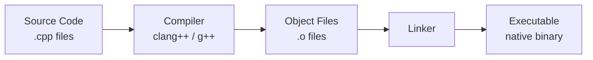

# Introduction to C++

> C++ is a compiled, statically typed, multi-paradigm language that gives you direct hardware control and high-level abstractions — a combination almost no other language offers.

## Table of Contents
- [Core Concepts](#core-concepts)
- [Code Examples](#code-examples)
- [Common Pitfalls](#common-pitfalls)
- [Key Takeaways](#key-takeaways)
- [Exercises](#exercises)

## Core Concepts

### What Is C++?

C++ is a **compiled, statically typed, multi-paradigm** programming language. Let's unpack each of those words because they define what makes C++ unique.

**Compiled** means your source code is translated directly into machine code *before* it runs. There's no interpreter sitting between your program and the CPU. This is why C++ programs can match hand-tuned assembly in performance — the compiler does the translation once, and the CPU executes native instructions directly.

**Statically typed** means every variable's type is known at compile time. The compiler catches type mismatches before your program ever runs. This is a tradeoff: you write more explicit code, but you get fewer runtime surprises.

**Multi-paradigm** means C++ doesn't force you into one programming style. You can write procedural code (like C), object-oriented code (classes and inheritance), generic code (templates), and even functional-style code (lambdas, `std::function`). You pick the paradigm that fits the problem.



### Why Use C++?

C++ exists to fill a gap that no other mainstream language occupies: **high performance with high-level abstractions**.

**Performance-critical systems** are C++'s home turf. Game engines, operating systems, browsers, databases, embedded systems, financial trading platforms — these all need predictable, low-latency performance. C++ delivers because there's no garbage collector pausing your program, no interpreter adding overhead, and no runtime reflection slowing things down.

**Zero-cost abstractions** are the core philosophy. When you use a `std::vector` instead of a raw array, or a lambda instead of a function pointer, the compiler generates code that's as efficient as if you'd written the low-level version by hand. You don't pay for abstractions you don't use, and you don't pay extra for the ones you do.

**Deterministic destruction** means you control exactly when resources are released. When an object goes out of scope, its destructor runs immediately — not "eventually" like in garbage-collected languages. This matters for more than memory: file handles, network sockets, mutexes, and database connections all need timely cleanup.

### C vs C++: Key Differences

C++ started as "C with Classes" in 1979, but modern C++ (C++11 and beyond) is a fundamentally different language from C. Understanding these differences clarifies *why* C++ features exist.

**Type safety.** C lets you implicitly convert between unrelated pointer types, cast anything to `void*`, and generally trusts you to know what you're doing. C++ tightens this considerably — implicit conversions are restricted, `enum class` replaces leaky C enums, and `static_cast`/`reinterpret_cast` make your intent explicit. The compiler catches more bugs.

**RAII (Resource Acquisition Is Initialization).** This is the single most important idea C++ adds to C. In C, you manually allocate and free resources, and if you forget (or an error path skips the cleanup), you leak. In C++, resource management is tied to object lifetimes — constructors acquire, destructors release, and scope handles the rest. This eliminates entire categories of bugs.

**Namespaces.** C has one global namespace. Every function, every global variable, every type name competes for the same pool of identifiers. C++ namespaces let you organize code into logical groups and avoid name collisions. The standard library lives in `std::`, your code lives in your own namespace.

**Function overloading.** In C, you can't have two functions with the same name. Need to print an `int` and a `float`? You write `print_int()` and `print_float()`. In C++, you write `print(int)` and `print(float)` — the compiler resolves which one to call based on the argument types.

**OOP and templates.** C has `struct` but no methods, no inheritance, no encapsulation. C++ adds classes with access control, virtual dispatch for polymorphism, and templates for compile-time generic programming. Templates are particularly powerful — they let you write code that works with any type, with zero runtime overhead.

## Code Examples

### Resource Management: C vs C++

```cpp
// C-style resource management — manual, error-prone
#include <cstdio>
#include <cstdlib>
#include <cstring>

void c_style_resource_management() {
    // Allocate a buffer manually
    char* buffer = static_cast<char*>(std::malloc(256));
    if (!buffer) {
        std::fprintf(stderr, "Allocation failed\n");
        return;
    }

    std::strcpy(buffer, "Hello from C-style code");
    std::printf("%s\n", buffer);

    // YOU must remember to free — every code path, every early return
    std::free(buffer);
    // If an exception or early return skips this line, you leak memory
}
```

```cpp
// C++-style resource management — RAII handles cleanup automatically
#include <iostream>
#include <string>

void cpp_style_resource_management() {
    // std::string manages its own memory via RAII
    std::string buffer = "Hello from modern C++";
    std::cout << buffer << '\n';

    // No manual cleanup needed — when 'buffer' goes out of scope,
    // its destructor frees the underlying memory automatically.
    // This works even if an exception is thrown.
}
```

### String Handling: C vs C++

```cpp
#include <iostream>
#include <string>

int main() {
    // C-style: raw char arrays, manual size tracking, buffer overflow risk.
    // Concatenation in C would require malloc, strlen, strcpy, strcat...
    // One wrong size calculation and you have a buffer overflow.

    // C++-style: std::string handles memory, concatenation, comparison
    const std::string greeting = "Hello";
    const std::string name = "World";
    const std::string message = greeting + ", " + name + "!";

    std::cout << message << '\n';           // "Hello, World!"
    std::cout << message.size() << '\n';    // 13 — always know the length
    std::cout << (greeting < name) << '\n'; // 1 — comparison just works

    return 0;
}
```

### Multi-Paradigm in Action

```cpp
#include <algorithm>
#include <iostream>
#include <string>
#include <vector>

// OOP: a class with encapsulation
class WordFilter {
public:
    explicit WordFilter(std::size_t min_length)
        : min_length_{min_length} {}

    bool passes(const std::string& word) const {
        return word.size() >= min_length_;
    }

private:
    std::size_t min_length_;
};

int main() {
    std::vector<std::string> words = {"C", "is", "great", "but", "C++", "is", "powerful"};

    // Functional style: lambda + algorithm
    auto count = std::count_if(words.begin(), words.end(),
        [](const std::string& w) { return w.size() > 2; });
    std::cout << "Words longer than 2 chars: " << count << '\n';

    // OOP style: using the filter object
    WordFilter filter{4};
    for (const auto& word : words) {
        if (filter.passes(word)) {
            std::cout << word << " passes the filter\n";
        }
    }

    return 0;
}
```

## Common Pitfalls

### Thinking C++ is just "C with classes"

```cpp
// BAD — writing C-in-C++ (manual memory, raw arrays, printf)
#include <cstdio>
#include <cstdlib>
#include <cstring>

int main() {
    char* name = static_cast<char*>(std::malloc(64));
    std::strcpy(name, "Alice");
    std::printf("Hello, %s\n", name);
    std::free(name);
    return 0;
}

// GOOD — using C++ idioms (RAII, standard library, type safety)
#include <iostream>
#include <string>

int main() {
    const std::string name = "Alice";
    std::cout << "Hello, " << name << '\n';
    return 0;
}
```

Modern C++ has a rich standard library. If you're reaching for `malloc`, `char*`, or `printf` in new C++ code, you're almost certainly doing it wrong. Use `std::string`, `std::vector`, `std::cout`, and let RAII manage resources.

### Confusing C++ compilation with interpreted languages

```cpp
// BAD — assuming you can just "run" a .cpp file
// $ ./hello.cpp         <-- this won't work
// $ python hello.cpp    <-- C++ is not interpreted

// GOOD — understanding the compile-then-run workflow
// $ clang++ -std=c++17 -Wall -Wextra hello.cpp -o hello
// $ ./hello
```

C++ is compiled, not interpreted. You write source code, compile it to a native binary, then execute the binary. There is no `cpp` command to run files directly. This is a feature: the compilation step catches errors early and produces optimized machine code.

### Assuming C code compiles identically in C++

```cpp
// BAD — assuming C and C++ have identical rules
// This is valid C but a compile error in C++:
// void* ptr = malloc(sizeof(int));
// int* ip = ptr;    // C: implicit void* -> int* conversion
                     // C++: ERROR — requires explicit cast

// GOOD — using C++ idioms instead of C patterns
#include <memory>

int main() {
    // Don't cast malloc in C++ — use smart pointers instead
    auto ip = std::make_unique<int>(42);
    return 0;
}
```

C++ is *mostly* a superset of C, but not entirely. Implicit `void*` conversions, variable-length arrays, and designated initializer syntax differ. Don't assume C code will compile unchanged under a C++ compiler.

## Key Takeaways

- C++ is a **compiled, statically typed, multi-paradigm** language — no runtime overhead from interpreters or garbage collectors.
- **Zero-cost abstractions** let you write clean, high-level code that compiles down to the same machine instructions as hand-optimized low-level code.
- **RAII** is the defining pattern that separates C++ from C — resources are tied to object lifetimes, eliminating manual cleanup and the bugs that come with it.
- Modern C++ (C++11 and later) is a fundamentally different language from C — write idiomatic C++, not "C with classes."
- C++ gives you the choice of paradigm: procedural, object-oriented, generic, or functional — pick the one that fits your problem.

## Exercises

1. Explain what "zero-cost abstractions" means in C++ and give one example from the standard library.
2. What are three key differences between C and C++ that make C++ more suitable for large-scale software?
3. Write a C++ program that demonstrates the difference between `std::string` and a C-style `char[]` — show a case where `std::string` prevents a common C bug.
4. Explain why C++ uses a compile-link-execute model rather than interpretation. What trade-offs does this create?

---
up:: [Schedule](../../Schedule.md)
#type/learning #source/self-study #status/evergreen
