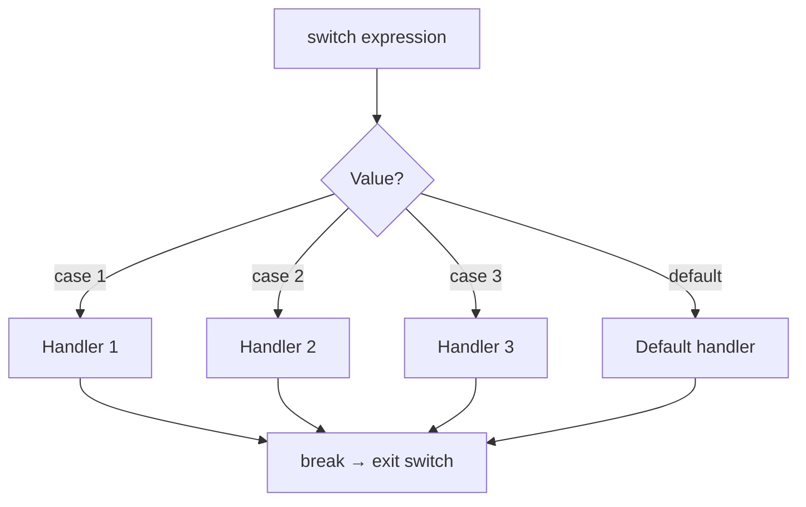
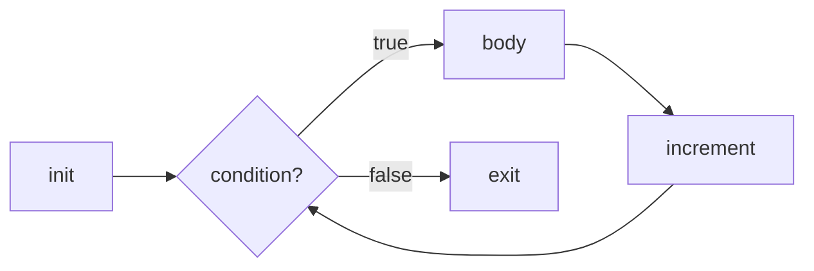

# Control Flow

> Control flow constructs — branching with `if`/`switch` and looping with `for`/`while` — determine the execution path through your program, and understanding their subtleties is essential for writing correct, efficient C++.

## Table of Contents
- [Core Concepts](#core-concepts)
- [Code Examples](#code-examples)
- [Common Pitfalls](#common-pitfalls)
- [Key Takeaways](#key-takeaways)
- [Exercises](#exercises)

## Core Concepts

### Branching: if / else

#### What

The `if` statement evaluates a condition and executes a block of code only if the condition is true. `else` provides an alternative path. `else if` chains multiple conditions. The condition is any expression convertible to `bool` — zero is false, everything else is true. Pointers are implicitly convertible: null is false, non-null is true.

#### How

The key design insight in modern C++ is that `if` conditions can include **initializer statements** (C++17), letting you declare a variable scoped to the `if`/`else` block. This reduces scope pollution and makes intent clearer.

```cpp
// C++17: if with initializer — the variable is scoped to the if/else block
if (auto it = map.find(key); it != map.end()) {
    // 'it' is valid here
    use(it->second);
} else {
    // 'it' is still accessible here (but equals map.end())
    handle_missing(key);
}
// 'it' is not accessible here — scope is limited, which is the point
```

#### Why It Matters

This pattern exists because in pre-C++17 code, you'd have to declare `it` outside the `if`, polluting the enclosing scope with a variable you only need inside the conditional.

### Branching: switch

#### What

A `switch` statement compares a single expression against a set of compile-time constant values and jumps directly to the matching `case`. The expression must be an integral or enum type (no strings, no floating-point). Each `case` must be a compile-time constant. Execution falls through from one case to the next unless you `break` — this is deliberate, inherited from C, and almost always a source of bugs.

#### How

The reason `switch` exists alongside `if`/`else if` chains is performance: it can be compiled into a **jump table** — the compiler generates an array of addresses and indexes directly into it, making dispatch O(1) regardless of the number of cases. As a bonus, the compiler can warn you about unhandled enum values.



#### Why It Matters

C++17 added `[[fallthrough]]` — an attribute that documents intentional fallthrough, letting the compiler warn on accidental fallthroughs while silencing warnings on deliberate ones.

### Branching: goto

#### What

`goto` unconditionally jumps to a labeled statement within the same function. You define a label (`label_name:`) and jump to it with `goto label_name`. The label must be in the same function, and you cannot jump past variable initialization — the compiler enforces this.

#### How

In practice, `goto` is almost never appropriate. It creates unstructured control flow that's harder to reason about, harder to maintain, and harder for the compiler to optimize. Modern C++ has exceptions, RAII, and structured loops that handle every legitimate use case.

#### Why It Matters

The one accepted exception: **breaking out of deeply nested loops**. Some style guides permit `goto` for this pattern because C++ lacks a `break N` construct. However, refactoring the nested loops into a separate function (and using `return`) is usually cleaner.

```cpp
// The one semi-legitimate use: breaking out of nested loops
for (int i = 0; i < rows; ++i) {
    for (int j = 0; j < cols; ++j) {
        if (matrix[i][j] == target) {
            goto found;  // breaks out of both loops
        }
    }
}
// Not found — handle the failure case
return std::nullopt;

found:
// Handle the success case
```

### Loops: for

#### What

The `for` loop is C++'s most versatile iteration construct. It comes in three forms:

1. **Classic `for`**: `for (init; condition; increment)` — full control over initialization, termination, and stepping.
2. **Range-based `for`** (C++11): `for (auto& x : container)` — iterates over every element in a container or range.
3. **Infinite loop**: `for (;;)` — loops forever until explicitly broken.

#### How

In the classic form, `init` runs once, `condition` is checked before each iteration, and `increment` runs after each iteration. Any of the three parts can be omitted.

#### Why It Matters

Range-based `for` should be your default. It's shorter, clearer, and eliminates off-by-one errors. It works with any type that provides `begin()` and `end()` — all standard containers, C arrays, and `std::initializer_list`. Only fall back to index-based loops when you actually need the index.



### Loops: while and do while

#### What

`while` checks the condition *before* each iteration — if the condition is false initially, the body never runs. `do while` checks *after*, guaranteeing the body runs at least once.

#### Why It Matters

The reason `do while` exists alongside `while` is that some patterns inherently need at least one execution: input validation (prompt, then check), retry loops (attempt, then verify), and menu systems (display, then check for exit). These read awkwardly as `while` loops because you'd need to duplicate code before the loop.

### Loop Control: break and continue

`break` exits the innermost loop or `switch` immediately. `continue` skips the rest of the current iteration and jumps to the next one (re-checking the condition in `while`/`do while`, running the increment in `for`).

Use `break` to exit early when you've found what you need. Use `continue` to skip irrelevant iterations — it keeps the main logic un-indented and easier to read.

Both only affect the **innermost** loop. If you need to break out of multiple nested loops, refactor into a function and use `return`, or (in rare cases) use a `goto`.

### Init Statements in if and switch (C++17)

C++17 introduced init statements for `if` and `switch`: you can declare a variable whose scope is limited to the conditional block. This pattern tightens scope and eliminates a common source of bugs — using a variable after the block where it was logically relevant.

The syntax is: `if (init; condition)` and `switch (init; expression)`.

This feature exists because C++ developers were routinely declaring variables just before an `if` statement, leaving those variables in scope for the rest of the function. Tightening the scope makes the code's intent clearer and prevents accidental reuse.

## Code Examples

### Comprehensive Branching

```cpp
#include <iostream>
#include <map>
#include <optional>
#include <string>

enum class LogLevel { debug, info, warning, error, fatal };

// Convert log level to string using switch — the compiler will warn
// if you add a new enum value and forget to handle it.
std::string_view to_string(LogLevel level) {
    switch (level) {
        case LogLevel::debug:   return "DEBUG";
        case LogLevel::info:    return "INFO";
        case LogLevel::warning: return "WARNING";
        case LogLevel::error:   return "ERROR";
        case LogLevel::fatal:   return "FATAL";
    }
    // No default — deliberately omitted so the compiler warns on missing cases.
    // This line handles compilers that warn about missing return.
    return "UNKNOWN";
}

int main() {
    // C++17 if-with-initializer: the map lookup is scoped to the if block
    const std::map<std::string, int> config = {
        {"timeout", 30},
        {"retries", 3},
    };

    if (auto it = config.find("timeout"); it != config.end()) {
        std::cout << "Timeout: " << it->second << "s\n";
    } else {
        std::cout << "Timeout not configured, using default.\n";
    }
    // 'it' is not accessible here — cleaner scope

    // switch on enum class — exhaustive handling
    const auto level = LogLevel::warning;
    std::cout << "[" << to_string(level) << "] Something happened.\n";

    // switch with C++17 initializer
    switch (const auto severity = static_cast<int>(level); severity) {
        case 0:
        case 1:
            std::cout << "Low severity.\n";
            break;
        case 2:
        case 3:
            std::cout << "High severity — investigate.\n";
            break;
        case 4:
            std::cout << "Critical — page on-call!\n";
            break;
    }

    return 0;
}
```

### Loop Patterns

```cpp
#include <algorithm>
#include <iostream>
#include <string>
#include <vector>

int main() {
    const std::vector<int> numbers = {1, 2, 3, 4, 5, 6, 7, 8, 9, 10};

    // Range-based for: iterate by const reference — no copies, no mutation
    std::cout << "Even numbers: ";
    for (const auto& n : numbers) {
        if (n % 2 != 0) continue;  // skip odds — keep the main logic un-indented
        std::cout << n << ' ';
    }
    std::cout << '\n';

    // Classic for: use when you need the index
    std::cout << "Pairs: ";
    for (std::size_t i = 0; i + 1 < numbers.size(); i += 2) {
        std::cout << '(' << numbers[i] << ',' << numbers[i + 1] << ") ";
    }
    std::cout << '\n';

    // while: process until a condition changes
    // Simulates reading lines until an empty one is found
    const std::vector<std::string> lines = {"hello", "world", "", "ignored"};
    std::size_t idx = 0;
    while (idx < lines.size() && !lines[idx].empty()) {
        std::cout << "Processing: " << lines[idx] << '\n';
        ++idx;
    }

    // do-while: input validation pattern (always prompt at least once)
    int attempt = 0;
    const int max_attempts = 3;
    bool success = false;
    do {
        ++attempt;
        std::cout << "Attempt " << attempt << " of " << max_attempts << '\n';
        // Simulate: succeed on attempt 2
        success = (attempt == 2);
    } while (!success && attempt < max_attempts);

    std::cout << (success ? "Succeeded" : "Failed after max attempts") << '\n';

    return 0;
}
```

### Structured Bindings with Control Flow (C++17)

```cpp
#include <iostream>
#include <map>
#include <string>

int main() {
    std::map<std::string, int> inventory = {
        {"apples", 12},
        {"bananas", 0},
        {"oranges", 7},
    };

    // Range-based for with structured bindings — clean iteration over maps
    std::cout << "In stock:\n";
    for (const auto& [item, count] : inventory) {
        if (count == 0) continue;
        std::cout << "  " << item << ": " << count << '\n';
    }

    // if-with-initializer + structured bindings: insert and check in one statement
    if (auto [it, inserted] = inventory.insert({"apples", 5}); !inserted) {
        std::cout << "'" << it->first << "' already exists with count "
                  << it->second << '\n';
    }

    // Emplace a new item and verify
    if (auto [it, inserted] = inventory.emplace("grapes", 20); inserted) {
        std::cout << "Added '" << it->first << "' with count "
                  << it->second << '\n';
    }

    return 0;
}
```

### Early Return and Guard Clauses

```cpp
#include <cmath>
#include <iostream>
#include <optional>
#include <string_view>

// Use early returns to handle edge cases first, keeping the main logic
// at the lowest indentation level. This is a widely adopted style in
// production C++ because it reduces nesting and improves readability.

std::optional<double> safe_divide(double numerator, double denominator) {
    if (denominator == 0.0) return std::nullopt;  // guard clause
    return numerator / denominator;
}

std::optional<double> compute_bmi(double weight_kg, double height_m) {
    if (weight_kg <= 0.0) return std::nullopt;
    if (height_m <= 0.0) return std::nullopt;

    // Main logic — no nesting, easy to read
    return weight_kg / (height_m * height_m);
}

void process_command(std::string_view cmd) {
    if (cmd.empty()) return;          // nothing to do
    if (cmd[0] == '#') return;        // comment line, skip
    if (cmd == "quit") {
        std::cout << "Goodbye.\n";
        return;
    }

    // Main logic: handle real commands
    std::cout << "Executing: " << cmd << '\n';
}

int main() {
    if (auto result = safe_divide(10.0, 3.0); result) {
        std::cout << "10 / 3 = " << *result << '\n';
    }

    if (auto result = safe_divide(10.0, 0.0); result) {
        std::cout << "This won't print.\n";
    } else {
        std::cout << "Division by zero!\n";
    }

    if (auto bmi = compute_bmi(70.0, 1.75); bmi) {
        std::cout << "BMI: " << *bmi << '\n';
    }

    process_command("hello");
    process_command("# this is a comment");
    process_command("quit");

    return 0;
}
```

## Common Pitfalls

### Forgetting `break` in a switch statement

```cpp
// BAD — missing break causes fallthrough
#include <iostream>

int main() {
    const int choice = 1;
    switch (choice) {
        case 1:
            std::cout << "One\n";
            // Oops — no break! Falls through to case 2.
        case 2:
            std::cout << "Two\n";
            // Falls through to case 3.
        case 3:
            std::cout << "Three\n";
            break;
    }
    // Prints: One, Two, Three — almost certainly not intended
    return 0;
}

// GOOD — explicit break on every case, use [[fallthrough]] when intentional
#include <iostream>

int main() {
    const int choice = 1;
    switch (choice) {
        case 1:
            std::cout << "One\n";
            break;
        case 2:
            std::cout << "Two\n";
            [[fallthrough]];  // C++17: documents intentional fallthrough
        case 3:
            std::cout << "Three\n";
            break;
    }
    // Prints: One
    return 0;
}
```

Switch fallthrough is inherited from C and is the default behavior. Most compilers can warn about it (`-Wimplicit-fallthrough`), but only if you enable the warning. Always use `break` unless you intentionally want fallthrough, and mark intentional fallthrough with `[[fallthrough]]` (C++17).

### Off-by-one errors in loop bounds

```cpp
// BAD — classic off-by-one: accessing one past the end
#include <iostream>
#include <vector>

int main() {
    const std::vector<int> data = {10, 20, 30};

    // <= should be <  — this accesses data[3], which is out of bounds
    for (std::size_t i = 0; i <= data.size(); ++i) {
        std::cout << data[i] << '\n';  // UB on last iteration!
    }
    return 0;
}

// GOOD — use range-based for, or careful bounds with <
#include <iostream>
#include <vector>

int main() {
    const std::vector<int> data = {10, 20, 30};

    // Best: range-based for — no index, no off-by-one possible
    for (const auto& val : data) {
        std::cout << val << '\n';
    }

    // If you need the index, use < (not <=)
    for (std::size_t i = 0; i < data.size(); ++i) {
        std::cout << "[" << i << "] " << data[i] << '\n';
    }
    return 0;
}
```

Off-by-one errors are the most common loop bug. Range-based `for` eliminates this entire class of errors — use it whenever you don't need the index. When you do need an index, the pattern is always `i < size`, never `i <= size`.

### Declaring variables inside a switch without braces

```cpp
// BAD — variable declaration in switch without braces
#include <iostream>

int main() {
    const int x = 2;
    switch (x) {
        case 1:
            int value = 10;  // ERROR: jump to 'case 2' crosses initialization
            std::cout << value << '\n';
            break;
        case 2:
            std::cout << "case 2\n";
            break;
    }
    return 0;
}

// GOOD — use braces to create a scope for each case
#include <iostream>

int main() {
    const int x = 2;
    switch (x) {
        case 1: {
            int value = 10;  // Fine — scoped to this case's block
            std::cout << value << '\n';
            break;
        }
        case 2: {
            std::cout << "case 2\n";
            break;
        }
    }
    return 0;
}
```

In a `switch` statement, all cases share the same scope. Jumping to `case 2` would skip the initialization of `value` declared in `case 1` — the compiler rejects this because `value` would be in scope but uninitialized. Wrapping each case in braces gives it its own scope, solving the problem cleanly.

### Modifying a container while iterating with range-based for

```cpp
// BAD — erasing elements during range-based for invalidates iterators
#include <iostream>
#include <vector>

int main() {
    std::vector<int> nums = {1, 2, 3, 4, 5};
    for (auto it = nums.begin(); it != nums.end(); ++it) {
        if (*it % 2 == 0) {
            nums.erase(it);  // UB! 'it' is invalidated after erase
        }
    }
    return 0;
}

// GOOD — use the erase-remove idiom (C++17 std::erase_if is even cleaner)
#include <algorithm>
#include <iostream>
#include <vector>

int main() {
    std::vector<int> nums = {1, 2, 3, 4, 5};

    // Erase-remove idiom: remove_if shifts unwanted elements to the end,
    // erase actually removes them. No iterator invalidation.
    nums.erase(
        std::remove_if(nums.begin(), nums.end(),
            [](int n) { return n % 2 == 0; }),
        nums.end());

    for (const auto& n : nums) {
        std::cout << n << ' ';  // 1 3 5
    }
    std::cout << '\n';
    return 0;
}
```

Modifying a container while iterating over it is one of the most dangerous patterns in C++. The `erase` method invalidates iterators at and after the erased position. Use the erase-remove idiom, or in C++20, `std::erase_if` for a cleaner one-liner.

## Key Takeaways

- **Prefer range-based `for`** as your default loop. It eliminates off-by-one errors and communicates "iterate over everything" more clearly than index-based loops.
- **Use C++17 init statements** in `if` and `switch` to tighten variable scope — declare variables where they're needed, not lines above.
- **Always `break` in switch cases** unless fallthrough is intentional, and mark intentional fallthrough with `[[fallthrough]]`.
- **Guard clauses with early return** keep code flat and readable — handle edge cases first, then write the main logic at minimal indentation.
- **Never modify a container while iterating** over it with range-based `for`. Use the erase-remove idiom or `std::erase_if` (C++20) instead.

## Exercises

1. Rewrite the following code using a C++17 if-with-initializer to limit the scope of `it`:
   ```cpp
   auto it = map.find(key);
   if (it != map.end()) { use(it->second); }
   ```
2. Explain what `[[fallthrough]]` does in a switch statement and why it was added in C++17.
3. Write a program that uses a range-based `for` loop to print only the even numbers from a `std::vector<int>`.
4. Explain when you would use a `do while` loop instead of a `while` loop. Give a concrete example.
5. Why does declaring a variable inside a `switch` case without braces cause a compiler error? What is the fix?

---
up:: [Schedule](../../Schedule.md)
#type/learning #source/self-study #status/evergreen
