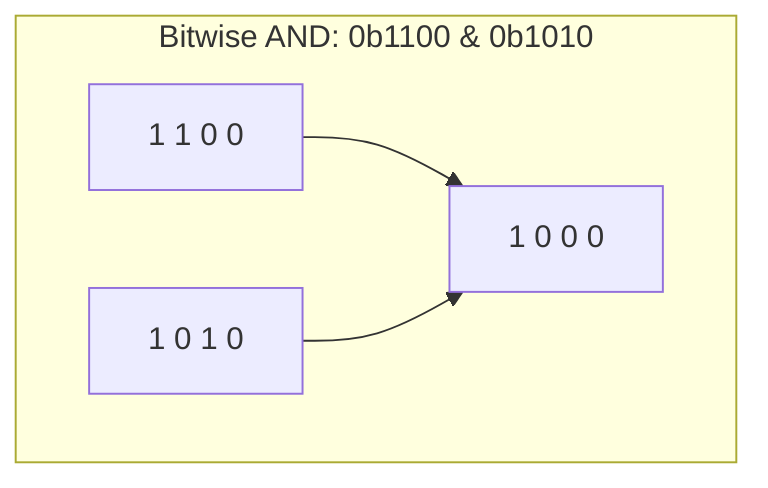

# Operators

> Operators are the verbs of C++ — arithmetic, logical, and bitwise operators let you compute values, make decisions, and manipulate data at the bit level, with subtleties that matter for correctness and performance.

## Table of Contents
- [Core Concepts](#core-concepts)
- [Code Examples](#code-examples)
- [Common Pitfalls](#common-pitfalls)
- [Key Takeaways](#key-takeaways)

## Core Concepts

### Arithmetic Operators

#### What

The arithmetic operators are `+`, `-`, `*`, `/`, and `%`. They behave like you'd expect from math, with one critical exception: **integer division truncates toward zero**. When both operands are integers, `/` discards the fractional part entirely. `7 / 2` is `3`, not `3.5`. The modulo operator `%` gives you the remainder: `7 % 2` is `1`.

#### How

This is the source of a surprising number of bugs, especially when computing averages, percentages, or ratios. The compiler won't warn you — it silently truncates. If you need a floating-point result, at least one operand must be a floating-point type.

#### Why It Matters

The distinction exists because CPUs have separate instruction paths for integer and floating-point arithmetic. Integer division is faster and produces exact results (no rounding errors). The language preserves this distinction so you don't pay for floating-point overhead when you don't need it.

### Implicit Conversions and Promotion

When you mix types in an arithmetic expression, C++ applies **implicit conversions** following a set of rules called the "usual arithmetic conversions." The general principle: narrower types are promoted to wider types before the operation.

- `int` + `double` → both become `double`
- `short` + `int` → both become `int`
- `unsigned int` + `int` → the `int` is converted to `unsigned int` (this is a trap — see pitfalls)

These rules exist because the CPU operates on fixed-width registers. You can't add a 32-bit int to a 64-bit double directly — one must be converted first. C++ does this automatically, but the conversion can change the value, especially when mixing signed and unsigned types.

### Logical Operators

#### What

The logical operators `&&` (AND), `||` (OR), and `!` (NOT) operate on boolean values and produce boolean results. `&&` returns `true` only if both operands are `true`. `||` returns `true` if at least one is `true`. `!` inverts. Any non-zero value is truthy; zero is falsy.

#### How

The most important thing about logical operators is **short-circuit evaluation**. C++ guarantees left-to-right evaluation: `&&` stops as soon as it finds a `false`, and `||` stops as soon as it finds a `true`. This isn't just an optimization — it's a language guarantee you rely on for correctness.

Consider `if (ptr != nullptr && ptr->value > 0)`. Without short-circuiting, the second operand would dereference a null pointer. With it, if `ptr` is null, the second check never executes. This pattern is idiomatic C++ — you'll see it everywhere.

#### Why It Matters

Short-circuiting also has performance implications. Place the cheapest or most likely-to-short-circuit condition first. If `is_cached()` is a quick boolean check and `compute_result()` is expensive, write `if (is_cached() || compute_result())` — the expensive call is skipped when the cache hits.

### Bitwise Operators

#### What

Bitwise operators manipulate individual bits within integer types:

| Operator | Name        | Description                          |
| -------- | ----------- | ------------------------------------ |
| `&`      | AND         | 1 if both bits are 1                 |
| `\|`     | OR          | 1 if at least one bit is 1           |
| `^`      | XOR         | 1 if bits differ                     |
| `~`      | NOT         | Flips all bits                       |
| `<<`     | Left shift  | Shifts bits left, fills with 0s      |
| `>>`     | Right shift | Shifts bits right (sign-dependent)   |

#### How

They work on the binary representation of integers, one bit at a time. `&` and `|` combine bits, `^` finds differences, `~` inverts, and shifts multiply or divide by powers of two.

Bitwise operations are the foundation of systems programming — they're how you interact with hardware registers, network protocol headers, file permission flags, and any domain where data is packed into individual bits for efficiency. The four key patterns:

- **Set a bit**: `flags |= MASK` — turns on specific bits
- **Clear a bit**: `flags &= ~MASK` — turns off specific bits
- **Toggle a bit**: `flags ^= MASK` — flips specific bits
- **Test a bit**: `(flags & MASK) != 0` — checks if specific bits are on



### Bit Shifting

Left shift (`<<`) moves bits toward the most significant position, filling vacated positions with zeros. Each left shift by 1 effectively multiplies by 2. Right shift (`>>`) moves bits the other direction — for unsigned types, it fills with zeros; for signed types, the behavior is implementation-defined (usually arithmetic shift, which preserves the sign bit).

Shifts are commonly used to construct bit masks. `1 << n` produces a value with only bit `n` set — the basis for all flag-based systems. They're also used in performance-critical code as a faster alternative to multiplication/division by powers of two, though modern compilers will make this optimization for you.

### Operator Precedence

Operator precedence determines which operations happen first when an expression has multiple operators without explicit parentheses. The full table is complex, but the practical rules are:

1. Unary operators (`!`, `~`, `-`) bind tightest
2. Arithmetic: `*`, `/`, `%` before `+`, `-`
3. Shifts: `<<`, `>>`
4. Comparisons: `<`, `>`, `<=`, `>=`, then `==`, `!=`
5. Bitwise: `&`, then `^`, then `|`
6. Logical: `&&`, then `||`

**The real advice: use parentheses.** Don't rely on precedence for anything beyond basic arithmetic. `a & b == c` doesn't do what it looks like — `==` has higher precedence than `&`, so it parses as `a & (b == c)`. Add parentheses: `(a & b) == c`. Your future self and every code reviewer will thank you.

## Code Examples

### Integer vs Floating-Point Division

```cpp
#include <iostream>

int main() {
    // Integer division truncates — the fractional part is discarded
    const int a = 7;
    const int b = 2;
    std::cout << "7 / 2 = " << (a / b) << '\n';    // 3, not 3.5

    // To get a floating-point result, at least one operand must be floating-point
    const double c = 7.0;
    std::cout << "7.0 / 2 = " << (c / b) << '\n';  // 3.5

    // A common pattern: cast one operand to force floating-point division
    const int total = 17;
    const int count = 5;
    const double average = static_cast<double>(total) / count;
    std::cout << "Average: " << average << '\n';     // 3.4

    // Modulo gives the remainder after integer division
    std::cout << "17 % 5 = " << (total % count) << '\n';  // 2

    return 0;
}
```

### Short-Circuit Evaluation in Practice

```cpp
#include <iostream>
#include <string>
#include <vector>

// Simulates an expensive database lookup
bool is_in_database(const std::string& username) {
    std::cout << "  [Querying database for '" << username << "'...]\n";
    return username == "admin";
}

int main() {
    const std::string username = "admin";
    const std::string password = "secret";

    // Short-circuit AND: if the username is empty, skip the database query.
    // The expensive call only runs when necessary.
    if (!username.empty() && is_in_database(username)) {
        std::cout << "User found in database.\n";
    }

    // Short-circuit OR: check local cache first, only hit DB on cache miss.
    const bool cached = true;
    if (cached || is_in_database(username)) {
        std::cout << "Data available (cache hit — DB not queried).\n";
    }

    // Safe pointer dereference — the most common use of short-circuit evaluation
    const std::vector<int> numbers = {10, 20, 30};
    const int* ptr = numbers.data();

    if (ptr != nullptr && *ptr > 5) {
        std::cout << "First element is " << *ptr << '\n';
    }

    return 0;
}
```

### Bitwise Operators: Permission Flags

```cpp
#include <cstdint>
#include <iostream>

// Use an enum class with explicit underlying type for type-safe flags.
// Each permission is a single bit — powers of two.
enum class Permission : std::uint8_t {
    none    = 0,
    read    = 1 << 0,  // 0b0001
    write   = 1 << 1,  // 0b0010
    execute = 1 << 2,  // 0b0100
    admin   = 1 << 3,  // 0b1000
};

// Bitwise operators don't work on enum class by default — provide overloads.
// This is idiomatic C++ for flag enums.
constexpr Permission operator|(Permission lhs, Permission rhs) {
    return static_cast<Permission>(
        static_cast<std::uint8_t>(lhs) | static_cast<std::uint8_t>(rhs));
}

constexpr Permission operator&(Permission lhs, Permission rhs) {
    return static_cast<Permission>(
        static_cast<std::uint8_t>(lhs) & static_cast<std::uint8_t>(rhs));
}

constexpr Permission operator~(Permission p) {
    return static_cast<Permission>(~static_cast<std::uint8_t>(p));
}

bool has_permission(Permission user_perms, Permission required) {
    // Test whether all required bits are set
    return (user_perms & required) == required;
}

int main() {
    // Grant read and write permissions
    auto user_perms = Permission::read | Permission::write;

    std::cout << std::boolalpha;
    std::cout << "Has read?    " << has_permission(user_perms, Permission::read) << '\n';
    std::cout << "Has execute? " << has_permission(user_perms, Permission::execute) << '\n';

    // Add execute permission
    user_perms = user_perms | Permission::execute;
    std::cout << "Has execute? " << has_permission(user_perms, Permission::execute) << '\n';

    // Revoke write permission
    user_perms = user_perms & ~Permission::write;
    std::cout << "Has write?   " << has_permission(user_perms, Permission::write) << '\n';

    return 0;
}
```

### Bit Manipulation Utilities

```cpp
#include <cstdint>
#include <iostream>

// Check if a number is a power of two.
// A power of two has exactly one bit set: 0b1000.
// Subtracting 1 flips that bit and sets all lower bits: 0b0111.
// AND-ing them gives zero — no overlapping bits.
constexpr bool is_power_of_two(std::uint32_t n) {
    return n != 0 && (n & (n - 1)) == 0;
}

// Round up to the next power of two using bit manipulation.
// This fills all bits below the highest set bit, then adds one.
constexpr std::uint32_t next_power_of_two(std::uint32_t n) {
    if (n == 0) return 1;
    --n;
    n |= n >> 1;
    n |= n >> 2;
    n |= n >> 4;
    n |= n >> 8;
    n |= n >> 16;
    return n + 1;
}

int main() {
    std::cout << std::boolalpha;
    std::cout << "16 is power of 2? " << is_power_of_two(16) << '\n';  // true
    std::cout << "15 is power of 2? " << is_power_of_two(15) << '\n';  // false

    std::cout << "Next power of 2 after 5:  " << next_power_of_two(5)  << '\n';  // 8
    std::cout << "Next power of 2 after 17: " << next_power_of_two(17) << '\n';  // 32

    // Swap two values without a temporary using XOR
    // XOR is its own inverse: a ^ b ^ b == a
    int x = 42, y = 99;
    std::cout << "Before swap: x=" << x << " y=" << y << '\n';
    x ^= y;
    y ^= x;
    x ^= y;
    std::cout << "After swap:  x=" << x << " y=" << y << '\n';

    return 0;
}
```

## Common Pitfalls

### Mixing signed and unsigned integers in comparisons

```cpp
// BAD — signed/unsigned comparison gives surprising results
#include <iostream>

int main() {
    int a = -1;
    unsigned int b = 0;

    // -1 is converted to a large unsigned number (4294967295 on 32-bit),
    // so this prints "greater" — clearly wrong.
    if (a > b) {
        std::cout << "-1 is greater than 0?!\n";
    }
    return 0;
}

// GOOD — keep types consistent, or cast explicitly
#include <iostream>

int main() {
    int a = -1;
    unsigned int b = 0;

    // Compare in the signed domain where negative values make sense
    if (a > static_cast<int>(b)) {
        std::cout << "-1 is greater than 0\n";
    } else {
        std::cout << "-1 is NOT greater than 0\n";  // correct
    }
    return 0;
}
```

Mixing signed and unsigned integers is one of the most insidious bugs in C++. The compiler will warn you (with `-Wsign-compare`), but many codebases suppress this warning. The safest approach: use signed integers for most purposes (`int`, `std::ptrdiff_t`), and only use unsigned types when you genuinely need bit semantics or are required to by an API.

### Integer overflow is undefined behavior

```cpp
// BAD — signed integer overflow is undefined behavior
#include <climits>
#include <iostream>

int main() {
    int x = INT_MAX;
    x = x + 1;  // UB! The compiler can assume this never happens.
    std::cout << x << '\n';  // Could print anything, or crash, or be optimized away
    return 0;
}

// GOOD — check before the operation, or use a wider type
#include <climits>
#include <cstdint>
#include <iostream>

int main() {
    const int x = INT_MAX;

    // Option 1: check before adding
    if (x < INT_MAX) {
        std::cout << x + 1 << '\n';
    } else {
        std::cout << "Would overflow!\n";
    }

    // Option 2: use a wider type for the computation
    const auto wide_result = static_cast<std::int64_t>(x) + 1;
    std::cout << wide_result << '\n';  // 2147483648 — correct

    return 0;
}
```

Signed integer overflow is **undefined behavior** in C++. The compiler is allowed to assume it never happens, which means it can optimize away your overflow checks if you write them *after* the overflow occurs. Always check *before* the operation. Unsigned overflow, by contrast, is well-defined — it wraps around modulo 2^N.

### Forgetting operator precedence with bitwise operators

```cpp
// BAD — precedence trap: == binds tighter than &
#include <cstdint>
#include <iostream>

int main() {
    std::uint8_t flags = 0b0110;
    std::uint8_t mask  = 0b0010;

    // This parses as: flags & (mask == 0) → flags & false → flags & 0 → 0
    if (flags & mask == 0) {
        std::cout << "Bits are clear\n";  // always runs — wrong!
    }
    return 0;
}

// GOOD — use parentheses to make intent explicit
#include <cstdint>
#include <iostream>

int main() {
    std::uint8_t flags = 0b0110;
    std::uint8_t mask  = 0b0010;

    // Parentheses make the evaluation order unambiguous
    if ((flags & mask) == 0) {
        std::cout << "Bits are clear\n";
    } else {
        std::cout << "Bits are set\n";  // correct
    }
    return 0;
}
```

Bitwise operators have lower precedence than comparison operators — this catches even experienced programmers. Always wrap bitwise expressions in parentheses when combining them with comparisons.

### Using `%` with negative numbers and expecting positive results

```cpp
// BAD — assuming modulo always gives a positive result
#include <iostream>

int main() {
    // In C++11 and later, the result of % has the sign of the dividend.
    // -7 % 3 == -1, not 2
    std::cout << (-7 % 3) << '\n';  // -1 — may surprise you
    return 0;
}

// GOOD — use a helper for always-positive modulo
#include <iostream>

// Euclidean modulo: always returns a non-negative result
constexpr int positive_mod(int a, int b) {
    const int result = a % b;
    return result >= 0 ? result : result + b;
}

int main() {
    std::cout << positive_mod(-7, 3) << '\n';  // 2 — mathematically correct
    std::cout << positive_mod(7, 3) << '\n';   // 1
    return 0;
}
```

In C++11 and later, the sign of `a % b` is defined to match the sign of `a` (the dividend). This is well-defined but often not what you want — especially for array indexing, circular buffers, or angle wrapping. If you need a non-negative result, write a helper.

## Key Takeaways

- **Integer division truncates** — cast to `double` if you need a fractional result. This is the single most common arithmetic surprise in C++.
- **Short-circuit evaluation is a guarantee**, not an optimization. Use it for safe pointer dereference and to avoid expensive operations.
- **Bitwise operators are essential** for systems programming — flags, masks, and bit manipulation are everyday patterns in performance-critical and low-level code.
- **Signed integer overflow is undefined behavior.** Unsigned overflow wraps. Know the difference and check *before* you overflow.
- **Always parenthesize bitwise expressions** in comparisons — `&`, `|`, and `^` have lower precedence than `==`, which causes subtle bugs.
