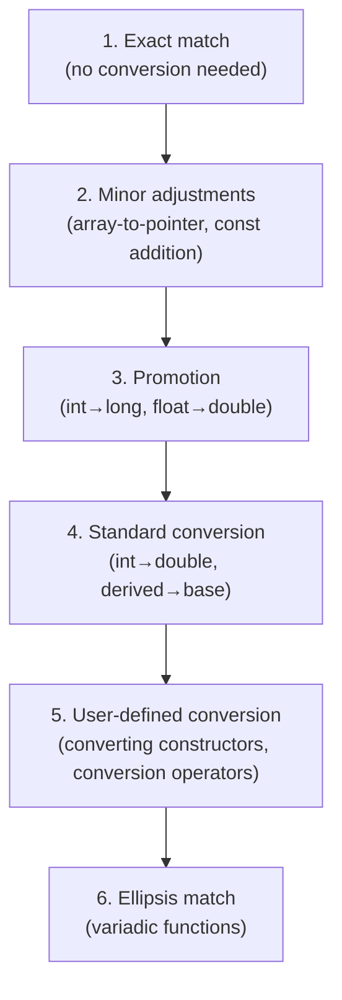

# Function Overloading

> Function overloading lets you give the same name to multiple functions that differ in their parameters, creating a consistent interface that adapts to different types and argument counts without forcing callers to remember different names.

## Table of Contents
- [Core Concepts](#core-concepts)
- [Code Examples](#code-examples)
- [Common Pitfalls](#common-pitfalls)
- [Key Takeaways](#key-takeaways)
- [Exercises](#exercises)

## Core Concepts

### What Is Function Overloading?

#### What

Function overloading means defining multiple functions with the **same name** but different **parameter lists** within the same scope. The compiler distinguishes between them based on the number, types, and qualifiers of the arguments at the call site. This is a compile-time mechanism — there is zero runtime cost.

```cpp
int    area(int side);                 // square
int    area(int width, int height);    // rectangle
double area(double radius);            // circle
```

All three functions are named `area`. When you write `area(5)`, the compiler sees a single `int` argument and selects the first overload. When you write `area(3, 4)`, it selects the second. When you write `area(2.5)`, it selects the third. This happens entirely at compile time — the generated machine code calls the exact function directly, as if each had a unique name.

#### How

Under the hood, the compiler performs **name mangling** (also called name decoration). Each overloaded function gets a unique internal name that encodes the parameter types. For example, `area(int)` might become `_Z4areai`, while `area(int, int)` becomes `_Z4areaii`. The linker uses these mangled names to resolve calls. You never see this unless you inspect object files, but it explains why overloading works: from the linker's perspective, these are different functions with different names.

#### Why It Matters

Without overloading, you'd need distinct names for each variant: `area_square`, `area_rectangle`, `area_circle`. This forces callers to know the implementation detail of *which shape* they're computing. Overloading shifts that burden to the compiler. The caller writes `area(...)` and the compiler picks the right implementation. This is the principle of **uniform interface** — the same operation, expressed the same way, regardless of the types involved.

This isn't just syntactic sugar. It's a design principle that scales. The entire C++ Standard Library depends on overloading: `std::abs` works on `int`, `long`, `float`, `double` — all with the same name. `std::to_string` converts any numeric type. Without overloading, the STL would be a nightmare of type-suffixed function names (like C's `abs`, `labs`, `fabs`, `fabsf`).

### What Counts as a Different Overload

#### What

Two function declarations are considered different overloads if they differ in:

1. **Number of parameters**: `f(int)` vs `f(int, int)`
2. **Parameter types**: `f(int)` vs `f(double)`
3. **Const/volatile qualification of parameters** (for references and pointers): `f(const int&)` vs `f(int&)`

Things that do **not** create a different overload:

- **Return type alone**: `int f(int)` and `double f(int)` cannot coexist — this is a compilation error.
- **Top-level const on value parameters**: `f(int)` and `f(const int)` are the same signature because the caller can't tell the difference — the `const` only affects the function body.
- **Parameter names**: `f(int x)` and `f(int y)` are identical.

#### How

The reason return type doesn't participate in overloading is that function calls can ignore the return value. If you write `f(5);` without using the result, the compiler has no way to determine which overload you intended. The parameter list is always unambiguous at the call site; the return type is not.

Top-level `const` on value parameters doesn't matter because C++ passes by value — the function gets its own copy. Whether the copy is `const` inside the function body is invisible to the caller.

#### Why It Matters

Understanding what constitutes a valid overload set prevents compilation errors and design mistakes. If you try to overload on return type alone, the compiler will reject it with a clear error. But some invalid overloads are more subtle — like top-level const on value parameters — and can lead to "function already defined" linker errors that are confusing if you don't know the rule.

### Overload Resolution — How the Compiler Chooses

#### What

When you call an overloaded function, the compiler follows a three-step process called **overload resolution** to pick the best match:

1. **Build the candidate set** — find all functions with the matching name that are visible at the call site.
2. **Filter to viable candidates** — keep only those where each argument can be converted to the corresponding parameter type.
3. **Rank the viable candidates** — pick the "best" one based on conversion quality.

If no candidate is viable, you get a "no matching function" error. If multiple candidates tie as "best," you get an "ambiguous call" error.

#### How

The ranking in step 3 uses a hierarchy of conversion quality. From best to worst:



**Exact match** is the best: the argument type matches the parameter type perfectly, no conversion required. **Promotion** is a widening that preserves the value (`short` to `int`, `float` to `double`). **Standard conversion** is any other built-in conversion (`int` to `double`, pointer to base class, etc.). **User-defined conversion** involves calling a constructor or conversion operator you defined.

The key rule: **the compiler picks the candidate that requires the least "expensive" conversions across all arguments**. If candidate A is better for argument 1 but candidate B is better for argument 2, with neither being overall better, the call is ambiguous.

#### Why It Matters

Overload resolution is the most complex part of the C++ standard for a reason — it determines what code actually runs when you call a function. Most of the time, the compiler does what you expect. But in edge cases — mixing signed/unsigned types, having implicit conversions, or combining default arguments with overloads — the result can be surprising. Understanding the ranking hierarchy lets you predict the compiler's behavior and, more importantly, design overload sets that are unambiguous.

### Default Arguments and Overloading

#### What

Default arguments let you provide fallback values for trailing parameters. They interact with overloading in ways that can create ambiguity.

```cpp
void log(const std::string& msg, int level = 0);  // default level
void log(const std::string& msg);                  // separate overload
```

These two declarations create an ambiguous overload set. Calling `log("hello")` could match either — the first with the default argument, or the second directly. The compiler will refuse to compile this.

#### How

Default arguments are syntactic sugar for the caller, not for the compiler's overload resolution. A function with defaults generates one entry in the overload set per unique callable signature. `void f(int a, int b = 0)` can be called as `f(1)` or `f(1, 2)`, which makes it overlap with any `f(int)` overload.

#### Why It Matters

The practical rule: **don't combine default arguments with overloads that could match the same call**. Either use overloads *or* default arguments for a given parameter, not both. Default arguments are best when the defaulted parameters are truly optional and don't change the fundamental operation. Overloads are best when different parameter lists imply different behavior.

### Overloading with `const` and References

#### What

Overloading on `const`-ness of reference parameters is one of the most important patterns in C++. It lets you provide different implementations for mutable and immutable access:

```cpp
int& operator[](std::size_t index);             // for non-const objects
const int& operator[](std::size_t index) const; // for const objects
```

When you call `operator[]` on a `const` object (or through a `const` reference), the compiler selects the `const` overload. On a non-const object, it selects the non-const overload. This is how `std::vector`, `std::map`, and virtually every container in the STL work.

#### How

The `const` at the end of a member function signature qualifies the implicit `this` pointer. In the non-const overload, `this` is `MyClass*`. In the const overload, `this` is `const MyClass*`. Overload resolution treats these as different parameter types (because `this` is effectively a hidden first parameter), so the two overloads are distinct.

#### Why It Matters

This is not just a convenience — it's a correctness mechanism. If you have a `const` reference to a container, you should be able to read elements but not modify them. The const overload returns a `const` reference, enforcing this at compile time. Without const-qualified overloads, you'd either give everyone mutable access (unsafe) or make everything immutable (unusable). This duality is at the heart of C++ const-correctness.

## Code Examples

### Basic Function Overloading

```cpp
#include <cmath>
#include <iostream>
#include <string>

// Overloaded area functions — same concept, different shapes.
// The caller writes "area(...)" and the compiler picks the right one.

constexpr int area(int side) {
    // Square: one parameter → area = side^2
    return side * side;
}

constexpr int area(int width, int height) {
    // Rectangle: two parameters → area = width * height
    return width * height;
}

double area(double radius) {
    // Circle: one double parameter → area = pi * r^2
    // Not constexpr because M_PI is not guaranteed constexpr in all implementations
    return M_PI * radius * radius;
}

int main() {
    // The compiler selects the overload based on argument types and count.
    // No runtime dispatch — each call compiles to a direct function call.
    std::cout << "Square (5):           " << area(5) << '\n';        // calls area(int)
    std::cout << "Rectangle (3 x 4):    " << area(3, 4) << '\n';    // calls area(int, int)
    std::cout << "Circle (r=2.5):       " << area(2.5) << '\n';     // calls area(double)

    // What happens with area(3.0, 4.0)? There's no area(double, double) overload.
    // The compiler would try to convert both doubles to int (standard conversion)
    // and call area(int, int). This compiles but may warn about narrowing.
    // If you need this, add an explicit overload for area(double, double).

    return 0;
}
```

### Overload Resolution in Action

```cpp
#include <iostream>
#include <string>

// Three overloads that demonstrate the conversion ranking hierarchy.

void process(int value) {
    std::cout << "process(int): " << value << '\n';
}

void process(double value) {
    std::cout << "process(double): " << value << '\n';
}

void process(const std::string& value) {
    std::cout << "process(string): " << value << '\n';
}

int main() {
    process(42);          // Exact match → process(int)
    process(3.14);        // Exact match → process(double)
    process("hello");     // User-defined conversion: const char* → std::string
                          // → process(const std::string&)

    // Promotion: short → int (promotion is cheaper than int → double conversion)
    short s = 10;
    process(s);           // Calls process(int), NOT process(double)

    // float → double is a promotion; float → int is a standard conversion.
    // Promotion wins.
    float f = 2.5f;
    process(f);           // Calls process(double), NOT process(int)

    // long → int is a standard conversion; long → double is also standard conversion.
    // With just these two numeric overloads, this would be ambiguous on some platforms.
    // On platforms where long and int are the same size, it's an exact match to process(int).
    long l = 100L;
    process(l);           // Typically calls process(int) on most platforms

    return 0;
}
```

### Overloading with `const` References

```cpp
#include <iostream>
#include <string>
#include <vector>

class IntBuffer {
public:
    explicit IntBuffer(std::initializer_list<int> values)
        : data_(values) {}

    // Non-const overload: called on mutable IntBuffer objects.
    // Returns a mutable reference — caller can modify the element.
    int& at(std::size_t index) {
        std::cout << "  [non-const at() called]\n";
        check_bounds(index);
        return data_[index];
    }

    // Const overload: called on const IntBuffer objects or through const references.
    // Returns a const reference — caller can only read.
    const int& at(std::size_t index) const {
        std::cout << "  [const at() called]\n";
        check_bounds(index);
        return data_[index];
    }

    std::size_t size() const { return data_.size(); }

private:
    std::vector<int> data_;

    void check_bounds(std::size_t index) const {
        if (index >= data_.size()) {
            throw std::out_of_range("IntBuffer::at — index out of range");
        }
    }
};

// This function takes a const reference — it can only call const member functions.
void print_first(const IntBuffer& buf) {
    std::cout << "First element: " << buf.at(0) << '\n';  // calls const at()
}

int main() {
    IntBuffer buf = {10, 20, 30};

    // Non-const object → non-const overload selected
    std::cout << "Reading from mutable buffer:\n";
    std::cout << "Value: " << buf.at(1) << '\n';

    // Mutation through non-const overload
    std::cout << "Modifying element:\n";
    buf.at(1) = 99;
    std::cout << "New value: " << buf.at(1) << '\n';

    // Const reference → const overload selected
    std::cout << "Reading through const reference:\n";
    print_first(buf);

    // const IntBuffer → only const overload is available
    const IntBuffer cbuf = {100, 200};
    std::cout << "Reading from const buffer:\n";
    std::cout << "Value: " << cbuf.at(0) << '\n';

    // cbuf.at(0) = 42;  // ERROR: cannot assign to return value of const at()

    return 0;
}
```

### Overloading with `std::string_view` for Performance

```cpp
#include <iostream>
#include <string>
#include <string_view>

// A practical example: a logging function overloaded to avoid unnecessary allocations.

// Primary overload: accepts string_view for zero-copy reads.
// This handles string literals, std::string, and any contiguous character range
// without allocating memory.
void log_message(std::string_view msg, std::string_view level = "INFO") {
    std::cout << "[" << level << "] " << msg << '\n';
}

// Overload for cases where we need to own/modify the string (e.g., add a prefix).
// Taking by value lets the caller move an rvalue string in without copying.
std::string format_error(std::string msg) {
    msg.insert(0, "ERROR: ");
    return msg;
}

int main() {
    // All of these call the string_view overload — no heap allocation for the argument.
    log_message("Server started");                            // const char* → string_view
    log_message(std::string("Connection established"));       // std::string → string_view
    log_message("Disk space low", "WARN");                    // two string_view params

    // The by-value overload lets us move a temporary string without copying.
    std::string error = format_error("file not found");       // moves the temporary in
    std::cout << error << '\n';

    return 0;
}
```

## Common Pitfalls

### Ambiguous overloads with implicit conversions

```cpp
// BAD — ambiguous call: compiler can't decide between int→long and int→double
#include <iostream>

void calculate(long value) {
    std::cout << "long: " << value << '\n';
}

void calculate(double value) {
    std::cout << "double: " << value << '\n';
}

int main() {
    calculate(42);  // ERROR: ambiguous — int→long and int→double are both
                    // standard conversions with the same rank.
    return 0;
}
```

Both `int` to `long` and `int` to `double` are standard conversions — neither is ranked higher than the other. The compiler cannot choose and reports an ambiguity error. The fix is to either add an `int` overload (providing an exact match) or explicitly cast at the call site.

```cpp
// GOOD — add an int overload to provide an exact match
#include <iostream>

void calculate(int value) {
    std::cout << "int: " << value << '\n';
}

void calculate(long value) {
    std::cout << "long: " << value << '\n';
}

void calculate(double value) {
    std::cout << "double: " << value << '\n';
}

int main() {
    calculate(42);    // Exact match → calculate(int)
    calculate(42L);   // Exact match → calculate(long)
    calculate(42.0);  // Exact match → calculate(double)
    return 0;
}
```

### Overlapping default arguments and overloads

```cpp
// BAD — default argument creates overlap with another overload
#include <iostream>
#include <string>

void log(const std::string& msg, int level = 0) {
    std::cout << "[" << level << "] " << msg << '\n';
}

void log(const std::string& msg) {
    std::cout << "[DEFAULT] " << msg << '\n';
}

int main() {
    log("hello", 1);  // OK — only matches the first overload
    log("hello");      // ERROR: ambiguous — matches both overloads
    return 0;
}
```

The call `log("hello")` matches `log(const std::string&, int)` with the default argument, and also matches `log(const std::string&)` as an exact match. The compiler treats these as equally good and refuses to compile. The fix: choose one approach or the other.

```cpp
// GOOD — use either default arguments OR overloads, not both for the same parameter
#include <iostream>
#include <string>

// Option A: single function with a default argument
void log(const std::string& msg, int level = 0) {
    std::cout << "[" << level << "] " << msg << '\n';
}

// Option B: two overloads with different behavior (if the default case truly differs)
// void log(const std::string& msg) { ... different behavior ... }
// void log(const std::string& msg, int level) { ... }

int main() {
    log("hello");     // Uses default level = 0
    log("hello", 1);  // Explicit level
    return 0;
}
```

### Assuming return type participates in overloading

```cpp
// BAD — can't overload on return type alone
#include <string>

int    parse(const std::string& input) { return std::stoi(input); }
double parse(const std::string& input) { return std::stod(input); }  // ERROR: redefinition

int main() {
    int x = parse("42");      // Which parse()?
    double y = parse("3.14"); // The compiler can't use the assignment target to choose.
    return 0;
}
```

The compiler sees two functions with identical parameter lists. The return type is not part of the function signature for overloading purposes. Even though you might think `int x = parse(...)` should call the `int` version, C++ does not resolve overloads based on how the return value is used.

```cpp
// GOOD — use different names, or a template with explicit type parameter
#include <iostream>
#include <string>

// Option A: different names (clearest approach)
int    parse_int(const std::string& input) { return std::stoi(input); }
double parse_double(const std::string& input) { return std::stod(input); }

// Option B: template with explicit instantiation (more advanced — covered in Week 15)
// template <typename T>
// T parse(const std::string& input);
// template <> int parse<int>(const std::string& input) { return std::stoi(input); }
// template <> double parse<double>(const std::string& input) { return std::stod(input); }
// Usage: parse<int>("42"), parse<double>("3.14")

int main() {
    std::cout << parse_int("42") << '\n';
    std::cout << parse_double("3.14") << '\n';
    return 0;
}
```

### Overloading across scopes (name hiding)

```cpp
// BAD — derived class hides base class overloads instead of extending them
#include <iostream>

class Base {
public:
    void process(int x) {
        std::cout << "Base::process(int): " << x << '\n';
    }
    void process(double x) {
        std::cout << "Base::process(double): " << x << '\n';
    }
};

class Derived : public Base {
public:
    // This HIDES both Base::process overloads, not just the int version.
    // Name lookup stops as soon as it finds a match in the current scope.
    void process(int x) {
        std::cout << "Derived::process(int): " << x << '\n';
    }
};

int main() {
    Derived d;
    d.process(42);    // OK — calls Derived::process(int)
    d.process(3.14);  // Calls Derived::process(int)! Base::process(double) is hidden.
                      // The double is silently narrowed to int.
    return 0;
}
```

This is one of the most surprising behaviors in C++. When a derived class declares a function with the same name as a base class function, it **hides all** base class overloads with that name — not just the one with the matching signature. The fix: use a `using` declaration to bring the base class overloads into scope.

```cpp
// GOOD — use 'using' to bring base class overloads into the derived class scope
#include <iostream>

class Base {
public:
    void process(int x) {
        std::cout << "Base::process(int): " << x << '\n';
    }
    void process(double x) {
        std::cout << "Base::process(double): " << x << '\n';
    }
};

class Derived : public Base {
public:
    using Base::process;  // Bring ALL Base::process overloads into scope

    void process(int x) {
        std::cout << "Derived::process(int): " << x << '\n';
    }
};

int main() {
    Derived d;
    d.process(42);    // Calls Derived::process(int) — overrides the base version
    d.process(3.14);  // Calls Base::process(double) — now visible via 'using'
    return 0;
}
```

## Key Takeaways

- **Function overloading is a compile-time mechanism** with zero runtime cost — the compiler selects the right function at compile time via name mangling, generating a direct call to the chosen overload.
- **Overload on parameter types and count, never on return type** — return type is not part of the function signature for overloading. If you need different return types, use different names or templates.
- **Overload resolution follows a strict ranking**: exact match > promotion > standard conversion > user-defined conversion. When two candidates tie at the same rank, the call is ambiguous.
- **Don't mix default arguments with overloads** that could match the same call — it creates ambiguity that the compiler cannot resolve.
- **In class hierarchies, a derived class function hides all base class overloads** with the same name. Use `using Base::function_name;` to restore visibility of the hidden overloads.

## Exercises

1. Given the following overloads, determine which function is called for each invocation and explain why. If any call is ambiguous, explain why.
   ```cpp
   void f(int x);
   void f(double x);
   void f(int x, int y);
   // Calls: f(5), f(5.0), f(5, 10), f(5.0f), f('a'), f(5L)
   ```

2. Explain why `int compute(int x)` and `double compute(int x)` cannot coexist as overloads. Propose two different solutions to provide both behaviors.

3. Write a `print` function overloaded for `int`, `double`, `const std::string&`, and `bool`. The `bool` overload should print "true" or "false" (not 1 or 0). Test all four overloads in `main()` and explain which overload resolution rule applies to each call.

4. Consider this code:
   ```cpp
   class Base {
   public:
       void draw(int x) { /* ... */ }
       void draw(double x) { /* ... */ }
   };
   class Derived : public Base {
       void draw(std::string s) { /* ... */ }
   };
   ```
   What happens when you call `Derived d; d.draw(42);`? Explain the problem and fix it.

5. Write an overload set for a function `clamp` that works on `int`, `double`, and `char` values. Each overload takes a value, a minimum, and a maximum, and returns the value constrained to `[min, max]`. Make the functions `constexpr` where possible. Explain why you chose each parameter type (value vs const reference).

---
up:: [Schedule](../../Schedule.md)
#type/learning #source/self-study #status/evergreen
