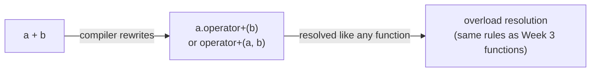

# Operator Overloading

> Operator overloading lets you define how built-in operators like `+`, `==`, `<<`, and `[]` behave on your custom types, making user-defined types feel as natural and expressive as built-in types.

## Table of Contents
- [Core Concepts](#core-concepts)
- [Code Examples](#code-examples)
- [Common Pitfalls](#common-pitfalls)
- [Key Takeaways](#key-takeaways)
- [Exercises](#exercises)

## Core Concepts

### What Is Operator Overloading?

#### What

Operator overloading is a form of function overloading where the "function name" is an operator symbol. When you write `a + b`, the compiler translates it to a function call: either `a.operator+(b)` (member function) or `operator+(a, b)` (free function). By defining these `operator` functions for your types, you teach the compiler what `+`, `==`, `<<`, and other operators mean for your objects.

C++ allows you to overload most operators, including:

| Category | Operators |
|----------|-----------|
| Arithmetic | `+`, `-`, `*`, `/`, `%` |
| Comparison | `==`, `!=`, `<`, `>`, `<=`, `>=` |
| Assignment | `=`, `+=`, `-=`, `*=`, `/=` |
| Increment/Decrement | `++`, `--` (prefix and postfix) |
| Subscript | `[]` |
| Function call | `()` |
| Stream I/O | `<<`, `>>` |
| Dereference/Arrow | `*`, `->` |

You **cannot** overload: `::` (scope resolution), `.` (member access), `.*` (member pointer access), `?:` (ternary), or `sizeof`.

#### How

An overloaded operator is just a function with a special name. The compiler rewrites operator expressions into function calls during compilation:



This means all the overload resolution rules you learned for regular functions apply identically to operators. The compiler builds a candidate set, filters viable candidates, ranks by conversion quality, and selects the best match.

#### Why It Matters

Operator overloading exists because C++ treats user-defined types as first-class citizens. A `Vector3D` should support `+` because vector addition is a fundamental, universally understood operation. A `Matrix` should support `*` because matrix multiplication has an unambiguous mathematical meaning. When your types support the same operators as built-in types, code that uses them reads like the domain it models — physics code reads like physics, linear algebra code reads like linear algebra.

This is not about convenience — it's about **expressiveness**. Compare:

```cpp
// Without operator overloading
auto result = add(scale(velocity, dt), acceleration);

// With operator overloading
auto result = velocity * dt + acceleration;
```

The second version is not just shorter — it's directly recognizable as a physics equation. The cognitive load drops dramatically because the notation matches the reader's existing mental model.

### When to Overload Operators

#### What

The guiding principle is simple: **overload an operator only when its meaning for your type is immediately obvious and unsurprising**. If you need to consult documentation to understand what `+` does for a type, it shouldn't be overloaded.

Good candidates for operator overloading:
- **Mathematical types**: vectors, matrices, complex numbers, big integers — operators map directly to mathematical operations.
- **Wrapper types**: smart pointers (`*`, `->`), iterators (`++`, `*`, `==`), optional-like types (`*`, `bool`).
- **Comparison**: any type with a natural ordering or equality concept.
- **Stream I/O**: `<<` and `>>` for types that need printing/parsing.
- **Subscript**: container-like types that provide indexed access.

Bad candidates:
- **Unrelated semantics**: `+` for concatenating things that aren't sequences (e.g., `Employee + Employee`).
- **Side effects masquerading as operators**: `*` that sends a network request, `+` that modifies a database.
- **Operator abuse for DSLs**: overloading `|` or `>>` to create pipeline syntax when the meaning diverges from the operator's conventional purpose.

#### Why It Matters

C++ gives you the freedom to make `+` do anything — print to a file, launch a thread, delete a database. Just because you *can* doesn't mean you *should*. The entire value of operator overloading comes from the assumption that operators do what they look like. The moment `+` does something unexpected, every line that uses `+` becomes a landmine. The rule isn't arbitrary — it's about maintaining the contract between the code author and the code reader.

A useful litmus test: if you removed all the types and left just the operators, would the expression still make intuitive sense? `velocity * dt + acceleration` — yes, that looks like arithmetic. `employee + department` — no, what would that even mean?

### Member Function vs Free Function

#### What

You can implement an overloaded operator in two ways:

1. **Member function**: `T T::operator+(const T& rhs) const` — the left-hand operand is `*this`.
2. **Free function**: `T operator+(const T& lhs, const T& rhs)` — both operands are explicit parameters.

The choice matters for a specific reason: **implicit conversions on the left-hand operand**.

#### How

When an operator is a member function, the left-hand operand must already be the correct type — no implicit conversion is applied to `*this`. When it's a free function, both operands can undergo implicit conversion.

```cpp
class Meters {
public:
    Meters(double value) : value_(value) {}  // implicit converting constructor

    // Member operator+: *this must already be Meters
    Meters operator+(const Meters& rhs) const {
        return Meters(value_ + rhs.value_);
    }

private:
    double value_;
};

// This works:   Meters(3.0) + Meters(4.0)  →  this = Meters(3.0), rhs = Meters(4.0)
// This works:   Meters(3.0) + 4.0           →  this = Meters(3.0), rhs = Meters(4.0) via conversion
// This FAILS:   3.0 + Meters(4.0)           →  3.0 is not a Meters, can't call member operator+
```

If `operator+` were a free function, `3.0 + Meters(4.0)` would work because both operands can undergo implicit conversion.

#### Why It Matters

This asymmetry matters for mathematical types. Addition is commutative — `a + b` should equal `b + a`. If your `operator+` is a member function and your type has a converting constructor from `double`, then `meters + 3.0` works but `3.0 + meters` doesn't. This breaks the mathematical expectation and confuses users. For symmetric binary operators (`+`, `-`, `*`, `/`, `==`, `!=`, `<`, etc.), prefer free functions.

Use member functions for operators where the left-hand operand is always your type: `=` (assignment), `+=` (compound assignment), `[]` (subscript), `()` (function call), `->` (arrow), and type conversion operators. These operators inherently operate on `*this` and don't need implicit conversion on the left side.

### Friend Functions

#### What

A **friend function** is a free function that is granted access to a class's private and protected members. It's declared inside the class body with the `friend` keyword but is not a member function — it lives in the enclosing namespace.

```cpp
class Vec2 {
public:
    Vec2(double x, double y) : x_(x), y_(y) {}

    // Declared inside the class, but this is a FREE function in the enclosing namespace.
    // It can access x_ and y_ because it's a friend.
    friend Vec2 operator+(const Vec2& lhs, const Vec2& rhs) {
        return Vec2(lhs.x_ + rhs.x_, lhs.y_ + rhs.y_);
    }

private:
    double x_, y_;
};
```

#### How

The `friend` declaration does two things:

1. Grants the function access to private members — without it, a free function couldn't read `x_` and `y_`.
2. Places the function definition in the enclosing namespace — even though it's written inside the class body.

This is not special syntax for operator overloading — `friend` works for any function. But it's especially common with operators because operators are often free functions (for symmetry) that need access to private data.

An alternative to `friend` is providing public accessors (`double x() const { return x_; }`) and implementing the operator purely through the public interface. This is arguably cleaner in terms of encapsulation but adds boilerplate. The trade-off is a judgment call — for tightly coupled operations like arithmetic, `friend` is the idiomatic choice.

#### Why It Matters

`friend` is the mechanism that reconciles two competing goals: (1) operators should be free functions for symmetry, and (2) operators often need access to private data for efficiency. Without `friend`, you'd be forced to either make data public (destroying encapsulation) or add getters for every internal field (adding boilerplate and potential overhead). `friend` is the targeted escape hatch.

Use `friend` deliberately. It's not "breaking encapsulation" — it's extending the interface of the class to include specific free functions that are logically part of the type's operations. A `friend operator+` is just as much part of `Vec2`'s interface as a member function would be.

### The Compound Assignment Pattern

#### What

The idiomatic way to implement binary arithmetic operators in C++ is to build them on top of compound assignment operators. Define `operator+=` as a member function, then define `operator+` as a free function that delegates to it:

```cpp
// Step 1: compound assignment as a member function (modifies *this)
Vec2& Vec2::operator+=(const Vec2& rhs) {
    x_ += rhs.x_;
    y_ += rhs.y_;
    return *this;
}

// Step 2: binary operator as a free function (creates a new value)
Vec2 operator+(Vec2 lhs, const Vec2& rhs) {
    lhs += rhs;   // reuse the compound assignment
    return lhs;
}
```

Notice that `operator+` takes `lhs` **by value**, not by const reference. This is intentional — the caller's copy is used as the accumulator, avoiding an explicit temporary.

#### How

This pattern works because `a + b` semantically means "copy `a`, add `b` to the copy, return the copy." Taking `lhs` by value gives us the copy for free (the compiler may even elide it). Then `lhs += rhs` does the actual work, and we return the modified copy.

#### Why It Matters

This pattern eliminates code duplication. The actual addition logic lives in one place: `operator+=`. The binary `operator+` is a thin wrapper that creates a copy and delegates. If you ever change how addition works (e.g., adding normalization or bounds checking), you change it in one place. This is the standard pattern used throughout the C++ Standard Library and in professional codebases.

### The Stream Insertion Operator (`<<`)

#### What

The `<<` operator is used with `std::ostream` to output your types. It must be a **free function** (not a member function) because the left-hand operand is `std::ostream`, not your type. You can't add member functions to `std::ostream` — it's a Standard Library class.

```cpp
std::ostream& operator<<(std::ostream& os, const Vec2& v);
```

The return type is `std::ostream&` — this enables chaining: `std::cout << v1 << " and " << v2`. Each `<<` returns the stream, which becomes the left operand of the next `<<`.

#### How

You typically declare `operator<<` as a `friend` of your class so it can access private members:

```cpp
class Vec2 {
    // ...
    friend std::ostream& operator<<(std::ostream& os, const Vec2& v) {
        os << "(" << v.x_ << ", " << v.y_ << ")";
        return os;  // MUST return the stream for chaining
    }
};
```

Alternatively, provide a public `print` or `to_string` member function and have `operator<<` call it — this avoids `friend` at the cost of an extra layer.

#### Why It Matters

Without `operator<<`, every time you want to print your type, you write manual field-by-field output. With it, your type integrates seamlessly with the entire `iostream` ecosystem — `std::cout`, `std::ofstream`, `std::ostringstream`, and any other `std::ostream`-derived class. You define the output format once, and it works everywhere streams are used.

## Code Examples

### Complete Vector2D with Arithmetic Operators

```cpp
#include <cmath>
#include <iostream>

class Vec2 {
public:
    // Constructors
    constexpr Vec2() : x_(0.0), y_(0.0) {}
    constexpr Vec2(double x, double y) : x_(x), y_(y) {}

    // Accessors (const-correct)
    constexpr double x() const { return x_; }
    constexpr double y() const { return y_; }

    // Magnitude (length) of the vector
    double magnitude() const {
        return std::sqrt(x_ * x_ + y_ * y_);
    }

    // --- Compound assignment operators (member functions) ---
    // These modify *this and return a reference for chaining.

    Vec2& operator+=(const Vec2& rhs) {
        x_ += rhs.x_;
        y_ += rhs.y_;
        return *this;
    }

    Vec2& operator-=(const Vec2& rhs) {
        x_ -= rhs.x_;
        y_ -= rhs.y_;
        return *this;
    }

    // Scalar multiplication: vec *= scalar
    Vec2& operator*=(double scalar) {
        x_ *= scalar;
        y_ *= scalar;
        return *this;
    }

    // Unary minus: negate the vector
    constexpr Vec2 operator-() const {
        return Vec2(-x_, -y_);
    }

    // --- Comparison operators (free friend functions for symmetry) ---

    friend constexpr bool operator==(const Vec2& lhs, const Vec2& rhs) {
        // Note: floating-point equality comparison — acceptable for exact-value types
        // like integer coordinates, but use epsilon comparison for computed values.
        return lhs.x_ == rhs.x_ && lhs.y_ == rhs.y_;
    }

    friend constexpr bool operator!=(const Vec2& lhs, const Vec2& rhs) {
        return !(lhs == rhs);  // Implement in terms of ==
    }

    // --- Stream insertion (free friend function) ---

    friend std::ostream& operator<<(std::ostream& os, const Vec2& v) {
        os << "(" << v.x_ << ", " << v.y_ << ")";
        return os;
    }

private:
    double x_;
    double y_;
};

// --- Binary arithmetic operators (free functions, delegate to compound assignment) ---

// Takes lhs by VALUE — the copy is our working accumulator.
Vec2 operator+(Vec2 lhs, const Vec2& rhs) {
    lhs += rhs;
    return lhs;
}

Vec2 operator-(Vec2 lhs, const Vec2& rhs) {
    lhs -= rhs;
    return lhs;
}

// Scalar * Vec2 — scalar on the left
Vec2 operator*(double scalar, Vec2 v) {
    v *= scalar;
    return v;
}

// Vec2 * scalar — scalar on the right (commutative, so delegate)
Vec2 operator*(Vec2 v, double scalar) {
    v *= scalar;
    return v;
}

int main() {
    const Vec2 a(3.0, 4.0);
    const Vec2 b(1.0, 2.0);

    // Arithmetic reads like math
    const Vec2 sum = a + b;
    const Vec2 diff = a - b;
    const Vec2 scaled = 2.0 * a;        // scalar on left  — free function
    const Vec2 scaled2 = a * 3.0;       // scalar on right — free function

    std::cout << "a       = " << a << '\n';
    std::cout << "b       = " << b << '\n';
    std::cout << "a + b   = " << sum << '\n';
    std::cout << "a - b   = " << diff << '\n';
    std::cout << "2 * a   = " << scaled << '\n';
    std::cout << "a * 3   = " << scaled2 << '\n';
    std::cout << "-a      = " << -a << '\n';
    std::cout << "|a|     = " << a.magnitude() << '\n';

    // Chaining works because operators return values
    const Vec2 physics = a + b * 0.5;  // b scaled, then added to a
    std::cout << "a + b*0.5 = " << physics << '\n';

    // Comparison
    std::cout << std::boolalpha;
    std::cout << "a == b? " << (a == b) << '\n';
    std::cout << "a != b? " << (a != b) << '\n';
    std::cout << "a == a? " << (a == a) << '\n';

    return 0;
}
```

### Subscript Operator for a Custom Container

```cpp
#include <cstddef>
#include <iostream>
#include <stdexcept>
#include <string>
#include <vector>

// A named-column table row — access columns by name using operator[].
// Demonstrates overloading [] with different parameter types.
class Row {
public:
    Row(std::vector<std::string> columns, std::vector<std::string> values)
        : columns_(std::move(columns)), values_(std::move(values)) {
        if (columns_.size() != values_.size()) {
            throw std::invalid_argument("Column count must match value count");
        }
    }

    // operator[] by index — fast, no lookup needed
    const std::string& operator[](std::size_t index) const {
        if (index >= values_.size()) {
            throw std::out_of_range("Row index out of range");
        }
        return values_[index];
    }

    // operator[] by column name — slower (linear search), but much more readable
    const std::string& operator[](std::string_view column_name) const {
        for (std::size_t i = 0; i < columns_.size(); ++i) {
            if (columns_[i] == column_name) {
                return values_[i];
            }
        }
        throw std::out_of_range(
            std::string("Unknown column: ") + std::string(column_name));
    }

    // Stream insertion for easy debugging
    friend std::ostream& operator<<(std::ostream& os, const Row& row) {
        os << "{ ";
        for (std::size_t i = 0; i < row.columns_.size(); ++i) {
            if (i > 0) os << ", ";
            os << row.columns_[i] << ": " << row.values_[i];
        }
        os << " }";
        return os;
    }

private:
    std::vector<std::string> columns_;
    std::vector<std::string> values_;
};

int main() {
    Row row(
        {"name", "age", "city"},
        {"Alice", "30", "Taipei"}
    );

    std::cout << "Full row: " << row << '\n';

    // Access by index — useful in loops
    std::cout << "Column 0: " << row[0] << '\n';

    // Access by name — self-documenting code
    std::cout << "Name: " << row["name"] << '\n';
    std::cout << "City: " << row["city"] << '\n';

    return 0;
}
```

### Comparison Operators with a Natural Ordering

```cpp
#include <iostream>
#include <string>
#include <algorithm>
#include <vector>

// A version number with natural ordering: major.minor.patch.
// Demonstrates implementing a full set of comparison operators
// from a single "three-way" comparison helper.
class Version {
public:
    constexpr Version(int major, int minor, int patch)
        : major_(major), minor_(minor), patch_(patch) {}

    // All comparison operators delegate to this private helper.
    // Returns negative if *this < other, 0 if equal, positive if *this > other.
    // This pattern (introduced before C++20's <=> operator) avoids duplicating
    // comparison logic across six operators.
    constexpr int compare(const Version& other) const {
        if (major_ != other.major_) return major_ - other.major_;
        if (minor_ != other.minor_) return minor_ - other.minor_;
        return patch_ - other.patch_;
    }

    // --- All six comparison operators as friend functions ---
    // Each is a one-liner that delegates to compare().

    friend constexpr bool operator==(const Version& a, const Version& b) {
        return a.compare(b) == 0;
    }
    friend constexpr bool operator!=(const Version& a, const Version& b) {
        return a.compare(b) != 0;
    }
    friend constexpr bool operator<(const Version& a, const Version& b) {
        return a.compare(b) < 0;
    }
    friend constexpr bool operator>(const Version& a, const Version& b) {
        return a.compare(b) > 0;
    }
    friend constexpr bool operator<=(const Version& a, const Version& b) {
        return a.compare(b) <= 0;
    }
    friend constexpr bool operator>=(const Version& a, const Version& b) {
        return a.compare(b) >= 0;
    }

    friend std::ostream& operator<<(std::ostream& os, const Version& v) {
        os << v.major_ << '.' << v.minor_ << '.' << v.patch_;
        return os;
    }

private:
    int major_;
    int minor_;
    int patch_;
};

int main() {
    const Version v1(1, 9, 3);
    const Version v2(1, 10, 0);
    const Version v3(2, 0, 0);

    std::cout << std::boolalpha;
    std::cout << v1 << " < " << v2 << "? " << (v1 < v2) << '\n';   // true
    std::cout << v2 << " < " << v3 << "? " << (v2 < v3) << '\n';   // true
    std::cout << v1 << " == " << v1 << "? " << (v1 == v1) << '\n'; // true

    // Because we defined operator<, std::sort works automatically.
    std::vector<Version> versions = {v3, v1, v2};
    std::sort(versions.begin(), versions.end());

    std::cout << "Sorted: ";
    for (const auto& v : versions) {
        std::cout << v << " ";
    }
    std::cout << '\n';  // 1.9.3 1.10.0 2.0.0

    return 0;
}
```

### Function Call Operator for Stateful Functors

```cpp
#include <iostream>
#include <vector>
#include <algorithm>
#include <string>

// A functor (function object) that counts how many times it's called.
// operator() makes instances callable like functions.
// This is how STL algorithms worked before lambdas (C++11).
class Counter {
public:
    explicit Counter(int threshold) : threshold_(threshold), count_(0) {}

    // operator() — makes Counter callable like a function.
    // Returns true if the value exceeds the threshold.
    bool operator()(int value) {
        ++count_;
        return value > threshold_;
    }

    int count() const { return count_; }

private:
    int threshold_;
    int count_;
};

// A more practical functor: a string formatter that prepends a tag.
class TagFormatter {
public:
    explicit TagFormatter(std::string tag)
        : tag_(std::move(tag)) {}

    // operator() transforms a message by prepending the tag.
    std::string operator()(const std::string& message) const {
        return "[" + tag_ + "] " + message;
    }

private:
    std::string tag_;
};

int main() {
    // --- Counter functor with std::count_if ---
    std::vector<int> values = {1, 5, 3, 8, 2, 9, 4, 7, 6};

    // Counter is passed by value to count_if — STL algorithms copy functors.
    // After the algorithm, the local Counter object was NOT modified (the copy was).
    // To get the count, use the return value of count_if instead.
    Counter above_five(5);
    const auto num_above = std::count_if(values.begin(), values.end(), above_five);
    std::cout << "Values above 5: " << num_above << '\n';  // 3 (8, 9, 7)

    // --- TagFormatter functor ---
    const TagFormatter error_fmt("ERROR");
    const TagFormatter info_fmt("INFO");

    // Functors are called with () just like regular functions
    std::cout << error_fmt("disk full") << '\n';
    std::cout << info_fmt("server started") << '\n';

    // Functors can be passed to algorithms that expect callable objects
    std::vector<std::string> messages = {"connected", "timeout", "retry"};
    std::vector<std::string> tagged;
    tagged.reserve(messages.size());

    std::transform(messages.begin(), messages.end(),
                   std::back_inserter(tagged), info_fmt);

    for (const auto& msg : tagged) {
        std::cout << msg << '\n';
    }

    return 0;
}
```

## Common Pitfalls

### Overloading operators with non-obvious semantics

```cpp
// BAD — what does + mean for an Employee? This is ambiguous and confusing.
#include <string>

class Employee {
public:
    Employee(std::string name, int id) : name_(std::move(name)), id_(id) {}

    // Does this merge employees? Combine salaries? Create a team?
    // Nobody can guess — this operator should not exist.
    Employee operator+(const Employee& other) const {
        return Employee(name_ + " & " + other.name_, id_);
    }

private:
    std::string name_;
    int id_;
};
```

If the meaning of an operator isn't immediately obvious for your type, use a named function instead. The reader shouldn't have to check documentation to understand what `+` does.

```cpp
// GOOD — use a named function when the operation isn't a natural fit for an operator
#include <string>
#include <vector>

class Team {
public:
    void add_member(const std::string& name) {
        members_.push_back(name);
    }
    // ...
private:
    std::vector<std::string> members_;
};
```

### Forgetting to return `*this` from compound assignment operators

```cpp
// BAD — operator+= doesn't return *this, breaking chaining and the delegation pattern
class Vec2 {
public:
    Vec2(double x, double y) : x_(x), y_(y) {}

    void operator+=(const Vec2& rhs) {  // Returns void — wrong!
        x_ += rhs.x_;
        y_ += rhs.y_;
    }

private:
    double x_, y_;
};

// This prevents the standard delegation pattern:
// Vec2 operator+(Vec2 lhs, const Vec2& rhs) {
//     lhs += rhs;
//     return lhs;   // Error: lhs += rhs returns void, but the real problem
// }                 // is that the pattern relies on += modifying lhs in-place
                     // and returning a reference for consistency with built-in types
```

Compound assignment operators (`+=`, `-=`, `*=`, etc.) should return a reference to `*this`. This matches the behavior of built-in types (`int x = 5; x += 3;` — the expression `x += 3` evaluates to the new value of `x`) and enables the delegation pattern for binary operators.

```cpp
// GOOD — return *this from compound assignment
class Vec2 {
public:
    Vec2(double x, double y) : x_(x), y_(y) {}

    Vec2& operator+=(const Vec2& rhs) {  // Returns Vec2& — correct
        x_ += rhs.x_;
        y_ += rhs.y_;
        return *this;
    }

private:
    double x_, y_;
};

// Now the delegation pattern works:
Vec2 operator+(Vec2 lhs, const Vec2& rhs) {
    lhs += rhs;    // Modifies lhs in place
    return lhs;    // Return the modified copy
}
```

### Making binary operators member functions (breaking symmetry)

```cpp
// BAD — operator+ as member function prevents implicit conversion on the left side
class Meters {
public:
    Meters(double value) : value_(value) {}  // implicit converting constructor

    // Member operator+: left operand must already be Meters
    Meters operator+(const Meters& rhs) const {
        return Meters(value_ + rhs.value_);
    }

    double value() const { return value_; }

private:
    double value_;
};

int main() {
    Meters m(5.0);
    auto r1 = m + 3.0;      // OK: 3.0 implicitly converts to Meters
    // auto r2 = 3.0 + m;   // ERROR: 3.0 is not Meters, can't call member operator+
    return 0;
}
```

When a binary operator is a member function, the left-hand operand doesn't undergo implicit conversion. This breaks commutativity for symmetric operations like addition.

```cpp
// GOOD — operator+ as friend free function allows conversion on both sides
class Meters {
public:
    Meters(double value) : value_(value) {}

    Meters& operator+=(const Meters& rhs) {
        value_ += rhs.value_;
        return *this;
    }

    double value() const { return value_; }

    friend Meters operator+(Meters lhs, const Meters& rhs) {
        lhs += rhs;
        return lhs;
    }

private:
    double value_;
};

int main() {
    Meters m(5.0);
    auto r1 = m + 3.0;    // OK: 3.0 → Meters(3.0) on right side
    auto r2 = 3.0 + m;    // OK: 3.0 → Meters(3.0) on left side — symmetric!
    return 0;
}
```

### Implementing `!=` independently from `==`

```cpp
// BAD — separate, inconsistent implementations of == and !=
class Point {
public:
    Point(int x, int y) : x_(x), y_(y) {}

    // Two independent implementations that could get out of sync.
    // If someone adds a z_ member and updates == but forgets !=, you get bugs.
    bool operator==(const Point& rhs) const {
        return x_ == rhs.x_ && y_ == rhs.y_;
    }

    bool operator!=(const Point& rhs) const {
        return x_ != rhs.x_ || y_ != rhs.y_;  // Duplicate logic — maintenance hazard
    }

private:
    int x_, y_;
};
```

Having independent implementations of complementary operators (`==`/`!=`, `<`/`>=`, etc.) is a maintenance hazard. If one is updated but not the other, the operators become inconsistent, leading to logic bugs that are extremely hard to find.

```cpp
// GOOD — implement != in terms of ==
class Point {
public:
    Point(int x, int y) : x_(x), y_(y) {}

    friend bool operator==(const Point& lhs, const Point& rhs) {
        return lhs.x_ == rhs.x_ && lhs.y_ == rhs.y_;
    }

    friend bool operator!=(const Point& lhs, const Point& rhs) {
        return !(lhs == rhs);  // Single source of truth — always consistent
    }

private:
    int x_, y_;
};
```

### Confusing prefix and postfix `++`

```cpp
// BAD — wrong signatures for prefix vs postfix increment
class Counter {
public:
    explicit Counter(int value) : value_(value) {}

    // This looks like prefix, but the user might intend postfix behavior.
    // Without the int dummy parameter, this is prefix.
    Counter operator++() {
        Counter old = *this;
        ++value_;
        return old;  // Returns old value — postfix BEHAVIOR with prefix SYNTAX
    }

private:
    int value_;
};
```

C++ uses a dummy `int` parameter to distinguish postfix from prefix. The prefix version takes no extra parameter and returns a reference. The postfix version takes an unnamed `int` and returns the old value by value.

```cpp
// GOOD — correct signatures for both prefix and postfix
#include <iostream>

class Counter {
public:
    explicit Counter(int value) : value_(value) {}

    // PREFIX ++counter: increment, return the NEW value by reference
    Counter& operator++() {
        ++value_;
        return *this;
    }

    // POSTFIX counter++: save old value, increment, return the OLD value by value
    // The int parameter is a dummy — it's only there to differentiate the signature.
    Counter operator++(int) {
        Counter old = *this;  // Save current state
        ++value_;             // Increment
        return old;           // Return pre-increment state
    }

    friend std::ostream& operator<<(std::ostream& os, const Counter& c) {
        os << c.value_;
        return os;
    }

private:
    int value_;
};

int main() {
    Counter c(10);
    std::cout << "Initial:  " << c << '\n';     // 10
    std::cout << "Prefix:   " << ++c << '\n';   // 11 (increments, returns new)
    std::cout << "Postfix:  " << c++ << '\n';   // 11 (returns old, then increments)
    std::cout << "After:    " << c << '\n';      // 12

    return 0;
}
```

## Key Takeaways

- **Operator overloading is syntactic sugar for function calls** — `a + b` becomes `operator+(a, b)` or `a.operator+(b)`. All normal overload resolution rules apply. There is no magic.
- **Only overload operators when the meaning is immediately obvious** — if the operation doesn't have a natural, intuitive mapping to the operator symbol, use a named function. The litmus test: would a reader understand the expression without seeing the operator's implementation?
- **Use free (friend) functions for symmetric binary operators** (`+`, `-`, `*`, `==`, etc.) to allow implicit conversions on both sides. Use member functions for inherently asymmetric operators (`=`, `+=`, `[]`, `()`, `->`).
- **Build binary operators on compound assignment** — implement `operator+=` as a member function, then implement `operator+` as a free function that copies and delegates to `+=`. This eliminates code duplication and ensures consistency.
- **Implement complementary operators in terms of each other** — `!=` delegates to `==`, `>` delegates to `<`, etc. This guarantees consistency and creates a single source of truth for the comparison logic.

## Exercises

1. Explain why `operator<<` for stream output must be a free function and cannot be a member function of your class. What would happen if you tried to make it a member function?

2. Given a `Fraction` class that stores a numerator and denominator, implement `operator+`, `operator==`, and `operator<<`. Use the compound assignment pattern (implement `+=` first, then `+` in terms of it). Make sure `2 + Fraction(1, 3)` works (hint: think about implicit conversions and where to place your operator).

3. What is the difference between prefix `++` and postfix `++` in terms of: (a) function signature, (b) return type, and (c) performance? Explain why prefix increment is generally preferred in C++.

4. Consider a `Matrix` class. Which of the following operators would be appropriate to overload, and why? For each one you reject, suggest what to use instead.
   - `operator+` (matrix addition)
   - `operator*` (matrix multiplication)
   - `operator^` (matrix exponentiation)
   - `operator==` (matrix equality)
   - `operator!` (matrix inverse)

5. Write a `Temperature` class that stores a value in Celsius. Implement `operator+`, `operator-`, `operator==`, `operator<`, `operator<<`, and a compound `operator+=`. Ensure that `25.0 + Temperature(10)` works. Add a `to_fahrenheit()` const member function. Write a `main()` that demonstrates all operators and sorts a `std::vector<Temperature>` using `std::sort`.

---
up:: [Schedule](../../Schedule.md)
#type/learning #source/self-study #status/evergreen
