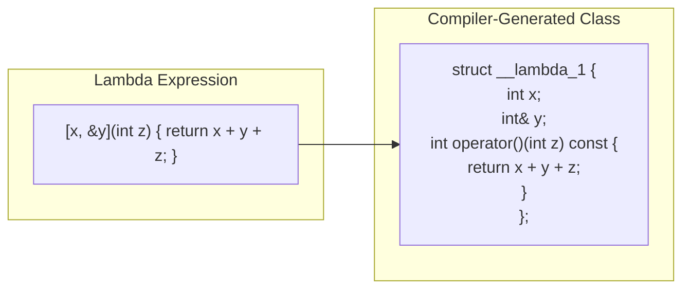

# Lambda Expressions

> Lambdas let you define unnamed functions inline at the point of use, eliminating the boilerplate of functor classes and making code that passes behavior to algorithms dramatically more readable.

## Table of Contents
- [Core Concepts](#core-concepts)
- [Code Examples](#code-examples)
- [Common Pitfalls](#common-pitfalls)
- [Key Takeaways](#key-takeaways)
- [Exercises](#exercises)

## Core Concepts

### What Problem Do Lambdas Solve?

#### What

Before C++11, if you wanted to pass custom behavior to an algorithm like `std::sort`, you had two options: write a standalone function and pass a pointer to it, or write a **functor class** — a class with `operator()` defined. Both approaches force you to define behavior far from where it's used, scattering your intent across multiple locations in the source file.

A lambda is an anonymous function object you define inline, right at the call site. It captures the essence of "do this thing here" without the ceremony of naming, declaring, and defining a separate callable.

#### How

Here is the contrast. Pre-C++11, sorting a vector of strings by length required a functor:

```cpp
// Pre-C++11: a functor class just to sort by length
struct SortByLength {
    bool operator()(const std::string& a, const std::string& b) const {
        return a.size() < b.size();
    }
};

std::sort(words.begin(), words.end(), SortByLength{});
```

With lambdas:

```cpp
// C++11: the same thing, inline, where you use it
std::sort(words.begin(), words.end(),
    [](const std::string& a, const std::string& b) {
        return a.size() < b.size();
    });
```

The lambda version is shorter, but more importantly, the *intent* is right next to the algorithm call. You don't have to scroll up to a separate class definition to understand what the sort does.

#### Why It Matters

Lambdas exist because passing behavior to algorithms is one of the most common patterns in C++. The STL is built around this idea — `std::sort`, `std::find_if`, `std::transform`, `std::remove_if` all take callable objects. Lambdas make these algorithms practical for everyday use instead of being reserved for cases where the verbosity of a functor is justified.

### Lambda Syntax

#### What

A lambda expression has this general form:

```
[captures](parameters) -> return_type { body }
```

- **`[captures]`** — what variables from the enclosing scope the lambda can access (detailed below).
- **`(parameters)`** — the function parameters, just like a regular function. Can be omitted if there are no parameters.
- **`-> return_type`** — the return type. Can be omitted when the compiler can deduce it (which is most of the time).
- **`{ body }`** — the function body.

#### How

The compiler transforms a lambda into an anonymous class with `operator()`. The captures become member variables of that class, and the body becomes the body of `operator()`. This is important: a lambda is *not* a function pointer. It's an object — a closure — that carries state.



#### Why It Matters

Understanding that a lambda is really a compiler-generated class explains everything else about lambdas: why captures exist (they're member variables), why `mutable` is needed to modify captured-by-value variables (because `operator()` is `const` by default), and why each lambda has a unique type (each anonymous class is distinct, even if the body is identical).

### Capture Modes

#### What

The capture clause `[...]` controls which variables from the enclosing scope the lambda can access. There are several forms:

| Capture | Meaning |
|---------|---------|
| `[]` | Capture nothing. The lambda can only use its parameters and globals. |
| `[x]` | Capture `x` by value. The lambda gets a *copy* of `x` at the point the lambda is created. |
| `[&x]` | Capture `x` by reference. The lambda sees the *original* `x` and any changes to it. |
| `[=]` | Capture *all* used variables by value. Convenient but imprecise. |
| `[&]` | Capture *all* used variables by reference. Convenient but dangerous. |
| `[this]` | Capture the `this` pointer. Allows access to member variables and methods. |
| `[*this]` | Capture a *copy* of `*this` (C++17). Safer when the lambda may outlive the object. |
| `[=, &x]` | Capture everything by value, except `x` by reference. |
| `[&, x]` | Capture everything by reference, except `x` by value. |

#### How

Capture by value creates an independent copy at the point where the lambda is created (not where it's called). This means if you capture `x` by value and then modify `x` after creating the lambda, the lambda still sees the old value. Capture by reference is a reference to the original — the lambda always sees the current value, but the reference can dangle if the original goes out of scope.

#### Why It Matters

The choice between by-value and by-reference captures is a correctness decision, not a performance decision. If the lambda will outlive the scope where it was created (e.g., stored in a `std::function`, returned from a function, passed to another thread), captures by reference will dangle — this is the single most common source of use-after-free bugs in modern C++. The rule of thumb: **capture by value when the lambda escapes its scope, capture by reference when it doesn't.**

### Mutable Lambdas

#### What

By default, a lambda's `operator()` is `const` — you cannot modify captured-by-value variables inside the body. This is deliberate: since the captured values are copies, modifying them wouldn't affect the original, which would be surprising if you didn't realize you had a copy.

The `mutable` keyword removes the `const` from `operator()`, allowing you to modify captured-by-value variables. The modifications persist across calls to the same lambda object, but they never affect the original variables.

#### How

```cpp
int counter = 0;
auto increment = [counter]() mutable {
    return ++counter;  // modifies the lambda's internal copy
};

increment();  // returns 1
increment();  // returns 2
// counter is still 0 — the lambda has its own copy
```

#### Why It Matters

Mutable lambdas are useful when the lambda needs internal state — like a counter, a running total, or a toggle. Without `mutable`, you'd have to capture by reference (which introduces lifetime concerns) or use an external variable. Think of a mutable lambda as a lightweight stateful functor.

### Generic Lambdas

#### What

C++14 introduced generic lambdas: you can use `auto` as a parameter type, and the compiler generates a template `operator()`. This means a single lambda can work with multiple types, just like a function template.

```cpp
auto add = [](auto a, auto b) { return a + b; };
add(1, 2);          // int
add(1.5, 2.3);      // double
add(std::string("hello"), std::string(" world"));  // string
```

#### How

Under the hood, the compiler generates a class whose `operator()` is a template:

```cpp
struct __lambda_add {
    template<typename T, typename U>
    auto operator()(T a, U b) const { return a + b; }
};
```

Each distinct combination of argument types gets its own instantiation, just like a function template.

#### Why It Matters

Generic lambdas eliminate the need to write separate function templates for simple operations. They're especially useful with algorithms where the exact type depends on the container: `auto print = [](const auto& x) { std::cout << x << '\n'; };` works with any printable type. Before C++14, you'd need a template function or a verbose functor.

### Immediately-Invoked Lambda Expressions (IILE)

#### What

An immediately-invoked lambda is a lambda that is called at the point of definition. You write the lambda and immediately follow it with `()`:

```cpp
const auto value = [&]() {
    // complex initialization logic
    if (condition) return compute_a();
    return compute_b();
}();  // <-- invoked immediately
```

#### How

The lambda is created and called in a single expression. The result is whatever the lambda returns. The lambda object itself is temporary — it exists only for the duration of the call and is then destroyed.

#### Why It Matters

Immediately-invoked lambdas solve the **complex initialization** problem. In C++, you often want a variable to be `const`, but its initialization requires multiple statements (conditionals, loops, lookups). Without an IILE, you'd either make the variable non-const (losing the benefit of const-correctness) or extract a named helper function (adding indirection for a one-time operation). The IILE keeps the initialization logic inline *and* lets the variable be `const`.

This pattern is idiomatic in production C++ and is recommended by the C++ Core Guidelines (ES.28: "Use lambdas for complex initialization, especially of const variables").

## Code Examples

### Lambda Syntax and Captures

```cpp
#include <algorithm>
#include <iostream>
#include <string>
#include <vector>

int main() {
    std::vector<std::string> words = {"cherry", "fig", "apple", "banana", "date"};

    // Basic lambda: sort alphabetically (default behavior, but explicit here)
    std::sort(words.begin(), words.end(),
        [](const std::string& a, const std::string& b) {
            return a < b;
        });

    // Capture by value: threshold is copied into the lambda.
    // Changing threshold after this point would not affect the lambda.
    const std::size_t min_length = 4;
    auto long_enough = [min_length](const std::string& s) {
        return s.size() >= min_length;
    };

    std::cout << "Words with >= " << min_length << " characters:\n";
    for (const auto& w : words) {
        if (long_enough(w)) {
            std::cout << "  " << w << '\n';
        }
    }

    // Capture by reference: the lambda modifies 'count' in the enclosing scope
    int count = 0;
    std::for_each(words.begin(), words.end(),
        [&count](const std::string& w) {
            if (w.size() > 3) {
                ++count;
            }
        });
    std::cout << "Words longer than 3 chars: " << count << '\n';

    // Mixed capture: everything by value, except 'count' by reference
    int total_chars = 0;
    const std::string prefix = ">> ";
    std::for_each(words.begin(), words.end(),
        [=, &total_chars](const std::string& w) {
            // 'prefix' is captured by value (from [=])
            // 'total_chars' is captured by reference (explicit override)
            std::cout << prefix << w << '\n';
            total_chars += static_cast<int>(w.size());
        });
    std::cout << "Total characters: " << total_chars << '\n';

    return 0;
}
```

### Mutable Lambda with Internal State

```cpp
#include <algorithm>
#include <iostream>
#include <vector>

int main() {
    // A mutable lambda that acts as a stateful counter.
    // Each call increments its internal copy of 'id'.
    int starting_id = 100;
    auto id_generator = [starting_id]() mutable {
        return starting_id++;  // modifies the lambda's own copy
    };

    // Generate a sequence of IDs
    std::vector<int> ids(5);
    std::generate(ids.begin(), ids.end(), id_generator);

    std::cout << "Generated IDs: ";
    for (const auto id : ids) {
        std::cout << id << ' ';  // 100 101 102 103 104
    }
    std::cout << '\n';

    // starting_id is still 100 — the lambda has its own copy
    std::cout << "Original starting_id: " << starting_id << '\n';

    return 0;
}
```

### Generic Lambda

```cpp
#include <iostream>
#include <string>
#include <vector>

int main() {
    // Generic lambda: 'auto' parameters make this a template under the hood.
    // This single lambda works with any type that supports operator<<.
    auto print_labeled = [](const auto& label, const auto& value) {
        std::cout << label << ": " << value << '\n';
    };

    print_labeled("Name", std::string("Alice"));
    print_labeled("Age", 30);
    print_labeled("Score", 95.7);

    // Generic lambda for comparison — works with any type that supports <
    auto less_than = [](const auto& a, const auto& b) { return a < b; };

    std::vector<int> nums = {5, 2, 8, 1, 9};
    std::sort(nums.begin(), nums.end(), less_than);

    std::cout << "Sorted: ";
    for (const auto n : nums) {
        std::cout << n << ' ';
    }
    std::cout << '\n';

    std::vector<std::string> names = {"Charlie", "Alice", "Bob"};
    std::sort(names.begin(), names.end(), less_than);

    std::cout << "Sorted: ";
    for (const auto& name : names) {
        std::cout << name << ' ';
    }
    std::cout << '\n';

    return 0;
}
```

### Immediately-Invoked Lambda for const Initialization

```cpp
#include <iostream>
#include <string>
#include <vector>

enum class Environment { development, staging, production };

int main() {
    const auto env = Environment::production;

    // Problem: we want 'db_host' to be const, but its value depends
    // on a condition. Without an IILE, we'd need a non-const variable
    // or a separate function.
    const std::string db_host = [&]() -> std::string {
        switch (env) {
            case Environment::development: return "localhost";
            case Environment::staging:     return "staging-db.internal";
            case Environment::production:  return "prod-db.internal";
        }
        return "localhost";  // fallback
    }();  // <-- immediately invoked

    std::cout << "Connecting to: " << db_host << '\n';

    // Another common use: complex container initialization
    const auto fibonacci = []() {
        std::vector<int> fib = {0, 1};
        for (int i = 2; i < 10; ++i) {
            fib.push_back(fib[i - 1] + fib[i - 2]);
        }
        return fib;
    }();

    std::cout << "First 10 Fibonacci numbers: ";
    for (const auto n : fibonacci) {
        std::cout << n << ' ';
    }
    std::cout << '\n';

    return 0;
}
```

### Lambdas with STL Algorithms

```cpp
#include <algorithm>
#include <iostream>
#include <numeric>
#include <string>
#include <vector>

struct Employee {
    std::string name;
    int department_id;
    double salary;
};

int main() {
    std::vector<Employee> team = {
        {"Alice",   1, 95000.0},
        {"Bob",     2, 88000.0},
        {"Charlie", 1, 102000.0},
        {"Diana",   2, 91000.0},
        {"Eve",     1, 87000.0},
    };

    // find_if: find the first employee in department 2
    auto it = std::find_if(team.begin(), team.end(),
        [](const Employee& e) { return e.department_id == 2; });

    if (it != team.end()) {
        std::cout << "First in dept 2: " << it->name << '\n';
    }

    // count_if: how many employees earn above 90k?
    const double threshold = 90000.0;
    const auto high_earners = std::count_if(team.begin(), team.end(),
        [threshold](const Employee& e) { return e.salary > threshold; });

    std::cout << "Employees earning above 90k: " << high_earners << '\n';

    // sort: by salary descending
    std::sort(team.begin(), team.end(),
        [](const Employee& a, const Employee& b) {
            return a.salary > b.salary;
        });

    std::cout << "Sorted by salary (desc):\n";
    for (const auto& e : team) {
        std::cout << "  " << e.name << " — $" << e.salary << '\n';
    }

    // accumulate: total salary (requires <numeric>)
    const double total_salary = std::accumulate(team.begin(), team.end(), 0.0,
        [](double sum, const Employee& e) { return sum + e.salary; });

    std::cout << "Total salary: $" << total_salary << '\n';

    // partition: split into dept 1 and the rest, in-place
    auto dept1_end = std::partition(team.begin(), team.end(),
        [](const Employee& e) { return e.department_id == 1; });

    std::cout << "Department 1 employees:\n";
    for (auto iter = team.begin(); iter != dept1_end; ++iter) {
        std::cout << "  " << iter->name << '\n';
    }

    return 0;
}
```

### Capturing `this` in Member Functions

```cpp
#include <algorithm>
#include <iostream>
#include <string>
#include <vector>

class TaskQueue {
public:
    explicit TaskQueue(std::string name) : name_(std::move(name)) {}

    void add_task(std::string task) {
        tasks_.push_back(std::move(task));
    }

    void print_matching(const std::string& keyword) const {
        // [this] captures the this pointer, giving access to member variables.
        // This is safe as long as the lambda doesn't outlive the object.
        auto matches = [this, &keyword](const std::string& task) {
            log_access(task);  // can call member functions via 'this'
            return task.find(keyword) != std::string::npos;
        };

        std::cout << "Tasks in '" << name_ << "' matching '" << keyword << "':\n";
        for (const auto& task : tasks_) {
            if (matches(task)) {
                std::cout << "  - " << task << '\n';
            }
        }
    }

private:
    std::string name_;
    std::vector<std::string> tasks_;

    void log_access(const std::string& task) const {
        // In production, this might write to a log file
        static int access_count = 0;
        ++access_count;
    }
};

int main() {
    TaskQueue queue("Sprint 42");
    queue.add_task("Fix login bug");
    queue.add_task("Add user dashboard");
    queue.add_task("Fix payment timeout");
    queue.add_task("Update documentation");

    queue.print_matching("Fix");

    return 0;
}
```

## Common Pitfalls

### Capturing a local variable by reference when the lambda outlives the scope

```cpp
// BAD — the lambda captures 'value' by reference, but 'value' is destroyed
// when make_callback() returns. The returned lambda holds a dangling reference.
#include <functional>
#include <iostream>

std::function<int()> make_callback() {
    int value = 42;
    return [&value]() { return value; };  // DANGLING! 'value' dies here
}

int main() {
    auto cb = make_callback();
    std::cout << cb() << '\n';  // Undefined behavior — reads destroyed stack memory
    return 0;
}

// GOOD — capture by value when the lambda escapes its scope
#include <functional>
#include <iostream>

std::function<int()> make_callback() {
    int value = 42;
    return [value]() { return value; };  // lambda owns a copy — safe
}

int main() {
    auto cb = make_callback();
    std::cout << cb() << '\n';  // 42 — well-defined
    return 0;
}
```

This is the most common lambda bug in production code. Any time a lambda is stored in a `std::function`, returned from a function, or passed to another thread, all reference captures become potential dangling references. The rule is simple: **if the lambda outlives the current scope, capture by value.**

### Using default capture `[=]` and accidentally copying expensive objects

```cpp
// BAD — [=] silently copies a large vector into the lambda
#include <algorithm>
#include <iostream>
#include <string>
#include <vector>

void process(const std::vector<std::string>& big_data) {
    std::string prefix = "item: ";
    // [=] copies EVERYTHING used in the body — including big_data (expensive!)
    auto printer = [=](int index) {
        std::cout << prefix << big_data[index] << '\n';
    };
    printer(0);
}

// GOOD — be explicit about what you capture and how
#include <algorithm>
#include <iostream>
#include <string>
#include <vector>

void process(const std::vector<std::string>& big_data) {
    std::string prefix = "item: ";
    // Capture prefix by value (small, cheap) and big_data by reference (large, don't copy)
    auto printer = [prefix, &big_data](int index) {
        std::cout << prefix << big_data[index] << '\n';
    };
    printer(0);
}
```

Default captures (`[=]` and `[&]`) are convenient but hide what's actually being captured. With `[=]`, you might accidentally copy a large container without realizing it. With `[&]`, you might capture a temporary by reference. **Prefer explicit captures** — they document your intent and make the cost visible.

### Forgetting `mutable` when modifying a captured-by-value variable

```cpp
// BAD — trying to modify a by-value capture without 'mutable'
#include <iostream>

int main() {
    int counter = 0;
    auto increment = [counter]() {
        ++counter;  // COMPILE ERROR: cannot modify a by-value capture in a non-mutable lambda
        return counter;
    };
    return 0;
}

// GOOD — add 'mutable' to allow modification of by-value captures
#include <iostream>

int main() {
    int counter = 0;
    auto increment = [counter]() mutable {
        ++counter;  // OK: mutable allows modification of the lambda's copy
        return counter;
    };

    std::cout << increment() << '\n';  // 1
    std::cout << increment() << '\n';  // 2
    std::cout << "Original counter: " << counter << '\n';  // 0 — unaffected
    return 0;
}
```

By default, `operator()` on a lambda is `const`, meaning you can't modify captured-by-value variables. This is a safety feature: modifying a copy of a variable is often a mistake (you probably meant to capture by reference). When you genuinely want internal state, add `mutable` and be aware that changes don't propagate to the original.

### Capturing `this` in a lambda that outlives the object

```cpp
// BAD — the lambda captures 'this', but the object is destroyed before the lambda runs
#include <functional>
#include <iostream>
#include <memory>

class Sensor {
public:
    explicit Sensor(int id) : id_(id) {}

    std::function<void()> get_callback() {
        // [this] captures a raw pointer to the current object.
        // If the Sensor is destroyed, this pointer dangles.
        return [this]() {
            std::cout << "Sensor " << id_ << " triggered\n";  // UB if 'this' is gone
        };
    }

private:
    int id_;
};

int main() {
    std::function<void()> cb;
    {
        Sensor s(42);
        cb = s.get_callback();
    }  // 's' is destroyed here
    cb();  // Undefined behavior — 'this' is dangling
    return 0;
}

// GOOD — capture *this by value (C++17) to make the lambda self-contained
#include <functional>
#include <iostream>
#include <memory>

class Sensor {
public:
    explicit Sensor(int id) : id_(id) {}

    std::function<void()> get_callback() {
        // [*this] captures a copy of the entire object (C++17).
        // The lambda owns its own Sensor — no dangling pointer.
        return [*this]() {
            std::cout << "Sensor " << id_ << " triggered\n";  // safe
        };
    }

private:
    int id_;
};

int main() {
    std::function<void()> cb;
    {
        Sensor s(42);
        cb = s.get_callback();
    }  // 's' is destroyed, but the lambda has its own copy
    cb();  // "Sensor 42 triggered" — well-defined
    return 0;
}
```

Capturing `this` is capturing a raw pointer. If the lambda outlives the object, you get a dangling pointer and undefined behavior. C++17's `[*this]` solves this by copying the entire object into the lambda. For large objects, consider using `std::shared_ptr` and `shared_from_this()` instead.

## Key Takeaways

- **Lambdas replace functor classes** — they define behavior inline at the call site, making STL algorithms practical for everyday use.
- **Captures are the critical design decision.** Capture by value when the lambda escapes its scope; capture by reference only when the lambda's lifetime is strictly shorter than the captured variables.
- **Prefer explicit captures over `[=]` and `[&]`** — default captures hide what's being captured and can lead to accidental copies or dangling references.
- **Generic lambdas (`auto` parameters)** turn lambdas into templates, letting a single lambda work with multiple types without extra boilerplate.
- **Immediately-invoked lambdas** solve the complex-const-initialization problem: they let you use multi-statement logic to initialize a `const` variable.

## Exercises

1. Explain the difference between `[x]` and `[&x]` in a lambda capture clause. When would you choose one over the other?
2. Write a lambda that takes a `std::vector<int>` by const reference and returns the sum of all elements greater than a threshold. The threshold should be captured from the enclosing scope.
3. What does the `mutable` keyword do on a lambda? Why is it necessary — what would go wrong without it? Write a lambda that uses `mutable` to count how many times it has been called.
4. Explain why the following code produces undefined behavior, and fix it:
   ```cpp
   std::function<int()> make_adder(int x) {
       int y = 10;
       return [&]() { return x + y; };
   }
   ```
5. Use an immediately-invoked lambda to initialize a `const std::vector<int>` containing the first 20 even numbers (0, 2, 4, ..., 38). The variable must be `const`.

---
up:: [Schedule](../../Schedule.md)
#type/learning #source/self-study #status/evergreen
