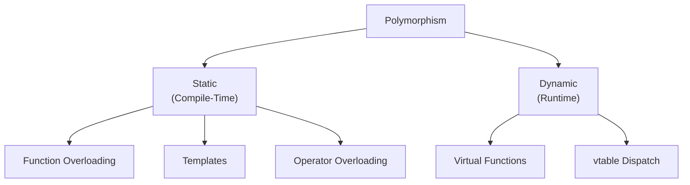
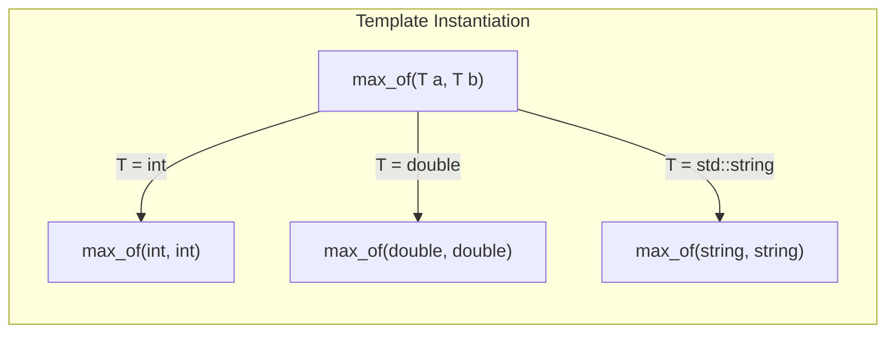

# Static Polymorphism

> Static polymorphism lets the compiler resolve which function to call at compile time — through overloading and templates — giving you the flexibility of polymorphism with zero runtime overhead.

## Table of Contents
- [Core Concepts](#core-concepts)
- [Code Examples](#code-examples)
- [Common Pitfalls](#common-pitfalls)
- [Key Takeaways](#key-takeaways)
- [Exercises](#exercises)

## Core Concepts

### What Is Polymorphism?

#### What

Polymorphism means "many forms" — the ability for a single interface (a function name, an operator, a type) to work with different types. In C++, polymorphism comes in two flavors:

- **Static (compile-time) polymorphism**: The compiler decides which function to call based on the types known at compile time. Mechanisms: function overloading, operator overloading, templates.
- **Dynamic (runtime) polymorphism**: The program decides which function to call at runtime based on the actual type of the object. Mechanism: virtual functions and inheritance.

This lesson focuses on the static flavor. Dynamic polymorphism is covered in Week 8.

#### How

The key distinction is *when* the decision is made. With static polymorphism, the compiler sees all the types involved, picks the right function, and generates a direct call — no indirection, no vtable lookup, no runtime cost. With dynamic polymorphism, the decision is deferred to runtime via a vtable pointer, which adds a small cost per call.



#### Why It Matters

Static polymorphism is C++'s defining advantage over languages that only offer dynamic dispatch. When the compiler knows the exact types at compile time, it can inline the function call entirely, eliminate dead branches, and optimize across call boundaries. This is what "zero-cost abstractions" means in practice: you write generic, flexible code, and the compiler generates code as efficient as if you'd hand-specialized it for each type.

### Function Overloading as Static Polymorphism

#### What

Function overloading lets you define multiple functions with the same name but different parameter lists. The compiler picks the best match based on the arguments at the call site. This is the simplest form of static polymorphism — the "many forms" are different parameter types, and the compiler resolves the form at compile time.

```cpp
void print(int x);           // called for int arguments
void print(double x);        // called for double arguments
void print(const std::string& x);  // called for string arguments
```

When you call `print(42)`, the compiler sees the argument is `int` and selects the first overload. There's no runtime decision, no overhead — the compiler emits a direct call to the correct function.

#### How

The compiler follows **overload resolution rules** to pick the best match:

1. **Exact match** — the argument type matches a parameter type exactly.
2. **Promotion** — a type is promoted to a wider type (e.g., `short` to `int`, `float` to `double`).
3. **Standard conversion** — a type is converted via a standard conversion (e.g., `int` to `double`, `derived*` to `base*`).
4. **User-defined conversion** — a converting constructor or conversion operator is invoked.

If no single overload is the best match, the compiler reports an ambiguity error. This is intentional — ambiguous calls are almost always bugs.

#### Why It Matters

Function overloading creates a **uniform interface** for operations that are conceptually the same but differ in implementation. The caller writes `print(x)` regardless of `x`'s type, and the compiler routes to the right implementation. This is the foundation of generic programming in C++: the same syntax, different behavior, resolved at compile time.

### Templates as Static Polymorphism

#### What

Templates are C++'s most powerful form of static polymorphism. A function template or class template defines a blueprint that works with any type satisfying certain requirements. The compiler generates a specialized version for each type actually used — a process called **template instantiation**.

```cpp
template<typename T>
T max_of(T a, T b) {
    return (a > b) ? a : b;
}

// The compiler generates:
// int max_of<int>(int, int)       — when you call max_of(3, 5)
// double max_of<double>(double, double) — when you call max_of(3.14, 2.71)
```

#### How

Templates work through **duck typing at compile time**: if the type supports the operations used in the template body (comparison with `>` in the example above), it works. If it doesn't, you get a compile error. There's no interface declaration, no base class, no vtable — just "can this type do what the template body asks?"

This is fundamentally different from dynamic polymorphism, where types must inherit from a common base class. With templates, unrelated types can be used interchangeably as long as they provide the required operations.



#### Why It Matters

Templates give you generality without runtime cost. The compiler generates type-specific code, which means it can inline, optimize, and eliminate overhead just as if you'd hand-written the function for each type. This is why `std::sort` on a `std::vector<int>` is typically faster than C's `qsort` — `qsort` uses function pointers (runtime dispatch), while `std::sort` uses templates (compile-time dispatch, allowing the comparator to be inlined).

### Static vs Dynamic Polymorphism

#### What

These are two fundamentally different approaches to the same problem — writing code that works with multiple types. Understanding when to use each is one of the most important design decisions in C++.

| Aspect | Static (Templates) | Dynamic (Virtual Functions) |
|--------|--------------------|-----------------------------|
| Resolved at | Compile time | Runtime |
| Mechanism | Template instantiation, overloading | vtable pointer dispatch |
| Runtime overhead | Zero — calls are direct or inlined | Small — one pointer indirection per call |
| Type requirements | Implicit (duck typing) | Explicit (must inherit from base class) |
| Adding new types | No changes to existing code | No changes to existing code |
| Binary size | Larger (code duplicated per type) | Smaller (one copy of virtual function code) |
| Compile time | Slower (template instantiation is expensive) | Faster |
| Error messages | Verbose, hard to read (pre-C++20) | Clear |

#### How

The decision often comes down to one question: **do you know all the types at compile time?**

- **Yes, types known at compile time** → use templates. You get zero overhead and full optimization.
- **No, types determined at runtime** → use virtual functions. You need runtime dispatch.

Concrete examples:

- A **math library** where you support `float`, `double`, and fixed-point: templates. All types are known when the library is compiled.
- A **plugin system** where users provide new types after compilation: virtual functions. You can't template over types that don't exist yet.
- A **GUI framework** with a `Widget` base class and many widget types: virtual functions. New widget types can be added by users.
- A **sorting algorithm** that takes a comparator: templates. The comparator type is known at the call site.

#### Why It Matters

Many C++ designs start with virtual functions out of habit (especially from developers coming from Java), when templates would be more appropriate. Virtual functions are the right tool when you genuinely need runtime flexibility — but they come with a cost: vtable indirection prevents inlining, which can matter in tight loops. Templates are the right tool when all types are known at compile time — which is surprisingly often.

The expert-level insight: **default to templates, and reach for virtual functions only when you need runtime type flexibility.** This is the opposite of the Java/C# mindset, where interfaces (dynamic dispatch) are the default abstraction tool.

### Template Type Requirements (Implicit Concepts)

#### What

When you write a template, the type parameter `T` has *implicit* requirements. If the template body calls `a < b`, then `T` must support `operator<`. If it calls `a.size()`, then `T` must have a `size()` method. These requirements are not declared anywhere — they're enforced only when the template is instantiated.

#### How

This implicit approach is called "duck typing" — if it walks like a duck and quacks like a duck, it's a duck. The compiler doesn't check requirements when it parses the template; it checks them when you instantiate the template with a specific type. If the type doesn't satisfy the requirements, you get a compile error — often a long, confusing one.

```cpp
template<typename Container>
void print_all(const Container& c) {
    // Implicit requirements on Container:
    // 1. Must have begin() and end() methods (for range-based for)
    // 2. Elements must support operator<< (for printing)
    for (const auto& elem : c) {
        std::cout << elem << ' ';
    }
    std::cout << '\n';
}
```

#### Why It Matters

This is both the power and the weakness of templates. The power: any type that satisfies the requirements works, with no base class needed. The weakness: the requirements are invisible, and errors are reported deep in the template body rather than at the call site. C++20 Concepts solve this by letting you declare requirements explicitly, but in C++17, you document them in comments and rely on clear naming.

### Combining Overloading and Templates

#### What

Overloading and templates can be combined: you can have a function template that handles the general case and overloaded non-template functions that handle specific types. The compiler prefers non-template overloads (exact matches) over template instantiations.

#### How

This pattern is useful when most types should use a generic implementation, but one or two types need special handling. Instead of template specialization (which has its own subtleties), you simply provide a non-template overload.

```cpp
template<typename T>
std::string to_debug_string(const T& value) {
    // Generic: use ostringstream for anything with operator<<
    std::ostringstream oss;
    oss << value;
    return oss.str();
}

// Non-template overload for bool: print "true"/"false" instead of "1"/"0"
std::string to_debug_string(bool value) {
    return value ? "true" : "false";
}
```

When you call `to_debug_string(true)`, the compiler picks the `bool` overload (exact match for a non-template) over the template instantiation. When you call `to_debug_string(42)`, the template is used.

#### Why It Matters

This is a common pattern in production code. Overloads give you type-specific behavior; templates give you the fallback for everything else. Together, they provide the same flexibility as virtual functions — different behavior for different types — but resolved entirely at compile time.

## Code Examples

### Function Overloading for Type-Safe Formatting

```cpp
#include <cstdint>
#include <iomanip>
#include <iostream>
#include <sstream>
#include <string>

// Overloaded format functions: same name, different types, different behavior.
// The compiler picks the right one based on the argument type — no runtime dispatch.

std::string format_value(int value) {
    return std::to_string(value);
}

std::string format_value(double value) {
    std::ostringstream oss;
    oss << std::fixed << std::setprecision(2) << value;
    return oss.str();
}

std::string format_value(bool value) {
    return value ? "yes" : "no";
}

std::string format_value(const std::string& value) {
    return '"' + value + '"';
}

// A format function that handles nullptr explicitly — prevents implicit
// conversions from nullptr to bool or int
std::string format_value(std::nullptr_t) {
    return "null";
}

int main() {
    // Each call resolves to a different overload at compile time.
    // The caller doesn't need to know which overload is selected.
    std::cout << "int:     " << format_value(42) << '\n';
    std::cout << "double:  " << format_value(3.14159) << '\n';
    std::cout << "bool:    " << format_value(true) << '\n';
    std::cout << "string:  " << format_value(std::string("hello")) << '\n';
    std::cout << "nullptr: " << format_value(nullptr) << '\n';

    return 0;
}
```

### Function Templates for Generic Algorithms

```cpp
#include <algorithm>
#include <iostream>
#include <string>
#include <vector>

// A generic function that finds the minimum and maximum in a container.
// Works with any container whose elements support < comparison.
// This is static polymorphism: one definition, works with any qualifying type.
template<typename Container>
auto find_min_max(const Container& c)
    -> std::pair<typename Container::value_type, typename Container::value_type>
{
    if (c.empty()) {
        throw std::invalid_argument("Container must not be empty");
    }

    auto result = std::minmax_element(c.begin(), c.end());
    return {*result.first, *result.second};
}

// A generic function that removes duplicates from a sorted container.
// Demonstrates how templates impose implicit requirements:
// - Container must support erase(), begin(), end()
// - Elements must support == comparison (used by std::unique)
template<typename Container>
void remove_duplicates(Container& c) {
    std::sort(c.begin(), c.end());
    auto last = std::unique(c.begin(), c.end());
    c.erase(last, c.end());
}

int main() {
    // Same template, different types — each instantiation is fully optimized
    std::vector<int> numbers = {5, 2, 8, 2, 1, 8, 9, 1};
    remove_duplicates(numbers);

    std::cout << "Unique numbers: ";
    for (const auto n : numbers) {
        std::cout << n << ' ';
    }
    std::cout << '\n';

    auto [min_n, max_n] = find_min_max(numbers);
    std::cout << "Min: " << min_n << ", Max: " << max_n << '\n';

    // Same functions work with strings — no code changes needed
    std::vector<std::string> words = {"banana", "apple", "cherry", "apple", "banana"};
    remove_duplicates(words);

    std::cout << "Unique words: ";
    for (const auto& w : words) {
        std::cout << w << ' ';
    }
    std::cout << '\n';

    auto [min_w, max_w] = find_min_max(words);
    std::cout << "Min: " << min_w << ", Max: " << max_w << '\n';

    return 0;
}
```

### Combining Templates with Overloads

```cpp
#include <iostream>
#include <sstream>
#include <string>
#include <vector>

// Generic serialization: works with any type that supports operator<<
template<typename T>
std::string serialize(const T& value) {
    std::ostringstream oss;
    oss << value;
    return oss.str();
}

// Overload for bool: non-template overloads are preferred over template
// instantiations when the types match exactly
std::string serialize(bool value) {
    return value ? "true" : "false";
}

// Overload for std::string: avoid redundant stream insertion
std::string serialize(const std::string& value) {
    return value;
}

// Overload for vectors: recursively serialize elements
template<typename T>
std::string serialize(const std::vector<T>& vec) {
    std::string result = "[";
    for (std::size_t i = 0; i < vec.size(); ++i) {
        if (i > 0) result += ", ";
        result += serialize(vec[i]);  // recursive: calls serialize(T) for each element
    }
    result += "]";
    return result;
}

int main() {
    // The compiler picks the best overload for each call:
    std::cout << serialize(42) << '\n';              // template<int>
    std::cout << serialize(3.14) << '\n';            // template<double>
    std::cout << serialize(true) << '\n';            // bool overload: "true"
    std::cout << serialize(std::string("hi")) << '\n';  // string overload: "hi"

    std::vector<int> nums = {1, 2, 3};
    std::cout << serialize(nums) << '\n';            // vector overload: "[1, 2, 3]"

    std::vector<bool> flags = {true, false, true};
    std::cout << serialize(flags) << '\n';           // vector<bool>: "[true, false, true]"

    return 0;
}
```

### Static Polymorphism vs Dynamic Polymorphism — Side by Side

```cpp
#include <cmath>
#include <iostream>
#include <memory>
#include <vector>

// ============================================================
// APPROACH 1: Dynamic polymorphism (virtual functions)
// Use when: types are determined at runtime (e.g., plugin systems)
// ============================================================

namespace dynamic_poly {

class Shape {
public:
    virtual ~Shape() = default;
    virtual double area() const = 0;
    virtual std::string name() const = 0;
};

class Circle : public Shape {
public:
    explicit Circle(double r) : radius_(r) {}
    double area() const override { return M_PI * radius_ * radius_; }
    std::string name() const override { return "Circle"; }
private:
    double radius_;
};

class Rectangle : public Shape {
public:
    Rectangle(double w, double h) : width_(w), height_(h) {}
    double area() const override { return width_ * height_; }
    std::string name() const override { return "Rectangle"; }
private:
    double width_;
    double height_;
};

// This function works with ANY Shape subclass — even ones that don't exist yet.
// The price: each area() call goes through a vtable lookup.
void print_area(const Shape& shape) {
    std::cout << shape.name() << " area: " << shape.area() << '\n';
}

}  // namespace dynamic_poly

// ============================================================
// APPROACH 2: Static polymorphism (templates)
// Use when: all types are known at compile time
// ============================================================

namespace static_poly {

// No base class needed. Each type is independent.
// The only requirement: must have area() and name() methods.

class Circle {
public:
    explicit Circle(double r) : radius_(r) {}
    double area() const { return M_PI * radius_ * radius_; }
    std::string name() const { return "Circle"; }
private:
    double radius_;
};

class Rectangle {
public:
    Rectangle(double w, double h) : width_(w), height_(h) {}
    double area() const { return width_ * height_; }
    std::string name() const { return "Rectangle"; }
private:
    double width_;
    double height_;
};

// Template function: works with any type that has area() and name().
// The compiler generates a specialized version for each type.
// No vtable, no indirection — the call to area() can be inlined.
template<typename ShapeT>
void print_area(const ShapeT& shape) {
    std::cout << shape.name() << " area: " << shape.area() << '\n';
}

}  // namespace static_poly

int main() {
    std::cout << "=== Dynamic Polymorphism ===\n";
    {
        // We can store different shapes in a single container via base pointer.
        // This is impossible with templates (each type is different at compile time).
        std::vector<std::unique_ptr<dynamic_poly::Shape>> shapes;
        shapes.push_back(std::make_unique<dynamic_poly::Circle>(5.0));
        shapes.push_back(std::make_unique<dynamic_poly::Rectangle>(3.0, 4.0));

        for (const auto& shape : shapes) {
            dynamic_poly::print_area(*shape);
        }
    }

    std::cout << "\n=== Static Polymorphism ===\n";
    {
        // Each shape is its own type — no base class, no heap allocation needed.
        const static_poly::Circle circle(5.0);
        const static_poly::Rectangle rect(3.0, 4.0);

        // Each call generates a different function instantiation.
        // The compiler can inline area() directly — zero overhead.
        static_poly::print_area(circle);
        static_poly::print_area(rect);
    }

    return 0;
}
```

### Template with Multiple Type Parameters

```cpp
#include <iostream>
#include <map>
#include <string>
#include <vector>

// A generic lookup function that works with any associative container
// (std::map, std::unordered_map, etc.) and returns a default value
// when the key is not found — instead of inserting a new element
// like operator[] does.
template<typename MapType, typename KeyType>
typename MapType::mapped_type
get_or_default(const MapType& map,
               const KeyType& key,
               const typename MapType::mapped_type& default_value)
{
    auto it = map.find(key);
    if (it != map.end()) {
        return it->second;
    }
    return default_value;
}

// A generic function that applies a transformation to every element
// and collects the results. The transform function's return type
// determines the output container's element type.
template<typename T, typename Func>
auto transform_collect(const std::vector<T>& input, Func func)
    -> std::vector<decltype(func(input.front()))>
{
    using ResultType = decltype(func(input.front()));
    std::vector<ResultType> result;
    result.reserve(input.size());
    for (const auto& elem : input) {
        result.push_back(func(elem));
    }
    return result;
}

int main() {
    // get_or_default works with any map type
    const std::map<std::string, int> scores = {
        {"Alice", 95},
        {"Bob", 87},
    };

    std::cout << "Alice: " << get_or_default(scores, std::string("Alice"), 0) << '\n';
    std::cout << "Unknown: " << get_or_default(scores, std::string("Unknown"), -1) << '\n';

    // transform_collect: the lambda's return type drives the output type
    const std::vector<int> numbers = {1, 2, 3, 4, 5};

    // int -> std::string transformation
    auto as_strings = transform_collect(numbers,
        [](int n) { return std::to_string(n * n); });

    std::cout << "Squared as strings: ";
    for (const auto& s : as_strings) {
        std::cout << s << ' ';
    }
    std::cout << '\n';

    // int -> double transformation
    auto as_halves = transform_collect(numbers,
        [](int n) { return n / 2.0; });

    std::cout << "Halved: ";
    for (const auto h : as_halves) {
        std::cout << h << ' ';
    }
    std::cout << '\n';

    return 0;
}
```

## Common Pitfalls

### Assuming overload resolution considers return type

```cpp
// BAD — trying to overload based on return type
#include <string>

int parse(const std::string& s);
double parse(const std::string& s);  // COMPILE ERROR: cannot overload on return type alone

// The compiler sees two functions with the same name and same parameters.
// Return type is NOT part of the function signature for overload resolution.

// GOOD — use different names or template parameter
#include <sstream>
#include <string>

// Option 1: different function names (clearest approach)
int parse_int(const std::string& s) {
    return std::stoi(s);
}

double parse_double(const std::string& s) {
    return std::stod(s);
}

// Option 2: template with explicit type parameter
template<typename T>
T parse(const std::string& s) {
    T result;
    std::istringstream(s) >> result;
    return result;
}

// Usage: auto x = parse<int>("42");
// Usage: auto y = parse<double>("3.14");
```

C++ overload resolution looks only at the function name and parameter types — never the return type. This is a frequent source of confusion. If you need the same function name to produce different return types, use a template with an explicit type parameter.

### Template type deduction failure with mixed types

```cpp
// BAD — mixed argument types cause deduction failure
#include <iostream>

template<typename T>
T max_of(T a, T b) {
    return (a > b) ? a : b;
}

int main() {
    // auto result = max_of(3, 4.5);
    // COMPILE ERROR: deduction fails — T can't be both int and double
    return 0;
}

// GOOD — use two type parameters, or explicitly specify the type
#include <iostream>

// Option 1: two template parameters with a common return type
template<typename T, typename U>
auto max_of(T a, U b) -> std::common_type_t<T, U> {
    return (a > b) ? a : b;
}

// Option 2: keep one parameter and let the caller specify the type
// max_of<double>(3, 4.5)

int main() {
    std::cout << max_of(3, 4.5) << '\n';    // Option 1: deduces T=int, U=double, returns double
    std::cout << max_of(3.0, 4.5) << '\n';  // Both double — no ambiguity
    return 0;
}
```

When a template has one type parameter but you pass arguments of different types, the compiler can't decide what `T` should be. The fix is either to use multiple type parameters with `std::common_type_t` for the return type, or to have the caller specify the type explicitly.

### Overloading between `int` and `unsigned int` — ambiguity traps

```cpp
// BAD — overloads that create ambiguity with literal arguments
#include <iostream>

void process(int x)          { std::cout << "int: " << x << '\n'; }
void process(unsigned int x) { std::cout << "uint: " << x << '\n'; }

int main() {
    process(42);    // OK: 42 is int, calls process(int)
    process(42u);   // OK: 42u is unsigned int, calls process(unsigned int)
    // process(42L);  // AMBIGUOUS: long can convert to both int and unsigned int
    return 0;
}

// GOOD — design overload sets to avoid ambiguity
#include <iostream>

void process(int x)  { std::cout << "int: " << x << '\n'; }
void process(long x) { std::cout << "long: " << x << '\n'; }

int main() {
    process(42);   // int
    process(42L);  // long
    return 0;
}
```

When designing overload sets, think about all the types callers might pass — including literals with suffixes (`42L`, `42u`, `42.0f`). If two overloads are equally good matches for a common argument type, the compiler will reject the call as ambiguous. Test your overloads with all integer and floating-point literal types.

### Forgetting that templates generate code for every type used

```cpp
// BAD — using a template in a hot path with dozens of different types
// Each unique type instantiates a new copy of the entire function.
// 50 types = 50 copies of the function in the binary.
#include <iostream>

template<typename T>
void heavy_function(const T& value) {
    // Imagine 200 lines of complex logic here...
    // Every unique type T generates a complete copy of all 200 lines.
    std::cout << value << '\n';
}

// If called with int, double, float, long, short, char, unsigned int,
// std::string, etc. — each gets a full copy in the binary.

// GOOD — factor out type-independent logic into a non-template function
#include <iostream>
#include <string>

// The type-independent work goes in a non-template function — one copy in the binary
void heavy_common_logic(const std::string& str_value) {
    // The 200 lines of complex logic operate on a string representation
    std::cout << str_value << '\n';
}

// The template is thin: it just converts to string and calls the real implementation
template<typename T>
void heavy_function(const T& value) {
    std::ostringstream oss;
    oss << value;
    heavy_common_logic(oss.str());
}
```

Templates trade binary size for runtime performance. Each instantiation duplicates the entire function body in the compiled binary. For small templates (a few lines), this is fine. For large templates instantiated with many types, binary bloat can become a real problem — larger binaries mean more instruction cache misses. The fix: factor out type-independent logic into non-template helper functions.

## Key Takeaways

- **Static polymorphism resolves calls at compile time** — the compiler generates direct, inlinable function calls with zero runtime overhead. This is C++'s "zero-cost abstractions" in action.
- **Function overloading is the simplest form**: same name, different parameter types, compiler picks the best match. Design overload sets carefully to avoid ambiguity.
- **Templates are the most powerful form**: one definition works with any type that satisfies the implicit requirements. The compiler generates specialized code for each type used.
- **Default to templates when all types are known at compile time.** Use virtual functions only when you need runtime type flexibility (plugin systems, type-erased containers, user-extensible hierarchies).
- **Templates trade binary size for speed.** Each instantiation duplicates the function body. Factor out type-independent logic to control bloat.

## Exercises

1. Explain the difference between static and dynamic polymorphism. For each, name one scenario where it is the better choice and explain why.
2. Write a function template `clamp(value, low, high)` that returns `value` constrained to the range `[low, high]`. It should work with any type that supports `<` comparison. Test it with `int` and `double`.
3. Given these two overloads, what happens when you call `process(42L)`? Explain the compiler's reasoning.
   ```cpp
   void process(int x);
   void process(unsigned int x);
   ```
4. You have a `print_area()` function that calculates the area of different shapes (Circle, Rectangle, Triangle). Design both a template-based solution and a virtual-function-based solution. When would you choose one over the other?
5. Write a template function `contains(const Container& c, const Value& v)` that returns `true` if the value is found in the container. It should work with `std::vector`, `std::string`, and any other type that provides `begin()` and `end()`. Why does this approach not work with `std::map` out of the box?
