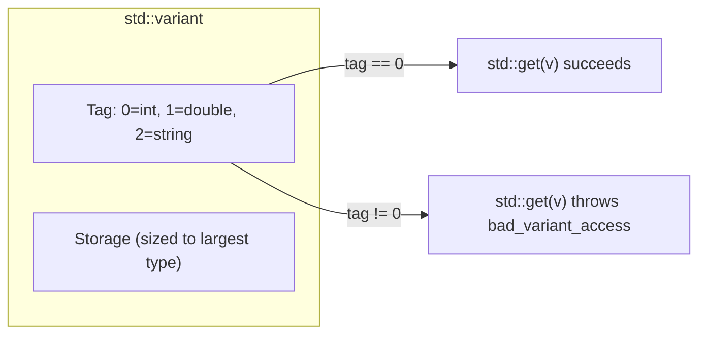
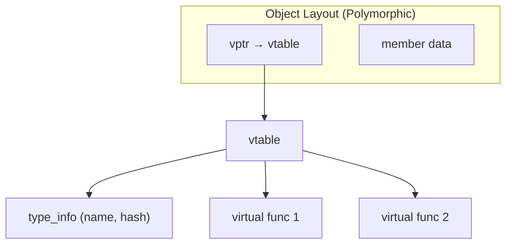

# Data Types — Static Typing, Dynamic Typing & RTTI

> C++ is statically typed — the compiler knows every object's type at compile time and rejects mismatches before your code ever runs — but it also provides controlled escape hatches (`std::variant`, `std::any`, RTTI) for the rare situations where runtime type flexibility is genuinely needed.

## Table of Contents
- [Core Concepts](#core-concepts)
- [Code Examples](#code-examples)
- [Common Pitfalls](#common-pitfalls)
- [Key Takeaways](#key-takeaways)
- [Exercises](#exercises)

## Core Concepts

### Static Typing

#### What

In a statically typed language, every variable, parameter, and return value has a type known at compile time. The compiler verifies that you never assign a `std::string` to an `int`, never call a method that doesn't exist on a type, and never pass the wrong argument types to a function. If the types don't match, the program doesn't compile. Period.

This is in contrast to dynamically typed languages like Python or JavaScript, where types are checked at runtime — meaning a type error only surfaces when the offending line actually executes, which might be months after deployment.

#### How

In C++, you declare types explicitly or let the compiler deduce them with `auto`. Either way, the type is fixed at compile time and cannot change.

```cpp
int count = 42;           // explicitly typed
auto name = std::string{"Alice"};  // deduced as std::string — still static
// count = "hello";       // compile error: cannot assign const char* to int
```

The compiler uses the type to determine: how much memory to allocate, which operations are valid, how to lay out the object in memory, and which overloaded function to call. All of this happens before the program runs — there is zero runtime cost to type checking.

#### Why It Matters

Static typing is C++'s first line of defense against bugs. Every type mismatch the compiler catches is a bug that never reaches production. In large codebases (millions of lines, hundreds of engineers), this is not a nice-to-have — it's the reason the code compiles at all. The compiler acts as an automated code reviewer that checks every single line, every single time.

The tradeoff is verbosity: you must declare types (or use `auto`), and you sometimes need explicit casts. But this verbosity is information — it tells the reader exactly what's happening, and it tells the compiler exactly what to optimize.

### Dynamic Typing in C++ — `std::variant` and `std::any`

#### What

Sometimes you genuinely need a value whose type isn't known until runtime. A configuration parser might return a string, an integer, or a boolean. A message queue might carry different payload types. In C, you'd use `void*` — a raw pointer with no type information, no safety, and no compiler help. C++17 provides two type-safe alternatives:

- **`std::variant<T1, T2, ...>`** — a tagged union that holds exactly one of a closed set of types. You list the possible types at compile time, and the variant tracks which one is currently active.
- **`std::any`** — an opaque container that can hold a value of any copyable type. The set of types is open-ended — you don't need to enumerate them up front.

#### How

Think of `std::variant` as a type-safe `union`. A C `union` stores multiple types in overlapping memory but gives you no way to know which type is currently stored — reading the wrong member is undefined behavior. `std::variant` adds a tag (a small integer) that tracks the active type, and it refuses to let you access the wrong one.



`std::any`, by contrast, uses type erasure — it stores the value on the heap (for large types) or in a small buffer (small buffer optimization), along with a type descriptor. You extract the value with `std::any_cast<T>`, which checks the stored type at runtime and throws `std::bad_any_cast` on mismatch.

The critical difference: `std::variant` forces you to handle all possible types (the compiler can check exhaustiveness with `std::visit`), while `std::any` is open-ended and requires you to "guess" the type at the extraction site.

#### Why It Matters

**Prefer `std::variant` over `std::any` in almost all cases.** When you use `std::variant`, you're telling the compiler "these are the only types this value can be," and the compiler enforces that contract. When you use `std::any`, you're saying "this could be anything" — which means the compiler can't help you, and a wrong `any_cast` is a runtime error instead of a compile-time error.

`std::variant` is the idiomatic replacement for inheritance hierarchies when the set of types is closed and known at compile time. It's often faster (no heap allocation, no virtual dispatch), safer (exhaustive `std::visit`), and more explicit. Use `std::any` only when you truly cannot enumerate the possible types — plugin systems, type-erased callback registries, or interop boundaries.

Both are dramatically safer than `void*`, which gives you no type checking at all.

### `std::visit` — Pattern Matching for Variants

#### What

`std::visit` applies a callable (typically a lambda or overload set) to the active value inside a `std::variant`. It is the standard way to "unwrap" a variant and handle each possible type. The compiler checks that your visitor handles every type in the variant — if you miss one, the code won't compile.

#### How

You pass a visitor callable and one or more variants. The visitor must be callable with every type the variant can hold. The most common pattern is the "overloaded lambda" idiom, where you create a struct that inherits from multiple lambdas:

```cpp
template<class... Ts> struct overloaded : Ts... { using Ts::operator()...; };
template<class... Ts> overloaded(Ts...) -> overloaded<Ts...>;
```

This lets you write a set of lambdas — one per type — and combine them into a single visitor. It reads like a `match` statement from Rust or a pattern-matching construct from functional languages.

#### Why It Matters

`std::visit` turns `std::variant` from a storage mechanism into a dispatching mechanism. Without `std::visit`, you'd need chains of `std::holds_alternative` / `std::get` calls — verbose, error-prone, and non-exhaustive. With `std::visit`, the compiler guarantees you handle every case. This is the closest C++17 gets to algebraic data types and pattern matching (C++26 proposes actual pattern matching, but that's years away).

### RTTI (Run-Time Type Information)

#### What

RTTI is a compiler-generated mechanism that stores type information in the binary, accessible at runtime. It provides two tools:

- **`typeid(expr)`** — returns a `std::type_info` reference that identifies the dynamic type of an expression. For polymorphic types (classes with at least one `virtual` function), `typeid` returns the *actual* runtime type, not the static type.
- **`dynamic_cast<Derived*>(base_ptr)`** — performs a runtime-checked downcast from a base pointer/reference to a derived type. Returns `nullptr` (for pointers) or throws `std::bad_cast` (for references) if the cast is invalid.

#### How

Under the hood, the compiler embeds type information in the vtable (virtual function table) of polymorphic classes. When you call `typeid` on a polymorphic object, the runtime follows the vptr (virtual table pointer) to find the type descriptor. `dynamic_cast` does the same, then walks the inheritance hierarchy to verify the cast is valid.



For non-polymorphic types (no virtual functions), `typeid` returns the *static* type — it cannot determine the runtime type because there's no vtable to query.

#### Why It Matters

RTTI has a runtime cost: `dynamic_cast` must traverse the inheritance hierarchy, which involves string comparisons of type names on some implementations. It also has a binary size cost — type information strings are embedded in the executable. Many performance-critical codebases (game engines, embedded systems, real-time audio) compile with `-fno-rtti` to eliminate this overhead.

More importantly, **needing `dynamic_cast` is usually a design smell.** If you're downcasting, it means your base class interface doesn't capture what you need, and you're working around it by asking "what type are you really?" The right fix is usually to add a virtual method to the base class that expresses the behavior you need, or to use `std::variant` with `std::visit` when the set of types is closed.

Legitimate uses of RTTI exist — serialization frameworks, debugging tools, plugin systems that load types from shared libraries — but in day-to-day application code, reaching for `dynamic_cast` should prompt you to reconsider your design first.

### `std::variant` vs Inheritance Hierarchies

#### What

When you have a closed set of types that share behavior, you have two major design choices in C++: a class hierarchy with virtual functions, or a `std::variant` with `std::visit`. They solve the same problem — dispatching behavior based on type — but they make different tradeoffs.

#### How

| Dimension | Inheritance + Virtual | `std::variant` + `std::visit` |
|---|---|---|
| Adding new types | Easy (add a derived class) | Hard (must update the variant and all visitors) |
| Adding new operations | Hard (must add a virtual method to every class) | Easy (add a new visitor) |
| Memory allocation | Usually heap (polymorphic objects behind pointers) | Stack-allocated, no heap |
| Dispatch mechanism | vtable lookup (indirect call) | Compiler-generated jump table or if-chain |
| Type set | Open (anyone can derive) | Closed (enumerated at compile time) |

This is the classic "expression problem" from programming language theory. Neither approach is universally better — the choice depends on which axis you expect to grow.

#### Why It Matters

In firmware and embedded systems, heap allocation is often prohibited or expensive. `std::variant` gives you polymorphic-like dispatch without any heap allocation. In plugin architectures where new types are loaded at runtime, inheritance is the only viable option. Understanding this tradeoff lets you pick the right tool instead of defaulting to inheritance out of habit.

## Code Examples

### Static Typing and Type Safety

```cpp
#include <iostream>
#include <string>
#include <string_view>

// Static typing means the compiler catches mismatches before you run anything.
// This function only accepts string_view — passing an int won't compile.
void greet(std::string_view name) {
    std::cout << "Hello, " << name << "!\n";
}

// Overloading: same name, different types — the compiler picks the right one
// based on the argument's static type at the call site.
void print_value(int value) {
    std::cout << "int: " << value << '\n';
}

void print_value(double value) {
    std::cout << "double: " << value << '\n';
}

void print_value(std::string_view value) {
    std::cout << "string: " << value << '\n';
}

int main() {
    greet("Alice");           // const char* implicitly converts to string_view
    // greet(42);             // compile error — int is not convertible to string_view

    print_value(42);          // calls print_value(int)
    print_value(3.14);        // calls print_value(double)
    print_value("hello");     // calls print_value(string_view)

    // auto deduces the type at compile time — it's still static typing
    const auto count = 10;    // deduced as int
    const auto pi = 3.14159;  // deduced as double
    const auto msg = std::string{"world"};  // deduced as std::string

    std::cout << count << ' ' << pi << ' ' << msg << '\n';

    return 0;
}
```

### `std::variant` — Type-Safe Union with Exhaustive Visitation

```cpp
#include <iostream>
#include <string>
#include <variant>
#include <vector>

// The overloaded idiom: combine multiple lambdas into a single visitor.
// This is the standard pattern for visiting variants in C++17.
template<class... Ts> struct overloaded : Ts... { using Ts::operator()...; };
template<class... Ts> overloaded(Ts...) -> overloaded<Ts...>;

// A configuration value can be one of three types.
// std::variant tracks which type is active and prevents accessing the wrong one.
using ConfigValue = std::variant<int, double, std::string>;

void print_config(const std::string& key, const ConfigValue& value) {
    std::cout << key << " = ";

    // std::visit dispatches to the correct lambda based on the active type.
    // If you forget to handle a type, the code won't compile.
    std::visit(overloaded{
        [](int v)                    { std::cout << v << " (int)\n"; },
        [](double v)                 { std::cout << v << " (double)\n"; },
        [](const std::string& v)     { std::cout << '"' << v << "\" (string)\n"; },
    }, value);
}

// Compute a "size" for any config value — demonstrates returning from std::visit.
std::size_t config_size(const ConfigValue& value) {
    return std::visit(overloaded{
        [](int)                      -> std::size_t { return sizeof(int); },
        [](double)                   -> std::size_t { return sizeof(double); },
        [](const std::string& v)     -> std::size_t { return v.size(); },
    }, value);
}

int main() {
    // Constructing variants — the active type is determined by the argument
    const ConfigValue timeout = 30;
    const ConfigValue rate = 0.75;
    const ConfigValue name = std::string{"main_controller"};

    print_config("timeout", timeout);
    print_config("rate", rate);
    print_config("name", name);

    std::cout << "Size of 'name': " << config_size(name) << " bytes\n";

    // Variants in a container — heterogeneous collection without heap allocation
    const std::vector<ConfigValue> settings = {42, 3.14, std::string{"debug"}};
    for (const auto& setting : settings) {
        std::visit(overloaded{
            [](int v)                { std::cout << "  int: " << v << '\n'; },
            [](double v)             { std::cout << "  dbl: " << v << '\n'; },
            [](const std::string& v) { std::cout << "  str: " << v << '\n'; },
        }, setting);
    }

    return 0;
}
```

### `std::any` — Open-Ended Type Erasure

```cpp
#include <any>
#include <iostream>
#include <string>
#include <unordered_map>
#include <typeinfo>

// A property bag: stores key-value pairs where values can be any type.
// This is one of the few legitimate uses of std::any — the set of
// possible types is truly open-ended (plugins could add their own types).
class PropertyBag {
public:
    void set(const std::string& key, std::any value) {
        properties_[key] = std::move(value);
    }

    // Retrieve a value by key and type. Returns a pointer to the value
    // if the key exists and the type matches, nullptr otherwise.
    template<typename T>
    const T* get(const std::string& key) const {
        const auto it = properties_.find(key);
        if (it == properties_.end()) {
            return nullptr;
        }
        // std::any_cast<T>(&any) returns nullptr if the type doesn't match.
        // This is safer than the throwing version for optional lookups.
        return std::any_cast<T>(&(it->second));
    }

    bool has(const std::string& key) const {
        const auto it = properties_.find(key);
        return it != properties_.end() && it->second.has_value();
    }

private:
    std::unordered_map<std::string, std::any> properties_;
};

int main() {
    PropertyBag bag;
    bag.set("name", std::string{"sensor_01"});
    bag.set("sample_rate", 48000);
    bag.set("calibrated", true);

    // Type-safe retrieval — must specify the exact stored type
    if (const auto* name = bag.get<std::string>("name")) {
        std::cout << "Name: " << *name << '\n';
    }

    if (const auto* rate = bag.get<int>("sample_rate")) {
        std::cout << "Sample rate: " << *rate << " Hz\n";
    }

    // Wrong type → returns nullptr (not a crash, not UB)
    if (const auto* wrong = bag.get<double>("sample_rate")) {
        std::cout << "This won't print — stored as int, not double.\n";
    } else {
        std::cout << "Type mismatch: 'sample_rate' is not a double.\n";
    }

    // std::any also stores type information for inspection
    std::any mystery = 42;
    std::cout << "Type name: " << mystery.type().name() << '\n';

    return 0;
}
```

### RTTI — `typeid` and `dynamic_cast`

```cpp
#include <iostream>
#include <memory>
#include <string>
#include <typeinfo>
#include <vector>

// A simple polymorphic hierarchy — virtual destructor makes it polymorphic.
class Shape {
public:
    virtual ~Shape() = default;
    virtual double area() const = 0;
    virtual std::string name() const = 0;
};

class Circle : public Shape {
public:
    explicit Circle(double radius) : radius_(radius) {}

    double area() const override {
        return 3.14159265 * radius_ * radius_;
    }

    std::string name() const override { return "Circle"; }

    // Circle-specific method — not in the base interface
    double radius() const { return radius_; }

private:
    double radius_;
};

class Rectangle : public Shape {
public:
    Rectangle(double width, double height) : width_(width), height_(height) {}

    double area() const override {
        return width_ * height_;
    }

    std::string name() const override { return "Rectangle"; }

    double width() const { return width_; }
    double height() const { return height_; }

private:
    double width_;
    double height_;
};

int main() {
    // Create a collection of shapes via base class pointers
    std::vector<std::unique_ptr<Shape>> shapes;
    shapes.push_back(std::make_unique<Circle>(5.0));
    shapes.push_back(std::make_unique<Rectangle>(3.0, 4.0));
    shapes.push_back(std::make_unique<Circle>(2.5));

    for (const auto& shape : shapes) {
        // typeid on a polymorphic type returns the *dynamic* (runtime) type
        std::cout << "Type: " << typeid(*shape).name()
                  << ", Area: " << shape->area() << '\n';

        // dynamic_cast: runtime-checked downcast — returns nullptr if wrong type.
        // Use this sparingly. If you find yourself downcasting often,
        // your base class interface probably needs a redesign.
        if (auto* circle = dynamic_cast<Circle*>(shape.get())) {
            std::cout << "  -> Circle with radius " << circle->radius() << '\n';
        }
    }

    // Demonstrating dynamic_cast failure — safe, returns nullptr
    auto rect = std::make_unique<Rectangle>(6.0, 8.0);
    Shape* base = rect.get();
    auto* as_circle = dynamic_cast<Circle*>(base);
    if (as_circle == nullptr) {
        std::cout << "Rectangle is not a Circle (dynamic_cast returned nullptr)\n";
    }

    return 0;
}
```

### `std::variant` Replacing Inheritance — The Better Design

```cpp
#include <cmath>
#include <iostream>
#include <variant>
#include <vector>

// Instead of a class hierarchy, define each type as a simple struct.
// No virtual functions, no heap allocation, no vtable overhead.
struct Circle {
    double radius;
};

struct Rectangle {
    double width;
    double height;
};

struct Triangle {
    double base;
    double height;
};

// The "variant approach": a closed set of types, stack-allocated.
using Shape = std::variant<Circle, Rectangle, Triangle>;

// Operations are visitors — adding a new operation is easy,
// just write a new visitor. No need to modify existing types.
double area(const Shape& shape) {
    return std::visit([](const auto& s) -> double {
        // if constexpr dispatches at compile time based on the type.
        // This is a single function that handles all types, with
        // zero runtime overhead for the type check.
        using T = std::decay_t<decltype(s)>;

        if constexpr (std::is_same_v<T, Circle>) {
            return M_PI * s.radius * s.radius;
        } else if constexpr (std::is_same_v<T, Rectangle>) {
            return s.width * s.height;
        } else if constexpr (std::is_same_v<T, Triangle>) {
            return 0.5 * s.base * s.height;
        }
    }, shape);
}

std::string name(const Shape& shape) {
    return std::visit([](const auto& s) -> std::string {
        using T = std::decay_t<decltype(s)>;

        if constexpr (std::is_same_v<T, Circle>)    return "Circle";
        if constexpr (std::is_same_v<T, Rectangle>)  return "Rectangle";
        if constexpr (std::is_same_v<T, Triangle>)   return "Triangle";
    }, shape);
}

int main() {
    // All shapes stored inline in the vector — no heap allocation per shape.
    // sizeof(Shape) is the size of the largest alternative + tag.
    const std::vector<Shape> shapes = {
        Circle{5.0},
        Rectangle{3.0, 4.0},
        Triangle{6.0, 3.0},
        Circle{2.5},
    };

    for (const auto& shape : shapes) {
        std::cout << name(shape) << ": area = " << area(shape) << '\n';
    }

    std::cout << "sizeof(Shape) = " << sizeof(Shape) << " bytes "
              << "(no heap allocation)\n";

    return 0;
}
```

## Common Pitfalls

### Using `void*` instead of `std::variant` or `std::any`

```cpp
// BAD — void* throws away all type information
#include <iostream>

void process(void* data, int type_tag) {
    // You must manually track the type and cast correctly.
    // Get it wrong and you have undefined behavior — no compiler help.
    if (type_tag == 0) {
        std::cout << *static_cast<int*>(data) << '\n';
    } else if (type_tag == 1) {
        std::cout << *static_cast<double*>(data) << '\n';
    }
    // Forgot type_tag == 2? No warning. Wrong cast? UB.
}

int main() {
    int x = 42;
    process(&x, 0);  // works
    process(&x, 1);  // UB — reinterprets int bits as double
    return 0;
}
```

`void*` is the C approach to generic programming: erase the type, pass a raw pointer, and pray the caller gets the cast right. There's no compiler checking, no runtime checking, and a wrong cast is silent undefined behavior. In C++17, `std::variant` gives you compile-time exhaustiveness checking, and `std::any` gives you runtime type checking. There is no reason to use `void*` for type-flexible values in modern C++.

```cpp
// GOOD — std::variant provides compile-time type safety
#include <iostream>
#include <string>
#include <variant>

using Value = std::variant<int, double, std::string>;

void process(const Value& v) {
    std::visit([](const auto& val) {
        std::cout << val << '\n';
    }, v);
    // Every type is handled. Miss one → compile error.
}

int main() {
    process(42);
    process(3.14);
    process(std::string{"hello"});
    return 0;
}
```

### Using `std::get` without checking the active type

```cpp
// BAD — std::get throws if the variant holds a different type
#include <iostream>
#include <variant>

int main() {
    std::variant<int, double, std::string> v = std::string{"hello"};

    // This throws std::bad_variant_access at runtime — the variant
    // holds a string, not an int.
    int value = std::get<int>(v);  // throws!
    std::cout << value << '\n';

    return 0;
}
```

`std::get<T>` assumes you know the active type. If you're wrong, it throws `std::bad_variant_access`. In production code, you almost never want to call `std::get` directly — use `std::visit` for exhaustive handling, or `std::get_if` for checked access.

```cpp
// GOOD — use std::get_if for safe checked access
#include <iostream>
#include <variant>
#include <string>

int main() {
    std::variant<int, double, std::string> v = std::string{"hello"};

    // std::get_if returns a pointer: non-null if the type matches, nullptr otherwise.
    if (const auto* str = std::get_if<std::string>(&v)) {
        std::cout << "String: " << *str << '\n';
    } else {
        std::cout << "Not a string.\n";
    }

    // Even better: use std::visit for exhaustive handling
    std::visit([](const auto& val) {
        std::cout << "Value: " << val << '\n';
    }, v);

    return 0;
}
```

### Over-relying on `dynamic_cast` instead of redesigning the interface

```cpp
// BAD — downcasting to access derived-specific behavior
#include <iostream>
#include <memory>

class Animal {
public:
    virtual ~Animal() = default;
    virtual std::string speak() const = 0;
};

class Dog : public Animal {
public:
    std::string speak() const override { return "Woof"; }
    void fetch() { std::cout << "Fetching!\n"; }  // Dog-specific
};

class Cat : public Animal {
public:
    std::string speak() const override { return "Meow"; }
    void purr() { std::cout << "Purring...\n"; }  // Cat-specific
};

void interact(Animal* animal) {
    std::cout << animal->speak() << '\n';

    // Downcasting to call type-specific methods — this is a design smell.
    // If you need type-specific behavior, your base interface is incomplete.
    if (auto* dog = dynamic_cast<Dog*>(animal)) {
        dog->fetch();
    } else if (auto* cat = dynamic_cast<Cat*>(animal)) {
        cat->purr();
    }
    // What if someone adds a Bird class? This code silently does nothing.
}
```

If you find yourself writing chains of `dynamic_cast`, step back and ask: "Why doesn't the base class interface support what I need?" The fix is usually to add a virtual method that captures the behavior, or to switch to `std::variant` if the type set is closed.

```cpp
// GOOD — express the behavior through the virtual interface
#include <iostream>
#include <memory>

class Animal {
public:
    virtual ~Animal() = default;
    virtual std::string speak() const = 0;
    virtual void interact() const = 0;  // every animal can interact
};

class Dog : public Animal {
public:
    std::string speak() const override { return "Woof"; }
    void interact() const override { std::cout << "Fetching!\n"; }
};

class Cat : public Animal {
public:
    std::string speak() const override { return "Meow"; }
    void interact() const override { std::cout << "Purring...\n"; }
};

void interact(const Animal& animal) {
    std::cout << animal.speak() << '\n';
    animal.interact();  // no downcast needed — polymorphism does the work
}
```

### Forgetting that `typeid` returns the static type for non-polymorphic classes

```cpp
// BAD — typeid on non-polymorphic type gives static type, not dynamic type
#include <iostream>
#include <typeinfo>

struct Base {
    // No virtual functions — not polymorphic
    int value = 0;
};

struct Derived : Base {
    int extra = 1;
};

int main() {
    Derived d;
    Base& ref = d;

    // This prints "Base" (or the mangled equivalent), NOT "Derived".
    // Without virtual functions, there's no vtable, so typeid can only
    // see the static type of the reference.
    std::cout << "typeid says: " << typeid(ref).name() << '\n';

    return 0;
}
```

`typeid` only resolves to the dynamic (runtime) type when the class is polymorphic — meaning it has at least one virtual function. For non-polymorphic types, `typeid` returns the static type, which is whatever the compiler sees at the call site. If you need runtime type identification, the class must have a virtual function (at minimum, a virtual destructor).

```cpp
// GOOD — add a virtual destructor to enable runtime type identification
#include <iostream>
#include <typeinfo>

struct Base {
    virtual ~Base() = default;  // makes the class polymorphic
    int value = 0;
};

struct Derived : Base {
    int extra = 1;
};

int main() {
    Derived d;
    Base& ref = d;

    // Now typeid correctly returns "Derived" (or its mangled name)
    // because the class is polymorphic and has a vtable.
    std::cout << "typeid says: " << typeid(ref).name() << '\n';

    return 0;
}
```

## Key Takeaways

- **Static typing is C++'s superpower.** The compiler catches type mismatches before your code runs — every type error caught at compile time is a bug that never reaches production. Embrace the type system instead of fighting it.
- **Prefer `std::variant` over `std::any`, and both over `void*`.** `std::variant` gives you a closed, compiler-checked set of types with exhaustive visitation. `std::any` is for truly open-ended type erasure. `void*` is never the right answer in modern C++.
- **`std::visit` with the overloaded-lambda idiom is C++17's closest thing to pattern matching.** It guarantees you handle every type in a variant — the compiler enforces exhaustiveness.
- **RTTI (`typeid` / `dynamic_cast`) is a tool of last resort.** If you're downcasting, your base class interface is probably incomplete. Redesign with virtual methods or use `std::variant` before reaching for `dynamic_cast`.
- **Understand the variant-vs-inheritance tradeoff.** Variants excel when the type set is closed and you add operations often. Inheritance excels when the type set is open and you add types often. Choose based on which axis grows.

## Exercises

1. Explain the difference between `std::variant` and `std::any`. When would you use each one? Why is `std::variant` generally preferred?

2. Write a program that defines a `std::variant<int, double, std::string>` and uses `std::visit` with the overloaded-lambda idiom to print a type-specific message for each alternative (e.g., "Got an int: 42", "Got a double: 3.14", "Got a string: hello").

3. Given a polymorphic class hierarchy with `Base` and `Derived`, explain what happens when you call `typeid(base_ref)` if `Base` has no virtual functions. What changes when you add a virtual destructor?

4. You have a function that receives a `Shape*` and uses `dynamic_cast` to check if it's a `Circle*` or `Rectangle*` to call type-specific methods. Describe two alternative designs that eliminate the need for `dynamic_cast` (one using virtual methods, one using `std::variant`). What are the tradeoffs of each?

5. Write a `Calculator` that uses `std::variant<int, double>` to represent numeric values and implements `add`, `multiply`, and `to_string` operations using `std::visit`. The operations should handle mixed-type arithmetic (e.g., `int + double` should produce a `double`).

---
up:: [Schedule](../../Schedule.md)
#type/learning #source/self-study #status/evergreen
