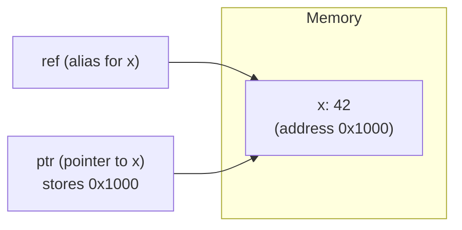
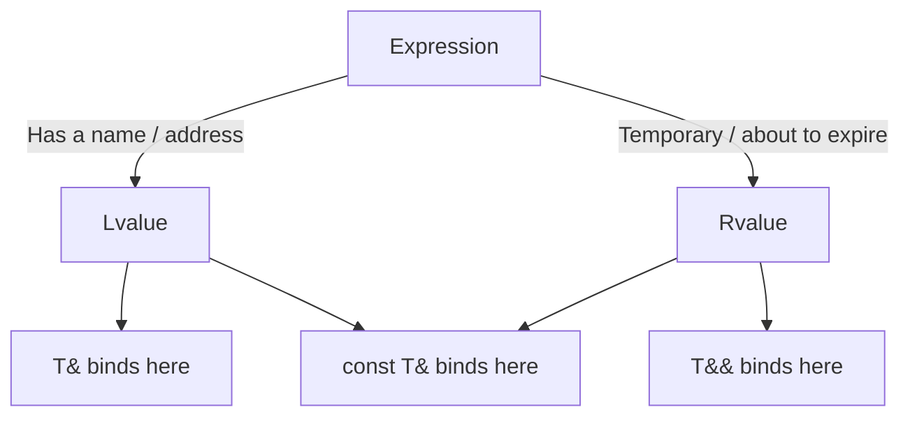
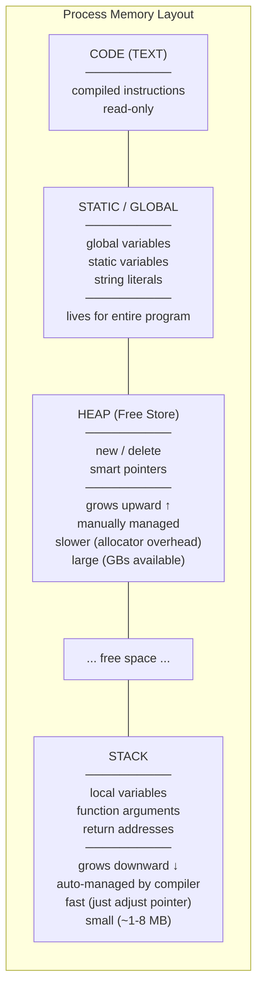
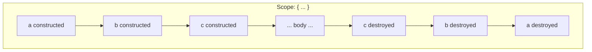
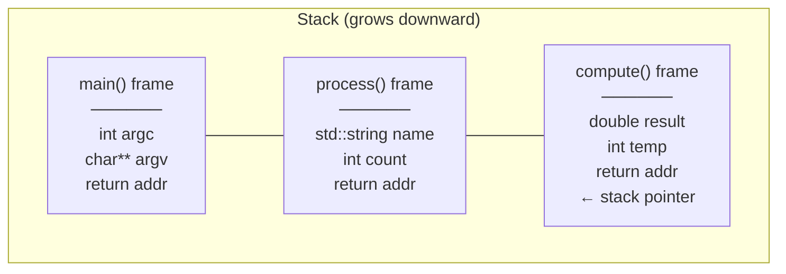

# References & The C++ Memory Model

> References are aliases — not pointers, not copies — and understanding them alongside the C++ memory model (stack vs heap, storage duration, object lifetimes) gives you the mental framework to reason about where objects live, when they die, and why C++'s deterministic destruction is one of its greatest strengths.

## Table of Contents
- [Core Concepts](#core-concepts)
- [Code Examples](#code-examples)
- [Common Pitfalls](#common-pitfalls)
- [Key Takeaways](#key-takeaways)
- [Exercises](#exercises)

## Core Concepts

### References (`&`) — Aliases, Not Pointers

#### What

A reference is an alias — another name for an existing object. When you write `int& ref = x;`, `ref` *is* `x`. Not a copy of `x`, not a pointer to `x` — it's the same object with a different name. Every read from `ref` reads `x`, and every write to `ref` writes `x`.

References have three fundamental properties that distinguish them from pointers:

1. **Cannot be null.** A reference must always refer to a valid object. There's no "null reference" (forming one is undefined behavior).
2. **Cannot be reseated.** Once bound, a reference always refers to the same object. You can't make it point to something else.
3. **No indirection syntax.** You use a reference exactly like the original variable — no `*` to dereference, no `->` to access members.

#### How

Under the hood, the compiler *usually* implements a reference as a pointer — it stores the address of the referent. But this is an implementation detail, not a language guarantee. The compiler is free to optimize the reference away entirely, replacing every use of `ref` with the original variable. What matters is the semantics: a reference is an alias, and the language enforces alias-like behavior.



The difference between a reference and a pointer is *semantic intent*:
- A **pointer** says: "I hold an address. I might be null. I might be reassigned to point elsewhere."
- A **reference** says: "I am this object. Period."

#### Why It Matters

References exist because C++ needed a way to pass objects to functions efficiently (without copying) while maintaining value syntax (no `*` or `->` at the call site). They're also required for operator overloading — `a + b` can't work if `operator+` requires pointer syntax.

The "cannot be null" property is the key safety advantage. When a function takes a `const Widget& w`, both the caller and the implementer know that `w` is a valid object — no null check needed. When a function takes a `Widget* w`, both parties must consider the possibility that `w` is null. References encode validity in the type system.

### Lvalue References vs Rvalue References

#### What

C++ has two kinds of references:

- **Lvalue reference (`T&`)** — binds to an lvalue (a named object with a persistent address). `int& ref = x;` is an lvalue reference.
- **Rvalue reference (`T&&`)** — binds to an rvalue (a temporary or an object you've explicitly marked as "moveable" with `std::move`). `int&& rref = 42;` is an rvalue reference.

A `const` lvalue reference (`const T&`) is special: it can bind to *both* lvalues and rvalues. This is why `void print(const std::string& s)` accepts both named strings and temporaries.

#### How

The distinction matters primarily for move semantics (covered in depth in a later week). For now, the key insight is:

- `T&` = "I want to read/write an existing named object"
- `const T&` = "I want to read any object (named or temporary) without copying it"
- `T&&` = "I want to steal the guts of a temporary that's about to be destroyed"



#### Why It Matters

Understanding value categories (lvalue vs rvalue) is foundational for understanding move semantics, perfect forwarding, and why `const T&` is the default way to pass objects you don't need to modify. Without this model, you'll struggle with overload resolution, universal references, and the entire move/copy machinery that makes modern C++ fast.

### `const` References — The Default Parameter Type

#### What

When you pass an object to a function by `const T&`, you're telling the compiler three things: (1) don't copy the object, (2) don't allow the function to modify it, and (3) accept both named variables and temporaries.

This is the default way to pass objects in C++ when you don't need to modify them and the object might be expensive to copy (anything larger than a pointer, roughly).

#### How

For cheap-to-copy types (`int`, `double`, `char`, `bool`, pointers), pass by value — the copy is free or nearly free, and value semantics avoid aliasing concerns. For everything else (`std::string`, `std::vector`, custom types), pass by `const T&` to avoid the copy.

C++17 adds a refinement: for read-only string parameters, prefer `std::string_view` over `const std::string&`. A `string_view` is a lightweight, non-owning view (pointer + size) that avoids allocating a `std::string` when the caller passes a string literal or a `const char*`.

#### Why It Matters

This is not a style preference — it's a performance decision. Passing a `std::vector<int>` with 10,000 elements by value copies the entire vector (10,000 * 4 bytes = 40KB of copying). Passing by `const T&` costs nothing — it's just an address. Getting this wrong in a hot loop can make your program orders of magnitude slower.

### The C++ Memory Model — Stack vs Heap

#### What

Every C++ program has two primary regions of memory for storing objects:

- **Stack** — a contiguous block of memory managed automatically by the compiler. Local variables live here. Allocation and deallocation are instantaneous (just adjust the stack pointer). The stack is small (typically 1-8 MB) and grows/shrinks in LIFO (last-in, first-out) order.
- **Heap** (free store) — a large pool of memory managed manually (via `new`/`delete`) or semi-automatically (via smart pointers). Allocation and deallocation are comparatively slow because the allocator must find a suitable free block and manage fragmentation.

#### How

When you declare a local variable, the compiler reserves space on the stack as part of the function's stack frame. When the function returns, the entire frame is destroyed — all local variables are cleaned up in one shot, in reverse order of construction. No work needed from you.

When you call `new`, the runtime allocator searches the heap for a free block of the requested size, returns a pointer to it, and records the allocation. You (or a smart pointer) must later call `delete` to return the memory. Forgetting to do so is a memory leak.



#### Why It Matters

The stack-vs-heap distinction is the foundation of C++ performance. Stack allocation is essentially free — it's a single instruction (decrement the stack pointer). Heap allocation involves a function call to the allocator, possible system calls, and bookkeeping overhead. In embedded systems and real-time applications, heap allocation may be outright banned because its timing is unpredictable.

This is why C++ defaults to stack allocation for local variables, and why the language is designed to let you avoid heap allocation whenever possible. `std::array` over `std::vector` when the size is known at compile time. `std::variant` over inheritance hierarchies. Value semantics over pointer indirection. Every time you avoid a heap allocation, you get faster, more predictable code.

### Storage Duration

#### What

Every object in C++ has a **storage duration** that determines when its memory is allocated and deallocated. There are four kinds:

1. **Automatic** — local variables. Allocated when the enclosing scope is entered, deallocated when it exits. This is the stack.
2. **Dynamic** — objects created with `new`. Allocated explicitly, deallocated explicitly with `delete` (or by a smart pointer). This is the heap.
3. **Static** — global variables, `static` local variables, `static` class members. Allocated when the program starts (or on first use for local statics), deallocated when the program exits.
4. **Thread-local** — declared with `thread_local`. Each thread gets its own copy, allocated when the thread starts and deallocated when it ends.

#### How

| Storage Duration | Where | Lifetime | Example |
|---|---|---|---|
| Automatic | Stack | Scope-based (block/function) | `int x = 42;` |
| Dynamic | Heap | Until `delete` (or smart ptr dies) | `auto p = new int{42};` |
| Static | Static/global area | Entire program | `static int count = 0;` |
| Thread-local | Per-thread area | Thread lifetime | `thread_local int id;` |

#### Why It Matters

Understanding storage duration tells you the answer to the two most important questions about any object: "When does it get created?" and "When does it get destroyed?" Getting these wrong leads to use-after-free (accessing an object after its storage has been reclaimed), double-free (deleting an object twice), and memory leaks (never deleting a dynamic object).

The guiding principle: **use automatic storage (stack) by default.** It's the fastest, safest, and most predictable option. Only use dynamic storage when you need the object to outlive its creating scope, or when the size isn't known at compile time.

### Lifetime of Objects — Construction, Destruction, and Determinism

#### What

An object's **lifetime** begins when its constructor completes and ends when its destructor starts. This is distinct from storage duration — storage is about memory allocation, lifetime is about when the object is valid and usable.

For automatic objects, lifetime and storage are tied together: the constructor runs when execution reaches the declaration, and the destructor runs when execution leaves the scope — in **reverse order of construction**. This is guaranteed by the language, and it's the foundation of RAII.

#### How

Consider what happens in this scope:

```cpp
{
    std::string a{"first"};    // 1. a constructed
    std::vector<int> b{1, 2};  // 2. b constructed
    std::mutex c;               // 3. c constructed
    // ... use a, b, c ...
}   // 3. c destroyed, then 2. b destroyed, then 1. a destroyed
```

The destruction order is guaranteed: reverse of construction. This matters because objects constructed later might depend on objects constructed earlier. The reverse order ensures that when an object's destructor runs, everything it depends on is still alive.



For dynamic objects, lifetime is controlled by `new` and `delete`:

- `new T{args}` — allocates storage, then runs the constructor. Lifetime begins.
- `delete ptr` — runs the destructor, then deallocates storage. Lifetime ends.

Smart pointers automate this: `std::unique_ptr` calls `delete` in its own destructor, so the dynamic object's lifetime is tied to the smart pointer's lifetime — which is typically automatic (stack-based). This is RAII applied to heap memory.

#### Why It Matters

Deterministic destruction is C++'s killer feature compared to garbage-collected languages. In Java, Python, or Go, you don't know *when* an object will be destroyed — the garbage collector runs at unpredictable times. This means you can't rely on destructors for resource cleanup (closing files, releasing locks, flushing buffers). You need explicit `close()` calls or `try/finally` blocks, which are easy to forget.

In C++, destructors run at exactly the right time — when the scope ends. A `std::lock_guard` releases its mutex when the scope exits. A `std::ofstream` flushes and closes its file when it goes out of scope. A `std::unique_ptr` frees its memory when it's destroyed. No discipline required, no cleanup code to forget. This predictability is why C++ is chosen for systems where resource management must be airtight: operating systems, database engines, real-time audio/video, embedded firmware.

### Stack Frames and Function Calls

#### What

Every function call creates a **stack frame** — a block of stack memory that holds the function's local variables, parameters, return address, and saved registers. When the function returns, its stack frame is popped, and all its local variables are destroyed.

#### How

The stack pointer (a CPU register) tracks the top of the stack. Calling a function decrements the stack pointer to reserve space for the new frame. Returning from a function increments it to reclaim the space. This is why stack allocation is so fast — it's literally just an arithmetic operation on a register.



When `compute()` returns, its frame is popped: `result` and `temp` are destroyed, and the stack pointer moves back up to `process()`'s frame. When `process()` returns, `name` and `count` are destroyed (with `name`'s destructor freeing its heap-allocated buffer).

#### Why It Matters

Understanding stack frames explains several C++ behaviors:

- **Why local variables can't be returned by reference** — the stack frame is destroyed when the function returns, so the reference would dangle.
- **Why stack overflow happens** — deep recursion or large local arrays can exhaust the limited stack space (typically 1-8 MB).
- **Why stack allocation is fast** — it's just incrementing/decrementing a register, with no allocator overhead.
- **Why destructors run in reverse order** — the stack is LIFO, so the last-constructed object is on top and gets popped first.

## Code Examples

### References — Basic Usage and Semantics

```cpp
#include <iostream>
#include <string>
#include <vector>

// Pass by const reference: no copy, no modification allowed.
// This is the default for any type larger than a pointer.
void print_stats(const std::vector<int>& data) {
    if (data.empty()) {
        std::cout << "No data.\n";
        return;
    }

    int sum = 0;
    for (const auto& val : data) {
        sum += val;
    }

    std::cout << "Count: " << data.size()
              << ", Sum: " << sum
              << ", Avg: " << static_cast<double>(sum) / data.size() << '\n';
}

// Pass by non-const reference: the function modifies the caller's object.
// The name makes it clear that this function mutates its argument.
void normalize(std::vector<double>& values) {
    if (values.empty()) return;

    double max_val = values[0];
    for (const auto& v : values) {
        if (v > max_val) max_val = v;
    }

    if (max_val == 0.0) return;

    for (auto& v : values) {
        v /= max_val;  // modifies the caller's vector in-place
    }
}

int main() {
    // References are aliases — ref IS x, not a copy of x
    int x = 42;
    int& ref = x;

    std::cout << "x = " << x << ", ref = " << ref << '\n';  // both 42

    ref = 100;  // modifying ref modifies x
    std::cout << "x = " << x << '\n';  // 100

    // References cannot be reseated — this assigns y's VALUE to x (via ref)
    int y = 200;
    ref = y;    // does NOT make ref point to y — assigns 200 to x
    std::cout << "x = " << x << '\n';  // 200 (x was modified, not ref reseated)

    // const reference: read-only alias
    const int& cref = x;
    std::cout << "cref = " << cref << '\n';  // 200
    // cref = 999;  // compile error: cannot modify through const reference

    // const reference can bind to a temporary (rvalue)
    const std::string& greeting = std::string{"hello"};
    // The temporary's lifetime is extended to match the reference's scope
    std::cout << greeting << '\n';

    // Passing by reference in practice
    const std::vector<int> numbers = {10, 20, 30, 40, 50};
    print_stats(numbers);  // no copy — just passes an address

    std::vector<double> readings = {3.5, 7.0, 2.1, 10.0, 5.5};
    normalize(readings);  // modifies readings in-place
    for (const auto& r : readings) {
        std::cout << r << ' ';
    }
    std::cout << '\n';

    return 0;
}
```

### Stack vs Heap — Where Objects Live

```cpp
#include <array>
#include <iostream>
#include <memory>
#include <string>
#include <vector>

// This function demonstrates where different objects are allocated.
void demonstrate_allocation() {
    // AUTOMATIC STORAGE (stack) — fast, scope-based lifetime
    int local_int = 42;                        // 4 bytes on the stack
    std::array<double, 4> local_array = {};    // 32 bytes on the stack
    std::string local_string = "hello";        // string object on stack,
                                                // but its character data
                                                // may be on the heap (if
                                                // longer than SSO threshold)

    // DYNAMIC STORAGE (heap) — via smart pointer, RAII-managed
    auto heap_int = std::make_unique<int>(99);
    auto heap_array = std::make_unique<std::array<double, 1000>>();

    // std::vector always heap-allocates its element storage
    // (the vector object itself is on the stack, but its data buffer is on the heap)
    std::vector<int> vec = {1, 2, 3, 4, 5};

    std::cout << "local_int lives at:    " << &local_int << " (stack)\n";
    std::cout << "heap_int lives at:     " << heap_int.get() << " (heap)\n";
    std::cout << "vec object lives at:   " << &vec << " (stack)\n";
    std::cout << "vec data lives at:     " << vec.data() << " (heap)\n";

    // When this function returns:
    // - vec is destroyed: its destructor frees the heap buffer
    // - heap_array is destroyed: unique_ptr's destructor calls delete
    // - heap_int is destroyed: unique_ptr's destructor calls delete
    // - local_string is destroyed: string's destructor frees any heap buffer
    // - local_array, local_int: stack memory simply reclaimed (no destructor needed)
    // ALL cleanup is automatic — no manual delete, no finally blocks
}

int main() {
    demonstrate_allocation();

    // STATIC STORAGE — lives for the entire program
    static int call_count = 0;
    ++call_count;
    std::cout << "Called " << call_count << " time(s)\n";

    return 0;
}
```

### Object Lifetimes and Destruction Order

```cpp
#include <iostream>
#include <string>

// A simple RAII wrapper that announces its construction and destruction.
// This makes lifetime behavior visible.
class Tracer {
public:
    explicit Tracer(std::string name) : name_(std::move(name)) {
        std::cout << "  [+] " << name_ << " constructed\n";
    }

    ~Tracer() {
        std::cout << "  [-] " << name_ << " destroyed\n";
    }

    // Non-copyable, non-moveable — forces clear ownership
    Tracer(const Tracer&) = delete;
    Tracer& operator=(const Tracer&) = delete;
    Tracer(Tracer&&) = delete;
    Tracer& operator=(Tracer&&) = delete;

    const std::string& name() const { return name_; }

private:
    std::string name_;
};

void inner_function() {
    std::cout << "Entering inner_function:\n";
    Tracer c{"C"};
    Tracer d{"D"};
    std::cout << "Leaving inner_function:\n";
    // D destroyed first (LIFO), then C
}

int main() {
    std::cout << "=== Demonstration: Destruction Order ===\n\n";

    std::cout << "Entering main:\n";
    Tracer a{"A"};
    Tracer b{"B"};

    std::cout << "\nCalling inner_function:\n";
    inner_function();
    // C and D are already destroyed at this point

    std::cout << "\nEntering block scope:\n";
    {
        Tracer e{"E"};
        std::cout << "  E is alive in this scope.\n";
    }  // E destroyed here — scope ends
    std::cout << "E is gone.\n";

    std::cout << "\nLeaving main:\n";
    // B destroyed first (LIFO), then A

    return 0;
}

// Expected output:
// === Demonstration: Destruction Order ===
//
// Entering main:
//   [+] A constructed
//   [+] B constructed
//
// Calling inner_function:
// Entering inner_function:
//   [+] C constructed
//   [+] D constructed
// Leaving inner_function:
//   [-] D destroyed
//   [-] C destroyed
//
// Entering block scope:
//   [+] E constructed
//   E is alive in this scope.
//   [-] E destroyed
// E is gone.
//
// Leaving main:
//   [-] B destroyed
//   [-] A destroyed
```

### Storage Duration — All Four Kinds

```cpp
#include <iostream>
#include <memory>
#include <thread>

// STATIC storage: initialized once, lives until program exit
int global_counter = 0;

void count_calls() {
    // STATIC local: initialized on first call, persists across calls.
    // Unlike a global, it's scoped to this function — encapsulated.
    static int call_count = 0;
    ++call_count;
    std::cout << "count_calls invoked " << call_count << " time(s)\n";
}

// THREAD-LOCAL storage: each thread gets its own independent copy
thread_local int per_thread_id = 0;

void thread_work(int id) {
    per_thread_id = id;  // each thread writes to its own copy
    std::cout << "Thread " << id << ": per_thread_id = " << per_thread_id << '\n';
}

int main() {
    // AUTOMATIC storage (stack): created at declaration, destroyed at scope exit
    {
        int auto_var = 42;
        std::cout << "auto_var = " << auto_var << " (stack, alive in this scope)\n";
    }
    // auto_var is destroyed here — accessing it would be UB

    // DYNAMIC storage (heap): created with new, destroyed with delete
    // Always use smart pointers — never raw new/delete in application code
    {
        auto dynamic_ptr = std::make_unique<int>(99);
        std::cout << "dynamic value = " << *dynamic_ptr << " (heap)\n";
    }
    // unique_ptr destroyed here → calls delete → heap memory freed

    // STATIC storage: call_count persists across invocations
    count_calls();  // 1
    count_calls();  // 2
    count_calls();  // 3

    // THREAD-LOCAL storage: each thread has its own per_thread_id
    std::thread t1(thread_work, 1);
    std::thread t2(thread_work, 2);
    t1.join();
    t2.join();

    // Main thread's per_thread_id is still 0 — unaffected by other threads
    std::cout << "Main thread: per_thread_id = " << per_thread_id << '\n';

    return 0;
}
```

### Const Correctness with References

```cpp
#include <iostream>
#include <numeric>
#include <string>
#include <vector>

struct SensorReading {
    std::string sensor_id;
    double value;
    bool is_valid;
};

// const T& — read-only access, accepts both lvalues and rvalues.
// Use this for any parameter you don't intend to modify.
double average_valid_readings(const std::vector<SensorReading>& readings) {
    double sum = 0.0;
    int count = 0;

    for (const auto& reading : readings) {
        if (reading.is_valid) {
            sum += reading.value;
            ++count;
        }
    }

    return count > 0 ? sum / count : 0.0;
}

// T& — mutable reference, modifies the caller's object.
// Name the function to make the mutation obvious.
void mark_outliers_invalid(std::vector<SensorReading>& readings,
                           double threshold) {
    const double avg = average_valid_readings(readings);

    for (auto& reading : readings) {
        if (reading.is_valid && std::abs(reading.value - avg) > threshold) {
            reading.is_valid = false;  // modifies the caller's data
        }
    }
}

// string_view for read-only string parameters — avoids allocating
// a std::string when called with a string literal.
void log_message(std::string_view tag, std::string_view message) {
    std::cout << "[" << tag << "] " << message << '\n';
}

int main() {
    std::vector<SensorReading> readings = {
        {"S1", 22.5, true},
        {"S2", 23.1, true},
        {"S3", 99.9, true},   // outlier
        {"S4", 22.8, true},
        {"S5", -1.0, false},  // already invalid
    };

    log_message("INFO", "Computing average...");
    const double avg = average_valid_readings(readings);
    std::cout << "Average (before cleanup): " << avg << '\n';

    log_message("INFO", "Marking outliers...");
    mark_outliers_invalid(readings, 10.0);

    const double clean_avg = average_valid_readings(readings);
    std::cout << "Average (after cleanup): " << clean_avg << '\n';

    // Show which readings are still valid
    for (const auto& r : readings) {
        std::cout << r.sensor_id << ": " << r.value
                  << (r.is_valid ? " (valid)" : " (invalid)") << '\n';
    }

    return 0;
}
```

## Common Pitfalls

### Returning a reference to a local variable

```cpp
// BAD — returning a reference to a stack variable that's about to be destroyed
#include <string>

std::string& make_greeting(std::string_view name) {
    std::string result = "Hello, " + std::string{name} + "!";
    return result;  // WARNING: returning reference to local variable!
}
// 'result' is destroyed when the function returns.
// The caller gets a dangling reference — any access is undefined behavior.
```

This is one of the most dangerous bugs in C++. When the function returns, `result`'s stack frame is popped and the memory is reclaimed. The reference now points to freed memory. The compiler will warn you (`-Wreturn-local-addr`), but only if you enable warnings.

```cpp
// GOOD — return by value; the compiler will elide the copy (RVO / NRVO)
#include <iostream>
#include <string>

std::string make_greeting(std::string_view name) {
    std::string result = "Hello, " + std::string{name} + "!";
    return result;  // returned by value — no dangling, no copy (NRVO applies)
}

int main() {
    // The string is constructed directly in main's stack frame (copy elision).
    // No copy, no move, no dangling reference. This is the idiomatic pattern.
    const auto greeting = make_greeting("Alice");
    std::cout << greeting << '\n';
    return 0;
}
```

### Dangling reference from a destroyed temporary

```cpp
// BAD — capturing a reference to a temporary that dies at the end of the statement
#include <iostream>
#include <string>

const std::string& first_word(const std::string& sentence) {
    // This looks fine — we're returning a const reference.
    // But if the caller passes a temporary, the temporary dies
    // after the full expression, and the returned reference dangles.
    return sentence;  // returns a reference to the parameter
}

int main() {
    // "hello world" creates a temporary std::string.
    // first_word returns a reference to it.
    // The temporary is destroyed at the semicolon.
    // result is now a dangling reference.
    const std::string& result = first_word("hello world");
    std::cout << result << '\n';  // UB: reading from destroyed temporary

    return 0;
}
```

Lifetime extension only applies when you *directly* bind a `const T&` to a temporary. It does not apply when the reference is returned from a function. The fix is to return by value, or ensure the referenced object outlives the reference.

```cpp
// GOOD — return by value when the source might be temporary
#include <iostream>
#include <string>

std::string first_word(std::string_view sentence) {
    const auto pos = sentence.find(' ');
    if (pos == std::string_view::npos) {
        return std::string{sentence};
    }
    return std::string{sentence.substr(0, pos)};
}

int main() {
    // Returned by value — no lifetime issues.
    const auto word = first_word("hello world");
    std::cout << word << '\n';  // "hello"
    return 0;
}
```

### Using a reference after the referred-to object is destroyed

```cpp
// BAD — reference outlives the object it refers to
#include <iostream>
#include <vector>

int main() {
    std::vector<int> numbers = {10, 20, 30};

    // ref binds to the first element of the vector
    int& ref = numbers[0];
    std::cout << "ref = " << ref << '\n';  // 10 — fine

    // push_back may reallocate the vector's internal buffer.
    // If it does, all existing elements are moved to a new buffer,
    // and the old buffer is freed. ref now dangles.
    numbers.push_back(40);
    numbers.push_back(50);
    numbers.push_back(60);

    // UB: ref may point to freed memory after reallocation
    std::cout << "ref = " << ref << '\n';  // undefined behavior!

    return 0;
}
```

When a `std::vector` needs more capacity, it allocates a new buffer, moves all elements, and frees the old buffer. Any references, pointers, or iterators to the old elements become dangling. This is a fundamental property of contiguous containers.

```cpp
// GOOD — use indices instead of references when the container may reallocate
#include <iostream>
#include <vector>

int main() {
    std::vector<int> numbers = {10, 20, 30};

    // Store the index, not a reference — indices survive reallocation
    constexpr std::size_t idx = 0;
    std::cout << "numbers[0] = " << numbers[idx] << '\n';

    numbers.push_back(40);
    numbers.push_back(50);
    numbers.push_back(60);

    // Safe: indexing always works regardless of reallocation
    std::cout << "numbers[0] = " << numbers[idx] << '\n';  // still 10

    return 0;
}
```

### Confusing reference assignment with reference rebinding

```cpp
// BAD (misconception) — thinking ref = y rebinds the reference
#include <iostream>

int main() {
    int x = 10;
    int y = 20;

    int& ref = x;   // ref is now an alias for x
    ref = y;         // this does NOT make ref point to y!
                     // it ASSIGNS y's value (20) to x

    std::cout << "x = " << x << '\n';    // 20 — x was modified!
    std::cout << "y = " << y << '\n';    // 20 — y is unchanged
    std::cout << "ref = " << ref << '\n'; // 20 — ref still aliases x

    y = 999;
    std::cout << "ref = " << ref << '\n'; // still 20 — ref aliases x, not y

    return 0;
}
```

References cannot be reseated in C++. Once a reference is bound to an object, every operation on the reference is an operation on that object. `ref = y` does not rebind `ref` to `y` — it copies `y`'s value into the object `ref` aliases (which is `x`). This is a common source of confusion for people coming from languages where references *can* be reseated (like Python variables).

```cpp
// GOOD — understand that ref = y is value assignment, not rebinding
#include <iostream>

int main() {
    int x = 10;
    int y = 20;

    int& ref = x;        // ref aliases x for its entire lifetime
    std::cout << "ref aliases x, value: " << ref << '\n';  // 10

    ref = y;              // copies y's value into x (through the alias)
    std::cout << "After ref = y: x = " << x << '\n';       // 20

    // If you need to "switch" which object you refer to,
    // use a pointer instead — pointers CAN be reseated.
    int* ptr = &x;
    std::cout << "*ptr = " << *ptr << '\n';  // 20 (points to x)

    ptr = &y;  // reseated — now points to y
    std::cout << "*ptr = " << *ptr << '\n';  // 20 (points to y)

    return 0;
}
```

## Key Takeaways

- **References are aliases, not pointers.** They cannot be null, cannot be reseated, and use value syntax. Use `const T&` as the default parameter type for anything larger than a pointer, and `T&` when the function needs to modify the caller's object.
- **Stack allocation is fast and automatic; heap allocation is slow and manual.** Default to the stack. Use the heap (via smart pointers) only when the object must outlive its scope or its size isn't known at compile time.
- **Destruction order is deterministic and reverse of construction.** This is the foundation of RAII — resources acquired in constructors are released in destructors, guaranteed to run in the right order, at the right time.
- **Never return a reference to a local variable.** When the function returns, the local is destroyed and the reference dangles. Return by value instead — the compiler will apply copy elision (RVO/NRVO) to avoid the copy.
- **References into containers are invalidated by reallocation.** `std::vector::push_back` can reallocate, destroying all references, pointers, and iterators to existing elements. Use indices when the container might grow.

## Exercises

1. Explain why `const std::string&` can bind to a temporary `std::string` (rvalue) but `std::string&` cannot. What is the language rule, and what is the reasoning behind it?

2. Write a function `void swap_values(int& a, int& b)` that swaps two integers using references. Then explain why this function cannot be called with literal values like `swap_values(1, 2)`.

3. Draw a memory diagram (or describe in text) showing the memory layout when this code executes:
   ```cpp
   int x = 10;
   auto p = std::make_unique<int>(20);
   std::vector<int> v = {1, 2, 3};
   ```
   For each object, state whether it's on the stack or heap, and what happens to each when the scope ends.

4. A function returns `const std::vector<int>&` — a reference to a local `std::vector`. The caller stores the result in `const auto& result`. Explain why this is dangerous, what undefined behavior occurs, and how to fix it.

5. Given a `std::vector<std::string>` with 1000 elements, you take a `const std::string&` reference to element [0], then call `push_back` to add a new element. Is the reference still valid? Explain why or why not, and describe how to safely access element [0] after the `push_back`.
