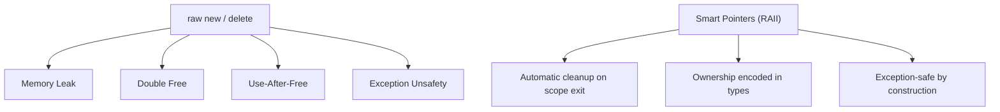
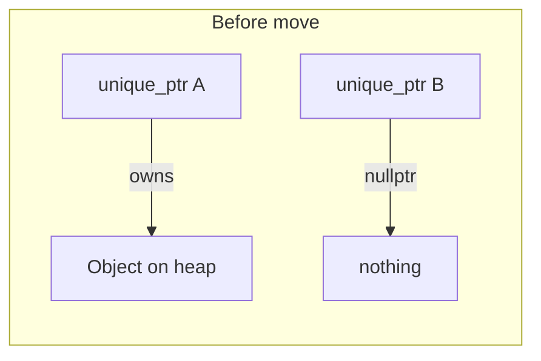
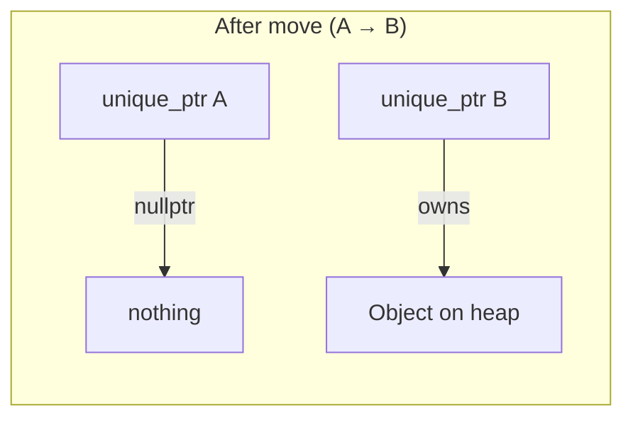
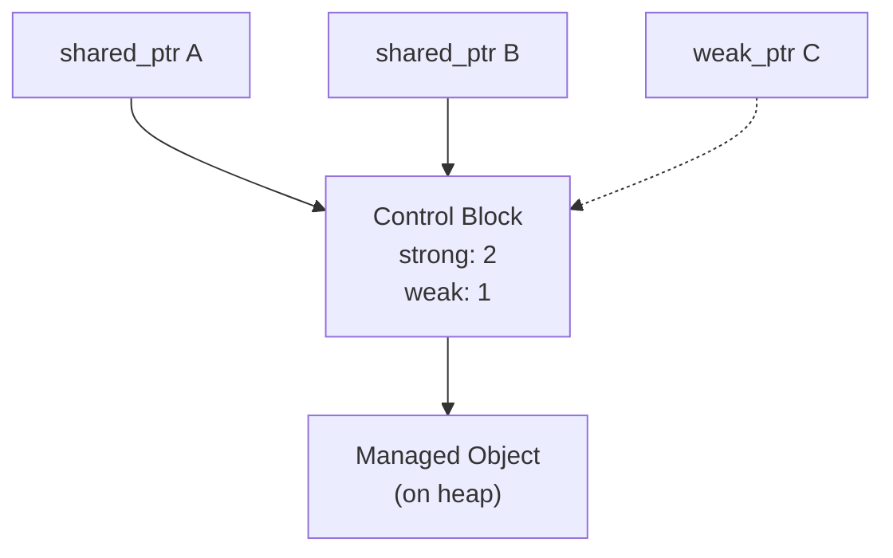
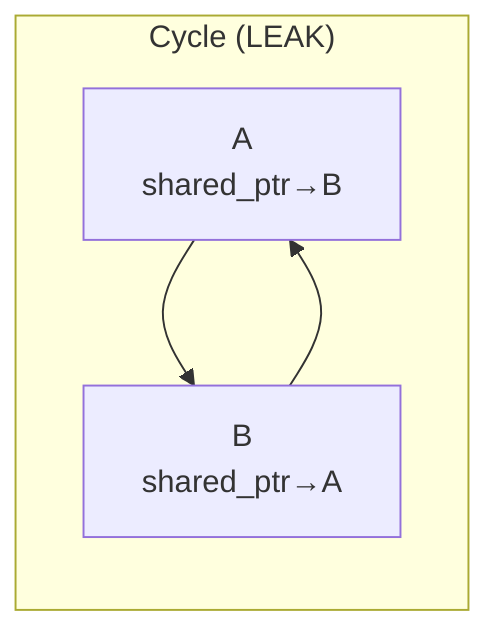
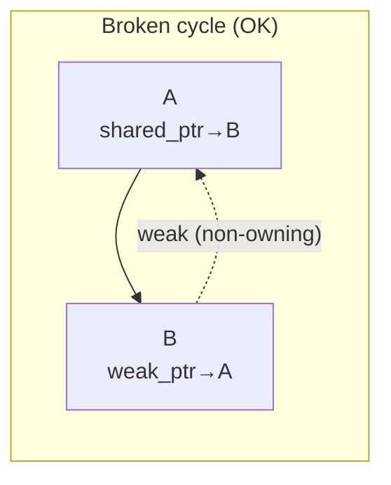

# Smart Pointers & Memory Safety

> Smart pointers encode ownership semantics directly in the type system, turning memory bugs — leaks, double-frees, use-after-free — from runtime mysteries into compile-time impossibilities.

## Table of Contents
- [Core Concepts](#core-concepts)
- [Code Examples](#code-examples)
- [Common Pitfalls](#common-pitfalls)
- [Key Takeaways](#key-takeaways)
- [Exercises](#exercises)

## Core Concepts

### Why Smart Pointers Exist

#### What

Smart pointers are class templates in `<memory>` that wrap a raw pointer and automatically manage the pointed-to object's lifetime. When the smart pointer is destroyed (goes out of scope, is reassigned, etc.), it automatically deletes the managed object. The three standard smart pointers are `std::unique_ptr`, `std::shared_ptr`, and `std::weak_ptr`.

#### How

Before C++11, C++ developers managed heap memory with raw `new` and `delete`. This required perfect discipline: every `new` needed exactly one matching `delete`, on every code path, including exception paths. Smart pointers replace this discipline with automation — the destructor handles cleanup, and RAII guarantees it runs.

#### Why It Matters

Manual memory management with `new`/`delete` is the single largest source of bugs in C and C++ code. Consider what can go wrong:

- **Memory leak**: you `new` an object but forget to `delete` it (or an exception skips the `delete`).
- **Double-free**: you `delete` the same pointer twice — undefined behavior, often a crash or heap corruption.
- **Use-after-free**: you `delete` an object and then access it through a dangling pointer — undefined behavior, often a security vulnerability.
- **Exception unsafety**: an exception is thrown between `new` and `delete`, and the `delete` never runs.

Smart pointers eliminate all four problems by encoding *who owns the object* in the type system. The compiler enforces the ownership contract — no discipline required.



### `new` and `delete` Under the Hood

#### What

The `new` expression does two things: (1) allocates raw memory from the heap by calling `operator new` (which typically calls `malloc`), then (2) constructs the object in that memory by calling its constructor. The `delete` expression does the reverse: (1) calls the object's destructor, then (2) deallocates the memory by calling `operator delete` (which typically calls `free`).

For arrays, `new[]` and `delete[]` do the same but for multiple objects. Using `delete` on an array (instead of `delete[]`) is undefined behavior — it may only destroy the first element, or corrupt the heap.

#### How

```cpp
// What 'new int(42)' actually does:
// 1. void* mem = operator new(sizeof(int));  // allocate 4 bytes on heap
// 2. int* p = static_cast<int*>(mem);
// 3. *p = 42;                                // construct (trivial for int)

// What 'delete p' actually does:
// 1. p->~int();                              // destruct (trivial for int)
// 2. operator delete(p);                     // deallocate memory
```

You can override `operator new` and `operator delete` globally or per-class to customize allocation (e.g., pool allocators, tracking allocations). But overriding them is an advanced technique — in application code, you should never call `new` or `delete` directly.

#### Why It Matters

Understanding what `new`/`delete` do under the hood explains *why* mismatching them is catastrophic: calling `delete` on memory allocated with `malloc`, or `delete` on an array allocated with `new[]`, gives the runtime allocator inconsistent metadata, corrupting the heap. Smart pointers handle this correctly by construction — `unique_ptr<T[]>` calls `delete[]`, and `unique_ptr<T>` calls `delete`.

### `std::unique_ptr` — Exclusive Ownership

#### What

`std::unique_ptr<T>` is a smart pointer that *exclusively owns* a dynamically allocated object. Exactly one `unique_ptr` can point to a given object at any time. When the `unique_ptr` is destroyed, it deletes the managed object. It cannot be copied — only moved. This enforces the "single owner" invariant at compile time.

#### How

`unique_ptr` is implemented as a thin wrapper around a raw pointer. It stores the pointer and (optionally) a deleter. The copy constructor and copy assignment operator are explicitly deleted; only move operations are allowed. Moving a `unique_ptr` transfers ownership — the source becomes `nullptr`, and the destination takes over.

The overhead of `unique_ptr` compared to a raw pointer is exactly zero. The compiler optimizes it down to the same machine code as manual `new`/`delete` — this is a textbook zero-cost abstraction.





#### Why It Matters

`unique_ptr` should be your **default choice** for heap allocation. The reasoning is simple: most objects have exactly one owner. A function creates an object, uses it, and eventually the object is no longer needed. `unique_ptr` models this perfectly — the owner is always clear, and cleanup is automatic.

Because `unique_ptr` is move-only, it makes ownership transfers explicit. When you see a function that takes `unique_ptr<Widget>` by value, you know immediately: "this function is taking ownership of my widget." When you see a function returning `unique_ptr<Widget>`, you know: "I'm receiving ownership." The type system communicates intent that raw pointers cannot.

Key operations:

- **Create**: `auto p = std::make_unique<T>(args...)` (preferred) or `std::unique_ptr<T>(new T(args...))`.
- **Transfer ownership**: `auto q = std::move(p)` — after this, `p` is `nullptr`.
- **Release ownership**: `T* raw = p.release()` — returns the raw pointer and sets `p` to `nullptr`. You now own the raw pointer.
- **Replace managed object**: `p.reset(new_ptr)` — deletes the old object, takes ownership of `new_ptr`.
- **Access**: `*p`, `p->member`, `p.get()` (raw pointer without transferring ownership).

### `std::shared_ptr` — Shared Ownership

#### What

`std::shared_ptr<T>` is a smart pointer that allows *multiple owners* of the same object. It uses **reference counting**: an internal counter tracks how many `shared_ptr` instances point to the object. When the last `shared_ptr` is destroyed (the count drops to zero), the object is deleted.

#### How

Internally, `shared_ptr` allocates a **control block** on the heap, separate from the managed object. The control block contains:

1. The **strong reference count** (number of `shared_ptr` instances).
2. The **weak reference count** (number of `weak_ptr` instances — more on this later).
3. The **deleter** (how to destroy the managed object).
4. The **allocator** (how to deallocate the memory).

Every copy of a `shared_ptr` increments the strong count (atomically, for thread safety). Every destruction decrements it. When the strong count hits zero, the object is destroyed. When both counts hit zero, the control block is deallocated.



#### Why It Matters

`shared_ptr` has real costs that `unique_ptr` doesn't:

- **Control block allocation**: an extra heap allocation (unless you use `make_shared`, which combines them).
- **Atomic reference counting**: every copy and destruction performs an atomic increment/decrement. On x86, this is a `lock inc`/`lock dec` instruction — cheap individually, but measurable in tight loops.
- **Larger size**: `shared_ptr` is typically two pointers wide (pointer to object + pointer to control block), versus one pointer for `unique_ptr`.

Use `shared_ptr` **only when you genuinely have shared ownership** — when the lifetime of an object depends on multiple independent owners, and you can't determine at design time which owner will outlive the others. Common examples: objects in a cache that might be evicted while clients still hold references, or nodes in a graph where multiple edges point to the same node.

If you're reaching for `shared_ptr` because "I'm not sure who owns this," that's a design smell. Clarify ownership first. Most of the time, one owner with `unique_ptr` and non-owning raw pointers for everyone else is the correct design.

### `std::weak_ptr` — Non-Owning Observer

#### What

`std::weak_ptr<T>` is a non-owning smart pointer that observes an object managed by `shared_ptr` without preventing its destruction. It doesn't contribute to the strong reference count. You cannot dereference a `weak_ptr` directly — you must first attempt to "lock" it into a `shared_ptr`, which succeeds only if the object still exists.

#### How

A `weak_ptr` is constructed from a `shared_ptr`. It increments the *weak* reference count in the control block, not the strong count. To access the object, you call `wp.lock()`, which returns a `shared_ptr` if the object is still alive (strong count > 0) or an empty `shared_ptr` if the object has been destroyed.

The control block itself is deallocated only when *both* the strong and weak counts reach zero. This means the control block may outlive the managed object — a minor overhead, but important to understand.

#### Why It Matters

`weak_ptr` solves two problems:

**1. Breaking reference cycles.** If object A holds a `shared_ptr` to B, and B holds a `shared_ptr` to A, neither can ever be destroyed — their reference counts never reach zero. This is a memory leak. Replacing one of those `shared_ptr`s with a `weak_ptr` breaks the cycle.





**2. Observer pattern.** When an observer needs a reference to a subject, but the observer should not keep the subject alive, `weak_ptr` is the right tool. The observer can check whether the subject still exists before accessing it, without preventing its destruction.

### `std::make_unique` and `std::make_shared`

#### What

`std::make_unique<T>(args...)` (C++14) and `std::make_shared<T>(args...)` (C++11) are factory functions that create smart pointers without calling `new` directly. They forward their arguments to `T`'s constructor.

#### How

```cpp
// Preferred: factory functions
auto up = std::make_unique<Widget>(42, "hello");   // creates unique_ptr<Widget>
auto sp = std::make_shared<Widget>(42, "hello");   // creates shared_ptr<Widget>

// Avoid: raw new
auto up2 = std::unique_ptr<Widget>(new Widget(42, "hello"));   // works, but worse
auto sp2 = std::shared_ptr<Widget>(new Widget(42, "hello"));   // works, but worse
```

`make_shared` has a special optimization: it allocates the control block and the managed object in a *single* heap allocation, rather than two separate ones. This improves cache locality and reduces allocation overhead.

#### Why It Matters

There are three reasons to prefer factory functions:

**1. Exception safety.** Consider: `process(std::shared_ptr<Widget>(new Widget), compute_priority())`. The compiler is allowed to evaluate the arguments in any order. If it evaluates `new Widget` first, then `compute_priority()` throws an exception, the `Widget` is leaked — the `shared_ptr` was never constructed to take ownership. `make_shared` eliminates this risk because the allocation and the smart pointer construction happen in one indivisible call. (Note: C++17 fixed the evaluation order rules for function arguments, but `make_shared` remains preferred for the other reasons.)

**2. Performance.** `make_shared` combines two heap allocations (object + control block) into one. Heap allocations are expensive relative to stack operations, so halving them matters in performance-sensitive code.

**3. Readability.** `make_unique` and `make_shared` eliminate the visual noise of `new`, making ownership intent clearer and establishing a codebase convention: `new` should never appear in application code.

### Raw Pointers — The Modern Role of `T*`

#### What

In modern C++, raw pointers (`T*`) are **non-owning observers**. They point to an object but have no responsibility for its lifetime — they don't create it, they don't destroy it. This is a *convention*, not a language rule, but it's universally adopted in modern C++ codebases.

#### How

A function that receives a raw pointer is saying: "I need to look at this object, but I don't own it and won't delete it." A function that receives a `unique_ptr` is saying: "I'm taking ownership." A function that receives a reference (`T&`) is saying: "I need access, the object is guaranteed to exist, and null is not an option."

The decision tree for parameter types:

| Situation | Use |
|---|---|
| Non-owning, must exist | `T&` or `const T&` |
| Non-owning, might be null | `T*` or `const T*` |
| Transferring ownership | `std::unique_ptr<T>` |
| Sharing ownership | `std::shared_ptr<T>` |

#### Why It Matters

Raw pointers haven't disappeared from modern C++ — they've been *reinterpreted*. The old meaning of `T*` was ambiguous: does the caller own this? Should I delete it? Is it an array? Modern C++ resolves this ambiguity by giving ownership to smart pointers and using `T*` exclusively for non-owning observation. When every pointer in your codebase follows this convention, you can read any function signature and immediately understand the ownership model.

### Memory Leakage

#### What

A memory leak occurs when dynamically allocated memory becomes unreachable — no pointer in the program refers to it, so it can never be freed. The memory remains allocated until the process terminates. In long-running programs (servers, daemons, embedded systems), leaks accumulate and eventually exhaust available memory.

#### How

Leaks happen in three main ways:

1. **Lost pointer**: you overwrite or destroy the only pointer to a heap allocation without freeing it.
2. **Early return or exception**: a function allocates with `new`, and an early `return` or thrown exception skips the `delete`.
3. **Reference cycle**: two `shared_ptr` objects point to each other, so neither reference count ever reaches zero.

#### Why It Matters

Smart pointers prevent the first two categories of leaks automatically — `unique_ptr` and `shared_ptr` both call `delete` in their destructors, which run deterministically when the smart pointer goes out of scope, regardless of how control flow exits the scope (normal return, early return, exception). For reference cycles, `weak_ptr` breaks the cycle.

The key insight: **if every heap allocation is owned by a smart pointer from the moment of creation, leaks are structurally impossible**. This is why the rule is "never write `new` in application code" — `make_unique` and `make_shared` ensure the allocation is *immediately* owned.

## Code Examples

### `unique_ptr` Basics — Factory Pattern and Ownership Transfer

```cpp
#include <iostream>
#include <memory>
#include <string>

class Sensor {
public:
    explicit Sensor(std::string name, int id)
        : name_{std::move(name)}, id_{id} {
        std::cout << "Sensor '" << name_ << "' created\n";
    }

    ~Sensor() {
        std::cout << "Sensor '" << name_ << "' destroyed\n";
    }

    // Non-copyable — each sensor represents a unique hardware resource
    Sensor(const Sensor&) = delete;
    Sensor& operator=(const Sensor&) = delete;

    // Moveable — ownership can be transferred
    Sensor(Sensor&&) = default;
    Sensor& operator=(Sensor&&) = default;

    void read_value() const {
        std::cout << "  [" << name_ << "#" << id_ << "] reading value...\n";
    }

    const std::string& name() const { return name_; }

private:
    std::string name_;
    int id_;
};

// Factory function — returns unique_ptr to signal: "caller receives ownership"
std::unique_ptr<Sensor> create_sensor(std::string name, int id) {
    auto sensor = std::make_unique<Sensor>(std::move(name), id);
    // The sensor is configured and ready to use.
    // Returning unique_ptr transfers ownership to the caller.
    return sensor;  // move elision — no explicit std::move needed on return
}

// Takes ownership — the caller gives up their sensor
void register_sensor(std::unique_ptr<Sensor> sensor) {
    std::cout << "Registered sensor: " << sensor->name() << "\n";
    // sensor is destroyed at the end of this function —
    // we own it, we decide its lifetime.
}

// Non-owning access — just borrows the sensor via raw pointer
// The raw T* signals: "I don't own this, I just need to look at it"
void inspect_sensor(const Sensor* sensor) {
    if (!sensor) {
        std::cout << "No sensor to inspect.\n";
        return;
    }
    sensor->read_value();
}

int main() {
    // Create a sensor — we own it via unique_ptr
    auto temp_sensor = create_sensor("Temperature", 1);
    auto pressure_sensor = create_sensor("Pressure", 2);

    // Non-owning observation: pass raw pointer via .get()
    // The function borrows the sensor but doesn't own it
    inspect_sensor(temp_sensor.get());
    inspect_sensor(pressure_sensor.get());

    // Transfer ownership: std::move is required because unique_ptr is move-only.
    // After this line, temp_sensor is nullptr — we no longer own it.
    register_sensor(std::move(temp_sensor));

    // temp_sensor is now nullptr — accessing it would be a bug
    inspect_sensor(temp_sensor.get());  // prints "No sensor to inspect."

    // pressure_sensor is destroyed here when main() returns —
    // unique_ptr's destructor calls delete automatically.
    std::cout << "End of main\n";
    return 0;
}
```

### `unique_ptr` with Custom Deleter — RAII for C-Style Resources

```cpp
#include <cstdio>
#include <memory>
#include <iostream>

// unique_ptr can manage ANY resource, not just memory.
// A custom deleter tells it how to release the resource.

// Type alias for a FILE* managed by unique_ptr with a custom deleter.
// The deleter is a function pointer: void(*)(FILE*)
struct FileCloser {
    void operator()(std::FILE* fp) const {
        if (fp) {
            std::cout << "Closing file.\n";
            std::fclose(fp);
        }
    }
};

using UniqueFile = std::unique_ptr<std::FILE, FileCloser>;

UniqueFile open_file(const char* path, const char* mode) {
    std::FILE* fp = std::fopen(path, mode);
    if (!fp) {
        return nullptr;  // returning nullptr is fine — represents "no resource"
    }
    return UniqueFile{fp};
}

int main() {
    // RAII for a C-style FILE*.
    // The file is automatically closed when 'log_file' goes out of scope,
    // regardless of whether we return early, throw, or reach the end normally.
    auto log_file = open_file("/tmp/test_smart_ptr.txt", "w");
    if (!log_file) {
        std::cerr << "Failed to open file.\n";
        return 1;
    }

    std::fprintf(log_file.get(), "Hello from unique_ptr!\n");

    // No manual fclose needed — the UniqueFile destructor handles it.
    // This is exception-safe: even if code between here and the end throws,
    // the file is closed.
    return 0;
}
```

### `shared_ptr` and `weak_ptr` — Cache with Expiring Entries

```cpp
#include <iostream>
#include <memory>
#include <string>
#include <unordered_map>

// A realistic use case for shared_ptr + weak_ptr: a cache that holds
// weak references so cached objects can be destroyed when no client
// needs them, and recreated on demand.

class Texture {
public:
    explicit Texture(std::string name)
        : name_{std::move(name)} {
        std::cout << "  Loading texture '" << name_ << "' (expensive!)\n";
    }

    ~Texture() {
        std::cout << "  Unloading texture '" << name_ << "'\n";
    }

    const std::string& name() const { return name_; }

private:
    std::string name_;
    // In real code: pixel data, GPU handle, etc.
};

class TextureCache {
public:
    // Returns a shared_ptr to the texture. If the texture is already cached
    // and still alive, returns the existing one. Otherwise, loads a new one.
    std::shared_ptr<Texture> get(const std::string& name) {
        auto it = cache_.find(name);
        if (it != cache_.end()) {
            // Try to promote the weak_ptr to a shared_ptr.
            // This succeeds only if at least one shared_ptr still exists.
            if (auto sp = it->second.lock()) {
                std::cout << "  Cache hit: '" << name << "'\n";
                return sp;
            }
            // The texture was destroyed — remove the stale entry
            cache_.erase(it);
        }

        // Cache miss: load the texture and store a weak_ptr
        std::cout << "  Cache miss: '" << name << "'\n";
        auto texture = std::make_shared<Texture>(name);
        cache_[name] = texture;  // stores a weak_ptr (implicit conversion)
        return texture;
    }

private:
    // weak_ptr entries don't prevent textures from being destroyed.
    // When all shared_ptr clients release their references, the texture
    // is unloaded automatically.
    std::unordered_map<std::string, std::weak_ptr<Texture>> cache_;
};

int main() {
    TextureCache cache;

    {
        // Client A loads two textures
        auto brick = cache.get("brick");     // cache miss → loads
        auto wood = cache.get("wood");       // cache miss → loads
        auto brick2 = cache.get("brick");    // cache hit → reuses

        std::cout << "  Client A has " << brick.use_count()
                  << " refs to 'brick'\n";  // 2 (brick + brick2)

        // Client B shares the brick texture
        auto brick3 = cache.get("brick");    // cache hit → reuses
        std::cout << "  Now " << brick.use_count()
                  << " refs to 'brick'\n";  // 3

    }   // All shared_ptrs destroyed here → textures unloaded

    std::cout << "\n  All clients released their textures.\n\n";

    // Textures were destroyed because no shared_ptr kept them alive.
    // The cache only held weak_ptrs, so it didn't prevent destruction.
    auto brick_again = cache.get("brick");   // cache miss → reloads

    return 0;
}
```

### Breaking a Reference Cycle with `weak_ptr`

```cpp
#include <iostream>
#include <memory>
#include <string>

// A parent-child relationship where the parent owns the child,
// but the child needs a back-reference to the parent.
// If both used shared_ptr, neither would ever be destroyed.

class Child;  // forward declaration

class Parent : public std::enable_shared_from_this<Parent> {
public:
    explicit Parent(std::string name) : name_{std::move(name)} {
        std::cout << "Parent '" << name_ << "' created\n";
    }

    ~Parent() {
        std::cout << "Parent '" << name_ << "' destroyed\n";
    }

    void add_child(std::shared_ptr<Child> child);

    const std::string& name() const { return name_; }

private:
    std::string name_;
    std::shared_ptr<Child> child_;  // parent OWNS the child (strong ref)
};

class Child {
public:
    explicit Child(std::string name) : name_{std::move(name)} {
        std::cout << "Child '" << name_ << "' created\n";
    }

    ~Child() {
        std::cout << "Child '" << name_ << "' destroyed\n";
    }

    // weak_ptr breaks the cycle: the child can reference the parent
    // without preventing the parent's destruction.
    void set_parent(std::weak_ptr<Parent> parent) {
        parent_ = std::move(parent);
    }

    void print_parent() const {
        // Must lock the weak_ptr before accessing the parent.
        // lock() returns shared_ptr — empty if parent was destroyed.
        if (auto parent = parent_.lock()) {
            std::cout << "  Child '" << name_
                      << "' belongs to parent '" << parent->name() << "'\n";
        } else {
            std::cout << "  Child '" << name_
                      << "' has no living parent\n";
        }
    }

private:
    std::string name_;
    std::weak_ptr<Parent> parent_;  // child does NOT own the parent (weak ref)
};

void Parent::add_child(std::shared_ptr<Child> child) {
    child->set_parent(shared_from_this());
    child_ = std::move(child);
}

int main() {
    {
        auto parent = std::make_shared<Parent>("Alice");
        auto child = std::make_shared<Child>("Bob");

        parent->add_child(child);
        child->print_parent();  // "Child 'Bob' belongs to parent 'Alice'"

        // Reference counts:
        //   parent: 1 (the local variable 'parent')
        //   child:  2 (the local variable 'child' + parent's child_ member)
        //   parent's weak count: 1 (child's parent_ member)
    }
    // When scope ends:
    // 1. 'child' local var destroyed → child ref count drops to 1 (parent still owns it)
    // 2. 'parent' local var destroyed → parent ref count drops to 0 → parent destroyed
    // 3. Parent's destructor destroys child_ → child ref count drops to 0 → child destroyed
    // No leak! The weak_ptr back-reference didn't prevent destruction.

    std::cout << "No memory leaked.\n";
    return 0;
}
```

### `unique_ptr` with Polymorphism — Runtime Strategy Selection

```cpp
#include <iostream>
#include <memory>
#include <string>
#include <vector>

// Smart pointers work naturally with polymorphism.
// unique_ptr<Base> can hold any Derived object, and the virtual
// destructor ensures the correct destructor is called.

class Compressor {
public:
    virtual ~Compressor() = default;

    virtual void compress(std::string_view data) const = 0;
    virtual std::string_view name() const = 0;

    // Non-copyable, non-moveable — use via unique_ptr
    Compressor(const Compressor&) = delete;
    Compressor& operator=(const Compressor&) = delete;

protected:
    Compressor() = default;
};

class GzipCompressor final : public Compressor {
public:
    void compress(std::string_view data) const override {
        std::cout << "  [gzip] Compressing " << data.size()
                  << " bytes\n";
    }
    std::string_view name() const override { return "gzip"; }
};

class Lz4Compressor final : public Compressor {
public:
    void compress(std::string_view data) const override {
        std::cout << "  [lz4] Compressing " << data.size()
                  << " bytes (fast mode)\n";
    }
    std::string_view name() const override { return "lz4"; }
};

class ZstdCompressor final : public Compressor {
public:
    void compress(std::string_view data) const override {
        std::cout << "  [zstd] Compressing " << data.size()
                  << " bytes (balanced)\n";
    }
    std::string_view name() const override { return "zstd"; }
};

// Factory function — returns a unique_ptr<Base> holding a Derived object.
// The caller owns the compressor and can use it polymorphically.
std::unique_ptr<Compressor> create_compressor(std::string_view algorithm) {
    if (algorithm == "gzip") return std::make_unique<GzipCompressor>();
    if (algorithm == "lz4")  return std::make_unique<Lz4Compressor>();
    if (algorithm == "zstd") return std::make_unique<ZstdCompressor>();
    return nullptr;  // unknown algorithm
}

int main() {
    // Build a pipeline of compressors — each owned by a unique_ptr
    const std::vector<std::string_view> algorithms = {"lz4", "gzip", "zstd"};
    std::vector<std::unique_ptr<Compressor>> pipeline;

    for (const auto algo : algorithms) {
        if (auto compressor = create_compressor(algo)) {
            pipeline.push_back(std::move(compressor));
        }
    }

    // Use each compressor polymorphically
    const std::string data = "The quick brown fox jumps over the lazy dog.";
    for (const auto& compressor : pipeline) {
        compressor->compress(data);
    }

    // All compressors are destroyed automatically when 'pipeline' goes out of scope.
    // The virtual destructor ensures each Derived destructor is called correctly.
    return 0;
}
```

## Common Pitfalls

### Creating `shared_ptr` from the same raw pointer twice

```cpp
// BAD — two shared_ptrs independently managing the same raw pointer
#include <memory>

int main() {
    int* raw = new int(42);
    std::shared_ptr<int> sp1(raw);
    std::shared_ptr<int> sp2(raw);  // DISASTER: sp2 creates a SECOND control block

    // When sp1 and sp2 are destroyed, both call delete on 'raw'.
    // This is a double-free — undefined behavior, likely a crash.
    return 0;
}
```

Each `shared_ptr` constructed from a raw pointer creates its own control block with its own reference count. They don't know about each other. When both are destroyed, both call `delete` on the same pointer. The fix: create the `shared_ptr` once and copy it, or use `make_shared` to avoid raw pointers entirely.

```cpp
// GOOD — one shared_ptr, then copy
#include <memory>

int main() {
    auto sp1 = std::make_shared<int>(42);   // one control block, one allocation
    auto sp2 = sp1;                          // shares the same control block
    // ref count is 2 — when both are destroyed, delete is called exactly once.
    return 0;
}
```

### Using `std::move` on a `shared_ptr` when you meant to copy

```cpp
// BAD — accidentally moving a shared_ptr that's still needed
#include <iostream>
#include <memory>
#include <vector>

int main() {
    auto config = std::make_shared<int>(99);

    std::vector<std::shared_ptr<int>> holders;
    holders.push_back(std::move(config));  // config is now nullptr!

    // Using config after move — undefined behavior if you dereference
    if (config) {
        std::cout << *config << "\n";  // this branch is never taken
    } else {
        std::cout << "config is null — we moved it by accident!\n";
    }
    return 0;
}
```

Moving a `shared_ptr` transfers ownership without incrementing the reference count. The source becomes `nullptr`. If you need both the original and the copy to remain valid, copy — don't move.

```cpp
// GOOD — copy when you need both to remain valid
#include <iostream>
#include <memory>
#include <vector>

int main() {
    auto config = std::make_shared<int>(99);

    std::vector<std::shared_ptr<int>> holders;
    holders.push_back(config);  // copy — config is still valid, ref count incremented

    std::cout << *config << "\n";  // 99 — config is still alive
    return 0;
}
```

### Forgetting to check `weak_ptr::lock()` result

```cpp
// BAD — assuming the object still exists
#include <iostream>
#include <memory>

int main() {
    std::weak_ptr<int> wp;

    {
        auto sp = std::make_shared<int>(42);
        wp = sp;
        // sp is destroyed here
    }

    // The object is already destroyed. Calling lock() returns an empty shared_ptr.
    auto sp = wp.lock();
    std::cout << *sp << "\n";  // UNDEFINED BEHAVIOR — dereferencing null shared_ptr

    return 0;
}
```

`weak_ptr` exists precisely because the pointed-to object might not exist. Always check the result of `lock()` before using it.

```cpp
// GOOD — always check the lock() result
#include <iostream>
#include <memory>

int main() {
    std::weak_ptr<int> wp;

    {
        auto sp = std::make_shared<int>(42);
        wp = sp;
    }

    if (auto sp = wp.lock()) {
        std::cout << *sp << "\n";  // safe — sp keeps the object alive
    } else {
        std::cout << "Object has been destroyed.\n";
    }

    return 0;
}
```

### Using `unique_ptr` with an incomplete type and no custom deleter

```cpp
// BAD — unique_ptr in a header with an incomplete type and defaulted destructor
// widget.h
#include <memory>

class Impl;  // forward declaration — incomplete type

class Widget {
public:
    Widget();
    // ~Widget() = default;  // If this is in the header, the compiler tries to
                              // instantiate unique_ptr's deleter here, where Impl
                              // is incomplete. This is undefined behavior on some
                              // compilers and a hard error on others.
private:
    std::unique_ptr<Impl> pimpl_;
};
```

`unique_ptr`'s default deleter calls `delete`, which requires the type to be complete (so it can call the destructor). If the destructor is defaulted in the header where the type is incomplete, the compiler can't generate the correct `delete` call.

```cpp
// GOOD — declare the destructor in the header, define it in the .cpp
// widget.h
#include <memory>

class Impl;

class Widget {
public:
    Widget();
    ~Widget();  // declared but NOT defined here
private:
    std::unique_ptr<Impl> pimpl_;
};

// widget.cpp
// #include "widget.h"
// #include "impl.h"  // now Impl is complete

// Widget::Widget() : pimpl_{std::make_unique<Impl>()} {}
// Widget::~Widget() = default;  // defined here where Impl is complete — correct
```

### Returning `unique_ptr` and calling `.get()` instead of moving

```cpp
// BAD — extracting raw pointer from unique_ptr, losing ownership tracking
#include <memory>

struct Resource {
    int value = 42;
};

Resource* create_resource_bad() {
    auto r = std::make_unique<Resource>();
    return r.get();  // returns raw pointer, unique_ptr is destroyed,
                     // the Resource is deleted — caller gets a dangling pointer!
}

int main() {
    Resource* r = create_resource_bad();
    // r is dangling — the Resource was destroyed when the unique_ptr went out of scope
    // Accessing r->value is undefined behavior
    return 0;
}
```

When you need to transfer ownership out of a function, return the `unique_ptr` itself. The raw pointer from `.get()` is non-owning — it doesn't extend the object's lifetime.

```cpp
// GOOD — return the unique_ptr to transfer ownership
#include <iostream>
#include <memory>

struct Resource {
    int value = 42;
};

std::unique_ptr<Resource> create_resource_good() {
    auto r = std::make_unique<Resource>();
    return r;  // ownership transferred to caller via move
}

int main() {
    auto r = create_resource_good();
    std::cout << r->value << "\n";  // 42 — safe, we own it
    // r is destroyed here, Resource is cleaned up automatically
    return 0;
}
```

### Circular reference with `shared_ptr` causing a memory leak

```cpp
// BAD — circular shared_ptr references = memory leak
#include <iostream>
#include <memory>

struct Node {
    std::shared_ptr<Node> next;  // strong reference
    std::shared_ptr<Node> prev;  // strong reference — creates a cycle!

    ~Node() { std::cout << "Node destroyed\n"; }
};

int main() {
    auto a = std::make_shared<Node>();
    auto b = std::make_shared<Node>();

    a->next = b;  // a → b (strong)
    b->prev = a;  // b → a (strong) — CYCLE!

    // When main ends:
    //   'a' local destroyed → a's ref count drops to 1 (b->prev still holds it)
    //   'b' local destroyed → b's ref count drops to 1 (a->next still holds it)
    //   Neither reaches 0 → NEITHER is destroyed → MEMORY LEAK
    std::cout << "End of main — destructors were NOT called!\n";
    return 0;
}
```

This is the classic `shared_ptr` cycle. The fix: one direction uses `weak_ptr`.

```cpp
// GOOD — break the cycle with weak_ptr
#include <iostream>
#include <memory>

struct Node {
    std::shared_ptr<Node> next;  // strong reference: forward direction owns
    std::weak_ptr<Node> prev;    // weak reference: backward direction observes

    ~Node() { std::cout << "Node destroyed\n"; }
};

int main() {
    auto a = std::make_shared<Node>();
    auto b = std::make_shared<Node>();

    a->next = b;  // a → b (strong)
    b->prev = a;  // b → a (weak) — no cycle!

    // When main ends:
    //   'b' local destroyed → b's ref count drops to 1 (a->next still holds it)
    //   'a' local destroyed → a's ref count drops to 0 → a is destroyed
    //   a's destructor destroys a->next → b's ref count drops to 0 → b is destroyed
    // Both nodes correctly destroyed!
    return 0;
}
```

## Key Takeaways

- **`unique_ptr` is the default.** Reach for it first. It has zero overhead compared to raw `new`/`delete`, enforces single ownership at compile time, and makes ownership transfers explicit via `std::move`.
- **`shared_ptr` is for shared ownership only.** It has real costs (atomic reference counting, control block allocation, double the pointer size). Use it when multiple independent owners genuinely share an object's lifetime — not because you're unsure who owns it.
- **`weak_ptr` breaks cycles and enables observers.** Any time you have a back-reference, a cache, or an observer pattern involving `shared_ptr`, `weak_ptr` is the tool that prevents leaks while still allowing access checks.
- **Never write `new` or `delete` in application code.** Use `std::make_unique` and `std::make_shared` exclusively. Raw `new` should appear only in library/framework internals (custom allocators, placement new).
- **Raw pointers (`T*`) mean non-owning observation.** They're not deprecated — they're *redefined*. A raw pointer says "I'm just looking; I don't own this." This convention, universally adopted in modern C++, makes ownership visible in every function signature.

## Exercises

1. **Ownership analysis.** You have a `Logger` class that writes to a file. Multiple `Service` objects need to write to the same logger, and the logger should be destroyed only after all services are done. Which smart pointer should each service hold? What should the `Logger` factory function return? Explain your reasoning.

2. **Implement a `unique_ptr`-based linked list.** Write a singly linked list where each node owns the next node via `unique_ptr<Node>`. Implement `push_front`, `pop_front`, and a `print` method. Verify that all nodes are destroyed automatically when the list goes out of scope (hint: add a print statement to `Node`'s destructor).

3. **Break the cycle.** Given the following code that leaks memory due to a circular `shared_ptr` reference, modify it to use `weak_ptr` so that both objects are correctly destroyed. Explain *which* reference you chose to make weak and why.
   ```cpp
   struct Teacher;
   struct Student {
       std::shared_ptr<Teacher> advisor;
       ~Student() { std::cout << "Student destroyed\n"; }
   };
   struct Teacher {
       std::shared_ptr<Student> favorite_student;
       ~Teacher() { std::cout << "Teacher destroyed\n"; }
   };
   ```

4. **Custom deleter.** Write a RAII wrapper using `unique_ptr` with a custom deleter that manages a `sqlite3*` database connection (or simulate one with a plain `struct` and a free function `close_db(DB*)`). The wrapper should open the connection in a factory function and automatically close it when the `unique_ptr` is destroyed.

5. **Exception safety analysis.** Consider this function:
   ```cpp
   void process(std::vector<std::shared_ptr<Widget>>& widgets) {
       Widget* w = new Widget("temp");
       widgets.push_back(std::shared_ptr<Widget>(w));
   }
   ```
   Identify the exception safety problem. What happens if `push_back` throws (e.g., due to memory allocation failure for the vector's internal storage)? Rewrite the function using `make_shared` to eliminate the issue.
