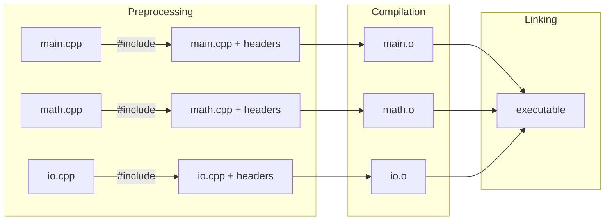
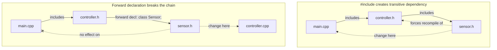

# Structuring a Codebase

> C++ splits code into header files (declarations) and source files (definitions) because each `.cpp` file is compiled independently — understanding this compilation model is the key to managing build times, dependencies, and encapsulation in any non-trivial project.

## Table of Contents
- [Core Concepts](#core-concepts)
- [Code Examples](#code-examples)
- [Common Pitfalls](#common-pitfalls)
- [Key Takeaways](#key-takeaways)
- [Exercises](#exercises)

## Core Concepts

### The C++ Compilation Model

#### What

C++ uses a **separate compilation model** inherited from C. Each `.cpp` file (called a **translation unit**) is compiled independently into an object file (`.o` / `.obj`). The linker then stitches all object files together into a single executable. The compiler has no knowledge of other `.cpp` files — it only sees the current translation unit and whatever you `#include` into it.

#### How

When you write `#include "math_utils.h"`, the preprocessor literally copies the entire contents of `math_utils.h` into the `.cpp` file before compilation begins. The compiler then compiles this expanded file as one unit. This is why headers exist: they provide the *declarations* (function signatures, class definitions) that other translation units need to reference your code, without duplicating the *definitions* (actual implementations).



#### Why It Matters

This model has a critical consequence: if you change a single `.cpp` file, only that file needs recompilation. But if you change a header, every `.cpp` that includes it must be recompiled. In a large codebase with thousands of files, a change to a widely-included header can trigger minutes of rebuild time. This is why header design is a performance-critical skill — not runtime performance, but *developer* performance.

### Header Files vs Implementation Files

#### What

A **header file** (`.h` or `.hpp`) contains *declarations* — it tells the compiler what exists (function signatures, class layouts, type aliases, constants) without providing the implementation. An **implementation file** (`.cpp`) contains *definitions* — the actual code that executes. The convention is that `.h` is used in C and C++ codebases, `.hpp` is used in C++-only codebases. Pick one convention and be consistent.

#### How

The pattern is straightforward: declare in the header, define in the source.

**Header (`sensor.h`)** — what the rest of the codebase sees:
```cpp
#pragma once

#include <string>
#include <cstdint>

class Sensor {
public:
    explicit Sensor(std::string name, uint32_t id);
    double read_value() const;
    std::string_view name() const;
private:
    std::string name_;
    uint32_t id_;
    double cached_value_;
};
```

**Source (`sensor.cpp`)** — the implementation details:
```cpp
#include "sensor.h"
#include <iostream>  // only needed in the implementation

Sensor::Sensor(std::string name, uint32_t id)
    : name_(std::move(name)), id_(id), cached_value_(0.0) {}

double Sensor::read_value() const {
    // In a real system, this would read from hardware
    return cached_value_;
}

std::string_view Sensor::name() const {
    return name_;
}
```

#### Why It Matters

Separating declaration from definition provides three benefits:

1. **Faster compilation.** When `main.cpp` includes `sensor.h`, it only sees the declaration — the compiler knows the size of `Sensor` and its interface, but doesn't compile the implementation. If you change `sensor.cpp` (say, rewriting `read_value()`), only `sensor.cpp` is recompiled. `main.cpp` is untouched.

2. **Encapsulation.** The header is your public API. Users of your class see the header, never the `.cpp`. You can change the implementation freely without any downstream impact — as long as the declaration stays the same.

3. **Reduced coupling.** Other files depend on the *interface*, not the *implementation*. This is the foundation of good software architecture in C++.

### The One Definition Rule (ODR)

#### What

The **One Definition Rule** is a fundamental C++ rule: every function, variable, and class must have exactly **one definition** across the entire program. A definition is the actual implementation — the function body, the variable's initialization, or the complete class body. Declarations (just the signature, without a body) can appear as many times as you want.

#### How

If you put a function *definition* in a header and include that header in two `.cpp` files, the linker will see two copies of the same function definition and report a "multiple definition" error. This is the most common linker error beginners encounter.

The exceptions to ODR are:
- `inline` functions and variables (C++17 for variables) — the compiler/linker deduplicates them.
- `constexpr` functions — implicitly `inline`.
- Template definitions — must be in headers because the compiler needs the full definition to instantiate them for each type.
- Class definitions — can appear in multiple translation units as long as they are identical (which `#include` guarantees).

#### Why It Matters

ODR violations are not always caught by the linker. If two translation units have *different* definitions of the same entity (e.g., a class with different member layouts), the program has undefined behavior — it may crash, corrupt memory, or appear to work until a seemingly unrelated change breaks everything. This is one of the most insidious bugs in C++ and is a direct consequence of the separate compilation model.

### Forward Declaration

#### What

A **forward declaration** tells the compiler that a type exists without providing its full definition. For classes, it looks like `class Sensor;` — no braces, no members, just the name. After a forward declaration, you can use the type as a pointer (`Sensor*`) or reference (`Sensor&`), but you cannot create instances, access members, or do anything that requires knowing the type's size or layout.

#### How

Forward declarations are used in headers to avoid `#include`-ing another header when you only need a pointer or reference to the type.

```cpp
// Without forward declaration — pulls in the entire sensor.h header
#include "sensor.h"

class Controller {
    Sensor sensor_;        // needs full definition (compiler must know sizeof(Sensor))
};
```

```cpp
// With forward declaration — no #include needed
class Sensor;  // forward declaration

class Controller {
    Sensor* sensor_;       // OK — pointer size is known regardless of Sensor's layout
    void attach(Sensor& s); // OK — reference doesn't need the full type either
};
```

The full `#include "sensor.h"` is then needed only in `controller.cpp`, where you actually *use* the `Sensor` object (call methods, access members).

#### Why It Matters

Every `#include` creates a dependency. If `controller.h` includes `sensor.h`, then any file including `controller.h` transitively includes `sensor.h`. Changing `sensor.h` now forces recompilation of every file that includes `controller.h`, even if those files never use `Sensor` directly. Forward declarations break these transitive dependency chains. In large codebases, aggressive use of forward declarations can cut build times from minutes to seconds.



### Include Guards

#### What

Include guards prevent a header file from being processed more than once within a single translation unit. Without them, if `a.h` includes `types.h` and `b.h` also includes `types.h`, and `main.cpp` includes both `a.h` and `b.h`, the contents of `types.h` would be pasted twice — causing "redefinition" errors.

#### How

There are two standard approaches:

**`#pragma once`** — the modern, clean approach:
```cpp
#pragma once

// header contents...
```

**`#ifndef` / `#define` / `#endif`** — the traditional, portable approach:
```cpp
#ifndef MYPROJECT_SENSOR_H
#define MYPROJECT_SENSOR_H

// header contents...

#endif  // MYPROJECT_SENSOR_H
```

`#pragma once` is supported by every major compiler (GCC, Clang, MSVC) and is simpler to write. The `#ifndef` pattern is technically more portable and is guaranteed by the C++ standard (while `#pragma once` is a compiler extension). In practice, `#pragma once` is the dominant choice in modern codebases.

The `#ifndef` guard name convention typically mirrors the file path to ensure uniqueness: `PROJECT_DIRECTORY_FILENAME_H`. Never use names starting with underscore followed by an uppercase letter or containing double underscores — those are reserved for the compiler and standard library.

#### Why It Matters

Without include guards, the preprocessor pastes the same declarations into a translation unit multiple times. The compiler then sees duplicate class definitions, duplicate `enum` definitions, and duplicate `typedef`s — and rejects them. Include guards are such a fundamental necessity that forgetting them is one of the first mistakes every C++ developer makes exactly once.

### Scope

#### What

**Scope** determines where a name (variable, function, type) is visible and accessible. C++ has several levels of scope, each serving a different purpose:

1. **Block scope** — variables declared inside `{}` braces. Destroyed when the block ends.
2. **Function scope** — labels (used with `goto`) are the only entities with true function scope. They are visible throughout the entire function, regardless of block nesting.
3. **File scope (namespace scope)** — variables and functions declared outside any class or function, at the top level of a translation unit. Visible from the point of declaration to the end of the file.
4. **Class scope** — members declared inside a class. Accessible through objects of that class (with access control: `public`, `protected`, `private`).
5. **Namespace scope** — names declared inside a namespace. Accessible via the namespace prefix or a `using` directive.

#### How

The compiler resolves names using **innermost-scope-first** lookup. If a name is declared in a block, it shadows any name with the same identifier in an enclosing scope. This shadowing is legal but dangerous — the compiler may warn you (`-Wshadow`).

```cpp
int x = 10;                   // file scope

void foo() {
    int x = 20;               // function's block scope — shadows file-scope x
    {
        int x = 30;           // inner block scope — shadows function-scope x
        // x is 30 here
    }
    // x is 20 here
}
// x is 10 here
```

#### Why It Matters

Scope is your primary tool for **controlling lifetime and visibility**. The principle is simple: declare variables in the **narrowest scope possible**. This minimizes the window where a variable is alive and accessible, reducing the chance of accidental misuse. In C, you had to declare all variables at the top of a function (pre-C99). C++ lets you declare them anywhere, and you should exploit this — declare variables at the point of first use, ideally inside the `if` or `for` where they're needed (C++17 init statements).

### Namespaces

#### What

A **namespace** is a named scope that groups related declarations together. It prevents name collisions — two libraries can both define a `connect()` function as long as they're in different namespaces (`net::connect()` vs `db::connect()`). Namespaces can be nested, and they can span multiple files (you can add to the same namespace from different headers).

#### How

```cpp
// Declaring a namespace
namespace math_utils {

double clamp(double value, double lo, double hi);
double lerp(double a, double b, double t);

}  // namespace math_utils — comment the closing brace for readability

// Using it
double result = math_utils::clamp(x, 0.0, 1.0);
```

You can also create nested namespaces. C++17 introduced a compact syntax for this:

```cpp
// Pre-C++17
namespace company {
    namespace project {
        namespace detail {
            void helper();
        }
    }
}

// C++17 nested namespace definition
namespace company::project::detail {
    void helper();
}
```

The `using` directive (`using namespace std;`) makes all names from a namespace visible without qualification. The `using` declaration (`using std::vector;`) imports a single name.

#### Why It Matters

`using namespace std;` in a header is one of the most harmful practices in C++. It leaks the entire `std` namespace into every file that includes your header. This can cause silent name collisions — if you define a `count` variable and `std::count` exists, the code may compile but call the wrong function. The rule is strict: **never put `using namespace` in a header.** In a `.cpp` file, a targeted `using std::vector;` is acceptable. In a header, always use fully qualified names.

Namespaces also serve as an organizational tool. A well-designed codebase uses namespaces to mirror its module structure — `net::tcp::Socket`, `db::postgres::Connection`, `ui::widgets::Button`. This makes the code self-documenting: the namespace tells you which subsystem a type belongs to.

### Anonymous Namespaces and `static` for Internal Linkage

#### What

**Linkage** determines whether a name is visible to other translation units. There are two kinds:

- **External linkage** — the name is visible to the linker and can be referenced from other `.cpp` files. This is the default for functions and global variables.
- **Internal linkage** — the name is only visible within the current translation unit. Other `.cpp` files cannot see or reference it.

An **anonymous namespace** (also called an unnamed namespace) gives internal linkage to everything inside it. The `static` keyword on a file-scope function or variable does the same thing, though it's a C-era technique that anonymous namespaces have largely replaced.

#### How

```cpp
// Method 1: anonymous namespace (preferred in modern C++)
namespace {

constexpr int BUFFER_SIZE = 4096;

int compute_checksum(const char* data, std::size_t len) {
    // This function is only visible in this .cpp file
    int sum = 0;
    for (std::size_t i = 0; i < len; ++i) {
        sum += static_cast<unsigned char>(data[i]);
    }
    return sum;
}

}  // anonymous namespace


// Method 2: static keyword (C-style, still valid)
static constexpr int BUFFER_SIZE = 4096;

static int compute_checksum(const char* data, std::size_t len) {
    // Also only visible in this .cpp file
    // ...
}
```

Both approaches make `BUFFER_SIZE` and `compute_checksum` invisible to other translation units. The linker will not export these symbols, so another `.cpp` file can define its own `BUFFER_SIZE` without collision.

#### Why It Matters

Internal linkage serves two purposes:

1. **Encapsulation.** Helper functions and constants that are implementation details of a single `.cpp` file should not leak into the global symbol table. This prevents accidental coupling — no other file can depend on your internal helpers.

2. **Avoiding ODR violations.** If two `.cpp` files both define a function with the same name and external linkage, you get a linker error (or worse, undefined behavior if the linker silently picks one). Internal linkage makes each file's copy independent.

The C++ Core Guidelines recommend anonymous namespaces over `static` for internal linkage because anonymous namespaces work with types (you can put classes and enums inside them), while `static` only applies to functions and variables. However, `static` remains common in practice, especially in codebases with C heritage.

### Inline Functions and Variables

#### What

The `inline` keyword tells the compiler that a function (or, since C++17, a variable) may be defined in multiple translation units, and the linker should keep only one copy. This is separate from the optimization hint of "please inline this call" — modern compilers inline whatever they determine is profitable, regardless of the keyword.

#### How

`inline` is the mechanism that makes it legal to define a function in a header without violating ODR. Every translation unit that includes the header gets its own copy, but the linker deduplicates them.

```cpp
// In a header file — legal because of 'inline'
inline double square(double x) {
    return x * x;
}
```

C++17 extended this to variables:
```cpp
// In a header file — C++17 inline variable
inline constexpr int MAX_CONNECTIONS = 128;
```

Before C++17, defining a `const int` in a header was safe (it has internal linkage by default), but a non-const global variable in a header would violate ODR. `inline` variables solve this cleanly.

#### Why It Matters

Templates, `constexpr` functions, and class member functions defined inside the class body are all implicitly `inline`. This is why template definitions must go in headers — the compiler needs to see the full definition to instantiate a template, and `inline` prevents ODR violations when multiple `.cpp` files include the same template header.

Understanding `inline` resolves a common confusion: "If definitions should go in `.cpp` files, why are template definitions in headers?" The answer is that `inline` (implicit or explicit) creates an exception to the normal ODR rules, and templates require it because the compiler generates different code for each type.

## Code Examples

### Complete Multi-File Project Structure

This example shows a realistic project layout with proper header/source separation, namespaces, include guards, and internal linkage.

**`math_utils.h`** — public interface:
```cpp
#pragma once

#include <cmath>
#include <cstddef>
#include <vector>

namespace math_utils {

// Compute the arithmetic mean of a collection of values.
// Returns 0.0 for an empty input — a deliberate design choice
// (some libraries throw; we choose a safe default).
double mean(const std::vector<double>& values);

// Compute the standard deviation (population, not sample).
double standard_deviation(const std::vector<double>& values);

// Clamp a value to [lo, hi]. Prefer this over std::clamp when
// you want NaN-safe behavior — std::clamp has UB with NaN.
double clamp(double value, double lo, double hi);

// Linear interpolation: returns a + t*(b - a).
// t=0 returns a, t=1 returns b, t=0.5 returns the midpoint.
constexpr double lerp(double a, double b, double t) noexcept {
    // Defined in the header because it's constexpr (implicitly inline).
    return a + t * (b - a);
}

}  // namespace math_utils
```

**`math_utils.cpp`** — private implementation:
```cpp
#include "math_utils.h"

#include <algorithm>
#include <cmath>
#include <numeric>

namespace {

// Anonymous namespace: these helpers are internal to this translation unit.
// No other .cpp file can see or call them — they are implementation details.

// Precondition check shared by mean() and standard_deviation().
bool is_empty_input(const std::vector<double>& values) {
    return values.empty();
}

// Compute the sum — factored out because both mean and stddev need it.
double compute_sum(const std::vector<double>& values) {
    return std::accumulate(values.begin(), values.end(), 0.0);
}

}  // anonymous namespace

namespace math_utils {

double mean(const std::vector<double>& values) {
    if (is_empty_input(values)) return 0.0;
    return compute_sum(values) / static_cast<double>(values.size());
}

double standard_deviation(const std::vector<double>& values) {
    if (is_empty_input(values)) return 0.0;

    const double avg = mean(values);
    double sum_sq_diff = 0.0;
    for (const auto& v : values) {
        const double diff = v - avg;
        sum_sq_diff += diff * diff;
    }
    return std::sqrt(sum_sq_diff / static_cast<double>(values.size()));
}

double clamp(double value, double lo, double hi) {
    // std::clamp requires lo <= hi and has UB with NaN.
    // This version handles the edge cases explicitly.
    if (value < lo) return lo;
    if (value > hi) return hi;
    return value;
}

}  // namespace math_utils
```

**`main.cpp`** — client code that uses the public interface:
```cpp
#include "math_utils.h"

#include <iostream>
#include <vector>

int main() {
    const std::vector<double> readings = {23.1, 24.5, 22.8, 25.0, 23.7};

    const double avg = math_utils::mean(readings);
    const double stddev = math_utils::standard_deviation(readings);

    std::cout << "Mean:   " << avg << '\n';
    std::cout << "StdDev: " << stddev << '\n';

    // constexpr function — can be evaluated at compile time
    constexpr double midpoint = math_utils::lerp(0.0, 100.0, 0.5);
    std::cout << "Midpoint: " << midpoint << '\n';  // 50.0

    // Clamp a sensor reading to a valid range
    const double raw = 105.3;
    const double clamped = math_utils::clamp(raw, 0.0, 100.0);
    std::cout << "Clamped: " << clamped << '\n';  // 100.0

    return 0;
}
```

Compile and link:
```bash
g++ -std=c++17 -Wall -Wextra -o app main.cpp math_utils.cpp
```

### Forward Declaration in Practice

This example demonstrates how forward declarations reduce header dependencies. Imagine a logger that formats messages from various subsystem types — it doesn't need their full definitions, only pointers.

**`subsystem.h`** — the full definition:
```cpp
#pragma once

#include <string>

class Subsystem {
public:
    explicit Subsystem(std::string name) : name_(std::move(name)) {}
    std::string_view name() const { return name_; }
private:
    std::string name_;
};
```

**`logger.h`** — uses forward declaration to avoid including `subsystem.h`:
```cpp
#pragma once

#include <string_view>

// Forward declaration — we only need a pointer/reference to Subsystem
// in this header. No need to #include "subsystem.h" here.
class Subsystem;

class Logger {
public:
    // Takes a pointer: does not need to know Subsystem's layout
    void log(const Subsystem* source, std::string_view message);

    // Takes a reference: also fine with a forward declaration
    void log_warning(const Subsystem& source, std::string_view message);
};
```

**`logger.cpp`** — now we need the full definition to call methods:
```cpp
#include "logger.h"
#include "subsystem.h"  // full definition needed here to call source->name()

#include <iostream>

void Logger::log(const Subsystem* source, std::string_view message) {
    if (source) {
        std::cout << "[" << source->name() << "] " << message << '\n';
    } else {
        std::cout << "[unknown] " << message << '\n';
    }
}

void Logger::log_warning(const Subsystem& source, std::string_view message) {
    std::cout << "[WARNING:" << source.name() << "] " << message << '\n';
}
```

**`main.cpp`**:
```cpp
#include "logger.h"
#include "subsystem.h"

int main() {
    Subsystem network("network");
    Logger logger;

    logger.log(&network, "Connection established.");
    logger.log_warning(network, "High latency detected.");
    logger.log(nullptr, "System startup complete.");

    return 0;
}
```

The key benefit: any file that includes `logger.h` does **not** transitively include `subsystem.h`. If `subsystem.h` changes, those files are not recompiled.

### Nested Namespaces and Internal Linkage

```cpp
#include <cstdint>
#include <iostream>
#include <string>
#include <string_view>

// C++17 nested namespace definition — clean and compact
namespace device::protocol {

// Public types and functions — external linkage, visible to other TUs
enum class CommandType : uint8_t {
    read  = 0x01,
    write = 0x02,
    reset = 0xFF,
};

struct Packet {
    CommandType cmd;
    uint16_t address;
    uint32_t payload;
};

// Convert a command type to its human-readable name
std::string_view command_name(CommandType cmd);

// Serialize a packet into a byte string (simplified)
std::string serialize(const Packet& pkt);

}  // namespace device::protocol


// --- Implementation (in a .cpp file, shown here for self-containedness) ---

namespace {

// Internal linkage: these are implementation details of the serialization
// logic. No other translation unit can see them. They are free to change
// without affecting any public API.

constexpr uint8_t HEADER_BYTE = 0xAA;
constexpr uint8_t FOOTER_BYTE = 0x55;

// Append a 16-bit value to a string in little-endian order
void append_u16(std::string& out, uint16_t value) {
    out += static_cast<char>(value & 0xFF);
    out += static_cast<char>((value >> 8) & 0xFF);
}

// Append a 32-bit value to a string in little-endian order
void append_u32(std::string& out, uint32_t value) {
    out += static_cast<char>(value & 0xFF);
    out += static_cast<char>((value >> 8) & 0xFF);
    out += static_cast<char>((value >> 16) & 0xFF);
    out += static_cast<char>((value >> 24) & 0xFF);
}

}  // anonymous namespace


namespace device::protocol {

std::string_view command_name(CommandType cmd) {
    switch (cmd) {
        case CommandType::read:  return "READ";
        case CommandType::write: return "WRITE";
        case CommandType::reset: return "RESET";
    }
    return "UNKNOWN";
}

std::string serialize(const Packet& pkt) {
    std::string result;
    result.reserve(8);  // header + cmd + addr(2) + payload(4) + footer

    result += static_cast<char>(HEADER_BYTE);
    result += static_cast<char>(static_cast<uint8_t>(pkt.cmd));
    append_u16(result, pkt.address);
    append_u32(result, pkt.payload);
    result += static_cast<char>(FOOTER_BYTE);

    return result;
}

}  // namespace device::protocol


int main() {
    const device::protocol::Packet pkt{
        device::protocol::CommandType::write,
        0x1000,    // address
        0xDEADBEEF // payload
    };

    std::cout << "Command: " << device::protocol::command_name(pkt.cmd) << '\n';
    std::cout << "Packet size: " << device::protocol::serialize(pkt).size()
              << " bytes\n";

    return 0;
}
```

### Scope Demonstration: Narrowing Scope for Safety

```cpp
#include <iostream>
#include <map>
#include <string>
#include <vector>

int main() {
    // Demonstrate block scope — variables exist only inside their braces
    {
        const std::vector<int> temps = {22, 25, 19, 30, 27};
        int sum = 0;
        for (const auto& t : temps) {
            sum += t;
        }
        std::cout << "Average temp: " << sum / static_cast<int>(temps.size()) << '\n';
    }
    // 'temps' and 'sum' are destroyed here — cannot be accidentally reused

    // C++17 if-with-initializer scopes the variable to the if/else block
    const std::map<std::string, int> config = {
        {"timeout_ms", 5000},
        {"max_retries", 3},
    };

    if (auto it = config.find("timeout_ms"); it != config.end()) {
        std::cout << "Timeout: " << it->second << " ms\n";
    }
    // 'it' does not leak into the surrounding scope

    // for-loop init scope: the loop variable is scoped to the loop
    for (int i = 0; i < 3; ++i) {
        std::cout << "Iteration " << i << '\n';
    }
    // 'i' does not exist here — this is cleaner than C89-style
    // declarations at the top of the function

    return 0;
}
```

## Common Pitfalls

### Defining functions in headers without `inline`

```cpp
// BAD — function definition in a header without inline
// file: utils.h
#pragma once

// This definition will appear in every .cpp that includes utils.h.
// The linker will see multiple definitions and report an error.
double square(double x) {
    return x * x;
}
```

The linker error looks like: `multiple definition of 'square(double)'`. Every `.cpp` file that includes `utils.h` gets its own copy of `square`, violating ODR.

```cpp
// GOOD — three correct approaches:

// Option 1: Declare in header, define in .cpp
// utils.h
#pragma once
double square(double x);

// utils.cpp
#include "utils.h"
double square(double x) { return x * x; }


// Option 2: Use inline (appropriate for small, frequently called functions)
// utils.h
#pragma once
inline double square(double x) {
    return x * x;
}


// Option 3: Use constexpr (implicitly inline, evaluable at compile time)
// utils.h
#pragma once
constexpr double square(double x) {
    return x * x;
}
```

### Forgetting include guards

```cpp
// BAD — no include guard
// file: types.h
struct Point {
    double x;
    double y;
};

// If two headers both #include "types.h", and a .cpp includes both,
// the compiler sees struct Point defined twice → "redefinition of 'Point'"
```

```cpp
// GOOD — always use an include guard
// file: types.h
#pragma once

struct Point {
    double x;
    double y;
};

// Alternatively, with #ifndef guards:
#ifndef PROJECT_TYPES_H
#define PROJECT_TYPES_H

struct Point {
    double x;
    double y;
};

#endif  // PROJECT_TYPES_H
```

### `using namespace std;` in a header

```cpp
// BAD — pollutes every file that includes this header
// file: my_lib.h
#pragma once

#include <string>
#include <vector>

using namespace std;  // NEVER do this in a header

// Now every .cpp that includes my_lib.h has 'using namespace std;'
// forced upon it, potentially causing silent name collisions.

vector<string> split(const string& input, char delimiter);
```

This can cause subtle breakage. For example, if a user defines their own `count` variable, it may silently resolve to `std::count` instead — or produce an ambiguous overload error.

```cpp
// GOOD — use fully qualified names in headers
// file: my_lib.h
#pragma once

#include <string>
#include <vector>

// Spell out the namespace — clear, safe, no surprises
std::vector<std::string> split(const std::string& input, char delimiter);
```

In `.cpp` files, a targeted `using` declaration is acceptable:
```cpp
// In a .cpp file — fine, affects only this translation unit
using std::vector;
using std::string;
```

### Exposing internal helpers with external linkage

```cpp
// BAD — helper function has external linkage by default
// file: parser.cpp
#include "parser.h"

// This helper is an implementation detail, but it has external linkage.
// Another .cpp file could accidentally define the same function,
// causing a linker error — or worse, one could call it.
bool is_whitespace(char c) {
    return c == ' ' || c == '\t' || c == '\n';
}

void parse(const std::string& input) {
    // uses is_whitespace internally...
}
```

```cpp
// GOOD — wrap implementation details in an anonymous namespace
// file: parser.cpp
#include "parser.h"

namespace {

// Internal linkage — invisible to other translation units.
// Cannot collide with other files' helpers.
bool is_whitespace(char c) {
    return c == ' ' || c == '\t' || c == '\n';
}

}  // anonymous namespace

void parse(const std::string& input) {
    // uses is_whitespace internally...
}
```

### Including more headers than necessary

```cpp
// BAD — logger.h includes the full engine.h just for a pointer
// file: logger.h
#pragma once
#include "engine.h"  // large header with many transitive includes

class Logger {
    Engine* engine_;  // only uses a pointer — doesn't need the full type
public:
    void log(const std::string& msg);
};

// Consequence: every file that includes logger.h now transitively includes
// engine.h and all of its dependencies. Changing engine.h triggers mass
// recompilation.
```

```cpp
// GOOD — use a forward declaration when a pointer or reference suffices
// file: logger.h
#pragma once
#include <string>

class Engine;  // forward declaration — no transitive dependency

class Logger {
    Engine* engine_;
public:
    void log(const std::string& msg);
};

// logger.cpp includes engine.h — the dependency is isolated
```

## Key Takeaways

- **Separate declaration (header) from definition (source)** to enable independent compilation, reduce build times, and encapsulate implementation details. Put only the minimum necessary in headers.
- **Use forward declarations** aggressively in headers whenever you only need a pointer or reference to a type. Every `#include` you avoid is a dependency chain you break.
- **Always use include guards** (`#pragma once` or `#ifndef`). There is no legitimate reason to omit them — a header without a guard is a bug waiting to happen.
- **Give internal helpers internal linkage** using anonymous namespaces (preferred) or `static`. If a function is only used in one `.cpp` file, it should not be visible to the linker.
- **Never use `using namespace` in a header** — it forces namespace pollution on every file that includes your header. In `.cpp` files, prefer targeted `using` declarations over blanket `using namespace`.

## Exercises

1. You have a project with `main.cpp`, `config.h`, `config.cpp`, `network.h`, and `network.cpp`. `network.h` currently does `#include "config.h"` but only uses `Config*` (a pointer to a `Config` class). Refactor `network.h` to use a forward declaration instead. Explain what changes in `network.cpp` and why this refactoring improves build times.

2. Explain the difference between `static` (at file scope) and an anonymous namespace for achieving internal linkage. When would you prefer one over the other? Can you put a `class` definition inside a `static` block? Can you put one inside an anonymous namespace?

3. Write a small multi-file program (a header and two `.cpp` files) that demonstrates an ODR violation. Then fix the violation using `inline`. Explain why the `inline` keyword resolves the issue.

4. Consider the following header:
   ```cpp
   // shapes.h
   #pragma once
   #include <cmath>
   #include <string>
   #include <vector>
   #include <iostream>
   #include <algorithm>

   namespace geometry {
   double circle_area(double radius);
   }
   ```
   Which `#include`s are actually needed in this header? Remove the unnecessary ones and explain where they should go instead.

5. You are writing a library with a `protocol::encode()` function in `protocol.cpp`. This function uses three helper functions: `compute_crc()`, `pad_to_alignment()`, and `validate_header()`. None of these helpers should be callable from outside `protocol.cpp`. Write the skeleton of `protocol.h` and `protocol.cpp` showing how you would structure the declarations, definitions, and internal linkage. Use a namespace for the public API and an anonymous namespace for the helpers.
