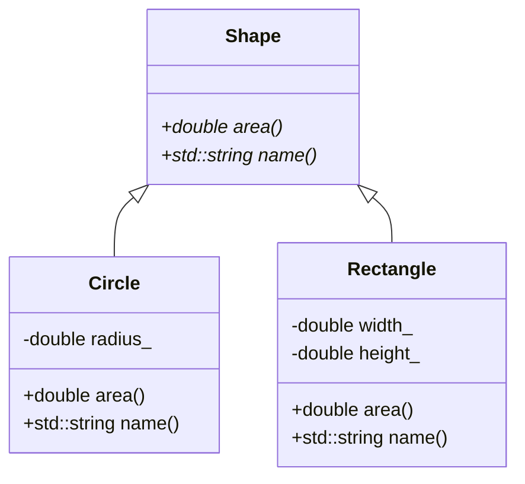
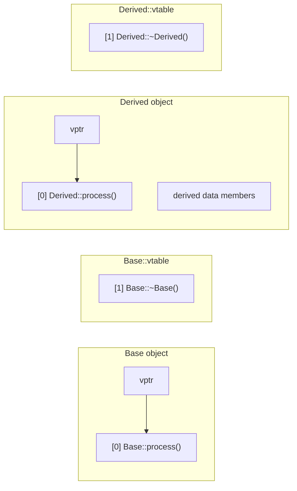
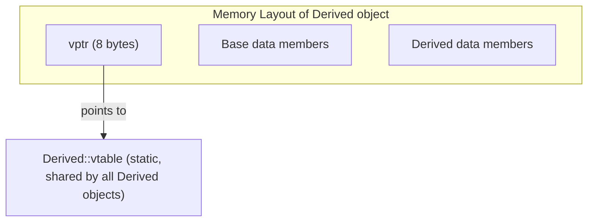
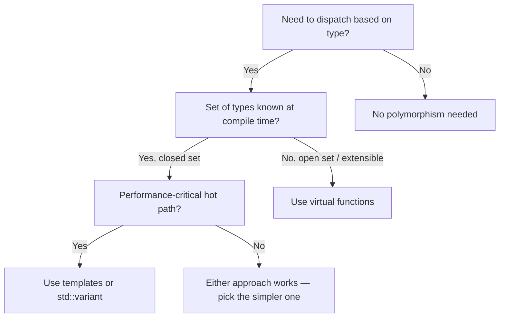

# OOP & Dynamic Polymorphism

> Dynamic polymorphism lets you write code that operates on interfaces without knowing the concrete type at compile time — the foundation of plugin architectures, driver models, and extensible frameworks — but it comes with a runtime cost you need to understand before reaching for it.

## Table of Contents
- [Core Concepts](#core-concepts)
- [Code Examples](#code-examples)
- [Common Pitfalls](#common-pitfalls)
- [Key Takeaways](#key-takeaways)
- [Exercises](#exercises)

## Core Concepts

### Object-Oriented Programming in C++

#### What

Object-Oriented Programming (OOP) organizes code around *objects* — bundles of data and the operations that act on that data. C++ supports three OOP pillars: **encapsulation** (hiding implementation details behind an interface), **inheritance** (building new types by extending existing ones), and **polymorphism** (treating different types uniformly through a shared interface).

#### How

In C, you simulate OOP manually: a `struct` holds the data, and free functions take a pointer to that struct as the first argument. There's no access control, no enforced relationship between the data and its operations, and no compiler support for polymorphism. You end up maintaining function-pointer tables by hand, which is error-prone and brittle.

C++ makes this first-class. A `class` bundles data (`private` by default) with member functions that operate on it. `public` members form the interface; `private` members are implementation details the compiler enforces. This isn't just organizational — it's a contract: callers can depend on the public interface, and you can change the private internals without breaking anything.

```cpp
class Sensor {
public:
    explicit Sensor(int id) : id_{id}, reading_{0.0} {}

    void update(double value) { reading_ = value; }
    double reading() const { return reading_; }
    int id() const { return id_; }

private:
    int id_;
    double reading_;  // Implementation detail — could change to a filtered average later
};
```

#### Why It Matters

Encapsulation isn't about hiding things for the sake of hiding. It's about **controlling the surface area of change**. When `reading_` is private, you can later replace the raw `double` with a rolling average, a Kalman filter, or a hardware register read — and no caller needs to change. Without encapsulation, every internal change ripples through the entire codebase.

### Inheritance

#### What

Inheritance creates an "is-a" relationship: a `Dog` *is an* `Animal`, a `TcpSocket` *is a* `Socket`. The derived class inherits the base class's data and methods, and can add new ones or override existing behavior. In C++, inheritance uses the `: public Base` syntax, and there are three access specifiers for inheritance: `public`, `protected`, and `private`.

#### How

Public inheritance is the only form that models "is-a." It preserves the base class's public interface in the derived class. Protected and private inheritance are implementation techniques (composition-like reuse), not true subtyping — you'll rarely use them.



The key constraint: inheritance creates a **tight coupling** between base and derived classes. The derived class depends on the base class's implementation details (protected members, virtual method call order, constructor behavior). This is why the classic OOP advice is "prefer composition over inheritance" — use inheritance for genuine "is-a" relationships, not just code reuse.

#### Why It Matters

Inheritance exists to enable **polymorphism**, not code reuse. If you're inheriting just to avoid duplicating a few methods, use composition instead (store the reusable object as a member). Inheritance should mean "this type can be substituted wherever the base type is expected" — the Liskov Substitution Principle. Violating this (e.g., a `Square` that inherits from `Rectangle` but breaks the invariant that width and height are independent) leads to subtle, hard-to-debug errors.

### Dynamic Polymorphism

#### What

Dynamic polymorphism means the specific function that gets called is determined at **runtime**, not compile time. You write code against a base class pointer or reference, and the actual behavior depends on the concrete type of the object. This is the mechanism behind plugin systems, driver models, GUI frameworks, and any architecture where you need to add new types without modifying existing code.

#### How

In C, you'd implement this with a struct containing function pointers — essentially a hand-rolled vtable:

```c
// C: manual dynamic dispatch via function pointers
struct Shape {
    double (*area)(const struct Shape*);
    const char* (*name)(const struct Shape*);
};
```

This works, but it's fragile: nothing enforces that every "Shape" implementation fills in all the function pointers, nothing prevents you from calling through a null pointer, and there's no compiler support for catching mistakes.

C++ automates this with **virtual functions**. When you declare a method `virtual`, the compiler generates and maintains the function-pointer table (the vtable) for you. The derived class overrides the method, and calls through a base pointer/reference are dispatched to the correct implementation automatically.

#### Why It Matters

Dynamic polymorphism is the **Open/Closed Principle** in action: your code is open for extension (add new derived classes) but closed for modification (the code that uses the base class doesn't change). This is why frameworks work — the framework defines the interface (`Widget`, `Driver`, `Handler`), and you extend it by deriving new types. Without dynamic polymorphism, adding a new type means modifying every `switch` statement or `if`/`else` chain that handles types.

### Virtual Methods: `virtual`, `override`, `final`

#### What

The `virtual` keyword on a base class method enables dynamic dispatch for that method. When you call a `virtual` method through a base class pointer or reference, the runtime looks up the actual type's implementation and calls that instead. The `override` specifier (C++11) on a derived class method tells the compiler "I intend to override a virtual method in the base" — if no such method exists, the compiler emits an error. The `final` specifier (C++11) prevents further overriding in subclasses.

#### How

```cpp
class Base {
public:
    virtual void process() { /* default behavior */ }
    virtual ~Base() = default;  // ALWAYS virtual destructor in a polymorphic base
};

class Derived : public Base {
public:
    void process() override { /* specialized behavior */ }
    // 'override' guarantees this matches a virtual method in Base.
    // Without it, a typo like 'proccess()' silently creates a new method.
};

class Sealed : public Derived {
public:
    void process() final { /* no further overrides allowed */ }
};
```

Three rules you should internalize:

1. **Always use `override`** on derived class methods. It costs nothing and catches silent bugs (typos, wrong parameter types) that would otherwise create a new method instead of overriding.
2. **Always declare the base class destructor `virtual`** if the class has any virtual methods. Without this, deleting a derived object through a base pointer is undefined behavior.
3. **Use `final` sparingly** — it prevents extension, which is sometimes what you want (performance, security), but often unnecessarily restricts future flexibility.

#### Why It Matters

Before `override` existed (pre-C++11), a common and devastating bug was accidentally *not* overriding a virtual method. If the base class changed its signature (e.g., added a `const`), the derived class's method silently became a separate function that never got called through dynamic dispatch. `override` turns this silent bug into a compile error — it's one of the highest-value, lowest-cost features in modern C++.

### Virtual Tables (vtable) — Under the Hood

#### What

The vtable is the compiler's implementation of dynamic dispatch. Every class with at least one virtual method gets a vtable: a static array of function pointers, one slot per virtual method. Every object of that class contains a hidden pointer (the **vptr**) that points to its class's vtable. When you call a virtual method through a base pointer, the compiler generates code that follows the vptr to the vtable, looks up the correct function pointer, and calls through it.

#### How

Here's what happens in memory when you have a simple hierarchy:



When you write:

```cpp
Base* obj = new Derived();
obj->process();  // What actually happens:
```

The compiler generates something equivalent to:

```cpp
// Pseudocode — what the compiler actually generates
auto vtable = obj->__vptr;           // 1. Follow the hidden vptr
auto fn = vtable[0];                  // 2. Index into the vtable (slot for 'process')
fn(obj);                              // 3. Call through the function pointer
```

This is two pointer indirections: one to get the vtable, one to get the function. The vtable itself is a per-class static array — it's shared by all instances of the same class, so it doesn't bloat per-object memory. The per-object cost is exactly one pointer (the vptr), typically 8 bytes on a 64-bit system.



#### Why It Matters

Understanding the vtable demystifies virtual dispatch. It's not magic — it's a function pointer lookup. This knowledge helps you reason about:

- **Memory overhead**: One pointer per object, one table per class. For a million small objects, that extra 8 bytes per object might matter.
- **Why the destructor must be virtual**: If it's not in the vtable, deleting through a base pointer calls the wrong destructor.
- **Why constructors can't be virtual**: The vptr is set *during* construction — the object doesn't know its final type yet. During `Base`'s constructor, the vptr points to `Base::vtable`, even if the object being constructed is a `Derived`.

### The Cost of Virtual Calls

#### What

A virtual call costs more than a direct (non-virtual) call due to two factors: **pointer indirection** (following the vptr to the vtable to the function) and **branch prediction / instruction cache pressure** (the CPU can't predict which function will be called, so it can't prefetch instructions as effectively).

#### How

In a non-virtual call, the compiler knows the exact function at compile time and can inline it, eliminate it, or optimize across the call boundary. In a virtual call, the compiler typically *cannot* see through the indirection, so these optimizations are blocked.

The performance impact depends on context:

- **Tight inner loops** processing millions of elements: virtual dispatch can be a measurable bottleneck. Each call goes through a pointer indirection, and if you're dispatching to different types in sequence, the instruction cache thrashes because successive calls jump to different code locations.
- **High-level architecture** (handling a network request, processing a user command): the virtual call overhead is negligible — it's nanoseconds against milliseconds of I/O.

A useful mental model: virtual dispatch adds roughly 2-10 nanoseconds per call (depending on cache state). If you're making millions of calls per frame, that adds up. If you're making hundreds of calls per request, it doesn't.

The compiler *can* sometimes **devirtualize** — when it can prove the concrete type at compile time (e.g., calling a virtual method on a local, non-escaped object), it replaces the indirect call with a direct one. Using `final` on a class or method enables this optimization more often, because the compiler knows no further overrides exist.

#### Why It Matters

The cost of virtual calls is one of the most over-feared and under-understood aspects of C++. Premature devirtualization (replacing virtual dispatch with `switch` statements or templates) adds complexity and rigidity. Profile first. In most applications, the flexibility of virtual dispatch far outweighs the nanoseconds-per-call overhead. Reserve alternatives (templates, `std::variant`) for performance-critical hot paths where you've measured the impact.

### Pure Virtual Functions and Abstract Classes

#### What

A **pure virtual function** is a virtual method with no implementation in the base class, declared with `= 0`. A class with at least one pure virtual function is an **abstract class** — it cannot be instantiated directly. Any derived class must override all pure virtual functions to become concrete (instantiable).

#### How

```cpp
class Codec {
public:
    // Pure virtual: every codec MUST implement encode and decode.
    // There's no sensible default — the base class defines the contract,
    // not the behavior.
    virtual std::vector<uint8_t> encode(std::string_view input) = 0;
    virtual std::string decode(const std::vector<uint8_t>& data) = 0;

    // Non-pure virtual: provides a reasonable default that derived classes
    // can optionally override.
    virtual std::string name() const { return "UnknownCodec"; }

    virtual ~Codec() = default;
};
```

An abstract class serves as a **pure interface** — it defines what operations are available, but not how they work. This is the C++ equivalent of Java's `interface` or Rust's `trait` (with dynamic dispatch). You can provide a body for a pure virtual function (defined outside the class), which derived classes can explicitly call via `Base::method()`, but the class remains abstract.

Abstract classes work with the vtable mechanism: the pure virtual slots in the vtable contain a special marker (often a pointer to a function that calls `std::terminate` or similar). If you somehow managed to call one, the program would abort — but the compiler prevents this by forbidding instantiation.

#### Why It Matters

Abstract classes enforce contracts at compile time. If a derived class forgets to implement `encode()`, the compiler rejects it — you can't accidentally deploy a half-implemented codec. This is strictly better than a non-pure virtual that throws a "not implemented" exception at runtime, because the bug is caught before the code ever ships.

### When to Use Dynamic Polymorphism vs Alternatives

#### What

Dynamic polymorphism (virtual functions) is one of three main dispatch mechanisms in C++. The alternatives are **static polymorphism** (templates, resolved at compile time) and **type-safe variant dispatch** (`std::variant` with `std::visit`). Each has different trade-offs in flexibility, performance, and compile-time vs runtime resolution.

#### How

Here's a decision framework:



**Virtual functions** (dynamic polymorphism):
- Best when the set of types is **open** — new types can be added without modifying existing code.
- Runtime cost: vtable indirection per call.
- Requires heap allocation (typically) since you work through base pointers.
- Example: plugin systems, device drivers, GUI widget hierarchies.

**Templates** (static polymorphism):
- Best when the set of types is known at compile time and you want **zero-overhead** dispatch.
- The compiler generates a separate instantiation for each type — no indirection, full inlining.
- Downside: longer compile times, code bloat if many instantiations, types must be known at compile time.
- Example: generic algorithms (`std::sort` takes any iterator type), policy-based design.

**`std::variant` + `std::visit`** (closed-set runtime polymorphism):
- Best when you have a **closed, small set** of types and want value semantics (no heap allocation).
- `std::visit` generates a jump table over the variant's type index — fast, no pointer indirection.
- Downside: adding a new type requires modifying the variant definition and every visitor.
- Example: AST nodes, message types in a protocol, state machines.

#### Why It Matters

The default instinct in C++ is to reach for virtual functions whenever you need polymorphism. But virtual functions are the most expensive option and the hardest to optimize. If you know all your types at compile time (which is surprisingly common), templates give you the same abstraction with zero runtime cost. If you have a small, closed set of types, `std::variant` gives you value semantics and better cache locality. Reserve virtual functions for genuinely open hierarchies where new types appear without recompilation.

## Code Examples

### A Complete Polymorphic Hierarchy: Logging Framework

```cpp
#include <chrono>
#include <fstream>
#include <iostream>
#include <memory>
#include <mutex>
#include <string>
#include <string_view>
#include <vector>

// Abstract base class defining the logging interface.
// Any new log destination (database, network, etc.) just derives from this —
// the rest of the codebase doesn't change.
class LogSink {
public:
    // Pure virtual: every sink must implement how to write a message.
    virtual void write(std::string_view message) = 0;

    // Non-pure virtual: provides a sensible default name.
    // Derived classes can override for better diagnostics.
    virtual std::string name() const { return "UnnamedSink"; }

    // Virtual destructor: REQUIRED for any class used polymorphically.
    // Without this, deleting through a LogSink* would skip the derived destructor.
    virtual ~LogSink() = default;
};

// Concrete sink: writes to stdout
class ConsoleSink : public LogSink {
public:
    void write(std::string_view message) override {
        // std::cout is not thread-safe by default — in production you'd
        // synchronize, but we keep this example focused on polymorphism.
        std::cout << "[console] " << message << '\n';
    }

    std::string name() const override { return "ConsoleSink"; }
};

// Concrete sink: writes to a file
class FileSink : public LogSink {
public:
    explicit FileSink(const std::string& path)
        : file_{path, std::ios::app}  // RAII: file opened in constructor
    {
        if (!file_.is_open()) {
            throw std::runtime_error("Failed to open log file: " + path);
        }
    }

    void write(std::string_view message) override {
        file_ << "[file] " << message << '\n';
        file_.flush();  // Ensure log entries survive a crash
    }

    std::string name() const override { return "FileSink"; }

    // Destructor closes the file automatically via RAII (std::ofstream's dtor).
    // No need to write a custom destructor — Rule of Zero.

private:
    std::ofstream file_;
};

// Concrete sink: buffers messages and flushes in batches
class BufferedSink : public LogSink {
public:
    explicit BufferedSink(std::unique_ptr<LogSink> inner, std::size_t capacity = 10)
        : inner_{std::move(inner)}
        , capacity_{capacity}
    {
        buffer_.reserve(capacity_);
    }

    void write(std::string_view message) override {
        buffer_.emplace_back(message);
        if (buffer_.size() >= capacity_) {
            flush();
        }
    }

    std::string name() const override {
        return "BufferedSink(" + inner_->name() + ")";
    }

    // Flush remaining buffered messages on destruction
    ~BufferedSink() override {
        try {
            flush();
        } catch (...) {
            // Destructors must not throw — swallow the exception.
            // In production, you might log to stderr as a last resort.
        }
    }

private:
    void flush() {
        for (const auto& msg : buffer_) {
            inner_->write(msg);  // Dynamic dispatch: calls the inner sink's write()
        }
        buffer_.clear();
    }

    std::unique_ptr<LogSink> inner_;  // Owns the wrapped sink
    std::vector<std::string> buffer_;
    std::size_t capacity_;
};

// Logger: dispatches to multiple sinks.
// Demonstrates working with a collection of polymorphic objects.
class Logger {
public:
    void add_sink(std::unique_ptr<LogSink> sink) {
        std::cout << "Registered sink: " << sink->name() << '\n';
        sinks_.push_back(std::move(sink));
    }

    void log(std::string_view message) const {
        // Each sink->write() is a virtual call — the correct implementation
        // is resolved at runtime based on the concrete type behind the pointer.
        for (const auto& sink : sinks_) {
            sink->write(message);
        }
    }

private:
    std::vector<std::unique_ptr<LogSink>> sinks_;
};

int main() {
    Logger logger;

    // Construct sinks using std::make_unique — never raw new in application code
    logger.add_sink(std::make_unique<ConsoleSink>());

    // BufferedSink wraps another sink — decorator pattern via polymorphism
    logger.add_sink(
        std::make_unique<BufferedSink>(
            std::make_unique<ConsoleSink>(),
            3  // flush every 3 messages
        )
    );

    logger.log("Application started");
    logger.log("Processing request #1");
    logger.log("Processing request #2");
    logger.log("Processing request #3");  // BufferedSink flushes here
    logger.log("Application shutting down");

    // When logger goes out of scope:
    // 1. logger's destructor runs, destroying the vector of unique_ptrs
    // 2. Each unique_ptr's destructor deletes the sink
    // 3. BufferedSink's destructor flushes remaining messages before destruction
    // 4. All memory is freed — no leaks, no manual cleanup
    return 0;
}
```

### Demonstrating vtable Behavior: Construction Order

```cpp
#include <iostream>
#include <string>

// This example demonstrates a subtle aspect of virtual dispatch:
// during construction, the vptr points to the CURRENT class's vtable,
// not the most-derived class's vtable.

class Base {
public:
    Base() {
        // At this point, the vptr points to Base::vtable.
        // Even if the actual object being constructed is a Derived,
        // calling identify() here invokes Base::identify().
        std::cout << "Base ctor — identity: " << identify() << '\n';
    }

    virtual std::string identify() const { return "Base"; }

    virtual ~Base() {
        // During destruction, the vptr has been reset to Base::vtable.
        // Virtual calls here dispatch to Base's versions.
        std::cout << "Base dtor — identity: " << identify() << '\n';
    }
};

class Derived : public Base {
public:
    Derived() {
        // Now the vptr points to Derived::vtable.
        std::cout << "Derived ctor — identity: " << identify() << '\n';
    }

    std::string identify() const override { return "Derived"; }

    ~Derived() override {
        std::cout << "Derived dtor — identity: " << identify() << '\n';
    }
};

int main() {
    std::cout << "=== Constructing Derived ===\n";
    auto obj = std::make_unique<Derived>();

    std::cout << "\n=== Calling through Base pointer ===\n";
    Base* base_ptr = obj.get();
    std::cout << "identify(): " << base_ptr->identify() << '\n';
    // Output: "Derived" — dynamic dispatch works as expected

    std::cout << "\n=== Destroying ===\n";
    obj.reset();  // Triggers destruction

    // Expected output:
    // === Constructing Derived ===
    // Base ctor — identity: Base         <-- vptr is Base's during Base ctor
    // Derived ctor — identity: Derived   <-- vptr is Derived's during Derived ctor
    //
    // === Calling through Base pointer ===
    // identify(): Derived                <-- normal dynamic dispatch
    //
    // === Destroying ===
    // Derived dtor — identity: Derived   <-- vptr is Derived's during Derived dtor
    // Base dtor — identity: Base         <-- vptr reverts to Base's during Base dtor

    return 0;
}
```

### Abstract Class as Interface: Serialization Framework

```cpp
#include <cstdint>
#include <iostream>
#include <memory>
#include <sstream>
#include <string>
#include <string_view>
#include <vector>

// Pure interface: defines what every serializer must do.
// No data members, no implementation — just the contract.
class Serializer {
public:
    virtual void write_int(int value) = 0;
    virtual void write_string(std::string_view value) = 0;
    virtual std::string result() const = 0;

    virtual ~Serializer() = default;
};

// Concrete: JSON-like text serialization
class JsonSerializer : public Serializer {
public:
    void write_int(int value) override {
        if (!first_) stream_ << ", ";
        stream_ << '"' << field_count_++ << "\": " << value;
        first_ = false;
    }

    void write_string(std::string_view value) override {
        if (!first_) stream_ << ", ";
        stream_ << '"' << field_count_++ << "\": \"" << value << '"';
        first_ = false;
    }

    std::string result() const override {
        return "{" + stream_.str() + "}";
    }

private:
    std::ostringstream stream_;
    int field_count_ = 0;
    bool first_ = true;
};

// Concrete: binary-like serialization (simplified — hex dump for readability)
class BinarySerializer : public Serializer {
public:
    void write_int(int value) override {
        // In real code, you'd write raw bytes. Here we write a hex representation.
        char buf[16];
        std::snprintf(buf, sizeof(buf), "%08X", static_cast<unsigned>(value));
        data_ += buf;
    }

    void write_string(std::string_view value) override {
        // Length-prefixed string: write length as int, then the bytes
        write_int(static_cast<int>(value.size()));
        for (char c : value) {
            char buf[4];
            std::snprintf(buf, sizeof(buf), "%02X", static_cast<unsigned char>(c));
            data_ += buf;
        }
    }

    std::string result() const override {
        return data_;
    }

private:
    std::string data_;
};

// This function works with ANY serializer — present or future.
// Adding a new format (XML, MessagePack, Protobuf) requires zero changes here.
void serialize_user(Serializer& serializer, int id, std::string_view name) {
    serializer.write_int(id);
    serializer.write_string(name);
}

int main() {
    // Polymorphic usage: same function, different concrete behavior
    auto json = std::make_unique<JsonSerializer>();
    serialize_user(*json, 42, "Alice");
    std::cout << "JSON: " << json->result() << '\n';

    auto binary = std::make_unique<BinarySerializer>();
    serialize_user(*binary, 42, "Alice");
    std::cout << "Binary: " << binary->result() << '\n';

    // The power: you could read a config file at runtime to decide which
    // serializer to use, and serialize_user() wouldn't need to change at all.

    return 0;
}
```

### Comparing Dynamic Polymorphism with `std::variant`

```cpp
#include <cmath>
#include <iostream>
#include <memory>
#include <string>
#include <variant>
#include <vector>

// ============================================================
// Approach 1: Dynamic polymorphism (virtual functions)
// Use when: the set of shapes is OPEN (users can add new ones)
// ============================================================
namespace dynamic_approach {

class Shape {
public:
    virtual double area() const = 0;
    virtual std::string name() const = 0;
    virtual ~Shape() = default;
};

class Circle : public Shape {
public:
    explicit Circle(double radius) : radius_{radius} {}
    double area() const override { return M_PI * radius_ * radius_; }
    std::string name() const override { return "Circle"; }
private:
    double radius_;
};

class Rectangle : public Shape {
public:
    Rectangle(double w, double h) : width_{w}, height_{h} {}
    double area() const override { return width_ * height_; }
    std::string name() const override { return "Rectangle"; }
private:
    double width_;
    double height_;
};

void print_areas(const std::vector<std::unique_ptr<Shape>>& shapes) {
    for (const auto& s : shapes) {
        // Virtual dispatch: s->area() resolves at runtime
        std::cout << s->name() << ": area = " << s->area() << '\n';
    }
}

}  // namespace dynamic_approach

// ============================================================
// Approach 2: std::variant (closed-set, value-based)
// Use when: the set of shapes is CLOSED and you want value semantics
// ============================================================
namespace variant_approach {

struct Circle {
    double radius;
    double area() const { return M_PI * radius * radius; }
    std::string name() const { return "Circle"; }
};

struct Rectangle {
    double width;
    double height;
    double area() const { return width * height; }
    std::string name() const { return "Rectangle"; }
};

using Shape = std::variant<Circle, Rectangle>;
// Adding Triangle here requires:
// 1. Define the struct
// 2. Add it to the variant
// 3. Update every std::visit call (compiler enforces this — nothing is silently missed)

void print_areas(const std::vector<Shape>& shapes) {
    for (const auto& s : shapes) {
        // std::visit: compiler generates a jump table over the variant index.
        // No heap allocation, no pointer indirection, better cache locality.
        std::visit([](const auto& shape) {
            std::cout << shape.name() << ": area = " << shape.area() << '\n';
        }, s);
    }
}

}  // namespace variant_approach

int main() {
    // Dynamic approach: shapes are heap-allocated, accessed through pointers
    std::cout << "=== Dynamic Polymorphism ===\n";
    {
        std::vector<std::unique_ptr<dynamic_approach::Shape>> shapes;
        shapes.push_back(std::make_unique<dynamic_approach::Circle>(5.0));
        shapes.push_back(std::make_unique<dynamic_approach::Rectangle>(3.0, 4.0));
        dynamic_approach::print_areas(shapes);
    }

    // Variant approach: shapes are stored inline, no heap allocation
    std::cout << "\n=== std::variant Approach ===\n";
    {
        std::vector<variant_approach::Shape> shapes;
        shapes.emplace_back(variant_approach::Circle{5.0});
        shapes.emplace_back(variant_approach::Rectangle{3.0, 4.0});
        variant_approach::print_areas(shapes);
    }

    return 0;
}
```

## Common Pitfalls

### Missing virtual destructor in a polymorphic base class

```cpp
// BAD — non-virtual destructor in a base class used polymorphically
#include <iostream>
#include <memory>
#include <string>

class Animal {
public:
    // No virtual destructor!
    ~Animal() { std::cout << "Animal destroyed\n"; }
    virtual std::string speak() const = 0;
};

class Dog : public Animal {
public:
    Dog() : name_{new std::string("Rex")} {}
    ~Dog() {
        delete name_;  // This never runs when deleted through Animal*!
        std::cout << "Dog destroyed\n";
    }
    std::string speak() const override { return "Woof"; }
private:
    std::string* name_;  // Leaks because ~Dog() is never called
};

void bad_example() {
    Animal* a = new Dog();
    delete a;  // Undefined behavior! Only ~Animal() runs, ~Dog() is skipped.
    // Dog's name_ is leaked, and anything else Dog's destructor would clean up is lost.
}
```

When you delete a derived object through a base class pointer, the compiler uses the base class's destructor. If that destructor is not virtual, it doesn't go through the vtable — so the derived class's destructor is never called. This is undefined behavior per the standard, and in practice it leaks every resource the derived class owns.

```cpp
// GOOD — virtual destructor ensures proper cleanup through base pointer
#include <iostream>
#include <memory>
#include <string>

class Animal {
public:
    virtual ~Animal() = default;  // Virtual destructor — ALWAYS for polymorphic bases
    virtual std::string speak() const = 0;
};

class Dog : public Animal {
public:
    explicit Dog(std::string name) : name_{std::move(name)} {}
    std::string speak() const override { return "Woof from " + name_; }
private:
    std::string name_;  // RAII: std::string cleans up automatically
    // No custom destructor needed — Rule of Zero
};

void good_example() {
    std::unique_ptr<Animal> a = std::make_unique<Dog>("Rex");
    // unique_ptr calls delete, which calls ~Animal() (virtual),
    // which dispatches to ~Dog(), which properly destroys name_.
    // Everything is cleaned up correctly.
}
```

### Forgetting `override` and silently not overriding

```cpp
// BAD — typo in method signature creates a new function instead of overriding
#include <iostream>
#include <memory>
#include <string>

class Renderer {
public:
    virtual void draw(int x, int y) const {
        std::cout << "Renderer::draw at (" << x << ", " << y << ")\n";
    }
    virtual ~Renderer() = default;
};

class OpenGLRenderer : public Renderer {
public:
    // Oops — parameter types don't match (double vs int).
    // This is a NEW function, not an override. No compiler error.
    void draw(double x, double y) const {
        std::cout << "OpenGL::draw at (" << x << ", " << y << ")\n";
    }
};

void bad_example() {
    std::unique_ptr<Renderer> r = std::make_unique<OpenGLRenderer>();
    r->draw(10, 20);
    // Output: "Renderer::draw at (10, 20)" — Base version is called!
    // The OpenGLRenderer version is never invoked through the base pointer.
}
```

Without `override`, the compiler silently accepts the mismatched signature as a separate overloaded function. The virtual dispatch table still contains the base class's `draw(int, int)`, and the derived class's `draw(double, double)` is invisible through the base pointer.

```cpp
// GOOD — override catches the mismatch at compile time
class OpenGLRenderer : public Renderer {
public:
    // Compiler error: "draw(double, double) does not override a virtual function"
    // void draw(double x, double y) const override { ... }

    // Correct: matching signature with override
    void draw(int x, int y) const override {
        std::cout << "OpenGL::draw at (" << x << ", " << y << ")\n";
    }
};
```

### Calling virtual functions in constructors or destructors

```cpp
// BAD — calling a virtual function in the constructor
#include <iostream>
#include <string>

class Widget {
public:
    Widget() {
        // DANGER: This calls Widget::render(), NOT the derived class's render().
        // The derived class hasn't been constructed yet — its vptr isn't set.
        initialize();
    }

    virtual void initialize() {
        std::cout << "Widget::initialize — type: " << type_name() << '\n';
    }

    virtual std::string type_name() const { return "Widget"; }
    virtual ~Widget() = default;
};

class Button : public Widget {
public:
    Button() : label_{"Click me"} {}

    void initialize() override {
        // This is never called from Widget's constructor!
        std::cout << "Button::initialize — label: " << label_ << '\n';
    }

    std::string type_name() const override { return "Button"; }

private:
    std::string label_;
};

void bad_example() {
    Button b;
    // Output: "Widget::initialize — type: Widget"
    // NOT "Button::initialize — label: Click me"
    // The Button version is never called from the constructor.
}
```

During `Widget`'s constructor, the object's dynamic type is `Widget`, not `Button`. The vptr points to `Widget`'s vtable. Virtual calls dispatch to `Widget`'s methods. This is by design — `Button`'s members (`label_`) haven't been initialized yet, so calling `Button::initialize()` would access uninitialized data.

```cpp
// GOOD — use a separate init method or a factory function
#include <iostream>
#include <memory>
#include <string>

class Widget {
public:
    virtual void initialize() {
        std::cout << "Widget initialized\n";
    }
    virtual ~Widget() = default;

protected:
    Widget() = default;  // Protected: force creation through factory
};

class Button : public Widget {
public:
    // Factory function: constructs, then initializes (virtual dispatch works here)
    static std::unique_ptr<Button> create(std::string label) {
        auto btn = std::unique_ptr<Button>(new Button(std::move(label)));
        btn->initialize();  // Safe: Button is fully constructed, vptr is correct
        return btn;
    }

    void initialize() override {
        std::cout << "Button initialized with label: " << label_ << '\n';
    }

private:
    explicit Button(std::string label) : label_{std::move(label)} {}
    std::string label_;
};

void good_example() {
    auto btn = Button::create("Submit");
    // Output: "Button initialized with label: Submit"
}
```

### Slicing: passing a derived object by value to a base parameter

```cpp
// BAD — object slicing: the derived part is silently discarded
#include <iostream>
#include <string>

class Base {
public:
    virtual std::string describe() const { return "Base"; }
    virtual ~Base() = default;
};

class Derived : public Base {
public:
    explicit Derived(int extra) : extra_{extra} {}
    std::string describe() const override {
        return "Derived(extra=" + std::to_string(extra_) + ")";
    }
private:
    int extra_;
};

// Accepting by VALUE — this copies only the Base part, discarding Derived's data
void print_description_bad(Base obj) {
    std::cout << obj.describe() << '\n';
    // Output: "Base" — always! The Derived part was sliced off during the copy.
}
```

When you pass a `Derived` object by value to a function taking `Base`, the compiler copies only the `Base` subobject. The `Derived` data members and vtable pointer are gone. The result is a genuine `Base` object — virtual dispatch goes to `Base`'s methods, not `Derived`'s.

```cpp
// GOOD — accept by reference or pointer to preserve polymorphism
void print_description_good(const Base& obj) {
    std::cout << obj.describe() << '\n';
    // Output: "Derived(extra=42)" — virtual dispatch works correctly
}

void example() {
    Derived d{42};
    print_description_bad(d);   // "Base" — sliced!
    print_description_good(d);  // "Derived(extra=42)" — correct
}
```

## Key Takeaways

- **Always use `override`** on every derived class method that overrides a virtual function. It's zero-cost and catches silent signature mismatches that would otherwise go undetected until runtime.
- **Always declare a virtual destructor** in any class that has virtual methods. Without it, deleting a derived object through a base pointer is undefined behavior that leaks resources.
- **Virtual dispatch is a function-pointer lookup through the vtable** — one vptr per object, one vtable per class. Understand the mechanism so you can reason about its cost instead of fearing it.
- **Don't call virtual functions in constructors or destructors** — the vptr points to the current class's vtable during construction/destruction, so you'll call the base version, not the derived one.
- **Choose the right dispatch mechanism**: virtual functions for open type hierarchies, templates for compile-time known types with zero overhead, `std::variant` for small closed sets with value semantics. Profile before optimizing away virtual dispatch.

## Exercises

1. **Concept question**: Explain why the destructor of a polymorphic base class must be virtual. What specific sequence of events leads to a bug when it's not? Describe what happens in terms of the vtable.

2. **Concept question**: During the construction of a `Derived` object, a virtual function `identify()` is called inside `Base`'s constructor. Which version of `identify()` runs — `Base::identify()` or `Derived::identify()`? Explain *why* in terms of the vptr.

3. **Coding challenge**: Design an abstract `Transport` class with pure virtual methods `send(std::string_view data)` and `receive() -> std::string`. Implement two concrete classes: `TcpTransport` (simulates TCP by printing to stdout) and `MockTransport` (stores sent messages in a `std::vector<std::string>` and returns them in FIFO order from `receive()`). Write a `transfer()` function that takes two `Transport&` references (source and destination), receives from one and sends to the other. Demonstrate that `transfer()` works identically with any combination of transports.

4. **Coding challenge**: Create a simple expression tree using dynamic polymorphism. Define an abstract `Expression` class with a pure virtual `evaluate() -> double` method. Implement `Literal` (holds a double), `Add` (holds two `unique_ptr<Expression>`), and `Multiply` (holds two `unique_ptr<Expression>`). Build the expression `(3 + 4) * 2` as a tree and evaluate it. Then rewrite the same expression tree using `std::variant<Literal, Add, Multiply>` and `std::visit`. Compare the two approaches: which required more boilerplate? Which would be easier to extend with a new node type?

5. **Analysis question**: You have a tight loop that processes 10 million particles per frame. Each particle has a `virtual void update(float dt)` method with three derived types (`Smoke`, `Spark`, `Rain`). A profiler shows that 15% of frame time is spent in vtable dispatch overhead. Propose two concrete strategies to eliminate or reduce the virtual call overhead while keeping the code maintainable. Explain the trade-offs of each approach.
