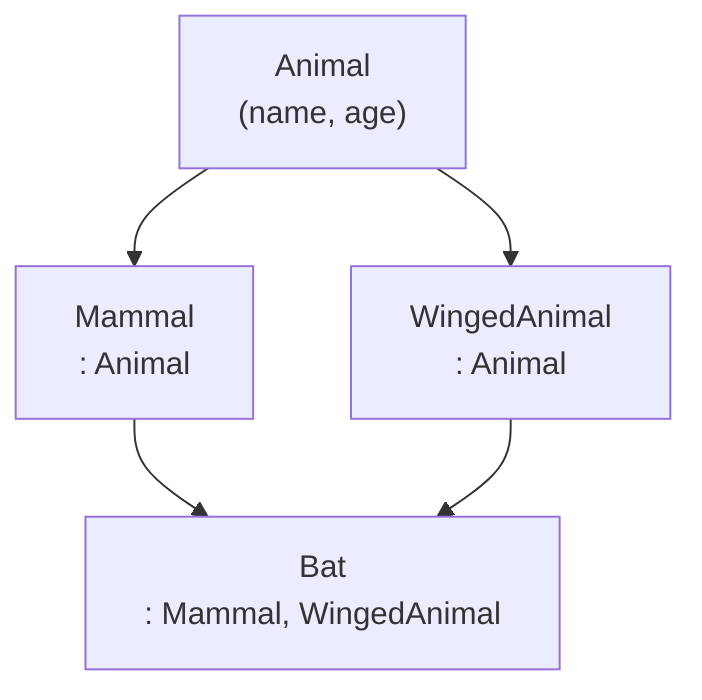
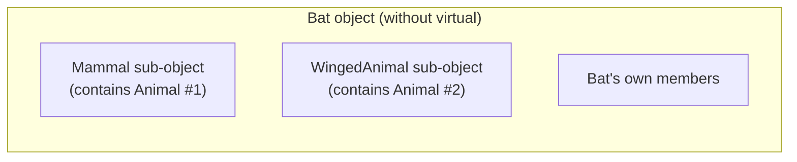
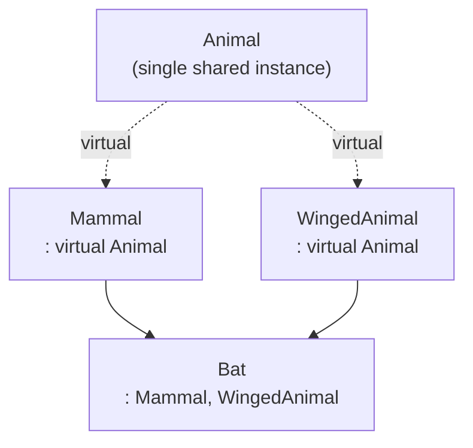
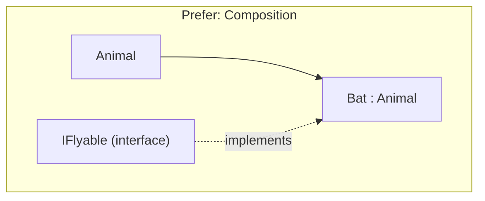

# Multiple Inheritance

> Multiple inheritance lets a class derive from more than one base class, enabling powerful composition of interfaces — but the diamond inheritance problem it creates is one of the strongest arguments for preferring composition over inheritance in C++.

## Table of Contents
- [Core Concepts](#core-concepts)
- [Code Examples](#code-examples)
- [Common Pitfalls](#common-pitfalls)
- [Key Takeaways](#key-takeaways)
- [Exercises](#exercises)

## Core Concepts

### Multiple Inheritance

#### What

Multiple inheritance means a single derived class inherits from two or more base classes simultaneously. The derived class gets all the members (data and functions) from every base. This is syntactically straightforward — you just list multiple base classes separated by commas in the class declaration.

Most mainstream languages (Java, C#, Go) deliberately omit multiple inheritance of implementation. They allow implementing multiple *interfaces*, but not inheriting from multiple concrete classes. C++ is one of the few languages that allows full multiple inheritance, and the reason the others avoid it is the complexity we'll discuss in this lesson.

#### How

You declare multiple base classes in the inheritance list:

```cpp
class Derived : public BaseA, public BaseB {
    // Derived has all members from both BaseA and BaseB
};
```

The derived object's memory layout contains a sub-object for each base class. When you have `Derived d;`, the memory layout looks roughly like `[BaseA sub-object][BaseB sub-object][Derived's own members]`. The compiler adjusts `this` pointers automatically when you cast between base and derived types.

#### Why It Matters

Multiple inheritance is most useful when combining *orthogonal interfaces* — base classes that represent independent capabilities rather than overlapping hierarchies. Think of it as mixing in behaviors: a class might be both `Serializable` and `Printable`, where neither has anything to do with the other. This "mixin" pattern is the one case where multiple inheritance genuinely shines.

The danger starts when the base classes are *not* orthogonal — when they share a common ancestor or have overlapping member names. That's where the diamond problem emerges.

### The Diamond Inheritance Problem

#### What

The diamond problem occurs when a class inherits from two base classes that share a common ancestor. The name comes from the shape of the inheritance graph:



Without any special treatment, `Bat` contains **two** copies of `Animal` — one through `Mammal` and one through `WingedAnimal`. This means `bat.name` is ambiguous: which `Animal::name` do you mean? The compiler doesn't know, so it refuses to compile.

#### How

The diamond arises from the default C++ behavior: each non-virtual base class is stored as a separate sub-object. If `Mammal` has an `Animal` inside it, and `WingedAnimal` also has an `Animal` inside it, then `Bat` gets two `Animal` sub-objects. The memory layout looks like this:



You *can* disambiguate by qualifying the access: `bat.Mammal::name` vs `bat.WingedAnimal::name`. But this is a maintenance nightmare — callers need to know the implementation hierarchy, and the two `Animal` sub-objects can get out of sync (one has `name = "Bruce"` and the other has `name = ""`).

#### Why It Matters

The diamond problem is the primary reason why most modern languages banned multiple inheritance of implementation. It creates:

1. **Ambiguity** — the compiler can't resolve unqualified member access.
2. **Data duplication** — two copies of the base class's data members, which waste memory and can silently diverge.
3. **Maintenance fragility** — changing the base class can break derived classes in non-obvious ways.
4. **Cognitive overhead** — developers have to reason about which copy of the base is being accessed at every point.

### Virtual Base Classes: Solving the Diamond

#### What

Virtual inheritance tells the compiler to share a single instance of a base class across all paths in the inheritance hierarchy. Instead of each intermediate class containing its own copy of the base, they all share one. You declare it by adding `virtual` to the inheritance specifier.



#### How

The syntax changes only at the intermediate classes — the ones that directly inherit from the shared base:

```cpp
class Animal {
public:
    std::string name;
    int age = 0;
};

class Mammal : virtual public Animal {       // virtual inheritance
    // ...
};

class WingedAnimal : virtual public Animal { // virtual inheritance
    // ...
};

class Bat : public Mammal, public WingedAnimal {
    // Only ONE Animal sub-object — no ambiguity
};
```

Under the hood, virtual inheritance changes the memory layout significantly. Instead of embedding the base directly, each intermediate class holds a **pointer (or offset)** to the shared base sub-object, which the compiler places at a separate location in the derived object's memory. This adds a level of indirection — accessing `Animal` members through a `Mammal` pointer requires following a vptr or offset lookup, similar to how virtual functions work.

There is a critical rule: **the most-derived class** is responsible for constructing the virtual base. In our example, `Bat`'s constructor must initialize `Animal` directly, even though `Mammal` and `WingedAnimal` are "closer" in the hierarchy. If `Bat` doesn't explicitly call `Animal`'s constructor, the default constructor is used — regardless of what `Mammal` or `WingedAnimal` specify in their member initializer lists.

```cpp
// The most-derived class must construct the virtual base
Bat::Bat(std::string_view bat_name, int bat_age)
    : Animal{std::string(bat_name), bat_age}   // Bat initializes Animal directly
    , Mammal{}                                   // Mammal's Animal init is ignored
    , WingedAnimal{}                             // WingedAnimal's Animal init is ignored
{
}
```

#### Why It Matters

Virtual base classes solve the diamond problem, but they introduce their own costs:

1. **Performance overhead** — accessing the virtual base requires indirection (pointer or offset), making member access slightly slower than non-virtual inheritance.
2. **Constructor complexity** — the most-derived class must know about and initialize the virtual base, breaking encapsulation (a class three levels up in the hierarchy shouldn't normally need to know about a base class).
3. **Object layout complexity** — the compiler's memory layout is more complex and less predictable, which can affect cache performance.
4. **Cannot use `static_cast` to downcast** — you must use `dynamic_cast` with virtual base classes, which requires RTTI.

### Why Diamond Inheritance is Dangerous

#### What

Even with virtual base classes solving the technical duplication problem, diamond inheritance remains a design smell. The deeper issue isn't the language mechanics — it's the *design* that leads to a diamond in the first place.

#### Why It Matters

A diamond hierarchy means your type system has overlapping abstractions. `Bat` being both a `Mammal` and a `WingedAnimal` (both of which are `Animal`) suggests the taxonomy is trying to model two independent axes (locomotion method and biological class) through a single inheritance hierarchy. This is fundamentally a modeling problem, not a language problem.

The better design almost always uses **composition**: `Bat` *has* a `LocomotionStrategy` (which might be `Flying`) and *is* an `Animal`. Or use multiple *interface* inheritance (abstract classes with no data members) combined with composition for implementation.



The guideline is: **inherit interfaces, compose implementations**. Use multiple inheritance only for abstract base classes (pure interfaces) or small, stateless mixins. Never build deep diamond hierarchies with data-bearing base classes.

### When Multiple Inheritance is Appropriate

#### What

Despite its dangers, multiple inheritance has legitimate uses in C++. The key is to restrict *what* you inherit from.

#### How

The safe patterns are:

1. **Multiple interfaces** — inheriting from multiple abstract base classes (pure virtual functions, no data). This is essentially what Java and C# call implementing multiple interfaces.

2. **Mixins** — small, typically stateless classes that add a single capability. The mixin pattern works well because mixins are orthogonal by design — they don't share state or overlap with each other.

3. **CRTP mixins** — combining CRTP (Curiously Recurring Template Pattern) with multiple inheritance to inject compile-time behavior. The STL uses this pattern (`std::enable_shared_from_this`).

#### Why It Matters

The C++ Standard Library itself uses multiple inheritance sparingly. `std::iostream` inherits from both `std::istream` and `std::ostream` (which both virtually inherit from `std::ios_base`). It works because the design is careful: `ios_base` is shared via virtual inheritance, and the interface separation (input vs output) is clean.

But `iostream` is also widely considered one of the most over-engineered parts of the standard library. The fact that even the STL's best example of multiple inheritance is controversial tells you something about the feature.

## Code Examples

### Basic Multiple Inheritance

```cpp
#include <iostream>
#include <string>
#include <string_view>

// Two orthogonal interfaces — no shared state, no diamond
class Printable {
public:
    virtual ~Printable() = default;
    virtual void print(std::ostream& os) const = 0;
};

class Serializable {
public:
    virtual ~Serializable() = default;
    virtual std::string serialize() const = 0;
};

// A concrete class implementing both interfaces.
// This is the SAFE pattern: inheriting multiple abstract interfaces.
class SensorReading : public Printable, public Serializable {
public:
    SensorReading(std::string_view sensor_id, double value, std::string_view unit)
        : sensor_id_{sensor_id}
        , value_{value}
        , unit_{unit}
    {}

    void print(std::ostream& os) const override {
        os << sensor_id_ << ": " << value_ << " " << unit_;
    }

    std::string serialize() const override {
        // Simple CSV format — in production you'd use a proper serialization library
        return std::string(sensor_id_) + "," +
               std::to_string(value_) + "," +
               std::string(unit_);
    }

private:
    std::string sensor_id_;
    double value_;
    std::string unit_;
};

// Functions that work with the interfaces — they don't know about SensorReading
void display(const Printable& item) {
    item.print(std::cout);
    std::cout << '\n';
}

void save(const Serializable& item) {
    std::cout << "Saving: " << item.serialize() << '\n';
}

int main() {
    const SensorReading reading{"thermocouple-7", 98.6, "F"};

    // SensorReading satisfies both interfaces
    display(reading);   // Uses Printable interface
    save(reading);      // Uses Serializable interface

    return 0;
}
```

### The Diamond Problem and Virtual Inheritance

```cpp
#include <iostream>
#include <string>
#include <string_view>

// The shared base class — will be inherited virtually
class Device {
public:
    explicit Device(std::string_view device_name)
        : device_name_{device_name}
    {
        std::cout << "Device constructed: " << device_name_ << '\n';
    }

    virtual ~Device() = default;

    const std::string& device_name() const { return device_name_; }

private:
    std::string device_name_;
};

// Both intermediate classes use VIRTUAL inheritance from Device.
// This ensures only one Device sub-object exists in any derived class.
class NetworkDevice : virtual public Device {
public:
    explicit NetworkDevice(std::string_view name, std::string_view ip)
        : Device{name}    // This init is IGNORED when NetworkDevice isn't most-derived
        , ip_address_{ip}
    {}

    const std::string& ip_address() const { return ip_address_; }

private:
    std::string ip_address_;
};

class StorageDevice : virtual public Device {
public:
    explicit StorageDevice(std::string_view name, std::size_t capacity_gb)
        : Device{name}    // This init is IGNORED when StorageDevice isn't most-derived
        , capacity_gb_{capacity_gb}
    {}

    std::size_t capacity_gb() const { return capacity_gb_; }

private:
    std::size_t capacity_gb_;
};

// NAS inherits from both — diamond shape.
// Because Device is virtual, there is exactly ONE Device sub-object.
// NAS (the most-derived class) MUST initialize Device directly.
class NAS : public NetworkDevice, public StorageDevice {
public:
    NAS(std::string_view name, std::string_view ip, std::size_t capacity_gb)
        : Device{name}                      // MUST appear here — NAS initializes Device
        , NetworkDevice{name, ip}            // NetworkDevice's Device init is skipped
        , StorageDevice{name, capacity_gb}   // StorageDevice's Device init is skipped
    {}
};

int main() {
    // Only ONE "Device constructed" message — proof that there's one Device sub-object
    const NAS my_nas{"file-server", "192.168.1.100", 4096};

    // No ambiguity — device_name() comes from the single Device sub-object
    std::cout << "Name: " << my_nas.device_name() << '\n';
    std::cout << "IP: " << my_nas.ip_address() << '\n';
    std::cout << "Capacity: " << my_nas.capacity_gb() << " GB\n";

    // Upcasting works correctly with virtual inheritance
    const Device& dev = my_nas;       // Unambiguous — only one Device
    std::cout << "As Device: " << dev.device_name() << '\n';

    return 0;
}
```

### The Better Design: Composition Over Inheritance

```cpp
#include <iostream>
#include <memory>
#include <string>
#include <string_view>

// Instead of a diamond hierarchy, model capabilities as COMPOSABLE components.
// This is almost always the better design.

// Interface for network capability
class INetworkCapable {
public:
    virtual ~INetworkCapable() = default;
    virtual std::string_view ip_address() const = 0;
    virtual void connect() = 0;
};

// Interface for storage capability
class IStorageCapable {
public:
    virtual ~IStorageCapable() = default;
    virtual std::size_t capacity_gb() const = 0;
    virtual void read_data() = 0;
};

// Concrete implementation of network capability — not a base class, a component
class NetworkModule {
public:
    explicit NetworkModule(std::string_view ip) : ip_address_{ip} {}

    std::string_view ip_address() const { return ip_address_; }

    void connect() {
        std::cout << "Connecting to " << ip_address_ << "...\n";
    }

private:
    std::string ip_address_;
};

// Concrete implementation of storage capability — a component, not a base class
class StorageModule {
public:
    explicit StorageModule(std::size_t capacity_gb) : capacity_gb_{capacity_gb} {}

    std::size_t capacity_gb() const { return capacity_gb_; }

    void read_data() {
        std::cout << "Reading from " << capacity_gb_ << " GB storage...\n";
    }

private:
    std::size_t capacity_gb_;
};

// NAS composes both capabilities — no diamond, no ambiguity, no virtual inheritance.
// It inherits INTERFACES (for polymorphism) and COMPOSES implementations.
class NAS : public INetworkCapable, public IStorageCapable {
public:
    NAS(std::string_view name, std::string_view ip, std::size_t capacity_gb)
        : name_{name}
        , network_{ip}
        , storage_{capacity_gb}
    {}

    // Delegate to the composed modules
    std::string_view ip_address() const override { return network_.ip_address(); }
    void connect() override { network_.connect(); }

    std::size_t capacity_gb() const override { return storage_.capacity_gb(); }
    void read_data() override { storage_.read_data(); }

    std::string_view name() const { return name_; }

private:
    std::string name_;
    NetworkModule network_;     // HAS-A network capability
    StorageModule storage_;     // HAS-A storage capability
};

// Functions work with interfaces — decoupled from NAS
void ping(const INetworkCapable& device) {
    std::cout << "Pinging " << device.ip_address() << '\n';
}

void check_storage(const IStorageCapable& device) {
    std::cout << "Storage: " << device.capacity_gb() << " GB\n";
}

int main() {
    NAS my_nas{"file-server", "192.168.1.100", 4096};

    my_nas.connect();
    my_nas.read_data();

    // Works with both interfaces
    ping(my_nas);
    check_storage(my_nas);

    return 0;
}
```

### Mixin Pattern with Multiple Inheritance

```cpp
#include <iostream>
#include <string>
#include <string_view>

// Mixins are small, focused classes that add a single capability.
// They are stateless (or nearly so) and orthogonal to each other.
// This is a legitimate use of multiple inheritance.

// Mixin: adds the ability to track how many times an object is used
template <typename Derived>
class UsageCounted {
public:
    void record_usage() const { ++usage_count_; }
    int usage_count() const { return usage_count_; }

private:
    mutable int usage_count_ = 0;
};

// Mixin: adds a human-readable description capability
template <typename Derived>
class Describable {
public:
    void set_description(std::string_view desc) { description_ = desc; }
    const std::string& description() const { return description_; }

private:
    std::string description_;
};

// A concrete class that mixes in both capabilities.
// No diamond — the mixins have no common base and no overlapping members.
class ApiEndpoint
    : public UsageCounted<ApiEndpoint>
    , public Describable<ApiEndpoint>
{
public:
    explicit ApiEndpoint(std::string_view path) : path_{path} {}

    void handle_request() {
        record_usage();  // From UsageCounted mixin
        std::cout << "Handling request: " << path_ << '\n';
    }

    std::string_view path() const { return path_; }

private:
    std::string path_;
};

int main() {
    ApiEndpoint endpoint{"/api/v1/users"};
    endpoint.set_description("Returns a list of all users");

    endpoint.handle_request();
    endpoint.handle_request();
    endpoint.handle_request();

    std::cout << "Endpoint: " << endpoint.path() << '\n';
    std::cout << "Description: " << endpoint.description() << '\n';
    std::cout << "Times called: " << endpoint.usage_count() << '\n';

    return 0;
}
```

## Common Pitfalls

### Ambiguous member access without virtual inheritance

```cpp
// BAD — diamond without virtual inheritance causes ambiguity
#include <iostream>
#include <string>

class Base {
public:
    std::string name = "base";
};

class Left : public Base {};    // Non-virtual — Left has its own Base
class Right : public Base {};   // Non-virtual — Right has its own Base

class Diamond : public Left, public Right {};

int main() {
    Diamond d;
    // std::cout << d.name;  // COMPILE ERROR: ambiguous — which Base::name?

    // You CAN disambiguate, but it's ugly and error-prone:
    d.Left::name = "left-base";
    d.Right::name = "right-base";
    // Now the two copies have DIFFERENT values — almost certainly a bug
    return 0;
}
```

The two `Base` sub-objects can silently hold different values. Any code that modifies one won't affect the other, leading to subtle inconsistencies that are difficult to debug.

```cpp
// GOOD — use virtual inheritance to share a single Base
#include <iostream>
#include <string>

class Base {
public:
    std::string name = "base";
};

class Left : virtual public Base {};   // Shared Base
class Right : virtual public Base {};  // Shared Base

class Diamond : public Left, public Right {};

int main() {
    Diamond d;
    std::cout << d.name << '\n';  // Unambiguous — one shared Base::name
    d.name = "updated";            // Updates the single shared copy
    return 0;
}
```

### Forgetting to initialize the virtual base in the most-derived class

```cpp
// BAD — relying on intermediate classes to initialize the virtual base
#include <iostream>
#include <string>

class Base {
public:
    explicit Base(int value) : value_{value} {
        std::cout << "Base(" << value_ << ")\n";
    }
    int value() const { return value_; }
private:
    int value_;
};

class Middle : virtual public Base {
public:
    Middle() : Base{42} {}  // This init is IGNORED when Middle isn't most-derived
};

class Derived : public Middle {
    // Derived doesn't initialize Base — the DEFAULT constructor would be called.
    // But Base has no default constructor, so this WON'T COMPILE.
    // If Base had a default constructor, it would silently use Base()
    // instead of Base(42) — a subtle bug.
};
```

When a class has a virtual base with no default constructor, the most-derived class *must* explicitly construct it. Even when a default constructor exists, omitting the initialization silently uses the default, ignoring whatever the intermediate classes specified.

```cpp
// GOOD — most-derived class explicitly initializes the virtual base
#include <iostream>
#include <string>

class Base {
public:
    explicit Base(int value) : value_{value} {
        std::cout << "Base(" << value_ << ")\n";
    }
    int value() const { return value_; }
private:
    int value_;
};

class Middle : virtual public Base {
public:
    Middle() : Base{42} {}  // Used only when Middle is the most-derived class
};

class Derived : public Middle {
public:
    // Derived explicitly initializes Base — this is what actually runs
    Derived() : Base{42}, Middle{} {}
};

int main() {
    Derived d;
    std::cout << "Value: " << d.value() << '\n';  // 42
    return 0;
}
```

### Using multiple inheritance when composition is the better design

```cpp
// BAD — modeling HAS-A relationships through inheritance
#include <string>

class Engine {
public:
    void start() { /* ... */ }
    int horsepower() const { return 200; }
private:
    int rpm_ = 0;
};

class GPS {
public:
    std::string location() const { return "40.7N, 74.0W"; }
private:
    double lat_ = 0.0, lon_ = 0.0;
};

// A car IS NOT an Engine and IS NOT a GPS.
// A car HAS an engine and HAS a GPS.
// Inheriting from both makes the car's interface confusing:
// car.start() is ambiguous — start the engine? start the GPS?
class Car : public Engine, public GPS {
    // All Engine and GPS members leak into Car's public interface
};
```

Inheritance models IS-A relationships. A `Car` is not an `Engine` — it *has* an engine. Using inheritance here exposes implementation details and creates a fragile, confusing API.

```cpp
// GOOD — composition: Car HAS an Engine and a GPS
#include <string>

class Engine {
public:
    void start() { /* ... */ }
    int horsepower() const { return 200; }
private:
    int rpm_ = 0;
};

class GPS {
public:
    std::string location() const { return "40.7N, 74.0W"; }
private:
    double lat_ = 0.0, lon_ = 0.0;
};

class Car {
public:
    void start() { engine_.start(); }  // Delegates — clear intent
    int horsepower() const { return engine_.horsepower(); }
    std::string location() const { return gps_.location(); }

private:
    Engine engine_;  // HAS-A
    GPS gps_;        // HAS-A
};
```

### Slicing with multiple inheritance

```cpp
// BAD — passing a multiply-inherited object by value to a base class parameter
#include <iostream>

class Printable {
public:
    virtual ~Printable() = default;
    virtual void print() const { std::cout << "Printable\n"; }
};

class Loggable {
public:
    virtual ~Loggable() = default;
    virtual void log() const { std::cout << "Loggable\n"; }
};

class Widget : public Printable, public Loggable {
public:
    void print() const override { std::cout << "Widget::print\n"; }
    void log() const override { std::cout << "Widget::log\n"; }
};

// Passing by VALUE slices the object — the Loggable part is lost
void display(Printable p) {  // SLICING! Widget is truncated to Printable
    p.print();               // Calls Printable::print(), not Widget::print()
}
```

Object slicing is always a risk with inheritance, but it's especially dangerous with multiple inheritance because you silently lose entire base class sub-objects.

```cpp
// GOOD — pass by reference or pointer to avoid slicing
#include <iostream>

class Printable {
public:
    virtual ~Printable() = default;
    virtual void print() const { std::cout << "Printable\n"; }
};

class Loggable {
public:
    virtual ~Loggable() = default;
    virtual void log() const { std::cout << "Loggable\n"; }
};

class Widget : public Printable, public Loggable {
public:
    void print() const override { std::cout << "Widget::print\n"; }
    void log() const override { std::cout << "Widget::log\n"; }
};

// Pass by const reference — no slicing, virtual dispatch works correctly
void display(const Printable& p) {
    p.print();  // Calls Widget::print() via virtual dispatch
}

int main() {
    const Widget w;
    display(w);  // Correct: "Widget::print"
    return 0;
}
```

## Key Takeaways

- **Multiple inheritance is safe for combining pure interfaces** (abstract base classes with no data). This is the C++ equivalent of implementing multiple interfaces in Java or C#.
- **The diamond problem** creates ambiguous member access and duplicated base sub-objects. Virtual inheritance solves the duplication but adds indirection cost and constructor complexity (the most-derived class must initialize the virtual base).
- **Prefer composition over inheritance** in almost all designs. If you find yourself reaching for multiple inheritance with data-bearing base classes, redesign: inherit interfaces, compose implementations.
- **Mixins are the exception** — small, stateless (or nearly stateless) classes that add orthogonal capabilities are a legitimate use of multiple inheritance, especially with CRTP.
- **If you see a diamond in your class hierarchy, treat it as a design smell.** The correct response is usually to flatten the hierarchy, not to add `virtual` inheritance.

## Exercises

1. Explain why the most-derived class must initialize a virtual base class, even when intermediate classes also specify constructors for that base. What would happen if the intermediate classes' initializations were used instead?

2. You have a class `Robot` that needs to be both `Controllable` (with methods `start()`, `stop()`, `set_speed(double)`) and `Observable` (with methods `subscribe(callback)`, `notify()`). Design this using multiple inheritance of interfaces plus composition for implementation. Write the class declarations and show how `Robot` delegates to its composed members.

3. Given the following hierarchy, identify all the problems and explain how to fix them:
   ```cpp
   class Entity { public: int id; };
   class Player : public Entity { public: std::string name; };
   class Enemy : public Entity { public: int damage; };
   class Boss : public Player, public Enemy { public: int phase; };
   ```

4. Write a small program that demonstrates the difference in behavior between diamond inheritance *with* and *without* virtual base classes. Print the address of the base sub-object(s) from the most-derived class to prove that virtual inheritance produces a single shared instance.

5. A colleague argues that virtual inheritance completely solves the diamond problem and is always safe to use. Write a counterargument explaining at least three costs or risks that virtual inheritance introduces.

---
up:: [Schedule](../../Schedule.md)
#type/learning #source/self-study #status/evergreen
