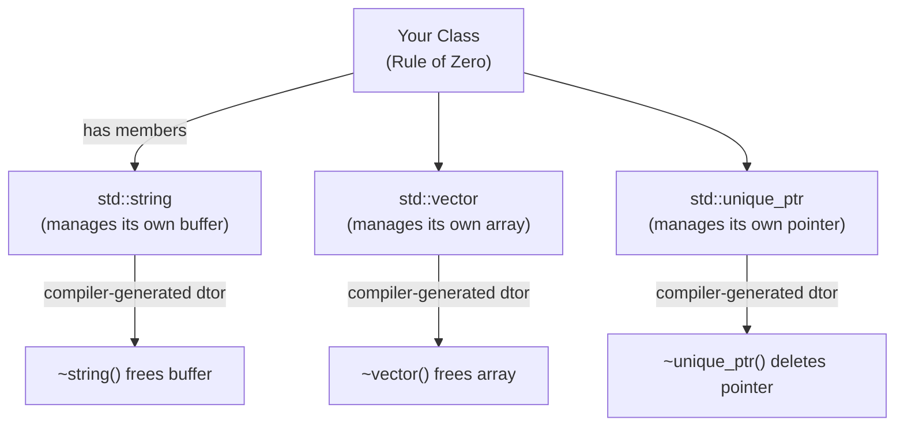
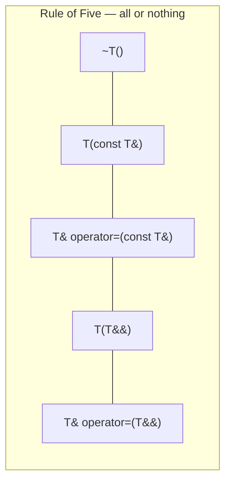
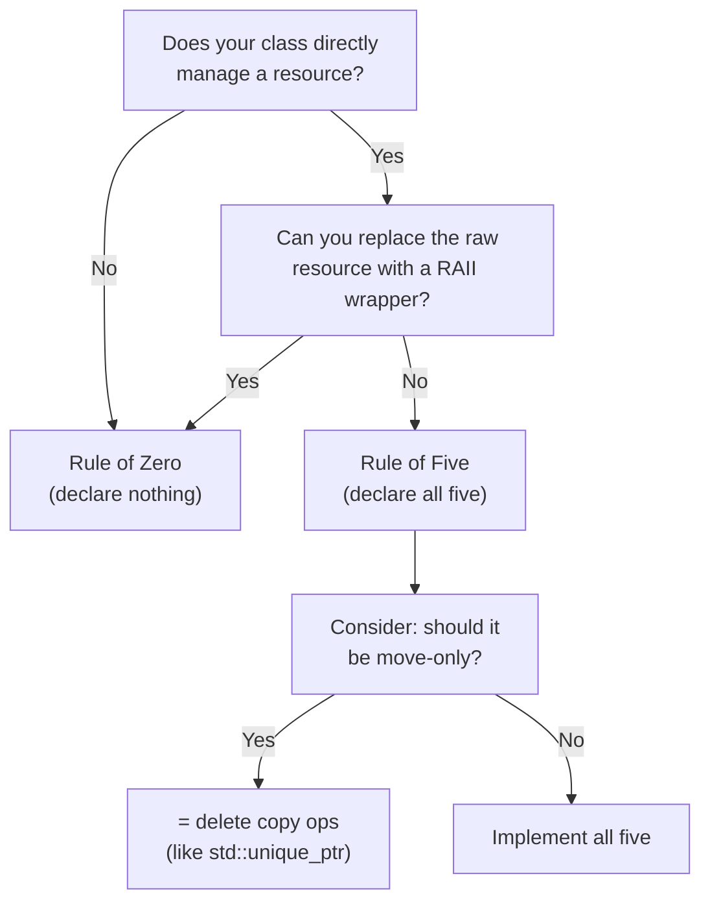

# Rule of Zero, Five, and Three

> The Rules of Zero, Five, and Three tell you exactly when and how to write special member functions (destructor, copy/move constructors, copy/move assignment) — and the goal is almost always to write none of them.

## Table of Contents
- [Core Concepts](#core-concepts)
- [Code Examples](#code-examples)
- [Common Pitfalls](#common-pitfalls)
- [Key Takeaways](#key-takeaways)
- [Exercises](#exercises)

## Core Concepts

### The Six Special Member Functions

#### What

Every C++ class has up to six special member functions that the compiler can generate automatically:

1. **Default constructor** — `T()`
2. **Destructor** — `~T()`
3. **Copy constructor** — `T(const T&)`
4. **Copy assignment operator** — `T& operator=(const T&)`
5. **Move constructor** — `T(T&&)` (C++11)
6. **Move assignment operator** — `T& operator=(T&&)` (C++11)

The Rules of Zero/Five/Three are about the last five (destructor + copy pair + move pair). The default constructor has its own rules but is not part of this framework.

#### How

When you don't declare any of the five, the compiler generates them all for you. Each generated function performs a **member-wise** operation: the copy constructor copies each member, the move constructor moves each member, the destructor destroys each member in reverse declaration order. This is usually correct.

The problems start when your class *directly* manages a resource — raw memory, a file descriptor, a socket, a mutex lock. In that case, the compiler-generated member-wise copy will copy the raw pointer (or handle), resulting in two objects that think they own the same resource. When both destructors run, you get a double-free.

#### Why It Matters

Understanding these rules is fundamental to writing correct C++ classes. Get them wrong and you introduce use-after-free, double-free, resource leaks, or undefined behavior. Get them right and your classes are safe, efficient, and composable. The compiler's implicit generation rules are designed to do the right thing when your members handle their own resources — which is exactly what the Rule of Zero exploits.

### The Rule of Zero

#### What

The Rule of Zero states: **if your class does not directly manage a resource, do not declare any of the five special member functions.** Let the compiler generate them all. They will be correct because each member's own special members handle their resources.

This is the most important rule. It should be your default. The vast majority of classes you write should follow it.

#### How

The key insight is that standard library types already follow RAII. `std::string` manages its own heap buffer. `std::vector` manages its own dynamic array. `std::unique_ptr` manages its own pointer. `std::fstream` manages its own file handle. If your class is composed entirely of these well-behaved members, the compiler-generated destructor will destroy each member (releasing its resource), the copy constructor will copy each member (performing deep copies where appropriate), and the move constructor will move each member (transferring ownership efficiently).



#### Why It Matters

The Rule of Zero is the goal because:

1. **Less code** — no special members to write, test, or maintain.
2. **No bugs** — the compiler-generated versions are always consistent and correct (given well-behaved members).
3. **Composability** — classes that follow Rule of Zero compose cleanly. A class of Rule-of-Zero classes is itself a Rule-of-Zero class.
4. **Future-proof** — if you add a new member, the compiler automatically updates all special member functions. If you wrote them by hand, you'd have to remember to update each one.

If you find yourself writing a destructor, stop and ask: "Can I replace this raw resource with a RAII wrapper?" If the answer is yes (and it almost always is), do that instead and follow the Rule of Zero.

### The Rule of Five

#### What

The Rule of Five states: **if you declare any one of the five special member functions (destructor, copy constructor, copy assignment, move constructor, move assignment), you should declare all five.** This rule applies in C++11 and later, where move semantics exist.

#### How

If your class needs a custom destructor, it's because it directly manages a resource. If it manages a resource, the compiler-generated copy will be wrong (it will shallow-copy the resource handle). And if the copy is wrong, the move probably needs attention too.

The five functions form a coherent unit. They all relate to the same question: "How does this class handle its resource during construction, copying, moving, and destruction?" Implementing only some of them creates inconsistencies:

- **Custom destructor + default copy** = double-free (two objects delete the same resource).
- **Custom copy + no move** = missed optimization (objects are copied when they could be moved).
- **Custom move + no copy** = class is move-only, which might be intentional (like `std::unique_ptr`) but must be deliberate.



#### Why It Matters

The compiler has complex rules about when it implicitly generates or deletes special members based on which ones you've declared. For example, declaring a destructor causes the compiler to *not* implicitly generate move operations (they are "deleted" in a sense — they simply don't exist, so the compiler falls back to copying). This means adding a seemingly innocent destructor can silently degrade performance by turning all moves into copies.

Rather than memorizing these arcane rules, follow the Rule of Five: if you write one, write all five. This makes your intent explicit and prevents the compiler's implicit generation rules from surprising you.

### The Rule of Three (Pre-C++11)

#### What

The Rule of Three is the pre-C++11 version of the Rule of Five. Before move semantics existed, there were only three special members to worry about: **destructor, copy constructor, and copy assignment operator**. If you needed one, you needed all three.

#### How

The logic is the same as the Rule of Five, minus the move operations. If your destructor frees a resource, the default copy constructor will shallow-copy the resource handle, creating a double-free. So you need a custom copy constructor (deep copy). And if you need a custom copy constructor, you need a custom copy assignment operator for the same reason.

```cpp
// Pre-C++11: Rule of Three
class Buffer {
public:
    explicit Buffer(std::size_t size);
    ~Buffer();                                // 1. Destructor
    Buffer(const Buffer& other);              // 2. Copy constructor
    Buffer& operator=(const Buffer& other);   // 3. Copy assignment
};
```

#### Why It Matters

The Rule of Three is important to know for two reasons:

1. **Legacy code** — enormous amounts of production C++ were written before C++11. You will encounter Rule-of-Three classes in older codebases, and you need to understand them.

2. **Upgrading to Rule of Five** — when modernizing pre-C++11 code, a Rule-of-Three class should be upgraded to Rule of Five by adding move operations. This is often a significant performance win, especially for classes that manage large buffers or containers.

If you're writing new code, skip the Rule of Three and go straight to the Rule of Five (or, better, the Rule of Zero).

### When to Use Which Rule

#### What

The decision tree is straightforward:



#### How

In practice:

- **Rule of Zero** covers ~95% of classes. Business logic, data structures composed of standard types, application-level objects — they should all follow Rule of Zero.

- **Rule of Five** covers the remaining ~5%: RAII wrapper classes that directly hold a raw resource. Think `unique_ptr`-like wrappers for file descriptors, GPU buffers, database connections, or memory-mapped files that don't have a pre-built RAII wrapper.

- **Rule of Three** should never be used in new C++11+ code. If you're maintaining a legacy codebase that's pre-C++11, you may encounter it, but for new code, always use Rule of Five.

#### Why It Matters

The critical insight is that **Rule of Zero is the goal, and Rule of Five is the fallback.** If you're writing Rule of Five classes frequently, you're either writing low-level infrastructure (which is fine) or you're not using RAII wrappers effectively (which is a design problem).

Every Rule-of-Five class is a potential source of bugs — five functions that must be kept consistent, any of which can introduce use-after-free, double-free, or leak if implemented incorrectly. Minimize the number of such classes in your codebase by wrapping raw resources in small, dedicated RAII types, and then composing those types following the Rule of Zero.

### The Compiler's Implicit Generation Rules

#### What

The compiler has specific rules for when it will or will not generate special member functions. These rules are complex and sometimes surprising, which is another reason to follow the Rules explicitly rather than relying on implicit behavior.

#### How

The key rules to know:

| You declare...         | Compiler generates copy? | Compiler generates move? | Compiler generates dtor? |
|------------------------|--------------------------|--------------------------|--------------------------|
| Nothing                | Yes                      | Yes                      | Yes                      |
| Destructor only        | Yes (deprecated!)        | **No**                   | (declared)               |
| Copy ctor only         | (declared)               | **No**                   | Yes                      |
| Copy assign only       | Yes                      | **No**                   | Yes                      |
| Move ctor only         | **Deleted**              | (declared)               | Yes                      |
| Move assign only       | **Deleted**              | (declared)               | Yes                      |
| Any two or more        | Depends on combination   | Depends on combination   | Yes (unless declared)    |

The most dangerous row is the second one: **declaring only a destructor suppresses move generation.** This means your class will silently fall back to copying everywhere a move would have been used. No compiler error — just silently worse performance.

#### Why It Matters

This table is why the Rule of Five exists. Rather than memorizing these rules and hoping you get them right, just declare all five (or none). If you want a class that's move-only (like `std::unique_ptr`), declare the move operations and `= delete` the copy operations. If you want a class that's non-copyable and non-movable (like `std::mutex`), `= delete` all four.

Being explicit with `= default` and `= delete` is always clearer than relying on implicit generation.

## Code Examples

### Rule of Zero in Practice

```cpp
#include <iostream>
#include <memory>
#include <string>
#include <vector>

// This class follows the Rule of Zero perfectly.
// Every member is a well-behaved RAII type.
// The compiler-generated special members do exactly the right thing:
//   - Copy: deep copies string and vector, compiles out unique_ptr (see below)
//   - Move: efficiently transfers ownership of all members
//   - Destructor: each member cleans up its own resource
class UserProfile {
public:
    UserProfile(std::string name, std::string email)
        : name_{std::move(name)}
        , email_{std::move(email)}
    {}

    void add_tag(std::string tag) {
        tags_.push_back(std::move(tag));
    }

    void print() const {
        std::cout << name_ << " <" << email_ << ">\n";
        std::cout << "Tags: ";
        for (const auto& tag : tags_) {
            std::cout << tag << ' ';
        }
        std::cout << '\n';
    }

private:
    std::string name_;              // Manages its own heap buffer
    std::string email_;             // Manages its own heap buffer
    std::vector<std::string> tags_; // Manages its own dynamic array
    // NO destructor, NO copy/move constructors, NO assignment operators.
    // The compiler generates correct versions of all five automatically.
};

int main() {
    UserProfile alice{"Alice", "alice@example.com"};
    alice.add_tag("admin");
    alice.add_tag("developer");

    // Copy: deep copies all members (compiler-generated copy ctor)
    UserProfile alice_copy = alice;
    alice_copy.add_tag("copied");

    // Move: efficiently transfers ownership (compiler-generated move ctor)
    UserProfile moved_alice = std::move(alice);

    moved_alice.print();
    alice_copy.print();

    // alice is in a valid-but-unspecified state after the move — don't use it
    return 0;
}
```

### Rule of Five: A RAII File Handle Wrapper

```cpp
#include <cstdio>
#include <iostream>
#include <stdexcept>
#include <string>
#include <string_view>
#include <utility>  // std::exchange

// This class directly manages a raw resource (FILE*), so it MUST follow
// the Rule of Five. We implement all five special members explicitly.
//
// In real code, prefer wrapping FILE* in a std::unique_ptr with a custom
// deleter and following Rule of Zero instead. This example exists to teach
// the mechanics.
class FileHandle {
public:
    // Constructor: acquires the resource
    explicit FileHandle(std::string_view filename, std::string_view mode = "r")
        : filename_{filename}
    {
        file_ = std::fopen(filename_.c_str(), std::string(mode).c_str());
        if (!file_) {
            throw std::runtime_error("Failed to open: " + filename_);
        }
    }

    // 1. Destructor: releases the resource
    ~FileHandle() {
        if (file_) {
            std::fclose(file_);
        }
    }

    // 2. Copy constructor: deep copy — reopen the file
    // (Copying a file handle means opening a new independent handle to the same file)
    FileHandle(const FileHandle& other)
        : filename_{other.filename_}
    {
        if (other.file_) {
            file_ = std::fopen(filename_.c_str(), "r");
            if (!file_) {
                throw std::runtime_error("Failed to copy-open: " + filename_);
            }
        }
    }

    // 3. Copy assignment: copy-and-swap idiom for exception safety
    FileHandle& operator=(const FileHandle& other) {
        if (this != &other) {
            FileHandle tmp{other};       // Copy construct a temporary
            swap(*this, tmp);            // Swap resources with the temporary
        }                                // tmp's destructor cleans up our old resource
        return *this;
    }

    // 4. Move constructor: transfer ownership — the source gives up its resource
    FileHandle(FileHandle&& other) noexcept
        : file_{std::exchange(other.file_, nullptr)}    // Take the handle, null out source
        , filename_{std::move(other.filename_)}
    {}

    // 5. Move assignment: transfer ownership using swap
    FileHandle& operator=(FileHandle&& other) noexcept {
        if (this != &other) {
            FileHandle tmp{std::move(other)};   // Move construct a temporary
            swap(*this, tmp);                    // Swap with the temporary
        }                                        // tmp's destructor cleans up our old resource
        return *this;
    }

    // Friend swap — used by copy-and-swap idiom
    friend void swap(FileHandle& a, FileHandle& b) noexcept {
        using std::swap;
        swap(a.file_, b.file_);
        swap(a.filename_, b.filename_);
    }

    // Read a line from the file
    std::string read_line() const {
        if (!file_) {
            throw std::runtime_error("File not open");
        }
        char buffer[256];
        if (std::fgets(buffer, sizeof(buffer), file_)) {
            return std::string{buffer};
        }
        return {};
    }

    bool is_open() const { return file_ != nullptr; }

private:
    FILE* file_ = nullptr;      // Raw resource — this is why we need Rule of Five
    std::string filename_;
};

int main() {
    try {
        FileHandle file{"example.txt", "w"};
        // file will be properly closed when it goes out of scope
        // If we copy it, we get an independent handle
        // If we move it, ownership transfers cleanly
    } catch (const std::runtime_error& e) {
        std::cerr << "Error: " << e.what() << '\n';
    }
    return 0;
}
```

### Turning Rule of Five into Rule of Zero with unique_ptr

```cpp
#include <cstdio>
#include <iostream>
#include <memory>
#include <string>
#include <string_view>

// Custom deleter for FILE* — tells unique_ptr how to clean up
struct FileDeleter {
    void operator()(FILE* f) const {
        if (f) {
            std::fclose(f);
        }
    }
};

// Type alias for our RAII file handle
using UniqueFile = std::unique_ptr<FILE, FileDeleter>;

// Helper function to create a UniqueFile — analogous to std::make_unique
UniqueFile make_file(std::string_view filename, std::string_view mode) {
    FILE* f = std::fopen(std::string(filename).c_str(), std::string(mode).c_str());
    return UniqueFile{f};
}

// This class now follows the RULE OF ZERO.
// No destructor, no copy/move — the compiler generates correct versions.
// (unique_ptr is move-only, so this class is also move-only — which is
// usually the right semantics for a file handle.)
class LogWriter {
public:
    explicit LogWriter(std::string_view filename)
        : file_{make_file(filename, "a")}
    {
        if (!file_) {
            throw std::runtime_error("Failed to open log file");
        }
    }

    // No destructor — unique_ptr handles it
    // No copy — unique_ptr is move-only, so LogWriter is move-only
    // No move — compiler generates correct move operations

    void write(std::string_view message) {
        if (file_) {
            std::fprintf(file_.get(), "%.*s\n",
                         static_cast<int>(message.size()), message.data());
        }
    }

private:
    UniqueFile file_;   // RAII wrapper — Rule of Zero applies
};

int main() {
    try {
        LogWriter log{"app.log"};
        log.write("Application started");
        log.write("Processing data...");

        // Move the logger to a new owner
        LogWriter moved_log = std::move(log);
        moved_log.write("Still working after move");

        // log is now in a moved-from state — don't use it
    } catch (const std::runtime_error& e) {
        std::cerr << "Error: " << e.what() << '\n';
    }
    return 0;
}
```

### Move-Only Class (Deliberately Deleting Copy)

```cpp
#include <iostream>
#include <memory>
#include <utility>

// Some resources cannot be meaningfully copied — network connections,
// thread handles, GPU buffers. For these, explicitly delete the copy
// operations and provide move operations.

class TcpConnection {
public:
    explicit TcpConnection(int socket_fd)
        : socket_fd_{socket_fd}
    {}

    ~TcpConnection() {
        if (socket_fd_ >= 0) {
            std::cout << "Closing socket " << socket_fd_ << '\n';
            // In real code: ::close(socket_fd_);
        }
    }

    // Explicitly delete copy — a TCP connection cannot be duplicated
    TcpConnection(const TcpConnection&) = delete;
    TcpConnection& operator=(const TcpConnection&) = delete;

    // Move transfers ownership of the socket
    TcpConnection(TcpConnection&& other) noexcept
        : socket_fd_{std::exchange(other.socket_fd_, -1)}
    {}

    TcpConnection& operator=(TcpConnection&& other) noexcept {
        if (this != &other) {
            // Close our current socket before taking the new one
            if (socket_fd_ >= 0) {
                std::cout << "Closing socket " << socket_fd_ << '\n';
            }
            socket_fd_ = std::exchange(other.socket_fd_, -1);
        }
        return *this;
    }

    void send(const char* data) const {
        if (socket_fd_ >= 0) {
            std::cout << "Sending on socket " << socket_fd_ << ": " << data << '\n';
        }
    }

    int fd() const { return socket_fd_; }

private:
    int socket_fd_ = -1;
};

int main() {
    TcpConnection conn{42};
    conn.send("Hello, server!");

    // TcpConnection conn2 = conn;           // COMPILE ERROR: copy is deleted
    TcpConnection conn2 = std::move(conn);   // OK: ownership transfers
    conn2.send("Moved connection still works");

    // conn.fd() is now -1 — the socket was transferred to conn2
    std::cout << "Original fd after move: " << conn.fd() << '\n';

    return 0;
}
```

### Explicitly Defaulted Special Members

```cpp
#include <iostream>
#include <string>
#include <vector>

// Sometimes you want to be EXPLICIT about using compiler-generated defaults,
// even though the compiler would generate them anyway. This is good practice
// because it documents your intent: "I thought about this and decided the
// defaults are correct."

class Config {
public:
    Config(std::string app_name, int version)
        : app_name_{std::move(app_name)}
        , version_{version}
    {}

    // Explicitly defaulted: documents that the compiler-generated versions
    // are intentional, not accidental. Especially important when you have
    // a non-default constructor (like above).
    ~Config() = default;
    Config(const Config&) = default;
    Config& operator=(const Config&) = default;
    Config(Config&&) noexcept = default;
    Config& operator=(Config&&) noexcept = default;

    void add_setting(std::string key, std::string value) {
        keys_.push_back(std::move(key));
        values_.push_back(std::move(value));
    }

    void print() const {
        std::cout << app_name_ << " v" << version_ << '\n';
        for (std::size_t i = 0; i < keys_.size(); ++i) {
            std::cout << "  " << keys_[i] << " = " << values_[i] << '\n';
        }
    }

private:
    std::string app_name_;
    int version_;
    std::vector<std::string> keys_;
    std::vector<std::string> values_;
};

int main() {
    Config cfg{"MyApp", 2};
    cfg.add_setting("theme", "dark");
    cfg.add_setting("language", "en");

    // Copy works (compiler-generated deep copy of all members)
    Config backup = cfg;
    backup.add_setting("debug", "true");

    std::cout << "Original:\n";
    cfg.print();
    std::cout << "\nBackup:\n";
    backup.print();

    return 0;
}
```

## Common Pitfalls

### Declaring only a destructor (silently suppressing move operations)

```cpp
// BAD — custom destructor suppresses move generation
#include <string>
#include <vector>

class DataStore {
public:
    DataStore() = default;

    // "I just want to add a log message in the destructor..."
    ~DataStore() {
        // Some cleanup logging
    }

    // PROBLEM: by declaring the destructor, you've suppressed move operations.
    // The compiler will NOT generate move constructor or move assignment.
    // Every "move" silently falls back to a COPY — potentially huge perf hit
    // for a class with a large vector.

private:
    std::vector<std::string> data_;  // Could be millions of elements
};
```

The compiler's implicit generation rules say: if you declare a destructor, move operations are not generated. The class silently degrades to copy-only, which can be catastrophic for performance when the class holds large containers.

```cpp
// GOOD — either follow Rule of Zero or explicitly default all five
#include <string>
#include <vector>

// Option A: Rule of Zero — remove the destructor entirely
class DataStoreA {
public:
    DataStoreA() = default;
    // No destructor — compiler generates all five correctly
private:
    std::vector<std::string> data_;
};

// Option B: Rule of Five — if you genuinely need the destructor,
// explicitly default the rest
class DataStoreB {
public:
    DataStoreB() = default;

    ~DataStoreB() { /* logging */ }

    // Explicitly restore move operations (and copy for completeness)
    DataStoreB(const DataStoreB&) = default;
    DataStoreB& operator=(const DataStoreB&) = default;
    DataStoreB(DataStoreB&&) noexcept = default;
    DataStoreB& operator=(DataStoreB&&) noexcept = default;

private:
    std::vector<std::string> data_;
};
```

### Writing a custom copy without implementing move

```cpp
// BAD — custom copy constructor but no move operations
#include <iostream>
#include <string>

class NamedObject {
public:
    explicit NamedObject(std::string name) : name_{std::move(name)} {
        std::cout << "Constructed: " << name_ << '\n';
    }

    // Custom copy constructor (maybe for logging)
    NamedObject(const NamedObject& other) : name_{other.name_} {
        std::cout << "Copied: " << name_ << '\n';
    }

    // PROBLEM: declaring a copy constructor suppresses implicit move generation.
    // std::move(named_obj) will silently COPY instead of moving.
    // No compiler warning — just silently worse performance.

private:
    std::string name_;
};
```

Declaring a copy constructor suppresses the implicit move constructor and move assignment operator. `std::move()` on this object will silently fall back to the copy constructor, defeating the purpose.

```cpp
// GOOD — Rule of Five: declare all five
#include <iostream>
#include <string>

class NamedObject {
public:
    explicit NamedObject(std::string name) : name_{std::move(name)} {
        std::cout << "Constructed: " << name_ << '\n';
    }

    NamedObject(const NamedObject& other) : name_{other.name_} {
        std::cout << "Copied: " << name_ << '\n';
    }

    NamedObject& operator=(const NamedObject& other) {
        name_ = other.name_;
        std::cout << "Copy-assigned: " << name_ << '\n';
        return *this;
    }

    NamedObject(NamedObject&& other) noexcept : name_{std::move(other.name_)} {
        std::cout << "Moved: " << name_ << '\n';
    }

    NamedObject& operator=(NamedObject&& other) noexcept {
        name_ = std::move(other.name_);
        std::cout << "Move-assigned: " << name_ << '\n';
        return *this;
    }

    ~NamedObject() = default;

private:
    std::string name_;
};
```

### Managing a raw resource without the Rule of Five

```cpp
// BAD — custom destructor but compiler-generated copy = double-free
#include <cstddef>
#include <cstring>

class Buffer {
public:
    explicit Buffer(std::size_t size)
        : data_{new char[size]}   // Allocates raw memory
        , size_{size}
    {
        std::memset(data_, 0, size_);
    }

    ~Buffer() {
        delete[] data_;   // Frees the memory
    }

    // PROBLEM: no copy constructor or copy assignment declared.
    // The compiler generates a member-wise copy: both the original
    // and the copy will have the SAME data_ pointer.
    // When both destructors run → double delete[] → undefined behavior.

private:
    char* data_;
    std::size_t size_;
};

void bad_example() {
    Buffer a{1024};
    Buffer b = a;       // Compiler-generated copy: b.data_ == a.data_
    // When this scope ends, both a and b call delete[] on the same pointer → BOOM
}
```

This is the textbook motivation for the Rule of Five. The compiler-generated copy performs a shallow copy of the raw pointer, so two objects end up pointing to the same memory. When both destructors run, the memory is freed twice — undefined behavior that often manifests as a crash or heap corruption.

```cpp
// GOOD — Rule of Five: all five special members are defined
#include <algorithm>
#include <cstddef>
#include <cstring>
#include <utility>

class Buffer {
public:
    explicit Buffer(std::size_t size)
        : data_{new char[size]}
        , size_{size}
    {
        std::memset(data_, 0, size_);
    }

    // 1. Destructor
    ~Buffer() {
        delete[] data_;
    }

    // 2. Copy constructor — deep copy
    Buffer(const Buffer& other)
        : data_{new char[other.size_]}
        , size_{other.size_}
    {
        std::memcpy(data_, other.data_, size_);
    }

    // 3. Copy assignment — copy-and-swap
    Buffer& operator=(const Buffer& other) {
        if (this != &other) {
            Buffer tmp{other};
            swap(*this, tmp);
        }
        return *this;
    }

    // 4. Move constructor — transfer ownership
    Buffer(Buffer&& other) noexcept
        : data_{std::exchange(other.data_, nullptr)}
        , size_{std::exchange(other.size_, 0)}
    {}

    // 5. Move assignment — swap with temporary
    Buffer& operator=(Buffer&& other) noexcept {
        if (this != &other) {
            Buffer tmp{std::move(other)};
            swap(*this, tmp);
        }
        return *this;
    }

    friend void swap(Buffer& a, Buffer& b) noexcept {
        using std::swap;
        swap(a.data_, b.data_);
        swap(a.size_, b.size_);
    }

    std::size_t size() const { return size_; }
    const char* data() const { return data_; }

private:
    char* data_;
    std::size_t size_;
};
```

### Forgetting noexcept on move operations

```cpp
// BAD — move constructor without noexcept
#include <string>
#include <vector>

class Widget {
public:
    explicit Widget(std::string name) : name_{std::move(name)} {}

    // Move constructor is NOT noexcept
    Widget(Widget&& other) : name_{std::move(other.name_)} {}

    // PROBLEM: std::vector::push_back will COPY instead of MOVE
    // when reallocating, because it can't guarantee exception safety
    // without noexcept on the move constructor.

private:
    std::string name_;
};
```

`std::vector` needs to provide the strong exception guarantee when it reallocates. If the move constructor can throw, the vector can't safely move elements (a throw midway would leave the vector in an inconsistent state). So it falls back to copying, which *can* be safely rolled back by destroying the copies. Adding `noexcept` tells the vector it's safe to move.

```cpp
// GOOD — move operations marked noexcept
#include <string>
#include <vector>

class Widget {
public:
    explicit Widget(std::string name) : name_{std::move(name)} {}

    Widget(Widget&& other) noexcept : name_{std::move(other.name_)} {}
    Widget& operator=(Widget&& other) noexcept {
        name_ = std::move(other.name_);
        return *this;
    }

    // Complete Rule of Five
    ~Widget() = default;
    Widget(const Widget&) = default;
    Widget& operator=(const Widget&) = default;

private:
    std::string name_;
};

int main() {
    std::vector<Widget> widgets;
    // With noexcept move, vector uses move during reallocation — much faster
    for (int i = 0; i < 1000; ++i) {
        widgets.emplace_back("widget-" + std::to_string(i));
    }
    return 0;
}
```

## Key Takeaways

- **Rule of Zero is the goal**: if your class uses only RAII members (`std::string`, `std::vector`, smart pointers), declare no special member functions. The compiler-generated versions are correct, consistent, and automatically updated when you add members.
- **Rule of Five is the fallback**: if you *must* manage a raw resource directly, implement all five special members (destructor, copy constructor, copy assignment, move constructor, move assignment). Missing any one of them creates bugs or performance problems.
- **Declaring a destructor suppresses move generation** — this is the most common silent performance regression in C++. If you add a destructor, explicitly `= default` or implement the move operations.
- **Always mark move operations `noexcept`** — without it, `std::vector` and other standard containers fall back to copying during reallocation, silently degrading performance.
- **When in doubt, wrap the raw resource in a small RAII class** (or use `std::unique_ptr` with a custom deleter), then compose that wrapper into your larger class using Rule of Zero. This isolates the Rule-of-Five complexity to one small, testable class.

## Exercises

1. You have a class with a `std::vector<std::string>` and a `std::unique_ptr<Config>` as members. A colleague adds `~MyClass() { std::cout << "destroying\n"; }` for debugging. Explain what implicit special members are now suppressed and what the performance impact will be. How would you fix it while keeping the debug logging?

2. Write a `UniqueArray<T>` class that owns a dynamically allocated array (using `new[]` / `delete[]`). Implement all five special member functions following the Rule of Five. Then refactor it to use `std::unique_ptr<T[]>` and demonstrate that it now follows the Rule of Zero.

3. Explain why `std::vector` falls back to copying (instead of moving) elements during reallocation when the element type's move constructor is not `noexcept`. What exception safety guarantee would be violated if it moved elements with a potentially-throwing move constructor?

4. Given the following class, identify which special member functions the compiler will implicitly generate and which it will suppress. Then fix the class to follow the appropriate rule:
   ```cpp
   class Session {
   public:
       Session(int id) : id_{id}, log_{"session_" + std::to_string(id) + ".log"} {}
       Session(const Session&) = delete;
       Session& operator=(const Session&) = delete;
   private:
       int id_;
       std::ofstream log_;
   };
   ```

5. Redesign the `FileHandle` class from the code examples section so that it follows the Rule of Zero. Use `std::unique_ptr` with a custom deleter. Verify that the resulting class is move-only (not copyable) without you having to explicitly delete the copy operations.
