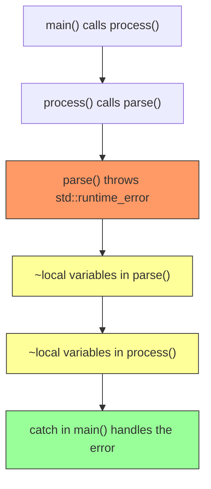
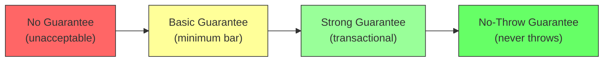

# Exception Handling

> Exception handling is C++'s mechanism for separating error-handling logic from the normal execution path, and understanding exception safety guarantees is what separates hobby code from production-quality systems.

## Table of Contents
- [Core Concepts](#core-concepts)
- [Code Examples](#code-examples)
- [Common Pitfalls](#common-pitfalls)
- [Key Takeaways](#key-takeaways)
- [Exercises](#exercises)

## Core Concepts

### Exceptions: throw, try, and catch

#### What

An **exception** is a runtime event that disrupts normal control flow. When a function encounters an error it cannot handle locally, it **throws** an exception. The runtime then searches the call stack for a **catch** block that matches the exception type. If it finds one, execution resumes inside that catch block. If no matching catch exists, `std::terminate` is called and your program dies.

The three keywords:
- `throw expression;` — creates an exception object and begins stack unwinding.
- `try { ... }` — marks a block of code where exceptions might be thrown.
- `catch (Type& e) { ... }` — handles exceptions of a specific type. Always catch by **const reference** to avoid slicing and unnecessary copies.

#### How

When you `throw`, the runtime does not simply jump to the catch block. It performs **stack unwinding**: it walks back up the call stack, destroying every local variable in each stack frame, in reverse order of construction. Destructors run for every object that went out of scope. This is why RAII is so important — if your resources are managed by RAII objects, stack unwinding cleans them up automatically.



The runtime searches catch blocks in order, top to bottom. It picks the **first** match, not the best match. This means you must order catch blocks from most-specific to least-specific — a `catch (std::exception&)` before a `catch (std::runtime_error&)` will swallow the more specific exception.

#### Why It Matters

Stack unwinding is the feature that makes exceptions fundamentally different from C-style error codes. In C, if `parse()` fails, it returns an error code to `process()`, which checks it and returns an error code to `main()`. Every intermediate function must manually propagate the error. With exceptions, `parse()` throws and `main()` catches — `process()` doesn't need any error-handling code at all. The error jumps over intermediate frames automatically.

But this power comes with a responsibility: because execution can leave *any* function at *any* point via an exception, every function must leave its state consistent when an exception fires. That's the topic of exception safety guarantees, covered below.

### Why Exceptions Over Error Codes

#### What

C-style error handling uses return values to signal failure: a function returns 0 for success and -1 for failure, or returns a null pointer, or sets a global `errno`. This approach has three fundamental problems:

1. **Error codes are ignorable.** The caller can simply not check the return value, and the program silently continues in a broken state.
2. **Error propagation is manual.** Every function in the call chain must check for errors and propagate them upward. This pollutes the happy path with error-checking code at every level.
3. **Return values do double duty.** The same channel (the return value) carries both the result and the error status. This forces awkward patterns — output parameters, sentinel values, or in/out error codes.

#### How

Exceptions solve all three problems:

1. **Exceptions cannot be silently ignored.** If you don't catch an exception, your program terminates. You have to make a deliberate decision about how to handle every error.
2. **Exceptions propagate automatically.** Intermediate functions don't need any error-handling code. The exception jumps from the throw site to the nearest matching catch handler, no matter how many call frames apart they are.
3. **The return channel is reserved for results.** Functions return their actual result. Errors travel through a separate channel (the exception mechanism), so you don't need output parameters or sentinel values.

#### Why It Matters

The separation of the happy path from the error path is the real win. Compare these two styles:

```cpp
// Error-code style — error handling dominates the logic
int result = open_file(path);
if (result != 0) return result;
result = read_header(file);
if (result != 0) { close_file(file); return result; }
result = parse_data(file);
if (result != 0) { close_file(file); return result; }
close_file(file);
```

```cpp
// Exception style — happy path is clean, errors handled elsewhere
auto file = open_file(path);    // throws on failure
auto header = read_header(file); // throws on failure
auto data = parse_data(file);    // throws on failure
// RAII closes the file automatically, even if an exception fires
```

The exception-based version reads like a description of what the code *does*, not how it *fails*. The error handling is centralized in a catch block somewhere up the call stack, not scattered across every function.

### Exit Codes

#### What

When your `main()` function returns, the value it returns becomes the **exit code** of the process. The operating system uses this value to determine whether your program succeeded or failed. The C++ standard defines two portable values:

- `EXIT_SUCCESS` (typically 0) — the program completed normally.
- `EXIT_FAILURE` (typically 1) — the program encountered an error.

Both are defined in `<cstdlib>`. You can also use `std::exit(code)` to terminate the program from anywhere, or `std::abort()` to terminate abnormally without running destructors.

#### How

Exit codes matter at the system level. Shell scripts, CI pipelines, process managers, and parent processes all check exit codes to decide what to do next. A build system might abort the entire build if a compiler invocation returns non-zero. A shell `if` statement branches on a command's exit code.

`return 0` from `main()` is equivalent to `return EXIT_SUCCESS`. Returning a non-zero value signals failure. The specific non-zero value can encode *what* failed — some programs define their own exit code conventions (e.g., `1` for general error, `2` for misuse, `126` for permission denied).

#### Why It Matters

Exit codes are the lowest-level error reporting mechanism — the interface between your program and the operating system. Even if your program uses exceptions internally, the top-level catch block in `main()` should translate unhandled exceptions into a non-zero exit code. A program that crashes without setting an appropriate exit code breaks every automation system that depends on it.

```cpp
int main() {
    try {
        run_application();
        return EXIT_SUCCESS;
    } catch (const std::exception& e) {
        std::cerr << "Fatal error: " << e.what() << '\n';
        return EXIT_FAILURE;
    }
}
```

### Access Violations

#### What

An **access violation** (segmentation fault on Unix, access violation on Windows) occurs when your program tries to read or write memory it doesn't own. Common causes:

- **Null pointer dereference**: calling a method on a `nullptr`, or reading through a null pointer.
- **Dangling pointer/reference**: accessing an object after it has been destroyed.
- **Buffer overflow**: writing past the end of an array or buffer.
- **Stack overflow**: infinite recursion that exhausts the stack.

#### How

Access violations are **not exceptions**. They are **signals** sent by the operating system (e.g., `SIGSEGV` on Unix). The C++ exception mechanism cannot catch them. A `try`/`catch` block will not help. The program is in an undefined state and is typically killed by the OS.

Some platforms offer non-portable ways to intercept signals (`signal()`, structured exception handling on Windows), but these are dangerous and unreliable. By the time a segfault fires, your program's memory may be corrupted — there is no safe way to "recover" from it.

#### Why It Matters

The fact that access violations are not catchable is precisely why C++ puts so much emphasis on **prevention**:

- Use smart pointers (`std::unique_ptr`, `std::shared_ptr`) to prevent dangling pointers.
- Use `std::optional` instead of null pointers to represent "might not have a value."
- Use `std::vector` and `std::array` with `.at()` for bounds-checked access.
- Use RAII to ensure objects are alive for exactly as long as they're needed.

The entire smart pointer and RAII ecosystem exists, in part, because the consequences of getting pointer management wrong are so severe — the program doesn't throw a catchable exception, it simply crashes (or worse, silently corrupts memory and continues running).

### Exception Safety Guarantees

#### What

Every function in your codebase makes an implicit promise about what happens when an exception is thrown during its execution. The C++ community has formalized these promises into three levels of **exception safety guarantees**, from weakest to strongest:

1. **Basic guarantee**: If an exception is thrown, the program remains in a valid state. No resources are leaked, no invariants are broken. But the state might have changed — you can't predict exactly what state the object is in, only that it's internally consistent.

2. **Strong guarantee** (commit-or-rollback): If an exception is thrown, the operation has no effect. The program state is exactly as it was before the function was called. This is transactional — either the entire operation succeeds, or it's as if it never happened.

3. **No-throw guarantee**: The function will never throw an exception. Period. This is the strongest guarantee and is required for certain operations (destructors, `swap`, move operations used by containers).

There is also an implicit fourth level: **no guarantee** — the function might leak resources or leave the program in an invalid state if an exception fires. This is unacceptable in production code.

#### How

Think of these guarantees as a spectrum:



**RAII automatically gives you the basic guarantee.** If you manage all resources through RAII objects (smart pointers, containers, lock guards), then stack unwinding will clean everything up. No leaks, no dangling resources. This is why RAII is the foundation of exception safety.

**The strong guarantee requires extra work.** The classic technique is **copy-and-swap**: make a copy of the state, modify the copy, and if everything succeeds, swap the copy into place. The swap is a no-throw operation, so it can't fail. If the modification throws, the original state is untouched.

**The no-throw guarantee is declared with `noexcept`** (covered below). Destructors are implicitly `noexcept` since C++11. Move constructors and swap functions should be `noexcept` whenever possible.

#### Why It Matters

Exception safety is what separates hobby code from production code. The key insight is that **exceptions can fire between any two lines of code.** If your function acquired a resource on line 3 and an exception fires on line 5, does the resource leak? If your function modified half of a data structure on line 4 and an exception fires on line 5, is the data structure in a valid state?

Every function you write has an exception safety guarantee, whether you've thought about it or not. The goal is to make that guarantee explicit and at least "basic" for every function in your codebase. Critical operations (like container modifications in the standard library) should provide the strong guarantee where feasible.

### The noexcept Specifier

#### What

`noexcept` is a specifier you add to a function declaration to promise the compiler that the function will never throw an exception. If the function does throw despite the `noexcept` promise, `std::terminate` is called immediately — no stack unwinding, no cleanup, just termination.

```cpp
void safe_operation() noexcept;          // unconditional: "I will never throw"
void maybe_safe() noexcept(true);        // same as noexcept
void might_throw() noexcept(false);      // same as not writing noexcept
```

There is also a conditional form: `noexcept(expression)`, where the expression is a compile-time boolean. This is used in generic code to propagate the noexcept-ness of underlying operations:

```cpp
template <typename T>
void wrapper(T& a, T& b) noexcept(noexcept(a.swap(b))) {
    a.swap(b);  // noexcept if T::swap is noexcept
}
```

#### How

Since C++11, destructors are implicitly `noexcept`. You don't need to mark them — but if a destructor *does* throw, `std::terminate` is called. This is by design: throwing from a destructor during stack unwinding (i.e., while handling another exception) would give C++ two active exceptions and no way to handle both. The language prevents this by making destructors `noexcept` by default.

`noexcept` enables two important optimizations:

1. **`std::vector` reallocation.** When a vector needs to grow, it must move elements to the new buffer. If the move constructor is `noexcept`, the vector uses it. If it's *not* `noexcept`, the vector falls back to *copying* — because if a move throws halfway through, the vector can't restore the original state (some elements have been moved-from). A `noexcept` move constructor tells the vector "this will never fail," enabling the faster path.

2. **Compiler optimizations.** When the compiler knows a function can't throw, it doesn't need to generate the bookkeeping structures for stack unwinding in that function. This can reduce binary size and improve performance in hot paths.

#### Why It Matters

`noexcept` isn't just documentation — it's a **contract** that enables concrete optimizations. The `std::vector` case is the canonical example: marking your move constructor `noexcept` can be the difference between O(n) copies and O(1) moves during reallocation. For types stored in vectors (which is nearly every type in a real program), a missing `noexcept` on the move constructor is a silent performance bug.

The rule of thumb: **always mark these `noexcept`**:
- Destructors (already implicit since C++11)
- Move constructors and move assignment operators
- `swap` functions
- Simple getters and observers that can't fail

### When to Use Exceptions vs Error Codes vs std::optional / std::expected

#### What

C++ gives you multiple error-handling strategies. The right choice depends on the nature of the error:

| Strategy | Best for | Example |
|----------|----------|---------|
| **Exceptions** | Truly exceptional conditions that the immediate caller cannot handle | File not found, network failure, out of memory |
| **Error codes / enums** | Performance-critical paths, C interop, simple status reporting | Embedded systems, kernel code, C API wrappers |
| **`std::optional`** (C++17) | "Might not have a value" — absence is expected, not an error | Looking up a key that might not exist |
| **`std::expected`** (C++23) | "Value or error" — like optional, but carries error information | Parsing that might fail with a specific reason |

#### How

**Exceptions** are the default error-handling mechanism in modern C++. They're appropriate when:
- The error is rare (exceptional path, not normal flow).
- The caller is many frames up the call stack (automatic propagation is valuable).
- Recovery requires context that only a higher-level caller has.
- You want the happy path to be clean and uncluttered.

**Error codes** are appropriate when:
- You're in a `noexcept` context (destructors, move operations, real-time loops).
- You're writing code that must interoperate with C.
- The "error" is really just a status that the immediate caller always checks.
- You're in performance-critical code where the overhead of exception infrastructure matters (embedded, kernel, game loops).

**`std::optional<T>`** is appropriate when:
- The absence of a value is a normal, expected outcome — not an error.
- The caller always checks immediately (no need for propagation).
- There's no additional error information to convey — you just need "got it" or "didn't get it."

**`std::expected<T, E>`** (C++23) fills the gap between `std::optional` and exceptions: it carries either a value or an error object, without the overhead of exception unwinding. It's ideal for APIs where failure is common and the caller wants to handle it locally with full error information. While `std::expected` is C++23, the pattern it formalizes (returning a `variant<T, Error>` or a custom `Result` type) has been widely used in C++ codebases for years.

#### Why It Matters

There is no single "best" error-handling strategy. The mistake is using one strategy for everything. Exceptions for "key not found in cache" are overkill — use `std::optional`. Error codes for "database connection failed" bury the error in a sea of unchecked return values — use exceptions. The art is matching the mechanism to the failure mode.

A useful heuristic: if the caller is **expected** to handle the failure immediately and locally, use `std::optional` or error codes. If the failure needs to **propagate** up to a higher-level handler, use exceptions.

## Code Examples

### Basic Exception Handling and Stack Unwinding

```cpp
#include <iostream>
#include <stdexcept>
#include <string>

// A simple RAII class that logs construction and destruction,
// demonstrating that stack unwinding calls destructors properly.
class ResourceGuard {
public:
    explicit ResourceGuard(std::string name)
        : name_{std::move(name)} {
        std::cout << "  [+] Acquired: " << name_ << '\n';
    }

    ~ResourceGuard() {
        std::cout << "  [-] Released: " << name_ << '\n';
    }

    // Non-copyable, non-movable — simple RAII wrapper
    ResourceGuard(const ResourceGuard&) = delete;
    ResourceGuard& operator=(const ResourceGuard&) = delete;

private:
    std::string name_;
};

void inner_function() {
    ResourceGuard guard{"inner_resource"};
    std::cout << "  inner_function: about to throw\n";
    throw std::runtime_error("something went wrong in inner_function");
    // This line is never reached
    std::cout << "  inner_function: after throw (never printed)\n";
}

void middle_function() {
    ResourceGuard guard{"middle_resource"};
    std::cout << "  middle_function: calling inner_function\n";
    inner_function();
    // This line is never reached — the exception propagates through
    std::cout << "  middle_function: after inner_function (never printed)\n";
}

int main() {
    std::cout << "main: calling middle_function\n";

    try {
        middle_function();
    } catch (const std::runtime_error& e) {
        // Catch by const reference — avoids slicing and copies
        std::cout << "main: caught exception: " << e.what() << '\n';
    }

    std::cout << "main: program continues after catch\n";
    return 0;
}

// Output:
// main: calling middle_function
//   [+] Acquired: middle_resource
//   middle_function: calling inner_function
//   [+] Acquired: inner_resource
//   inner_function: about to throw
//   [-] Released: inner_resource       <-- stack unwinding destroys inner
//   [-] Released: middle_resource      <-- stack unwinding destroys middle
// main: caught exception: something went wrong in inner_function
// main: program continues after catch
```

### Custom Exception Hierarchy

```cpp
#include <iostream>
#include <stdexcept>
#include <string>
#include <string_view>

// Derive from std::runtime_error for runtime errors.
// Derive from std::logic_error for programming mistakes (precondition violations).
// Always provide a meaningful what() message.

class ApplicationError : public std::runtime_error {
public:
    using std::runtime_error::runtime_error;  // inherit constructor
};

class NetworkError : public ApplicationError {
public:
    NetworkError(std::string_view host, int port, std::string_view reason)
        : ApplicationError{
              "Network error connecting to " + std::string{host} +
              ":" + std::to_string(port) + " — " + std::string{reason}} {}
};

class DatabaseError : public ApplicationError {
public:
    explicit DatabaseError(std::string_view query, std::string_view reason)
        : ApplicationError{
              "Database error executing '" + std::string{query} +
              "' — " + std::string{reason}} {}
};

// Simulated functions that throw specific exception types
void connect_to_server(std::string_view host, int port) {
    throw NetworkError{host, port, "connection refused"};
}

void execute_query(std::string_view query) {
    throw DatabaseError{query, "table not found"};
}

int main() {
    // Catch blocks are tested in order — put specific types first
    try {
        connect_to_server("db.example.com", 5432);
    } catch (const NetworkError& e) {
        // Most specific: handles only network errors
        std::cerr << "[NETWORK] " << e.what() << '\n';
    } catch (const ApplicationError& e) {
        // Less specific: handles any application error
        std::cerr << "[APP] " << e.what() << '\n';
    } catch (const std::exception& e) {
        // Least specific: catches anything derived from std::exception
        std::cerr << "[UNKNOWN] " << e.what() << '\n';
    }

    try {
        execute_query("SELECT * FROM users");
    } catch (const ApplicationError& e) {
        std::cerr << "[APP] " << e.what() << '\n';
    }

    return 0;
}
```

### Exception Safety: The Copy-and-Swap Idiom

```cpp
#include <algorithm>
#include <cstddef>
#include <iostream>
#include <stdexcept>
#include <utility>

// A simplified dynamic array that demonstrates the strong exception
// safety guarantee via copy-and-swap.
class IntBuffer {
public:
    explicit IntBuffer(std::size_t size)
        : data_{new int[size]{}}, size_{size} {
        // new[] might throw std::bad_alloc — if it does,
        // no members have been modified, so the object is never
        // in a partially-constructed state.
    }

    // Copy constructor: provides the basic guarantee
    IntBuffer(const IntBuffer& other)
        : data_{new int[other.size_]}, size_{other.size_} {
        std::copy(other.data_, other.data_ + size_, data_);
    }

    // Move constructor: noexcept — enables vector optimizations
    IntBuffer(IntBuffer&& other) noexcept
        : data_{other.data_}, size_{other.size_} {
        other.data_ = nullptr;
        other.size_ = 0;
    }

    // Unified assignment operator using copy-and-swap.
    // Takes the parameter BY VALUE — this makes the copy.
    // If the copy throws, 'this' is untouched (strong guarantee).
    // The swap is noexcept, so it can't fail.
    IntBuffer& operator=(IntBuffer other) noexcept {
        swap(*this, other);
        return *this;
        // 'other' (holding our old data) is destroyed here
    }

    ~IntBuffer() {
        delete[] data_;
    }

    // swap is noexcept — this is critical for the strong guarantee
    friend void swap(IntBuffer& a, IntBuffer& b) noexcept {
        using std::swap;
        swap(a.data_, b.data_);
        swap(a.size_, b.size_);
    }

    int& at(std::size_t index) {
        if (index >= size_) {
            throw std::out_of_range{
                "IntBuffer::at — index " + std::to_string(index) +
                " is out of range (size: " + std::to_string(size_) + ")"};
        }
        return data_[index];
    }

    const int& at(std::size_t index) const {
        if (index >= size_) {
            throw std::out_of_range{
                "IntBuffer::at — index " + std::to_string(index) +
                " is out of range (size: " + std::to_string(size_) + ")"};
        }
        return data_[index];
    }

    std::size_t size() const noexcept { return size_; }

private:
    int* data_;
    std::size_t size_;
};

int main() {
    IntBuffer buf{5};
    buf.at(0) = 42;
    buf.at(4) = 99;

    // Copy assignment — strong guarantee via copy-and-swap
    IntBuffer copy{1};
    copy = buf;

    std::cout << "copy[0] = " << copy.at(0) << '\n';  // 42
    std::cout << "copy[4] = " << copy.at(4) << '\n';  // 99

    // Bounds checking with exceptions
    try {
        buf.at(10) = 0;  // throws std::out_of_range
    } catch (const std::out_of_range& e) {
        std::cerr << "Caught: " << e.what() << '\n';
    }

    return 0;
}
```

### noexcept and std::vector Reallocation

```cpp
#include <iostream>
#include <string>
#include <utility>
#include <vector>

// Two nearly identical types — one with a noexcept move constructor,
// one without. The difference in behavior with std::vector is dramatic.

class FastWidget {
public:
    explicit FastWidget(std::string name)
        : name_{std::move(name)} {}

    // noexcept move — vector will use this during reallocation
    FastWidget(FastWidget&& other) noexcept
        : name_{std::move(other.name_)} {
        std::cout << "  FastWidget MOVED: " << name_ << '\n';
    }

    FastWidget(const FastWidget& other)
        : name_{other.name_} {
        std::cout << "  FastWidget COPIED: " << name_ << '\n';
    }

    FastWidget& operator=(FastWidget&&) noexcept = default;
    FastWidget& operator=(const FastWidget&) = default;
    ~FastWidget() = default;

private:
    std::string name_;
};

class SlowWidget {
public:
    explicit SlowWidget(std::string name)
        : name_{std::move(name)} {}

    // NOT noexcept — vector will fall back to copying during reallocation
    SlowWidget(SlowWidget&& other)
        : name_{std::move(other.name_)} {
        std::cout << "  SlowWidget MOVED: " << name_ << '\n';
    }

    SlowWidget(const SlowWidget& other)
        : name_{other.name_} {
        std::cout << "  SlowWidget COPIED: " << name_ << '\n';
    }

    SlowWidget& operator=(SlowWidget&&) = default;
    SlowWidget& operator=(const SlowWidget&) = default;
    ~SlowWidget() = default;

private:
    std::string name_;
};

int main() {
    std::cout << "=== FastWidget (noexcept move) ===\n";
    std::vector<FastWidget> fast_vec;
    fast_vec.reserve(2);  // room for 2 — third push triggers reallocation
    fast_vec.emplace_back("A");
    fast_vec.emplace_back("B");
    std::cout << "-- Reallocation triggered --\n";
    fast_vec.emplace_back("C");
    // Output: A and B are MOVED to the new buffer

    std::cout << "\n=== SlowWidget (throwing move) ===\n";
    std::vector<SlowWidget> slow_vec;
    slow_vec.reserve(2);
    slow_vec.emplace_back("X");
    slow_vec.emplace_back("Y");
    std::cout << "-- Reallocation triggered --\n";
    slow_vec.emplace_back("Z");
    // Output: X and Y are COPIED to the new buffer — slower!

    return 0;
}
```

### Exit Codes and Top-Level Exception Handling

```cpp
#include <cstdlib>    // EXIT_SUCCESS, EXIT_FAILURE
#include <iostream>
#include <stdexcept>
#include <string>

// Simulates application logic that might throw
void run_application(int argc) {
    if (argc < 2) {
        throw std::invalid_argument{"usage: program <config-file>"};
    }
    // ... normal application logic ...
}

// The canonical main() pattern for exception-safe programs:
// 1. Wrap everything in try/catch
// 2. Catch std::exception for known errors
// 3. Catch (...) for unknown errors (e.g., third-party libraries throwing ints)
// 4. Return EXIT_SUCCESS or EXIT_FAILURE
int main(int argc, char* argv[]) {
    try {
        run_application(argc);
        return EXIT_SUCCESS;
    } catch (const std::exception& e) {
        std::cerr << "Error: " << e.what() << '\n';
        return EXIT_FAILURE;
    } catch (...) {
        // catch (...) catches literally anything — ints, strings, custom types.
        // This is your last line of defense against unexpected throws.
        std::cerr << "Unknown fatal error\n";
        return EXIT_FAILURE;
    }
}
```

### std::optional for Expected Absence

```cpp
#include <iostream>
#include <map>
#include <optional>
#include <string>
#include <string_view>

// Use std::optional when "not found" is a normal outcome, not an error.
// Don't throw an exception for something that happens routinely.

class UserCache {
public:
    void add(std::string_view name, int age) {
        cache_.emplace(std::string{name}, age);
    }

    // Returns std::optional — absence is expected, not exceptional
    [[nodiscard]] std::optional<int> find_age(std::string_view name) const {
        if (auto it = cache_.find(std::string{name}); it != cache_.end()) {
            return it->second;
        }
        return std::nullopt;
    }

    // Contrast: use exceptions when absence IS an error
    [[nodiscard]] int get_age_or_throw(std::string_view name) const {
        if (auto it = cache_.find(std::string{name}); it != cache_.end()) {
            return it->second;
        }
        throw std::out_of_range{
            "User not found: " + std::string{name}};
    }

private:
    std::map<std::string, int> cache_;
};

int main() {
    UserCache cache;
    cache.add("Alice", 30);
    cache.add("Bob", 25);

    // std::optional — caller checks locally, no exception overhead
    if (auto age = cache.find_age("Alice"); age) {
        std::cout << "Alice is " << *age << " years old\n";
    }

    if (auto age = cache.find_age("Charlie"); !age) {
        std::cout << "Charlie not in cache (this is normal, not an error)\n";
    }

    // Exception — use when absence is a bug or a fatal condition
    try {
        const int age = cache.get_age_or_throw("Dave");
        std::cout << "Dave is " << age << '\n';
    } catch (const std::out_of_range& e) {
        std::cerr << "Error: " << e.what() << '\n';
    }

    return 0;
}
```

## Common Pitfalls

### Catching exceptions by value (slicing)

```cpp
// BAD — catching by value slices the exception object
#include <iostream>
#include <stdexcept>

class DetailedError : public std::runtime_error {
public:
    DetailedError(const std::string& msg, int code)
        : std::runtime_error{msg}, error_code_{code} {}
    int code() const noexcept { return error_code_; }
private:
    int error_code_;
};

int main() {
    try {
        throw DetailedError{"disk full", 28};
    } catch (std::runtime_error e) {  // BY VALUE — slices off DetailedError's data!
        // e is now a plain std::runtime_error — error_code_ is gone
        std::cerr << e.what() << '\n';
        // Can't access e.code() — the DetailedError part was sliced off
    }
    return 0;
}

// GOOD — always catch by const reference
#include <iostream>
#include <stdexcept>

class DetailedError : public std::runtime_error {
public:
    DetailedError(const std::string& msg, int code)
        : std::runtime_error{msg}, error_code_{code} {}
    int code() const noexcept { return error_code_; }
private:
    int error_code_;
};

int main() {
    try {
        throw DetailedError{"disk full", 28};
    } catch (const std::runtime_error& e) {  // BY CONST REFERENCE — no slicing
        std::cerr << e.what() << '\n';
        // If you need the derived type, use dynamic_cast:
        if (auto* detailed = dynamic_cast<const DetailedError*>(&e)) {
            std::cerr << "Error code: " << detailed->code() << '\n';
        }
    }
    return 0;
}
```

Always catch exceptions by `const` reference. Catching by value creates a copy and slices off any derived class data, destroying information you might need for diagnosis or recovery.

### Ordering catch blocks from general to specific

```cpp
// BAD — base class catch block hides the derived class handler
#include <iostream>
#include <stdexcept>

int main() {
    try {
        throw std::out_of_range{"index 10 is out of bounds"};
    } catch (const std::exception& e) {
        // This catches EVERYTHING derived from std::exception — including out_of_range.
        // The more specific handler below is dead code.
        std::cerr << "Generic: " << e.what() << '\n';
    } catch (const std::out_of_range& e) {
        // WARNING: this block is never reached!
        std::cerr << "Out of range: " << e.what() << '\n';
    }
    return 0;
}

// GOOD — order from most specific to least specific
#include <iostream>
#include <stdexcept>

int main() {
    try {
        throw std::out_of_range{"index 10 is out of bounds"};
    } catch (const std::out_of_range& e) {
        // Specific handler runs first
        std::cerr << "Out of range: " << e.what() << '\n';
    } catch (const std::exception& e) {
        // General fallback for anything else
        std::cerr << "Generic: " << e.what() << '\n';
    }
    return 0;
}
```

Catch blocks are tested in order, top to bottom. The runtime picks the **first** match, not the **best** match. A base class handler before a derived class handler will always win, making the derived handler unreachable. Most compilers warn about this, but not all.

### Throwing in destructors

```cpp
// BAD — throwing from a destructor during stack unwinding calls std::terminate
#include <iostream>
#include <stdexcept>

class BadResource {
public:
    ~BadResource() {
        // If another exception is already in flight (stack unwinding),
        // this throw causes std::terminate — program dies immediately.
        throw std::runtime_error{"cleanup failed"};
    }
};

void example() {
    try {
        BadResource r;
        throw std::runtime_error{"original error"};
        // Stack unwinding begins:
        // 1. Tries to destroy 'r'
        // 2. ~BadResource() throws
        // 3. Two active exceptions → std::terminate()
    } catch (...) {
        // Never reached
    }
}

// GOOD — destructors must never throw; handle errors internally
#include <iostream>

class GoodResource {
public:
    ~GoodResource() noexcept {
        // Destructors are implicitly noexcept since C++11.
        // If cleanup can fail, log it and swallow the error.
        try {
            cleanup();
        } catch (...) {
            std::cerr << "Warning: cleanup failed (error suppressed)\n";
            // Do NOT rethrow — swallow the error to preserve noexcept
        }
    }

private:
    void cleanup() {
        // Simulate a fallible cleanup operation
    }
};
```

Destructors must never throw. Since C++11, destructors are implicitly `noexcept` — if a destructor throws, `std::terminate` is called. Even before C++11, throwing during stack unwinding (when another exception is already in flight) caused `std::terminate`. If cleanup can fail, log the failure and swallow the exception inside the destructor.

### Using exceptions for expected control flow

```cpp
// BAD — using exceptions for normal control flow (e.g., lookup misses)
#include <iostream>
#include <map>
#include <stdexcept>
#include <string>

int find_age_bad(const std::map<std::string, int>& db, const std::string& name) {
    auto it = db.find(name);
    if (it == db.end()) {
        // A cache miss is NORMAL, not exceptional. Throwing here is:
        // 1. Slow — exception machinery is expensive
        // 2. Misleading — suggests something went seriously wrong
        throw std::runtime_error{"not found"};
    }
    return it->second;
}

int main() {
    const std::map<std::string, int> users = {{"Alice", 30}};

    // The caller must wrap every lookup in try/catch — clunky and slow
    try {
        std::cout << find_age_bad(users, "Bob") << '\n';
    } catch (...) {
        std::cout << "Not found\n";
    }
    return 0;
}

// GOOD — use std::optional for expected absence
#include <iostream>
#include <map>
#include <optional>
#include <string>

std::optional<int> find_age_good(
    const std::map<std::string, int>& db, const std::string& name) {
    if (auto it = db.find(name); it != db.end()) {
        return it->second;
    }
    return std::nullopt;  // absence is a normal outcome, not an error
}

int main() {
    const std::map<std::string, int> users = {{"Alice", 30}};

    if (auto age = find_age_good(users, "Bob"); age) {
        std::cout << *age << '\n';
    } else {
        std::cout << "Not found\n";
    }
    return 0;
}
```

Exceptions are for **exceptional** conditions — things that are rare, unexpected, and can't be handled locally. Using them for normal control flow (cache misses, end-of-file, user input validation) is a performance problem (exceptions are expensive) and a design problem (it makes the code harder to reason about). Use `std::optional` for expected absence, error codes for simple status, and exceptions for genuine failures.

### Forgetting that noexcept violations terminate the program

```cpp
// BAD — marking a function noexcept when it CAN throw
#include <iostream>
#include <stdexcept>
#include <vector>

void dangerous() noexcept {
    // This function promises it won't throw, but it does.
    // When the exception leaves a noexcept function,
    // std::terminate() is called — no stack unwinding, no cleanup.
    std::vector<int> v;
    v.at(10) = 42;  // throws std::out_of_range → std::terminate()
}

// GOOD — only mark noexcept when you're SURE the function can't throw
#include <iostream>
#include <vector>

// Option 1: Don't mark noexcept if the function might throw
void safe_checked_access(std::vector<int>& v, std::size_t index) {
    v.at(index) = 42;  // might throw — and that's fine, no noexcept promise
}

// Option 2: If you want noexcept, ensure no throwing operations inside
void safe_unchecked_access(std::vector<int>& v, std::size_t index) noexcept {
    // Precondition: index < v.size() — caller's responsibility
    // operator[] does not throw (no bounds checking)
    v[index] = 42;
}
```

`noexcept` is a hard promise. If you break it, the program calls `std::terminate` immediately — no stack unwinding, no destructors, no cleanup. Only mark a function `noexcept` when you can guarantee it won't throw. Audit every operation inside the function: does it allocate memory? Does it call `.at()`? Does it call other functions that might throw?

## Key Takeaways

- **RAII is the foundation of exception safety.** If all resources are managed by RAII objects, stack unwinding automatically cleans them up, giving you the basic exception safety guarantee for free.
- **Every function has an exception safety guarantee** — basic, strong, or no-throw. Make yours explicit. The basic guarantee (no leaks, invariants preserved) is the minimum bar for production code.
- **Mark move constructors, swap, and destructors `noexcept`.** This is not just documentation — `std::vector` uses `noexcept` to decide between moving and copying during reallocation. A missing `noexcept` on your move constructor is a silent performance regression.
- **Match the error mechanism to the failure mode.** Exceptions for rare, propagating errors. `std::optional` for expected absence. Error codes for performance-critical or C-interop contexts. Using one strategy for everything is always wrong.
- **Access violations (segfaults) are not catchable exceptions.** They are OS signals. C++'s defense against them is prevention: smart pointers, bounds checking, and RAII — not try/catch.

## Exercises

1. **Concept question**: Explain the difference between the basic, strong, and no-throw exception safety guarantees. For each, give one example from the C++ standard library that provides that guarantee.

2. **Code challenge**: Write a `SafeStack<T>` class (backed by `std::vector<T>`) that provides the strong exception safety guarantee for its `push` and `pop` operations. The `pop` operation should return `std::optional<T>` instead of throwing on an empty stack. Mark all appropriate functions `noexcept`.

3. **Concept question**: Why does `std::vector` fall back to copying elements during reallocation if the element type's move constructor is not `noexcept`? What goes wrong if a throwing move fails halfway through reallocation? How does `noexcept` solve this?

4. **Code challenge**: Write a function `parse_int(std::string_view input) -> std::optional<int>` that converts a string to an integer. Return `std::nullopt` if the string is not a valid integer. Do not throw exceptions — invalid input is an expected case, not an exceptional one. Handle edge cases: empty strings, leading/trailing whitespace, overflow.

5. **Concept question**: A colleague writes a destructor that calls a function which might throw, and wraps it in a `try`/`catch` that swallows the exception. Is this acceptable? What would happen if the destructor did NOT catch the exception? What if the destructor were called during stack unwinding from another exception?

---
up:: [MOC-Cpp](../../../../01-index/MOC-Cpp.md)
#type/learning #source/self-study #status/seed
