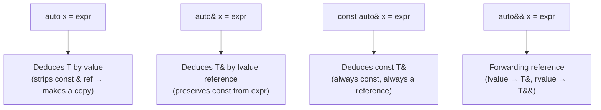

# auto & Type Deduction

> `auto` lets the compiler deduce types for you, reducing verbosity and keeping code in sync with the actual types returned by expressions — but used carelessly, it can hide intent and introduce subtle bugs.

## Table of Contents
- [Core Concepts](#core-concepts)
- [Code Examples](#code-examples)
- [Common Pitfalls](#common-pitfalls)
- [Key Takeaways](#key-takeaways)
- [Exercises](#exercises)

## Core Concepts

### What `auto` Actually Does

#### What

`auto` (C++11) tells the compiler: "deduce the type of this variable from its initializer." It is not dynamic typing — the type is still fully resolved at compile time, exactly as if you'd written it out by hand. `auto x = 42;` is `int`. `auto s = std::string{"hello"};` is `std::string`. The compiled binary is identical either way.

#### How

The deduction rules for `auto` follow the same rules as template argument deduction. When you write `auto x = expr;`, the compiler treats it as if you'd written a function template:

```cpp
template <typename T>
void deduce(T x);   // auto x = expr;  → T is deduced from expr
```

This means `auto` strips top-level `const` and references, just like template deduction does. If `expr` is `const int&`, plain `auto` deduces `int` — not `const int&`. This is the single most important rule to internalize.

#### Why It Matters

Before `auto`, you had to spell out the exact type of every variable. This was tolerable with `int` and `double`, but became painful with types like `std::map<std::string, std::vector<int>>::const_iterator`. `auto` eliminates redundant type annotations where the type is obvious from context. It also future-proofs code: if you change a function's return type, callers using `auto` pick up the change automatically without a cascade of manual edits.

### When to Use `auto` and When Not To

#### What

The question isn't whether `auto` is good or bad — it's about **readability**. The guiding principle: use `auto` when the type is obvious from the right-hand side. Spell out the type when it isn't.

#### How

Use `auto` when:
- The type is obvious from the initializer: `auto count = static_cast<int>(vec.size());`
- The type is long and adds no information: `auto it = map.find(key);`
- You're capturing a lambda: `auto fn = [](int x) { return x * 2; };` (lambdas have unnamed types — you *must* use `auto` or `std::function`)
- Structured bindings: `auto [key, value] = *it;`

Spell out the type when:
- The right-hand side doesn't reveal the type: `auto result = compute();` — what type is `result`? Nobody knows without reading `compute()`'s signature.
- Numeric types where precision matters: `auto x = 3.14;` is `double`, but `auto x = 3.14f;` is `float`. If the distinction matters, be explicit.
- You want a specific type different from the deduced one: `std::size_t len = vec.size();` rather than `auto len = vec.size();` (which deduces `std::vector<T>::size_type`).

#### Why It Matters

`auto` is a readability tool, not a laziness tool. The "Almost Always Auto" (AAA) style advocated by Herb Sutter works well in codebases where developers consistently use expressive initializers. But in codebases with opaque function names, blind `auto` usage forces readers to chase down return types — the opposite of helpful. Be pragmatic: use `auto` when it makes code *clearer*, not just shorter.

### `auto` with `const` and References

#### What

Plain `auto` strips both top-level `const` and references. To preserve them, you must be explicit:

| Declaration | Deduction if `expr` is `const int&` |
|---|---|
| `auto x = expr;` | `int` (copy — const and ref stripped) |
| `const auto x = expr;` | `const int` (copy — ref stripped, const added back) |
| `auto& x = expr;` | `const int&` (reference — const preserved from expr) |
| `const auto& x = expr;` | `const int&` (reference — const guaranteed) |
| `auto&& x = expr;` | Depends — forwarding reference rules |

#### How

The key insight is that `auto` alone **always makes a copy**. If you want a reference, you must say `auto&`. If you want const, you must say `const auto` or `const auto&`.

This is identical to how template deduction works: when the function parameter is `T x` (by value), the template strips references and top-level const. When the parameter is `T& x`, it deduces a reference. This isn't a quirk — it's a consistent, principled design.



#### Why It Matters

Getting this wrong is one of the most common sources of performance bugs in modern C++. If you iterate over a `std::map` with `auto pair : map` instead of `const auto& [key, value] : map`, you're copying every `std::pair<const Key, Value>` on each iteration. For a map of strings, that's heap allocations on every loop iteration — silently, with no compiler warning.

### `const auto&` — The Default for Read-Only Access

#### What

`const auto&` is the workhorse of modern C++. It binds to anything — lvalues, rvalues, temporaries — without making a copy. It guarantees you won't modify the value. It should be your default when you only need to read a value.

#### How

```cpp
const auto& name = get_name();     // binds to whatever get_name() returns
const auto& elem = vec[0];         // no copy, no mutation
for (const auto& item : container) // iterate without copying
```

The reason this works even with temporaries is that C++ has a special rule: a const reference extends the lifetime of a temporary bound to it. So `const auto& x = std::string{"hello"};` is valid — the temporary lives as long as `x` does.

#### Why It Matters

This is the safe default because it prevents both unnecessary copies (performance) and accidental mutation (correctness). When reviewing code, I look for `auto` in range-based `for` loops as a red flag — it usually means the author is making unnecessary copies of every element.

### `auto&&` — Forwarding References

#### What

`auto&&` is a **forwarding reference** (also called universal reference). It binds to both lvalues and rvalues, preserving the value category of the expression. It is *not* an rvalue reference — the `&&` with `auto` (or a template parameter) has a special deduction rule.

#### How

When the initializer is an lvalue, `auto&&` deduces an lvalue reference (`T&`). When the initializer is an rvalue, it deduces an rvalue reference (`T&&`). This is called **reference collapsing**:

- lvalue + `&&` → `T&` (the `&&` collapses away)
- rvalue + `&&` → `T&&`

```cpp
int x = 42;
auto&& a = x;      // x is an lvalue → a is int& (lvalue reference)
auto&& b = 42;     // 42 is an rvalue → b is int&& (rvalue reference)
auto&& c = get();   // depends on whether get() returns by value or reference
```

#### Why It Matters

`auto&&` is the most flexible binding — it accepts anything without copies. You'll see it in range-based `for` loops (`for (auto&& elem : range)`) in generic library code where the code must work with any value category. For everyday application code, `const auto&` is almost always the better choice — `auto&&` is primarily for template-heavy, generic code and perfect forwarding scenarios.

### Structured Bindings

#### What

Structured bindings (C++17) let you decompose an aggregate — a `std::pair`, `std::tuple`, a struct, or a C-style array — into named variables in a single declaration. Instead of `pair.first` and `pair.second`, you write `auto [key, value] = pair;`.

#### How

The syntax is `auto [name1, name2, ...] = expression;`. The number of names must exactly match the number of elements in the aggregate. You can combine structured bindings with `const`, `&`, and `&&`:

```cpp
auto [a, b] = pair;              // copies
auto& [a, b] = pair;             // references to the pair's members
const auto& [a, b] = pair;      // const references
```

Structured bindings work with:
1. **`std::pair` and `std::tuple`** — by `get<>()` protocol
2. **Structs/classes with all public members** — by member order
3. **C-style arrays** — by element index

#### Why It Matters

Before C++17, extracting values from a pair or tuple was verbose and error-prone:

```cpp
// Pre-C++17: verbose, easy to mix up first/second
auto result = map.insert({key, value});
auto it = result.first;
bool inserted = result.second;

// C++17: clear, self-documenting
auto [it, inserted] = map.insert({key, value});
```

Structured bindings make the code self-documenting because the variable names (`it`, `inserted`) describe what each field means — unlike `.first` and `.second`, which tell you nothing about semantics. They're especially powerful in range-based `for` loops over maps, where `const auto& [key, value]` is drastically more readable than `const auto& pair` followed by `pair.first` and `pair.second`.

### How `auto` Deduction Differs from `decltype`

#### What

`auto` and `decltype` are both type deduction mechanisms, but they answer different questions:

- `auto` asks: "What type should this variable be, given its initializer?" (follows template deduction rules)
- `decltype` asks: "What is the exact declared type of this expression?" (preserves references, const, everything)

#### How

```cpp
const int& ref = x;
auto a = ref;            // int       — auto strips const and &
decltype(ref) b = x;     // const int& — decltype preserves everything
```

`decltype(auto)` (C++14) combines both: it deduces the type using `decltype` rules from the initializer. This is useful when you want exact type preservation — commonly seen in return type deduction for wrapper functions that must preserve the value category of the wrapped call.

#### Why It Matters

In everyday code, `auto` is what you want 99% of the time. `decltype` and `decltype(auto)` matter when you're writing generic library code — forwarding wrappers, decorators, or proxy objects — where preserving the exact type (including references) is critical for correctness. Knowing the distinction helps you understand why `auto` sometimes "loses" const or reference qualifiers, and how to get them back when needed.

## Code Examples

### `auto` Basics — When It Helps and When It Hides

```cpp
#include <iostream>
#include <map>
#include <string>
#include <vector>

std::map<std::string, std::vector<int>> build_index() {
    return {
        {"alpha", {1, 2, 3}},
        {"beta",  {4, 5}},
        {"gamma", {6}},
    };
}

int main() {
    // GOOD: auto shines when the type is obvious or painfully long
    auto index = build_index();  // type is clear from the function name
    auto count = 0;              // int — obvious
    auto pi = 3.14159;           // double — obvious from the literal

    // GOOD: iterators are the classic auto use case.
    // Without auto: std::map<std::string, std::vector<int>>::iterator
    auto it = index.find("alpha");
    if (it != index.end()) {
        std::cout << it->first << " has " << it->second.size() << " entries\n";
    }

    // GOOD: lambdas have unnamed types — auto is the only practical choice
    auto square = [](int x) { return x * x; };
    std::cout << "5 squared: " << square(5) << '\n';

    // BAD style (avoid): auto hides the return type
    // auto result = process(data);  // What type is result? No idea.

    // GOOD style: spell out the type when the right-hand side is opaque
    // double result = process(data);  // Now I know what I'm working with.

    // auto with numeric literals — know what you get
    auto a = 42;       // int
    auto b = 42u;      // unsigned int
    auto c = 42L;      // long
    auto d = 42.0;     // double
    auto e = 42.0f;    // float

    std::cout << "Types deduced successfully.\n";
    return 0;
}
```

### `auto` with `const` and References

```cpp
#include <iostream>
#include <string>
#include <vector>

int main() {
    std::vector<std::string> names = {"Alice", "Bob", "Charlie"};

    // Plain auto: COPIES every string — expensive, usually unintended
    for (auto name : names) {
        // 'name' is a std::string copy. Modifying it does NOT affect 'names'.
        name += " (modified)";
    }
    // names[0] is still "Alice" — the copies were thrown away
    std::cout << "After plain auto loop: " << names[0] << '\n';

    // const auto&: reads without copying — the correct default
    for (const auto& name : names) {
        std::cout << name << '\n';
        // name += " (error)";  // Compile error: name is const
    }

    // auto&: reference that allows mutation
    for (auto& name : names) {
        name += "!";  // modifies the actual vector elements
    }
    std::cout << "After auto& loop: " << names[0] << '\n';  // "Alice!"

    // const auto: a const copy — rarely useful, but valid
    const auto copy = names[0];  // const std::string — can't modify, owns its data
    std::cout << "Const copy: " << copy << '\n';

    // Demonstrating that auto strips const from the source type
    const std::string& greeting = names[0];
    auto g = greeting;      // g is std::string (not const std::string&!)
    g = "Overwritten";      // Fine — g is an independent copy
    std::cout << "Original unchanged: " << names[0] << '\n';  // Still "Alice!"

    return 0;
}
```

### Structured Bindings in Practice

```cpp
#include <iostream>
#include <map>
#include <string>
#include <tuple>

// A function returning a tuple — structured bindings make the call site readable
std::tuple<bool, std::string, int> validate_user(const std::string& username) {
    if (username.empty()) {
        return {false, "Username cannot be empty", 0};
    }
    if (username.size() < 3) {
        return {false, "Username too short", 0};
    }
    // Simulate looking up a user ID
    return {true, "OK", 42};
}

// A simple struct — structured bindings work with public members
struct Point {
    double x;
    double y;
};

Point midpoint(const Point& a, const Point& b) {
    return {(a.x + b.x) / 2.0, (a.y + b.y) / 2.0};
}

int main() {
    // ---- Structured bindings with std::tuple ----
    // The names describe each field — far clearer than std::get<0>(), std::get<1>()
    auto [valid, message, user_id] = validate_user("Al");
    if (!valid) {
        std::cout << "Validation failed: " << message << '\n';
    }

    auto [ok, msg, id] = validate_user("Alice");
    if (ok) {
        std::cout << "User ID: " << id << " (" << msg << ")\n";
    }

    // ---- Structured bindings with std::map ----
    std::map<std::string, int> scores = {
        {"Alice", 95},
        {"Bob", 87},
        {"Charlie", 92},
    };

    // Iterating a map: const auto& [key, value] is the idiomatic C++17 style
    std::cout << "\nScores:\n";
    for (const auto& [name, score] : scores) {
        std::cout << "  " << name << ": " << score << '\n';
    }

    // Insert returns pair<iterator, bool> — structured bindings decompose it
    if (auto [it, inserted] = scores.insert({"Alice", 100}); !inserted) {
        std::cout << "\n'" << it->first << "' already exists with score "
                  << it->second << " (insert rejected)\n";
    }

    if (auto [it, inserted] = scores.emplace("Diana", 88); inserted) {
        std::cout << "Added '" << it->first << "' with score "
                  << it->second << '\n';
    }

    // ---- Structured bindings with structs ----
    const Point a{1.0, 2.0};
    const Point b{5.0, 6.0};
    const auto [mx, my] = midpoint(a, b);
    std::cout << "\nMidpoint: (" << mx << ", " << my << ")\n";

    // ---- Structured bindings with C-style arrays ----
    int coords[] = {10, 20, 30};
    auto [x, y, z] = coords;  // copies the elements
    std::cout << "Coords: " << x << ", " << y << ", " << z << '\n';

    return 0;
}
```

### `auto` in Return Types and Generic Lambdas

```cpp
#include <algorithm>
#include <iostream>
#include <string>
#include <vector>

// C++14: auto return type deduction — the compiler deduces from the return statement.
// Use this when the return type is obvious from the function body.
auto make_greeting(const std::string& name) {
    return "Hello, " + name + "!";  // deduces std::string
}

// Trailing return type (C++11) — useful when the return type depends on parameters
template <typename T, typename U>
auto add(T a, U b) -> decltype(a + b) {
    return a + b;
}

int main() {
    std::cout << make_greeting("World") << '\n';
    std::cout << "int + double: " << add(3, 4.5) << '\n';  // deduces double

    // Generic lambda (C++14): auto parameters make the lambda a template
    auto print_twice = [](const auto& value) {
        std::cout << value << " " << value << '\n';
    };
    print_twice(42);           // instantiated with int
    print_twice("hello");      // instantiated with const char*

    // Generic lambda for sorting — a realistic use case
    std::vector<std::string> words = {"banana", "apple", "cherry", "date"};

    // Sort by length, then alphabetically for ties
    std::sort(words.begin(), words.end(),
        [](const auto& a, const auto& b) {
            if (a.size() != b.size()) return a.size() < b.size();
            return a < b;
        });

    std::cout << "Sorted by length: ";
    for (const auto& w : words) {
        std::cout << w << ' ';
    }
    std::cout << '\n';

    return 0;
}
```

## Common Pitfalls

### Accidentally copying in range-based `for` loops

```cpp
// BAD — copies every string on each iteration (heap allocation per element)
#include <iostream>
#include <string>
#include <vector>

int main() {
    const std::vector<std::string> names = {"Alice", "Bob", "Charlie"};

    for (auto name : names) {  // 'name' is std::string — a full copy each time!
        std::cout << name << '\n';
    }
    return 0;
}

// GOOD — use const auto& for read-only iteration (zero copies)
#include <iostream>
#include <string>
#include <vector>

int main() {
    const std::vector<std::string> names = {"Alice", "Bob", "Charlie"};

    for (const auto& name : names) {  // const reference — no copies, no mutation
        std::cout << name << '\n';
    }
    return 0;
}
```

This is the single most common `auto` mistake. Plain `auto` in a range-based `for` loop copies every element. For `int` or `double`, this is trivial. For `std::string`, `std::vector`, or any type that manages heap memory, it's a silent performance disaster. The compiler won't warn you — the code is perfectly valid, just slow.

### `auto` deducing a proxy type instead of the real type

```cpp
// BAD — auto captures a proxy object, not a bool
#include <iostream>
#include <vector>

int main() {
    std::vector<bool> flags = {true, false, true};

    // std::vector<bool> is a special case — operator[] returns a proxy object,
    // not a bool&. auto deduces the proxy type, which holds a dangling reference
    // after the vector is modified or destroyed.
    auto flag = flags[0];  // type is std::vector<bool>::reference, NOT bool!

    flags.push_back(false);  // may reallocate — 'flag' now dangles

    // Using 'flag' here is undefined behavior
    // std::cout << flag << '\n';  // UB!

    return 0;
}

// GOOD — explicitly request the type you want
#include <iostream>
#include <vector>

int main() {
    std::vector<bool> flags = {true, false, true};

    // Option 1: spell out the type to force conversion from proxy to bool
    bool flag = flags[0];  // copies the value — safe

    // Option 2: use static_cast to make the conversion explicit
    auto flag2 = static_cast<bool>(flags[0]);

    flags.push_back(false);  // reallocation doesn't affect flag or flag2
    std::cout << std::boolalpha << flag << ' ' << flag2 << '\n';

    return 0;
}
```

`std::vector<bool>` is the most notorious proxy type in C++, but it's not the only one. Expression templates (used in Eigen, Blaze, and other linear algebra libraries) also return proxy objects. When `auto` captures a proxy instead of the value, you get a type that may dangle or behave unexpectedly. The rule of thumb: if a type has "expression" or "reference" in its name, think twice before using `auto`.

### Forgetting that `auto` strips `const` and `&`

```cpp
// BAD — auto strips const, allowing unintended modification
#include <iostream>
#include <string>

const std::string& get_name() {
    static const std::string name = "Immutable";
    return name;
}

int main() {
    auto name = get_name();  // Deduces std::string (not const std::string&!)
    name = "Modified";       // Compiles fine — name is an independent copy
    std::cout << get_name() << '\n';  // Still "Immutable" — confusing

    // The caller likely intended to get a reference to avoid copying.
    // Instead, they got a silent copy.
    return 0;
}

// GOOD — be explicit about reference and const intent
#include <iostream>
#include <string>

const std::string& get_name() {
    static const std::string name = "Immutable";
    return name;
}

int main() {
    const auto& name = get_name();  // const std::string& — no copy, no mutation
    // name = "Error";  // Compile error: name is const
    std::cout << name << '\n';
    return 0;
}
```

This pitfall is especially dangerous because the code compiles and runs without error. The bug is subtle: the developer expected a cheap reference but got an expensive copy. If `get_name()` returned a large object (a vector, a map), the performance impact could be severe — and completely invisible in a code review unless you know to look for it.

### Structured binding count mismatch

```cpp
// BAD — wrong number of bindings for the structure
#include <tuple>
#include <utility>

int main() {
    std::pair<int, double> p = {1, 3.14};
    // auto [a, b, c] = p;  // Compile error: too many bindings for std::pair

    std::tuple<int, double, std::string> t = {1, 3.14, "hello"};
    // auto [x, y] = t;  // Compile error: too few bindings for 3-element tuple

    return 0;
}

// GOOD — match the exact number of elements
#include <iostream>
#include <string>
#include <tuple>
#include <utility>

int main() {
    std::pair<int, double> p = {1, 3.14};
    auto [a, b] = p;  // Exactly 2 bindings for a pair
    std::cout << a << ", " << b << '\n';

    std::tuple<int, double, std::string> t = {1, 3.14, "hello"};
    auto [x, y, z] = t;  // Exactly 3 bindings for a 3-element tuple
    std::cout << x << ", " << y << ", " << z << '\n';

    return 0;
}
```

The compiler enforces an exact match between the number of names and the number of elements. This is intentional — it prevents accidentally ignoring fields, which would be a silent source of bugs. If you genuinely don't need a field, you still must name it (C++ has no `_` wildcard like Python or Rust). A common convention is to use a name like `unused` or prefix with an underscore.

## Key Takeaways

- **`auto` is compile-time type deduction**, not dynamic typing. The binary is identical whether you write the type or let the compiler deduce it. Use `auto` to reduce noise, not to avoid thinking about types.
- **`const auto&` should be your default** for read-only access in range-based `for` loops and function return values. Plain `auto` makes copies — often silently and expensively.
- **`auto` strips top-level `const` and references.** This follows template deduction rules and is the #1 source of `auto`-related bugs. Always pair `auto` with `&` or `const` when you need them.
- **Structured bindings (C++17) replace `.first`/`.second`** and `std::get<N>()` with self-documenting variable names. Use them with pairs, tuples, maps, and simple structs.
- **Use `auto` when the type is obvious; spell it out when it isn't.** The goal is readability for the *reader*, not convenience for the *writer*.

## Exercises

1. What type does `auto` deduce in each of the following cases? Explain why.
   ```cpp
   const int& ref = some_int;
   auto a = ref;
   auto& b = ref;
   const auto& c = ref;
   auto&& d = ref;
   auto&& e = 42;
   ```

2. Write a function that takes a `std::map<std::string, std::vector<int>>` and uses structured bindings in a range-based `for` loop to print each key followed by the sum of its values. Use `const auto&` appropriately.

3. Explain why `auto flag = vec_of_bools[0];` (where `vec_of_bools` is a `std::vector<bool>`) can lead to undefined behavior. What is the correct way to capture the value?

4. A colleague writes the following loop. Identify the performance problem and fix it.
   ```cpp
   std::vector<std::string> data = get_large_dataset();
   for (auto item : data) {
       process(item);
   }
   ```

5. Write a function that returns a `std::tuple<bool, std::string, int>` representing a validation result (success, message, error code). At the call site, use structured bindings to decompose the result, and use an `if`-with-initializer (C++17) to combine the decomposition with a conditional check.
