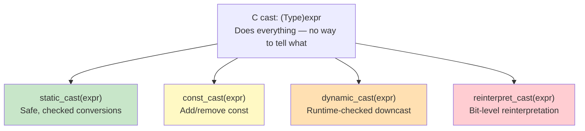
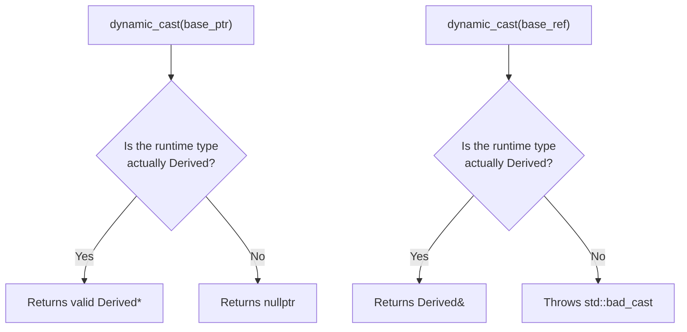

# Type Casting

> C++ replaces C's single all-purpose cast with four named casts — `static_cast`, `const_cast`, `dynamic_cast`, and `reinterpret_cast` — each expressing a different *intent*, so both the compiler and the reader know exactly what kind of conversion you're performing and how dangerous it is.

## Table of Contents
- [Core Concepts](#core-concepts)
- [Code Examples](#code-examples)
- [Common Pitfalls](#common-pitfalls)
- [Key Takeaways](#key-takeaways)
- [Exercises](#exercises)

## Core Concepts

### Why C++ Has Four Casts Instead of One

#### What

In C, there is one cast syntax: `(int)x` or `(double*)ptr`. It can perform any conversion — numeric, pointer, const-removal, bit-reinterpretation — and the code doesn't tell you which. This is a problem because different conversions have wildly different safety profiles. Converting `int` to `double` is safe. Casting away `const` is dangerous. Reinterpreting a `float*` as an `int*` is almost always undefined behavior.

#### How

C++ split the single C cast into four named casts, each handling one category of conversion:



#### Why It Matters

Each cast is a signal to both the compiler and the code reviewer:

- `static_cast` says: "This conversion is well-defined and the compiler can verify it makes sense."
- `const_cast` says: "I'm deliberately breaking the const contract — this needs justification."
- `dynamic_cast` says: "I don't know the actual runtime type and need a safety check."
- `reinterpret_cast` says: "I'm doing something low-level and dangerous — tread carefully."

When you see `reinterpret_cast` in a code review, it's an instant red flag. When you see `static_cast`, you know the conversion is routine. C's `(int*)ptr` gives you no such signal — you have to mentally figure out which kind of cast it is. The named casts make the programmer's intent grep-able, reviewable, and auditable.

### `static_cast` — The Workhorse

#### What

`static_cast` performs conversions that the compiler can verify at compile time. It handles the vast majority of casts you'll ever need:

- Numeric conversions: `int` to `double`, `double` to `int`, `int` to `enum`
- Enum conversions: `enum class` to/from its underlying type
- Upcasts: derived pointer/reference to base (implicit, but `static_cast` makes it explicit)
- Downcasts: base pointer/reference to derived (compile-time only — no runtime check)
- `void*` to typed pointer: recovering the original type from a `void*`

#### How

The syntax is `static_cast<TargetType>(expression)`. The compiler checks at compile time that the conversion is plausible — you can't `static_cast` unrelated types (e.g., `std::string` to `int`). The conversion is performed at compile time or via a simple runtime instruction (e.g., integer truncation or floating-point rounding).

For downcasts (base to derived), `static_cast` trusts you. It does **no runtime check**. If the object isn't actually the derived type, you get undefined behavior. This is the key difference from `dynamic_cast` — `static_cast` is faster but unsafe for incorrect downcasts.

#### Why It Matters

`static_cast` should be your default cast. It handles 90%+ of casting needs, it's safe for numeric conversions, and it communicates "this is a routine, well-understood conversion." The compiler rejects nonsensical conversions, so it provides a baseline level of safety that C casts don't.

The most common use case in everyday code is avoiding integer/floating-point division bugs: `static_cast<double>(total) / count` forces floating-point division. In C, you'd write `(double)total / count` — same result, but `static_cast` is self-documenting and grep-able.

### `const_cast` — Removing `const`

#### What

`const_cast` adds or removes `const` (or `volatile`) from a type. It is the only cast that can change const-qualification. The other three casts cannot remove `const` — this restriction is deliberate, because modifying a `const` object is undefined behavior.

#### How

```cpp
const std::string& name = get_name();
auto& mutable_name = const_cast<std::string&>(name);  // removes const
```

`const_cast` only changes the const-ness of the *reference* or *pointer* — it doesn't change the underlying object. If the underlying object was declared `const`, modifying it through a `const_cast`-ed reference is **undefined behavior**. The cast is only safe when the original object is non-const but you have a `const` reference to it.

#### Why It Matters

`const_cast` is almost always a code smell. There are only two legitimate use cases:

1. **Interfacing with legacy C APIs** that take non-const pointers but don't actually modify the data. You have a `const char*`, the API takes `char*`, and you know it won't modify the string.

2. **Implementing overloaded `const`/non-`const` member functions** that share logic. The non-const version calls the const version and casts away `const` on the result (known as the "Scott Meyers const_cast trick"):

```cpp
const T& operator[](std::size_t i) const {
    // ... complex logic ...
    return data[i];
}

T& operator[](std::size_t i) {
    // Reuse the const version to avoid code duplication
    return const_cast<T&>(
        static_cast<const MyClass&>(*this)[i]
    );
}
```

If you're reaching for `const_cast` outside these patterns, you likely have a design problem. Fix the design, not the const-ness.

### `dynamic_cast` — Runtime-Checked Downcast

#### What

`dynamic_cast` performs a downcast (base to derived) with a **runtime safety check** using RTTI (Run-Time Type Information). If the object is actually the target type, the cast succeeds. If not:

- For pointers: returns `nullptr`
- For references: throws `std::bad_cast`

`dynamic_cast` only works on types with at least one `virtual` function (i.e., polymorphic types). The compiler uses the vtable to determine the actual runtime type.

#### How

```cpp
Base* base_ptr = get_object();

// Pointer cast: returns nullptr on failure
if (auto* derived = dynamic_cast<Derived*>(base_ptr)) {
    derived->derived_method();
}

// Reference cast: throws std::bad_cast on failure
try {
    auto& derived = dynamic_cast<Derived&>(*base_ptr);
    derived.derived_method();
} catch (const std::bad_cast& e) {
    // handle failure
}
```



#### Why It Matters

`dynamic_cast` is the safe way to do downcasts, but it has two significant costs:

1. **Runtime overhead**: It examines the vtable to determine the actual type, which involves pointer indirection and string comparison of type names in some implementations.
2. **Design smell**: Needing to downcast usually means your base class interface is incomplete. If you frequently need to check "is this a `Circle` or a `Rectangle`?", you probably should add a virtual method to `Shape` instead.

The legitimate use cases for `dynamic_cast` are narrow: plugin architectures where you receive an opaque base pointer and need to test for specific capabilities, visitor-pattern alternatives, and similar patterns where the set of derived types is open-ended and not controlled by you.

Some codebases disable RTTI entirely (`-fno-rtti`) for binary size or performance reasons, which makes `dynamic_cast` unavailable. Google's C++ style guide, for example, discourages RTTI.

### `reinterpret_cast` — Bit-Level Reinterpretation

#### What

`reinterpret_cast` performs the most dangerous conversion: it tells the compiler to treat the bit pattern of one type as another type, with no conversion logic and no safety checks. It is the C++ equivalent of "trust me, I know what I'm doing."

#### How

Common uses:

- Converting between pointer types: `reinterpret_cast<char*>(&my_struct)` to examine raw bytes
- Converting between pointer and integer: `reinterpret_cast<std::uintptr_t>(ptr)` to store a pointer in an integer (platform-specific)
- Implementing type-punning through pointer casts (often technically UB — `std::memcpy` or `std::bit_cast` in C++20 is usually the correct alternative)

`reinterpret_cast` does not change the bit pattern — it just changes how the compiler interprets those bits. It cannot remove `const` (use `const_cast` for that) and it cannot convert between unrelated types in a meaningful way.

#### Why It Matters

`reinterpret_cast` exists for systems programming — the kind of code that interfaces with hardware, serialization formats, network protocols, and OS APIs where you genuinely need to interpret a block of memory as a specific type. In application-level code, you should almost never need it.

The critical danger: `reinterpret_cast` can easily produce **undefined behavior**. The C++ standard has strict rules about type aliasing — reading a `float` through an `int*` is UB, even if the sizes match. The safe alternative for type-punning is `std::memcpy` (which compilers optimize to a single register move):

```cpp
// BAD: type-punning via reinterpret_cast — undefined behavior
float f = 3.14f;
int bits = *reinterpret_cast<int*>(&f);  // UB: violates strict aliasing

// GOOD: type-punning via memcpy — well-defined, same performance
float f = 3.14f;
int bits;
std::memcpy(&bits, &f, sizeof(bits));    // well-defined, optimized to no-op
```

### C-Style Casts: Why They're Dangerous

#### What

C-style casts — `(int)x` or `(Derived*)base_ptr` — still compile in C++. They try each C++ cast in order until one succeeds: first `const_cast`, then `static_cast`, then `static_cast` + `const_cast`, then `reinterpret_cast`, then `reinterpret_cast` + `const_cast`. The compiler picks the first combination that works.

#### How

This means a C-style cast can silently do things you didn't intend. `(int*)some_const_float_ptr` might remove `const` *and* reinterpret the pointer type — two dangerous operations in a single cast that looks innocuous.

#### Why It Matters

C-style casts are banned in most modern C++ style guides (Google, LLVM, Mozilla). They are:

- **Not grep-able**: You can't search for all casts in a codebase because `(Type)` is visually indistinguishable from other parenthesized expressions.
- **Not intention-revealing**: You don't know whether the cast is a safe numeric conversion or a dangerous reinterpretation.
- **Too powerful**: They can do anything — remove `const`, reinterpret bits, downcast — and the code doesn't tell you which.

Always use the named C++ casts. If the named cast won't compile, that's a feature — it means the conversion is more dangerous than you thought, and you need to use a stronger (more dangerous) cast explicitly.

## Code Examples

### `static_cast` — Everyday Conversions

```cpp
#include <cstdint>
#include <iostream>
#include <string>

enum class Color : std::uint8_t { red = 0, green = 1, blue = 2 };

// Convert enum to string — static_cast converts enum to its underlying type
std::string_view color_name(Color c) {
    switch (c) {
        case Color::red:   return "red";
        case Color::green: return "green";
        case Color::blue:  return "blue";
    }
    return "unknown";
}

int main() {
    // Numeric conversions — the most common use of static_cast
    const int total_score = 347;
    const int num_students = 5;

    // Without cast: integer division truncates → 69
    std::cout << "Integer division:  " << total_score / num_students << '\n';

    // With static_cast: forces floating-point division → 69.4
    const auto average = static_cast<double>(total_score) / num_students;
    std::cout << "Float division:    " << average << '\n';

    // Narrowing conversion — from double to int, truncating intentionally
    const double precise_value = 3.99;
    const auto truncated = static_cast<int>(precise_value);  // 3, not 4
    std::cout << "Truncated:         " << truncated << '\n';

    // Enum class ↔ underlying type
    const auto c = Color::green;
    const auto raw = static_cast<std::uint8_t>(c);  // enum → int
    std::cout << "Color value:       " << static_cast<int>(raw) << '\n';

    const auto reconstructed = static_cast<Color>(2);  // int → enum
    std::cout << "Reconstructed:     " << color_name(reconstructed) << '\n';

    // Signed ↔ unsigned — static_cast documents the intentional conversion
    const int signed_val = -1;
    const auto unsigned_val = static_cast<unsigned int>(signed_val);
    std::cout << "Signed -1 as unsigned: " << unsigned_val << '\n';  // 4294967295

    // void* recovery — common in C API interop
    int data = 42;
    void* opaque = &data;  // implicit conversion to void* is fine
    auto* recovered = static_cast<int*>(opaque);  // explicit cast back to int*
    std::cout << "Recovered from void*: " << *recovered << '\n';

    return 0;
}
```

### `dynamic_cast` — Safe Downcasting in a Class Hierarchy

```cpp
#include <iostream>
#include <memory>
#include <string>
#include <vector>

// A base class with at least one virtual function — required for dynamic_cast
class Sensor {
public:
    virtual ~Sensor() = default;
    virtual std::string read() const = 0;
    virtual std::string type_name() const = 0;
};

class TemperatureSensor : public Sensor {
    double celsius_;
public:
    explicit TemperatureSensor(double c) : celsius_(c) {}

    std::string read() const override {
        return std::to_string(celsius_) + " °C";
    }

    std::string type_name() const override { return "Temperature"; }

    // A method specific to TemperatureSensor — not in the base interface
    double celsius() const { return celsius_; }
    double fahrenheit() const { return celsius_ * 9.0 / 5.0 + 32.0; }
};

class PressureSensor : public Sensor {
    double pascals_;
public:
    explicit PressureSensor(double pa) : pascals_(pa) {}

    std::string read() const override {
        return std::to_string(pascals_) + " Pa";
    }

    std::string type_name() const override { return "Pressure"; }

    // Pressure-specific method
    double atmospheres() const { return pascals_ / 101325.0; }
};

// Process a heterogeneous collection of sensors.
// dynamic_cast lets us safely check for specific sensor types
// when we need type-specific behavior.
void generate_report(const std::vector<std::unique_ptr<Sensor>>& sensors) {
    for (const auto& sensor : sensors) {
        std::cout << sensor->type_name() << ": " << sensor->read() << '\n';

        // dynamic_cast with pointer: returns nullptr if the cast fails
        if (auto* temp = dynamic_cast<const TemperatureSensor*>(sensor.get())) {
            // Only executes if sensor is actually a TemperatureSensor
            std::cout << "  (Also: " << temp->fahrenheit() << " °F)\n";
        }

        if (auto* pressure = dynamic_cast<const PressureSensor*>(sensor.get())) {
            std::cout << "  (Also: " << pressure->atmospheres() << " atm)\n";
        }
    }
}

int main() {
    std::vector<std::unique_ptr<Sensor>> sensors;
    sensors.push_back(std::make_unique<TemperatureSensor>(23.5));
    sensors.push_back(std::make_unique<PressureSensor>(101325.0));
    sensors.push_back(std::make_unique<TemperatureSensor>(100.0));

    generate_report(sensors);
    return 0;
}
```

### `const_cast` — The Rare Legitimate Uses

```cpp
#include <cstring>
#include <iostream>
#include <string>

// ---- Use Case 1: Interfacing with a C API that doesn't use const ----

// Simulated legacy C function that reads data but forgot to const-qualify
// its parameter. This is common in older C libraries.
extern "C" {
    // This function only reads the string — it does NOT modify it.
    // But the author didn't use const (common in old C code).
    void legacy_log(char* message) {
        // In reality, this would write to a log file
        std::cout << "[LOG] " << message << '\n';
    }
}

// ---- Use Case 2: Avoiding code duplication in const/non-const overloads ----

class TextBuffer {
    std::string data_;
public:
    explicit TextBuffer(std::string data) : data_(std::move(data)) {}

    // The const version contains the actual logic
    const char& char_at(std::size_t index) const {
        if (index >= data_.size()) {
            throw std::out_of_range("Index out of bounds");
        }
        return data_[index];
    }

    // The non-const version delegates to the const version via const_cast.
    // This avoids duplicating the bounds-checking logic.
    // Safe because: if *this is non-const (which it must be, since this
    // is the non-const overload), then the returned reference is to
    // non-const data — casting away const recovers the original constness.
    char& char_at(std::size_t index) {
        return const_cast<char&>(
            static_cast<const TextBuffer&>(*this).char_at(index)
        );
    }
};

int main() {
    // Use Case 1: calling a C API with a const string
    const std::string message = "System initialized";
    // We know legacy_log() doesn't modify the string, so const_cast is safe
    legacy_log(const_cast<char*>(message.c_str()));

    // Use Case 2: const/non-const overload delegation
    TextBuffer buf("Hello, World!");
    std::cout << "char_at(0): " << buf.char_at(0) << '\n';

    // Non-const access — allows modification
    buf.char_at(0) = 'h';
    std::cout << "After modification: " << buf.char_at(0) << '\n';

    // Const access — read-only
    const auto& const_buf = buf;
    std::cout << "Const access: " << const_buf.char_at(0) << '\n';

    return 0;
}
```

### `reinterpret_cast` — Low-Level Systems Programming

```cpp
#include <cstdint>
#include <cstring>
#include <iostream>
#include <array>

// Scenario: reading a binary network packet header.
// This is the kind of code you'd write in firmware, network stacks,
// or file format parsers.

// A packed struct representing a simplified network packet header.
// In real code, you'd use #pragma pack or __attribute__((packed))
// to prevent padding.
struct PacketHeader {
    std::uint8_t  version;
    std::uint8_t  type;
    std::uint16_t length;
    std::uint32_t sequence;
};

// Parse raw bytes into a PacketHeader.
// The SAFE way: use std::memcpy, not reinterpret_cast.
PacketHeader parse_header(const std::uint8_t* raw_bytes) {
    PacketHeader header;
    // std::memcpy is the blessed way to do type-punning in C++.
    // The compiler optimizes this to a simple register load — zero overhead.
    std::memcpy(&header, raw_bytes, sizeof(PacketHeader));
    return header;
}

int main() {
    // Simulate receiving raw bytes from a network socket
    const std::array<std::uint8_t, 8> raw = {
        0x01,       // version = 1
        0x02,       // type = 2
        0x00, 0x40, // length = 64 (assuming little-endian)
        0x00, 0x00, 0x00, 0x0A  // sequence = 10
    };

    const auto header = parse_header(raw.data());
    std::cout << "Version:  " << static_cast<int>(header.version) << '\n';
    std::cout << "Type:     " << static_cast<int>(header.type) << '\n';
    std::cout << "Length:   " << header.length << '\n';
    std::cout << "Sequence: " << header.sequence << '\n';

    // ---- When reinterpret_cast IS appropriate: pointer-to-integer ----
    // Storing a pointer value as an integer (e.g., for logging or hashing).
    // This is platform-specific but well-defined by the standard.
    int data = 42;
    const auto address = reinterpret_cast<std::uintptr_t>(&data);
    std::cout << "Address of data: 0x" << std::hex << address << std::dec << '\n';

    // ---- reinterpret_cast for examining raw bytes of an object ----
    // Casting to unsigned char* (or std::byte*) is specifically allowed
    // by the standard — this is NOT a strict aliasing violation.
    float pi = 3.14159f;
    const auto* bytes = reinterpret_cast<const std::uint8_t*>(&pi);
    std::cout << "Bytes of pi: ";
    for (std::size_t i = 0; i < sizeof(float); ++i) {
        std::cout << std::hex << static_cast<int>(bytes[i]) << ' ';
    }
    std::cout << std::dec << '\n';

    return 0;
}
```

### Comparing All Four Casts — Side by Side

```cpp
#include <iostream>
#include <memory>
#include <string>

class Animal {
public:
    virtual ~Animal() = default;
    virtual std::string speak() const = 0;
};

class Dog : public Animal {
public:
    std::string speak() const override { return "Woof!"; }
    void fetch() const { std::cout << "Fetching...\n"; }
};

class Cat : public Animal {
public:
    std::string speak() const override { return "Meow!"; }
};

int main() {
    // ---- static_cast: compile-time checked conversion ----
    // Numeric: safe, routine
    const double score = 95.7;
    const auto rounded = static_cast<int>(score);  // 95
    std::cout << "static_cast<int>(95.7) = " << rounded << '\n';

    // Upcast (derived → base): always safe, implicit works too
    auto dog = std::make_unique<Dog>();
    Animal* animal = dog.get();  // implicit upcast
    std::cout << animal->speak() << '\n';

    // Downcast (base → derived): UNSAFE if wrong type — no runtime check
    auto* dog_ptr = static_cast<Dog*>(animal);  // OK only because animal IS a Dog
    dog_ptr->fetch();

    // ---- dynamic_cast: runtime-checked downcast ----
    // Safe: returns nullptr if the actual type doesn't match
    Animal* mystery = dog.get();
    if (auto* d = dynamic_cast<Dog*>(mystery)) {
        std::cout << "dynamic_cast found Dog: " << d->speak() << '\n';
    }
    if (auto* c = dynamic_cast<Cat*>(mystery)) {
        std::cout << "This won't print — mystery is not a Cat\n";
    } else {
        std::cout << "dynamic_cast<Cat*> returned nullptr — not a Cat\n";
    }

    // ---- const_cast: add/remove const ----
    const std::string greeting = "Hello";
    auto& mutable_ref = const_cast<std::string&>(greeting);
    // mutable_ref = "Danger!";  // Compiles, but UB! greeting was declared const.
    std::cout << "const_cast compiles but modifying a const object is UB\n";

    // ---- reinterpret_cast: bit-level reinterpretation ----
    int value = 42;
    auto* raw = reinterpret_cast<char*>(&value);  // examine raw bytes
    std::cout << "First byte of 42: " << static_cast<int>(raw[0]) << '\n';

    // ---- C-style cast: DON'T DO THIS — shown for comparison ----
    // (Dog*)animal — equivalent to static_cast here, but you can't tell
    // whether it's static_cast, reinterpret_cast, or const_cast from the syntax.
    // auto* bad_style = (Dog*)animal;  // works, but banned in modern C++

    return 0;
}
```

## Common Pitfalls

### Using `static_cast` for downcasts when the type might be wrong

```cpp
// BAD — static_cast downcast with no runtime check
#include <iostream>
#include <memory>

class Base {
public:
    virtual ~Base() = default;
};

class DerivedA : public Base {
public:
    void only_in_a() const { std::cout << "DerivedA method\n"; }
};

class DerivedB : public Base {
public:
    void only_in_b() const { std::cout << "DerivedB method\n"; }
};

int main() {
    auto obj = std::make_unique<DerivedB>();
    Base* base = obj.get();

    // WRONG: base actually points to DerivedB, but we cast to DerivedA.
    // static_cast trusts you and produces a DerivedA* pointing to a DerivedB.
    auto* wrong = static_cast<DerivedA*>(base);
    wrong->only_in_a();  // Undefined behavior! The object is not a DerivedA.

    return 0;
}

// GOOD — use dynamic_cast when the runtime type is uncertain
#include <iostream>
#include <memory>

class Base {
public:
    virtual ~Base() = default;
};

class DerivedA : public Base {
public:
    void only_in_a() const { std::cout << "DerivedA method\n"; }
};

class DerivedB : public Base {
public:
    void only_in_b() const { std::cout << "DerivedB method\n"; }
};

int main() {
    auto obj = std::make_unique<DerivedB>();
    Base* base = obj.get();

    // dynamic_cast returns nullptr because base is not a DerivedA
    if (auto* a = dynamic_cast<DerivedA*>(base)) {
        a->only_in_a();
    } else {
        std::cout << "Not a DerivedA — handled safely.\n";
    }

    // This succeeds because base IS a DerivedB
    if (auto* b = dynamic_cast<DerivedB*>(base)) {
        b->only_in_b();
    }

    return 0;
}
```

`static_cast` for downcasts is only safe when you *know* the runtime type — for example, inside a factory that just created the object. If there's any doubt, use `dynamic_cast`. The runtime cost of `dynamic_cast` is far cheaper than debugging undefined behavior.

### Using `const_cast` to modify a truly `const` object

```cpp
// BAD — modifying an object that was originally declared const is UB
#include <iostream>

int main() {
    const int x = 42;
    auto& mutable_x = const_cast<int&>(x);
    mutable_x = 99;  // UB! x was declared const — the compiler may have
                       // placed it in read-only memory or inlined the value 42.

    // The compiler might still print 42 here because it optimized based on
    // the assumption that x is always 42.
    std::cout << x << '\n';  // Might print 42, 99, or crash — it's UB.

    return 0;
}

// GOOD — const_cast is only safe when the underlying object is non-const
#include <iostream>

void process(const int& ref) {
    // We know the caller passed a non-const int, but this function
    // receives it as const&. const_cast recovers the original mutability.
    auto& mutable_ref = const_cast<int&>(ref);
    mutable_ref += 10;
}

int main() {
    int value = 42;           // NOT const — mutable
    process(value);           // passes non-const int as const& parameter
    std::cout << value << '\n';  // 52 — well-defined because 'value' is non-const

    return 0;
}
```

The rule is simple: `const_cast` can safely remove `const` only if the original object was not declared `const`. If the object is genuinely `const`, the compiler is allowed to store it in read-only memory, inline its value at all use sites, or optimize under the assumption it never changes. Modifying it breaks those assumptions — the result is undefined.

### Using `reinterpret_cast` for type-punning (strict aliasing violation)

```cpp
// BAD — type-punning via reinterpret_cast violates strict aliasing
#include <cstdint>
#include <iostream>

int main() {
    float f = 1.0f;
    // Reading a float through an int pointer is UB — strict aliasing violation.
    // The compiler assumes int* and float* never alias the same memory,
    // and may reorder or optimize away the read.
    auto bits = *reinterpret_cast<std::uint32_t*>(&f);
    std::cout << "Bits: " << std::hex << bits << std::dec << '\n';  // UB!

    return 0;
}

// GOOD — use std::memcpy for type-punning (well-defined, zero overhead)
#include <cstdint>
#include <cstring>
#include <iostream>

int main() {
    float f = 1.0f;
    std::uint32_t bits;
    // std::memcpy is the standard-blessed way to reinterpret bytes.
    // The compiler optimizes this to a single register move — no actual copy.
    std::memcpy(&bits, &f, sizeof(bits));
    std::cout << "Bits: " << std::hex << bits << std::dec << '\n';  // 3f800000

    return 0;
}
```

The strict aliasing rule says: you may not access an object through a pointer to a different type (with specific exceptions for `char*`, `unsigned char*`, and `std::byte*`). `reinterpret_cast` doesn't exempt you from this rule — it just changes the pointer type without telling the compiler about the aliasing. `std::memcpy` is the correct tool for type-punning, and compilers optimize it to be zero-cost.

### Using C-style casts instead of named casts

```cpp
// BAD — C-style cast hides what kind of conversion is happening
#include <iostream>

class Base {
public:
    virtual ~Base() = default;
};

class Derived : public Base {
public:
    void special() const { std::cout << "Derived::special()\n"; }
};

int main() {
    const Base* base = new Derived();

    // This C-style cast silently does TWO things:
    // 1. Removes const (const_cast)
    // 2. Downcasts Base to Derived (static_cast)
    // The reader has no idea both are happening.
    auto* d = (Derived*)base;
    d->special();

    delete base;
    return 0;
}

// GOOD — named casts make each operation visible and reviewable
#include <iostream>
#include <memory>

class Base {
public:
    virtual ~Base() = default;
};

class Derived : public Base {
public:
    void special() const { std::cout << "Derived::special()\n"; }
};

int main() {
    auto base = std::make_unique<const Derived>();
    const Base* base_ptr = base.get();

    // Option 1: if you know the type and don't need to remove const
    const auto* d = dynamic_cast<const Derived*>(base_ptr);
    if (d) {
        d->special();
    }

    // Option 2: if you genuinely need both operations, make each explicit
    // (This is rare and usually a design smell)
    // auto* mutable_base = const_cast<Base*>(base_ptr);
    // auto* mutable_d = dynamic_cast<Derived*>(mutable_base);

    return 0;
}
```

C-style casts are dangerous because they silently compose multiple cast operations. A single `(Derived*)base` can simultaneously remove `const`, reinterpret pointer types, and downcast — three operations, each with different safety profiles, hidden behind four characters. Named casts force you to be explicit about each operation, making bugs visible in code review.

## Key Takeaways

- **Use `static_cast` as your default cast.** It handles numeric conversions, enum conversions, and upcasts safely. For downcasts, it trusts you — use it only when you're certain of the runtime type.
- **Use `dynamic_cast` when the runtime type is uncertain.** It's the safe downcast for polymorphic hierarchies. If it returns `nullptr`, the object isn't the type you expected — handle it gracefully instead of crashing.
- **Treat `const_cast` as a code smell.** The only legitimate uses are C API interop and the const/non-const overload delegation pattern. If you're using it for anything else, your design probably needs fixing.
- **Reserve `reinterpret_cast` for genuine systems programming.** Byte-level inspection, pointer-to-integer conversion, and hardware register access. For type-punning, prefer `std::memcpy` (C++17) or `std::bit_cast` (C++20) instead.
- **Never use C-style casts in C++.** They hide intent, compose multiple operations silently, and are impossible to grep for. Named casts exist precisely to make dangerous operations visible.

## Exercises

1. Explain the difference between `static_cast` and `dynamic_cast` for a downcast (base pointer to derived pointer). When is `static_cast` safe, and when must you use `dynamic_cast`?

2. A colleague writes `(int*)float_ptr` to examine the bits of a float. Explain why this is problematic and show the correct way to achieve type-punning in C++17.

3. Write a function `safe_downcast<Derived>(Base* ptr)` that uses `dynamic_cast` to attempt a downcast, prints a diagnostic message on failure, and returns `nullptr` if the cast fails. Test it with a class hierarchy of your design.

4. Given the following code, explain what happens and why:
   ```cpp
   const int x = 10;
   int& ref = const_cast<int&>(x);
   ref = 20;
   std::cout << x << '\n';
   ```

5. For each of the following conversions, state which C++ cast you would use and why:
   - Converting `int` to `double` for floating-point division
   - Casting a `void*` back to `Widget*` after retrieving it from a C callback
   - Checking at runtime whether a `Shape*` actually points to a `Circle`
   - Calling a legacy C function that takes `char*` when you have a `const char*` and you know the function doesn't modify the string
   - Examining the raw bytes of a `struct` for serialization
