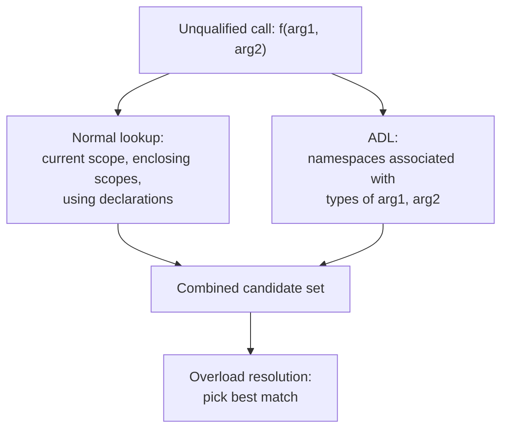

# ADL and Macros

> Argument Dependent Lookup (ADL) is the hidden mechanism that makes `std::cout << x` work without writing `std::operator<<`, while macros are the preprocessor's text-substitution tool — powerful but type-unsafe, and increasingly replaced by `constexpr`, `inline`, and templates in modern C++.

## Table of Contents
- [Core Concepts](#core-concepts)
- [Code Examples](#code-examples)
- [Common Pitfalls](#common-pitfalls)
- [Key Takeaways](#key-takeaways)
- [Exercises](#exercises)

## Core Concepts

### What Is Argument Dependent Lookup (ADL)?

#### What

Argument Dependent Lookup (also called Koenig Lookup, after Andrew Koenig who proposed it) is a set of rules that tells the compiler where to search for a function when it's called with an **unqualified name** (i.e., without a namespace prefix). In addition to the normal lookup scopes (local scope, enclosing namespaces, `using` declarations), the compiler also searches the **namespaces associated with the types of the function's arguments**.

In plain terms: when you write `f(x)`, the compiler looks for `f` not only in the usual places, but also in the namespace where `x`'s type is defined.

#### How

Consider the most common ADL example — one you've been using since day one without realizing it:

```cpp
#include <iostream>
#include <string>

int main() {
    std::string name = "Alice";
    std::cout << name << '\n';  // How does this work?
}
```

The expression `std::cout << name` is syntactically equivalent to `operator<<(std::cout, name)`. The function `operator<<` that handles `std::string` is defined in **namespace `std`** (it's declared in `<string>`). But you didn't write `std::operator<<(std::cout, name)` — you used the unqualified name `operator<<`.

This works because of ADL. The compiler sees the arguments: `std::cout` (type `std::ostream`, defined in `std`) and `name` (type `std::string`, also defined in `std`). ADL adds `std` to the set of namespaces to search. It finds `std::operator<<(std::ostream&, const std::string&)` there — match found.

Without ADL, you'd need to write:

```cpp
std::operator<<(std::operator<<(std::cout, name), '\n');
```

That's what your code actually means — ADL just makes it readable.

#### Why It Matters

ADL is not a convenience feature bolted on after the fact. It's a **design requirement** for operator overloading to work across namespaces. C++ allows you to define types in your own namespaces and overload operators for those types. Without ADL, the caller would need to explicitly qualify every operator call with your namespace — destroying the entire point of operator overloading.

ADL is also what makes the `swap` idiom work, range-based `for` loops find the right `begin`/`end`, and generic code in the STL operate on user-defined types without requiring explicit namespace qualification.

### How ADL Works — The Rules

#### What

ADL has precise rules about which namespaces are searched. The **associated namespaces** of an argument depend on the argument's type:

| Argument type | Associated namespaces |
|---|---|
| Fundamental type (`int`, `double`) | None — ADL doesn't add anything |
| Class type (`MyClass`) | Namespace where `MyClass` is defined, plus namespaces of base classes |
| Class template specialization (`std::vector<MyType>`) | Namespaces of the template *and* all template arguments |
| Enum type | Namespace where the enum is defined |
| Pointer to `T` | Associated namespaces of `T` |
| Function pointer `R(*)(Args...)` | Associated namespaces of `R` and all `Args` |

#### How

When the compiler encounters an unqualified function call `f(arg1, arg2, ...)`:

1. **Normal lookup** — search the current scope, enclosing scopes, `using` declarations, and `using` directives, working outward.
2. **ADL** — for each argument, compute the set of associated namespaces based on the rules above. Add all functions named `f` found in those namespaces to the candidate set.
3. **Overload resolution** — choose the best match from the combined candidate set (normal lookup + ADL).

Important: ADL only applies to **unqualified** function calls. If you write `ns::f(x)` (qualified call), ADL does not run. If you write `f(x)` (unqualified call), ADL runs.



#### Why It Matters

Understanding these rules lets you predict which functions the compiler will consider. Most of the time, ADL does exactly what you want. But when you have functions with the same name in multiple namespaces, or when template arguments pull in unexpected namespaces, ADL can cause surprises. Knowing the rules lets you diagnose "wrong function called" bugs.

### Why ADL Exists — The Design Motivation

#### What

ADL solves a fundamental tension in C++: namespaces are essential for avoiding name collisions in large codebases, but operator overloading requires functions to be found without explicit namespace qualification.

#### How

Imagine a world without ADL:

```cpp
namespace geometry {
    struct Point {
        double x, y;
    };

    // Operator<< for printing Points
    std::ostream& operator<<(std::ostream& os, const Point& p) {
        return os << "(" << p.x << ", " << p.y << ")";
    }
}

int main() {
    geometry::Point p{3.0, 4.0};

    // Without ADL, you'd need to write:
    geometry::operator<<(std::cout, p);  // Ugly and defeats the purpose

    // With ADL, you write:
    std::cout << p;  // Compiler finds geometry::operator<< via ADL
}
```

Without ADL, putting types in namespaces would make operator overloading unusable. You'd either have to dump everything in the global namespace (defeating the purpose of namespaces) or write qualified calls to operators (defeating the purpose of operator overloading). ADL resolves this by automatically searching the type's "home" namespace.

#### Why It Matters

ADL is the reason C++ can have both namespaces *and* natural operator syntax. This is a design decision with deep consequences: it means that when you define a type in a namespace, you should define its associated free functions (operators, `swap`, `begin`/`end`) in the **same namespace**. This is called the **interface principle**: the interface of a class includes the free functions in its namespace that take the class as an argument.

### The Two-Step `swap` Idiom (ADL in Practice)

#### What

The most important practical application of ADL is the **two-step `swap` idiom**, used throughout the STL and in well-written generic code.

#### How

The idiom has two steps:
1. Bring `std::swap` into scope with a `using` declaration.
2. Call `swap` with an unqualified name.

```cpp
template <typename T>
void do_something(T& a, T& b) {
    using std::swap;  // Step 1: make std::swap a fallback
    swap(a, b);       // Step 2: unqualified call — ADL can find a better overload
}
```

Why two steps? If `T` is a type in namespace `geometry` that provides its own `swap` (e.g., one that swaps internal pointers instead of copying), ADL will find `geometry::swap`. If `T` doesn't provide a custom `swap`, the `using std::swap;` declaration ensures that `std::swap` is found as a fallback.

If you wrote `std::swap(a, b)` (qualified), ADL would not run, and the custom `swap` in `T`'s namespace would be ignored. If you wrote `swap(a, b)` without the `using` declaration, and `T` has no custom `swap`, the call would fail to compile (no `swap` visible).

The two-step idiom gives you the best of both worlds: prefer the type-specific swap, fall back to the generic one.

#### Why It Matters

This idiom appears in the STL's own implementation. `std::sort`, `std::rotate`, and other algorithms use it internally. If you write a class with an efficient `swap` (swapping pointers instead of copying data), the STL will automatically use it — but only if your `swap` is in the same namespace as your class, and only because the STL uses the two-step idiom.

This is also why you should define `swap` for your types as a **free function in the type's namespace**, not as a specialization of `std::swap`:

```cpp
namespace geometry {
    class Polygon {
        std::vector<Point> vertices_;
    public:
        // ... constructors, methods ...
        friend void swap(Polygon& a, Polygon& b) noexcept {
            using std::swap;
            swap(a.vertices_, b.vertices_);  // Swaps the internal vector (fast)
        }
    };
}
```

### ADL Pitfalls

#### What

ADL can cause functions to be called that you didn't intend, especially when namespaces contain functions with common names. This is sometimes called "ADL hijacking."

#### How

**Pitfall 1: Unexpected function resolution**

```cpp
namespace lib {
    struct Widget {};
    void process(Widget w) {  // lib::process
        // library's implementation
    }
}

namespace app {
    void process(lib::Widget w) {  // app::process
        // application's implementation
    }

    void run() {
        lib::Widget w;
        process(w);  // Which process() is called?
        // ADL finds lib::process (because Widget is in lib)
        // Normal lookup finds app::process (because we're in app)
        // Overload resolution decides — they're equally good → AMBIGUOUS
    }
}
```

**Pitfall 2: ADL bypasses `using` directives in unexpected ways**

When both ADL and normal lookup find candidates, they're combined for overload resolution. This can produce surprising results when a "better" match exists in a namespace you didn't intend to search.

**Pitfall 3: ADL with templates — two-phase lookup**

In template code, unqualified calls to functions that depend on template parameters are resolved in two phases:
1. At template definition time — only non-dependent names are looked up.
2. At template instantiation time — dependent names are looked up again, now with ADL using the actual template argument types.

This means a template instantiation can call different functions depending on which types you instantiate it with — functions that didn't even exist when the template was written.

#### Why It Matters

ADL pitfalls are rare in everyday code but common in library design and template-heavy code. The key defenses are:

1. **Use qualified calls** (`ns::function(x)`) when you want to call a specific function and suppress ADL.
2. **Be deliberate about function names** in namespaces — avoid generic names like `process`, `handle`, `apply` that might collide with names in other namespaces.
3. **Understand that operators always use ADL** — you can't suppress ADL for operator calls like `a + b` because you can't qualify operators at the call site.

### What Are Macros?

#### What

Macros are a **preprocessor** feature, not a C++ language feature. The preprocessor runs *before* the compiler sees your code. It performs textual substitution — replacing macro names with their definitions — without any knowledge of C++ syntax, types, or scopes.

Macros are defined with `#define` and come in two forms:

```cpp
// Object-like macro (constant substitution)
#define MAX_BUFFER_SIZE 1024

// Function-like macro (parameterized substitution)
#define SQUARE(x) ((x) * (x))
```

When the preprocessor encounters `MAX_BUFFER_SIZE` in your code, it literally replaces the text with `1024`. When it encounters `SQUARE(5)`, it replaces it with `((5) * (5))`. The compiler never sees the macro names — only the substituted text.

#### How

The preprocessor processes these directives:

| Directive | Purpose |
|---|---|
| `#define` | Define a macro |
| `#undef` | Remove a macro definition |
| `#ifdef` / `#ifndef` | Conditional compilation (is macro defined?) |
| `#if` / `#elif` / `#else` / `#endif` | Conditional compilation (evaluate expression) |
| `#include` | Textually include another file |
| `#pragma` | Compiler-specific directive |
| `#error` | Emit a compilation error with a message |
| `#line` | Override line number and filename for diagnostics |

The preprocessor operates on **text**, not on C++ constructs. It has no concept of types, scopes, namespaces, or overload resolution. A macro defined in one header is visible everywhere that header is included — there's no scoping mechanism.

#### Why It Matters

Macros predate C++ entirely — they come from C (and before that, from assembly language macro assemblers). In C, macros were the *only* way to define constants, write generic code, and do conditional compilation. C++ introduced better tools for each of these purposes (`constexpr`, templates, `if constexpr`), but macros remain necessary for a few things that no C++ feature can replace:

1. **Include guards** — `#ifndef HEADER_H` / `#pragma once`
2. **Conditional compilation** — `#ifdef _WIN32` for platform-specific code
3. **Stringification and token pasting** — `#` and `##` operators for metaprogramming
4. **Interop with C code** — `extern "C"` blocks often guarded by `#ifdef __cplusplus`

For everything else, modern C++ provides type-safe, scoped, debuggable alternatives.

### Macros vs Modern C++ Alternatives

#### What

Every traditional use of macros has a modern C++ alternative that is type-safe, respects scope, and is visible to the debugger. The progression looks like this:

| Macro use case | Macro approach | Modern C++ alternative |
|---|---|---|
| Named constant | `#define PI 3.14159` | `constexpr double PI = 3.14159;` |
| Inline function | `#define SQUARE(x) ((x)*(x))` | `constexpr auto square(auto x) { return x * x; }` or template |
| Type-generic code | `#define MAX(a,b) ((a)>(b)?(a):(b))` | `template <typename T> constexpr T max_of(T a, T b) { ... }` |
| Conditional behavior | `#ifdef DEBUG` / `#endif` | `if constexpr (is_debug)` with a `constexpr bool` |
| Compile-time assertion | `#if BUFFER_SIZE < 64` / `#error` | `static_assert(BUFFER_SIZE >= 64, "...");` |

#### How

**Constants**: `constexpr` variables are typed, scoped, and visible in the debugger. A `#define` constant is a textual replacement with no type — `#define PORT 8080` could be interpreted as `int`, `unsigned`, `short`, or anything else depending on context. `constexpr int PORT = 8080;` is unambiguously an `int`.

**Inline functions**: A function-like macro performs textual substitution, which can evaluate arguments multiple times:

```cpp
#define SQUARE(x) ((x) * (x))
int a = 5;
int result = SQUARE(a++);  // Expands to ((a++) * (a++)) — UB! (two unsequenced modifications)
```

A `constexpr` function evaluates each argument exactly once, just like any other function call. No surprises, no UB.

**Type-generic code**: Templates provide compile-time genericity with full type checking. The macro `MAX(a,b)` will happily compare a `std::string` with an `int` — producing a compilation error deep in the expansion, with an error message pointing at the macro definition, not the call site. A template version produces a clear error: "no matching function for call to `max_of(std::string, int)`."

#### Why It Matters

The core problem with macros is that they operate outside the type system. They bypass scope rules (a macro defined in a header pollutes every file that includes it), bypass type checking (textual substitution has no concept of types), and are invisible to the debugger (you can't step into a macro or see its name in a stack trace).

Modern C++ has systematically replaced macros with type-safe alternatives:
- C++11: `constexpr` (for constants and simple functions)
- C++14: relaxed `constexpr` (for complex compile-time functions)
- C++17: `if constexpr` (for compile-time conditional code, replacing many `#ifdef` uses)
- C++17: `inline` variables (for constants in headers without ODR violations)

The rule of thumb: **if you're writing a `#define` that isn't an include guard or a platform-specific conditional, stop and consider the modern alternative.**

### When Macros Are Still Necessary

#### What

Despite modern C++ alternatives, there are cases where macros are the only viable tool.

#### How

**1. Include guards**

```cpp
#ifndef MY_HEADER_HPP
#define MY_HEADER_HPP
// ... header contents ...
#endif
```

Or the simpler (but non-standard) `#pragma once`. No C++ feature can replace this because `#include` itself is a preprocessor directive. The include guard prevents the same header from being processed twice in a single translation unit.

**2. Platform-specific conditional compilation**

```cpp
#ifdef _WIN32
    #include <windows.h>
    using NativeHandle = HANDLE;
#elif defined(__linux__)
    #include <unistd.h>
    using NativeHandle = int;
#elif defined(__APPLE__)
    #include <unistd.h>
    using NativeHandle = int;
#endif
```

`if constexpr` cannot replace this because `#include` directives and type aliases for platform-specific types must be resolved at preprocessing time, before the compiler even parses the C++ code.

**3. Stringification (`#`) and token pasting (`##`)**

```cpp
// Stringification: convert a macro argument to a string literal
#define STRINGIFY(x) #x
// STRINGIFY(hello) → "hello"

// Token pasting: concatenate tokens to form new identifiers
#define MAKE_UNIQUE(prefix) prefix##__LINE__
// MAKE_UNIQUE(temp) on line 42 → temp42
```

No C++ feature can generate identifiers or string literals at compile time from arbitrary tokens. These operators are sometimes used for logging macros that include the variable name and value:

```cpp
#define LOG_VAR(var) std::cout << #var << " = " << (var) << '\n'
// LOG_VAR(counter) → std::cout << "counter" << " = " << (counter) << '\n'
```

**4. `__FILE__`, `__LINE__`, `__func__`**

These predefined macros provide source location information. C++20 introduced `std::source_location` as a replacement, but in C++17 code, macros are the only way to capture the caller's file and line.

```cpp
#define ASSERT(expr) \
    do { \
        if (!(expr)) { \
            std::cerr << "Assertion failed: " #expr \
                      << " at " << __FILE__ << ":" << __LINE__ << '\n'; \
            std::abort(); \
        } \
    } while (false)
```

#### Why It Matters

The goal isn't to eliminate all macros — it's to use them only when no type-safe alternative exists. Include guards, platform conditionals, and stringification/token pasting are the legitimate remaining use cases. Everything else — constants, inline functions, type-generic code, compile-time branching — should use `constexpr`, templates, and `if constexpr`.

### Macro Hygiene Rules

#### What

When you do use macros, there are specific patterns to follow that prevent the most common macro bugs.

#### How

**Rule 1: Wrap the entire macro body in parentheses (for expression macros)**

```cpp
// BAD
#define ADD(a, b) a + b
// ADD(1, 2) * 3 expands to 1 + 2 * 3 = 7, not (1 + 2) * 3 = 9

// GOOD
#define ADD(a, b) ((a) + (b))
// ADD(1, 2) * 3 expands to ((1) + (2)) * 3 = 9
```

**Rule 2: Wrap each parameter use in parentheses**

```cpp
// BAD
#define DOUBLE(x) (x * 2)
// DOUBLE(1 + 1) expands to (1 + 1 * 2) = 3, not (1 + 1) * 2 = 4

// GOOD
#define DOUBLE(x) ((x) * 2)
// DOUBLE(1 + 1) expands to ((1 + 1) * 2) = 4
```

**Rule 3: Use `do { ... } while (false)` for multi-statement macros**

```cpp
// BAD — breaks in if/else without braces
#define LOG_AND_INC(x) std::cout << (x) << '\n'; ++(x);
// if (condition) LOG_AND_INC(val); else other();
// Expands to: if (condition) std::cout << val << '\n'; ++(val); else other();
// The else binds to the hidden second statement — syntax error or wrong behavior.

// GOOD — do/while wraps multiple statements into a single statement
#define LOG_AND_INC(x) do { std::cout << (x) << '\n'; ++(x); } while (false)
// if (condition) LOG_AND_INC(val); else other();
// Expands to: if (condition) do { ... } while (false); else other();
// Works correctly — the do/while is a single statement.
```

**Rule 4: Use `UPPER_SNAKE_CASE` for macro names**

This is a convention, not a language rule. It makes macros visually distinct from functions and variables, signaling to the reader that textual substitution is happening and normal C++ rules don't apply.

**Rule 5: `#undef` macros when they're no longer needed**

If a macro is only needed within a single file or section, `#undef` it afterward to prevent it from leaking into other code.

```cpp
#define INTERNAL_BUFFER_SIZE 256
// ... use INTERNAL_BUFFER_SIZE ...
#undef INTERNAL_BUFFER_SIZE  // Don't pollute other code
```

#### Why It Matters

Macro bugs are among the hardest to diagnose because the code you see in your editor is not the code the compiler sees. When you read `DOUBLE(x + 1)`, you think "double of x + 1." But the compiler sees `(x + 1 * 2)` — which is not what you meant. Parenthesizing everything and using `do/while(false)` are the minimum hygiene practices. Better yet: don't use function-like macros at all — use `constexpr` functions or templates.

## Code Examples

### ADL in Action — Operator Overloading Across Namespaces

```cpp
#include <iostream>
#include <string>

// A geometry library with its own types and operators.
namespace geometry {

    struct Vec2 {
        double x;
        double y;
    };

    // operator+ defined in the SAME namespace as Vec2.
    // ADL ensures that p1 + p2 finds this function without
    // the caller needing to write geometry::operator+(p1, p2).
    Vec2 operator+(const Vec2& a, const Vec2& b) {
        return {a.x + b.x, a.y + b.y};
    }

    // operator<< for printing — also in the same namespace.
    // std::cout << vec works because ADL searches geometry::
    // (the namespace of Vec2, one of the arguments).
    std::ostream& operator<<(std::ostream& os, const Vec2& v) {
        return os << "(" << v.x << ", " << v.y << ")";
    }

    // A free function that's part of Vec2's interface.
    // ADL will find this when called with a Vec2 argument.
    double length(const Vec2& v) {
        return std::sqrt(v.x * v.x + v.y * v.y);
    }

}  // namespace geometry

int main() {
    const geometry::Vec2 a{3.0, 4.0};
    const geometry::Vec2 b{1.0, 2.0};

    // All of these work because of ADL:
    const auto c = a + b;           // ADL finds geometry::operator+
    std::cout << "a = " << a << '\n';     // ADL finds geometry::operator<<
    std::cout << "b = " << b << '\n';
    std::cout << "a + b = " << c << '\n';

    // This also works via ADL — length() is found in geometry::
    // because its argument (a) is a geometry::Vec2.
    std::cout << "length(a) = " << length(a) << '\n';

    // But this would NOT compile:
    // length(5.0);  // double has no associated namespace to search
    // You'd need: geometry::length(...)  — but length doesn't take a double anyway.

    return 0;
}
```

### The Two-Step `swap` Idiom

```cpp
#include <algorithm>
#include <iostream>
#include <string>
#include <utility>
#include <vector>

namespace data {

    // A class with an efficient custom swap.
    // Swapping two DataBlocks should swap the internal pointers,
    // not copy the entire data vector.
    class DataBlock {
    public:
        explicit DataBlock(std::string name, std::vector<int> values)
            : name_(std::move(name)), values_(std::move(values)) {}

        const std::string& name() const { return name_; }
        std::size_t size() const { return values_.size(); }

        // Friend swap — defined in data:: namespace so ADL can find it.
        // noexcept because swapping members is noexcept.
        friend void swap(DataBlock& a, DataBlock& b) noexcept {
            using std::swap;  // Bring std::swap as fallback for members
            swap(a.name_, b.name_);       // std::string has its own swap
            swap(a.values_, b.values_);   // std::vector has its own swap
            std::cout << "  [data::swap called — efficient pointer swap]\n";
        }

    private:
        std::string name_;
        std::vector<int> values_;
    };

}  // namespace data

// A generic function that swaps two objects using the two-step idiom.
// This works with ANY type — if the type provides a custom swap in its
// namespace, ADL finds it. Otherwise, std::swap is used as fallback.
template <typename T>
void generic_swap(T& a, T& b) {
    using std::swap;  // Step 1: bring std::swap into scope
    swap(a, b);       // Step 2: unqualified call — ADL + normal lookup
}

int main() {
    data::DataBlock block_a("alpha", {1, 2, 3, 4, 5});
    data::DataBlock block_b("beta", {10, 20, 30});

    std::cout << "Before swap:\n";
    std::cout << "  block_a: " << block_a.name() << " (size " << block_a.size() << ")\n";
    std::cout << "  block_b: " << block_b.name() << " (size " << block_b.size() << ")\n";

    // generic_swap uses the two-step idiom.
    // ADL finds data::swap(DataBlock&, DataBlock&) — the efficient version.
    std::cout << "Calling generic_swap:\n";
    generic_swap(block_a, block_b);

    std::cout << "After swap:\n";
    std::cout << "  block_a: " << block_a.name() << " (size " << block_a.size() << ")\n";
    std::cout << "  block_b: " << block_b.name() << " (size " << block_b.size() << ")\n";

    // For comparison: swapping ints uses std::swap (no custom swap for int).
    int x = 10, y = 20;
    std::cout << "\nSwapping ints:\n";
    generic_swap(x, y);
    std::cout << "  x = " << x << ", y = " << y << '\n';

    return 0;
}
```

### Macros vs `constexpr` — A Side-by-Side Comparison

```cpp
#include <algorithm>
#include <cstdint>
#include <iostream>
#include <type_traits>

// ============================================================
// MACRO APPROACH — the old way (avoid in modern C++)
// ============================================================

// Object-like macro: no type, no scope, pollutes everything.
#define MAX_RETRIES_MACRO 3

// Function-like macro: textual substitution, evaluates args multiple times.
#define CLAMP_MACRO(val, lo, hi) ((val) < (lo) ? (lo) : ((val) > (hi) ? (hi) : (val)))

// ============================================================
// MODERN C++ APPROACH — type-safe, scoped, debuggable
// ============================================================

// constexpr constant: typed, scoped, visible in debugger.
constexpr int MAX_RETRIES = 3;

// constexpr function: evaluates at compile time when possible,
// works at runtime too. Arguments evaluated exactly once.
template <typename T>
constexpr const T& clamp_value(const T& val, const T& lo, const T& hi) {
    static_assert(std::is_arithmetic<T>::value || std::is_enum<T>::value,
                  "clamp_value requires an arithmetic or enum type");
    return (val < lo) ? lo : (val > hi) ? hi : val;
}

int main() {
    // Both approaches produce the same result for simple cases.
    std::cout << "MAX_RETRIES (macro): " << MAX_RETRIES_MACRO << '\n';
    std::cout << "MAX_RETRIES (constexpr): " << MAX_RETRIES << '\n';

    // But the macro version has a critical bug with side effects:
    int a = 5;
    int result_macro = CLAMP_MACRO(a++, 0, 10);
    // CLAMP_MACRO(a++, 0, 10) expands to:
    // ((a++) < (0) ? (0) : ((a++) > (10) ? (10) : (a++)))
    // a is incremented MULTIPLE TIMES — once per evaluation of (a++).
    std::cout << "\nMacro CLAMP with a++ (started at 5):\n";
    std::cout << "  result = " << result_macro << ", a = " << a << '\n';
    // a is now 7 or 8 depending on evaluation order — not 6 as expected.

    // The constexpr version evaluates the argument exactly once:
    int b = 5;
    const int result_constexpr = clamp_value(b++, 0, 10);
    std::cout << "\nconstexpr clamp with b++ (started at 5):\n";
    std::cout << "  result = " << result_constexpr << ", b = " << b << '\n';
    // b is 6 — incremented exactly once, as expected.

    // Compile-time evaluation — only possible with constexpr, not macros.
    // (Macros are textually substituted, but the compiler doesn't "know" they're constants.)
    constexpr int clamped = clamp_value(42, 0, 10);
    static_assert(clamped == 10, "42 clamped to [0,10] must be 10");

    // constexpr works with different types — the template handles this naturally.
    constexpr double clamped_d = clamp_value(3.7, 1.0, 3.5);
    static_assert(clamped_d == 3.5, "3.7 clamped to [1.0, 3.5] must be 3.5");

    std::cout << "\nCompile-time results:\n";
    std::cout << "  clamp(42, 0, 10) = " << clamped << '\n';
    std::cout << "  clamp(3.7, 1.0, 3.5) = " << clamped_d << '\n';

    return 0;
}

// Clean up the macros — don't let them leak.
#undef MAX_RETRIES_MACRO
#undef CLAMP_MACRO
```

### Conditional Compilation — Legitimate Macro Use

```cpp
#include <iostream>
#include <string>

// Platform detection — this is a legitimate use of macros.
// The preprocessor must resolve these BEFORE the compiler sees the code,
// because different platforms require different #include directives and types.

#ifdef _WIN32
    // Windows-specific code would go here
    constexpr const char* PLATFORM_NAME = "Windows";
    constexpr char PATH_SEPARATOR = '\\';
#elif defined(__linux__)
    constexpr const char* PLATFORM_NAME = "Linux";
    constexpr char PATH_SEPARATOR = '/';
#elif defined(__APPLE__)
    constexpr const char* PLATFORM_NAME = "macOS";
    constexpr char PATH_SEPARATOR = '/';
#else
    constexpr const char* PLATFORM_NAME = "Unknown";
    constexpr char PATH_SEPARATOR = '/';
#endif

// Debug/Release conditional — another legitimate macro use.
// NDEBUG is defined by -DNDEBUG compiler flag (standard for release builds).
#ifdef NDEBUG
    constexpr bool IS_DEBUG_BUILD = false;
#else
    constexpr bool IS_DEBUG_BUILD = true;
#endif

// A debug-only logging macro.
// Uses __FILE__ and __LINE__ (only available via preprocessor).
// In release builds, this expands to nothing — zero overhead.
#ifndef NDEBUG
    #define DEBUG_LOG(msg) \
        std::cerr << "[DEBUG " << __FILE__ << ":" << __LINE__ << "] " << (msg) << '\n'
#else
    #define DEBUG_LOG(msg) ((void)0)
#endif

// An assertion macro using stringification.
// static_assert works at compile time; this is for runtime checks.
#define RUNTIME_ASSERT(expr) \
    do { \
        if (!(expr)) { \
            std::cerr << "ASSERTION FAILED: " #expr \
                      << " at " << __FILE__ << ":" << __LINE__ << '\n'; \
            std::abort(); \
        } \
    } while (false)

int main() {
    std::cout << "Platform: " << PLATFORM_NAME << '\n';
    std::cout << "Path separator: '" << PATH_SEPARATOR << "'\n";
    std::cout << "Debug build: " << std::boolalpha << IS_DEBUG_BUILD << '\n';

    // DEBUG_LOG is eliminated entirely in release builds — no runtime cost.
    DEBUG_LOG("Application started");

    // RUNTIME_ASSERT uses stringification to print the failed expression.
    const int value = 42;
    RUNTIME_ASSERT(value > 0);        // Passes — no output
    // RUNTIME_ASSERT(value < 0);     // Would print: ASSERTION FAILED: value < 0 at ...

    DEBUG_LOG("Application finished");

    return 0;
}
```

### Header Guards — The Two Approaches

```cpp
// ============================================================
// file: geometry.hpp
// ============================================================

// Approach 1: Traditional include guard (standard-compliant, portable)
#ifndef GEOMETRY_HPP
#define GEOMETRY_HPP

// Approach 2: #pragma once (simpler, widely supported, not in the standard)
// #pragma once

#include <cmath>
#include <ostream>

namespace geometry {

    struct Vec2 {
        double x = 0.0;
        double y = 0.0;

        // constexpr member function — can be evaluated at compile time.
        constexpr double length_squared() const {
            return x * x + y * y;
        }

        double length() const {
            return std::sqrt(length_squared());
        }
    };

    // Operators in the same namespace as Vec2 — ADL will find them.
    constexpr Vec2 operator+(const Vec2& a, const Vec2& b) {
        return {a.x + b.x, a.y + b.y};
    }

    constexpr Vec2 operator-(const Vec2& a, const Vec2& b) {
        return {a.x - b.x, a.y - b.y};
    }

    constexpr Vec2 operator*(const Vec2& v, double scalar) {
        return {v.x * scalar, v.y * scalar};
    }

    constexpr Vec2 operator*(double scalar, const Vec2& v) {
        return v * scalar;  // Delegate to the other overload
    }

    inline std::ostream& operator<<(std::ostream& os, const Vec2& v) {
        return os << "(" << v.x << ", " << v.y << ")";
    }

}  // namespace geometry

#endif  // GEOMETRY_HPP
```

## Common Pitfalls

### Suppressing ADL with a qualified call when you need it

```cpp
// BAD — qualified call suppresses ADL; misses the custom swap
#include <algorithm>
#include <iostream>
#include <utility>
#include <vector>

namespace data {
    struct LargeObject {
        std::vector<int> buffer;

        friend void swap(LargeObject& a, LargeObject& b) noexcept {
            a.buffer.swap(b.buffer);  // O(1) pointer swap
            std::cout << "[efficient swap]\n";
        }
    };
}

template <typename T>
void bad_generic_swap(T& a, T& b) {
    std::swap(a, b);  // Qualified call — ADL is suppressed!
    // std::swap uses three moves (copy data), missing the efficient custom swap.
}
```

The qualified call `std::swap(a, b)` tells the compiler "call exactly `std::swap`, don't look anywhere else." ADL is not invoked, so `data::swap(LargeObject&, LargeObject&)` is never found. For two `LargeObject`s, this means three full copies of the `buffer` vector instead of an O(1) pointer swap.

```cpp
// GOOD — use the two-step idiom to enable ADL
template <typename T>
void good_generic_swap(T& a, T& b) {
    using std::swap;  // Bring std::swap in as fallback
    swap(a, b);       // Unqualified — ADL finds data::swap for LargeObject
}
```

### Macro that evaluates arguments multiple times

```cpp
// BAD — function-like macro evaluates arguments multiple times
#include <iostream>

#define MAX(a, b) ((a) > (b) ? (a) : (b))

int main() {
    int x = 3, y = 5;

    // MAX(x++, y++) expands to ((x++) > (y++) ? (x++) : (y++))
    // x is incremented once or twice, y is incremented once or twice,
    // depending on the comparison result. This is subtle, surprising, and
    // if both sides had the same variable, it would be UB.
    int result = MAX(x++, y++);
    std::cout << "result = " << result << ", x = " << x << ", y = " << y << '\n';
    // Expected: max(3,5) = 5, x=4, y=6
    // Actual: x=4, y=7 — y was incremented twice (once in comparison, once in result)

    return 0;
}

#undef MAX
```

The macro expands to an expression where `y++` appears twice: once in the comparison `(x++) > (y++)` and once in the result `(y++)`. The second increment is the bug. This can't happen with a real function because function arguments are evaluated exactly once.

```cpp
// GOOD — use a constexpr function; arguments are evaluated exactly once
#include <iostream>

template <typename T>
constexpr const T& max_of(const T& a, const T& b) {
    return (a > b) ? a : b;
}

int main() {
    int x = 3, y = 5;
    int result = max_of(x++, y++);  // x and y each incremented exactly once
    // Note: x++ and y++ are evaluated BEFORE the function body runs.
    // max_of receives copies of the pre-increment values (3 and 5).
    std::cout << "result = " << result << ", x = " << x << ", y = " << y << '\n';
    // result = 5, x = 4, y = 6 — exactly as expected

    return 0;
}
```

### Macro name collision with library code

```cpp
// BAD — generic macro names collide with standard library names
#include <algorithm>  // This header may #define min/max on some platforms (MSVC)
#include <iostream>

// On Windows with MSVC, <windows.h> defines min and max as macros.
// If you #include <windows.h> before <algorithm>, then std::min and std::max
// are broken because the preprocessor substitutes the macro first.
//
// Even without <windows.h>, defining your own min/max macros causes the same problem:
#define min(a, b) ((a) < (b) ? (a) : (b))
// Now std::min is broken — the preprocessor replaces "min" in "std::min" before
// the compiler sees it.

int main() {
    // std::min(3, 5);  // BROKEN — preprocessor expands "min" inside "std::min"
    // Error message will be cryptic because it's about the macro expansion,
    // not the actual code you wrote.
    return 0;
}

#undef min
```

Macro names don't respect namespaces. `#define min(...)` replaces *every* occurrence of `min` in the source — including `std::min`. This is why Windows headers famously break C++ code, and why `#define NOMINMAX` exists as a workaround.

```cpp
// GOOD — use constexpr functions or std::min/std::max directly
#include <algorithm>
#include <iostream>

// If you need a custom min, give it a distinct name or put it in a namespace.
// But usually, just use std::min.
int main() {
    const int result = std::min(3, 5);  // Works perfectly
    std::cout << "min(3, 5) = " << result << '\n';

    // If you must work with <windows.h>, define NOMINMAX before including it:
    // #define NOMINMAX
    // #include <windows.h>

    return 0;
}
```

### Using `#define` for constants instead of `constexpr`

```cpp
// BAD — macro constants have no type, no scope, and pollute the preprocessor namespace
#include <iostream>

#define BUFFER_SIZE 1024
#define PI 3.14159
#define APP_NAME "MyApp"

void print_info() {
    // These "constants" are textual replacements.
    // BUFFER_SIZE has no type — is it int? unsigned? size_t?
    // PI has no type — is it float? double? long double?
    // The compiler decides based on context, which may not be what you want.
    std::cout << APP_NAME << ": buffer = " << BUFFER_SIZE
              << ", pi = " << PI << '\n';
}

#undef BUFFER_SIZE
#undef PI
#undef APP_NAME
```

Macro constants have no type information. `BUFFER_SIZE` is just the text `1024` — the compiler interprets it as whatever type fits the context. This can cause subtle bugs with narrowing conversions or type mismatches. They also have no scope: `BUFFER_SIZE` is visible everywhere the header is included, potentially colliding with other `BUFFER_SIZE` definitions.

```cpp
// GOOD — use constexpr for type-safe, scoped constants
#include <iostream>
#include <string_view>

// Type is explicit. Scope is controlled. Visible in the debugger.
// constexpr means the value is known at compile time.
constexpr std::size_t BUFFER_SIZE = 1024;
constexpr double PI = 3.14159;
constexpr std::string_view APP_NAME = "MyApp";

// These can be used in static_assert, template parameters, and array sizes.
static_assert(BUFFER_SIZE >= 512, "Buffer too small");

void print_info() {
    std::cout << APP_NAME << ": buffer = " << BUFFER_SIZE
              << ", pi = " << PI << '\n';
}
```

### Forgetting parentheses in macro definitions

```cpp
// BAD — missing parentheses cause operator precedence bugs
#include <iostream>

#define AREA(w, h) w * h
#define CELSIUS_TO_FAHRENHEIT(c) c * 9 / 5 + 32

int main() {
    // AREA(2 + 3, 4) expands to 2 + 3 * 4 = 14, not (2 + 3) * 4 = 20
    std::cout << "Area: " << AREA(2 + 3, 4) << '\n';  // prints 14, not 20

    // CELSIUS_TO_FAHRENHEIT(100) expands to 100 * 9 / 5 + 32 = 212 — correct by luck.
    // But CELSIUS_TO_FAHRENHEIT(0) expands to 0 * 9 / 5 + 32 = 32 — also correct by luck.
    // CELSIUS_TO_FAHRENHEIT(-40) expands to -40 * 9 / 5 + 32 = -40 — correct by luck.
    // But consider: -CELSIUS_TO_FAHRENHEIT(100) expands to -100 * 9 / 5 + 32 = -148
    // instead of -(100 * 9 / 5 + 32) = -212.
    std::cout << "Negated: " << -CELSIUS_TO_FAHRENHEIT(100) << '\n';

    return 0;
}

#undef AREA
#undef CELSIUS_TO_FAHRENHEIT
```

Without parentheses around both the parameters and the entire expression, operator precedence in the surrounding context can change the meaning of the expanded code.

```cpp
// GOOD — if you must use macros, fully parenthesize. Better: use constexpr functions.
#include <iostream>

// Fully parenthesized macro (acceptable when macros are necessary)
#define AREA(w, h) ((w) * (h))
#define CELSIUS_TO_FAHRENHEIT(c) (((c) * 9) / 5 + 32)

// Better: constexpr functions — no parenthesization needed, type-safe
constexpr int area(int w, int h) { return w * h; }
constexpr int celsius_to_fahrenheit(int c) { return c * 9 / 5 + 32; }

int main() {
    std::cout << "Area: " << area(2 + 3, 4) << '\n';                // 20 — correct
    std::cout << "Negated: " << -celsius_to_fahrenheit(100) << '\n'; // -212 — correct
    return 0;
}

#undef AREA
#undef CELSIUS_TO_FAHRENHEIT
```

## Key Takeaways

- **ADL automatically searches the namespaces of a function's argument types**, which is why `std::cout << my_object` works without qualifying the `operator<<`. Define operators and associated free functions (especially `swap`) in the same namespace as your types so ADL can find them.
- **The two-step `swap` idiom** (`using std::swap; swap(a, b);`) is the correct way to write generic code that benefits from custom swap functions. Always use an unqualified call to let ADL find the best overload; use the `using` declaration to provide `std::swap` as a fallback.
- **Macros are text substitution — they bypass the type system, scoping rules, and debugger visibility.** Every macro bug stems from this fundamental fact: the preprocessor doesn't understand C++.
- **Use `constexpr` for constants, `constexpr`/`inline` functions for computations, and templates for type-generic code** — these are type-safe, scoped, and debuggable replacements for macros. Reserve macros for include guards, platform conditionals, and stringification.
- **When you must use macros, follow hygiene rules**: parenthesize everything, use `do { ... } while (false)` for multi-statement macros, use `UPPER_SNAKE_CASE` naming, and `#undef` when the macro is no longer needed.

## Exercises

1. Given the following code, explain step by step which function the compiler selects for each call and why. Identify which calls use ADL and which use only normal lookup.
   ```cpp
   namespace ns {
       struct X {};
       void foo(X) { std::cout << "ns::foo\n"; }
   }
   void foo(ns::X) { std::cout << "::foo\n"; }

   int main() {
       ns::X x;
       foo(x);       // (a)
       ns::foo(x);   // (b)
       ::foo(x);     // (c)
   }
   ```

2. Write a `Fraction` class in a namespace called `math`, with numerator and denominator fields. Define `operator+` and `operator<<` as free functions in the `math` namespace. In `main()`, demonstrate that you can use `std::cout << f1 + f2` without qualifying any operator — explain why ADL makes this work.

3. The following macro has multiple bugs. Identify each bug, explain what happens when the macro is used, and rewrite it as a `constexpr` function that is correct.
   ```cpp
   #define BETWEEN(x, lo, hi) x >= lo && x <= hi
   ```

4. Write a `debug_print` macro that takes a variable name and prints both the name and value (e.g., `debug_print(counter)` prints `counter = 42`). Use stringification (`#`). Then explain why this specific functionality cannot be achieved with a `constexpr` function or template — what makes macros uniquely necessary here?

5. A colleague writes this template function:
   ```cpp
   template <typename Container>
   void sort_and_print(Container& c) {
       std::sort(std::begin(c), std::end(c));
       for (const auto& elem : c) {
           std::cout << elem << ' ';
       }
       std::cout << '\n';
   }
   ```
   Explain the role of ADL in the range-based `for` loop (`std::begin(c)` and `std::end(c)` vs `begin(c)` and `end(c)`). What would change if the `Container` type is a user-defined container in a custom namespace with its own `begin()` and `end()` free functions? Would this code still work? Why or why not?
