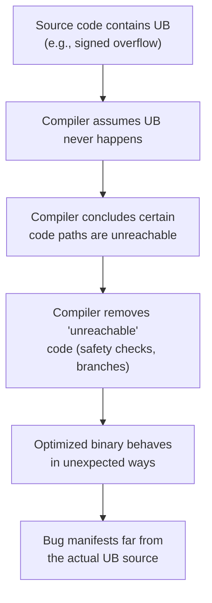
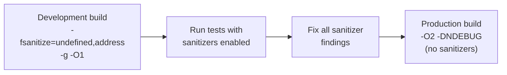

# Undefined Behavior

> Undefined behavior (UB) is C++'s contract with the programmer: if you violate the language rules, the compiler owes you nothing — it can optimize, reorder, or eliminate your code based on the assumption that UB never happens, producing bugs that defy all intuition.

## Table of Contents
- [Core Concepts](#core-concepts)
- [Code Examples](#code-examples)
- [Common Pitfalls](#common-pitfalls)
- [Key Takeaways](#key-takeaways)
- [Exercises](#exercises)

## Core Concepts

### What Is Undefined Behavior?

#### What

Undefined behavior (UB) means the C++ standard places **no requirements** on what the program does. It doesn't mean "the program crashes." It doesn't mean "the program produces a wrong answer." It means the compiler is allowed to do literally *anything* — format your hard drive, emit demons from your nose (the classic "nasal demons" joke from comp.std.c), or — most insidiously — produce code that *appears* to work perfectly until it doesn't.

The C++ standard defines three categories of behavior:

1. **Well-defined behavior** — the standard specifies exactly what happens. `int x = 3 + 4;` always yields `7`.
2. **Implementation-defined behavior** — the standard says the compiler must pick a behavior and document it. `sizeof(int)` is implementation-defined (but at least 16 bits).
3. **Undefined behavior** — no constraints whatsoever. `int x = INT_MAX + 1;` is UB on signed integers.

#### How

When the standard says a construct has undefined behavior, it means the abstract machine described by the standard has no rule for that case. The compiler is not required to detect UB, warn about it, or produce any particular output. In practice, modern optimizing compilers *exploit* UB: they assume it never happens and use that assumption to generate faster code.

Here's the critical insight: the compiler doesn't "choose" what to do when UB occurs. Rather, the compiler optimizes your code under the assumption that UB is impossible. If your code contains UB, the compiler's assumptions are wrong, and the optimized output is unpredictable.

#### Why It Matters

UB exists because C++ is designed for maximum performance. If the standard required signed integer overflow to wrap around (like unsigned integers do), the compiler couldn't use certain CPU instructions or algebraic optimizations. If null pointer dereference were required to crash, the compiler couldn't hoist null checks out of loops. Every UB rule is a permission slip for the optimizer.

This is a fundamentally different model from languages like Java or Python, where the runtime guarantees specific behavior for every operation (Java throws `ArithmeticException` on integer division by zero; Python raises `ZeroDivisionError`). In C++, you get maximum speed, but you carry the burden of never triggering UB.

### How the Compiler Exploits UB

#### What

Modern compilers don't just "ignore" UB — they actively leverage it for optimization. The compiler reasons: "This code path would cause UB, but UB never happens in a valid program, therefore this code path is unreachable." It then optimizes based on that conclusion.

#### How

Consider this function:

```cpp
bool is_positive(int x) {
    return x + 1 > x;
}
```

Mathematically, `x + 1 > x` is always true. But what about `INT_MAX`? If `x == INT_MAX`, then `x + 1` overflows — which is UB for signed integers. The compiler reasons: "Signed overflow is UB. UB never happens. Therefore `x` is never `INT_MAX` when this code runs. Therefore `x + 1 > x` is always true." The compiler optimizes this function to `return true;` — a single instruction.

This isn't a bug in the compiler. This is the compiler correctly applying the rules. If you pass `INT_MAX`, you've already violated the contract. The compiler had no obligation to handle it.

Another classic example: null pointer checks that the compiler removes.

```cpp
void process(int* ptr) {
    int value = *ptr;         // Dereference ptr — UB if ptr is null
    if (ptr == nullptr) {     // Null check AFTER dereference
        return;               // Compiler may remove this entire branch
    }
    use(value);
}
```

The compiler sees the dereference on the first line. If `ptr` were null, that dereference would be UB. UB doesn't happen. Therefore `ptr` is not null. Therefore the null check is always false. The compiler removes it entirely. Your "safety check" evaporates.

#### Why It Matters

This is why UB is so dangerous: it doesn't just affect the line where the violation occurs. It can cause the compiler to change the behavior of *other* code — code that looks perfectly correct in isolation. The compiler's reasoning propagates backwards and forwards through your program. A single UB violation can invalidate assumptions the compiler made hundreds of lines away.



### Common Sources of Undefined Behavior

#### What

The C++ standard contains hundreds of UB clauses, but in practice, a handful account for the vast majority of real-world bugs. Knowing these lets you focus your attention where it matters most.

#### How

**1. Signed integer overflow**

Arithmetic on signed integers (`int`, `long`, `short`) that exceeds the type's range is UB. This is the most surprising UB for programmers coming from languages where integers wrap or are arbitrary-precision.

```cpp
int x = INT_MAX;
x = x + 1;  // UB — signed overflow
```

Note: *unsigned* integer overflow is **well-defined** — it wraps modulo `2^n`. This is why bit manipulation and hash functions use `unsigned` types.

**2. Null pointer dereference**

Dereferencing a null pointer is UB. The program is not required to crash — the compiler may optimize away the dereference or produce arbitrary results.

```cpp
int* p = nullptr;
int x = *p;  // UB — null dereference
```

**3. Out-of-bounds array/container access**

Accessing an array beyond its bounds is UB. This includes negative indices, indices equal to the size, and any access on a zero-sized array.

```cpp
int arr[5] = {1, 2, 3, 4, 5};
int x = arr[5];   // UB — one past the end
int y = arr[-1];   // UB — negative index
```

For `std::vector`, `operator[]` does no bounds checking (for performance). Use `.at()` for checked access — it throws `std::out_of_range` instead of causing UB.

**4. Use-after-free / dangling references**

Accessing memory after it has been freed, or using a reference to an object whose lifetime has ended.

```cpp
int* p = new int(42);
delete p;
int x = *p;  // UB — use-after-free
```

```cpp
int& get_ref() {
    int local = 42;
    return local;  // UB — returning reference to local variable
}
```

**5. Uninitialized variable reads**

Reading from a variable of automatic storage duration (local variable) before it has been assigned a value is UB.

```cpp
int x;
std::cout << x;  // UB — x is uninitialized
```

**6. Data races**

Two threads accessing the same memory location where at least one is a write, with no synchronization, is UB. Not "might give a wrong answer" — full UB. The compiler is free to assume data races don't exist and optimize accordingly.

```cpp
int counter = 0;

// Thread 1:
counter++;  // UB if thread 2 accesses counter concurrently

// Thread 2:
std::cout << counter;
```

**7. Strict aliasing violations**

Accessing an object through a pointer of an incompatible type (with some exceptions like `char*` and `unsigned char*`).

```cpp
float f = 3.14f;
int* ip = reinterpret_cast<int*>(&f);
int bits = *ip;  // UB — strict aliasing violation
```

The compiler assumes that an `int*` and a `float*` never point to the same memory, and optimizes accordingly. If you violate this assumption, the compiler may reorder reads and writes in ways that produce nonsensical results.

**8. Shifting by too many bits or by a negative amount**

Shifting a value by a negative number of bits, or by a number greater than or equal to the width of the type, is UB.

```cpp
int x = 1;
int y = x << 32;  // UB if int is 32 bits — shift amount equals bit width
int z = x << -1;  // UB — negative shift amount
```

#### Why It Matters

These aren't obscure corner cases. They show up in real production code constantly. Buffer overflows (out-of-bounds access) are the #1 source of security vulnerabilities in C and C++ code. Use-after-free bugs are the #2 source. Signed integer overflow appears in virtually every program that does arithmetic on user input. Knowing the common UB sources lets you write defensively and, critically, lets you recognize the symptoms when debugging.

### UB vs Implementation-Defined vs Unspecified

#### What

These three categories are frequently confused but have very different implications for your code.

#### How

| Category | Compiler must document? | Consistent across runs? | Example |
|---|---|---|---|
| **Undefined behavior** | No | No | Signed overflow, null dereference |
| **Implementation-defined** | Yes | Yes (for a given compiler/platform) | `sizeof(int)`, right-shift of negative values |
| **Unspecified** | No | Not necessarily | Order of argument evaluation |

**Implementation-defined** means the compiler chooses a behavior and documents it. You can rely on it for a specific compiler/platform, but your code isn't portable. `sizeof(long)` is 4 on 32-bit Windows (MSVC), 8 on 64-bit Linux (GCC/Clang).

**Unspecified** means the compiler can choose differently each time, and doesn't have to tell you. The evaluation order of function arguments is unspecified: in `f(a(), b())`, the compiler may call `a()` first or `b()` first, and this can change between compilations.

#### Why It Matters

The practical takeaway: UB is the only one that can break your program in arbitrarily bad ways. Implementation-defined behavior is manageable (check your compiler's documentation). Unspecified behavior means you shouldn't write code that depends on a particular outcome. Understanding these distinctions lets you assess risk: "Is this code technically correct but non-portable, or is it fundamentally broken?"

### UB Sanitizers — Your First Line of Defense

#### What

UB sanitizers (UBSan) and Address Sanitizers (ASan) are compiler-provided runtime instrumentation tools that detect UB at runtime. They insert checks into your compiled binary that catch UB as it happens, reporting the exact source location and type of violation.

#### How

Both GCC and Clang support sanitizers via compiler flags:

```bash
# UndefinedBehaviorSanitizer — catches signed overflow, null dereference,
# out-of-bounds shifts, type mismatch, and more
clang++ -std=c++17 -fsanitize=undefined -g -o myprogram myprogram.cpp

# AddressSanitizer — catches out-of-bounds access, use-after-free,
# use-after-scope, double-free, memory leaks
clang++ -std=c++17 -fsanitize=address -g -o myprogram myprogram.cpp

# Combine both for maximum coverage
clang++ -std=c++17 -fsanitize=undefined,address -g -o myprogram myprogram.cpp
```

The `-g` flag adds debug symbols so the sanitizer output includes file names and line numbers.

When a sanitizer detects a violation, it prints a diagnostic like:

```
myprogram.cpp:12:15: runtime error: signed integer overflow:
2147483647 + 1 cannot be represented in type 'int'
```

This tells you exactly what went wrong, where, and what values were involved.

**Key sanitizers and what they catch:**

| Sanitizer | Flag | Catches |
|---|---|---|
| UBSan | `-fsanitize=undefined` | Signed overflow, null dereference, bad shifts, misaligned access, invalid bool values |
| ASan | `-fsanitize=address` | Out-of-bounds access, use-after-free, use-after-scope, double-free, memory leaks |
| TSan | `-fsanitize=thread` | Data races between threads |
| MSan | `-fsanitize=memory` | Use of uninitialized memory (Clang only) |

**Important**: ASan and TSan cannot be used together. ASan and MSan also cannot be combined. Choose based on what you're hunting. ASan + UBSan is the most common combination for general development.

#### Why It Matters

Sanitizers are the single most effective tool for catching UB. Static analysis (compiler warnings, clang-tidy) catches some UB at compile time, but many UB violations depend on runtime values — an array index that comes from user input, a pointer that might be null on some code paths. Sanitizers catch these at runtime.

The performance overhead is roughly 2x for UBSan and 2-3x for ASan. This is acceptable for development and testing builds, but sanitizers should not be used in production (they increase binary size and slow execution). The standard workflow is:



Run your tests with sanitizers on. Fix every finding. Then ship the production build without sanitizers. This catches the bugs during development when they're cheapest to fix.

### Compiler Warnings as UB Prevention

#### What

Before you even get to sanitizers, compiler warnings catch many UB-prone patterns at compile time. Using strict warning flags is a zero-cost way to eliminate entire categories of bugs.

#### How

The recommended baseline flags for development:

```bash
clang++ -std=c++17 -Wall -Wextra -Wpedantic -Werror -g
```

| Flag | What it does |
|---|---|
| `-Wall` | Enables most common warnings (misleading name — not "all") |
| `-Wextra` | Additional warnings not included in `-Wall` |
| `-Wpedantic` | Warns about non-standard extensions |
| `-Werror` | Treats all warnings as errors — forces you to fix them |

Additional flags worth enabling:

```bash
-Wshadow          # Variable shadows another variable in outer scope
-Wconversion      # Implicit narrowing conversions (int → short, double → int)
-Wsign-conversion  # Implicit signed ↔ unsigned conversions
-Wnull-dereference # Possible null pointer dereference (GCC)
```

#### Why It Matters

Warnings are free. They run at compile time with no runtime cost. Treating warnings as errors (`-Werror`) prevents UB-prone patterns from entering your codebase in the first place. Many teams mandate `-Wall -Wextra -Werror` as non-negotiable for all builds. It's the lowest-effort, highest-value defense against UB.

### The "Time Travel" Mental Model

#### What

The most useful mental model for UB is **time travel**: UB can affect code that runs *before* the undefined operation. This sounds paradoxical, but it's a direct consequence of how optimizers work.

#### How

Consider:

```cpp
int table[4] = {0, 1, 2, 3};

bool index_is_valid(int index) {
    // Safety check before accessing the table
    if (index > 4) {
        return false;
    }
    // ... some work ...
    int value = table[index];  // UB if index == 4 (one past the end)
    return true;
}
```

The function tries to validate the index, but the check should be `index >= 4`, not `index > 4`. When `index == 4`, the function passes the check and then accesses `table[4]`, which is UB.

The compiler can reason: "The access `table[index]` is UB if `index >= 4`. UB never happens. Therefore `index` is always `< 4` when this code executes. Therefore the check `index > 4` is always false." The compiler may remove the check entirely.

This is "time travel" — the UB on a later line caused the compiler to change the behavior of an earlier line. The safety check that was supposed to prevent the bug has been optimized away.

#### Why It Matters

This mental model explains why UB bugs are so hard to debug. You add a null check, a bounds check, or an overflow guard — and the compiler removes it because it "can't happen" (since the UB it's guarding against is assumed to never occur). Understanding time travel tells you: **the only safe defense is to prevent UB entirely, not to check for it after the fact.**

## Code Examples

### Detecting UB with Sanitizers

```cpp
// Compile with: clang++ -std=c++17 -fsanitize=undefined,address -g -O1 -o ub_demo ub_demo.cpp
// Run it to see sanitizer diagnostics in real time.

#include <climits>
#include <iostream>
#include <vector>

// Demonstrates three common UB categories detected by sanitizers.

void signed_overflow_demo() {
    int x = INT_MAX;
    std::cout << "x = INT_MAX = " << x << '\n';

    // UBSan will catch this: signed integer overflow
    int y = x + 1;
    std::cout << "x + 1 = " << y << '\n';  // UBSan reports error here
}

void out_of_bounds_demo() {
    std::vector<int> data = {10, 20, 30};

    // ASan will catch this: heap-buffer-overflow
    // operator[] performs no bounds checking — this silently reads garbage or crashes.
    std::cout << "data[5] = " << data[5] << '\n';  // ASan reports error here
}

void use_after_free_demo() {
    int* p = new int(42);
    delete p;

    // ASan will catch this: heap-use-after-free
    std::cout << "*p = " << *p << '\n';  // ASan reports error here
}

int main() {
    std::cout << "=== Signed Overflow ===" << '\n';
    signed_overflow_demo();

    std::cout << "\n=== Out-of-Bounds Access ===" << '\n';
    out_of_bounds_demo();

    std::cout << "\n=== Use-After-Free ===" << '\n';
    use_after_free_demo();

    return 0;
}
```

### Safe Arithmetic to Avoid Signed Overflow

```cpp
#include <climits>
#include <cstdint>
#include <iostream>
#include <optional>
#include <type_traits>

// When you need arithmetic on values that might overflow, you have two options:
// 1. Use unsigned types (wrapping is well-defined)
// 2. Check before the operation

// Option 1: Pre-check for overflow before performing the addition.
// Returns std::nullopt if the addition would overflow.
std::optional<int> safe_add(int a, int b) {
    // Check for positive overflow: a + b > INT_MAX
    // Rearranged to avoid the overflow itself: b > INT_MAX - a
    if (b > 0 && a > INT_MAX - b) {
        return std::nullopt;
    }
    // Check for negative overflow: a + b < INT_MIN
    // Rearranged: b < INT_MIN - a
    if (b < 0 && a < INT_MIN - b) {
        return std::nullopt;
    }
    return a + b;
}

// Option 2: Use unsigned arithmetic where wrapping is well-defined.
// Useful for hash functions, checksums, and counter-based logic.
uint32_t wrapping_add(uint32_t a, uint32_t b) {
    // This is perfectly well-defined: unsigned arithmetic wraps modulo 2^32.
    // No UB, no checks needed.
    return a + b;
}

int main() {
    // Safe addition catches overflow before it happens
    const auto result1 = safe_add(INT_MAX, 1);
    if (result1) {
        std::cout << "INT_MAX + 1 = " << *result1 << '\n';
    } else {
        std::cout << "INT_MAX + 1 would overflow — operation rejected\n";
    }

    const auto result2 = safe_add(100, 200);
    if (result2) {
        std::cout << "100 + 200 = " << *result2 << '\n';
    } else {
        std::cout << "100 + 200 would overflow\n";
    }

    // Unsigned wrapping is well-defined
    const uint32_t max_val = UINT32_MAX;
    const uint32_t wrapped = wrapping_add(max_val, 1);
    std::cout << "UINT32_MAX + 1 (unsigned) = " << wrapped << '\n';  // prints 0

    return 0;
}
```

### Dangling Reference Detection Pattern

```cpp
#include <iostream>
#include <string>
#include <string_view>
#include <vector>

// This example shows how dangling references arise and how to structure
// code to avoid them. Compile with -fsanitize=address to catch these at runtime.

class NameRegistry {
public:
    // Stores a name and returns a reference to the stored copy.
    // The returned reference is valid as long as the registry exists
    // AND no reallocation occurs (adding more elements can invalidate references).
    const std::string& add_name(std::string_view name) {
        names_.emplace_back(name);
        return names_.back();
    }

    // Safe approach: return an index instead of a reference.
    // Indices remain valid even after reallocation.
    std::size_t add_name_safe(std::string_view name) {
        names_.emplace_back(name);
        return names_.size() - 1;
    }

    // Access by index — always valid as long as index < size.
    const std::string& get_name(std::size_t index) const {
        return names_.at(index);  // .at() performs bounds checking
    }

private:
    std::vector<std::string> names_;
};

int main() {
    NameRegistry registry;

    // DANGEROUS: Storing a reference from add_name().
    // If the vector reallocates when adding more names, this reference dangles.
    // const std::string& ref = registry.add_name("Alice");
    // registry.add_name("Bob");   // Might reallocate — ref might dangle!
    // std::cout << ref << '\n';   // Potential UB — use-after-free

    // SAFE: Use indices instead of references.
    const std::size_t alice_idx = registry.add_name_safe("Alice");
    registry.add_name_safe("Bob");
    registry.add_name_safe("Charlie");

    // Indices survive reallocation — always valid.
    std::cout << "First name: " << registry.get_name(alice_idx) << '\n';

    return 0;
}
```

### Strict Aliasing and the `memcpy` Alternative

```cpp
#include <cstdint>
#include <cstring>
#include <iostream>

// The strict aliasing rule says: you cannot access an object through a pointer
// of a different type (with exceptions for char/unsigned char/std::byte).
// Violating this is UB.

// A common need: inspecting the bit representation of a float.

// BAD — strict aliasing violation (UB)
// uint32_t float_bits_bad(float f) {
//     return *reinterpret_cast<uint32_t*>(&f);  // UB: accessing float through uint32_t*
// }

// GOOD — use std::memcpy to type-pun safely.
// std::memcpy copies the bytes without violating aliasing rules.
// The compiler optimizes this to zero overhead (no actual copy in practice).
uint32_t float_bits(float f) {
    static_assert(sizeof(float) == sizeof(uint32_t),
                  "float and uint32_t must be the same size");
    uint32_t bits;
    std::memcpy(&bits, &f, sizeof(bits));
    return bits;
}

// Reverse direction: construct a float from its bit representation.
float bits_to_float(uint32_t bits) {
    static_assert(sizeof(float) == sizeof(uint32_t),
                  "float and uint32_t must be the same size");
    float f;
    std::memcpy(&f, &bits, sizeof(f));
    return f;
}

int main() {
    const float pi = 3.14159f;
    const uint32_t bits = float_bits(pi);

    std::cout << "float value: " << pi << '\n';
    std::cout << "bit pattern: 0x" << std::hex << bits << std::dec << '\n';

    const float reconstructed = bits_to_float(bits);
    std::cout << "reconstructed: " << reconstructed << '\n';

    // Verify round-trip
    if (pi == reconstructed) {
        std::cout << "Round-trip successful — no precision loss.\n";
    }

    return 0;
}
```

## Common Pitfalls

### Signed overflow in loop counters

```cpp
// BAD — signed overflow in a loop that might iterate beyond INT_MAX
#include <iostream>

void count_up(int start, int end) {
    // If end == INT_MAX, the condition i <= end is always true
    // because i++ overflows (UB) before i can exceed end.
    // The compiler may turn this into an infinite loop OR remove the loop entirely.
    for (int i = start; i <= end; ++i) {
        // process(i);
    }
}
```

The condition `i <= end` can never become false when `end == INT_MAX`, because `i` would need to reach `INT_MAX + 1` to fail the check — but incrementing `INT_MAX` is UB. The compiler might optimize this into an infinite loop, or it might optimize it away entirely (since the loop "must" terminate, but the only way it terminates involves UB, the compiler concludes the inputs are never `INT_MAX`).

```cpp
// GOOD — use a strict less-than comparison or unsigned types
#include <iostream>

void count_up_safe(int start, int end) {
    // Option A: strict less-than, then handle the last iteration separately
    for (int i = start; i < end; ++i) {
        // process(i);
    }
    // process(end);  // Handle the last value without increment

    // Option B: use unsigned types if the range is non-negative
    // for (unsigned int i = start; i <= end; ++i) {
    //     // Well-defined wrapping — but be careful with the loop logic
    // }
}
```

### Relying on order of evaluation

```cpp
// BAD — unspecified evaluation order leads to UB
#include <iostream>

int main() {
    int i = 0;
    // The order of evaluation of function arguments is unspecified.
    // Modifying i in one argument and reading it in another is UB
    // (before C++17 for some cases, and still unspecified order even in C++17).
    std::cout << i++ << ' ' << i++ << '\n';  // UB: two unsequenced modifications to i
    return 0;
}
```

Modifying a variable more than once between sequence points (C++11: in unsequenced or indeterminately sequenced expressions) is UB. Even if it "works" on your compiler today, it may break with a different optimization level, compiler version, or platform.

```cpp
// GOOD — make the order explicit with separate statements
#include <iostream>

int main() {
    int i = 0;

    // Each statement is a full expression — modifications are sequenced.
    std::cout << i << ' ';  // reads i (which is 0)
    ++i;
    std::cout << i << '\n'; // reads i (which is 1)

    return 0;
}
```

### Assuming uninitialized variables are zero

```cpp
// BAD — reading uninitialized local variables is UB
#include <iostream>

int main() {
    int x;                    // Uninitialized — holds whatever was on the stack
    if (x > 0) {             // UB: reading uninitialized variable
        std::cout << "positive\n";
    }

    bool flag;               // Also uninitialized — not guaranteed to be true or false
    if (flag) {              // UB: reading uninitialized bool
        std::cout << "flag is set\n";
    }

    return 0;
}
```

Local variables of fundamental types (`int`, `double`, `bool`, pointers) are not zero-initialized in C++. Unlike global/static variables (which are zero-initialized), local variables contain whatever garbage was on the stack. Reading them before assignment is UB. The compiler may assume the read never happens and eliminate the branch, or it may use any value it likes.

```cpp
// GOOD — always initialize variables at the point of declaration
#include <iostream>

int main() {
    int x = 0;                // Explicit initialization
    bool flag = false;        // Explicit initialization

    // Even better: initialize with a meaningful value or defer declaration
    // until you have a value to assign.
    // int x = compute_value();  // Initialize with the actual value

    if (x > 0) {
        std::cout << "positive\n";
    }
    if (flag) {
        std::cout << "flag is set\n";
    }

    return 0;
}
```

### Using `operator[]` on `std::vector` without bounds checking

```cpp
// BAD — operator[] does not check bounds; out-of-bounds access is UB
#include <iostream>
#include <vector>

int main() {
    std::vector<int> data = {10, 20, 30};

    // This compiles and runs — but the behavior is undefined.
    // You might get garbage, a crash, or seemingly correct results
    // that break months later.
    std::cout << data[10] << '\n';  // UB: index 10 on a size-3 vector

    return 0;
}
```

`std::vector::operator[]` deliberately omits bounds checking for performance. Accessing an index beyond `size()` is UB — it may read garbage from adjacent memory, appear to work, or crash unpredictably. In debug builds, some STL implementations add bounds checks, but you must not rely on this.

```cpp
// GOOD — use .at() for checked access, or validate the index yourself
#include <iostream>
#include <stdexcept>
#include <vector>

int main() {
    const std::vector<int> data = {10, 20, 30};

    // Option A: .at() throws std::out_of_range on invalid index
    try {
        std::cout << data.at(10) << '\n';
    } catch (const std::out_of_range& e) {
        std::cout << "Caught: " << e.what() << '\n';
    }

    // Option B: check the index before accessing
    const std::size_t index = 10;
    if (index < data.size()) {
        std::cout << data[index] << '\n';
    } else {
        std::cout << "Index " << index << " is out of range (size = "
                  << data.size() << ")\n";
    }

    return 0;
}
```

### Returning a reference to a local variable

```cpp
// BAD — the local variable is destroyed when the function returns;
// the returned reference is dangling.
#include <string>

const std::string& get_greeting() {
    std::string greeting = "Hello, World!";
    return greeting;  // WARNING: reference to local variable returned
    // greeting is destroyed here — the reference is now dangling
}

int main() {
    const std::string& s = get_greeting();  // s is a dangling reference
    // Any use of s is UB — the string it points to has been destroyed.
    return 0;
}
```

The local variable `greeting` lives on the stack frame of `get_greeting()`. When the function returns, that stack frame is reclaimed. The reference now points to freed memory. Most compilers will warn about this with `-Wall`, but it compiles without `-Werror`.

```cpp
// GOOD — return by value; the compiler will apply copy elision (RVO/NRVO)
// so there's no performance penalty.
#include <iostream>
#include <string>

std::string get_greeting() {
    std::string greeting = "Hello, World!";
    return greeting;  // NRVO — the string is constructed directly in the caller's space
}

int main() {
    const std::string s = get_greeting();  // No copy — constructed in place
    std::cout << s << '\n';
    return 0;
}
```

## Key Takeaways

- **UB is not "unspecified" or "implementation-defined"** — it means the compiler can do *anything*, including removing your safety checks, reordering your code, or producing binaries that appear to work until they catastrophically fail.
- **The compiler exploits UB for optimization** by assuming it never happens. This can cause "time travel" effects where UB on one line causes the compiler to eliminate code on earlier lines. The only defense is preventing UB entirely, not checking for it after the fact.
- **The most common UB sources are**: signed integer overflow, null pointer dereference, out-of-bounds access, use-after-free, uninitialized reads, and data races. Memorize these — they account for the vast majority of real-world UB bugs.
- **Use sanitizers religiously during development**: compile with `-fsanitize=undefined,address -g` and run your tests. Sanitizers catch UB at runtime with exact source location reporting. Fix every finding before shipping.
- **Enable strict compiler warnings** (`-Wall -Wextra -Wpedantic -Werror`) as your zero-cost first line of defense. Warnings catch many UB-prone patterns at compile time before you even run the code.

## Exercises

1. Explain what happens when the compiler encounters the following code, and why the output might not be what you expect. Describe the compiler's reasoning step by step.
   ```cpp
   #include <climits>
   #include <iostream>
   bool will_overflow(int x) {
       return x + 100 < x;
   }
   int main() {
       std::cout << std::boolalpha << will_overflow(INT_MAX) << '\n';
   }
   ```

2. Write a function `safe_multiply(int a, int b)` that returns `std::optional<int>`. It should return the product if multiplication is safe, or `std::nullopt` if the multiplication would overflow. Test it with `INT_MAX * 2`, `100 * 200`, and `INT_MIN * -1`.

3. Compile the following program twice — once with `clang++ -O0` and once with `clang++ -O2`. Explain why the behavior might differ between the two, and what this tells you about relying on UB "working" at a particular optimization level.
   ```cpp
   #include <iostream>
   int main() {
       int arr[4] = {1, 2, 3, 4};
       for (int i = 0; i <= 4; ++i) {
           std::cout << arr[i] << ' ';
       }
       std::cout << '\n';
   }
   ```

4. Given the strict aliasing rule, explain why the following code is UB. Then rewrite it using `std::memcpy` to achieve the same goal (inspecting the bit representation of a `double`) without UB.
   ```cpp
   double d = 1.0;
   uint64_t bits = *reinterpret_cast<uint64_t*>(&d);
   ```

5. A colleague argues that UB sanitizers are unnecessary because "if the program works correctly in testing, there's no UB." Write a short argument (3-5 sentences) explaining why this reasoning is flawed. Include at least one concrete example of how UB can appear to work correctly and then break.
