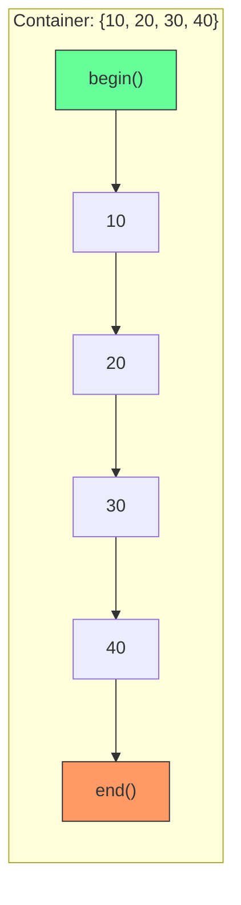
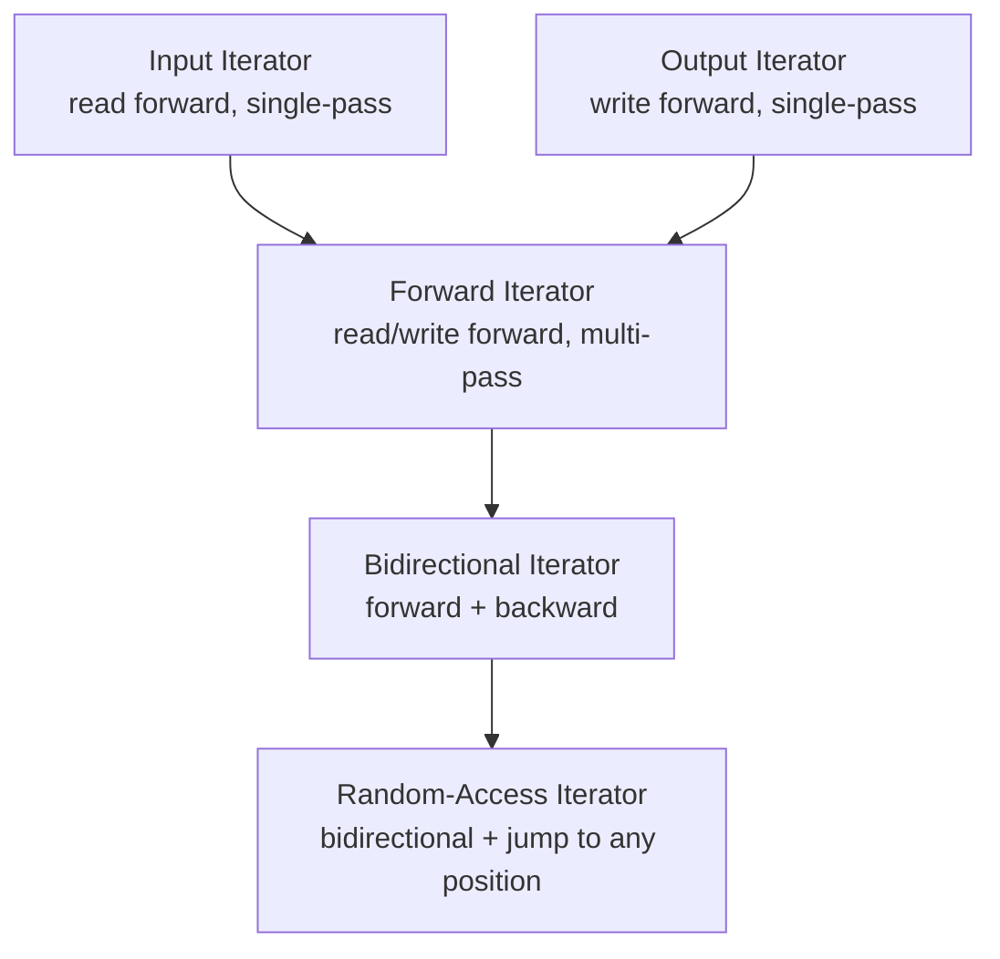
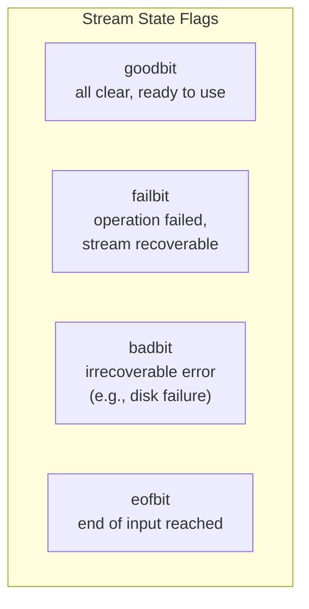

# Iterators & iostream

> Iterators are the universal interface that connects STL containers to algorithms, while iostream provides the standard mechanism for formatted input and output — together they complete the STL's three-part architecture.

## Table of Contents
- [Core Concepts](#core-concepts)
- [Code Examples](#code-examples)
- [Common Pitfalls](#common-pitfalls)
- [Key Takeaways](#key-takeaways)
- [Exercises](#exercises)

## Core Concepts

### What Are Iterators?

#### What

An iterator is a generalized pointer. It points to an element in a container and supports operations to advance to the next element, access the current element, and compare positions. Iterators are the abstraction that lets `std::sort`, `std::find`, `std::transform`, and every other STL algorithm work with any container without knowing what that container is.

Think of it this way: a pointer to an array element is already an iterator. It supports `*ptr` (dereference), `++ptr` (advance), and `ptr1 == ptr2` (compare). STL iterators generalize this concept so that the same operations work on a linked list, a tree, a hash table — anything.

#### How

Every STL container provides two fundamental member functions:
- `begin()` — returns an iterator to the first element
- `end()` — returns an iterator to one-past-the-last element (a **sentinel** — not a valid element)

This half-open range `[begin, end)` is the universal convention in C++. It has an elegant property: an empty range has `begin() == end()`, and the number of elements is `end() - begin()` (for random-access iterators). Every STL algorithm takes a pair of iterators defining this range.



The `end()` iterator is a sentinel — dereferencing it is undefined behavior. It exists solely as a boundary marker. This design avoids the need for a special "null" or "invalid" state.

#### Why It Matters

Iterators decouple algorithms from containers. Without iterators, you would need a separate `sort` for vectors, a separate `sort` for deques, a separate `sort` for arrays — the combinatorial explosion that plagues languages without this abstraction. With iterators, you write one `sort` that works on any random-access range. This is the core of generic programming in C++.

The iterator abstraction also enables composition. You can create iterator adaptors (like `std::reverse_iterator` or `std::back_insert_iterator`) that wrap existing iterators with new behavior, without modifying the underlying container. C++20's ranges library extends this idea further with views that transform data lazily through chained iterator adaptors.

### Iterator Categories

#### What

Not all iterators are created equal. A forward-only linked list can't jump to an arbitrary position. A hash table can't move backwards. The STL defines five iterator categories that describe what operations an iterator supports, forming a hierarchy from least to most capable:



#### How

Each category adds capabilities on top of the previous one:

**Input Iterator** — The most limited. You can read the current element (`*it`), advance (`++it`), and compare (`it1 == it2`). But you can only traverse the sequence once — going back or re-reading is not supported. Think of reading from `std::cin`: once you've read a value, it's gone.

**Output Iterator** — The write-only counterpart. You can write to the current position (`*it = value`) and advance (`++it`), but you can't read or go back. Think of `std::back_inserter`: you write elements into a container, but the iterator itself doesn't let you read what's already there.

**Forward Iterator** — Read and write access, forward traversal, and **multi-pass guarantee**: you can iterate over the same range multiple times. `std::forward_list::iterator` is a forward iterator. This is the minimum category needed for most useful algorithms.

**Bidirectional Iterator** — Everything a forward iterator does, plus backward movement with `--it`. `std::list::iterator`, `std::map::iterator`, and `std::set::iterator` are bidirectional iterators. Algorithms like `std::reverse` require at least this category.

**Random-Access Iterator** — Everything a bidirectional iterator does, plus O(1) jump to any position with `it + n`, `it - n`, `it[n]`, and iterator subtraction `it2 - it1`. `std::vector::iterator`, `std::deque::iterator`, and raw pointers are random-access iterators. Algorithms like `std::sort` and `std::nth_element` require this category — they need to jump to arbitrary positions for partitioning.

| Category | Read | Write | `++` | `--` | `+ n` | `==` | Multi-pass |
|----------|------|-------|------|------|-------|------|------------|
| Input | Yes | No | Yes | No | No | Yes | No |
| Output | No | Yes | Yes | No | No | No | No |
| Forward | Yes | Yes | Yes | No | No | Yes | Yes |
| Bidirectional | Yes | Yes | Yes | Yes | No | Yes | Yes |
| Random-Access | Yes | Yes | Yes | Yes | Yes | Yes | Yes |

#### Why It Matters

Iterator categories determine which algorithms you can use with which containers. If you try to call `std::sort` on a `std::list`, it won't compile — `sort` requires random-access iterators, and `list` only provides bidirectional iterators. (That's why `std::list` has its own `list::sort()` member function that uses a merge sort algorithm tailored to its node-based structure.)

Understanding categories also helps you write generic code. If you're writing a function template that takes iterators, you need to know which category you require. Requiring random-access when forward would suffice unnecessarily restricts your function. The principle: **require the weakest iterator category that your algorithm needs**.

C++20 refines this hierarchy with iterator concepts (`std::input_iterator`, `std::random_access_iterator`, etc.) that give clearer compile-time error messages. But the underlying model is the same.

### Iterator Adaptors

#### What

Iterator adaptors are wrappers that modify how an iterator behaves. The STL provides several built-in adaptors:

- **`std::reverse_iterator`** — traverses a range in reverse
- **`std::back_insert_iterator`** — writes to a container by calling `push_back()`
- **`std::front_insert_iterator`** — writes by calling `push_front()`
- **`std::insert_iterator`** — writes by calling `insert()` at a specific position
- **`std::istream_iterator`** / **`std::ostream_iterator`** — treat I/O streams as ranges

#### How

You typically create these through convenience functions rather than naming the type directly:

- `std::rbegin(c)` / `std::rend(c)` — reverse iterators (or `c.rbegin()` / `c.rend()`)
- `std::back_inserter(c)` — returns a `back_insert_iterator` for container `c`
- `std::front_inserter(c)` — returns a `front_insert_iterator`
- `std::inserter(c, it)` — returns an `insert_iterator` at position `it`

These adaptors are output iterators — you write through them, and they translate the write into the appropriate container operation. This is how `std::copy` can append elements to a vector: it writes through a `back_insert_iterator`, which calls `push_back()` for each element.

#### Why It Matters

Iterator adaptors let you compose operations without intermediate containers. Instead of copying elements into a temporary vector and then reversing it, you can iterate in reverse directly. Instead of manually looping to copy elements from one container to another, you can use `std::copy` with a `back_inserter`. This composability is the soul of the STL's design — small, orthogonal pieces that combine to solve complex problems.

### Iterator Invalidation

#### What

Iterator invalidation is one of the most dangerous aspects of C++ programming. When you modify a container (insert, erase, reallocate), some or all iterators, pointers, and references to its elements may become invalid. Using an invalidated iterator is undefined behavior — it may crash, corrupt memory, or silently produce wrong results.

#### How

The invalidation rules differ by container:

**`std::vector`**:
- `push_back()` / `insert()`: if reallocation occurs (size exceeds capacity), ALL iterators are invalidated. If no reallocation, only iterators at or after the insertion point are invalidated.
- `erase()`: iterators at or after the erased element are invalidated.
- `reserve()` / `resize()`: may invalidate all iterators if capacity changes.

**`std::deque`**:
- Insertion/erasure at the front or back invalidates all iterators (but not references/pointers to existing elements, unless erased).
- Insertion/erasure in the middle invalidates everything.

**`std::list`** / **`std::forward_list`**:
- Only iterators to the erased element are invalidated. All other iterators remain valid. This is the reason linked lists exist.

**`std::map`** / **`std::set`** (and their `multi` variants):
- Only iterators to the erased element are invalidated. Insertion never invalidates any iterators.

**`std::unordered_map`** / **`std::unordered_set`**:
- If a rehash occurs (load factor exceeds threshold), ALL iterators are invalidated. Erasure only invalidates iterators to the erased element.

#### Why It Matters

Iterator invalidation bugs are some of the hardest to debug because they manifest as intermittent crashes or silent data corruption — the classic symptoms of undefined behavior. The most common scenario: iterating over a container and erasing elements. If you erase from a vector inside a range-based for loop, the loop's cached `end()` iterator is now invalid, and advancing past the erased element skips an element or reads garbage memory. Always know the invalidation rules for the container you're using.

### iostream Fundamentals

#### What

The `<iostream>` library provides C++'s standard mechanism for formatted input and output. The core objects are:

- **`std::cout`** — standard output (buffered, goes to terminal)
- **`std::cin`** — standard input (reads from keyboard/pipe)
- **`std::cerr`** — standard error output (unbuffered — flushes immediately)
- **`std::clog`** — standard error output (buffered)

These are objects of stream classes (`std::ostream`, `std::istream`) that use the insertion (`<<`) and extraction (`>>`) operators for output and input respectively.

#### How

`std::cout << value` calls `operator<<` for the type of `value`. The standard library provides overloads for all built-in types (`int`, `double`, `char`, `const char*`, `std::string`, etc.). The operator returns a reference to the stream, which enables chaining: `std::cout << "x = " << x << '\n'` is actually three successive `operator<<` calls.

`std::cin >> variable` calls `operator>>`, which reads from the input buffer, skipping leading whitespace, and attempts to parse the input into the variable's type. If parsing fails (e.g., the user types "abc" when an `int` is expected), the stream enters a **fail state**.

Streams have internal state flags:



- **`goodbit`** — no errors, stream is ready
- **`failbit`** — a parsing or formatting operation failed (e.g., reading "abc" into an `int`). The stream is recoverable after clearing the error.
- **`badbit`** — an irrecoverable error (e.g., underlying I/O device failure)
- **`eofbit`** — end of input was reached

You check the state with `stream.good()`, `stream.fail()`, `stream.bad()`, `stream.eof()`, or by using the stream in a boolean context: `if (std::cin >> x)` succeeds only if the extraction worked.

#### Why It Matters

iostream is type-safe — unlike C's `printf`, where a format string mismatch (`%d` with a `double`) is undefined behavior, `std::cout << x` always calls the correct overload for the type of `x`. The compiler enforces this at compile time. This safety is why C++ chose the `<<`/`>>` operator approach over format strings.

The trade-off: iostream is verbose for complex formatting (compare `printf("%-20s %8.2f\n", name, price)` with the equivalent iostream manipulators) and has significant performance overhead compared to `printf` in tight loops. For performance-critical output, consider `std::printf` (the C function, available in `<cstdio>`) or C++20's `std::format` (not yet widely available). But for general-purpose I/O, iostream is the idiomatic C++ choice.

### Stream Formatting and Manipulators

#### What

Stream manipulators are functions or objects that modify how data is formatted when inserted into or extracted from a stream. They live in `<iostream>` and `<iomanip>`.

#### How

Common output manipulators:

- **`std::endl`** — inserts `'\n'` and flushes the buffer. **Avoid in most cases** — flushing on every line is a major performance hit. Use `'\n'` instead.
- **`std::setw(n)`** — sets the minimum field width for the next output operation only
- **`std::setprecision(n)`** — sets the number of significant digits (or decimal places with `std::fixed`)
- **`std::fixed`** / **`std::scientific`** — fixed-point or scientific notation
- **`std::left`** / **`std::right`** — alignment within the field width
- **`std::setfill(c)`** — the character used to pad to the field width
- **`std::hex`** / **`std::oct`** / **`std::dec`** — integer base
- **`std::boolalpha`** — prints `true`/`false` instead of `1`/`0`

Important: most manipulators are "sticky" — they remain in effect until changed. The exception is `std::setw`, which resets after each use.

#### Why It Matters

Manipulators are the mechanism for formatted output in C++. They're essential for producing aligned tables, formatted numbers, and debug output. The sticky nature of most manipulators is a common source of bugs — if you set `std::hex` and forget to reset to `std::dec`, all subsequent integer output will be in hexadecimal. Always restore stream state when you change it.

### File I/O with fstream

#### What

`<fstream>` provides `std::ifstream` (input), `std::ofstream` (output), and `std::fstream` (both). They inherit from the same stream classes as `cin`/`cout`, so all the same `<<`, `>>`, `getline()`, and manipulator operations work identically.

#### How

File streams follow RAII: the constructor opens the file, the destructor closes it. You never need to call `close()` explicitly (though you can if you want to reuse the stream object for a different file). If the file cannot be opened, the stream enters a fail state.

```cpp
std::ifstream file("data.txt");  // opens on construction
if (!file) {                      // check if open succeeded
    // handle error
}
// use file like std::cin...
// destructor closes the file when 'file' goes out of scope
```

#### Why It Matters

File I/O is one of the most common operations in any program. The fact that file streams share the same interface as `cin`/`cout` means you can write functions that accept `std::istream&` or `std::ostream&` parameters — and they work with files, standard I/O, and string streams (`std::stringstream`) interchangeably. This polymorphism (via inheritance, not templates) is one of the few places in the STL where runtime polymorphism is used.

## Code Examples

### Iterating with Different Iterator Categories

```cpp
#include <algorithm>
#include <forward_list>
#include <iostream>
#include <list>
#include <vector>

int main() {
    // Random-access iterators (vector) — supports +, -, [], <
    std::vector<int> vec = {10, 20, 30, 40, 50};

    // Jump to the third element directly — O(1)
    auto vec_it = vec.begin() + 2;
    std::cout << "vec[2] via iterator: " << *vec_it << '\n';

    // Iterator arithmetic: distance between two positions
    std::cout << "Distance from begin to end: " << (vec.end() - vec.begin()) << '\n';

    // Bidirectional iterators (list) — supports ++ and --, but NOT + or -
    std::list<int> lst = {10, 20, 30, 40, 50};

    auto lst_it = lst.begin();
    std::advance(lst_it, 2);  // std::advance moves any iterator n steps
                               // For random-access: O(1). For bidirectional: O(n).
    std::cout << "list element at position 2: " << *lst_it << '\n';

    // Move backward — only bidirectional and above can do this
    --lst_it;
    std::cout << "After --: " << *lst_it << '\n';

    // Forward iterators (forward_list) — supports ++ only, no --
    std::forward_list<int> fwd = {10, 20, 30, 40, 50};

    auto fwd_it = fwd.begin();
    ++fwd_it;
    ++fwd_it;
    std::cout << "forward_list element at position 2: " << *fwd_it << '\n';

    // --fwd_it;  // ERROR: forward_list iterator doesn't support --

    // std::distance works with any iterator category.
    // For random-access: O(1). For others: O(n) — it increments until end.
    std::cout << "forward_list size: "
              << std::distance(fwd.begin(), fwd.end()) << '\n';

    return 0;
}
```

### Using Iterator Adaptors

```cpp
#include <algorithm>
#include <iostream>
#include <iterator>
#include <list>
#include <vector>

int main() {
    const std::vector<int> source = {1, 2, 3, 4, 5, 6, 7, 8, 9, 10};

    // back_inserter — copies elements into a vector using push_back()
    // This is the standard way to copy elements when the destination
    // doesn't have enough space pre-allocated.
    std::vector<int> evens;
    std::copy_if(source.begin(), source.end(),
                 std::back_inserter(evens),
                 [](int x) { return x % 2 == 0; });

    std::cout << "Evens: ";
    for (const auto val : evens) {
        std::cout << val << ' ';
    }
    std::cout << '\n';

    // front_inserter — inserts at the front (only for containers with push_front)
    std::list<int> reversed;
    std::copy(source.begin(), source.end(), std::front_inserter(reversed));

    std::cout << "Reversed via front_inserter: ";
    for (const auto val : reversed) {
        std::cout << val << ' ';
    }
    std::cout << '\n';

    // Reverse iterators — traverse a range backward
    std::cout << "Source in reverse: ";
    for (auto it = source.rbegin(); it != source.rend(); ++it) {
        std::cout << *it << ' ';  // note: ++ on a reverse_iterator moves backward
    }
    std::cout << '\n';

    // ostream_iterator — treat cout as a range to write to
    std::cout << "Using ostream_iterator: ";
    std::copy(evens.begin(), evens.end(),
              std::ostream_iterator<int>(std::cout, ", "));
    std::cout << '\n';

    return 0;
}
```

### Stream I/O Fundamentals

```cpp
#include <iostream>
#include <limits>
#include <string>

int main() {
    // Basic output — operator<< is type-safe, unlike printf
    const int count = 42;
    const double price = 19.99;
    const std::string name = "Widget";

    std::cout << name << ": " << count << " units at $" << price << '\n';

    // Reading input — operator>> skips whitespace and parses by type
    std::cout << "Enter an integer: ";
    int user_input = 0;

    if (std::cin >> user_input) {
        // Extraction succeeded — stream is still in good state
        std::cout << "You entered: " << user_input << '\n';
    } else {
        // Extraction failed — stream is now in fail state.
        // This happens when the user types non-numeric input.
        std::cout << "Invalid input!\n";

        // To recover, clear the error flags and discard the bad input
        std::cin.clear();  // reset failbit
        std::cin.ignore(std::numeric_limits<std::streamsize>::max(), '\n');
    }

    // Reading a full line — getline doesn't skip whitespace
    std::cin.ignore(std::numeric_limits<std::streamsize>::max(), '\n');
    std::cout << "Enter a sentence: ";
    std::string line;
    if (std::getline(std::cin, line)) {
        std::cout << "You said: \"" << line << "\" ("
                  << line.size() << " chars)\n";
    }

    // std::cerr — unbuffered, for error messages
    // Use cerr for diagnostics so they appear immediately,
    // even if cout's buffer hasn't been flushed.
    std::cerr << "This error message appears immediately\n";

    return 0;
}
```

### Formatted Output with Manipulators

```cpp
#include <iomanip>
#include <iostream>
#include <string>
#include <vector>

struct Product {
    std::string name;
    int quantity;
    double price;
};

int main() {
    const std::vector<Product> inventory = {
        {"Widget",     150,   9.99},
        {"Gadget",      42,  49.95},
        {"Doohickey", 1000,   1.50},
        {"Thingamajig",  7, 199.00},
    };

    // Print a formatted table using manipulators
    // setw() sets minimum field width — resets after each use
    // left/right set alignment — sticky until changed
    // fixed + setprecision control decimal formatting — sticky
    std::cout << std::left
              << std::setw(15) << "Product"
              << std::right
              << std::setw(10) << "Quantity"
              << std::setw(12) << "Price"
              << std::setw(14) << "Total"
              << '\n';

    // Print a separator line
    std::cout << std::setfill('-') << std::setw(51) << "" << '\n';
    std::cout << std::setfill(' ');  // restore default fill character

    std::cout << std::fixed << std::setprecision(2);

    double grand_total = 0.0;
    for (const auto& [name, qty, price] : inventory) {
        const double total = qty * price;
        grand_total += total;

        std::cout << std::left  << std::setw(15) << name
                  << std::right << std::setw(10) << qty
                  << std::setw(12) << price
                  << std::setw(14) << total
                  << '\n';
    }

    std::cout << std::setfill('-') << std::setw(51) << "" << '\n';
    std::cout << std::setfill(' ');
    std::cout << std::left  << std::setw(15) << "TOTAL"
              << std::right << std::setw(10) << ""
              << std::setw(12) << ""
              << std::setw(14) << grand_total
              << '\n';

    // Integer formatting: hex, oct, dec
    const int value = 255;
    std::cout << "\nInteger formatting:\n"
              << "  Decimal:     " << std::dec << value << '\n'
              << "  Hexadecimal: " << std::hex << std::showbase << value << '\n'
              << "  Octal:       " << std::oct << value << '\n';

    // IMPORTANT: reset to decimal — hex/oct are sticky!
    std::cout << std::dec << std::noshowbase;

    // Boolean formatting
    const bool flag = true;
    std::cout << "\nBoolean formatting:\n"
              << "  Default:   " << flag << '\n'
              << "  boolalpha: " << std::boolalpha << flag << '\n';

    return 0;
}
```

### File I/O with fstream

```cpp
#include <fstream>
#include <iostream>
#include <sstream>
#include <string>
#include <vector>

struct Record {
    std::string name;
    int age;
    double score;
};

// This function accepts std::ostream& — it works with cout, ofstream,
// and ostringstream. This is the key design benefit of iostream's
// inheritance hierarchy.
void write_records(std::ostream& out, const std::vector<Record>& records) {
    for (const auto& [name, age, score] : records) {
        out << name << ',' << age << ',' << score << '\n';
    }
}

// Similarly, this works with cin, ifstream, and istringstream.
std::vector<Record> read_records(std::istream& in) {
    std::vector<Record> records;
    std::string line;

    while (std::getline(in, line)) {
        std::istringstream iss(line);
        Record rec;
        char comma1 = 0;
        char comma2 = 0;

        // Parse "name,age,score" format
        if (std::getline(iss, rec.name, ',') &&
            (iss >> rec.age >> comma1 >> rec.score) &&
            comma1 == ',') {
            records.push_back(std::move(rec));
        }
    }

    return records;
}

int main() {
    const std::vector<Record> data = {
        {"Alice", 30, 95.5},
        {"Bob",   25, 87.3},
        {"Carol", 28, 91.8}
    };

    // Write to file — RAII handles closing
    {
        std::ofstream file("records.csv");
        if (!file) {
            std::cerr << "Failed to open file for writing\n";
            return 1;
        }
        write_records(file, data);
        // file destructor closes the file here
    }

    // Read from file
    std::ifstream file("records.csv");
    if (!file) {
        std::cerr << "Failed to open file for reading\n";
        return 1;
    }

    const auto loaded = read_records(file);

    std::cout << "Loaded " << loaded.size() << " records:\n";
    for (const auto& [name, age, score] : loaded) {
        std::cout << "  " << name << " (age " << age
                  << ", score " << score << ")\n";
    }

    // Demonstrate stringstream — same interface, in-memory buffer
    std::ostringstream oss;
    write_records(oss, data);
    std::cout << "\nStringstream output:\n" << oss.str();

    return 0;
}
```

### Combining Iterators and Streams

```cpp
#include <algorithm>
#include <iostream>
#include <iterator>
#include <numeric>
#include <sstream>
#include <string>
#include <vector>

int main() {
    // istream_iterator reads from a stream as if it were a container.
    // This lets you use STL algorithms on input data without an
    // intermediate container.
    std::istringstream input("42 17 93 8 55 31");

    // Read all integers from the string stream into a vector.
    // istream_iterator<int>{} (default-constructed) is the "end" sentinel.
    std::vector<int> numbers(
        std::istream_iterator<int>(input),
        std::istream_iterator<int>()
    );

    // Sort the numbers
    std::sort(numbers.begin(), numbers.end());

    // Write sorted output using ostream_iterator
    std::cout << "Sorted: ";
    std::copy(numbers.begin(), numbers.end(),
              std::ostream_iterator<int>(std::cout, " "));
    std::cout << '\n';

    // Compute sum using accumulate — works with any input iterator range
    const int total = std::accumulate(numbers.begin(), numbers.end(), 0);
    std::cout << "Sum: " << total << '\n';

    // Transform and output in one step: square each number
    std::cout << "Squared: ";
    std::transform(numbers.begin(), numbers.end(),
                   std::ostream_iterator<int>(std::cout, " "),
                   [](int x) { return x * x; });
    std::cout << '\n';

    // Reading words from a string, one at a time
    std::istringstream words("the quick brown fox jumps");
    std::vector<std::string> word_list(
        std::istream_iterator<std::string>(words),
        std::istream_iterator<std::string>()
    );

    std::cout << "Word count: " << word_list.size() << '\n';
    std::cout << "Longest word: "
              << *std::max_element(word_list.begin(), word_list.end(),
                     [](const std::string& a, const std::string& b) {
                         return a.size() < b.size();
                     })
              << '\n';

    return 0;
}
```

## Common Pitfalls

### Using std::endl instead of '\n'

```cpp
// BAD — std::endl flushes the buffer on every line
#include <iostream>
#include <vector>

void print_data(const std::vector<int>& data) {
    for (const auto val : data) {
        std::cout << val << std::endl;  // flushes the output buffer every iteration
        // For 1 million elements, that's 1 million flush operations.
        // Each flush is a system call — orders of magnitude slower than buffered I/O.
    }
}
```

`std::endl` does two things: writes `'\n'` and flushes the output buffer. Flushing forces the buffered data to the underlying device (terminal, file, pipe) via a system call. In a loop, this can make output 10-100x slower than using `'\n'` alone. The buffer exists for a reason — it batches small writes into efficient larger writes.

```cpp
// GOOD — use '\n' for newlines, let the buffer flush naturally
#include <iostream>
#include <vector>

void print_data(const std::vector<int>& data) {
    for (const auto val : data) {
        std::cout << val << '\n';  // newline only, no flush
    }
    // The buffer flushes automatically when it's full, when the program
    // exits, or when you explicitly need it (e.g., before waiting for input).
}
```

Use `std::endl` only when you specifically need an immediate flush — for example, before a crash-prone operation where you want to ensure output is visible, or before reading from `std::cin` (though `std::cin` is tied to `std::cout` and flushes it automatically).

### Ignoring stream error states

```cpp
// BAD — not checking whether input extraction succeeded
#include <iostream>

int main() {
    int age = 0;
    std::cout << "Enter your age: ";
    std::cin >> age;
    // If the user types "abc", extraction fails silently.
    // 'age' remains 0 (or its previous value), and the stream is now in fail state.
    // All subsequent reads will also fail until the error is cleared.
    std::cout << "You are " << age << " years old.\n";

    int weight = 0;
    std::cout << "Enter your weight: ";
    std::cin >> weight;  // This will ALSO fail because failbit is still set!
    std::cout << "Weight: " << weight << '\n';

    return 0;
}
```

Once a stream enters a fail state, all subsequent extractions silently fail and return immediately without reading anything. The stream stays in the fail state until you explicitly clear it. This cascading failure is the source of many mysterious "my input stops working" bugs.

```cpp
// GOOD — always check stream state after extraction
#include <iostream>
#include <limits>
#include <string>

// Robust input function that handles errors and retries
int read_int(std::string_view prompt) {
    int value = 0;
    while (true) {
        std::cout << prompt;
        if (std::cin >> value) {
            // Extraction succeeded — discard the rest of the line
            // (e.g., if user typed "42 extra stuff")
            std::cin.ignore(std::numeric_limits<std::streamsize>::max(), '\n');
            return value;
        }

        // Extraction failed — clear the error and discard bad input
        std::cout << "Invalid input. Please enter a number.\n";
        std::cin.clear();  // clear failbit
        std::cin.ignore(std::numeric_limits<std::streamsize>::max(), '\n');
    }
}

int main() {
    const int age = read_int("Enter your age: ");
    std::cout << "You are " << age << " years old.\n";

    const int weight = read_int("Enter your weight: ");
    std::cout << "Weight: " << weight << '\n';

    return 0;
}
```

### Forgetting that manipulators are sticky

```cpp
// BAD — setting hex and forgetting to reset
#include <iomanip>
#include <iostream>

int main() {
    const int address = 0xDEAD;
    const int count = 42;

    std::cout << "Address: " << std::hex << std::showbase << address << '\n';
    // hex and showbase are STICKY — they remain in effect
    std::cout << "Count: " << count << '\n';  // prints "Count: 0x2a" — oops!

    return 0;
}
```

Most manipulators (`std::hex`, `std::fixed`, `std::setprecision`, `std::left`, `std::boolalpha`, etc.) are sticky — they remain in effect until explicitly changed. The notable exception is `std::setw`, which resets to 0 after each formatted output operation. Forgetting to restore the previous state is a common bug that produces surprising output.

```cpp
// GOOD — restore stream state after temporary changes
#include <iomanip>
#include <iostream>

// Helper: save and restore stream formatting flags
class StreamFlagGuard {
public:
    explicit StreamFlagGuard(std::ostream& os)
        : os_(os), flags_(os.flags()), precision_(os.precision()),
          fill_(os.fill()) {}

    ~StreamFlagGuard() {
        os_.flags(flags_);
        os_.precision(precision_);
        os_.fill(fill_);
    }

    // Non-copyable, non-moveable
    StreamFlagGuard(const StreamFlagGuard&) = delete;
    StreamFlagGuard& operator=(const StreamFlagGuard&) = delete;

private:
    std::ostream& os_;
    std::ios_base::fmtflags flags_;
    std::streamsize precision_;
    char fill_;
};

int main() {
    const int address = 0xDEAD;
    const int count = 42;

    {
        // RAII guard — restores flags when scope ends
        StreamFlagGuard guard(std::cout);
        std::cout << "Address: " << std::hex << std::showbase << address << '\n';
    }
    // Flags are now restored to their original state

    std::cout << "Count: " << count << '\n';  // prints "Count: 42" — correct

    return 0;
}
```

### Using invalidated iterators after container modification

```cpp
// BAD — storing an iterator, modifying the container, then using the iterator
#include <iostream>
#include <vector>

int main() {
    std::vector<int> data = {10, 20, 30, 40, 50};

    auto it = data.begin() + 2;  // points to 30
    std::cout << "Before: " << *it << '\n';

    // This push_back may trigger a reallocation if size == capacity.
    // If it does, ALL iterators (including 'it') become invalid.
    data.push_back(60);

    // UNDEFINED BEHAVIOR — 'it' may point to freed memory
    // std::cout << "After: " << *it << '\n';  // may crash, print garbage, or "work"

    return 0;
}
```

This is particularly insidious because it often "works" in debug builds (where the old memory might not be overwritten yet) and crashes in release builds (where the memory is reused immediately). The bug is non-deterministic and depends on whether the vector happened to have spare capacity.

```cpp
// GOOD — re-obtain iterators after any modification that may invalidate them
#include <iostream>
#include <vector>

int main() {
    std::vector<int> data = {10, 20, 30, 40, 50};

    const std::size_t index = 2;  // save the index, not the iterator
    std::cout << "Before: " << data[index] << '\n';

    data.push_back(60);

    // Re-derive the iterator from the (still-valid) container
    std::cout << "After: " << data[index] << '\n';  // safe — index is just a number

    // Alternative: if you know push_back won't reallocate (because you reserved),
    // iterators before the insertion point remain valid.
    std::vector<int> reserved_data = {10, 20, 30};
    reserved_data.reserve(100);  // guarantee no reallocation for next 97 push_backs

    auto safe_it = reserved_data.begin() + 1;  // points to 20
    reserved_data.push_back(40);  // no reallocation — safe_it is still valid
    std::cout << "Safe iterator: " << *safe_it << '\n';  // prints 20

    return 0;
}
```

## Key Takeaways

- **Iterators are generalized pointers** that decouple containers from algorithms. The `[begin, end)` half-open range convention is universal in C++ and enables clean, composable generic code.
- **Know your iterator categories.** Random-access (vector, deque) supports `+`, `-`, `[]`; bidirectional (list, map, set) adds `--`; forward (forward_list) supports only `++`. The category determines which algorithms compile with which containers.
- **Iterator invalidation is a top source of C++ bugs.** Vector invalidates all iterators on reallocation; map/set never invalidate on insertion. Know the rules for every container you use, or default to storing indices instead of iterators when the container may be modified.
- **Use `'\n'` instead of `std::endl`** unless you specifically need to flush the buffer. The performance difference is dramatic in loops.
- **Always check stream state after extraction** (`if (std::cin >> x)`) and clear errors with `cin.clear()` + `cin.ignore()` before retrying. A stream in fail state silently rejects all subsequent reads.

## Exercises

1. Explain why `std::sort` cannot be used directly on a `std::list`. What iterator category does `sort` require, and what category does `list` provide? How do you sort a list instead?

2. Write a function template `void print_range(Iter begin, Iter end)` that prints all elements in a range separated by commas, with no trailing comma. Test it with a `std::vector<int>`, a `std::set<std::string>`, and a raw array. What is the minimum iterator category your function requires?

3. Write a program that reads integers from `std::cin` until the user enters a non-integer (causing a fail state). Collect all successfully read integers into a vector, then print them sorted. Handle the error state correctly so the program exits cleanly.

4. Create a `StreamFlagGuard` class (RAII wrapper) that saves a stream's formatting flags on construction and restores them on destruction. Demonstrate its use by printing a hex value inside a guarded scope, then verifying that subsequent output is back to decimal. Explain why this follows the RAII idiom.

5. Given a `std::map<std::string, std::vector<int>>` representing student names mapped to their test scores, write a program that:
   - Uses iterators (not range-based for) to iterate over the map
   - For each student, uses `std::accumulate` with iterators to compute the average score
   - Prints a formatted table using `std::setw` and `std::fixed` with 1 decimal place
   - Explain which iterator category the map provides and why that matters for the algorithms you chose.
