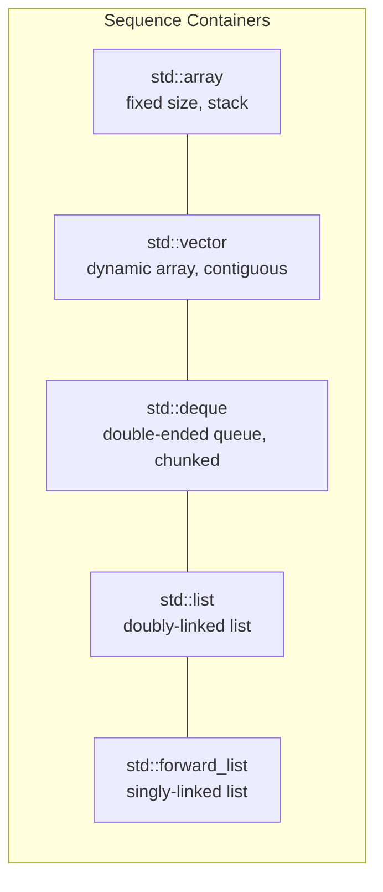
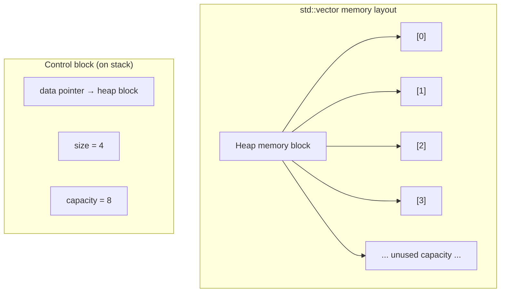
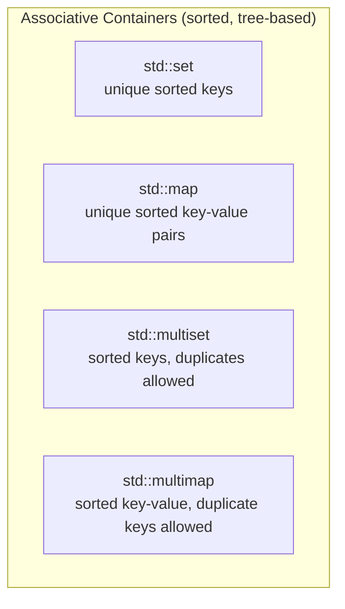
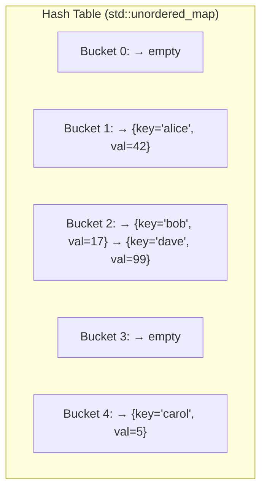
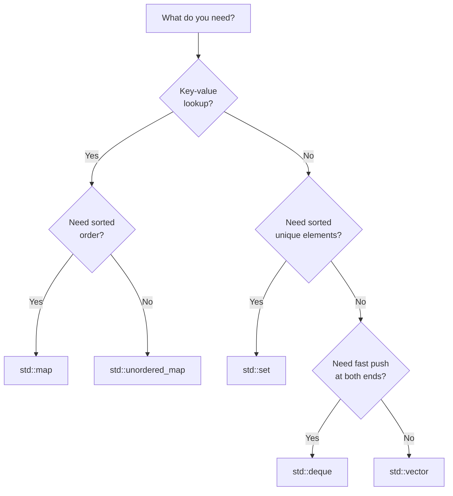

# STL Containers

> The Standard Template Library containers are the foundational data structures of C++ — choosing the right one determines whether your program runs in microseconds or minutes.

## Table of Contents
- [Core Concepts](#core-concepts)
- [Code Examples](#code-examples)
- [Common Pitfalls](#common-pitfalls)
- [Key Takeaways](#key-takeaways)
- [Exercises](#exercises)

## Core Concepts

### The STL Design Philosophy

#### What

The Standard Template Library (STL) is built on a radical design idea: **separate data structures from algorithms**. Containers store data. Algorithms operate on data. Iterators connect them. This three-part architecture means you don't need N containers times M algorithms implementations — you need N containers, M algorithms, and a common iterator interface to connect them.

This was Alexander Stepanov's key insight when he designed the STL in the early 1990s (standardized in C++98). Every other language's standard library that followed — Java Collections, Python's itertools, Rust's iterators — borrowed this idea.

#### How

Every STL container provides:
- `begin()` / `end()` — iterators to the first element and one-past-the-last
- `size()` — the number of elements
- `empty()` — whether the container has zero elements
- Value semantics — containers own their elements and manage their memory via RAII

Because of this uniform interface, `std::sort` doesn't need to know whether it's sorting a `vector`, a `deque`, or a raw array. It only needs random-access iterators. This is generic programming at its best — zero runtime overhead, maximum flexibility.

#### Why It Matters

Understanding the STL architecture changes how you think about code. Instead of writing a custom loop to find an element in a vector, you call `std::find`. Instead of writing a custom sort, you call `std::sort`. The algorithms are battle-tested, optimized, and correct. Your custom loop probably has an off-by-one error. The STL's separation of concerns also means that when C++20 introduced ranges (a new iterator interface), all existing containers worked with it immediately — no changes needed.

### Sequence Containers

#### What

Sequence containers store elements in a linear order that you control. The order of insertion is preserved. The three primary sequence containers are `std::vector`, `std::deque`, and `std::list`. There is also `std::array` (fixed-size) and `std::forward_list` (singly-linked).



#### How

**`std::vector`** is a dynamically-sized contiguous array. Elements are stored in a single block of heap memory, one after another. When the capacity is exceeded, vector allocates a new, larger block (typically 2x the old size), moves all elements over, and frees the old block. This gives amortized O(1) `push_back` — most insertions are O(1), but occasionally one is O(n) when reallocation happens.



**`std::deque`** (double-ended queue) stores elements in chunks (typically 512 bytes each) linked together by a central index array. This allows O(1) insertion at both the front and back, at the cost of slightly slower random access (two pointer dereferences instead of one) and non-contiguous memory.

**`std::list`** is a doubly-linked list. Each element is a separate heap allocation containing the value plus two pointers (previous and next). Insertion and deletion anywhere is O(1) *if you already have an iterator to the position*. Finding that position is O(n). The per-element overhead (two pointers = 16 bytes on 64-bit) and cache-unfriendly memory layout make `list` a poor choice in nearly all practical scenarios.

**`std::forward_list`** is a singly-linked list — each node has only a next pointer. It saves one pointer per node compared to `list`, but you can only traverse forward. It was added in C++11 for niche use cases where memory is extremely constrained.

**`std::array`** is a fixed-size array whose size is a compile-time constant. It wraps a C-style array with a proper STL interface (`begin()`, `end()`, `size()`, `at()`). Unlike `vector`, it lives entirely on the stack (or wherever the enclosing object lives) — no heap allocation, no overhead.

#### Why It Matters

**`std::vector` is the default container.** Use it unless you have a specific, measured reason not to. The reason is hardware: modern CPUs are dominated by cache effects. A vector's contiguous memory layout means sequential access hits the L1 cache on almost every read. A linked list's scattered heap allocations cause cache misses on almost every read. In benchmarks, vector often beats list even for operations where list has a better theoretical complexity (like middle insertion) — because the constant factor from cache misses dwarfs the algorithmic advantage.

Bjarne Stroustrup himself has demonstrated this repeatedly: **vector beats list in almost every practical benchmark**, including insertion-heavy workloads. The only realistic use case for `std::list` is when you need stable iterators (iterators that remain valid after insertion/deletion elsewhere) and you're doing many such operations.

### Associative Containers

#### What

Associative containers store elements in a sorted order determined by a comparison function (by default, `operator<`). They provide O(log n) lookup, insertion, and deletion. The four associative containers are `std::map`, `std::set`, `std::multimap`, and `std::multiset`.



#### How

Under the hood, all four associative containers are typically implemented as **red-black trees** — self-balancing binary search trees. Each element is a separate heap allocation (a tree node containing the value plus pointers to parent, left child, and right child plus a color bit). The tree invariants guarantee O(log n) height, which bounds all operations.

`std::set` stores unique keys. `std::map` stores key-value pairs with unique keys. `std::multiset` and `std::multimap` allow duplicate keys (though `multimap` is rarely used in modern code — `std::map<Key, std::vector<Value>>` is usually clearer).

The sorted order means you can iterate over a `map` or `set` and get elements in sorted order — this is a free bonus. It also means you can perform range queries efficiently: "give me all keys between X and Y" is O(log n + k) where k is the number of results.

#### Why It Matters

Use `std::map` when you need sorted iteration or range queries. The sorted order is maintained automatically — every insertion and deletion keeps the tree balanced. This is valuable when your application needs to display data in order, perform nearest-neighbor lookups, or maintain a sorted index.

However, the per-node heap allocation and pointer-chasing traversal pattern make associative containers cache-unfriendly. For most workloads where you just need key-value lookup, `std::unordered_map` (next section) is faster. The rule of thumb: **use `map` when you need order, `unordered_map` when you need speed**.

### Unordered Containers (C++11)

#### What

Unordered containers store elements using hash tables, providing average-case O(1) lookup, insertion, and deletion. They were introduced in C++11. The four unordered containers are `std::unordered_map`, `std::unordered_set`, `std::unordered_multimap`, and `std::unordered_multiset`.

#### How

A hash table works by computing a hash of the key, mapping it to a bucket index, and storing the element in that bucket. When two keys hash to the same bucket (a **collision**), the elements are stored in a linked list within that bucket (separate chaining — the strategy used by all major STL implementations).



The **load factor** is the ratio of elements to buckets. When the load factor exceeds a threshold (default 1.0), the table rehashes: it allocates a larger bucket array (typically 2x) and re-inserts all elements. This is an O(n) operation, but it happens infrequently enough that insertion is amortized O(1).

For a type to be usable as a key in an unordered container, it needs two things:
1. A hash function — `std::hash<T>` specialization (already provided for all built-in types and `std::string`)
2. An equality comparison — `operator==` (already provided for all standard types)

#### Why It Matters

`std::unordered_map` is the workhorse container for key-value lookup. In benchmarks, it's typically 3-10x faster than `std::map` for pure lookup workloads because hash table access avoids the pointer-chasing tree traversal. The trade-off: you lose sorted order, and worst-case performance degrades to O(n) if many keys hash to the same bucket (pathological input or a bad hash function).

Use `unordered_map` by default for key-value storage. Switch to `map` only when you need sorted iteration, range queries, or guaranteed O(log n) worst-case (important for real-time systems where O(n) worst-case is unacceptable).

### Container Adaptors

#### What

Container adaptors are not standalone containers — they wrap an underlying container and restrict its interface to enforce a specific usage pattern. The three adaptors are `std::stack`, `std::queue`, and `std::priority_queue`.

#### How

- **`std::stack`** wraps `std::deque` by default (configurable). Exposes only `push()`, `pop()`, `top()`, `empty()`, `size()`. LIFO (last-in, first-out) access only.
- **`std::queue`** wraps `std::deque` by default. Exposes `push()`, `pop()`, `front()`, `back()`, `empty()`, `size()`. FIFO (first-in, first-out) access only.
- **`std::priority_queue`** wraps `std::vector` by default. Elements are ordered by priority (max element at top by default). Implemented as a binary heap. `push()` and `pop()` are O(log n), `top()` is O(1).

#### Why It Matters

Container adaptors enforce discipline. A `stack` tells every reader of your code "this data structure is accessed LIFO" — even if the underlying data is stored in a deque that supports random access. By restricting the interface, you communicate intent and prevent misuse. If you need a stack, declare a `std::stack`, not a `std::vector` that you only push and pop from.

### Choosing the Right Container

#### What

This is the most important practical skill in this lesson: knowing which container to reach for. The decision depends on your access patterns, insertion/deletion patterns, and whether you need ordering.

#### How



The decision table for common operations:

| Operation | vector | deque | list | map | unordered_map |
|-----------|--------|-------|------|-----|---------------|
| Random access by index | O(1) | O(1) | O(n) | O(log n)* | O(1) avg** |
| Push back | O(1) amortized | O(1) amortized | O(1) | O(log n) | O(1) amortized |
| Push front | O(n) | O(1) amortized | O(1) | O(log n) | O(1) amortized |
| Insert at position | O(n) | O(n) | O(1)*** | O(log n) | O(1) amortized |
| Find by value | O(n) | O(n) | O(n) | O(log n) | O(1) avg |
| Erase by iterator | O(n) | O(n) | O(1) | O(1) amortized | O(1) amortized |
| Memory contiguous | Yes | No | No | No | No |
| Iterator stability | No**** | Partial | Yes | Yes | No***** |

\* `map` doesn't support index-based access; lookup is by key.
\** Average case; O(n) worst case with hash collisions.
\*** O(1) only if you already have the iterator; finding the position is O(n).
\**** Any insertion/deletion may invalidate all iterators if reallocation occurs.
\***** Rehashing invalidates all iterators.

#### Why It Matters

**Start with `std::vector`.** This is not a suggestion — it's professional C++ advice backed by decades of benchmarking. Vector's contiguous memory layout gives it a massive cache advantage. In the majority of real-world programs, the data fits in cache, and the cache advantage of vector outweighs the theoretical complexity advantages of other containers.

Switch to another container only when:
- You need O(1) push at the front → `std::deque`
- You need key-value lookup → `std::unordered_map` (no order needed) or `std::map` (sorted)
- You need a set of unique values → `std::unordered_set` or `std::set`
- You need stable iterators under insertion/deletion → `std::list` (rare)
- You have a fixed number of elements known at compile time → `std::array`

### Performance Characteristics Deep Dive

#### What

Understanding big-O complexity is necessary but not sufficient. Real-world performance depends on **constant factors** — especially cache behavior, memory allocation patterns, and branch prediction. Two O(log n) algorithms can differ by 10x in wall-clock time based on memory access patterns.

#### How

**Cache effects dominate.** A modern CPU's L1 cache can deliver data in ~1 nanosecond. A cache miss that goes to main memory takes ~100 nanoseconds — a 100x penalty. `std::vector` stores elements contiguously, so iterating over a vector generates sequential memory accesses that the hardware prefetcher predicts perfectly. `std::list` and `std::map` store each element in a separate heap allocation, scattered across memory. Every element access is potentially a cache miss.

**Memory allocation matters.** `std::vector` allocates one block of memory (occasionally reallocated). `std::map` allocates a separate tree node for every single element. If you insert a million elements into a map, that's a million calls to the allocator. Each allocation has overhead (typically 16-32 bytes of bookkeeping per allocation), so a `map<int, int>` storing 8 bytes of actual data per entry might use 64+ bytes per entry when you include the tree node overhead (two child pointers, parent pointer, color bit, alignment padding).

**Iterator invalidation costs.** `std::vector` invalidates all iterators on reallocation. This means if you're iterating and inserting, you need to be careful. But you can prevent reallocation entirely by calling `reserve()` upfront if you know the approximate size. `std::map` and `std::list` never invalidate existing iterators on insertion — but you pay for this stability with scattered memory layout.

#### Why It Matters

The single most common performance mistake in C++ is choosing `std::map` when `std::unordered_map` or a sorted `std::vector` would be faster. A sorted vector with `std::lower_bound` for lookup is often faster than a `map` for read-heavy workloads because of cache locality. Profile before you optimize, but start with the right container — and that default is `std::vector`.

## Code Examples

### Using std::vector — The Default Container

```cpp
#include <algorithm>
#include <iostream>
#include <numeric>
#include <vector>

int main() {
    // Reserve capacity upfront when you know the approximate size.
    // This prevents reallocations during insertion — a significant
    // performance win for large vectors.
    std::vector<int> scores;
    scores.reserve(100);  // allocate space for 100 ints, size remains 0

    // Populate with sample data
    for (int i = 0; i < 20; ++i) {
        scores.push_back(i * 3 + 7);  // O(1) amortized — no reallocation needed
    }

    // Range-based for loop — always prefer this over index-based
    std::cout << "All scores: ";
    for (const auto score : scores) {
        std::cout << score << ' ';
    }
    std::cout << '\n';

    // STL algorithms work seamlessly with vector
    std::sort(scores.begin(), scores.end());

    // Binary search on sorted vector — O(log n), cache-friendly
    const int target = 22;
    const bool found = std::binary_search(scores.begin(), scores.end(), target);
    std::cout << target << (found ? " found" : " not found") << '\n';

    // Accumulate — sum all elements
    const int total = std::accumulate(scores.begin(), scores.end(), 0);
    std::cout << "Total: " << total << ", Average: "
              << static_cast<double>(total) / scores.size() << '\n';

    // Erase-remove idiom — the correct way to remove elements from a vector.
    // std::remove moves unwanted elements to the end and returns an iterator
    // to the new logical end. erase() actually shrinks the vector.
    scores.erase(
        std::remove_if(scores.begin(), scores.end(),
                       [](int s) { return s < 20; }),
        scores.end()
    );

    std::cout << "After removing scores < 20: ";
    for (const auto score : scores) {
        std::cout << score << ' ';
    }
    std::cout << '\n';

    // size() vs capacity() — size is the number of elements,
    // capacity is how many elements can fit before reallocation
    std::cout << "Size: " << scores.size()
              << ", Capacity: " << scores.capacity() << '\n';

    return 0;
}
```

### std::map vs std::unordered_map

```cpp
#include <iostream>
#include <map>
#include <string>
#include <unordered_map>

int main() {
    // std::map — sorted by key, O(log n) operations
    // Use when you need sorted iteration or range queries.
    std::map<std::string, int> sorted_scores = {
        {"Alice", 95},
        {"Charlie", 87},
        {"Bob", 91},
        {"Diana", 93}
    };

    // Iteration yields keys in alphabetical order — guaranteed.
    std::cout << "Sorted scores (std::map):\n";
    for (const auto& [name, score] : sorted_scores) {
        std::cout << "  " << name << ": " << score << '\n';
    }

    // Range query: find all names from "B" to "D" (exclusive)
    // lower_bound returns iterator to first element >= "B"
    // lower_bound("D") returns iterator to first element >= "D"
    std::cout << "Names starting with B or C:\n";
    for (auto it = sorted_scores.lower_bound("B");
         it != sorted_scores.lower_bound("D"); ++it) {
        std::cout << "  " << it->first << ": " << it->second << '\n';
    }

    // std::unordered_map — hash-based, O(1) average operations
    // Use when you just need fast lookup and don't care about order.
    std::unordered_map<std::string, int> fast_scores = {
        {"Alice", 95},
        {"Charlie", 87},
        {"Bob", 91},
        {"Diana", 93}
    };

    // Lookup — O(1) average, compared to O(log n) for map
    const auto it = fast_scores.find("Bob");
    if (it != fast_scores.end()) {
        std::cout << "Bob's score: " << it->second << '\n';
    }

    // Insert or update — operator[] inserts a default-constructed value
    // if the key doesn't exist, then returns a reference to it.
    fast_scores["Eve"] = 88;

    // insert_or_assign (C++17) — more explicit than operator[].
    // Returns a pair: (iterator, bool). The bool is true if inserted, false if updated.
    const auto [insert_it, was_inserted] =
        fast_scores.insert_or_assign("Alice", 98);
    std::cout << "Alice was " << (was_inserted ? "inserted" : "updated")
              << " to " << insert_it->second << '\n';

    // Check element count and load factor
    std::cout << "Bucket count: " << fast_scores.bucket_count()
              << ", Load factor: " << fast_scores.load_factor() << '\n';

    return 0;
}
```

### std::set for Unique Collections

```cpp
#include <algorithm>
#include <iostream>
#include <set>
#include <string>
#include <vector>

int main() {
    // std::set maintains unique elements in sorted order.
    // Perfect for membership testing when you also need ordering.
    std::set<std::string> allowed_extensions = {
        ".cpp", ".hpp", ".h", ".cc", ".cxx"
    };

    // Insertion of a duplicate is a no-op — returns {iterator, false}
    const auto [it, inserted] = allowed_extensions.insert(".cpp");
    std::cout << ".cpp insert: " << (inserted ? "new" : "already exists") << '\n';

    // Membership test — O(log n). Use count() or find(), not std::find().
    // count() returns 0 or 1 for a set (no duplicates).
    const std::string test_ext = ".rs";
    if (allowed_extensions.count(test_ext) == 0) {
        std::cout << test_ext << " is not in the allowed set\n";
    }

    // Practical pattern: deduplicating a vector using a set
    std::vector<int> raw_data = {5, 3, 8, 3, 1, 5, 9, 1, 8, 2};
    const std::set<int> unique_data(raw_data.begin(), raw_data.end());

    std::cout << "Unique sorted values: ";
    for (const auto val : unique_data) {
        std::cout << val << ' ';
    }
    std::cout << '\n';

    // Alternative: deduplicate in-place with sort + unique + erase on the vector.
    // This is often faster than constructing a set because of cache locality.
    std::sort(raw_data.begin(), raw_data.end());
    raw_data.erase(std::unique(raw_data.begin(), raw_data.end()), raw_data.end());

    std::cout << "Deduplicated vector: ";
    for (const auto val : raw_data) {
        std::cout << val << ' ';
    }
    std::cout << '\n';

    return 0;
}
```

### std::deque and Container Adaptors

```cpp
#include <deque>
#include <iostream>
#include <queue>
#include <stack>
#include <string>

int main() {
    // std::deque — O(1) push/pop at both ends
    // Use when you need a buffer that grows in both directions.
    std::deque<std::string> history;
    history.push_back("page_1");
    history.push_back("page_2");
    history.push_back("page_3");
    history.push_front("home");   // O(1) — this would be O(n) with vector

    std::cout << "Browsing history: ";
    for (const auto& page : history) {
        std::cout << page << " → ";
    }
    std::cout << "end\n";

    // std::stack — LIFO adaptor, wraps deque by default
    // Perfect for undo systems, expression evaluation, DFS traversal
    std::stack<std::string> undo_stack;
    undo_stack.push("action_1: type text");
    undo_stack.push("action_2: bold selection");
    undo_stack.push("action_3: delete paragraph");

    std::cout << "Undoing actions:\n";
    while (!undo_stack.empty()) {
        std::cout << "  Undo: " << undo_stack.top() << '\n';
        undo_stack.pop();
    }

    // std::priority_queue — max-heap by default
    // Elements come out in priority order (highest first)
    std::priority_queue<int> max_heap;
    max_heap.push(30);
    max_heap.push(10);
    max_heap.push(50);
    max_heap.push(20);

    std::cout << "Priority order (max first): ";
    while (!max_heap.empty()) {
        std::cout << max_heap.top() << ' ';  // 50, 30, 20, 10
        max_heap.pop();
    }
    std::cout << '\n';

    // Min-heap: use std::greater<> as the comparator
    std::priority_queue<int, std::vector<int>, std::greater<>> min_heap;
    min_heap.push(30);
    min_heap.push(10);
    min_heap.push(50);
    min_heap.push(20);

    std::cout << "Priority order (min first): ";
    while (!min_heap.empty()) {
        std::cout << min_heap.top() << ' ';  // 10, 20, 30, 50
        min_heap.pop();
    }
    std::cout << '\n';

    return 0;
}
```

### Sorted Vector as a Map Alternative

```cpp
#include <algorithm>
#include <iostream>
#include <string>
#include <utility>
#include <vector>

// When your data is "build once, query many times," a sorted vector with
// binary search is often faster than std::map or std::unordered_map.
// Why? Contiguous memory → cache-friendly → fewer cache misses during search.

int main() {
    // Build the lookup table
    std::vector<std::pair<std::string, int>> lookup = {
        {"gcc", 13},
        {"clang", 17},
        {"msvc", 19},
        {"icc", 21},
        {"nvcc", 12}
    };

    // Sort by key — required for binary search to work
    std::sort(lookup.begin(), lookup.end(),
              [](const auto& a, const auto& b) {
                  return a.first < b.first;
              });

    // Binary search using std::lower_bound — O(log n)
    const std::string target = "clang";
    const auto it = std::lower_bound(
        lookup.begin(), lookup.end(), target,
        [](const auto& pair, const std::string& key) {
            return pair.first < key;
        }
    );

    if (it != lookup.end() && it->first == target) {
        std::cout << target << " → C++" << it->second << '\n';
    }

    // This pattern (sorted vector + binary search) is so common that C++23
    // introduces std::flat_map, which wraps this pattern in a proper container
    // interface. Until then, the manual approach above is the way to go.

    return 0;
}
```

## Common Pitfalls

### Using std::list when std::vector would be faster

```cpp
// BAD — using list because "I need to insert in the middle"
#include <iostream>
#include <list>

int main() {
    std::list<int> data;
    for (int i = 0; i < 10000; ++i) {
        // Inserting at the front is O(1) for list... but the scattered
        // heap allocations destroy cache performance. Each node is a
        // separate malloc call, placed wherever the allocator decides.
        data.push_front(i);
    }

    // Iterating is slow: every element is a cache miss
    int sum = 0;
    for (const auto val : data) {
        sum += val;
    }
    std::cout << sum << '\n';
    return 0;
}
```

Unless you have measured and confirmed that iterator stability under concurrent insertion/deletion is your bottleneck, `std::list` is almost never the right choice. The per-element overhead (two pointers = 16 bytes on 64-bit, plus allocator bookkeeping) and cache-hostile memory layout make it slower than vector in practice for virtually all workloads.

```cpp
// GOOD — using vector, even for "insert-heavy" workloads
#include <algorithm>
#include <iostream>
#include <vector>

int main() {
    std::vector<int> data;
    data.reserve(10000);  // prevent reallocations

    for (int i = 0; i < 10000; ++i) {
        data.push_back(i);
    }
    // If you need reverse order, just reverse once:
    std::reverse(data.begin(), data.end());

    // Iterating is fast: contiguous memory, hardware prefetcher predicts access
    int sum = 0;
    for (const auto val : data) {
        sum += val;
    }
    std::cout << sum << '\n';
    return 0;
}
```

### Forgetting to reserve() for known-size vectors

```cpp
// BAD — growing a vector without reserve causes repeated reallocations
#include <string>
#include <vector>

std::vector<std::string> read_names(int count) {
    std::vector<std::string> names;
    for (int i = 0; i < count; ++i) {
        // Each time capacity is exceeded, vector allocates a new block,
        // copies/moves ALL existing elements, and frees the old block.
        // For 1 million elements, this triggers ~20 reallocations (log2(1M)),
        // each copying an increasing number of strings.
        names.push_back("name_" + std::to_string(i));
    }
    return names;
}
```

When you know (or can estimate) how many elements you'll insert, always call `reserve()`. It eliminates all intermediate reallocations, which is especially important when the element type is expensive to move (e.g., types that don't have a move constructor).

```cpp
// GOOD — reserve upfront to eliminate reallocations
#include <string>
#include <vector>

std::vector<std::string> read_names(int count) {
    std::vector<std::string> names;
    names.reserve(count);  // one allocation, done
    for (int i = 0; i < count; ++i) {
        names.push_back("name_" + std::to_string(i));
    }
    return names;
}
```

### Using operator[] on a map for existence checks

```cpp
// BAD — operator[] on a map inserts a default value if the key doesn't exist
#include <iostream>
#include <map>
#include <string>

int main() {
    std::map<std::string, int> config = {{"timeout", 30}, {"retries", 3}};

    // This INSERTS "max_connections" with value 0, then checks if it's non-zero.
    // You just silently modified your map!
    if (config["max_connections"] != 0) {
        std::cout << "max_connections is set\n";
    }

    // The map now contains 3 elements, not 2.
    std::cout << "Map size: " << config.size() << '\n';  // prints 3

    return 0;
}
```

`operator[]` on a map is a mutating operation — it inserts a default-constructed value if the key is absent. This is one of the most common bugs in C++ map usage: you think you're just checking a value, but you're modifying the container.

```cpp
// GOOD — use find() or count() for existence checks
#include <iostream>
#include <map>
#include <string>

int main() {
    std::map<std::string, int> config = {{"timeout", 30}, {"retries", 3}};

    // find() returns an iterator — end() if the key doesn't exist.
    // No insertion, no side effects.
    const auto it = config.find("max_connections");
    if (it != config.end()) {
        std::cout << "max_connections = " << it->second << '\n';
    } else {
        std::cout << "max_connections is not set\n";
    }

    // count() is even simpler for a pure existence check.
    if (config.count("timeout") > 0) {
        std::cout << "timeout is configured\n";
    }

    std::cout << "Map size: " << config.size() << '\n';  // still 2

    return 0;
}
```

### Iterating and modifying a container simultaneously

```cpp
// BAD — erasing elements while iterating with a range-based for loop
#include <iostream>
#include <vector>

int main() {
    std::vector<int> data = {1, 2, 3, 4, 5, 6, 7, 8};

    // This is undefined behavior. The range-based for loop caches the
    // end() iterator, and erase() invalidates it.
    // for (auto it = data.begin(); it != data.end(); ++it) {
    //     if (*it % 2 == 0) {
    //         data.erase(it);  // invalidates 'it' and all subsequent iterators
    //     }
    // }

    return 0;
}
```

Erasing elements from a vector while iterating invalidates the iterator at the erase point and all iterators after it. The range-based for loop cannot handle this because it caches `end()`.

```cpp
// GOOD — use the erase-remove idiom, or the iterator-based erase pattern
#include <algorithm>
#include <iostream>
#include <vector>

int main() {
    std::vector<int> data = {1, 2, 3, 4, 5, 6, 7, 8};

    // Option A: erase-remove idiom (preferred for vectors)
    data.erase(
        std::remove_if(data.begin(), data.end(),
                       [](int x) { return x % 2 == 0; }),
        data.end()
    );

    // Option B: manual iterator pattern (when you need complex logic per element)
    // for (auto it = data.begin(); it != data.end(); ) {
    //     if (*it % 2 == 0) {
    //         it = data.erase(it);  // erase returns iterator to next element
    //     } else {
    //         ++it;
    //     }
    // }

    for (const auto val : data) {
        std::cout << val << ' ';
    }
    std::cout << '\n';

    return 0;
}
```

## Key Takeaways

- **`std::vector` is the default container.** Its contiguous memory layout gives it a massive cache advantage that outweighs the theoretical complexity benefits of other containers in almost all practical workloads. Start with vector; switch only when you have a measured reason.
- **`std::unordered_map` is the default for key-value lookup.** It offers O(1) average-case operations versus `std::map`'s O(log n). Use `map` only when you need sorted iteration or range queries.
- **Complexity is not destiny.** O(1) with terrible cache behavior (linked list node access) can be slower than O(log n) with great cache behavior (binary search on a sorted vector). Always consider constant factors, especially memory access patterns.
- **Call `reserve()` on vectors** when you know the approximate number of elements. This eliminates intermediate reallocations and can improve insertion performance by 2-5x.
- **Never use `operator[]` on a map for existence checks** — it silently inserts a default value. Use `find()` or `count()` instead.

## Exercises

1. You have a collection of 10,000 sensor readings (integers) that arrive in random order. After all readings arrive, you need to find the median and answer "is value X present?" queries efficiently. Which container(s) would you use and why? Would your answer change if readings arrive continuously and you need the median after each new reading?

2. Explain why `std::vector<bool>` is considered a design mistake in the C++ standard. What does it do differently from `std::vector<int>`, and what problem does this create? What would you use instead if you need a dynamic array of booleans?

3. A colleague proposes using `std::map<int, std::string>` to store a mapping of 50,000 employee IDs (integers from 1 to 50,000) to names, with lookups being the dominant operation. Critique this choice and propose a better alternative. Justify your recommendation with both complexity analysis and cache behavior reasoning.

4. Write a program that demonstrates the difference between `std::map::operator[]` and `std::map::find()`. Create a scenario where using `operator[]` for a lookup causes a subtle bug (the map grows unexpectedly), then fix it using `find()`.

5. Implement a simple `FrequencyCounter` class that takes a `std::vector<std::string>` and provides two methods: `count(word)` returning how many times a word appeared, and `top_n(n)` returning the n most frequent words in descending order of frequency. Choose the appropriate container(s) and justify your choices in comments.

---
up:: [Schedule](../../Schedule.md)
#type/learning #source/self-study #status/evergreen
