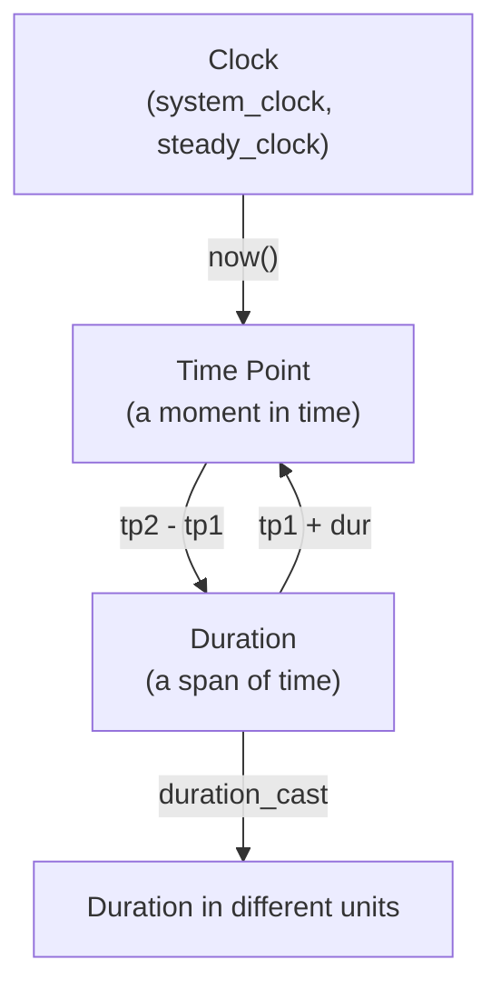
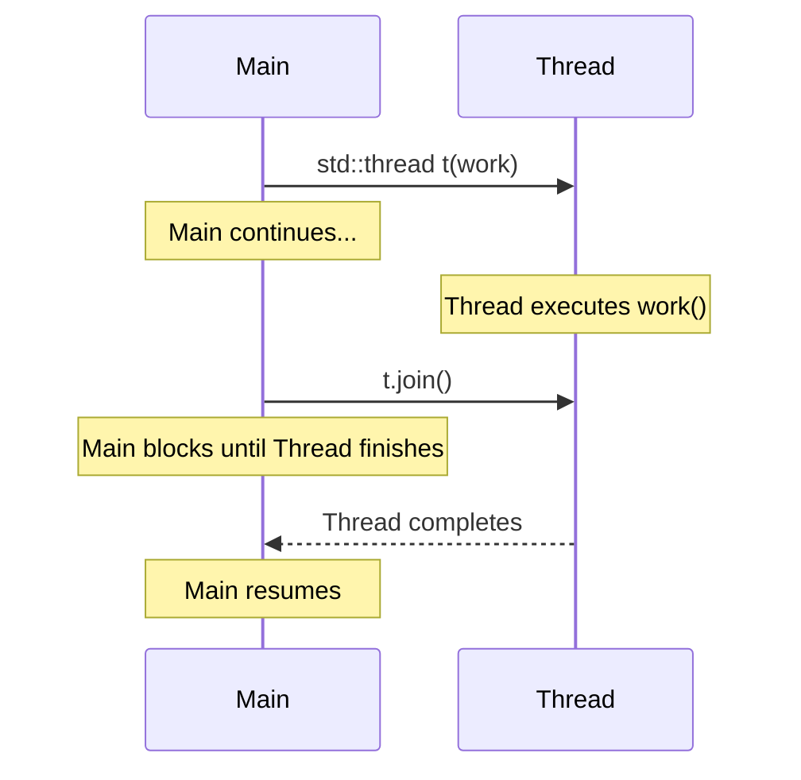
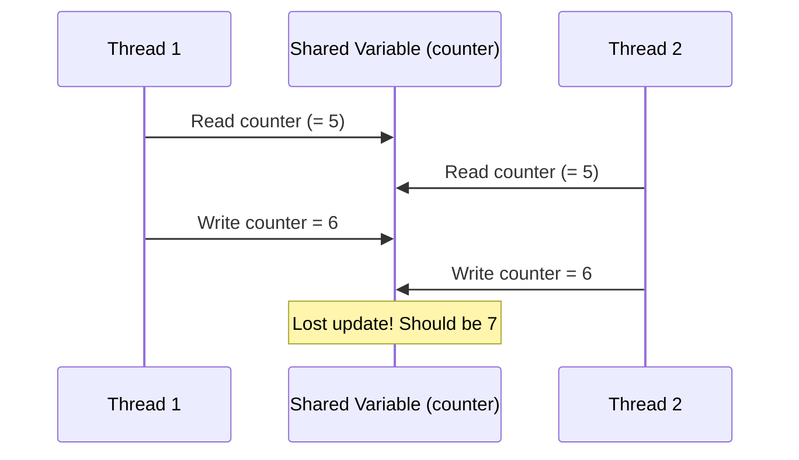
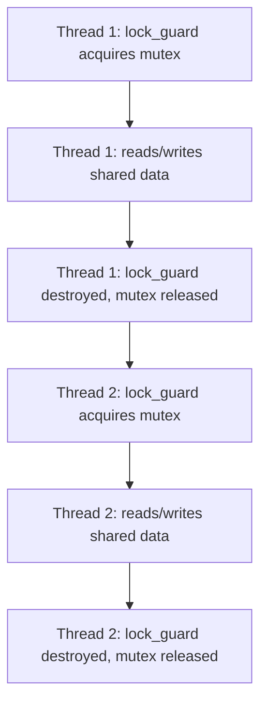

# Chrono & Multithreading

> The `<chrono>` library provides type-safe time handling that makes unit confusion impossible, while `<thread>` and `<mutex>` give you the fundamental building blocks for concurrent execution — and the discipline to use them without destroying your program with data races.

## Table of Contents
- [Core Concepts](#core-concepts)
- [Code Examples](#code-examples)
- [Common Pitfalls](#common-pitfalls)
- [Key Takeaways](#key-takeaways)
- [Exercises](#exercises)

## Core Concepts

### `<chrono>` — Type-Safe Time Representation

#### What

The `<chrono>` library (C++11) provides three core abstractions for working with time:

1. **Durations** — a span of time measured in some unit (e.g., 500 milliseconds, 3 seconds, 2 hours).
2. **Time points** — a specific moment in time relative to a clock's epoch (e.g., "3.5 seconds after the program started measuring").
3. **Clocks** — the source of time, defining the epoch and tick rate.

These three types work together: a time point is a clock's epoch plus a duration. The difference between two time points is a duration. Everything is encoded in the type system — you cannot accidentally add milliseconds to seconds without an explicit conversion.

#### How



Durations are parameterized by two things: the arithmetic type used for the count (usually `int64_t`) and the ratio representing the unit. The standard provides type aliases: `std::chrono::nanoseconds`, `milliseconds`, `seconds`, `minutes`, `hours`. Implicit conversion is safe only when it doesn't lose precision — seconds to milliseconds is implicit (multiply by 1000), but milliseconds to seconds requires an explicit `duration_cast` (because the fractional part would be lost).

#### Why It Matters

Before `<chrono>`, C++ inherited C's `time()` and `clock()` — functions that return raw integers with no type-level indication of the unit. Is the return value in seconds? Milliseconds? Microseconds? You have to read the documentation every time, and a unit mismatch silently compiles and silently gives wrong results.

`<chrono>` makes unit confusion a *compile error*. If you try to assign a `milliseconds` value to a `seconds` variable without casting, the code won't compile. This is the same philosophy as `enum class` over plain `enum` — encoding meaning in the type system so the compiler catches mistakes.

### Clocks: `system_clock` vs `steady_clock`

#### What

The two most important clocks are:

- **`std::chrono::system_clock`** — the wall clock. It represents real-world time (e.g., "February 28, 2026, 3:42 PM"). It can go backwards if the system time is adjusted (NTP sync, daylight saving, manual change). Use it when you need to display or log timestamps.

- **`std::chrono::steady_clock`** — a monotonic clock. It only moves forward, never adjusts, and ticks at a uniform rate. Use it for *measuring elapsed time* (benchmarking, timeouts, animation frames).

There's also `high_resolution_clock`, which is implementation-defined and may be an alias for either of the above. Don't use it — its behavior is unportable. Use `steady_clock` for measurement and `system_clock` for wall-clock time.

#### How

Both clocks provide a `now()` static method that returns a time point. The difference between two time points gives a duration. Converting that duration to a human-readable unit requires `duration_cast`.

```cpp
auto start = std::chrono::steady_clock::now();
// ... do work ...
auto end = std::chrono::steady_clock::now();
auto elapsed = std::chrono::duration_cast<std::chrono::milliseconds>(end - start);
```

#### Why It Matters

Using `system_clock` for benchmarking is a classic bug. If NTP adjusts the system clock mid-measurement, your elapsed time can be negative or wildly off. `steady_clock` is immune to this because it's monotonic — it only moves forward. This is why every performance measurement, timeout, and interval timer should use `steady_clock`.

The distinction between "what time is it?" (`system_clock`) and "how long did this take?" (`steady_clock`) is fundamental. They answer different questions and must use different clocks.

### Duration Arithmetic and Literals

#### What

Durations support arithmetic: addition, subtraction, multiplication by a scalar, division by a scalar, and modulo. You can also compare durations. C++14 introduced chrono literals (`1s`, `500ms`, `2h`), which make duration construction readable without verbose template syntax.

```cpp
using namespace std::chrono_literals;

auto timeout = 2s + 500ms;      // 2500 milliseconds
auto half = timeout / 2;        // 1250 milliseconds
bool urgent = timeout < 3s;     // true
```

#### How

Under the hood, durations are template instances: `std::chrono::duration<Rep, Period>`, where `Rep` is the storage type (e.g., `int64_t`) and `Period` is a `std::ratio` representing the tick period relative to one second. `milliseconds` is `duration<int64_t, std::milli>` (tick = 1/1000 second). `seconds` is `duration<int64_t, std::ratio<1>>` (tick = 1 second).

When you add `seconds` and `milliseconds`, the result type is `milliseconds` — the compiler automatically picks the finer resolution to avoid precision loss. When you need the coarser unit, you explicitly cast with `duration_cast`.

#### Why It Matters

Chrono literals transform time-related code from inscrutable template noise into something any engineer can read. Compare `std::chrono::duration<int, std::ratio<1>>(5)` with `5s`. They're identical, but one communicates intent and the other requires a template mental parser. Use the `std::chrono_literals` namespace in any code that works with time.

### Multithreading: `std::thread`

#### What

`std::thread` (C++11, from `<thread>`) represents a single thread of execution. You create a thread by passing a callable (function, lambda, functor) and its arguments to the constructor. The thread starts executing immediately upon construction.

Every `std::thread` must be either **joined** (the creating thread waits for it to finish) or **detached** (the thread runs independently until it completes) before the `std::thread` object is destroyed. If you destroy a joinable thread without doing either, `std::terminate` is called — your program crashes.

#### How



```cpp
std::thread t([] {
    // This runs in a separate thread
    do_expensive_computation();
});

// Main thread continues here, concurrently with t

t.join();  // Block until t finishes — REQUIRED before t is destroyed
```

#### Why It Matters

`std::thread` is a low-level primitive. It gives you direct control over thread lifetime, but it demands manual management. Forgetting to `join()` or `detach()` is a fatal error — not a leak, not a warning, but immediate program termination. This harsh consequence exists because a joinable thread holds resources (the OS thread, its stack), and destroying the `std::thread` object without joining would leave those resources in an ambiguous state.

In practice, you'll rarely use `std::thread` directly. Prefer `std::async` (covered below) for task-based concurrency, or use a thread pool. But understanding `std::thread` is essential because everything else is built on top of it.

### Data Races — The Fundamental Concurrency Bug

#### What

A **data race** occurs when two or more threads access the same memory location concurrently, at least one of them writes, and there is no synchronization between them. Data races are **undefined behavior** in C++ — not "you might get the wrong answer," but "the compiler is free to do anything, including optimizing away your code, reordering operations, or crashing."



#### How

The diagram above shows a **lost update** — both threads read the same value, increment it independently, and write back the same result. One increment is lost. But data races are worse than just lost updates. Because they're undefined behavior, the compiler is free to assume they never happen. This means the compiler can:

- Cache a shared variable in a register and never re-read it from memory.
- Reorder reads and writes around the unsynchronized access.
- Optimize away code paths that the compiler "proves" are unreachable (based on the assumption that UB doesn't occur).

The result is not just wrong values — it's code that behaves in ways that seem impossible when reading the source.

#### Why It Matters

Data races are the reason concurrent programming has a reputation for being hard. The bug is non-deterministic — it depends on exact thread scheduling, which varies between runs, machines, and optimization levels. A program might work perfectly in debug mode and crash in release mode because the optimizer reordered instructions. The only defense is proper synchronization: mutexes, atomics, or higher-level abstractions that guarantee one thread's access completes before another's begins.

### `std::mutex` and `std::lock_guard` — RAII for Locks

#### What

A **mutex** (mutual exclusion) is a synchronization primitive that ensures only one thread can access a protected resource at a time. `std::mutex` provides `lock()` and `unlock()` methods, but you should never call them directly. Instead, use `std::lock_guard` — an RAII wrapper that locks the mutex on construction and unlocks it on destruction.

```cpp
std::mutex mtx;
int shared_counter = 0;

void increment() {
    std::lock_guard<std::mutex> lock(mtx);  // locks mtx
    ++shared_counter;                        // safe — only one thread at a time
}   // lock_guard destructor unlocks mtx — even if an exception is thrown
```

#### How

`std::lock_guard` is a textbook example of RAII. It acquires the resource (the lock) in its constructor and releases it in its destructor. This guarantees the mutex is always unlocked, even if the protected code throws an exception. Without RAII, you'd need a `try/catch` around every critical section to ensure `unlock()` is called — and one missed path means a deadlock.

C++17 introduced `std::scoped_lock`, which can lock multiple mutexes simultaneously (preventing deadlocks from inconsistent lock ordering). Prefer `std::scoped_lock` over `std::lock_guard` in new C++17 code — it handles everything `lock_guard` does, plus multi-mutex locking.

```cpp
// C++17: std::scoped_lock with class template argument deduction (CTAD)
std::scoped_lock lock(mtx);  // no need to write std::scoped_lock<std::mutex>
```

#### Why It Matters

The mutex is the fundamental synchronization tool. Every other concurrency primitive — condition variables, semaphores, read-write locks — is built on top of mutexes. The RAII pattern (`lock_guard` / `scoped_lock`) is non-negotiable: manual `lock()` / `unlock()` calls are a guaranteed source of bugs. If any code path between `lock()` and `unlock()` throws, returns early, or `continue`s a loop, the mutex stays locked forever, and your program deadlocks.

### `std::async` and `std::future` — Task-Based Concurrency

#### What

`std::async` (from `<future>`) launches a task (a callable) that may run on a separate thread, and returns a `std::future` that holds the eventual result. The future provides a `get()` method that blocks until the result is available and returns it. If the task threw an exception, `get()` re-throws it in the calling thread.

This is **task-based** concurrency: you describe *what* to compute, and the runtime decides *how* to schedule it. Contrast this with `std::thread`, where you manage threads directly.

```cpp
auto future = std::async(std::launch::async, compute_expensive_thing, arg1, arg2);

// ... do other work while the computation runs ...

auto result = future.get();  // blocks until the result is ready
```

#### How

`std::async` accepts a launch policy:

- **`std::launch::async`** — the task is guaranteed to run on a new thread. Use this when you need true parallelism.
- **`std::launch::deferred`** — the task is not run until `future.get()` is called, and it runs on the calling thread. This is lazy evaluation.
- **`std::launch::async | std::launch::deferred`** (the default) — the implementation chooses. This is almost always wrong in practice because you can't predict whether the task runs concurrently or lazily.

Always specify `std::launch::async` explicitly when you want concurrency.

#### Why It Matters

`std::async` solves two problems that `std::thread` doesn't:

1. **Return values** — threads can't return values. You'd need shared state + a mutex + a condition variable to communicate the result. `std::future` handles all of this.
2. **Exception propagation** — if a thread throws an exception, it calls `std::terminate`. With `std::async`, exceptions are captured by the future and re-thrown when you call `get()`, allowing normal error handling.

`std::async` also handles thread lifetime automatically: you don't need to `join()` — the future's destructor waits for the task to complete (though this implicit blocking can itself be surprising — see Common Pitfalls).

### Protecting Shared State — Putting It All Together

#### What

The pattern for safe concurrent access is always the same:

1. Identify the **shared mutable state** — any variable that multiple threads read and at least one writes.
2. Protect it with a **mutex** — every access (read or write) to the shared state must hold the lock.
3. Keep the **critical section** (the code between lock and unlock) as small as possible — lock, do the minimum work, unlock.
4. Use **RAII** (`lock_guard` / `scoped_lock`) to manage the lock lifetime.

If you can avoid shared mutable state entirely (by using thread-local data, message passing, or `std::async` with futures), do so. The safest mutex is the one you don't need.

#### How



#### Why It Matters

The mental model is simple: **a mutex serializes access**. When thread 1 holds the lock, thread 2 blocks at the `lock_guard` constructor until thread 1's `lock_guard` is destroyed. This ensures that the shared data is always in a consistent state when any thread observes it. The cost is that the protected code runs sequentially, not in parallel — so keep critical sections small to maximize actual parallelism.

## Code Examples

### Benchmarking with `steady_clock`

```cpp
#include <algorithm>
#include <chrono>
#include <iostream>
#include <numeric>
#include <random>
#include <vector>

// A reusable RAII timer that prints elapsed time on destruction.
// This is a common pattern for benchmarking in production code.
class ScopedTimer {
public:
    explicit ScopedTimer(std::string label)
        : label_(std::move(label))
        , start_(std::chrono::steady_clock::now()) {}

    ~ScopedTimer() {
        const auto end = std::chrono::steady_clock::now();
        const auto elapsed =
            std::chrono::duration_cast<std::chrono::microseconds>(end - start_);
        std::cout << label_ << ": " << elapsed.count() << " us\n";
    }

    // Non-copyable, non-movable — this timer owns its measurement scope
    ScopedTimer(const ScopedTimer&) = delete;
    ScopedTimer& operator=(const ScopedTimer&) = delete;

private:
    std::string label_;
    std::chrono::steady_clock::time_point start_;
};

int main() {
    // Generate a large random dataset
    constexpr int N = 1'000'000;
    std::vector<int> data(N);
    std::mt19937 rng(42);  // fixed seed for reproducibility
    std::generate(data.begin(), data.end(), rng);

    // Benchmark sorting
    {
        auto to_sort = data;  // copy — don't modify the original
        ScopedTimer timer("std::sort (1M ints)");
        std::sort(to_sort.begin(), to_sort.end());
    }

    // Benchmark partial_sort (top 100)
    {
        auto to_sort = data;
        ScopedTimer timer("std::partial_sort (top 100 of 1M)");
        std::partial_sort(to_sort.begin(), to_sort.begin() + 100, to_sort.end(),
                          std::greater<>{});
    }

    // Benchmark accumulate
    {
        ScopedTimer timer("std::accumulate (1M ints)");
        // Use volatile to prevent the compiler from optimizing away the result
        volatile auto sum = std::accumulate(data.begin(), data.end(), 0LL);
        (void)sum;
    }

    // Duration arithmetic demonstration
    using namespace std::chrono_literals;
    const auto timeout = 2s + 500ms;
    const auto half_timeout = timeout / 2;

    std::cout << "\nDuration arithmetic:\n";
    std::cout << "  Timeout: "
              << std::chrono::duration_cast<std::chrono::milliseconds>(timeout).count()
              << " ms\n";
    std::cout << "  Half: "
              << std::chrono::duration_cast<std::chrono::milliseconds>(half_timeout).count()
              << " ms\n";

    return 0;
}
```

### Basic Threading with `std::thread` and `std::mutex`

```cpp
#include <iostream>
#include <mutex>
#include <numeric>
#include <thread>
#include <vector>

// Shared state: a counter and its protecting mutex.
// Rule: NEVER access shared_counter without holding counter_mutex.
struct SharedCounter {
    std::mutex mutex;
    int value = 0;
};

// Each thread increments the counter `iterations` times.
void increment_counter(SharedCounter& counter, int iterations) {
    for (int i = 0; i < iterations; ++i) {
        // lock_guard: RAII lock — acquired here, released at end of scope.
        // This ensures the mutex is always released, even if an exception
        // is thrown (though ++int won't throw, the habit matters).
        std::lock_guard<std::mutex> lock(counter.mutex);
        ++counter.value;
    }
}

int main() {
    SharedCounter counter;
    constexpr int NUM_THREADS = 4;
    constexpr int ITERATIONS_PER_THREAD = 100'000;

    // Launch threads
    std::vector<std::thread> threads;
    threads.reserve(NUM_THREADS);

    for (int i = 0; i < NUM_THREADS; ++i) {
        // std::ref is required because std::thread copies its arguments by default.
        // Without std::ref, each thread would get its own copy of the counter.
        threads.emplace_back(increment_counter, std::ref(counter), ITERATIONS_PER_THREAD);
    }

    // Join all threads — MUST happen before the threads vector is destroyed
    for (auto& t : threads) {
        t.join();
    }

    const int expected = NUM_THREADS * ITERATIONS_PER_THREAD;
    std::cout << "Expected: " << expected << '\n';
    std::cout << "Actual:   " << counter.value << '\n';
    std::cout << (counter.value == expected ? "PASS" : "FAIL") << '\n';

    return 0;
}
```

### Task-Based Concurrency with `std::async` and `std::future`

```cpp
#include <chrono>
#include <cmath>
#include <future>
#include <iostream>
#include <numeric>
#include <vector>

// Simulate an expensive computation: sum of squares over a range.
// This is a pure function — no shared state, no mutex needed.
[[nodiscard]] double sum_of_squares(const std::vector<double>& data,
                                     std::size_t start, std::size_t end) {
    double sum = 0.0;
    for (std::size_t i = start; i < end; ++i) {
        sum += data[i] * data[i];
    }
    return sum;
}

// Parallel sum-of-squares using std::async to split work across threads.
// Each chunk runs independently — no shared mutable state, no locks.
[[nodiscard]] double parallel_sum_of_squares(const std::vector<double>& data,
                                              int num_tasks) {
    const auto chunk_size = data.size() / num_tasks;
    std::vector<std::future<double>> futures;
    futures.reserve(num_tasks);

    for (int i = 0; i < num_tasks; ++i) {
        const auto start = i * chunk_size;
        const auto end = (i == num_tasks - 1) ? data.size() : (i + 1) * chunk_size;

        // std::launch::async guarantees a new thread.
        // Each task gets a const reference to data (read-only) and its own
        // start/end range — no overlap, no shared mutable state.
        futures.push_back(std::async(std::launch::async,
            sum_of_squares, std::cref(data), start, end));
    }

    // Collect results — get() blocks until each task completes.
    // If any task threw an exception, get() re-throws it here.
    double total = 0.0;
    for (auto& f : futures) {
        total += f.get();
    }
    return total;
}

int main() {
    // Generate test data
    constexpr int N = 10'000'000;
    std::vector<double> data(N);
    std::iota(data.begin(), data.end(), 1.0);  // 1.0, 2.0, ..., N

    using Clock = std::chrono::steady_clock;

    // Sequential
    auto t1 = Clock::now();
    const double seq_result = sum_of_squares(data, 0, data.size());
    auto t2 = Clock::now();

    // Parallel (4 tasks)
    auto t3 = Clock::now();
    const double par_result = parallel_sum_of_squares(data, 4);
    auto t4 = Clock::now();

    auto ms = [](auto duration) {
        return std::chrono::duration_cast<std::chrono::milliseconds>(duration).count();
    };

    std::cout << "Sequential: " << seq_result << " in " << ms(t2 - t1) << " ms\n";
    std::cout << "Parallel:   " << par_result << " in " << ms(t4 - t3) << " ms\n";
    std::cout << "Results match: " << std::boolalpha
              << (std::abs(seq_result - par_result) < 1e-6) << '\n';

    return 0;
}
```

### Thread-Safe Container Access Pattern

```cpp
#include <algorithm>
#include <iostream>
#include <mutex>
#include <string>
#include <thread>
#include <vector>

// A thread-safe log buffer.
// The pattern: private mutex + private data, public methods that lock before access.
// Callers never touch the mutex directly — the class encapsulates synchronization.
class ThreadSafeLog {
public:
    void append(std::string message) {
        // scoped_lock is the C++17 replacement for lock_guard.
        // It supports locking multiple mutexes simultaneously (not needed here,
        // but good practice to use it as the default).
        std::scoped_lock lock(mutex_);
        entries_.push_back(std::move(message));
    }

    // Return a snapshot — a copy of the log at this moment.
    // The lock is held only during the copy, not while the caller processes it.
    [[nodiscard]] std::vector<std::string> snapshot() const {
        std::scoped_lock lock(mutex_);
        return entries_;
    }

    [[nodiscard]] std::size_t size() const {
        std::scoped_lock lock(mutex_);
        return entries_.size();
    }

private:
    mutable std::mutex mutex_;  // mutable: lockable even in const methods
    std::vector<std::string> entries_;
};

void worker(ThreadSafeLog& log, int worker_id, int num_messages) {
    for (int i = 0; i < num_messages; ++i) {
        log.append("Worker " + std::to_string(worker_id) +
                   ": message " + std::to_string(i));
    }
}

int main() {
    ThreadSafeLog log;
    constexpr int NUM_WORKERS = 4;
    constexpr int MESSAGES_PER_WORKER = 50;

    std::vector<std::thread> workers;
    workers.reserve(NUM_WORKERS);

    for (int i = 0; i < NUM_WORKERS; ++i) {
        workers.emplace_back(worker, std::ref(log), i, MESSAGES_PER_WORKER);
    }

    for (auto& w : workers) {
        w.join();
    }

    const auto entries = log.snapshot();
    std::cout << "Total log entries: " << entries.size() << '\n';
    std::cout << "Expected: " << NUM_WORKERS * MESSAGES_PER_WORKER << '\n';

    // Print the last 5 entries to show interleaving
    std::cout << "\nLast 5 entries:\n";
    for (std::size_t i = entries.size() - 5; i < entries.size(); ++i) {
        std::cout << "  " << entries[i] << '\n';
    }

    return 0;
}
```

## Common Pitfalls

### Using `system_clock` for benchmarking

```cpp
// BAD — system_clock can go backwards (NTP adjustment, DST change)
#include <chrono>
#include <iostream>
#include <thread>

int main() {
    auto start = std::chrono::system_clock::now();

    std::this_thread::sleep_for(std::chrono::milliseconds(100));

    auto end = std::chrono::system_clock::now();
    auto elapsed = std::chrono::duration_cast<std::chrono::milliseconds>(end - start);

    // If the system clock was adjusted between start and end (NTP sync,
    // manual change), elapsed could be negative or wildly wrong.
    std::cout << "Elapsed: " << elapsed.count() << " ms\n";
    return 0;
}
```

`system_clock` represents wall-clock time, which can be adjusted by the OS at any moment. An NTP synchronization can jump the clock forward or backward by milliseconds to seconds. For measuring elapsed time, this clock is unreliable.

```cpp
// GOOD — steady_clock is monotonic, never goes backwards
#include <chrono>
#include <iostream>
#include <thread>

int main() {
    auto start = std::chrono::steady_clock::now();

    std::this_thread::sleep_for(std::chrono::milliseconds(100));

    auto end = std::chrono::steady_clock::now();
    auto elapsed = std::chrono::duration_cast<std::chrono::milliseconds>(end - start);

    // steady_clock is guaranteed monotonic — elapsed is always non-negative.
    std::cout << "Elapsed: " << elapsed.count() << " ms\n";
    return 0;
}
```

### Forgetting to join or detach a `std::thread`

```cpp
// BAD — destroying a joinable thread calls std::terminate
#include <iostream>
#include <thread>

void do_work() {
    std::cout << "Working...\n";
}

int main() {
    std::thread t(do_work);

    // If an exception were thrown here, or we simply forget to join,
    // the thread destructor calls std::terminate — program crashes.
    // Even without an exception, this code is wrong as-is.

    return 0;
    // ~thread() is called here. t is still joinable → std::terminate!
}
```

A `std::thread` object that is joinable (not yet joined or detached) will call `std::terminate` in its destructor. This is intentional — it forces you to be explicit about the thread's lifetime.

```cpp
// GOOD — always join (or detach) before the thread object is destroyed
#include <iostream>
#include <thread>

void do_work() {
    std::cout << "Working...\n";
}

int main() {
    std::thread t(do_work);

    // Option A: join — wait for the thread to finish
    t.join();

    // Option B (not shown): detach — let the thread run independently
    // t.detach();  // Use only when you truly don't need to wait

    return 0;
}
```

### Data race from unprotected shared state

```cpp
// BAD — two threads incrementing a shared counter without synchronization
#include <iostream>
#include <thread>

int counter = 0;  // shared mutable state — unprotected!

void increment(int n) {
    for (int i = 0; i < n; ++i) {
        ++counter;  // DATA RACE: read-modify-write is not atomic.
                    // This is undefined behavior, not just "wrong answer."
    }
}

int main() {
    std::thread t1(increment, 1'000'000);
    std::thread t2(increment, 1'000'000);

    t1.join();
    t2.join();

    // Expected: 2,000,000. Actual: unpredictable (often less).
    // Worse: the compiler can assume no data races exist, so it may
    // optimize this in ways that produce even more bizarre results.
    std::cout << "Counter: " << counter << '\n';
    return 0;
}
```

`++counter` is not a single operation — it's a read, increment, and write. Two threads can interleave these sub-operations, losing updates. Because C++ defines this as undefined behavior, the compiler can also make assumptions that break the code in non-obvious ways (e.g., caching the counter in a register and never re-reading from memory).

```cpp
// GOOD — protect shared state with a mutex
#include <iostream>
#include <mutex>
#include <thread>

int counter = 0;
std::mutex counter_mutex;

void increment(int n) {
    for (int i = 0; i < n; ++i) {
        std::lock_guard<std::mutex> lock(counter_mutex);
        ++counter;
    }
}

int main() {
    std::thread t1(increment, 1'000'000);
    std::thread t2(increment, 1'000'000);

    t1.join();
    t2.join();

    // Now guaranteed to be exactly 2,000,000.
    std::cout << "Counter: " << counter << '\n';
    return 0;
}
```

### Ignoring the `std::future` from `std::async`

```cpp
// BAD — discarding the future causes the destructor to block
#include <chrono>
#include <future>
#include <iostream>
#include <thread>

void slow_task() {
    std::this_thread::sleep_for(std::chrono::seconds(3));
    std::cout << "Task complete\n";
}

int main() {
    // The returned future is not stored — it's a temporary that is
    // immediately destroyed. The future's destructor blocks until the
    // task completes, making this call synchronous, not asynchronous!
    std::async(std::launch::async, slow_task);

    // This line doesn't execute until slow_task finishes.
    // The programmer expected fire-and-forget, but got blocking.
    std::cout << "After async call\n";

    return 0;
}
```

When a `std::future` returned by `std::async` is destroyed without calling `get()`, its destructor blocks until the task completes. If you discard the future (don't assign it to a variable), the temporary is destroyed at the end of the statement — making the "async" call effectively synchronous.

```cpp
// GOOD — store the future and call get() when you need the result
#include <chrono>
#include <future>
#include <iostream>
#include <thread>

void slow_task() {
    std::this_thread::sleep_for(std::chrono::seconds(3));
    std::cout << "Task complete\n";
}

int main() {
    // Store the future — the task runs asynchronously
    auto future = std::async(std::launch::async, slow_task);

    // This executes immediately, while slow_task runs in the background
    std::cout << "After async call — doing other work\n";

    // Block when we actually need the task to be done
    future.get();

    std::cout << "All done\n";
    return 0;
}
```

### Locking a mutex manually without RAII

```cpp
// BAD — manual lock/unlock is not exception-safe
#include <mutex>
#include <stdexcept>
#include <vector>

std::mutex mtx;
std::vector<int> shared_data;

void process(int value) {
    mtx.lock();

    shared_data.push_back(value);

    if (value < 0) {
        // If we throw here, mtx.unlock() never runs → deadlock!
        throw std::runtime_error("negative value");
    }

    mtx.unlock();  // Skipped if the exception fires above
}
```

Manual `lock()` / `unlock()` calls are brittle. Any early return, `continue`, `break`, or exception between them leaves the mutex locked forever. Other threads that try to acquire the mutex will block indefinitely — a deadlock.

```cpp
// GOOD — lock_guard / scoped_lock guarantees unlock via RAII
#include <mutex>
#include <stdexcept>
#include <vector>

std::mutex mtx;
std::vector<int> shared_data;

void process(int value) {
    std::lock_guard<std::mutex> lock(mtx);  // locks here

    shared_data.push_back(value);

    if (value < 0) {
        throw std::runtime_error("negative value");
        // lock_guard destructor runs during stack unwinding → mutex unlocked
    }
}   // lock_guard destructor runs → mutex unlocked (normal path)
```

## Key Takeaways

- **Use `steady_clock` for measuring elapsed time, `system_clock` for wall-clock timestamps** — `system_clock` can jump backwards due to NTP adjustments, making it unsuitable for benchmarking or timeouts. `steady_clock` is monotonic by guarantee.
- **A data race is undefined behavior, not just a wrong answer** — the compiler assumes data races never occur, and it optimizes based on that assumption. Two threads touching the same memory without synchronization can produce arbitrarily broken behavior.
- **Always use `lock_guard` or `scoped_lock` for mutexes — never manual `lock()` / `unlock()`** — RAII guarantees the mutex is released on every code path (normal return, early return, exception), eliminating an entire class of deadlock bugs.
- **Prefer `std::async` over raw `std::thread`** for task-based work — `std::async` handles return values, exception propagation, and thread lifecycle automatically. Reserve `std::thread` for when you need explicit control over thread lifetime.
- **The safest concurrency is no shared mutable state** — if each thread works on its own data and results are combined at the end (the `std::async` + `std::future` pattern), you don't need mutexes at all. Design for isolation first; add synchronization only when you must.

## Exercises

1. Write a `ScopedTimer` class that measures elapsed time using `steady_clock` and prints the duration in a human-friendly format (e.g., "1234 us", "5 ms", "2.3 s") when it goes out of scope. Use it to benchmark `std::sort` on vectors of 1000, 10000, and 100000 elements.

2. Explain the difference between `system_clock` and `steady_clock`. Give a concrete scenario where using `system_clock` to measure elapsed time would produce a wrong result. Why can't the standard guarantee that `system_clock` is monotonic?

3. Write a program that demonstrates a data race: two threads each increment a shared `int` counter 1,000,000 times without synchronization. Run it multiple times and observe the inconsistent results. Then fix it using a `std::mutex` and `std::lock_guard`. Explain why `++counter` is not atomic even though it looks like a single operation.

4. Rewrite the data-race program from exercise 3 using `std::async` instead of `std::thread`. Each async task should compute its partial count independently (no shared state) and return the result via `std::future`. The main thread sums the results. Explain why this approach is inherently safer than shared-state concurrency.

5. A colleague writes this code:
   ```cpp
   std::mutex mtx;
   void transfer(BankAccount& from, BankAccount& to, double amount) {
       std::lock_guard<std::mutex> lock1(from.mutex);
       std::lock_guard<std::mutex> lock2(to.mutex);
       from.balance -= amount;
       to.balance += amount;
   }
   ```
   Explain the deadlock scenario that can occur when two threads call `transfer(a, b, 100)` and `transfer(b, a, 50)` simultaneously. How does `std::scoped_lock` solve this problem?

---
up:: [Schedule](../../Schedule.md)
#type/learning #source/self-study #status/evergreen
