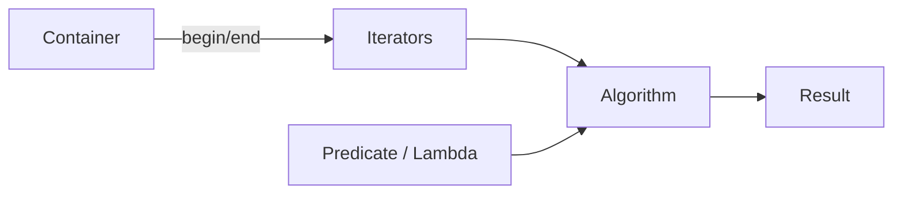

# STL Algorithms

> The `<algorithm>` header provides a vocabulary of reusable, composable operations on sequences — mastering them replaces hundreds of hand-written loops with battle-tested, optimized, and intention-revealing code.

## Table of Contents
- [Core Concepts](#core-concepts)
- [Code Examples](#code-examples)
- [Common Pitfalls](#common-pitfalls)
- [Key Takeaways](#key-takeaways)
- [Exercises](#exercises)

## Core Concepts

### The Philosophy Behind STL Algorithms

#### What

STL algorithms are free functions in `<algorithm>` (and `<numeric>`) that operate on iterator ranges, not on specific containers. Instead of writing a loop to find an element in a vector, you call `std::find`. Instead of writing a loop to transform every element, you call `std::transform`. The standard library ships roughly 100 algorithms, and together they cover nearly every common operation on sequences.

#### How

Every algorithm follows the same pattern: it takes a pair of iterators `[first, last)` defining a half-open range, plus optional predicates or output iterators. This decoupling from containers is the entire point — `std::sort` doesn't know whether it's sorting a `vector`, a `deque`, or a raw array. It only needs random-access iterators.



#### Why It Matters

Hand-written loops are a maintenance liability. They require the reader to mentally execute the loop to understand *what* it does. An algorithm call like `std::find_if(v.begin(), v.end(), is_expired)` communicates intent immediately — you know it's a linear search with a predicate. This is not just stylistic preference. Algorithms are typically implemented with platform-specific optimizations (vectorized `std::copy`, `memcmp`-based `std::equal` for trivial types) that your hand-written loop won't match. They're also correct by construction — no off-by-one errors, no iterator invalidation, no forgotten edge cases.

The STL algorithms embody a principle that matters throughout your career: **name your operations**. When you see a raw loop, the first question should be "which algorithm does this loop implement?"

### Searching: `std::find` and `std::find_if`

#### What

`std::find` performs a linear search for a specific value. `std::find_if` searches for the first element satisfying a predicate. Both return an iterator to the found element, or `last` if nothing matches.

```cpp
auto it = std::find(v.begin(), v.end(), 42);          // find by value
auto it = std::find_if(v.begin(), v.end(), pred);      // find by predicate
```

#### How

`std::find` compares each element with `operator==`. `std::find_if` calls your predicate on each element and stops at the first one that returns `true`. The complexity is O(n) — there's no way to do better on an unsorted sequence without additional data structures.

For sorted ranges, prefer `std::lower_bound` or `std::binary_search` (O(log n)). For hash-based containers like `std::unordered_map`, use the container's `.find()` method (O(1) amortized). Choosing the right search strategy is one of the most impactful performance decisions you'll make.

#### Why It Matters

The return type is an iterator, not a boolean. This is a deliberate design choice — if you just need to know whether an element exists, you check `it != v.end()`. But if you also need the element (or its position), you already have it. This dual-purpose return value avoids searching twice.

### Transforming: `std::transform`

#### What

`std::transform` applies a function to every element in a range and writes the results to an output range. It's the STL's equivalent of "map" in functional programming. It comes in two forms: unary (one input range) and binary (two input ranges combined element-wise).

```cpp
// Unary: apply f to each element of [first, last), write to output
std::transform(first, last, output, f);

// Binary: combine elements from two ranges with f, write to output
std::transform(first1, last1, first2, output, f);
```

#### How

The output iterator can point to the same range as the input (in-place transformation) or to a different container. When writing to a different container, you must ensure the destination has enough space — either by pre-sizing it or by using `std::back_inserter`.

#### Why It Matters

`std::transform` replaces the most common loop pattern in programming: "for each element, compute something and store the result." It makes the intent explicit and separates *what* you're computing (the lambda or function) from *how* iteration works. This separation is the foundation of the functional style that C++20 ranges build upon.

### Accumulating: `std::accumulate`

#### What

`std::accumulate` (from `<numeric>`) reduces a range to a single value by repeatedly applying a binary operation. The simplest case is summing — but by providing a custom operation, you can compute products, concatenate strings, or build any accumulated result.

```cpp
// Sum: init + v[0] + v[1] + ... + v[n-1]
auto sum = std::accumulate(v.begin(), v.end(), 0);

// Custom: apply binary_op(accumulated, current_element) repeatedly
auto product = std::accumulate(v.begin(), v.end(), 1, std::multiplies<>{});
```

#### How

`std::accumulate` takes an initial value and an optional binary operation (defaulting to `+`). It walks the range left to right, folding each element into the accumulator. The type of the initial value determines the accumulator type — this is a common source of bugs (see Common Pitfalls).

In C++17, `std::reduce` offers the same functionality but permits out-of-order execution, making it compatible with parallel execution policies. Use `std::accumulate` when the operation order matters (e.g., floating-point addition, where order affects precision) and `std::reduce` when it doesn't.

#### Why It Matters

Summing a range is the most frequently hand-written loop after searching. `std::accumulate` replaces it with a single, intention-revealing call. But its real power is the generalized form: any left fold over a sequence can be expressed as `std::accumulate` with a custom binary operation. Computing an average, building a histogram, flattening nested containers — all are instances of accumulation.

### Filtering: `std::remove_if` and the Erase-Remove Idiom

#### What

`std::remove_if` doesn't actually remove anything from a container. It *partitions* the range by moving elements that satisfy the predicate to the end, and returns an iterator to the new logical end. You then call `.erase()` on the container to actually shrink it. This two-step process is called the **erase-remove idiom**.

```cpp
// Step 1: move unwanted elements to the end, get new logical end
auto new_end = std::remove_if(v.begin(), v.end(), predicate);

// Step 2: actually erase them from the container
v.erase(new_end, v.end());
```

#### How

The reason `std::remove_if` can't actually erase elements is that it operates on iterators, not containers. It has no way to call `.erase()` — it doesn't even know what container the iterators belong to. This is a consequence of the STL's deliberate separation between algorithms and containers. The algorithm modifies the sequence *through* iterators; the container manages its own memory.

In C++20, `std::erase_if(container, predicate)` wraps both steps into a single call. Until then, the idiom is the standard pattern.

#### Why It Matters

Forgetting the `.erase()` step is one of the most common STL bugs — your container still has the same size, but the "removed" elements are in an unspecified state at the end. Understanding *why* the idiom exists (algorithms don't know about containers) deepens your understanding of the entire STL architecture.

### Sorting: `std::sort` and `std::stable_sort`

#### What

`std::sort` sorts a range in-place using `operator<` by default (ascending order). You can provide a custom comparator for different orderings. `std::stable_sort` preserves the relative order of equivalent elements — `std::sort` does not guarantee this.

```cpp
std::sort(v.begin(), v.end());                         // ascending by <
std::sort(v.begin(), v.end(), std::greater<>{});       // descending
std::sort(v.begin(), v.end(), [](const auto& a, const auto& b) {
    return a.priority > b.priority;                    // custom comparator
});
```

#### How

`std::sort` requires random-access iterators, which means it works on `vector`, `deque`, and raw arrays, but not on `list` or `set` (use their `.sort()` member function or rely on their inherent ordering). The typical implementation is introsort — a hybrid of quicksort, heapsort, and insertion sort that guarantees O(n log n) worst case.

`std::stable_sort` uses merge sort internally, which requires O(n) extra memory. Use it when the relative order of equivalent elements matters (e.g., sorting database records by one field while preserving a previous sort by another field).

#### Why It Matters

Sorting is one of the most performance-critical operations in software. `std::sort` is almost always faster than anything you'd write by hand — it uses cache-friendly access patterns, falls back to insertion sort for small ranges, and the implementation is tuned per platform. Writing your own sort in production is a red flag in a code review.

### Partitioning: `std::partition` and `std::stable_partition`

#### What

`std::partition` rearranges elements so that all elements satisfying a predicate come before those that don't. It returns an iterator to the partition point — the first element that doesn't satisfy the predicate. `std::stable_partition` preserves relative order within each group.

```cpp
auto pivot = std::partition(v.begin(), v.end(), [](int n) {
    return n % 2 == 0;  // evens first
});
// [v.begin(), pivot): even elements
// [pivot, v.end()):   odd elements
```

#### How

`std::partition` runs in O(n) time with O(1) extra space. `std::stable_partition` runs in O(n) time if extra memory is available, O(n log n) otherwise. The related algorithm `std::partition_point` does a binary search on an already-partitioned range, finding the partition point in O(log n).

#### Why It Matters

Partitioning is more common than sorting in practice. Quicksort is built on partition. Splitting data into "pass/fail" categories, separating valid from invalid input, moving high-priority tasks to the front — these are all partitions. When you only need to separate elements into two groups without fully sorting each group, `std::partition` is faster than `std::sort` and communicates intent more precisely.

### Algorithm Composability

#### What

Individual algorithms are building blocks. Real-world data processing usually requires chaining multiple algorithms: filter, then transform, then accumulate. In C++17, you compose algorithms by calling them sequentially, passing output ranges between steps. In C++20, ranges and views make this composable with the pipe (`|`) operator, but we'll focus on the C++17 approach.

#### How

The typical pattern is:

1. **Filter** — use `std::copy_if` (not `std::remove_if`, which is in-place) to select elements into a new container.
2. **Transform** — use `std::transform` to map the filtered elements.
3. **Reduce** — use `std::accumulate` to collapse to a single value.

Each step produces output that feeds into the next. The intermediate containers are the glue. This is verbose compared to ranges, but it's explicit and works in C++17.

An alternative approach avoids intermediate containers by combining filter and transform logic into a single `std::transform` or `std::accumulate` call with a more complex lambda. This is a tradeoff between clarity and efficiency.

#### Why It Matters

Algorithm composability is the STL's answer to the question "how do I express complex data pipelines?" Learning to decompose a problem into a sequence of standard algorithms is the single most valuable skill for writing clean, bug-free C++ code. When you see a 20-line loop, the instinct should be: "Can I express this as two or three algorithm calls?" Usually, yes. C++20 ranges will make this even more natural, but the *thinking* — decomposing problems into filter/transform/reduce — is what you learn now.

## Code Examples

### Searching and Finding Elements

```cpp
#include <algorithm>
#include <iostream>
#include <string>
#include <vector>

struct Employee {
    std::string name;
    int department_id;
    double salary;
};

int main() {
    const std::vector<Employee> team = {
        {"Alice",   1, 95000.0},
        {"Bob",     2, 87000.0},
        {"Charlie", 1, 72000.0},
        {"Diana",   3, 105000.0},
        {"Eve",     2, 91000.0},
    };

    // find_if: locate the first employee in department 2
    // Returns an iterator — check against end() before dereferencing.
    const auto it = std::find_if(team.begin(), team.end(),
        [](const Employee& e) { return e.department_id == 2; });

    if (it != team.end()) {
        std::cout << "First in dept 2: " << it->name
                  << " ($" << it->salary << ")\n";
    }

    // count_if: how many employees earn above 90k?
    const auto high_earners = std::count_if(team.begin(), team.end(),
        [](const Employee& e) { return e.salary > 90000.0; });

    std::cout << "Employees earning >$90k: " << high_earners << '\n';

    // any_of / all_of / none_of: boolean queries over the range.
    // These short-circuit — they stop as soon as the answer is determined.
    const bool has_dept_3 = std::any_of(team.begin(), team.end(),
        [](const Employee& e) { return e.department_id == 3; });

    const bool all_above_60k = std::all_of(team.begin(), team.end(),
        [](const Employee& e) { return e.salary > 60000.0; });

    std::cout << "Has dept 3: " << std::boolalpha << has_dept_3 << '\n';
    std::cout << "All above $60k: " << all_above_60k << '\n';

    return 0;
}
```

### Transform, Accumulate, and Composability

```cpp
#include <algorithm>
#include <iostream>
#include <iterator>
#include <numeric>
#include <string>
#include <vector>

struct Product {
    std::string name;
    double price;
    int quantity;
};

// Compute the total inventory value of products above a price threshold.
// This demonstrates composing filter + transform + reduce in C++17.
[[nodiscard]] double total_value_above(const std::vector<Product>& products,
                                       double min_price) {
    // Step 1: Filter — copy products above the threshold into a temp vector.
    // Using copy_if (not remove_if) because we want a new container, not in-place mutation.
    std::vector<Product> expensive;
    std::copy_if(products.begin(), products.end(), std::back_inserter(expensive),
        [min_price](const Product& p) { return p.price >= min_price; });

    // Step 2: Transform — compute the value (price * quantity) of each filtered product.
    std::vector<double> values;
    values.reserve(expensive.size());
    std::transform(expensive.begin(), expensive.end(), std::back_inserter(values),
        [](const Product& p) { return p.price * p.quantity; });

    // Step 3: Reduce — sum all the values.
    // Initial value is 0.0 (double), not 0 (int) — this matters for the return type.
    return std::accumulate(values.begin(), values.end(), 0.0);
}

// Alternative: compose everything into a single accumulate call.
// More efficient (no intermediate containers) but slightly less readable.
[[nodiscard]] double total_value_above_compact(const std::vector<Product>& products,
                                                double min_price) {
    return std::accumulate(products.begin(), products.end(), 0.0,
        [min_price](double acc, const Product& p) {
            // Combine filter + transform + reduce in one lambda
            return (p.price >= min_price) ? acc + (p.price * p.quantity) : acc;
        });
}

int main() {
    const std::vector<Product> inventory = {
        {"Widget",    25.00, 100},
        {"Gadget",    75.50,  30},
        {"Doohickey", 12.00, 200},
        {"Thingamajig", 150.00, 10},
        {"Whatchamacallit", 50.00, 50},
    };

    const double threshold = 50.0;

    const double total_staged = total_value_above(inventory, threshold);
    const double total_compact = total_value_above_compact(inventory, threshold);

    std::cout << "Total value of products >= $" << threshold << ":\n";
    std::cout << "  Staged:  $" << total_staged << '\n';
    std::cout << "  Compact: $" << total_compact << '\n';

    // Demonstrate transform for in-place modification.
    // Apply a 10% discount to all products.
    std::vector<Product> sale_inventory = inventory;
    std::transform(sale_inventory.begin(), sale_inventory.end(),
                   sale_inventory.begin(),  // output = same range = in-place
        [](Product p) {
            p.price *= 0.90;
            return p;
        });

    std::cout << "\nSale prices:\n";
    for (const auto& p : sale_inventory) {
        std::cout << "  " << p.name << ": $" << p.price << '\n';
    }

    return 0;
}
```

### Erase-Remove Idiom, Sorting, and Partitioning

```cpp
#include <algorithm>
#include <iostream>
#include <string>
#include <vector>

struct Task {
    std::string name;
    int priority;       // higher = more urgent
    bool completed;
};

// Helper for printing a task list
void print_tasks(const std::string& label, const std::vector<Task>& tasks) {
    std::cout << label << ":\n";
    for (const auto& t : tasks) {
        std::cout << "  [" << (t.completed ? "X" : " ") << "] "
                  << t.name << " (priority " << t.priority << ")\n";
    }
}

int main() {
    std::vector<Task> tasks = {
        {"Write unit tests",     3, false},
        {"Fix login bug",        5, false},
        {"Update README",        1, true},
        {"Refactor auth module", 4, false},
        {"Deploy to staging",    2, true},
        {"Code review PR #42",   3, false},
    };

    print_tasks("All tasks", tasks);

    // --- Erase-Remove Idiom: remove completed tasks ---
    // Step 1: remove_if moves completed tasks to the end, returns new logical end
    // Step 2: erase actually removes them from the vector
    tasks.erase(
        std::remove_if(tasks.begin(), tasks.end(),
            [](const Task& t) { return t.completed; }),
        tasks.end());

    print_tasks("\nAfter removing completed", tasks);

    // --- Sort by priority (descending) ---
    std::sort(tasks.begin(), tasks.end(),
        [](const Task& a, const Task& b) {
            return a.priority > b.priority;  // higher priority first
        });

    print_tasks("\nSorted by priority (high to low)", tasks);

    // --- Partition: separate high-priority (>= 4) from the rest ---
    // stable_partition preserves relative order within each group
    const auto partition_point = std::stable_partition(
        tasks.begin(), tasks.end(),
        [](const Task& t) { return t.priority >= 4; });

    std::cout << "\nPartitioned (urgent | normal):\n";
    std::cout << "  Urgent:\n";
    for (auto it = tasks.begin(); it != partition_point; ++it) {
        std::cout << "    " << it->name << " (priority " << it->priority << ")\n";
    }
    std::cout << "  Normal:\n";
    for (auto it = partition_point; it != tasks.end(); ++it) {
        std::cout << "    " << it->name << " (priority " << it->priority << ")\n";
    }

    // --- min_element / max_element ---
    const auto highest = std::max_element(tasks.begin(), tasks.end(),
        [](const Task& a, const Task& b) {
            return a.priority < b.priority;
        });

    if (highest != tasks.end()) {
        std::cout << "\nHighest priority task: " << highest->name
                  << " (priority " << highest->priority << ")\n";
    }

    return 0;
}
```

### Algorithms on Non-Container Sequences

```cpp
#include <algorithm>
#include <array>
#include <iostream>
#include <iterator>
#include <numeric>

int main() {
    // STL algorithms work on raw arrays too — they just need iterators,
    // and pointers ARE random-access iterators.
    int raw_data[] = {5, 3, 8, 1, 9, 2, 7, 4, 6};
    const std::size_t n = sizeof(raw_data) / sizeof(raw_data[0]);

    std::sort(std::begin(raw_data), std::end(raw_data));

    std::cout << "Sorted raw array: ";
    std::copy(std::begin(raw_data), std::end(raw_data),
              std::ostream_iterator<int>(std::cout, " "));
    std::cout << '\n';

    // std::array — a stack-allocated container with iterator support.
    // Prefer std::array over C arrays when the size is known at compile time.
    constexpr std::array<int, 6> data = {10, 20, 30, 40, 50, 60};

    // std::accumulate on a std::array — works the same as on a vector
    const int sum = std::accumulate(data.begin(), data.end(), 0);
    std::cout << "Sum of array: " << sum << '\n';

    // std::adjacent_find: find the first pair of equal adjacent elements
    const std::array<int, 8> repeats = {1, 2, 3, 3, 4, 5, 5, 6};
    const auto adj = std::adjacent_find(repeats.begin(), repeats.end());
    if (adj != repeats.end()) {
        std::cout << "First adjacent duplicate: " << *adj
                  << " at index " << std::distance(repeats.begin(), adj) << '\n';
    }

    // std::iota: fill a range with sequentially increasing values (from <numeric>)
    std::array<int, 10> sequence{};
    std::iota(sequence.begin(), sequence.end(), 1);  // fills with 1, 2, 3, ..., 10

    std::cout << "Iota sequence: ";
    for (const auto& val : sequence) {
        std::cout << val << ' ';
    }
    std::cout << '\n';

    return 0;
}
```

## Common Pitfalls

### Forgetting to erase after `std::remove_if`

```cpp
// BAD — remove_if alone doesn't shrink the container
#include <algorithm>
#include <iostream>
#include <vector>

int main() {
    std::vector<int> nums = {1, 2, 3, 4, 5, 6};

    std::remove_if(nums.begin(), nums.end(),
        [](int n) { return n % 2 == 0; });

    // nums.size() is still 6! The "removed" elements are in an
    // unspecified state at the end of the vector.
    std::cout << "Size: " << nums.size() << '\n';  // prints 6, not 3
    return 0;
}
```

`std::remove_if` operates on iterators and cannot modify the container itself. It shuffles the "kept" elements to the front and returns an iterator to the new logical end. The container still has the same size. You must call `.erase()` to actually remove the trailing elements.

```cpp
// GOOD — combine remove_if with erase (the erase-remove idiom)
#include <algorithm>
#include <iostream>
#include <vector>

int main() {
    std::vector<int> nums = {1, 2, 3, 4, 5, 6};

    nums.erase(
        std::remove_if(nums.begin(), nums.end(),
            [](int n) { return n % 2 == 0; }),
        nums.end());

    std::cout << "Size: " << nums.size() << '\n';  // prints 3
    for (const auto& n : nums) {
        std::cout << n << ' ';  // 1 3 5
    }
    std::cout << '\n';
    return 0;
}
```

### Wrong initial value type in `std::accumulate`

```cpp
// BAD — integer initial value truncates the accumulation
#include <iostream>
#include <numeric>
#include <vector>

int main() {
    const std::vector<double> prices = {19.99, 24.50, 9.95};

    // The initial value 0 is an int, so accumulate returns int.
    // Every addition truncates the fractional part!
    auto total = std::accumulate(prices.begin(), prices.end(), 0);

    std::cout << "Total: " << total << '\n';  // prints 54, not 54.44
    return 0;
}
```

`std::accumulate` deduces the accumulator type from the initial value. If you pass `0` (an `int`), every intermediate sum is truncated to `int`. This is a silent, hard-to-find bug — the code compiles and runs, just with wrong results.

```cpp
// GOOD — use 0.0 to get a double accumulator
#include <iostream>
#include <numeric>
#include <vector>

int main() {
    const std::vector<double> prices = {19.99, 24.50, 9.95};

    // 0.0 is a double literal — accumulator is double, no truncation.
    const auto total = std::accumulate(prices.begin(), prices.end(), 0.0);

    std::cout << "Total: " << total << '\n';  // prints 54.44
    return 0;
}
```

### Passing a mutating predicate to algorithms that copy it

```cpp
// BAD — predicate with internal state behaves unexpectedly because algorithms may copy it
#include <algorithm>
#include <iostream>
#include <vector>

int main() {
    std::vector<int> nums = {1, 2, 3, 4, 5, 6, 7, 8};

    // This predicate tries to remove "every other even number" by
    // counting how many evens it has seen. But the algorithm is free
    // to copy the predicate, resetting the counter.
    int count = 0;
    std::remove_if(nums.begin(), nums.end(),
        [&count](int n) {
            if (n % 2 == 0) {
                ++count;
                return count % 2 == 0;  // remove every second even
            }
            return false;
        });

    // The result is implementation-defined because the standard permits
    // algorithms to copy the predicate object.
    return 0;
}
```

The C++ standard allows algorithms to copy predicates. If your predicate has mutable state (like a counter), each copy starts with its own state, producing unpredictable results. Predicates should be pure functions — same input always produces the same output.

```cpp
// GOOD — use a stateless predicate, or pre-process the data with a separate step
#include <algorithm>
#include <iostream>
#include <vector>

int main() {
    std::vector<int> nums = {1, 2, 3, 4, 5, 6, 7, 8};

    // Strategy: first collect indices to remove, then remove them.
    // Or use a simpler approach — filter into a new vector.
    std::vector<int> result;
    int even_count = 0;
    for (const auto n : nums) {
        if (n % 2 == 0) {
            ++even_count;
            if (even_count % 2 != 0) {
                result.push_back(n);  // keep every odd-numbered even
            }
        } else {
            result.push_back(n);
        }
    }

    for (const auto& n : result) {
        std::cout << n << ' ';
    }
    std::cout << '\n';
    return 0;
}
```

### Using `std::sort` with an invalid comparator

```cpp
// BAD — comparator uses <= instead of <, violating strict weak ordering
#include <algorithm>
#include <vector>

int main() {
    std::vector<int> nums = {3, 1, 4, 1, 5, 9, 2, 6};

    // operator<= is NOT a valid comparator for std::sort.
    // Strict weak ordering requires: comp(a, a) == false (irreflexivity).
    // With <=, comp(a, a) == true, violating this requirement.
    std::sort(nums.begin(), nums.end(),
        [](int a, int b) { return a <= b; });  // UB!

    // This is undefined behavior. It may appear to work, crash,
    // or produce a garbled result — depending on the implementation.
    return 0;
}
```

`std::sort` requires a strict weak ordering: the comparator must return `false` when comparing an element to itself (`comp(a, a) == false`). Using `<=` violates this. The standard says the behavior is undefined, and in practice, some implementations infinite-loop or segfault.

```cpp
// GOOD — use < for ascending order (strict weak ordering)
#include <algorithm>
#include <iostream>
#include <vector>

int main() {
    std::vector<int> nums = {3, 1, 4, 1, 5, 9, 2, 6};

    // operator< satisfies strict weak ordering: a < a is always false.
    std::sort(nums.begin(), nums.end(),
        [](int a, int b) { return a < b; });

    for (const auto& n : nums) {
        std::cout << n << ' ';
    }
    std::cout << '\n';
    return 0;
}
```

## Key Takeaways

- **Prefer algorithms over raw loops** — they communicate intent (`std::find_if` vs. a loop with `if`), are optimized per-platform, and are correct by construction (no off-by-one errors).
- **Algorithms operate on iterator ranges, not containers** — this decoupling is the STL's core design principle. It means `std::sort` works on vectors, arrays, and deques identically, but it also means `std::remove_if` can't actually erase elements (you need the erase-remove idiom).
- **Match the initial value type to the data in `std::accumulate`** — `0` gives you integer accumulation, `0.0` gives you double. This is the most common silent bug with `std::accumulate`.
- **Comparators must satisfy strict weak ordering** — use `<` (not `<=`) for ascending sorts. Violating this is undefined behavior, not just wrong results.
- **Think in terms of filter / transform / reduce** — decompose data processing problems into sequences of standard algorithms. This is the mental model that scales from C++17 to C++20 ranges and beyond.

## Exercises

1. Given a `std::vector<std::string>` of words, use STL algorithms (no raw loops) to:
   - Count how many words have more than 5 characters.
   - Create a new vector containing only those words, converted to uppercase.
   - Compute the total character count of the filtered words.

2. Explain why `std::remove` doesn't actually remove elements from a container. What would need to change in the STL's architecture for `std::remove` to truly erase elements? Why did the designers choose not to do this?

3. Write a function `[[nodiscard]] std::vector<int> top_n(std::vector<int> data, int n)` that returns the top `n` largest values in descending order. Use `std::partial_sort` or `std::nth_element` + `std::sort` rather than sorting the entire vector. Explain the complexity advantage.

4. You have a `std::vector<int>` of exam scores. Using only STL algorithms (no raw loops), compute the average score after dropping the lowest and highest scores. Handle edge cases (fewer than 3 scores).

5. A colleague writes this code to sort a vector of pairs by the second element:
   ```cpp
   std::sort(v.begin(), v.end(), [](const auto& a, const auto& b) {
       return a.second <= b.second;
   });
   ```
   Explain why this is undefined behavior. Fix it, and then modify it to be a stable sort that preserves the original order of pairs with equal second elements.
