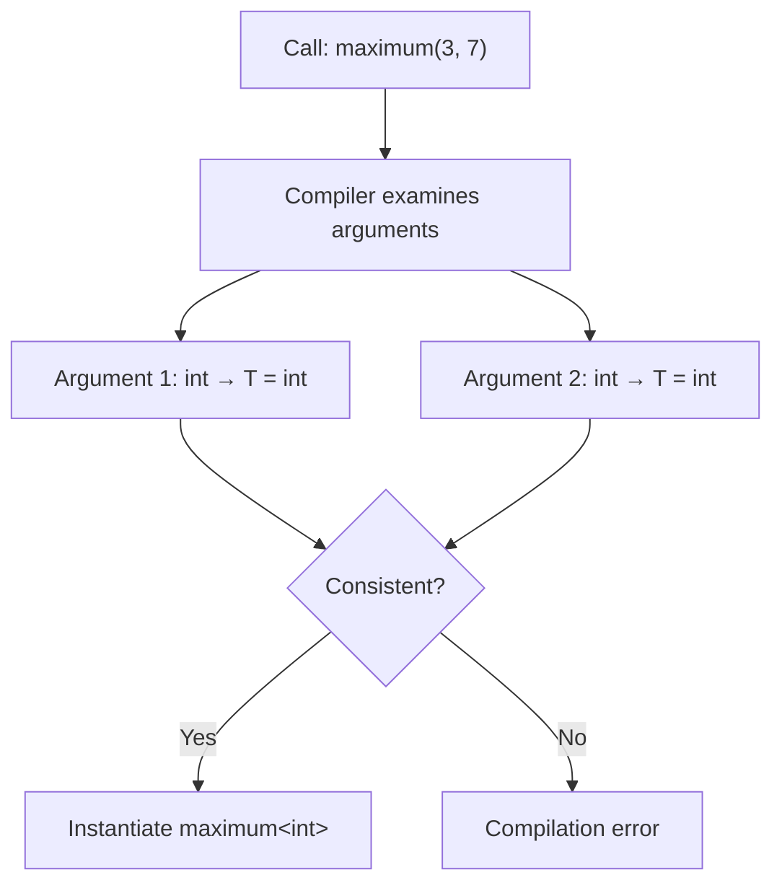
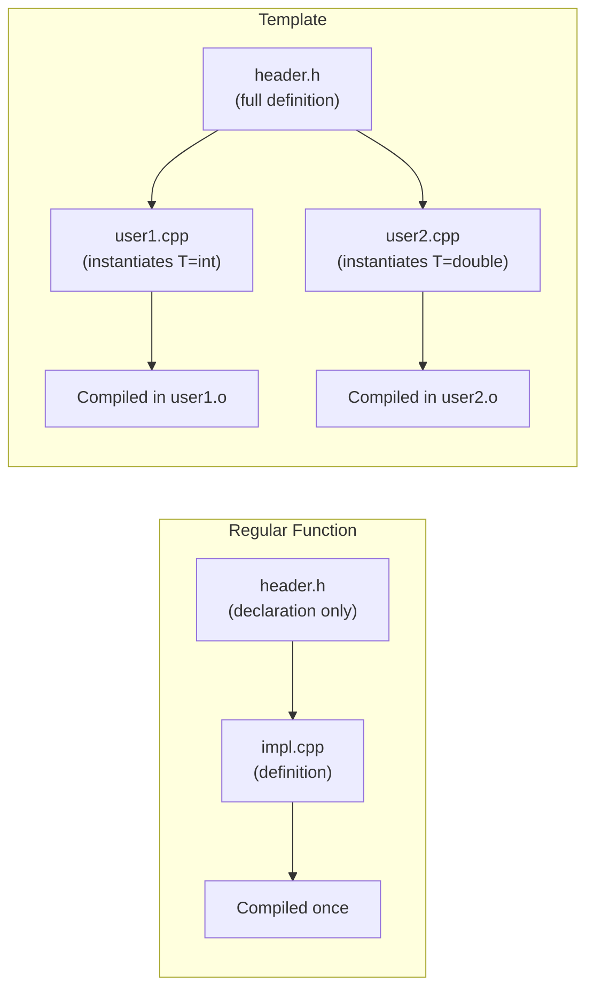

# Templates — Basics

> Templates are C++'s mechanism for writing type-generic code that gets compiled into fully specialized, zero-overhead implementations for each type you use — the foundation of the entire STL and the reason C++ can be both generic and fast.

## Table of Contents
- [Core Concepts](#core-concepts)
- [Code Examples](#code-examples)
- [Common Pitfalls](#common-pitfalls)
- [Key Takeaways](#key-takeaways)
- [Exercises](#exercises)

## Core Concepts

### What Problem Do Templates Solve?

#### What

Before templates, if you wanted a function that swapped two `int`s and another that swapped two `double`s and another that swapped two `std::string`s, you wrote three separate functions with identical logic. The only difference was the type. This is a maintenance nightmare: fix a bug in one and you have to remember to fix it in all the others.

Templates let you write the logic *once* and let the compiler generate the type-specific versions for you. You write a blueprint; the compiler stamps out concrete functions or classes for each type you actually use.

#### How

The core idea is **parameterizing over types**. Instead of hardcoding `int` or `double`, you introduce a placeholder — conventionally `T` — and the compiler substitutes the real type when you use the template.

```cpp
// Without templates: three functions with identical logic
void swap_ints(int& a, int& b) { int tmp = a; a = b; b = tmp; }
void swap_doubles(double& a, double& b) { double tmp = a; a = b; b = tmp; }
void swap_strings(std::string& a, std::string& b) { std::string tmp = a; a = b; b = tmp; }

// With templates: one blueprint
template<typename T>
void my_swap(T& a, T& b) {
    T tmp = a;
    a = b;
    b = tmp;
}
```

When you call `my_swap(x, y)` where `x` and `y` are `int`, the compiler generates a function equivalent to `swap_ints`. When you call it with `std::string`, it generates `swap_strings`. This process is called **template instantiation**.

#### Why It Matters

This is the fundamental difference between C++ templates and generics in other languages. In Java, generics use **type erasure** — `List<Integer>` and `List<String>` are the same class at runtime, operating through `Object` references with runtime casts. In Go, interfaces use **dynamic dispatch** — a method call goes through an interface table at runtime. Both approaches have runtime overhead.

C++ templates have **zero runtime cost**. The compiler generates a completely separate, fully optimized function for each type. `my_swap<int>` is just as fast as a hand-written `swap_ints`. You pay in compile time and binary size, not in runtime performance. This is why the STL can be both generic *and* blazingly fast.

### Function Templates

#### What

A function template is a blueprint for generating functions. You declare it with `template<typename T>` (or `template<class T>` — they're identical in this context) before the function signature. `T` is a **type parameter** — a placeholder that the compiler replaces with a concrete type.

#### How

The syntax has two parts: the **template parameter list** and the **function signature** that uses those parameters:

```cpp
template<typename T>
T maximum(const T& a, const T& b) {
    return (a > b) ? a : b;
}
```

When you write `maximum(3, 7)`, the compiler deduces `T = int` and generates:

```cpp
int maximum(const int& a, const int& b) {
    return (a > b) ? a : b;
}
```

You can also use multiple type parameters:

```cpp
template<typename T, typename U>
auto add(const T& a, const U& b) {
    return a + b;  // return type deduced by the compiler (C++14)
}
```

This lets you write `add(1, 2.5)` — the compiler deduces `T = int`, `U = double`, and the return type is `double`.

#### Why It Matters

Function templates are the workhorse of generic programming. Every STL algorithm (`std::sort`, `std::find`, `std::transform`) is a function template. They work with *any* container's iterators because they're parameterized over the iterator type, not hardcoded to a specific container. This separation of algorithms from data structures is the design philosophy that makes the STL so powerful.

### Class Templates

#### What

Class templates extend the same idea to data structures. Instead of writing `IntStack`, `DoubleStack`, and `StringStack`, you write `Stack<T>` — a single blueprint that the compiler instantiates for each type you use.

#### How

The syntax mirrors function templates — `template<typename T>` before the class definition:

```cpp
template<typename T>
class Stack {
public:
    void push(const T& value) {
        data_.push_back(value);
    }

    T pop() {
        T top = data_.back();
        data_.pop_back();
        return top;
    }

    [[nodiscard]] bool empty() const {
        return data_.empty();
    }

private:
    std::vector<T> data_;
};
```

Usage: `Stack<int> int_stack;` creates a stack of integers. `Stack<std::string> str_stack;` creates a stack of strings. Each instantiation is a completely independent class — `Stack<int>` and `Stack<std::string>` share no code at runtime.

Before C++17, you always had to specify the type explicitly: `Stack<int> s;`. C++17 introduced **Class Template Argument Deduction (CTAD)**, which lets the compiler deduce the type from constructor arguments in some cases (e.g., `std::pair p{1, 2.0};` instead of `std::pair<int, double> p{1, 2.0};`).

#### Why It Matters

Class templates are how the STL containers exist. `std::vector<T>`, `std::map<K, V>`, `std::optional<T>` — they're all class templates. Without class templates, the STL would need a separate implementation for every type, which is obviously impossible. Class templates let library authors write data structures that work with *any* type while maintaining full type safety and zero-overhead abstraction.

### Template Argument Deduction

#### What

Template argument deduction is the compiler's ability to figure out the template type parameters from the function arguments you pass, so you don't have to specify them explicitly. When you write `maximum(3, 7)` instead of `maximum<int>(3, 7)`, the compiler deduces `T = int` from the arguments.

#### How

The compiler matches the function parameter types against the argument types and works backward to determine what `T` must be:

```cpp
template<typename T>
T maximum(const T& a, const T& b);

maximum(3, 7);         // T deduced as int
maximum(3.14, 2.71);   // T deduced as double
```

However, deduction requires **consistency**. If the arguments suggest different types for the same parameter, deduction fails:

```cpp
maximum(3, 2.5);  // ERROR: T can't be both int and double
```

You can fix this in three ways:

1. **Explicit specification**: `maximum<double>(3, 2.5)` — forces `T = double`, and the `int` is converted.
2. **Two type parameters**: `template<typename T, typename U> auto maximum(const T& a, const U& b)`.
3. **Cast the argument**: `maximum(static_cast<double>(3), 2.5)`.



#### Why It Matters

Deduction is what makes templates ergonomic. Without it, every call to a template function would require angle brackets with explicit types — `std::sort<std::vector<int>::iterator>(v.begin(), v.end())` instead of just `std::sort(v.begin(), v.end())`. Deduction lets you write generic code that *reads* like non-generic code, which is crucial for adoption.

Understanding where deduction fails is equally important. The most common failure mode is mixed types for the same template parameter — knowing this lets you design your templates to handle it gracefully (use multiple type parameters or `auto` return types).

### Non-Type Template Parameters

#### What

Not all template parameters have to be types. A **non-type template parameter** (NTTP) is a compile-time constant value — an integer, an enum, a pointer, or (since C++17) `auto` for deduced non-type parameters. The most common use is `std::size_t N` for fixed-size containers.

#### How

You declare a non-type parameter by specifying its type instead of `typename`:

```cpp
template<typename T, std::size_t N>
class FixedArray {
public:
    T& operator[](std::size_t index) { return data_[index]; }
    const T& operator[](std::size_t index) const { return data_[index]; }

    [[nodiscard]] constexpr std::size_t size() const { return N; }

private:
    T data_[N];  // size is baked into the type at compile time
};
```

The crucial insight: `FixedArray<int, 10>` and `FixedArray<int, 20>` are **completely different types**. The size is part of the type — it's not a runtime value stored in a member variable. This means the compiler can optimize based on the exact size, and there's no heap allocation.

This is exactly how `std::array<T, N>` works. It's a thin wrapper around a C-style array with the size baked into the type, giving you the performance of a raw array with the safety and convenience of an STL container.

#### Why It Matters

Non-type template parameters enable **compile-time parameterization** — embedding constant values directly into the type system. This has three major benefits:

1. **Zero overhead**: The value is known at compile time, so the compiler can unroll loops, eliminate branches, and inline aggressively.
2. **Type safety**: `FixedArray<int, 10>` and `FixedArray<int, 20>` are different types, so you can't accidentally pass a 10-element array where a 20-element array is expected.
3. **Constexpr compatibility**: Since the value is a compile-time constant, it works seamlessly with `constexpr` functions and static assertions.

The STL uses non-type template parameters extensively: `std::array<T, N>`, `std::bitset<N>`, `std::integer_sequence<T, Ints...>`. Any time you see a template with a numeric parameter, it's an NTTP.

### The Template Compilation Model

#### What

Templates have a fundamentally different compilation model than regular functions and classes. A regular function is compiled *once* in its `.cpp` file and linked from anywhere. A template, by contrast, is compiled *at the point of instantiation* — meaning the compiler needs to see the full template definition (not just a declaration) wherever the template is used.

#### How

This is why template code almost always lives in **header files**. When you write `Stack<int>` in `main.cpp`, the compiler needs to see the complete definition of `Stack<T>` — including all member function bodies — to generate `Stack<int>`. If the template definition were hidden in a `.cpp` file, the compiler wouldn't be able to instantiate it.



This has practical consequences:

- **Template code goes in headers** (`.h` or `.hpp`), not in `.cpp` files.
- **Compile times increase** because the same template is re-instantiated in every translation unit that uses it.
- **Error messages can be horrific** because the compiler has to trace through layers of template instantiation to report where the type doesn't satisfy the template's requirements.
- **The One Definition Rule (ODR)** still applies — identical instantiations across translation units are merged by the linker.

#### Why It Matters

Understanding the compilation model explains many of the "quirks" of templates:

- Why you can't put template definitions in `.cpp` files (the compiler can't instantiate what it can't see).
- Why template-heavy code is slow to compile (each translation unit re-instantiates every template it uses).
- Why template error messages are so verbose (the compiler has to show the full instantiation chain).
- Why `extern template` (C++11) exists — it lets you suppress instantiation in a translation unit and link to an instantiation in another, reducing compile times.

This is also a key architectural decision: header-only libraries (like many Boost libraries and most modern C++ libraries) embrace the template compilation model fully. They're easy to integrate (just `#include`) but can increase compile times. Libraries that care about compile times use explicit instantiation in `.cpp` files for common types.

## Code Examples

### Function Template: Type-Generic Maximum

```cpp
#include <iostream>
#include <string>

// A function template that works with any type supporting operator>.
// The compiler generates a separate function for each type used.
template<typename T>
const T& maximum(const T& a, const T& b) {
    return (a > b) ? a : b;
}

// A function template with two type parameters and a deduced return type.
// This handles mixed-type arithmetic naturally.
template<typename T, typename U>
auto add(const T& a, const U& b) {
    return a + b;  // return type deduced as the common type (C++14)
}

int main() {
    // The compiler deduces T from the arguments — no need to specify <int> or <double>.
    std::cout << "max(3, 7) = " << maximum(3, 7) << '\n';               // T = int
    std::cout << "max(3.14, 2.71) = " << maximum(3.14, 2.71) << '\n';   // T = double

    // Works with std::string because std::string supports operator>
    const std::string a = "banana";
    const std::string b = "apple";
    std::cout << "max(\"" << a << "\", \"" << b << "\") = \""
              << maximum(a, b) << "\"\n";  // T = std::string, lexicographic comparison

    // Mixed-type addition: T = int, U = double, return type = double
    std::cout << "add(1, 2.5) = " << add(1, 2.5) << '\n';

    // Explicit template argument when deduction can't resolve ambiguity
    // maximum(3, 2.5) would fail — T can't be both int and double
    std::cout << "max(3, 2.5) = " << maximum<double>(3, 2.5) << '\n';

    return 0;
}
```

### Class Template: A Generic Stack

```cpp
#include <iostream>
#include <stdexcept>
#include <string>
#include <vector>

// A generic stack that works with any type.
// The compiler generates a completely independent class for each type instantiation.
template<typename T>
class Stack {
public:
    // Push a value onto the stack. Takes by const reference to avoid unnecessary copies.
    void push(const T& value) {
        data_.push_back(value);
    }

    // Push using move semantics for efficiency with large objects.
    void push(T&& value) {
        data_.push_back(std::move(value));
    }

    // Pop and return the top element. Throws if empty.
    // In production code, you might return std::optional<T> instead of throwing.
    T pop() {
        if (data_.empty()) {
            throw std::runtime_error("Stack::pop() called on empty stack");
        }
        T top = std::move(data_.back());  // move, don't copy — the element is about to be removed
        data_.pop_back();
        return top;  // return value optimization (RVO) applies
    }

    // Peek at the top element without removing it.
    [[nodiscard]] const T& top() const {
        if (data_.empty()) {
            throw std::runtime_error("Stack::top() called on empty stack");
        }
        return data_.back();
    }

    [[nodiscard]] bool empty() const { return data_.empty(); }
    [[nodiscard]] std::size_t size() const { return data_.size(); }

private:
    std::vector<T> data_;
};

int main() {
    // Stack<int> and Stack<std::string> are completely independent types.
    // They share no code at runtime — each is a fully specialized class.
    Stack<int> int_stack;
    int_stack.push(10);
    int_stack.push(20);
    int_stack.push(30);

    std::cout << "Int stack top: " << int_stack.top() << '\n';  // 30
    std::cout << "Popped: " << int_stack.pop() << '\n';         // 30
    std::cout << "New top: " << int_stack.top() << '\n';        // 20

    Stack<std::string> str_stack;
    str_stack.push("hello");
    str_stack.push("world");

    std::cout << "String stack top: " << str_stack.top() << '\n';  // "world"

    // Demonstrate exception on empty stack
    Stack<double> empty_stack;
    try {
        empty_stack.pop();
    } catch (const std::runtime_error& e) {
        std::cout << "Caught: " << e.what() << '\n';
    }

    return 0;
}
```

### Non-Type Template Parameters: Fixed-Size Buffer

```cpp
#include <algorithm>
#include <cstddef>
#include <iostream>
#include <stdexcept>

// A fixed-capacity ring buffer. The capacity N is baked into the type at compile time.
// FixedBuffer<int, 16> and FixedBuffer<int, 32> are different types — you can't mix them up.
// No heap allocation: the buffer lives on the stack (or wherever the object is placed).
template<typename T, std::size_t Capacity>
class FixedBuffer {
public:
    // push_back adds to the buffer. Throws if full.
    void push_back(const T& value) {
        if (size_ >= Capacity) {
            throw std::overflow_error("FixedBuffer is full");
        }
        data_[size_++] = value;
    }

    [[nodiscard]] const T& operator[](std::size_t index) const {
        if (index >= size_) {
            throw std::out_of_range("FixedBuffer index out of range");
        }
        return data_[index];
    }

    [[nodiscard]] constexpr std::size_t capacity() const { return Capacity; }
    [[nodiscard]] std::size_t size() const { return size_; }
    [[nodiscard]] bool full() const { return size_ == Capacity; }

    // Iterators for range-based for loops
    const T* begin() const { return data_; }
    const T* end() const { return data_ + size_; }

private:
    T data_[Capacity]{};  // value-initialized; size is a compile-time constant
    std::size_t size_ = 0;
};

// A function template that accepts any FixedBuffer, regardless of capacity.
// The capacity is deduced as a non-type template parameter.
template<typename T, std::size_t N>
void print_buffer(const FixedBuffer<T, N>& buf) {
    std::cout << "Buffer (size=" << buf.size() << ", capacity=" << N << "): ";
    for (const auto& item : buf) {
        std::cout << item << ' ';
    }
    std::cout << '\n';
}

int main() {
    FixedBuffer<int, 4> small_buf;
    small_buf.push_back(10);
    small_buf.push_back(20);
    small_buf.push_back(30);
    print_buffer(small_buf);  // "Buffer (size=3, capacity=4): 10 20 30"

    FixedBuffer<int, 8> large_buf;
    large_buf.push_back(100);
    large_buf.push_back(200);
    print_buffer(large_buf);  // "Buffer (size=2, capacity=8): 100 200"

    // These are different types — the compiler enforces the distinction:
    // small_buf = large_buf;  // ERROR: FixedBuffer<int,4> != FixedBuffer<int,8>

    // Demonstrate overflow detection
    FixedBuffer<double, 2> tiny;
    tiny.push_back(1.1);
    tiny.push_back(2.2);
    try {
        tiny.push_back(3.3);  // throws: capacity is 2
    } catch (const std::overflow_error& e) {
        std::cout << "Caught: " << e.what() << '\n';
    }

    return 0;
}
```

### Template with Default Arguments and Member Function Templates

```cpp
#include <functional>
#include <iostream>
#include <string>
#include <vector>

// Template with a default type argument.
// The comparator defaults to std::less<T>, which uses operator<.
// Users can override it to change the sort order without modifying the class.
template<typename T, typename Compare = std::less<T>>
class SortedContainer {
public:
    explicit SortedContainer(Compare cmp = Compare{}) : cmp_(cmp) {}

    // Insert maintains sorted order using the comparator.
    void insert(const T& value) {
        auto pos = std::lower_bound(data_.begin(), data_.end(), value, cmp_);
        data_.insert(pos, value);
    }

    // A member function template: works with any output stream type.
    // This is a template *within* a template — T and Compare are class-level,
    // OStream is function-level.
    template<typename OStream>
    void print(OStream& os) const {
        os << "[ ";
        for (const auto& item : data_) {
            os << item << ' ';
        }
        os << "]\n";
    }

    [[nodiscard]] std::size_t size() const { return data_.size(); }

private:
    std::vector<T> data_;
    Compare cmp_;
};

int main() {
    // Default comparator: ascending order
    SortedContainer<int> ascending;
    ascending.insert(30);
    ascending.insert(10);
    ascending.insert(20);
    ascending.insert(5);
    std::cout << "Ascending: ";
    ascending.print(std::cout);  // [ 5 10 20 30 ]

    // Custom comparator: descending order
    SortedContainer<int, std::greater<int>> descending;
    descending.insert(30);
    descending.insert(10);
    descending.insert(20);
    descending.insert(5);
    std::cout << "Descending: ";
    descending.print(std::cout);  // [ 30 20 10 5 ]

    // Works with strings too — lexicographic ordering by default
    SortedContainer<std::string> words;
    words.insert("cherry");
    words.insert("apple");
    words.insert("banana");
    std::cout << "Words: ";
    words.print(std::cout);  // [ apple banana cherry ]

    return 0;
}
```

## Common Pitfalls

### Defining template member functions in a `.cpp` file

```cpp
// BAD — template definition hidden in a .cpp file; the linker can't find it.

// stack.h
template<typename T>
class Stack {
public:
    void push(const T& value);
    T pop();
private:
    std::vector<T> data_;
};

// stack.cpp — THIS WILL CAUSE A LINKER ERROR
#include "stack.h"

template<typename T>
void Stack<T>::push(const T& value) {
    data_.push_back(value);
}

template<typename T>
T Stack<T>::pop() {
    T top = data_.back();
    data_.pop_back();
    return top;
}

// main.cpp
#include "stack.h"
int main() {
    Stack<int> s;
    s.push(42);  // Linker error: undefined reference to Stack<int>::push(int const&)
}
```

The compiler compiles `main.cpp` and sees the declaration of `Stack<T>::push` but not the definition. It expects the linker to find the definition elsewhere. But `stack.cpp` was compiled independently — the compiler saw the *template* definition but never instantiated `Stack<int>` because nobody in `stack.cpp` used `Stack<int>`. The result: the linker can't find `Stack<int>::push`.

```cpp
// GOOD — put the full template definition in the header file.

// stack.h
#pragma once
#include <vector>

template<typename T>
class Stack {
public:
    void push(const T& value) {
        data_.push_back(value);
    }

    T pop() {
        T top = data_.back();
        data_.pop_back();
        return top;
    }

private:
    std::vector<T> data_;
};

// main.cpp
#include "stack.h"
int main() {
    Stack<int> s;
    s.push(42);  // Works: the compiler sees the full definition and instantiates Stack<int>
}
```

Template definitions must be visible at the point of instantiation. The standard approach is to put everything in the header. For large templates, some projects put the definitions in a separate `.inl` or `.tpp` file that the header `#include`s at the bottom — this is purely organizational.

### Inconsistent deduction with mixed argument types

```cpp
// BAD — the compiler can't deduce T when arguments suggest different types.
#include <iostream>

template<typename T>
T maximum(const T& a, const T& b) {
    return (a > b) ? a : b;
}

int main() {
    // maximum(3, 2.5);  // ERROR: T deduced as int from first arg, double from second
    return 0;
}

// GOOD — use two type parameters, or use a common_type return, or specify explicitly.
#include <iostream>
#include <type_traits>

// Option 1: Two type parameters with common_type return
template<typename T, typename U>
auto maximum(const T& a, const U& b) -> std::common_type_t<T, U> {
    return (a > b) ? a : b;
}

int main() {
    std::cout << maximum(3, 2.5) << '\n';  // Works: returns double(3)
    return 0;
}
```

When designing a function template, ask yourself: "Will callers ever pass mixed types?" If yes, use separate type parameters for each argument. `std::common_type_t` gives you the type that both arguments can convert to (e.g., `int` and `double` yield `double`).

### Forgetting that each template instantiation is a separate type

```cpp
// BAD — treating different instantiations as the same type.
#include <cstddef>
#include <iostream>

template<typename T, std::size_t N>
class FixedArray {
public:
    T data[N];
};

void process(FixedArray<int, 10>& arr) {
    // ...
}

int main() {
    FixedArray<int, 5> small;
    // process(small);  // ERROR: FixedArray<int,5> is not FixedArray<int,10>
    return 0;
}

// GOOD — make the function itself a template so it works with any size.
#include <cstddef>
#include <iostream>

template<typename T, std::size_t N>
class FixedArray {
public:
    T data[N];
    [[nodiscard]] constexpr std::size_t size() const { return N; }
};

// Template function that accepts any FixedArray, regardless of size
template<typename T, std::size_t N>
void process(FixedArray<T, N>& arr) {
    std::cout << "Processing array of size " << N << '\n';
}

int main() {
    FixedArray<int, 5> small;
    FixedArray<int, 10> large;
    process(small);   // OK: N deduced as 5
    process(large);   // OK: N deduced as 10
    return 0;
}
```

Every distinct set of template arguments produces a distinct type. `std::array<int, 5>` and `std::array<int, 10>` are as different as `int` and `std::string`. If you write a function that takes a specific instantiation, it won't accept other instantiations. Make the function a template too, or use a common base (though templates generally avoid inheritance hierarchies).

### Assuming templates are checked when defined

```cpp
// BAD — this compiles fine, even though the template body is nonsensical,
// because the compiler only checks template code when it's instantiated.
#include <iostream>

template<typename T>
void broken(T value) {
    value.this_method_does_not_exist();  // No error at definition time!
    int x = value + "hello";            // No error at definition time!
}

int main() {
    // broken(42);  // ERROR happens HERE, at instantiation, not at the template definition
    return 0;
}
```

C++ templates use a **two-phase compilation model**. In phase one (definition), the compiler checks syntax and looks up names that don't depend on `T`. In phase two (instantiation), it substitutes the concrete type and checks everything else. This means a template can contain completely invalid code that compiles fine — until someone actually uses it.

This is a design trade-off. The benefit is flexibility: a template can call `value.serialize()` and it works for any type that has a `serialize()` method, without declaring an interface upfront. The cost is that errors are detected late (at instantiation, not definition) and error messages refer to the instantiation site, not the root cause.

C++20 Concepts address this by letting you declare requirements on template parameters upfront (`template<Sortable T>`), so the compiler can check constraints at the call site with clear error messages. Until your codebase adopts C++20, `static_assert` inside the template body is the best alternative.

## Key Takeaways

- **Templates are zero-cost generics.** The compiler generates fully specialized code for each type — no runtime dispatch, no type erasure, no overhead. This is fundamentally different from Java generics or Go interfaces.
- **Template definitions must be in headers.** The compiler needs to see the full definition at the point of instantiation. This is a consequence of the C++ compilation model, not a language deficiency.
- **Template argument deduction makes templates ergonomic.** The compiler infers types from arguments, so `std::sort(v.begin(), v.end())` just works. Know the deduction rules — especially that mixed types for the same parameter cause deduction failure.
- **Non-type template parameters embed compile-time constants into the type.** `std::array<int, 10>` and `std::array<int, 20>` are different types. The compiler can optimize based on the exact value, and you get type safety for free.
- **Each template instantiation is a separate type.** `Stack<int>` and `Stack<double>` share no code at runtime. This means you can't store mixed instantiations in a single container without type erasure (e.g., `std::function`, `std::any`, or a common base class with virtual methods).

## Exercises

1. Write a function template `clamp(value, low, high)` that returns `low` if `value < low`, `high` if `value > high`, and `value` otherwise. It should work with any type that supports `operator<` and `operator>`. Test it with `int`, `double`, and `std::string`.

2. Write a class template `Pair<T, U>` with two public members `first` and `second`. Add a member function `swap()` that swaps the two values (only valid when `T` and `U` are the same type). Add a free function template `make_pair(a, b)` that creates a `Pair` using template argument deduction. Explain why the STL provides `std::make_pair()` even though C++17 CTAD can often deduce the types.

3. Explain why the following code produces a linker error, not a compiler error:
   ```cpp
   // math_utils.h
   template<typename T> T square(T x);

   // math_utils.cpp
   template<typename T> T square(T x) { return x * x; }

   // main.cpp
   #include "math_utils.h"
   int main() { return square(5); }
   ```
   Describe two different ways to fix it.

4. Write a class template `Matrix<T, Rows, Cols>` where `Rows` and `Cols` are non-type template parameters. Implement `operator()` for element access (e.g., `m(1, 2)` returns the element at row 1, column 2). Add a `multiply` function template that takes a `Matrix<T, Cols, K>` and returns a `Matrix<T, Rows, K>` — note how the dimensions are enforced by the type system. What happens if you try to multiply matrices with incompatible dimensions?

5. Consider a template function `template<typename Container> void print_all(const Container& c)` that prints every element. What implicit requirements does this template place on `Container`? List every operation the container type must support. How would you communicate these requirements to users of your template in C++17 (without Concepts)?

---
up:: [Schedule](../../Schedule.md)
#type/learning #source/self-study #status/evergreen
