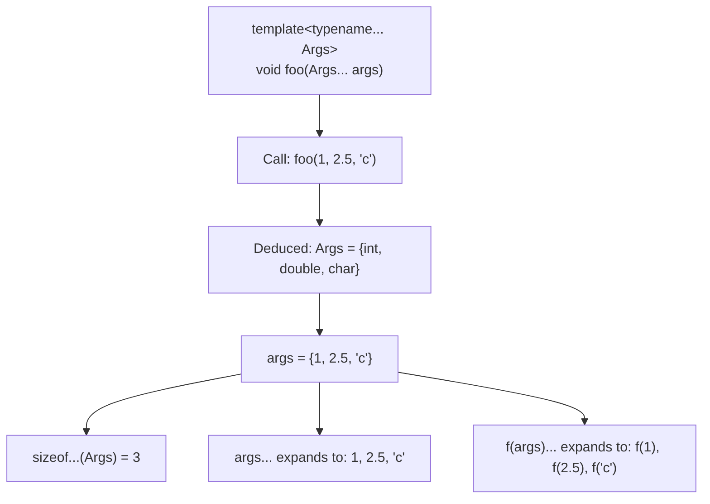
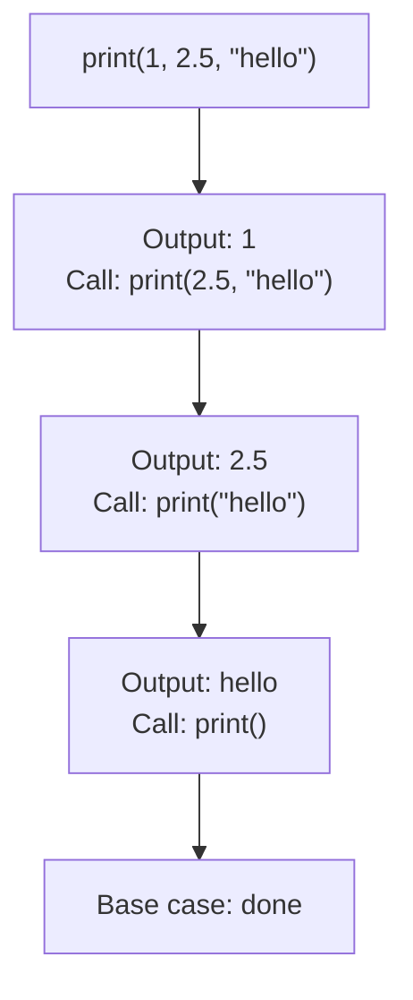

# Variadic Templates, Fold Expressions & `sizeof...`

> Variadic templates let you write functions and classes that accept any number of arguments of any types — replacing the type-unsafe C-style `printf` variadic functions with fully type-safe, compile-time-expanded parameter packs.

## Table of Contents
- [Core Concepts](#core-concepts)
- [Code Examples](#code-examples)
- [Common Pitfalls](#common-pitfalls)
- [Key Takeaways](#key-takeaways)
- [Exercises](#exercises)

## Core Concepts

### What Problem Do Variadic Templates Solve?

#### What

Before C++11, the only way to write a function that accepted a variable number of arguments was the C-style `...` (ellipsis) — the mechanism behind `printf`. The problem: `printf` has no type safety. Pass a `double` where it expects an `int`, and you get silent corruption, not a compiler error. The format string is interpreted at runtime, so the compiler can't verify that the arguments match.

Variadic templates solve this by making variable-argument functions fully type-safe. Every argument's type is known at compile time. The compiler generates specialized code for each combination of argument types, so there's no runtime parsing, no format strings, and no undefined behavior from type mismatches.

#### How

C-style variadic functions use `va_list`, `va_start`, `va_arg`, and `va_end` — macros that walk the stack at runtime, blindly reinterpreting bytes as whatever type you tell them. There's no compile-time check that the types match:

```cpp
// C-style: type-unsafe, undefined behavior on type mismatch
int sum(int count, ...) {
    va_list args;
    va_start(args, count);
    int total = 0;
    for (int i = 0; i < count; ++i) {
        total += va_arg(args, int);  // if caller passes a double, UB
    }
    va_end(args);
    return total;
}
```

Variadic templates use **parameter packs** — a compile-time mechanism where the compiler knows every argument's type:

```cpp
// C++11: type-safe, zero runtime overhead
template<typename... Args>
auto sum(Args... args) {
    return (args + ...);  // fold expression (C++17)
}
```

#### Why It Matters

Variadic templates are the backbone of modern C++ infrastructure. `std::make_unique`, `std::make_shared`, `std::tuple`, `std::variant`, `std::function`, `std::thread` — all of them use variadic templates internally. Any time you call `std::make_unique<Widget>(arg1, arg2, arg3)`, variadic templates are forwarding those arguments to `Widget`'s constructor. Without variadic templates, you'd need to write separate overloads for 1 argument, 2 arguments, 3 arguments, and so on — which is exactly what pre-C++11 Boost did (up to a configurable maximum, typically 10).

### Parameter Packs

#### What

A **parameter pack** is a template parameter that represents zero or more types (a **type parameter pack**) or zero or more values (a **non-type parameter pack**). You declare a pack using the ellipsis `...`:

- `typename... Args` — a type parameter pack (each element is a type)
- `Args... args` — a function parameter pack (each element is a value)

Think of a parameter pack as a bundle that holds an arbitrary number of items. You can't access individual items directly with indexing — instead, you **expand** the pack using `...`, which applies an operation to every element.

#### How

A parameter pack has three parts: **declaration**, **expansion**, and **query**.

**Declaration** — the `...` appears to the *left* of the pack name:

```cpp
template<typename... Types>    // Types is a type parameter pack
void foo(Types... values) {    // values is a function parameter pack
    // ...
}
```

**Expansion** — the `...` appears to the *right* of a pattern:

```cpp
template<typename... Types>
void foo(Types... values) {
    // Pack expansion: applies the pattern to each element
    bar(values...);            // expands to: bar(v1, v2, v3, ...)
    baz(process(values)...);   // expands to: baz(process(v1), process(v2), ...)
}
```

**Query** — `sizeof...(pack)` returns the number of elements:

```cpp
template<typename... Types>
void foo(Types... values) {
    constexpr auto count = sizeof...(Types);  // number of types
    constexpr auto count2 = sizeof...(values); // same number — types and values match
}
```

The key insight about pack expansion: whatever pattern appears *before* the `...` is applied to *each element* individually, and the results are separated by commas. So `f(args...)` expands to `f(a1, a2, a3)`, and `f(transform(args)...)` expands to `f(transform(a1), transform(a2), transform(a3))`.



#### Why It Matters

Parameter packs are the raw material. By themselves, they're just bundles of types and values. The power comes from how you *expand* them — and there are two main approaches: **recursive expansion** (C++11) and **fold expressions** (C++17). Understanding pack expansion patterns is what separates "I can read variadic templates" from "I can write them."

### Recursive Parameter Pack Expansion (C++11)

#### What

Before fold expressions (C++17), the standard technique for processing a parameter pack was **recursive template expansion**. You write two overloads: a **base case** (handles zero or one argument) and a **recursive case** (handles the first argument, then recurses on the rest).

This is function overloading doing the work of a loop — each recursive call peels off one argument from the pack until the base case is reached.

#### How

The pattern always looks like this:

```cpp
// Base case: zero arguments
void print() {
    // nothing to print
}

// Recursive case: peel off the first argument, recurse on the rest
template<typename T, typename... Rest>
void print(const T& first, const Rest&... rest) {
    std::cout << first << '\n';
    print(rest...);  // recurse with one fewer argument
}
```

When you call `print(1, 2.5, "hello")`:

1. `print(1, 2.5, "hello")` — `T = int`, `Rest = {double, const char*}`. Prints `1`, calls `print(2.5, "hello")`.
2. `print(2.5, "hello")` — `T = double`, `Rest = {const char*}`. Prints `2.5`, calls `print("hello")`.
3. `print("hello")` — `T = const char*`, `Rest = {}` (empty). Prints `"hello"`, calls `print()`.
4. `print()` — base case, does nothing.



Each "recursive call" is actually a call to a different function — the compiler generates `print<int, double, const char*>`, `print<double, const char*>`, `print<const char*>`, and `print()`. The recursion is fully resolved at compile time; at runtime, it's just a sequence of function calls (which the compiler typically inlines).

#### Why It Matters

Recursive expansion was the *only* way to process parameter packs for six years (C++11 through C++17). A vast amount of existing code and library infrastructure uses this pattern. You need to recognize it when reading code, even if you prefer fold expressions for new code.

The recursive pattern is also more flexible than fold expressions in some cases — when you need to do different things for different elements, or when the processing of one element depends on the result of the previous element, recursion gives you fine-grained control that fold expressions can't match.

### Fold Expressions (C++17)

#### What

Fold expressions collapse a parameter pack using a binary operator in a single expression, without recursion. They replace the recursive pattern for the most common use case: applying the same operation to all elements.

The name "fold" comes from functional programming — it's the same concept as `reduce` in Python, `fold` in Haskell, or `Array.prototype.reduce` in JavaScript.

#### How

There are four forms of fold expressions. Let `args` be a parameter pack and `op` be a binary operator:

| Form | Name | Expansion |
|------|------|-----------|
| `(args op ...)` | Unary right fold | `a1 op (a2 op (a3 op a4))` |
| `(... op args)` | Unary left fold | `((a1 op a2) op a3) op a4` |
| `(args op ... op init)` | Binary right fold | `a1 op (a2 op (a3 op init))` |
| `(init op ... op args)` | Binary left fold | `((init op a1) op a2) op a3` |

The parentheses are **required** — a fold expression must always be enclosed in parentheses.

The most common ones:

```cpp
// Sum all arguments: unary left fold with +
template<typename... Args>
auto sum(Args... args) {
    return (... + args);  // ((a1 + a2) + a3) + a4
}

// Print all arguments with spaces: binary left fold with <<
template<typename... Args>
void print(const Args&... args) {
    ((std::cout << args << ' '), ...);  // uses the comma operator
    std::cout << '\n';
}

// Check if all arguments are true: unary left fold with &&
template<typename... Args>
bool all_true(Args... args) {
    return (... && args);  // ((a1 && a2) && a3) && a4
}
```

The comma-operator fold `((expr), ...)` is a common idiom for executing a statement for each pack element when there's no natural binary operator to fold over. The comma operator evaluates each expression in order and discards the result (except the last one).

#### Why It Matters

Fold expressions transform variadic templates from a pattern requiring expertise (recursive expansion with base cases) into something that reads almost like pseudocode. Compare:

```cpp
// C++11 recursive approach: 8 lines, two overloads
void print() {}

template<typename T, typename... Rest>
void print(const T& first, const Rest&... rest) {
    std::cout << first << ' ';
    print(rest...);
}

// C++17 fold expression: 3 lines, one function
template<typename... Args>
void print(const Args&... args) {
    ((std::cout << args << ' '), ...);
    std::cout << '\n';
}
```

The fold version is shorter, has no base case to maintain, and can't have off-by-one errors in the recursion. For any operation that naturally maps to a binary operator (addition, logical AND/OR, comparison, stream insertion), fold expressions are the right tool.

However, fold expressions are limited to binary operators. If you need conditional logic, different processing per element, or accumulation with complex state, recursive expansion is still the way to go.

### `sizeof...` — Querying Pack Size

#### What

`sizeof...(pack)` returns the number of elements in a parameter pack as a `constexpr std::size_t`. It works on both type parameter packs and function parameter packs. Despite the name, it has nothing to do with `sizeof` (which returns the size of a type in bytes) — it returns the *count* of elements in the pack.

#### How

```cpp
template<typename... Args>
void info(Args... args) {
    constexpr auto type_count = sizeof...(Args);   // number of type parameters
    constexpr auto value_count = sizeof...(args);   // number of values (always the same)
    // type_count == value_count, always
}
```

Because `sizeof...` is `constexpr`, you can use it in:

- `static_assert` to enforce minimum/maximum argument counts
- `if constexpr` to branch on the number of arguments
- Array sizes and template arguments

```cpp
template<typename... Args>
auto make_array(Args... args) {
    // sizeof...(args) determines the array size at compile time
    return std::array<std::common_type_t<Args...>, sizeof...(Args)>{args...};
}
```

#### Why It Matters

`sizeof...` bridges the gap between parameter packs and the rest of the language. Without it, you'd have no way to ask "how many arguments did I get?" at compile time — you'd have to track the count manually through recursive calls. It's essential for:

- **Validation**: `static_assert(sizeof...(Args) >= 1, "need at least one argument")`.
- **Conditional compilation**: `if constexpr (sizeof...(Args) == 0) { /* handle empty pack */ }`.
- **Fixed-size containers**: Creating arrays or tuples whose size matches the pack.

### Perfect Forwarding with Parameter Packs

#### What

When you write a function that accepts a parameter pack and passes it to another function, you need to preserve the value category (lvalue vs rvalue) of each argument. This is **perfect forwarding** — the combination of **forwarding references** (`T&&` where `T` is a deduced template parameter) and `std::forward`.

#### How

The standard pattern for forwarding a parameter pack:

```cpp
template<typename... Args>
void wrapper(Args&&... args) {                  // forwarding references
    target(std::forward<Args>(args)...);        // perfect forwarding
}
```

This expands to:

```cpp
target(std::forward<A1>(a1), std::forward<A2>(a2), std::forward<A3>(a3));
```

Each argument is forwarded with its original value category. If the caller passed an lvalue, `std::forward` passes it as an lvalue. If the caller passed an rvalue, `std::forward` passes it as an rvalue (enabling move semantics).

This is exactly how `std::make_unique` works:

```cpp
template<typename T, typename... Args>
std::unique_ptr<T> make_unique(Args&&... args) {
    return std::unique_ptr<T>(new T(std::forward<Args>(args)...));
}
```

The arguments are forwarded directly to `T`'s constructor. No copies, no moves — the constructor sees the original arguments as if the caller had called `new T(...)` directly.

#### Why It Matters

Perfect forwarding is the reason `std::make_unique`, `std::make_shared`, `std::emplace_back`, and `std::thread` can work with *any* constructor signature. Without it, you'd need to write separate overloads for every combination of lvalue/rvalue arguments — an exponential explosion.

The pattern `template<typename... Args> void f(Args&&... args)` with `std::forward<Args>(args)...` is the single most important variadic template idiom. You'll see it everywhere in production C++ and in every major library.

## Code Examples

### Type-Safe Print with Recursive Expansion (C++11)

```cpp
#include <iostream>
#include <string>

// Base case: no more arguments to print.
// This overload is selected when the parameter pack is empty.
void print_all() {
    std::cout << '\n';
}

// Recursive case: print the first argument, then recurse on the rest.
// The compiler generates a separate instantiation for each recursion step:
//   print_all<int, double, string>(1, 2.5, "hi")
//   -> print_all<double, string>(2.5, "hi")
//   -> print_all<string>("hi")
//   -> print_all()  (base case)
template<typename T, typename... Rest>
void print_all(const T& first, const Rest&... rest) {
    std::cout << first;
    if constexpr (sizeof...(rest) > 0) {
        std::cout << ", ";  // separator between elements, but not after the last one
    }
    print_all(rest...);  // peel off the first, recurse with the rest
}

int main() {
    print_all(42, 3.14, "hello", std::string("world"), 'x');
    // Output: 42, 3.14, hello, world, x

    print_all("single argument");
    // Output: single argument

    print_all();  // base case only
    // Output: (empty line)

    return 0;
}
```

### Fold Expressions: Sum, All-Of, Print (C++17)

```cpp
#include <iostream>
#include <string>
#include <type_traits>

// Sum all arguments using a unary left fold.
// (... + args) expands to ((a1 + a2) + a3) + a4
// Works with any types that support operator+.
template<typename... Args>
auto sum(Args... args) {
    static_assert(sizeof...(Args) > 0, "sum() requires at least one argument");
    return (... + args);
}

// Check if all arguments satisfy a predicate.
// Uses a unary left fold with && to short-circuit on the first false.
template<typename... Args>
bool all_positive(Args... args) {
    return (... && (args > 0));  // (((a1 > 0) && (a2 > 0)) && (a3 > 0))
}

// Check if any argument satisfies a predicate.
// Uses a unary left fold with || to short-circuit on the first true.
template<typename... Args>
bool any_negative(Args... args) {
    return (... || (args < 0));
}

// Print all arguments separated by a delimiter.
// Uses the comma operator fold: each element is printed in order.
template<typename... Args>
void print_delimited(const std::string& delim, const Args&... args) {
    bool first = true;
    // The comma operator evaluates left to right and discards the result.
    // The lambda is called once per pack element.
    ((std::cout << (first ? (first = false, "") : delim) << args), ...);
    std::cout << '\n';
}

// Count how many arguments satisfy a predicate.
// Uses a unary left fold with + on the boolean results.
template<typename... Args>
std::size_t count_positive(Args... args) {
    return (static_cast<std::size_t>(args > 0) + ...);
}

int main() {
    std::cout << "sum(1, 2, 3, 4, 5) = " << sum(1, 2, 3, 4, 5) << '\n';
    // Output: 15

    std::cout << "sum(1.5, 2.5) = " << sum(1.5, 2.5) << '\n';
    // Output: 4.0

    std::cout << "all_positive(1, 2, 3) = " << std::boolalpha << all_positive(1, 2, 3) << '\n';
    // Output: true

    std::cout << "all_positive(1, -2, 3) = " << all_positive(1, -2, 3) << '\n';
    // Output: false

    std::cout << "any_negative(1, -2, 3) = " << any_negative(1, -2, 3) << '\n';
    // Output: true

    print_delimited(" | ", 42, 3.14, "hello", 'x');
    // Output: 42 | 3.14 | hello | x

    std::cout << "count_positive(-1, 2, -3, 4, 5) = "
              << count_positive(-1, 2, -3, 4, 5) << '\n';
    // Output: 3

    return 0;
}
```

### Perfect Forwarding: A Factory Function

```cpp
#include <iostream>
#include <memory>
#include <string>
#include <utility>

// A type with multiple constructors to demonstrate forwarding.
class Connection {
public:
    // Default constructor
    Connection() : host_("localhost"), port_(8080) {
        std::cout << "Connection() — default\n";
    }

    // Two-argument constructor
    Connection(std::string host, int port)
        : host_(std::move(host)), port_(port) {
        std::cout << "Connection(\"" << host_ << "\", " << port_ << ")\n";
    }

    // Three-argument constructor
    Connection(std::string host, int port, bool use_tls)
        : host_(std::move(host)), port_(port), use_tls_(use_tls) {
        std::cout << "Connection(\"" << host_ << "\", " << port_
                  << ", tls=" << std::boolalpha << use_tls_ << ")\n";
    }

    void connect() const {
        std::cout << "Connecting to " << host_ << ":" << port_
                  << (use_tls_ ? " (TLS)" : "") << '\n';
    }

private:
    std::string host_;
    int port_;
    bool use_tls_ = false;
};

// A generic factory that creates any type T by forwarding arguments to its constructor.
// This is essentially what std::make_unique does under the hood.
//
// Args&&... is a forwarding reference pack — it binds to lvalues and rvalues.
// std::forward<Args>(args)... preserves the value category of each argument.
template<typename T, typename... Args>
std::unique_ptr<T> create(Args&&... args) {
    return std::make_unique<T>(std::forward<Args>(args)...);
}

int main() {
    // Each call forwards its arguments directly to Connection's constructor.
    // No extra copies, no extra moves — the constructor sees the original arguments.
    auto c1 = create<Connection>();
    auto c2 = create<Connection>("api.example.com", 443);
    auto c3 = create<Connection>("api.example.com", 443, true);

    c1->connect();
    c2->connect();
    c3->connect();

    // Works with string too — the rvalue "api.example.com" is moved, not copied
    std::string host = "db.internal";
    auto c4 = create<Connection>(host, 5432);  // host is an lvalue — passed by reference, then copied by Connection's ctor
    auto c5 = create<Connection>(std::move(host), 5432);  // moved — no copy
    c4->connect();
    c5->connect();

    return 0;
}
```

### Variadic Class Template: A Simple Tuple

```cpp
#include <cstddef>
#include <iostream>
#include <string>
#include <utility>

// A simplified tuple implementation showing how variadic templates work with classes.
// The real std::tuple uses a similar recursive inheritance approach.

// Base case: empty tuple (no more types to store).
template<typename... Types>
class SimpleTuple {};

// Recursive case: peel off the first type, store it, inherit from the rest.
// SimpleTuple<int, double, string> inherits from SimpleTuple<double, string>,
// which inherits from SimpleTuple<string>, which inherits from SimpleTuple<>.
template<typename Head, typename... Tail>
class SimpleTuple<Head, Tail...> : private SimpleTuple<Tail...> {
public:
    SimpleTuple() = default;

    // Constructor: store the first value, forward the rest to the base class.
    explicit SimpleTuple(Head head, Tail... tail)
        : SimpleTuple<Tail...>(std::move(tail)...), value_(std::move(head)) {}

    // Access the stored value at this level of the hierarchy
    Head& head() { return value_; }
    const Head& head() const { return value_; }

    // Access the "rest" of the tuple (the base class)
    SimpleTuple<Tail...>& tail() { return *this; }
    const SimpleTuple<Tail...>& tail() const { return *this; }

private:
    Head value_{};
};

// A helper to get the Nth element from the tuple.
// Index 0 returns head(), Index > 0 recurses into tail().
template<std::size_t Index, typename Head, typename... Tail>
auto& get(SimpleTuple<Head, Tail...>& t) {
    if constexpr (Index == 0) {
        return t.head();
    } else {
        return get<Index - 1>(t.tail());
    }
}

int main() {
    SimpleTuple<int, double, std::string> t(42, 3.14, "hello");

    std::cout << "Element 0: " << get<0>(t) << '\n';  // 42
    std::cout << "Element 1: " << get<1>(t) << '\n';  // 3.14
    std::cout << "Element 2: " << get<2>(t) << '\n';  // hello

    // Modify an element
    get<0>(t) = 100;
    std::cout << "Modified element 0: " << get<0>(t) << '\n';  // 100

    // get<3>(t);  // Compile error: index out of bounds (caught at compile time!)

    return 0;
}
```

### `sizeof...` with `static_assert` and `if constexpr`

```cpp
#include <cstddef>
#include <iostream>
#include <string>
#include <type_traits>

// A logging function that requires at least a log level and a message.
// sizeof... enforces the minimum argument count at compile time.
enum class LogLevel { debug, info, warning, error };

template<typename... Args>
void log(LogLevel level, const std::string& format, const Args&... args) {
    static_assert(sizeof...(Args) <= 10,
        "log() supports at most 10 format arguments");

    const char* level_str = [level]() {
        switch (level) {
            case LogLevel::debug:   return "[DEBUG]";
            case LogLevel::info:    return "[INFO]";
            case LogLevel::warning: return "[WARN]";
            case LogLevel::error:   return "[ERROR]";
        }
        return "[???]";
    }();

    std::cout << level_str << ' ' << format;

    // Print arguments if any were provided
    if constexpr (sizeof...(Args) > 0) {
        std::cout << " — args: ";
        ((std::cout << args << ' '), ...);  // fold expression to print all args
    }

    std::cout << '\n';
}

// A function that behaves differently based on the number of arguments.
// This is a common pattern for optional-parameter APIs.
template<typename... Args>
std::string build_path(const Args&... args) {
    static_assert(sizeof...(Args) >= 1, "build_path() requires at least one component");

    if constexpr (sizeof...(Args) == 1) {
        // Single component: return as-is, no joining needed
        return (... + std::string(args));  // unary fold, but only one element
    } else {
        // Multiple components: join with "/"
        std::string result;
        ((result += std::string(args) + "/"), ...);
        result.pop_back();  // remove trailing "/"
        return result;
    }
}

int main() {
    log(LogLevel::info, "Server started");
    log(LogLevel::error, "Connection failed", "host=db.internal", "port=5432", "timeout=30s");
    log(LogLevel::debug, "Processing request", 42, 3.14);

    std::cout << build_path("home") << '\n';
    // Output: home

    std::cout << build_path("home", "user", "documents") << '\n';
    // Output: home/user/documents

    std::cout << build_path("var", "log", "app.log") << '\n';
    // Output: var/log/app.log

    return 0;
}
```

## Common Pitfalls

### Forgetting the base case in recursive expansion

```cpp
// BAD — no base case; the compiler recurses infinitely and hits an error.
#include <iostream>

template<typename T, typename... Rest>
void print(const T& first, const Rest&... rest) {
    std::cout << first << '\n';
    print(rest...);  // when rest is empty, there's no print() to call
}

int main() {
    print(1, 2, 3);  // ERROR: no matching function for print() with 0 arguments
    return 0;
}

// GOOD — provide a base case that handles the empty pack.
#include <iostream>

// Base case: empty pack
void print() {}

template<typename T, typename... Rest>
void print(const T& first, const Rest&... rest) {
    std::cout << first << '\n';
    print(rest...);  // eventually calls print() with 0 arguments — hits the base case
}

int main() {
    print(1, 2, 3);
    return 0;
}
```

Alternatively, in C++17 you can use `if constexpr` to avoid needing a separate base case overload:

```cpp
// GOOD (C++17) — single function with if constexpr
template<typename T, typename... Rest>
void print(const T& first, const Rest&... rest) {
    std::cout << first << '\n';
    if constexpr (sizeof...(rest) > 0) {
        print(rest...);  // only compiled when there are remaining arguments
    }
}
```

### Incorrect pack expansion syntax

```cpp
// BAD — applying a function to each element, but expanding the pack in the wrong place.
#include <iostream>

template<typename T>
void process(const T& value) {
    std::cout << "Processing: " << value << '\n';
}

template<typename... Args>
void process_all(const Args&... args) {
    // This tries to call process with ALL arguments at once, not one at a time.
    // process(args...);  // ERROR: process takes exactly one argument

    // This is also wrong — expands to a single expression, not multiple statements.
    // process(args)...;  // ERROR: pack expansion not in a valid context
}
```

Pack expansion only works in specific contexts: function arguments, template arguments, initializer lists, and fold expressions. You can't just write `statement...` and expect it to repeat the statement.

```cpp
// GOOD — use a fold expression with the comma operator to call a function for each element.
#include <iostream>

template<typename T>
void process(const T& value) {
    std::cout << "Processing: " << value << '\n';
}

template<typename... Args>
void process_all(const Args&... args) {
    // Comma-operator fold: calls process() once for each element, in order.
    // Expands to: (process(a1), (process(a2), process(a3)))
    (process(args), ...);
}

int main() {
    process_all(42, 3.14, "hello");
    // Output:
    // Processing: 42
    // Processing: 3.14
    // Processing: hello
    return 0;
}
```

### Confusing `sizeof...` with `sizeof`

```cpp
// BAD — using sizeof on a parameter pack (it doesn't do what you think).
#include <cstddef>
#include <iostream>

template<typename... Args>
void info(Args... args) {
    // sizeof(args) is WRONG — you can't apply sizeof to a pack.
    // sizeof(Args) is also WRONG — you can't apply sizeof to a pack.
    // Both are compile errors.

    // Even sizeof(args...) is wrong — sizeof expects a single type or expression.
}

// GOOD — use sizeof... (the variadic version) to get the pack element count.
#include <cstddef>
#include <iostream>

template<typename... Args>
void info(Args... args) {
    constexpr std::size_t count = sizeof...(Args);   // number of types in the pack
    constexpr std::size_t count2 = sizeof...(args);  // number of values (same number)

    std::cout << "Received " << count << " arguments\n";
}

int main() {
    info(1, 2.0, "three");  // "Received 3 arguments"
    info();                  // "Received 0 arguments"
    return 0;
}
```

`sizeof` and `sizeof...` are completely different operators despite the similar name. `sizeof` returns the size of a type or expression in bytes. `sizeof...` returns the number of elements in a parameter pack. Mixing them up is a common mistake, especially for newcomers to variadic templates.

### Forgetting `std::forward` when forwarding parameter packs

```cpp
// BAD — forwarding without std::forward loses rvalue-ness.
// Move-only types like std::unique_ptr will fail to compile.
#include <memory>
#include <utility>

template<typename T, typename... Args>
std::unique_ptr<T> create(Args&&... args) {
    // args... passes everything as lvalues, even if the caller passed rvalues.
    // This copies instead of moving, and fails for move-only types.
    return std::make_unique<T>(args...);  // BAD: loses rvalue references
}

// GOOD — use std::forward to preserve the value category of each argument.
#include <memory>
#include <utility>

template<typename T, typename... Args>
std::unique_ptr<T> create(Args&&... args) {
    // std::forward<Args>(args)... preserves each argument's value category.
    // Rvalues stay rvalues (enabling moves), lvalues stay lvalues.
    return std::make_unique<T>(std::forward<Args>(args)...);
}

struct Widget {
    Widget(std::unique_ptr<int> data, std::string name) {}
};

int main() {
    // Without std::forward, this fails — unique_ptr can't be copied.
    auto w = create<Widget>(std::make_unique<int>(42), std::string("test"));
    return 0;
}
```

The pattern `template<typename... Args> void f(Args&&... args)` with `std::forward<Args>(args)...` is the canonical perfect forwarding idiom. Dropping the `std::forward` is a subtle but serious bug — the code might compile and appear to work with copyable types, but it introduces unnecessary copies and breaks entirely with move-only types.

## Key Takeaways

- **Parameter packs are bundles of types and values.** You declare them with `typename... Args`, expand them with `args...`, and query their size with `sizeof...(args)`. Pack expansion applies a pattern to every element and separates results with commas.
- **Recursive expansion (C++11) and fold expressions (C++17) are the two approaches to processing packs.** Fold expressions are simpler and preferred for straightforward operations. Recursive expansion gives more control when you need conditional logic or element-by-element state.
- **Fold expressions replace boilerplate with one-liners.** `(... + args)` for summation, `(... && args)` for all-of, `((std::cout << args << ' '), ...)` for printing. The comma-operator fold is the universal escape hatch for "do this thing for each element."
- **Perfect forwarding with parameter packs** (`Args&&...` + `std::forward<Args>(args)...`) is the most important variadic template idiom. It's how `std::make_unique`, `std::emplace_back`, and `std::thread` work — forwarding arbitrary arguments to constructors without copies or moves.
- **`sizeof...` is a compile-time constant.** Use it with `static_assert` to enforce argument count constraints and with `if constexpr` to branch on pack size. It has nothing to do with `sizeof` (byte size).

## Exercises

1. Write a variadic function template `min_of(args...)` that returns the smallest of its arguments. It should work with any number of arguments (at least one) of the same type. Implement it twice: once using recursive expansion (C++11 style) and once using a fold expression (C++17 style). Which version do you find more readable?

2. Write a variadic function template `are_all_same<Args...>()` that returns `true` if all types in the parameter pack are the same type, and `false` otherwise. Use it in a `static_assert`: `static_assert(are_all_same<int, int, int>())` should pass, and `static_assert(are_all_same<int, double, int>())` should fail. Hint: you can use `std::conjunction` and `std::is_same` from `<type_traits>`.

3. Implement a function `apply_to_each(func, args...)` that calls `func` on each argument in the pack. For example, `apply_to_each([](int x) { std::cout << x*2; }, 1, 2, 3)` should print `246`. Implement it using a fold expression with the comma operator.

4. Explain what the following code does, step by step. Trace the template instantiations that the compiler generates:
   ```cpp
   template<typename T>
   T sum(T value) { return value; }

   template<typename T, typename... Rest>
   T sum(T first, Rest... rest) { return first + sum(rest...); }

   auto result = sum(1, 2, 3, 4, 5);
   ```
   What is the return type of `sum(1, 2, 3, 4, 5)`? What if you called `sum(1, 2.5, 3, 4.5, 5)` — what would the return type be, and would you lose precision? How would you fix it?

5. Write a `make_vector(args...)` function that creates a `std::vector` from its arguments. The element type should be deduced as `std::common_type_t<Args...>`. For example, `make_vector(1, 2.5, 3)` should return a `std::vector<double>` containing `{1.0, 2.5, 3.0}`. Use `sizeof...` to reserve the correct capacity upfront.

---
up:: [Schedule](../../Schedule.md)
#type/learning #source/self-study #status/evergreen
