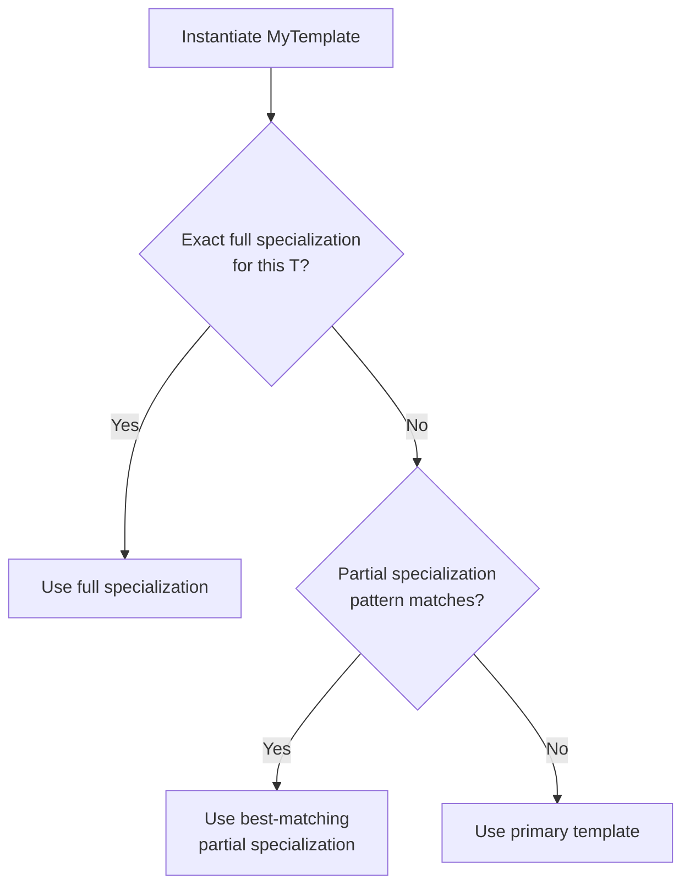
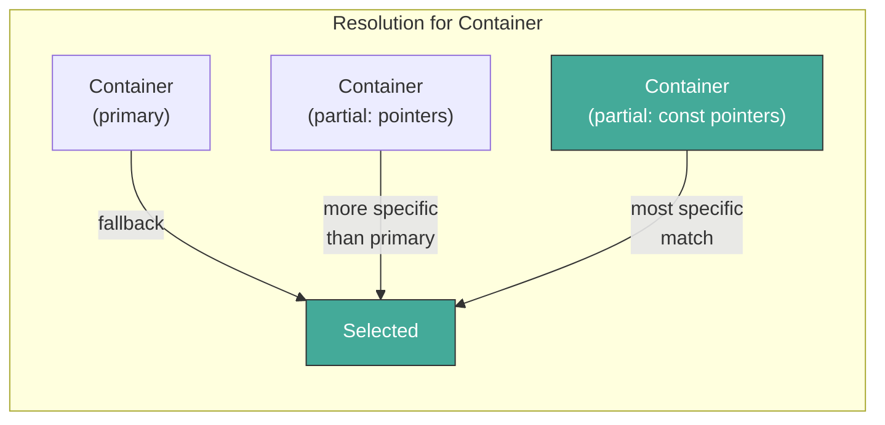

# Template Specialization

> Template specialization lets you override a generic template's implementation for specific types or type patterns, giving you the generality of templates with the precision of hand-tuned code where it matters.

## Table of Contents
- [Core Concepts](#core-concepts)
- [Code Examples](#code-examples)
- [Common Pitfalls](#common-pitfalls)
- [Key Takeaways](#key-takeaways)
- [Exercises](#exercises)

## Core Concepts

### Why Specialization Exists

#### What

A template gives you one implementation that works for all types. But sometimes "all types" is too broad. Some types need different behavior — a different algorithm, a different memory layout, or special error handling. Template specialization is the mechanism that lets you say: "For *this* specific type (or this specific pattern of types), use *this* implementation instead of the generic one."

#### How

Think of it as an override system for templates. The compiler always picks the most specific match:

1. If an exact (full) specialization exists for the requested type, use it.
2. If a partial specialization matches the type pattern, use it.
3. Otherwise, fall back to the primary (unspecialized) template.

This is not runtime polymorphism — there are no vtables, no virtual dispatch. The compiler resolves which version to use at compile time and generates only the code for that version. Zero overhead.



#### Why It Matters

The entire STL depends on this mechanism. `std::vector<bool>` is a full specialization that packs bits into integers instead of storing each `bool` as a separate byte — same interface, radically different implementation. `std::hash` is a primary template that's intentionally left undefined for user types, requiring you to provide a full specialization. Without specialization, templates would be limited to a one-size-fits-all approach, and the performance-critical corners of the standard library would be impossible.

### Full Template Specialization

#### What

Full specialization (also called explicit specialization) replaces the generic template with a completely custom implementation for one specific type. You provide all template arguments — there are no remaining template parameters. The syntax uses `template<>` with an empty angle bracket pair.

#### How

You start with a primary template, then define a specialization by writing `template<>` followed by the class or function name with the specific type filled in.

```cpp
// Primary template — the general case
template<typename T>
struct Serializer {
    static std::string serialize(const T& value) {
        // Generic: convert to string using operator<<
        std::ostringstream oss;
        oss << value;
        return oss.str();
    }
};

// Full specialization for bool — different behavior
template<>
struct Serializer<bool> {
    static std::string serialize(const bool& value) {
        return value ? "true" : "false";  // not "1" / "0"
    }
};
```

When you call `Serializer<int>::serialize(42)`, the compiler uses the primary template. When you call `Serializer<bool>::serialize(true)`, it uses the specialization. The selection happens at compile time — the "wrong" version is never instantiated.

Full specialization works for both class templates and function templates, though for functions, overloading is usually a better tool (more on this in Common Pitfalls).

#### Why It Matters

Full specialization is the right tool when one specific type needs fundamentally different behavior. The classic real-world example is `std::vector<bool>`. The primary `std::vector<T>` template stores elements contiguously in memory, one `T` per slot. But `std::vector<bool>` is a full specialization that packs 8 booleans into a single byte, using a bitset-like representation. This saves memory (1 bit per `bool` instead of 1 byte) but changes the semantics — `operator[]` returns a proxy object, not a `bool&`, which is why `std::vector<bool>` is famously controversial. It demonstrates both the power and the danger of specialization: you can change *anything* about the implementation, including things users don't expect to change.

### Partial Template Specialization

#### What

Partial specialization matches a *pattern* of types rather than one specific type. Instead of saying "when `T` is `bool`," you say "when `T` is any pointer type" or "when `T` is any `std::pair`." You still have template parameters, but they're more constrained than the primary template.

#### How

Partial specialization is only available for class templates (not function templates — a deliberate language restriction). You write a template with fewer or more constrained parameters, and specify the pattern in the class name:

```cpp
// Primary template — handles any single type
template<typename T>
struct TypeInfo {
    static constexpr const char* description = "general type";
};

// Partial specialization — matches any pointer type T*
template<typename T>
struct TypeInfo<T*> {
    static constexpr const char* description = "pointer type";
};

// Partial specialization — matches any reference type T&
template<typename T>
struct TypeInfo<T&> {
    static constexpr const char* description = "lvalue reference type";
};
```

The key insight: `TypeInfo<T*>` is still a template (it has a parameter `T`), but it only matches when the original argument is a pointer. `TypeInfo<int*>` matches the pointer specialization with `T = int`. `TypeInfo<int>` matches the primary template.

You can also partially specialize on multiple parameters:

```cpp
// Primary template with two parameters
template<typename T, typename U>
struct Pair {
    T first;
    U second;
};

// Partial specialization: both types are the same
template<typename T>
struct Pair<T, T> {
    T first;
    T second;
    // Could add optimizations for same-type pairs
};
```

The compiler uses an ordering rule: a more specialized template always wins over a less specialized one. If the compiler can't determine which partial specialization is "more specialized," it reports an ambiguity error — you must resolve it with a more specific specialization or redesign.

#### Why It Matters

Partial specialization is the backbone of template metaprogramming. Almost every type trait in `<type_traits>` is implemented using partial specialization. `std::is_pointer<T>` is `false` in the primary template but `true` in a `<T*>` partial specialization. `std::remove_const<const T>` strips the `const` by partially specializing on the `const T` pattern and exposing the inner `T`. Without partial specialization, you'd have no way to decompose types at compile time.

It's also how you optimize generic containers for specific type patterns. A generic `SmartPointer<T>` might have a partial specialization `SmartPointer<T[]>` that uses `delete[]` instead of `delete` — this is exactly what `std::unique_ptr` does.

### The Specialization Resolution Order

#### What

When you instantiate a template, the compiler must decide which version to use: the primary template, a partial specialization, or a full specialization. This decision follows a precise ordering.

#### How

The compiler resolves specializations in this order:

1. **Full specializations** are checked first. If one matches the exact types, it wins unconditionally.
2. **Partial specializations** are checked next. The compiler finds all partial specializations that match the requested types, then selects the "most specialized" one (the one whose pattern is the narrowest).
3. **The primary template** is used as the fallback if no specialization matches.



For `Container<const int*>`:
- The primary `Container<T>` matches (with `T = const int*`).
- The partial specialization `Container<T*>` matches (with `T = const int`).
- The partial specialization `Container<const T*>` matches (with `T = int`).
- `Container<const T*>` is more specialized than `Container<T*>` because every `const T*` is a `T*`, but not every `T*` is a `const T*`. The most specific wins.

#### Why It Matters

Understanding this ordering is essential for debugging template code. When your specialization isn't being selected, it's almost always because the ordering rules didn't match what you expected. The compiler isn't guessing — it's following a deterministic algorithm. If you know the rules, you can predict exactly which version will be instantiated.

### Function Template Specialization vs. Overloading

#### What

Function templates can be fully specialized, but they *cannot* be partially specialized. This is a language restriction, and it has a practical consequence: for functions, you should almost always prefer overloading over specialization.

#### How

When you overload a function template, the compiler considers both template and non-template overloads, and prefers the non-template version when both match equally well. This gives you more predictable behavior than specialization:

```cpp
// Primary template
template<typename T>
void process(T value) { /* generic */ }

// This is an overload, not a specialization — and it's better
void process(int value) { /* int-specific */ }
```

With function template specialization, you'd write `template<> void process<int>(int value)`. But specializations of function templates interact with overload resolution in surprising ways — a specialization is tied to a specific primary template and doesn't participate in overload resolution independently. This can cause the wrong version to be called.

#### Why It Matters

The C++ Core Guidelines (T.144) recommend: "Don't specialize function templates." Use overloads for functions and full/partial specialization for class templates. If you need partial specialization behavior for a function, wrap the function in a class template (a "dispatch struct") and partially specialize the class.

## Code Examples

### Full Specialization — Custom Serializer

```cpp
#include <iostream>
#include <sstream>
#include <string>
#include <vector>

// Primary template: generic serialization using operator<<.
// Works for any type that supports stream insertion.
template<typename T>
struct Serializer {
    static std::string to_string(const T& value) {
        std::ostringstream oss;
        oss << value;
        return oss.str();
    }
};

// Full specialization for bool.
// The generic version would produce "1" / "0" (because that's how
// bool streams by default). We want "true" / "false" instead.
template<>
struct Serializer<bool> {
    static std::string to_string(const bool& value) {
        return value ? "true" : "false";
    }
};

// Full specialization for std::string.
// The generic version works fine, but we can skip the ostringstream
// overhead entirely — a string is already a string.
template<>
struct Serializer<std::string> {
    static std::string to_string(const std::string& value) {
        return "\"" + value + "\"";  // wrap in quotes for clarity
    }
};

// Full specialization for std::vector<int>.
// Demonstrates that you can specialize on any concrete type,
// including complex ones like std::vector<int>.
template<>
struct Serializer<std::vector<int>> {
    static std::string to_string(const std::vector<int>& values) {
        std::string result = "[";
        for (std::size_t i = 0; i < values.size(); ++i) {
            if (i > 0) result += ", ";
            result += std::to_string(values[i]);
        }
        result += "]";
        return result;
    }
};

// Convenience function — wraps the struct-based dispatch.
template<typename T>
std::string serialize(const T& value) {
    return Serializer<T>::to_string(value);
}

int main() {
    std::cout << serialize(42) << '\n';                // "42" — primary template
    std::cout << serialize(3.14) << '\n';              // "3.14" — primary template
    std::cout << serialize(true) << '\n';              // "true" — bool specialization
    std::cout << serialize(std::string{"hello"}) << '\n';  // "\"hello\"" — string specialization

    const std::vector<int> nums = {1, 2, 3, 4, 5};
    std::cout << serialize(nums) << '\n';              // "[1, 2, 3, 4, 5]" — vector<int> specialization

    return 0;
}
```

### Partial Specialization — Smart Pointer for Arrays

```cpp
#include <cstddef>
#include <iostream>
#include <utility>

// A simplified unique pointer to demonstrate partial specialization.
// Primary template: manages a single object via delete.
template<typename T>
class UniquePtr {
public:
    explicit UniquePtr(T* ptr = nullptr) : ptr_(ptr) {}

    ~UniquePtr() {
        delete ptr_;  // single-object delete
    }

    // Move constructor — transfers ownership
    UniquePtr(UniquePtr&& other) noexcept : ptr_(other.ptr_) {
        other.ptr_ = nullptr;
    }

    // Move assignment
    UniquePtr& operator=(UniquePtr&& other) noexcept {
        if (this != &other) {
            delete ptr_;
            ptr_ = other.ptr_;
            other.ptr_ = nullptr;
        }
        return *this;
    }

    // No copying
    UniquePtr(const UniquePtr&) = delete;
    UniquePtr& operator=(const UniquePtr&) = delete;

    T& operator*() const { return *ptr_; }
    T* operator->() const { return ptr_; }
    T* get() const { return ptr_; }

private:
    T* ptr_;
};

// Partial specialization for array types (T[]).
// This is the same pattern std::unique_ptr uses: UniquePtr<int[]>
// uses delete[] instead of delete, and provides operator[] instead
// of operator* and operator->.
template<typename T>
class UniquePtr<T[]> {
public:
    explicit UniquePtr(T* ptr = nullptr) : ptr_(ptr) {}

    ~UniquePtr() {
        delete[] ptr_;  // array delete — crucial difference
    }

    UniquePtr(UniquePtr&& other) noexcept : ptr_(other.ptr_) {
        other.ptr_ = nullptr;
    }

    UniquePtr& operator=(UniquePtr&& other) noexcept {
        if (this != &other) {
            delete[] ptr_;
            ptr_ = other.ptr_;
            other.ptr_ = nullptr;
        }
        return *this;
    }

    UniquePtr(const UniquePtr&) = delete;
    UniquePtr& operator=(const UniquePtr&) = delete;

    // Array access — no operator* or operator->, because dereferencing
    // an array pointer is almost always a mistake.
    T& operator[](std::size_t index) const { return ptr_[index]; }
    T* get() const { return ptr_; }

private:
    T* ptr_;
};

int main() {
    // Single-object version — uses delete
    UniquePtr<int> single(new int{42});
    std::cout << "Single: " << *single << '\n';

    // Array version — uses delete[], provides operator[]
    UniquePtr<int[]> array(new int[5]{10, 20, 30, 40, 50});
    for (std::size_t i = 0; i < 5; ++i) {
        std::cout << "Array[" << i << "]: " << array[i] << '\n';
    }

    // The compiler selects the correct specialization automatically:
    // UniquePtr<int>   → primary template → delete
    // UniquePtr<int[]> → partial spec for T[] → delete[]

    return 0;
}
```

### Partial Specialization for Type Decomposition

```cpp
#include <iostream>
#include <string>

// A compile-time type inspector using partial specialization.
// The primary template handles the "base case" — an unadorned type.
template<typename T>
struct TypeDescriptor {
    static std::string describe() {
        return "value type";
    }
};

// Partial specialization: pointer types
template<typename T>
struct TypeDescriptor<T*> {
    static std::string describe() {
        return "pointer to " + TypeDescriptor<T>::describe();
    }
};

// Partial specialization: const types
template<typename T>
struct TypeDescriptor<const T> {
    static std::string describe() {
        return "const " + TypeDescriptor<T>::describe();
    }
};

// Partial specialization: lvalue reference types
template<typename T>
struct TypeDescriptor<T&> {
    static std::string describe() {
        return "lvalue reference to " + TypeDescriptor<T>::describe();
    }
};

// Partial specialization: rvalue reference types
template<typename T>
struct TypeDescriptor<T&&> {
    static std::string describe() {
        return "rvalue reference to " + TypeDescriptor<T>::describe();
    }
};

// Convenience function
template<typename T>
std::string describe_type() {
    return TypeDescriptor<T>::describe();
}

int main() {
    // Each instantiation recurses through the specializations,
    // peeling off one layer at a time until hitting the primary template.
    std::cout << describe_type<int>()             << '\n';  // "value type"
    std::cout << describe_type<int*>()            << '\n';  // "pointer to value type"
    std::cout << describe_type<const int*>()      << '\n';  // "pointer to const value type"
    std::cout << describe_type<const int* const>() << '\n'; // "const pointer to const value type"
    std::cout << describe_type<int&>()            << '\n';  // "lvalue reference to value type"
    std::cout << describe_type<int&&>()           << '\n';  // "rvalue reference to value type"
    std::cout << describe_type<int**>()           << '\n';  // "pointer to pointer to value type"

    return 0;
}
```

### Specialization Resolution in Action

```cpp
#include <iostream>
#include <string>

// This example demonstrates the compiler's specialization selection.
// We define a primary template and multiple specializations, then
// observe which one the compiler picks for each type.

// Primary template — the most general catch-all
template<typename T>
struct Classifier {
    static constexpr const char* value = "unclassified";
};

// Full specialization for int
template<>
struct Classifier<int> {
    static constexpr const char* value = "int (full specialization)";
};

// Partial specialization for any pointer type
template<typename T>
struct Classifier<T*> {
    static constexpr const char* value = "pointer (partial specialization)";
};

// Partial specialization for pointer-to-const
// More specialized than T*, so it wins for const T* arguments
template<typename T>
struct Classifier<const T*> {
    static constexpr const char* value = "pointer-to-const (partial specialization)";
};

// Full specialization for int* — more specific than the T* partial spec
template<>
struct Classifier<int*> {
    static constexpr const char* value = "int* (full specialization)";
};

template<typename T>
void classify() {
    std::cout << Classifier<T>::value << '\n';
}

int main() {
    classify<double>();       // "unclassified" — primary template
    classify<int>();          // "int (full specialization)"
    classify<double*>();      // "pointer (partial specialization)"
    classify<const double*>();// "pointer-to-const (partial specialization)"
    classify<int*>();         // "int* (full specialization)" — full > partial
    classify<const int*>();   // "pointer-to-const (partial specialization)"
    classify<std::string>();  // "unclassified" — primary template

    return 0;
}
```

## Common Pitfalls

### Specializing function templates instead of overloading

```cpp
// BAD — function template specialization has surprising interactions with overloading
#include <iostream>
#include <string>

template<typename T>
void log_value(T value) {
    std::cout << "Generic: " << value << '\n';
}

// This is a full specialization of the above template for int*.
// But if someone adds another overload later, this specialization
// might silently stop being called.
template<>
void log_value<int*>(int* value) {
    std::cout << "Int pointer: " << *value << '\n';
}

// Now someone adds a pointer overload — this is a NEW primary template.
// The specialization above is tied to the first template, not this one.
template<typename T>
void log_value(T* value) {
    std::cout << "Pointer: " << *value << '\n';
}

int main() {
    int x = 42;
    log_value(&x);
    // You might expect the int* specialization, but the compiler
    // picks the T* overload instead. The specialization of the
    // first template is invisible when the second overload is a better match.
    return 0;
}
```

Function template specializations don't participate in overload resolution independently — they're "attached" to their primary template. When overload resolution picks a different primary template, your specialization is never even considered. This is confusing and error-prone.

```cpp
// GOOD — use overloads instead of function template specialization
#include <iostream>
#include <string>

template<typename T>
void log_value(T value) {
    std::cout << "Generic: " << value << '\n';
}

// A plain overload — participates in overload resolution directly.
// No surprises, no hidden interactions.
void log_value(int* value) {
    std::cout << "Int pointer: " << *value << '\n';
}

// If you need to handle all pointers, use a template overload.
// This is clear and predictable.
template<typename T>
void log_value(T* value) {
    std::cout << "Pointer: " << *value << '\n';
}

int main() {
    int x = 42;
    log_value(&x);    // Calls the int* overload — non-templates win ties
    double d = 3.14;
    log_value(&d);    // Calls the T* overload
    log_value(42);    // Calls the generic T overload
    return 0;
}
```

### Forgetting to declare the primary template before specializing

```cpp
// BAD — specialization without a visible primary template
#include <iostream>

// Oops — no primary template declared. This won't compile.
// The compiler needs to see the primary template first so it knows
// what's being specialized.
template<>
struct Formatter<int> {
    static void format(int value) {
        std::cout << value << '\n';
    }
};
```

The compiler must see the primary template declaration before any specialization. This seems obvious in isolation, but it bites you in large codebases where the primary template is in one header and the specialization is in another. If the specialization header forgets to `#include` the primary template's header, you get a confusing compiler error.

```cpp
// GOOD — primary template is visible before specialization
#include <iostream>

// Primary template — must be declared first
template<typename T>
struct Formatter {
    static void format(const T& value) {
        std::cout << "[generic] " << value << '\n';
    }
};

// Now the specialization can reference it
template<>
struct Formatter<int> {
    static void format(const int& value) {
        std::cout << "[int] " << value << '\n';
    }
};

int main() {
    Formatter<double>::format(3.14);  // "[generic] 3.14"
    Formatter<int>::format(42);       // "[int] 42"
    return 0;
}
```

### Accidentally using the primary template because the specialization wasn't visible

```cpp
// BAD — specialization defined after the point of instantiation
#include <iostream>

template<typename T>
struct Converter {
    static int to_int(const T& value) {
        return static_cast<int>(value);
    }
};

// The primary template is instantiated HERE for bool.
// The compiler commits to the primary template's definition.
void use_converter() {
    std::cout << Converter<bool>::to_int(true) << '\n';  // uses primary
}

// This specialization comes too late — the bool instantiation already happened.
// This is undefined behavior (ODR violation) if both versions are used.
template<>
struct Converter<bool> {
    static int to_int(const bool& value) {
        return value ? 1 : -1;  // different behavior
    }
};
```

If the compiler instantiates a template before seeing a specialization for that type, the specialization may be silently ignored (or worse, cause an ODR violation). Always declare specializations in the same header as the primary template, or ensure the specialization is visible before any instantiation.

```cpp
// GOOD — specialization declared before any instantiation
#include <iostream>

template<typename T>
struct Converter {
    static int to_int(const T& value) {
        return static_cast<int>(value);
    }
};

// Specialization comes BEFORE any use — the compiler sees it in time.
template<>
struct Converter<bool> {
    static int to_int(const bool& value) {
        return value ? 1 : -1;
    }
};

void use_converter() {
    std::cout << Converter<bool>::to_int(true) << '\n';   // uses specialization: 1 -> -1 mapping
    std::cout << Converter<double>::to_int(3.7) << '\n';  // uses primary: 3
}

int main() {
    use_converter();
    return 0;
}
```

### Expecting partial specialization to work for function templates

```cpp
// BAD — partial specialization of function templates is not allowed
#include <iostream>

template<typename T>
void process(T value) {
    std::cout << "Generic: " << value << '\n';
}

// This will NOT compile — C++ does not support partial specialization
// of function templates. This is a language restriction, not a compiler bug.
// template<typename T>
// void process<T*>(T* value) {   // ERROR: illegal syntax
//     std::cout << "Pointer: " << *value << '\n';
// }
```

If you need partial specialization behavior for a function, use one of two approaches: (1) overload the function (simple and preferred), or (2) delegate to a class template that *can* be partially specialized (the "dispatch struct" idiom).

```cpp
// GOOD — approach 1: function overloading (preferred when sufficient)
#include <iostream>

template<typename T>
void process(T value) {
    std::cout << "Generic: " << value << '\n';
}

template<typename T>
void process(T* value) {
    std::cout << "Pointer: " << *value << '\n';
}

// GOOD — approach 2: dispatch struct (when you need true partial specialization)
template<typename T>
struct ProcessImpl {
    static void execute(T value) {
        std::cout << "Generic: " << value << '\n';
    }
};

template<typename T>
struct ProcessImpl<T*> {
    static void execute(T* value) {
        std::cout << "Pointer: " << *value << '\n';
    }
};

template<typename T>
void process_v2(T value) {
    ProcessImpl<T>::execute(value);
}

int main() {
    int x = 42;
    process(x);     // "Generic: 42"
    process(&x);    // "Pointer: 42"
    process_v2(x);  // "Generic: 42"
    process_v2(&x); // "Pointer: 42"
    return 0;
}
```

## Key Takeaways

- **Full specialization** replaces a template's implementation for one exact type. Use it when a specific type needs fundamentally different behavior — `std::vector<bool>` is the canonical (and cautionary) example.
- **Partial specialization** matches a *pattern* of types (all pointers, all const types, all pairs where both types are the same). It's only available for class templates, and it's the foundation of type traits and compile-time type manipulation.
- **The compiler always picks the most specific match**: full specialization beats partial specialization beats the primary template. Understanding this ordering is essential for debugging template code.
- **Don't specialize function templates** — use overloads instead. Function template specializations have surprising interactions with overload resolution that lead to subtle bugs.
- **Declare specializations before they're needed.** If the compiler instantiates a template before seeing your specialization, it uses the primary template and your specialization is silently ignored (ODR violation).

## Exercises

1. `std::vector<bool>` is a full specialization of `std::vector`. Explain why this specialization exists, what it changes about the implementation, and why many C++ experts consider it a design mistake. What specific operation behaves differently compared to `std::vector<char>`?

2. Write a class template `Stringify<T>` that converts values to strings. Provide the primary template (using `std::to_string` for numeric types) and full specializations for `bool` (producing `"true"`/`"false"`), `const char*` (wrapping in quotes), and `std::string` (also wrapping in quotes). Write a `main()` function that tests all versions.

3. Write a class template `Storage<T>` with partial specializations for `T*` (pointer types) and `T&` (reference types). The primary template should store a value directly, the pointer specialization should store a copy of the pointed-to value (deep copy semantics), and the reference specialization should store a reference. Explain which specialization the compiler selects for `Storage<int>`, `Storage<int*>`, and `Storage<int&>`.

4. Explain why the following code might not behave as expected. What does the compiler actually do, and how would you fix it?
   ```cpp
   template<typename T>
   void handle(T value) { std::cout << "A"; }

   template<typename T>
   void handle(T* value) { std::cout << "B"; }

   template<>
   void handle<int*>(int* value) { std::cout << "C"; }

   int x = 0;
   handle(&x);  // What prints?
   ```

5. Implement a `TypeName<T>` class template that returns a human-readable string for the type. Use partial specialization to handle `const T`, `T*`, `T&`, and `T&&`, recursively decomposing compound types. For example, `TypeName<const int*&>::name()` should return something like `"ref to ptr to const int"`. Test with at least five different compound types.
