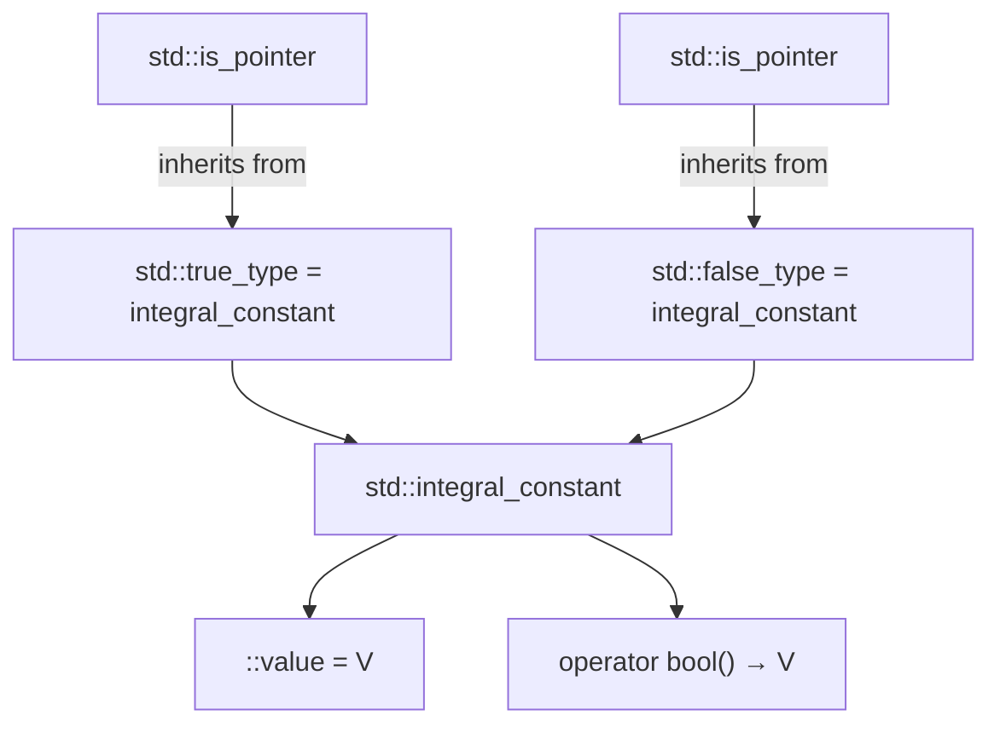

# Type Traits

> Type traits are compile-time queries about types — they let your templates ask "Is this an integer? Is it const? Is it a pointer?" and make different decisions based on the answers, all before a single line of code runs.

## Table of Contents
- [Core Concepts](#core-concepts)
- [Code Examples](#code-examples)
- [Common Pitfalls](#common-pitfalls)
- [Key Takeaways](#key-takeaways)
- [Exercises](#exercises)

## Core Concepts

### What Are Type Traits?

#### What

A type trait is a small struct template that exposes compile-time information about a type. You pass a type as a template argument, and the trait gives you back a boolean (`true`/`false`), a modified type, or some other compile-time constant. The standard library provides over 100 type traits in the `<type_traits>` header (introduced in C++11, expanded in C++14 and C++17).

Type traits come in two flavors:
- **Query traits** answer questions: "Is `T` an integer?" (`std::is_integral<T>`), "Is `T` a pointer?" (`std::is_pointer<T>`). They expose a `::value` member that is `true` or `false`.
- **Transformation traits** produce modified types: "What is `T` without `const`?" (`std::remove_const<T>`), "What is the decayed form of `T`?" (`std::decay<T>`). They expose a `::type` member that is the resulting type.

#### How

Under the hood, type traits are implemented using the template specialization you learned earlier in this week. The general pattern is:

```cpp
// Primary template: the default answer is false
template<typename T>
struct is_pointer : std::false_type {};

// Partial specialization: true for any pointer type
template<typename T>
struct is_pointer<T*> : std::true_type {};
```

That's it. When you write `is_pointer<int>`, the primary template matches and `::value` is `false`. When you write `is_pointer<int*>`, the partial specialization matches and `::value` is `true`. The entire `<type_traits>` header is built from variations of this pattern.

`std::true_type` and `std::false_type` are themselves just `std::integral_constant<bool, true>` and `std::integral_constant<bool, false>` — they provide the `::value` member, implicit conversion to `bool`, and other utilities.



#### Why It Matters

Type traits are the foundation of compile-time decision-making in C++. Before type traits, generic code had to accept any type and hope for the best — if you passed the wrong type, you'd get cryptic compiler errors deep inside template instantiation. With type traits, you can:

- **Constrain templates**: Reject types that don't meet requirements at compile time, with clear error messages.
- **Optimize for specific types**: Use a faster algorithm for integral types, a different memory layout for trivially copyable types.
- **Transform types**: Strip qualifiers, decay arrays to pointers, remove references — all at compile time.
- **Enable conditional compilation**: Use `if constexpr` with type traits to compile different code paths for different types, with zero runtime overhead.

### Query Traits — Asking Questions About Types

#### What

Query traits are the "is this type a ___?" family. The standard library provides dozens of them, organized into categories. Here are the most important ones:

**Primary type categories** (every type falls into exactly one):
- `std::is_integral<T>` — `bool`, `char`, `int`, `long`, etc.
- `std::is_floating_point<T>` — `float`, `double`, `long double`
- `std::is_pointer<T>` — raw pointer types (`T*`)
- `std::is_array<T>` — C-style arrays (`T[]`, `T[N]`)
- `std::is_class<T>` — class or struct types
- `std::is_enum<T>` — enum types
- `std::is_void<T>` — `void`

**Type relationships**:
- `std::is_same<T, U>` — are `T` and `U` the exact same type?
- `std::is_base_of<Base, Derived>` — is `Base` a base class of `Derived`?
- `std::is_convertible<From, To>` — can `From` be implicitly converted to `To`?

**Type properties**:
- `std::is_const<T>` — is `T` const-qualified?
- `std::is_reference<T>` — is `T` a reference (lvalue or rvalue)?
- `std::is_trivially_copyable<T>` — can `T` be safely `memcpy`'d?

#### How

All query traits expose a static `constexpr bool value` member. C++17 introduced `_v` suffixes as shorthand:

```cpp
// Verbose (C++11 style)
static_assert(std::is_integral<int>::value, "int is integral");

// Concise (C++17 style — always prefer this)
static_assert(std::is_integral_v<int>);
```

The `_v` suffix is just a variable template alias:
```cpp
template<typename T>
inline constexpr bool is_integral_v = is_integral<T>::value;
```

Always use the `_v` suffix in C++17 code — it's shorter, clearer, and there's no reason not to.

#### Why It Matters

Query traits let you write generic code that adapts to the type it receives. Instead of hoping the caller passes the right type, you can check at compile time and either reject bad types (`static_assert`) or choose different code paths (`if constexpr`). This is the difference between "your code crashes with a confusing error" and "your code tells the caller exactly what's wrong."

### Transformation Traits — Modifying Types

#### What

Transformation traits take a type and produce a different type. They don't change values — they operate entirely at the type level. The most common ones:

**Removing qualifiers**:
- `std::remove_const<T>` — strips `const` (e.g., `const int` -> `int`)
- `std::remove_volatile<T>` — strips `volatile`
- `std::remove_cv<T>` — strips both `const` and `volatile`
- `std::remove_reference<T>` — strips `&` or `&&` (e.g., `int&` -> `int`)
- `std::remove_pointer<T>` — strips one level of `*` (e.g., `int*` -> `int`)

**Adding qualifiers**:
- `std::add_const<T>` — adds `const`
- `std::add_lvalue_reference<T>` — adds `&`
- `std::add_pointer<T>` — adds `*`

**Composite transformations**:
- `std::decay<T>` — applies the same transformations the compiler applies when you pass an argument by value: removes references, removes top-level cv-qualifiers, converts arrays to pointers, converts functions to function pointers. This is the "what type does `auto x = expr;` deduce?" trait.

#### How

Transformation traits expose a `::type` member alias. C++17 introduced `_t` suffixes as shorthand:

```cpp
// Verbose (C++11 style)
typename std::remove_const<const int>::type x = 42;  // x is int

// Concise (C++17 style — always prefer this)
std::remove_const_t<const int> x = 42;  // x is int
```

Under the hood, `std::remove_const` is implemented with partial specialization:

```cpp
// Primary template: T is not const, so just expose T
template<typename T>
struct remove_const {
    using type = T;
};

// Partial specialization: T is const, so strip the const
template<typename T>
struct remove_const<const T> {
    using type = T;
};
```

This is the same pattern as the type decomposition example from the specialization lesson. The partial specialization for `const T` matches when the input type is const, and it "peels off" the const by exposing the inner `T`.

#### Why It Matters

Transformation traits are essential when you need to normalize types before comparing or using them. A common scenario: you have a template parameter `T` that might be `const int&` or `int` or `const int` — but you want to treat them all the same. `std::decay_t<T>` strips references and cv-qualifiers, giving you the "plain" type regardless of how it was qualified.

They're also critical for implementing perfect forwarding, writing type-safe wrappers, and building higher-level metaprogramming utilities. You'll see `std::remove_reference_t` constantly in template code — it's how `std::move` is implemented.

### `std::decay` — The "Pass By Value" Transformation

#### What

`std::decay` simulates what happens to a type when you pass it by value to a function. The compiler applies several transformations during by-value argument passing, and `std::decay` replicates all of them:

1. Removes references (`int&` -> `int`)
2. Removes top-level cv-qualifiers (`const int` -> `int`)
3. Converts arrays to pointers (`int[5]` -> `int*`)
4. Converts functions to function pointers (`void(int)` -> `void(*)(int)`)

#### How

```cpp
// All of these decay to the same type: int
static_assert(std::is_same_v<std::decay_t<int>, int>);
static_assert(std::is_same_v<std::decay_t<int&>, int>);
static_assert(std::is_same_v<std::decay_t<int&&>, int>);
static_assert(std::is_same_v<std::decay_t<const int&>, int>);

// Array decay: int[5] → int*
static_assert(std::is_same_v<std::decay_t<int[5]>, int*>);

// Function decay: void(int) → void(*)(int)
static_assert(std::is_same_v<std::decay_t<void(int)>, void(*)(int)>);
```

#### Why It Matters

`std::decay` is the right tool when you need to store a copy of a value whose type might include references or qualifiers. It's used extensively in the implementation of `std::make_pair`, `std::make_tuple`, `std::bind`, and similar utilities. When you write `auto x = expr;`, the deduced type of `x` is approximately `std::decay_t<decltype(expr)>`. Understanding `std::decay` means understanding how C++ deduces types.

You'll see `std::decay_t` frequently in `if constexpr` blocks with `std::visit`:

```cpp
std::visit([](const auto& val) {
    using T = std::decay_t<decltype(val)>;
    if constexpr (std::is_same_v<T, int>) {
        // handle int
    }
}, my_variant);
```

Here, `decltype(val)` is `const int&` (because `val` is a const reference), but you want to compare against `int`, not `const int&`. `std::decay_t` bridges that gap.

### Using Type Traits with `if constexpr`

#### What

`if constexpr` (C++17) is a compile-time conditional: the compiler evaluates the condition at compile time and *discards* the branch that isn't taken. Combined with type traits, it lets you write different code for different types inside a single template — no SFINAE, no overload tricks, no tag dispatch.

#### How

```cpp
template<typename T>
std::string to_debug_string(const T& value) {
    if constexpr (std::is_integral_v<T>) {
        return "int:" + std::to_string(value);
    } else if constexpr (std::is_floating_point_v<T>) {
        return "float:" + std::to_string(value);
    } else if constexpr (std::is_pointer_v<T>) {
        // The pointer branch can dereference — this code is only
        // compiled when T is actually a pointer type.
        return "ptr -> " + to_debug_string(*value);
    } else {
        // Fallback: use operator<< via ostringstream
        std::ostringstream oss;
        oss << value;
        return "other:" + oss.str();
    }
}
```

The critical point: the discarded branches are not compiled. This means you can write code that *would* be invalid for some types — as long as the branch is discarded for those types. In the example above, dereferencing `*value` would be a compile error if `T` is `int`, but it's fine because that branch is only compiled when `T` is a pointer.

This is fundamentally different from a regular `if` statement, where both branches must be valid for the given type.

#### Why It Matters

`if constexpr` + type traits is the modern replacement for SFINAE and tag dispatch in most scenarios. It's dramatically more readable — you can see the logic in one place instead of scattered across multiple overloads. Prefer `if constexpr` over SFINAE whenever both approaches work. SFINAE is still needed when you want to remove a function from the overload set entirely (e.g., to let a different overload win), but for "do different things based on the type," `if constexpr` is almost always the better tool.

### Writing Custom Type Traits

#### What

The standard library covers common cases, but you'll often need traits specific to your domain. A custom type trait follows the same pattern as the standard ones: a primary template (the default answer) and specializations for the types that match.

#### How

There are two approaches to writing custom type traits:

**Approach 1: Manual specialization.** You define a trait with a `false` default, then specialize for each type that should return `true`.

```cpp
// "Is T one of our serializable types?"
template<typename T>
struct is_serializable : std::false_type {};

template<>
struct is_serializable<int> : std::true_type {};

template<>
struct is_serializable<std::string> : std::true_type {};

template<>
struct is_serializable<double> : std::true_type {};

// Convenience variable template (C++17)
template<typename T>
inline constexpr bool is_serializable_v = is_serializable<T>::value;
```

**Approach 2: Compose from existing traits.** You combine standard traits to build more complex queries.

```cpp
// "Is T a numeric type?" = integral OR floating-point
template<typename T>
struct is_numeric : std::bool_constant<
    std::is_integral_v<T> || std::is_floating_point_v<T>
> {};

template<typename T>
inline constexpr bool is_numeric_v = is_numeric<T>::value;
```

`std::bool_constant<expr>` (C++17) is a convenience for creating a type that inherits from `std::true_type` or `std::false_type` based on a boolean expression.

**Approach 3: Detection-based traits.** You write a trait that checks whether a type supports a specific operation (e.g., "Does `T` have a `.size()` method?"). This requires SFINAE or C++20 concepts, which are covered in Week 17.

#### Why It Matters

Custom type traits let you encode your domain's type constraints directly in the type system. Instead of documenting "this function only works with serializable types" in a comment, you encode it as `static_assert(is_serializable_v<T>)` — the compiler enforces it, and the error message tells the caller exactly what went wrong. This is particularly valuable in library code where you can't predict what types users will pass.

## Code Examples

### Standard Query Traits in Action

```cpp
#include <iostream>
#include <string>
#include <type_traits>
#include <vector>

// A compile-time type inspector that demonstrates the most commonly
// used query traits from <type_traits>.
template<typename T>
void inspect_type(const char* name) {
    std::cout << "=== " << name << " ===\n";

    // Primary type categories — every type belongs to exactly one
    std::cout << "  is_integral:        " << std::is_integral_v<T> << '\n';
    std::cout << "  is_floating_point:  " << std::is_floating_point_v<T> << '\n';
    std::cout << "  is_pointer:         " << std::is_pointer_v<T> << '\n';
    std::cout << "  is_array:           " << std::is_array_v<T> << '\n';
    std::cout << "  is_class:           " << std::is_class_v<T> << '\n';
    std::cout << "  is_enum:            " << std::is_enum_v<T> << '\n';

    // Type properties
    std::cout << "  is_const:           " << std::is_const_v<T> << '\n';
    std::cout << "  is_reference:       " << std::is_reference_v<T> << '\n';

    // Composite checks
    std::cout << "  is_arithmetic:      " << std::is_arithmetic_v<T> << '\n';
    std::cout << "  is_fundamental:     " << std::is_fundamental_v<T> << '\n';

    std::cout << '\n';
}

enum class Color { Red, Green, Blue };

int main() {
    inspect_type<int>("int");
    inspect_type<double>("double");
    inspect_type<int*>("int*");
    inspect_type<const int>("const int");
    inspect_type<std::string>("std::string");
    inspect_type<Color>("Color (enum class)");
    inspect_type<int[10]>("int[10]");

    // std::is_same — exact type comparison
    static_assert(std::is_same_v<int, int>);
    static_assert(!std::is_same_v<int, long>);

    // Note: const int and int are DIFFERENT types
    static_assert(!std::is_same_v<int, const int>);

    // Use std::remove_const_t to compare ignoring const
    static_assert(std::is_same_v<std::remove_const_t<const int>, int>);

    std::cout << "All static_asserts passed.\n";
    return 0;
}
```

### Transformation Traits — Type Manipulation

```cpp
#include <iostream>
#include <string>
#include <type_traits>

// Demonstrates how transformation traits modify types at compile time.
// This is a compile-time-only example — all checks happen via static_assert.

// Helper: prints "PASS" if the assertion holds (for runtime confirmation)
template<typename Expected, typename Actual>
void check_type(const char* description) {
    constexpr bool match = std::is_same_v<Expected, Actual>;
    static_assert(match);  // compile-time guarantee
    std::cout << (match ? "PASS" : "FAIL") << " — " << description << '\n';
}

int main() {
    // std::remove_const — strips top-level const
    check_type<int, std::remove_const_t<const int>>(
        "remove_const<const int> → int");

    // Note: remove_const only strips TOP-LEVEL const.
    // const int* is "pointer to const int" — the const is on the int, not the pointer.
    check_type<const int*, std::remove_const_t<const int*>>(
        "remove_const<const int*> → const int* (unchanged!)");

    // To strip const from the pointee, you'd need remove_const on the pointed-to type.
    // int* const is "const pointer to int" — the const IS top-level here.
    check_type<int*, std::remove_const_t<int* const>>(
        "remove_const<int* const> → int*");

    // std::remove_reference — strips & or &&
    check_type<int, std::remove_reference_t<int&>>(
        "remove_reference<int&> → int");
    check_type<int, std::remove_reference_t<int&&>>(
        "remove_reference<int&&> → int");
    check_type<int, std::remove_reference_t<int>>(
        "remove_reference<int> → int (already not a reference)");

    // std::remove_pointer — strips one level of *
    check_type<int, std::remove_pointer_t<int*>>(
        "remove_pointer<int*> → int");
    check_type<int*, std::remove_pointer_t<int**>>(
        "remove_pointer<int**> → int* (only one level)");

    // std::decay — the "pass by value" transformation
    check_type<int, std::decay_t<const int&>>(
        "decay<const int&> → int");
    check_type<int*, std::decay_t<int[10]>>(
        "decay<int[10]> → int* (array to pointer)");
    check_type<int, std::decay_t<const volatile int&&>>(
        "decay<const volatile int&&> → int");

    // std::add_const, std::add_pointer, std::add_lvalue_reference
    check_type<const int, std::add_const_t<int>>(
        "add_const<int> → const int");
    check_type<int*, std::add_pointer_t<int>>(
        "add_pointer<int> → int*");
    check_type<int&, std::add_lvalue_reference_t<int>>(
        "add_lvalue_reference<int> → int&");

    return 0;
}
```

### `if constexpr` + Type Traits — Compile-Time Dispatch

```cpp
#include <iostream>
#include <sstream>
#include <string>
#include <type_traits>
#include <vector>

// A type-aware serializer that uses if constexpr to select the right
// conversion strategy at compile time. Each branch is only compiled
// when the type actually matches — code in discarded branches can
// contain operations invalid for other types.

template<typename T>
std::string to_json(const T& value) {
    if constexpr (std::is_same_v<std::decay_t<T>, bool>) {
        // Must check bool BEFORE is_integral, because bool is integral.
        // is_integral_v<bool> is true, so without this check,
        // booleans would be serialized as 0/1 instead of true/false.
        return value ? "true" : "false";

    } else if constexpr (std::is_integral_v<T>) {
        return std::to_string(value);

    } else if constexpr (std::is_floating_point_v<T>) {
        // Use ostringstream for floating-point to control formatting.
        std::ostringstream oss;
        oss << value;
        return oss.str();

    } else if constexpr (std::is_same_v<std::decay_t<T>, std::string>) {
        return "\"" + value + "\"";

    } else if constexpr (std::is_same_v<std::decay_t<T>, const char*> ||
                         std::is_same_v<std::decay_t<T>, char*>) {
        // C strings — wrap in quotes
        return std::string("\"") + value + "\"";

    } else if constexpr (std::is_pointer_v<T>) {
        // For non-string pointers, serialize the pointed-to value.
        // This dereferences the pointer — only valid when T is a pointer.
        // The branch is discarded for non-pointer types, so this is safe.
        if (value == nullptr) {
            return "null";
        }
        return to_json(*value);

    } else {
        // If none of the above match, produce a compile error
        // with a clear message. static_assert(false) would always fire,
        // but making it depend on T defers evaluation to instantiation.
        static_assert(!std::is_same_v<T, T>,
                      "to_json: unsupported type");
    }
}

// Overload for std::vector — demonstrates combining type traits
// with container handling
template<typename T>
std::string to_json(const std::vector<T>& vec) {
    std::string result = "[";
    for (std::size_t i = 0; i < vec.size(); ++i) {
        if (i > 0) result += ", ";
        result += to_json(vec[i]);
    }
    result += "]";
    return result;
}

int main() {
    std::cout << to_json(42) << '\n';                          // 42
    std::cout << to_json(3.14) << '\n';                        // 3.14
    std::cout << to_json(true) << '\n';                        // true
    std::cout << to_json(std::string{"hello"}) << '\n';        // "hello"
    std::cout << to_json("world") << '\n';                     // "world"

    int x = 99;
    int* px = &x;
    std::cout << to_json(px) << '\n';                          // 99

    int* null_ptr = nullptr;
    std::cout << to_json(null_ptr) << '\n';                    // null

    const std::vector<int> nums = {1, 2, 3};
    std::cout << to_json(nums) << '\n';                        // [1, 2, 3]

    const std::vector<std::string> words = {"foo", "bar"};
    std::cout << to_json(words) << '\n';                       // ["foo", "bar"]

    return 0;
}
```

### Writing Custom Type Traits

```cpp
#include <iostream>
#include <string>
#include <type_traits>
#include <vector>

// ============================================================
// Custom trait 1: is_string_like
// True for types that can be implicitly used as string content:
// std::string, const char*, std::string_view
// ============================================================

template<typename T>
struct is_string_like : std::false_type {};

// Specialize for each string-like type
template<>
struct is_string_like<std::string> : std::true_type {};

template<>
struct is_string_like<const char*> : std::true_type {};

template<>
struct is_string_like<char*> : std::true_type {};

// C++17 convenience variable template
template<typename T>
inline constexpr bool is_string_like_v = is_string_like<T>::value;

// ============================================================
// Custom trait 2: is_container
// True for types that have begin() and end() iterators.
// Uses SFINAE (void_t detection idiom) — this is a preview of
// Week 17's material, shown here because it's the standard
// pattern for "does this type have member X?" traits.
// ============================================================

// Primary template: default to false
template<typename T, typename = void>
struct is_container : std::false_type {};

// Partial specialization: true if T has begin() and end()
// std::void_t<...> is valid (and produces void) if all the
// expressions inside are valid. If any expression is invalid,
// SFINAE kicks in and the specialization is discarded.
template<typename T>
struct is_container<T, std::void_t<
    decltype(std::declval<T>().begin()),
    decltype(std::declval<T>().end())
>> : std::true_type {};

template<typename T>
inline constexpr bool is_container_v = is_container<T>::value;

// ============================================================
// Custom trait 3: is_numeric (composed from standard traits)
// ============================================================

template<typename T>
struct is_numeric : std::bool_constant<
    std::is_integral_v<T> || std::is_floating_point_v<T>
> {};

template<typename T>
inline constexpr bool is_numeric_v = is_numeric<T>::value;

// ============================================================
// Using custom traits to constrain and dispatch
// ============================================================

// Only accepts numeric types — clear compile-time error otherwise
template<typename T>
T safe_divide(T numerator, T denominator) {
    static_assert(is_numeric_v<T>,
                  "safe_divide only works with numeric types");

    if constexpr (std::is_integral_v<T>) {
        // Integer division — check for division by zero
        if (denominator == 0) {
            std::cerr << "Division by zero!\n";
            return 0;
        }
        return numerator / denominator;
    } else {
        // Floating-point division — no zero check needed,
        // result will be inf or nan (IEEE 754 behavior)
        return numerator / denominator;
    }
}

// A debug printer that adapts behavior based on custom traits
template<typename T>
void debug_print(const T& value) {
    if constexpr (is_string_like_v<std::decay_t<T>>) {
        std::cout << "[string] \"" << value << "\"\n";
    } else if constexpr (is_numeric_v<std::decay_t<T>>) {
        std::cout << "[numeric] " << value << "\n";
    } else if constexpr (is_container_v<T>) {
        std::cout << "[container] { ";
        for (const auto& elem : value) {
            std::cout << elem << " ";
        }
        std::cout << "}\n";
    } else {
        std::cout << "[unknown type]\n";
    }
}

int main() {
    // Custom traits in static_assert — compile-time type checking
    static_assert(is_string_like_v<std::string>);
    static_assert(is_string_like_v<const char*>);
    static_assert(!is_string_like_v<int>);

    static_assert(is_container_v<std::vector<int>>);
    static_assert(is_container_v<std::string>);  // string has begin/end!
    static_assert(!is_container_v<int>);

    static_assert(is_numeric_v<int>);
    static_assert(is_numeric_v<double>);
    static_assert(!is_numeric_v<std::string>);

    // safe_divide with type constraint
    std::cout << safe_divide(10, 3) << '\n';     // 3 (integer division)
    std::cout << safe_divide(10.0, 3.0) << '\n'; // 3.33333
    std::cout << safe_divide(10, 0) << '\n';     // 0 (with error message)
    // safe_divide(std::string{"a"}, std::string{"b"});  // compile error!

    // debug_print using custom trait dispatch
    debug_print(42);
    debug_print(3.14);
    debug_print(std::string{"hello"});
    debug_print("world");
    debug_print(std::vector<int>{1, 2, 3, 4, 5});

    return 0;
}
```

### Real-World Pattern: Type-Safe Unit Conversion

```cpp
#include <iostream>
#include <type_traits>

// A practical example: compile-time unit system using type traits.
// This pattern is used in production physics/engineering code to
// prevent unit mismatches (e.g., adding meters to seconds).

// Tag types — no data, just used for compile-time identification
struct Meters {};
struct Kilometers {};
struct Seconds {};
struct Hours {};

// A quantity: a numeric value with a unit tag
template<typename UnitTag, typename ValueType = double>
struct Quantity {
    static_assert(std::is_arithmetic_v<ValueType>,
                  "Quantity value must be a numeric type");

    ValueType value;

    constexpr explicit Quantity(ValueType v) : value(v) {}
};

// Custom trait: are two units compatible for addition?
template<typename U1, typename U2>
struct is_same_dimension : std::false_type {};

template<>
struct is_same_dimension<Meters, Meters> : std::true_type {};
template<>
struct is_same_dimension<Meters, Kilometers> : std::true_type {};
template<>
struct is_same_dimension<Kilometers, Meters> : std::true_type {};
template<>
struct is_same_dimension<Kilometers, Kilometers> : std::true_type {};
template<>
struct is_same_dimension<Seconds, Seconds> : std::true_type {};
template<>
struct is_same_dimension<Seconds, Hours> : std::true_type {};
template<>
struct is_same_dimension<Hours, Seconds> : std::true_type {};
template<>
struct is_same_dimension<Hours, Hours> : std::true_type {};

template<typename U1, typename U2>
inline constexpr bool is_same_dimension_v = is_same_dimension<U1, U2>::value;

// Custom trait: conversion factor between compatible units
template<typename From, typename To>
struct conversion_factor {
    static constexpr double value = 1.0;  // default: same unit
};

template<>
struct conversion_factor<Kilometers, Meters> {
    static constexpr double value = 1000.0;
};

template<>
struct conversion_factor<Meters, Kilometers> {
    static constexpr double value = 0.001;
};

template<>
struct conversion_factor<Hours, Seconds> {
    static constexpr double value = 3600.0;
};

template<>
struct conversion_factor<Seconds, Hours> {
    static constexpr double value = 1.0 / 3600.0;
};

// Convert between compatible units
template<typename ToUnit, typename FromUnit, typename V>
constexpr Quantity<ToUnit, V> convert(Quantity<FromUnit, V> q) {
    static_assert(is_same_dimension_v<FromUnit, ToUnit>,
                  "Cannot convert between incompatible dimensions");
    return Quantity<ToUnit, V>(
        static_cast<V>(q.value * conversion_factor<FromUnit, ToUnit>::value)
    );
}

// Addition: only compiles if units are the same
// (for simplicity, requires exact same unit — a production version
// would auto-convert compatible units)
template<typename Unit, typename V>
constexpr Quantity<Unit, V> operator+(Quantity<Unit, V> a, Quantity<Unit, V> b) {
    return Quantity<Unit, V>(a.value + b.value);
}

int main() {
    constexpr auto distance = Quantity<Kilometers>(5.0);
    constexpr auto converted = convert<Meters>(distance);
    std::cout << distance.value << " km = "
              << converted.value << " m\n";  // 5 km = 5000 m

    constexpr auto time = Quantity<Hours>(2.0);
    constexpr auto time_s = convert<Seconds>(time);
    std::cout << time.value << " h = "
              << time_s.value << " s\n";  // 2 h = 7200 s

    // Same-unit addition works
    constexpr auto total = Quantity<Meters>(100.0) + Quantity<Meters>(200.0);
    std::cout << "Total: " << total.value << " m\n";  // 300 m

    // This would NOT compile — caught at compile time by static_assert:
    // auto bad = convert<Seconds>(distance);
    //   error: "Cannot convert between incompatible dimensions"

    // This would NOT compile — operator+ requires same unit:
    // auto bad2 = Quantity<Meters>(1.0) + Quantity<Seconds>(1.0);

    return 0;
}
```

## Common Pitfalls

### Forgetting that `is_integral` includes `bool` and `char`

```cpp
// BAD — treating is_integral as "is this an integer number?"
#include <iostream>
#include <type_traits>

template<typename T>
void print_as_number(T value) {
    if constexpr (std::is_integral_v<T>) {
        // This prints 'A' as 65, and true as 1 — probably not what you want
        std::cout << "Number: " << value << '\n';
    }
}

int main() {
    print_as_number(42);      // "Number: 42" — fine
    print_as_number('A');     // "Number: 65" — char is integral!
    print_as_number(true);    // "Number: 1"  — bool is integral!
    return 0;
}
```

`std::is_integral` returns `true` for `bool`, `char`, `wchar_t`, `char16_t`, `char32_t`, and all signed/unsigned integer types. If you only want "number-like integers," you need to exclude `bool` and character types explicitly.

```cpp
// GOOD — check specifically for the types you actually mean
#include <iostream>
#include <type_traits>

// Custom trait: is T an integer, but not bool or char?
template<typename T>
inline constexpr bool is_integer_number_v =
    std::is_integral_v<T> &&
    !std::is_same_v<std::remove_cv_t<T>, bool> &&
    !std::is_same_v<std::remove_cv_t<T>, char> &&
    !std::is_same_v<std::remove_cv_t<T>, wchar_t> &&
    !std::is_same_v<std::remove_cv_t<T>, char16_t> &&
    !std::is_same_v<std::remove_cv_t<T>, char32_t>;

template<typename T>
void print_as_number(T value) {
    if constexpr (is_integer_number_v<T>) {
        std::cout << "Number: " << value << '\n';
    } else if constexpr (std::is_same_v<std::remove_cv_t<T>, bool>) {
        std::cout << "Boolean: " << (value ? "true" : "false") << '\n';
    } else if constexpr (std::is_same_v<std::remove_cv_t<T>, char>) {
        std::cout << "Character: '" << value << "'\n";
    }
}

int main() {
    print_as_number(42);      // "Number: 42"
    print_as_number('A');     // "Character: 'A'"
    print_as_number(true);    // "Boolean: true"
    return 0;
}
```

### Using `std::is_same` without removing qualifiers

```cpp
// BAD — is_same is exact, including const and reference qualifiers
#include <string>
#include <type_traits>

template<typename T>
void process(const T& value) {
    // This check will NEVER match inside this function, because
    // decltype(value) is const std::string&, not std::string.
    if constexpr (std::is_same_v<decltype(value), std::string>) {
        // Dead code — never compiled
    }
}
```

`std::is_same` checks for exact type identity. `const int&` is not `int`. `const std::string&` is not `std::string`. When comparing types inside templates, you almost always need `std::decay_t` or `std::remove_cv_t<std::remove_reference_t<T>>` to strip qualifiers first.

```cpp
// GOOD — strip qualifiers before comparing
#include <iostream>
#include <string>
#include <type_traits>

template<typename T>
void process(const T& value) {
    // Option 1: compare against T directly (already stripped by template deduction)
    if constexpr (std::is_same_v<T, std::string>) {
        std::cout << "String: " << value << '\n';
    }

    // Option 2: if you have decltype(value), use decay_t
    if constexpr (std::is_same_v<std::decay_t<decltype(value)>, std::string>) {
        std::cout << "String (via decay): " << value << '\n';
    }
}

int main() {
    process(std::string{"hello"});  // Both checks match
    process(42);                    // Neither check matches
    return 0;
}
```

### Confusing `remove_const` on pointer types

```cpp
// BAD — misunderstanding what "top-level const" means for pointers
#include <type_traits>

// const int* is "pointer to const int" — the const is on the INT, not the pointer.
// remove_const strips top-level const, which is the const ON the pointer itself.
static_assert(std::is_same_v<
    std::remove_const_t<const int*>,
    const int*   // unchanged! The pointer itself isn't const.
>);

// int* const is "const pointer to int" — NOW the pointer itself is const.
static_assert(std::is_same_v<
    std::remove_const_t<int* const>,
    int*         // const stripped from the pointer
>);
```

This confusion arises because `const int*` reads as "const int pointer" but means "pointer to const int." The `const` applies to the pointee, not the pointer. `remove_const` only strips the outermost (top-level) const — it doesn't reach into the pointee type.

```cpp
// GOOD — understand the pointer-const distinction
#include <type_traits>

// To strip const from the POINTEE, you need to decompose the pointer:
// 1. Remove the pointer: const int* → const int
// 2. Remove the const:   const int  → int
// 3. Add the pointer back: int      → int*

template<typename T>
struct remove_pointee_const {
    using type = T;  // non-pointer: no change
};

template<typename T>
struct remove_pointee_const<const T*> {
    using type = T*;  // pointer to const T → pointer to T
};

template<typename T>
using remove_pointee_const_t = typename remove_pointee_const<T>::type;

static_assert(std::is_same_v<remove_pointee_const_t<const int*>, int*>);
static_assert(std::is_same_v<remove_pointee_const_t<int*>, int*>);
```

### Using `if` instead of `if constexpr` with type-dependent operations

```cpp
// BAD — regular if doesn't discard branches, so invalid code still fails
#include <iostream>
#include <string>
#include <type_traits>

template<typename T>
void describe(const T& value) {
    // Regular if — BOTH branches must compile for the given type.
    // When T is int, value.size() doesn't exist → compile error.
    if (std::is_class_v<T>) {
        std::cout << "Class with size: " << value.size() << '\n';  // ERROR for int
    } else {
        std::cout << "Primitive: " << value << '\n';
    }
}
```

With a regular `if`, both branches are compiled regardless of the condition. The compiler doesn't know (or care) that `std::is_class_v<int>` is `false` — it still tries to compile `value.size()` for `int`, which fails.

```cpp
// GOOD — if constexpr discards the invalid branch at compile time
#include <iostream>
#include <string>
#include <type_traits>

template<typename T>
void describe(const T& value) {
    // if constexpr — the false branch is discarded, so value.size()
    // is never compiled when T is int.
    if constexpr (std::is_class_v<T>) {
        // Only compiled when T is a class type
        std::cout << "Object\n";
    } else {
        std::cout << "Primitive: " << value << '\n';
    }
}

int main() {
    describe(42);                       // "Primitive: 42"
    describe(std::string{"hello"});     // "Object"
    return 0;
}
```

## Key Takeaways

- **Type traits are compile-time type introspection.** They let your templates ask questions about types and make decisions based on the answers. Query traits (`is_integral`, `is_pointer`, `is_same`) return booleans; transformation traits (`remove_const`, `remove_reference`, `decay`) return modified types.
- **Always use the `_v` and `_t` suffixes** in C++17 code. `std::is_integral_v<T>` instead of `std::is_integral<T>::value`, `std::remove_const_t<T>` instead of `typename std::remove_const<T>::type`. Shorter, clearer, no `typename` keyword needed.
- **`std::decay_t` is your best friend** when comparing types. Template parameters often carry references and cv-qualifiers that you don't care about. `decay_t` strips them all, giving you the "plain" type. Use it before `is_same_v` comparisons.
- **Prefer `if constexpr` over SFINAE** for compile-time type dispatch. It's dramatically more readable and maintainable. SFINAE is still needed for removing functions from overload sets, but for "do X for integers, Y for floats," `if constexpr` is the right tool.
- **Write custom type traits for your domain.** Encode type constraints as traits and enforce them with `static_assert`. This turns documentation into compiler-enforced contracts — "this function requires a numeric type" becomes a compile error, not a runtime surprise.

## Exercises

1. Explain the difference between `std::remove_const_t<const int*>` and `std::remove_const_t<int* const>`. What does each produce, and why? Draw out the type structure of `const int*` vs `int* const` to clarify.

2. Write a function template `numeric_cast<To>(from)` that converts between numeric types (integral and floating-point). Use `static_assert` with type traits to ensure both `To` and `From` are arithmetic types. Use `if constexpr` to print a warning to `std::cerr` when converting from a floating-point type to an integral type (lossy narrowing). Test with `numeric_cast<int>(3.14)` and `numeric_cast<double>(42)`.

3. Implement a custom type trait `is_string_convertible<T>` that is `true` for types that can be converted to `std::string` — specifically `std::string`, `const char*`, `char*`, and `std::string_view`. Provide the convenience variable template `is_string_convertible_v<T>`. Use it in a `to_string_safe` function that returns `std::string` for string-convertible types and calls `std::to_string` for numeric types (use `if constexpr` to dispatch).

4. `std::vector<bool>` is a template specialization that packs bits. One consequence is that `std::vector<bool>::operator[]` returns a proxy object, not a `bool&`. Write a small program that demonstrates this difference: show code that works with `std::vector<int>` (taking a reference from `operator[]`) but fails or behaves differently with `std::vector<bool>`. Then use type traits (`std::is_same_v`) to verify at compile time that the return type of `operator[]` differs between the two.

5. Design a `TypeAnalyzer<T>` struct that exposes the following `static constexpr` members, all computed using standard type traits:
   - `is_numeric` (`bool`)
   - `is_string_like` (`bool`)
   - `is_container` (`bool`) (hint: use `std::void_t` to detect `begin()`/`end()`)
   - `is_pointer` (`bool`)
   - `bare_type` (a type alias via `using` — the type after applying `std::decay_t` and `std::remove_pointer_t`)
   - A `static std::string describe()` method that returns a human-readable description like `"numeric pointer"` or `"string-like container"`.
   Test with `TypeAnalyzer<const int*>`, `TypeAnalyzer<std::vector<int>&>`, and `TypeAnalyzer<std::string>`.
