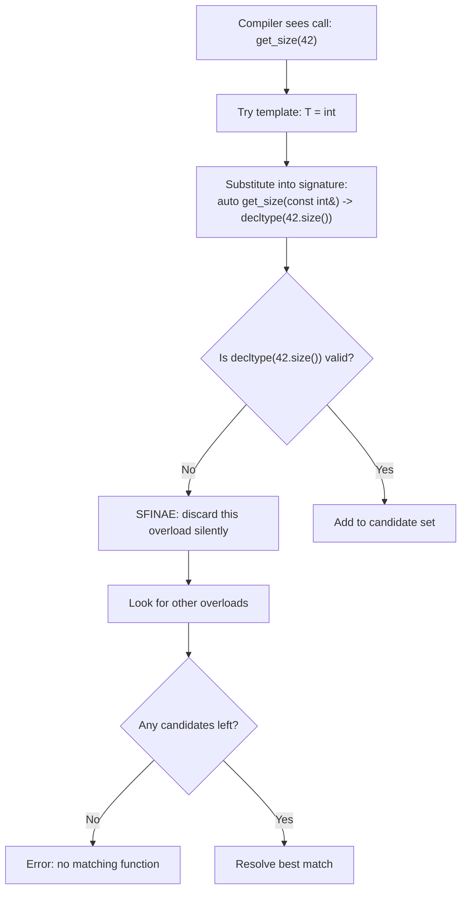
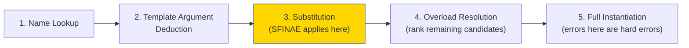
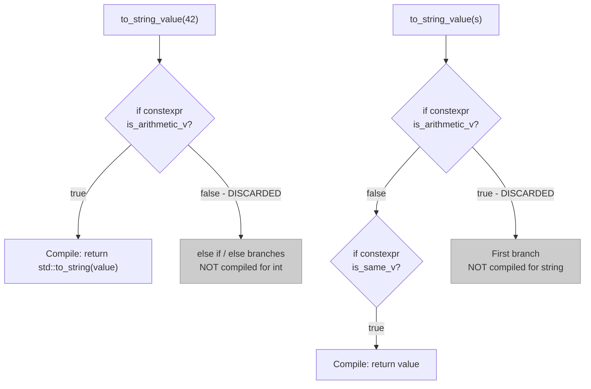

# SFINAE, enable_if & Compile-Time Dispatch

> SFINAE is the mechanism that lets the C++ compiler silently discard template overloads that would produce invalid types, enabling you to write functions that only exist for types satisfying specific properties — and `if constexpr` is the modern C++17 alternative that makes most SFINAE unnecessary.

## Table of Contents
- [Core Concepts](#core-concepts)
- [Code Examples](#code-examples)
- [Common Pitfalls](#common-pitfalls)
- [Key Takeaways](#key-takeaways)
- [Exercises](#exercises)

## Core Concepts

### SFINAE — "Substitution Failure Is Not An Error"

#### What

SFINAE is a rule in C++ template instantiation: when the compiler tries to substitute template arguments into a function template's signature and the substitution produces an invalid type or expression, the compiler does not emit an error. Instead, it silently removes that overload from the candidate set and continues looking at other overloads. The acronym stands for "Substitution Failure Is Not An Error."

This is not a feature someone designed in a meeting. It is a consequence of how C++ overload resolution interacts with templates. The compiler must consider all candidate functions when resolving a call. If a template candidate would produce nonsense after substitution, the compiler simply moves on — it does not give up.

#### How

Consider a function template that tries to call `.size()` on its argument:

```cpp
template<typename T>
auto get_size(const T& container) -> decltype(container.size()) {
    return container.size();
}
```

If you call `get_size(42)`, the compiler tries to substitute `T = int` into the signature. The return type becomes `decltype(42.size())` — which is invalid because `int` has no `.size()` method. Under SFINAE, this is not a compile error. The compiler removes this overload from the candidate set. If no other overload matches, *then* you get an error — but the error is "no matching function," not "int has no member named size."

The key subtlety: SFINAE only applies to failures in the **immediate context** of substitution — the function signature, return type, and template parameter defaults. Failures inside the function body are hard errors, not SFINAE. This distinction is crucial and trips up even experienced developers.



#### Why It Matters

SFINAE is the foundation of compile-time dispatch in C++ prior to C++20 Concepts. It lets you write overloaded functions where each overload is only visible for types that satisfy certain properties. Without SFINAE, you could not write a function that "only exists for integral types" or "only exists for types with a `.begin()` method." Every template would be a candidate for every call, and the first invalid substitution would halt compilation.

SFINAE is what makes `std::enable_if`, type traits, and the entire `<type_traits>` header useful. It is the mechanism that powers conditional template instantiation. Understanding SFINAE is prerequisite to understanding how the standard library constrains its own templates — why `std::vector::push_back` works with copyable types but fails gracefully with non-copyable ones, for instance.

That said, SFINAE is notoriously difficult to read and write. It is the "assembly language" of compile-time dispatch — powerful, but low-level and error-prone. Modern C++17 provides `if constexpr` as a far cleaner alternative for many use cases, and C++20 Concepts will eventually replace SFINAE almost entirely.

### The Overload Resolution Pipeline and Where SFINAE Fits

#### What

To truly understand SFINAE, you need to understand where it sits in the compiler's overload resolution process. The compiler does not just pick the first function it finds — it follows a multi-step pipeline to select the best candidate.

#### How

When the compiler encounters a function call, it:

1. **Name lookup** — finds all functions and function templates with the matching name.
2. **Template argument deduction** — for each function template, deduces the template arguments from the call arguments.
3. **Substitution** — substitutes the deduced (or explicitly provided) template arguments into the function template's signature. **This is where SFINAE happens.** If substitution produces an invalid type, the template is removed from the candidate set — no error.
4. **Overload resolution** — from the remaining candidates, selects the best match using the standard ranking rules (exact match > promotion > conversion, non-template preferred over template, etc.).
5. **Instantiation** — the selected function template is fully instantiated. Errors here (in the function body) are hard errors.



The yellow step is where SFINAE lives. Failures at step 3 are silent removals. Failures at step 5 are fatal.

#### Why It Matters

This pipeline explains why some template errors produce clear "no matching function" messages (SFINAE removed all candidates) while others produce incomprehensible walls of template error text (a candidate survived SFINAE but failed during full instantiation). When you write SFINAE-based code, you are engineering failures to happen at step 3 — in the immediate context of substitution — so they are handled gracefully instead of exploding at step 5.

### Type Traits — The Building Blocks of SFINAE

#### What

Type traits are compile-time predicates that answer questions about types: "Is this type an integer?", "Is this type trivially copyable?", "Does this type have a copy constructor?" They live in `<type_traits>` and are the vocabulary you use to express constraints in SFINAE expressions.

A type trait is a template struct with a `static constexpr bool value` member (or inheriting from `std::true_type` / `std::false_type`). The `_v` suffix variants (e.g., `std::is_integral_v<T>`) are shorthand for `::value`.

#### How

Common type traits you will use with SFINAE and `enable_if`:

| Trait | Checks |
|-------|--------|
| `std::is_integral_v<T>` | `T` is `int`, `long`, `char`, `bool`, etc. |
| `std::is_floating_point_v<T>` | `T` is `float`, `double`, `long double` |
| `std::is_arithmetic_v<T>` | `T` is integral or floating-point |
| `std::is_pointer_v<T>` | `T` is a raw pointer type |
| `std::is_class_v<T>` | `T` is a class or struct |
| `std::is_same_v<T, U>` | `T` and `U` are the exact same type |
| `std::is_base_of_v<Base, Derived>` | `Base` is a base class of `Derived` |
| `std::is_convertible_v<From, To>` | `From` can be implicitly converted to `To` |
| `std::is_trivially_copyable_v<T>` | `T` can be safely `memcpy`'d |
| `std::is_default_constructible_v<T>` | `T` has a default constructor |

You can combine traits with `std::conjunction`, `std::disjunction`, and `std::negation` (C++17) for compound conditions:

```cpp
// True only if T is both integral AND unsigned
template<typename T>
constexpr bool is_unsigned_integral_v =
    std::conjunction_v<std::is_integral<T>, std::is_unsigned<T>>;
```

#### Why It Matters

Type traits are the *what* — they describe the property you care about. SFINAE and `enable_if` are the *how* — the mechanism that uses those properties to control overload visibility. You cannot write meaningful SFINAE without type traits. They are the compile-time equivalent of runtime `if` conditions, except they operate on types rather than values.

### `std::enable_if` — The Classic SFINAE Tool

#### What

`std::enable_if` is a metafunction that conditionally defines a type alias. If its boolean condition is `true`, `std::enable_if<true, T>::type` is `T`. If the condition is `false`, `std::enable_if<false, T>::type` does not exist — and since it appears in a template's immediate context, SFINAE kicks in and removes that overload.

```cpp
// Simplified implementation of enable_if
template<bool Condition, typename T = void>
struct enable_if {};  // primary template: no 'type' member

template<typename T>
struct enable_if<true, T> {
    using type = T;  // partial specialization: defines 'type' only when Condition is true
};
```

When the condition is `false`, accessing `enable_if<false>::type` triggers a substitution failure, which SFINAE handles by discarding the overload. The C++14 alias `std::enable_if_t<Cond, T>` is shorthand for `typename std::enable_if<Cond, T>::type`.

#### How

There are three common places to put `enable_if` in a function template:

**1. In the return type (most common for free functions):**

```cpp
template<typename T>
std::enable_if_t<std::is_integral_v<T>, T>
double_value(T value) {
    return value * 2;
}
```

When `T` is `int`, the return type resolves to `int`. When `T` is `std::string`, `std::enable_if_t<false, std::string>` is invalid, SFINAE discards the overload.

**2. As a template parameter default (cleanest for most cases):**

```cpp
template<typename T,
         std::enable_if_t<std::is_integral_v<T>, int> = 0>
T double_value(T value) {
    return value * 2;
}
```

The `= 0` provides a default value for the dummy parameter. When the condition is `false`, the parameter type does not exist, triggering SFINAE. This approach keeps the return type and parameter list clean.

**3. As a function parameter (rare, mostly in constructors):**

```cpp
template<typename T>
T double_value(T value,
               std::enable_if_t<std::is_integral_v<T>>* = nullptr) {
    return value * 2;
}
```

This is less common but necessary for constructors, which have no return type to hijack.

#### Why It Matters

`std::enable_if` was the standard tool for constraining templates from C++11 through C++17. You will encounter it everywhere in legacy codebases, the standard library implementation, and third-party libraries like Boost and Eigen. Even if you prefer `if constexpr` in your own code (and you should — see below), you must be able to read and understand `enable_if` because it is the lingua franca of template metaprogramming.

The fundamental pattern is always the same: **use a type trait to express a condition, feed it to `enable_if`, and let SFINAE remove the overload when the condition is false.**

### `if constexpr` (C++17) — Compile-Time Branching

#### What

`if constexpr` is a C++17 feature that evaluates a condition at compile time. The branch that is not taken is **discarded entirely** — it is not compiled, not type-checked (beyond basic syntax), and not instantiated. This is fundamentally different from a regular `if`, where both branches must be valid even if one is never executed.

Think of `if constexpr` as a compile-time `#ifdef` that understands C++ types and values, with none of the preprocessor's problems.

#### How

```cpp
template<typename T>
std::string to_string_value(const T& value) {
    if constexpr (std::is_arithmetic_v<T>) {
        // This branch is only compiled when T is an arithmetic type.
        // We can safely use std::to_string here because we know T is numeric.
        return std::to_string(value);
    } else if constexpr (std::is_same_v<T, std::string>) {
        // This branch is only compiled when T is std::string.
        return value;
    } else {
        // Fallback: compile-time error for unsupported types.
        // static_assert(false) would always fire — the dependent expression
        // delays evaluation to instantiation time.
        static_assert(!std::is_same_v<T, T>, "Unsupported type for to_string_value");
    }
}
```

The key mechanism: when `T = int`, the `std::is_arithmetic_v<int>` condition is `true`, so the first branch is compiled. The `else if` and `else` branches are discarded — they are not instantiated, so even if they contain code that would be invalid for `int`, no error occurs.

This is what makes `if constexpr` powerful. In a regular `if`, both branches must compile for every instantiation of the template, even if only one branch is reachable. With `if constexpr`, discarded branches can contain arbitrary code that would be ill-formed for the current type.



#### Why It Matters

Before C++17, the only way to dispatch different code paths based on type properties was SFINAE — which meant writing separate overloaded functions, each with an `enable_if` constraint. For three type categories, you needed three separate functions. With `if constexpr`, you write one function with three branches. The code is shorter, easier to read, and much harder to get wrong.

`if constexpr` also solves problems that SFINAE cannot. SFINAE only controls which *overload* is selected — you cannot use SFINAE to conditionally compile different code paths within a single function body. `if constexpr` can. This makes it strictly more powerful for intra-function dispatch.

### `if constexpr` vs SFINAE — When to Use Which

#### What

Both `if constexpr` and SFINAE achieve compile-time dispatch based on type properties. But they work at different levels and have different strengths.

#### How

| Dimension | SFINAE / `enable_if` | `if constexpr` |
|-----------|---------------------|----------------|
| **Operates on** | Overload set (controls which function is visible) | Code paths within a single function |
| **Readability** | Low — cryptic syntax, nested `enable_if_t` | High — reads like a normal `if` statement |
| **Error messages** | Often terrible — deep template instantiation traces | Usually clear — "no matching function" or your `static_assert` |
| **Composability** | Poor — combining multiple constraints is verbose | Good — just add `else if constexpr` branches |
| **When to use** | When you need *different function signatures* (e.g., different return types, different parameter types across overloads) | When you need *different code paths* within one function |
| **C++ standard** | C++11+ | C++17+ |
| **Replacing** | — | Most uses of SFINAE in function bodies |

The rule of thumb: **use `if constexpr` by default. Fall back to SFINAE only when you need to control the overload set itself** — for example, when you want a function to be completely invisible (not just internally branching) based on a type property, or when two overloads have fundamentally different signatures.

#### Why It Matters

SFINAE was the best tool available from C++11 through C++14. It works, but it is hostile to read, hostile to write, and produces hostile error messages. `if constexpr` was introduced in C++17 specifically because SFINAE's ergonomics were a known pain point. In modern C++17 code, reaching for `enable_if` when `if constexpr` would work is an antipattern — it adds complexity for no benefit.

That said, SFINAE is not going away. The standard library is built on it, and any code targeting C++11/14 compatibility needs it. You need to understand SFINAE to read other people's code, debug template errors, and handle the cases where `if constexpr` genuinely does not suffice.

### `decltype` and `declval` — SFINAE Detection Utilities

#### What

`decltype` and `std::declval` are the tools you use to probe whether an expression is valid for a given type — without actually evaluating it. Together, they form the detection idiom that powers most custom SFINAE conditions.

`decltype(expr)` yields the type of `expr` without evaluating it. `std::declval<T>()` produces a reference to `T` in an unevaluated context — you can pretend you have an object of type `T` without actually constructing one. This is essential because `T` might not be default-constructible, and you need it in a `decltype` expression purely to check if an operation is valid.

#### How

The classic pattern for checking whether a type has a specific member function:

```cpp
#include <type_traits>
#include <utility>

// Primary template: default to false
template<typename T, typename = void>
struct has_size : std::false_type {};

// Specialization: if decltype(declval<T>().size()) is valid, this matches
template<typename T>
struct has_size<T, std::void_t<decltype(std::declval<T>().size())>>
    : std::true_type {};

template<typename T>
constexpr bool has_size_v = has_size<T>::value;
```

`std::void_t<...>` (C++17) is a utility that maps any valid set of types to `void`. Its purpose is to trigger SFINAE: if any type in `void_t<...>` is invalid (substitution failure), the specialization is discarded, and the primary template (which inherits from `false_type`) is used instead.

The pattern works like this:
1. The compiler tries to match the specialization. It evaluates `decltype(std::declval<T>().size())`.
2. If `T` has a `.size()` method, the `decltype` produces a valid type, `void_t` maps it to `void`, and the specialization matches (inheriting `true_type`).
3. If `T` does not have `.size()`, the `decltype` is invalid, SFINAE discards the specialization, and the primary template wins (inheriting `false_type`).

#### Why It Matters

The `void_t` detection idiom is the standard way to write custom type traits in C++17. Before `void_t`, you had to use arcane tricks with `sizeof` in SFINAE contexts or write complex `enable_if` chains. `void_t` unifies detection into a single, consistent pattern. Whenever you need to ask "does type T support operation X?", this is the tool.

`std::declval` is critical because many types cannot be default-constructed — and you often need to check whether a method exists on a type without having an actual instance. `declval<T>()` gives you a fake instance that only exists in unevaluated contexts (`decltype`, `sizeof`, `noexcept`). Using it outside those contexts is a compile error, which is a safety feature — it prevents accidentally constructing an object of a type you have no business constructing.

### Concepts Preview (C++20) — The Clean Replacement

#### What

C++20 Concepts are named, reusable constraints that replace SFINAE with clear, declarative syntax. Instead of `std::enable_if_t<std::is_integral_v<T>, int> = 0`, you write `requires std::integral<T>` — or simply place the concept name where you would put `typename`. Concepts are the end state that SFINAE was always reaching toward: a way to say "this template only works for types that satisfy these properties."

#### How

A concept is a compile-time predicate on types. The standard library defines many (`std::integral`, `std::floating_point`, `std::copyable`, `std::invocable`, etc.), and you can define your own:

```
// C++20 syntax — not for code examples, prose only
template<typename T>
concept Sizable = requires(T t) {
    { t.size() } -> std::convertible_to<std::size_t>;
};

template<Sizable T>
std::size_t get_size(const T& container) {
    return container.size();
}
```

If you call `get_size(42)`, the compiler checks whether `int` satisfies the `Sizable` concept. It does not, so the function is not a viable candidate. The error message says "constraints not satisfied: int does not satisfy Sizable" — not a 200-line template instantiation trace.

Concepts replace SFINAE, `enable_if`, `void_t` detection idioms, and most uses of `if constexpr` for type-based dispatch. They are the single biggest improvement to C++ template ergonomics since templates were introduced.

#### Why It Matters

Concepts are mentioned here because understanding SFINAE without knowing where the language is heading would be incomplete. Every SFINAE pattern in this lesson has a cleaner C++20 Concepts equivalent. When your codebase moves to C++20, you should migrate `enable_if` constraints to concepts. Until then, `if constexpr` is your primary tool and SFINAE is your fallback.

The evolution tells a story: SFINAE (C++98, accidental) was recognized as useful, `enable_if` (Boost, then C++11) formalized it, `if constexpr` (C++17) simplified the most common case, and Concepts (C++20) are the final, clean solution. Each step reduced the distance between what you *mean* and what you *write*.

## Code Examples

### Basic SFINAE with `enable_if` — Constraining a Function to Integral Types

```cpp
#include <iostream>
#include <string>
#include <type_traits>

// This function only exists when T is an integral type (int, long, char, bool, etc.).
// For non-integral types, enable_if_t<false, T> is invalid — SFINAE removes
// this overload from the candidate set.
template<typename T,
         std::enable_if_t<std::is_integral_v<T>, int> = 0>
T safe_negate(T value) {
    // For unsigned types, negation is well-defined but counterintuitive
    // (wraps around). This function is constrained to integral types
    // because negation doesn't make sense for strings, vectors, etc.
    return -value;
}

// A separate overload for floating-point types.
// Both overloads have the same name — the compiler picks the one whose
// enable_if condition is satisfied.
template<typename T,
         std::enable_if_t<std::is_floating_point_v<T>, int> = 0>
T safe_negate(T value) {
    return -value;
}

int main() {
    std::cout << safe_negate(42) << '\n';       // -42 (integral overload)
    std::cout << safe_negate(3.14) << '\n';     // -3.14 (floating-point overload)

    // safe_negate(std::string{"hello"});
    // ^ Compile error: no matching function for call to 'safe_negate'
    //   Both overloads are removed by SFINAE — string is neither integral
    //   nor floating-point.

    return 0;
}
```

### SFINAE with `enable_if` in Return Type Position

```cpp
#include <iostream>
#include <type_traits>

// enable_if in the return type: the return type itself is conditional.
// When the condition is false, the return type is invalid, and SFINAE
// removes the overload.

// Overload for integral types: return the value doubled
template<typename T>
std::enable_if_t<std::is_integral_v<T>, T>
smart_double(T value) {
    return value * 2;
}

// Overload for floating-point types: return the value doubled with a note
template<typename T>
std::enable_if_t<std::is_floating_point_v<T>, T>
smart_double(T value) {
    return value * 2.0;
}

// Overload for string-like types: duplicate the string
template<typename T>
std::enable_if_t<std::is_same_v<T, std::string>, T>
smart_double(const T& value) {
    return value + value;
}

int main() {
    std::cout << smart_double(21) << '\n';                   // 42
    std::cout << smart_double(1.5) << '\n';                  // 3.0
    std::cout << smart_double(std::string{"ha"}) << '\n';    // "haha"

    return 0;
}
```

### The `void_t` Detection Idiom — Custom Type Traits

```cpp
#include <iostream>
#include <string>
#include <type_traits>
#include <utility>
#include <vector>

// Detect whether a type has a .size() method returning something
// convertible to std::size_t.
//
// Primary template: default to false_type.
template<typename T, typename = void>
struct has_size_method : std::false_type {};

// Specialization: if the expression std::declval<T>().size() is valid,
// void_t maps it to void, this specialization matches, and we inherit true_type.
template<typename T>
struct has_size_method<T, std::void_t<decltype(std::declval<T>().size())>>
    : std::true_type {};

template<typename T>
constexpr bool has_size_method_v = has_size_method<T>::value;

// Detect whether a type supports operator<< with std::ostream
template<typename T, typename = void>
struct is_printable : std::false_type {};

template<typename T>
struct is_printable<T,
    std::void_t<decltype(std::declval<std::ostream&>() << std::declval<const T&>())>>
    : std::true_type {};

template<typename T>
constexpr bool is_printable_v = is_printable<T>::value;

// Use the custom traits with enable_if
template<typename T,
         std::enable_if_t<has_size_method_v<T>, int> = 0>
void report_size(const T& container) {
    std::cout << "Size: " << container.size() << '\n';
}

template<typename T,
         std::enable_if_t<!has_size_method_v<T>, int> = 0>
void report_size(const T&) {
    std::cout << "This type has no .size() method.\n";
}

int main() {
    // Compile-time checks — these are evaluated at compile time, not runtime
    static_assert(has_size_method_v<std::vector<int>>,  "vector has .size()");
    static_assert(has_size_method_v<std::string>,       "string has .size()");
    static_assert(!has_size_method_v<int>,              "int has no .size()");
    static_assert(!has_size_method_v<double>,           "double has no .size()");

    static_assert(is_printable_v<int>,          "int is printable");
    static_assert(is_printable_v<std::string>,  "string is printable");

    // Runtime demonstration of SFINAE-based dispatch
    const std::vector<int> nums = {1, 2, 3, 4, 5};
    const int value = 42;

    report_size(nums);    // "Size: 5"
    report_size(value);   // "This type has no .size() method."

    return 0;
}
```

### `if constexpr` — The Modern Alternative

```cpp
#include <iostream>
#include <sstream>
#include <string>
#include <type_traits>
#include <vector>

// A single function that handles multiple type categories using if constexpr.
// Compare this to the SFINAE version above, which requires three separate
// overloads with enable_if constraints. This is one function, and it reads
// like normal code.
template<typename T>
std::string serialize(const T& value) {
    if constexpr (std::is_arithmetic_v<T>) {
        // This branch is only compiled when T is a numeric type.
        // std::to_string is not valid for non-arithmetic types, but that's
        // fine — the compiler never sees this branch for strings or vectors.
        return std::to_string(value);
    } else if constexpr (std::is_same_v<std::decay_t<T>, std::string>) {
        // For strings, wrap in quotes.
        return "\"" + value + "\"";
    } else if constexpr (std::is_same_v<std::decay_t<T>, const char*> ||
                         std::is_same_v<std::decay_t<T>, char*>) {
        // For C-strings, convert to std::string and wrap in quotes.
        return "\"" + std::string(value) + "\"";
    } else {
        // Compile-time error for unsupported types.
        // The dependent false prevents this from firing for types that
        // take one of the branches above.
        static_assert(!std::is_same_v<T, T>,
                      "serialize: unsupported type");
    }
}

// A more realistic example: a function that handles containers with .begin()/.end()
// differently from scalar values.
template<typename T, typename = void>
struct is_iterable : std::false_type {};

template<typename T>
struct is_iterable<T, std::void_t<
    decltype(std::declval<T>().begin()),
    decltype(std::declval<T>().end())>>
    : std::true_type {};

template<typename T>
constexpr bool is_iterable_v = is_iterable<T>::value;

template<typename T>
void debug_print(const T& value) {
    if constexpr (is_iterable_v<T> && !std::is_same_v<std::decay_t<T>, std::string>) {
        // For containers (but not strings — strings are iterable but we want
        // to print them as a single value, not character by character).
        std::cout << "[";
        bool first = true;
        for (const auto& elem : value) {
            if (!first) std::cout << ", ";
            std::cout << elem;
            first = false;
        }
        std::cout << "]";
    } else if constexpr (std::is_pointer_v<T>) {
        // For pointers, print the address
        std::cout << "ptr@" << static_cast<const void*>(value);
    } else {
        // For scalars and strings, print directly
        std::cout << value;
    }
    std::cout << '\n';
}

int main() {
    // serialize: compile-time dispatch based on type
    std::cout << serialize(42) << '\n';                    // "42"
    std::cout << serialize(3.14) << '\n';                  // "3.140000"
    std::cout << serialize(std::string{"hello"}) << '\n';  // "\"hello\""

    // debug_print: different behavior for containers vs scalars
    debug_print(42);                                        // 42
    debug_print(std::string{"hello"});                      // hello
    debug_print(std::vector<int>{1, 2, 3});                 // [1, 2, 3]

    const int x = 10;
    debug_print(&x);                                        // ptr@0x...

    return 0;
}
```

### Combining `if constexpr` with Tag Dispatch

```cpp
#include <algorithm>
#include <cstring>
#include <iostream>
#include <iterator>
#include <type_traits>
#include <vector>

// A copy function that chooses the optimal implementation at compile time.
// For trivially copyable types, we can use memcpy — a single CPU instruction
// on most architectures. For non-trivial types, we must call copy constructors.
template<typename T>
void optimized_copy(const T* source, T* dest, std::size_t count) {
    if constexpr (std::is_trivially_copyable_v<T>) {
        // Trivially copyable: no constructors, no destructors, no virtual
        // functions. We can blast bytes directly. This is what std::vector
        // does internally for types like int, double, and POD structs.
        std::memcpy(dest, source, count * sizeof(T));
        std::cout << "[memcpy path — " << count << " elements, "
                  << count * sizeof(T) << " bytes]\n";
    } else {
        // Non-trivial: we must construct each element properly.
        // This calls copy constructors, handles reference counting for
        // shared_ptr members, etc.
        for (std::size_t i = 0; i < count; ++i) {
            dest[i] = source[i];
        }
        std::cout << "[element-wise copy path — " << count << " elements]\n";
    }
}

// A smarter container that selects storage strategy at compile time
template<typename T, std::size_t N>
class SmallBuffer {
public:
    void push_back(const T& value) {
        if (size_ < N) {
            data_[size_++] = value;
        }
    }

    // Clear: for trivially destructible types, just reset the count.
    // For types with destructors, we must call them.
    void clear() {
        if constexpr (!std::is_trivially_destructible_v<T>) {
            for (std::size_t i = 0; i < size_; ++i) {
                data_[i].~T();
            }
        }
        // For trivially destructible types, this is all we need
        size_ = 0;
    }

    std::size_t size() const { return size_; }

    const T& operator[](std::size_t i) const { return data_[i]; }

private:
    T data_[N]{};
    std::size_t size_ = 0;
};

int main() {
    // Trivially copyable: uses memcpy path
    int source_ints[] = {1, 2, 3, 4, 5};
    int dest_ints[5] = {};
    optimized_copy(source_ints, dest_ints, 5);

    // Non-trivially copyable: uses element-wise copy path
    std::string source_strings[] = {"hello", "world", "foo"};
    std::string dest_strings[3];
    optimized_copy(source_strings, dest_strings, 3);

    // Verify the copies
    for (int i = 0; i < 5; ++i) {
        std::cout << dest_ints[i] << ' ';
    }
    std::cout << '\n';

    for (int i = 0; i < 3; ++i) {
        std::cout << dest_strings[i] << ' ';
    }
    std::cout << '\n';

    return 0;
}
```

### Real-World SFINAE: A Type-Safe `print` Function

```cpp
#include <iostream>
#include <string>
#include <type_traits>
#include <tuple>
#include <utility>

// This example shows SFINAE and if constexpr working together in a
// realistic scenario: a type-safe print utility that handles different
// categories of types with zero runtime overhead.

// Detection trait: does T support begin()/end()?
template<typename T, typename = void>
struct is_range : std::false_type {};

template<typename T>
struct is_range<T, std::void_t<
    decltype(std::begin(std::declval<T&>())),
    decltype(std::end(std::declval<T&>()))>>
    : std::true_type {};

template<typename T>
constexpr bool is_range_v = is_range<T>::value;

// Detection trait: does T support std::get and std::tuple_size?
template<typename T, typename = void>
struct is_tuple_like : std::false_type {};

template<typename T>
struct is_tuple_like<T, std::void_t<
    decltype(std::tuple_size<std::decay_t<T>>::value)>>
    : std::true_type {};

template<typename T>
constexpr bool is_tuple_like_v = is_tuple_like<T>::value;

// Helper: print a tuple's elements recursively using if constexpr
template<typename Tuple, std::size_t... Is>
void print_tuple_impl(std::ostream& os, const Tuple& t,
                      std::index_sequence<Is...>) {
    // C++17 fold expression to print each element with commas
    ((os << (Is == 0 ? "" : ", ") << std::get<Is>(t)), ...);
}

// The main print function — one function handles everything
template<typename T>
void print(const T& value) {
    if constexpr (std::is_same_v<std::decay_t<T>, std::string> ||
                  std::is_same_v<std::decay_t<T>, const char*>) {
        // Strings: print with quotes
        std::cout << '"' << value << '"';
    } else if constexpr (std::is_same_v<std::decay_t<T>, bool>) {
        // Booleans: print "true"/"false" instead of 1/0
        // Must come before is_arithmetic — bool is arithmetic!
        std::cout << (value ? "true" : "false");
    } else if constexpr (std::is_arithmetic_v<T>) {
        // Numbers: print directly
        std::cout << value;
    } else if constexpr (is_tuple_like_v<T>) {
        // Tuples and pairs: print as (a, b, c)
        std::cout << '(';
        print_tuple_impl(std::cout, value,
            std::make_index_sequence<std::tuple_size_v<std::decay_t<T>>>{});
        std::cout << ')';
    } else if constexpr (is_range_v<T>) {
        // Containers: print as [a, b, c]
        std::cout << '[';
        bool first = true;
        for (const auto& elem : value) {
            if (!first) std::cout << ", ";
            print(elem);  // recursive call handles nested containers
            first = false;
        }
        std::cout << ']';
    } else {
        static_assert(!std::is_same_v<T, T>,
                      "print: unsupported type");
    }
}

// Convenience: print with newline
template<typename T>
void println(const T& value) {
    print(value);
    std::cout << '\n';
}

int main() {
    println(42);                                              // 42
    println(3.14);                                            // 3.14
    println(true);                                            // true
    println(std::string{"hello world"});                      // "hello world"
    println(std::vector<int>{1, 2, 3});                       // [1, 2, 3]
    println(std::make_tuple(1, 2.5, std::string{"three"}));   // (1, 2.5, "three")
    println(std::make_pair(std::string{"key"}, 42));          // ("key", 42)

    // Nested containers work too — print calls itself recursively
    std::vector<std::vector<int>> matrix = {{1, 2}, {3, 4}, {5, 6}};
    println(matrix);                                          // [[1, 2], [3, 4], [5, 6]]

    return 0;
}
```

## Common Pitfalls

### Putting SFINAE conditions inside the function body instead of the signature

```cpp
// BAD — the static_assert fires for ALL instantiations, not just bad ones.
// SFINAE only works in the immediate context (signature, return type,
// template parameters). Failures inside the body are hard errors.
#include <type_traits>

template<typename T>
T negate(T value) {
    static_assert(std::is_arithmetic_v<T>, "T must be arithmetic");
    return -value;
}

// This "works" in isolation — but you cannot provide an alternative overload
// for non-arithmetic types. The static_assert fires before overload
// resolution can consider other candidates.
```

The problem is that `static_assert` in the body fires after the overload is selected, not during SFINAE. If you want a non-arithmetic overload to coexist, the constraint must be in the signature.

```cpp
// GOOD — constraint in the signature lets SFINAE do its job
#include <iostream>
#include <string>
#include <type_traits>

template<typename T,
         std::enable_if_t<std::is_arithmetic_v<T>, int> = 0>
T negate(T value) {
    return -value;
}

// This overload only participates when T is NOT arithmetic
template<typename T,
         std::enable_if_t<!std::is_arithmetic_v<T>, int> = 0>
T negate(const T&) {
    static_assert(!std::is_same_v<T, T>,
                  "negate: not supported for this type");
    return T{};  // unreachable, but keeps the compiler happy
}

int main() {
    std::cout << negate(42) << '\n';     // -42
    std::cout << negate(3.14) << '\n';   // -3.14
    // negate(std::string{"hello"});     // compile error with clear message
    return 0;
}
```

### Ambiguous overloads when SFINAE conditions are not mutually exclusive

```cpp
// BAD — both overloads are valid for 'int' because int is both integral
// AND arithmetic. The compiler sees two equally good candidates and fails
// with an "ambiguous call" error.
#include <iostream>
#include <type_traits>

template<typename T,
         std::enable_if_t<std::is_integral_v<T>, int> = 0>
void process(T value) {
    std::cout << "integral: " << value << '\n';
}

template<typename T,
         std::enable_if_t<std::is_arithmetic_v<T>, int> = 0>
void process(T value) {
    std::cout << "arithmetic: " << value << '\n';
}

// process(42);  // ERROR: ambiguous — int satisfies both constraints
```

SFINAE conditions across overloads must be mutually exclusive. If `T` can satisfy multiple conditions simultaneously, the compiler cannot choose between them.

```cpp
// GOOD — make the conditions mutually exclusive
#include <iostream>
#include <type_traits>

template<typename T,
         std::enable_if_t<std::is_integral_v<T>, int> = 0>
void process(T value) {
    std::cout << "integral: " << value << '\n';
}

// Only matches floating-point types — no overlap with the integral overload
template<typename T,
         std::enable_if_t<std::is_floating_point_v<T>, int> = 0>
void process(T value) {
    std::cout << "floating-point: " << value << '\n';
}

int main() {
    process(42);    // "integral: 42" — unambiguous
    process(3.14);  // "floating-point: 3.14" — unambiguous
    return 0;
}
```

### Using `if constexpr` but forgetting that both branches must be syntactically valid

```cpp
// BAD — the discarded branch is not type-checked, but it must still be
// syntactically valid C++. This is a parse error regardless of the condition.
#include <type_traits>

template<typename T>
void check(T value) {
    if constexpr (std::is_integral_v<T>) {
        // Fine
    } else {
        // Parse error: this is not valid C++ syntax, even in a discarded branch
        @@@ not valid syntax @@@
    }
}
```

`if constexpr` discards the not-taken branch from *instantiation*, but the code must still *parse* correctly. The compiler reads and parses both branches; it just skips semantic analysis and code generation for the discarded one.

```cpp
// GOOD — both branches are syntactically valid, even if only one is instantiated
#include <iostream>
#include <type_traits>

template<typename T>
void check(T value) {
    if constexpr (std::is_integral_v<T>) {
        std::cout << "integral: " << value << '\n';
    } else {
        // This is valid syntax. For types where T has no .size(), this branch
        // is discarded before type-checking — so calling .size() on an int is fine.
        std::cout << "other: " << value << '\n';
    }
}

int main() {
    check(42);
    check(3.14);
    return 0;
}
```

### Writing `static_assert(false)` in a discarded `if constexpr` branch

```cpp
// BAD — static_assert(false) fires unconditionally, even in a discarded branch.
// The compiler evaluates non-dependent static_assert conditions before
// template instantiation.
#include <type_traits>

template<typename T>
void convert(T value) {
    if constexpr (std::is_integral_v<T>) {
        // handle int
    } else {
        static_assert(false, "unsupported type");  // ALWAYS fires!
    }
}
```

`static_assert(false)` contains no dependent expression — the condition `false` does not depend on any template parameter. The compiler is allowed (and most compilers do) to evaluate it eagerly, before any instantiation. The solution is to make the condition depend on `T`.

```cpp
// GOOD — make the static_assert condition depend on the template parameter.
// The compiler only evaluates it when this branch is actually instantiated.
#include <iostream>
#include <type_traits>

template<typename T>
void convert(T value) {
    if constexpr (std::is_integral_v<T>) {
        std::cout << "converting int: " << value << '\n';
    } else {
        // !std::is_same_v<T, T> is always false, but it depends on T,
        // so it's only evaluated when this branch is instantiated.
        static_assert(!std::is_same_v<T, T>, "unsupported type");
    }
}

int main() {
    convert(42);  // works fine — else branch is discarded, static_assert not evaluated
    // convert(std::string{"hello"});  // compile error: "unsupported type"
    return 0;
}
```

### Forgetting `typename` or `template` in dependent contexts

```cpp
// BAD — the compiler doesn't know that Container::value_type is a type
// in a dependent context. Without 'typename', it parses it as a value.
#include <type_traits>

template<typename Container,
         std::enable_if_t<
             std::is_integral_v<Container::value_type>,  // ERROR: missing typename
             int> = 0>
void process_elements(const Container& c) {
    // ...
}
```

In dependent contexts (where a name depends on a template parameter), the compiler assumes names refer to values, not types. You must use `typename` to tell it otherwise.

```cpp
// GOOD — use 'typename' to indicate that Container::value_type is a type
#include <iostream>
#include <type_traits>
#include <vector>

template<typename Container,
         std::enable_if_t<
             std::is_integral_v<typename Container::value_type>,
             int> = 0>
void process_elements(const Container& c) {
    for (const auto& elem : c) {
        std::cout << elem * 2 << ' ';
    }
    std::cout << '\n';
}

int main() {
    const std::vector<int> nums = {1, 2, 3};
    process_elements(nums);  // "2 4 6"
    return 0;
}
```

## Key Takeaways

- **SFINAE is a compiler rule, not a feature you invoke.** When template argument substitution produces an invalid type in the immediate context (signature, return type, template parameters), the compiler silently discards that overload instead of emitting an error. This is what enables conditional overloads.
- **`std::enable_if` is the classic tool for leveraging SFINAE.** It conditionally defines a type alias based on a boolean trait, causing a substitution failure (and overload removal) when the condition is false. You will encounter it everywhere in pre-C++20 code.
- **`if constexpr` is almost always better than SFINAE for C++17 code.** It lets you write compile-time branches in a single function instead of scattering logic across multiple SFINAE-constrained overloads. Use it by default; fall back to SFINAE only when you need to control overload visibility itself.
- **Type traits (`<type_traits>`) are the vocabulary of compile-time dispatch.** Whether you use SFINAE, `enable_if`, or `if constexpr`, you express conditions through type traits. Master the common ones: `is_integral`, `is_arithmetic`, `is_same`, `is_trivially_copyable`, `is_base_of`.
- **C++20 Concepts are the future.** They replace SFINAE and `enable_if` with clean, declarative syntax and readable error messages. Learn SFINAE to read existing code, but plan to migrate to Concepts when your codebase supports C++20.

## Exercises

1. Explain in your own words why SFINAE only applies to failures in the "immediate context" of template substitution. What happens if the failure occurs inside the function body instead? Write a short code example demonstrating both cases.

2. Write two overloads of a function `to_number` using `std::enable_if`. The first overload should accept integral types and return the value unchanged. The second should accept floating-point types and return the value cast to `int`. Verify that calling `to_number` with a `std::string` produces a clear "no matching function" error.

3. Using the `void_t` detection idiom, write a type trait `has_push_back` that detects whether a type `T` has a `push_back` method accepting `typename T::value_type`. Test it with `static_assert` against `std::vector<int>`, `std::string`, and `int`.

4. Rewrite the following SFINAE-based code using `if constexpr` in a single function. Explain why the `if constexpr` version is preferable.
   ```cpp
   template<typename T, std::enable_if_t<std::is_integral_v<T>, int> = 0>
   std::string describe(T value) { return "integer: " + std::to_string(value); }

   template<typename T, std::enable_if_t<std::is_floating_point_v<T>, int> = 0>
   std::string describe(T value) { return "float: " + std::to_string(value); }

   template<typename T, std::enable_if_t<std::is_same_v<T, std::string>, int> = 0>
   std::string describe(const T& value) { return "string: " + value; }
   ```

5. Write a function template `deep_copy` that uses `if constexpr` to choose between `std::memcpy` (for trivially copyable types) and element-wise copy construction (for non-trivially copyable types) when copying an array of `N` elements from a source pointer to a destination pointer. Test it with `int` (trivially copyable) and `std::string` (not trivially copyable).

---
up:: [MOC-Cpp](../../../MOC-Cpp.md)
#type/learning #source/self-study #status/seed
