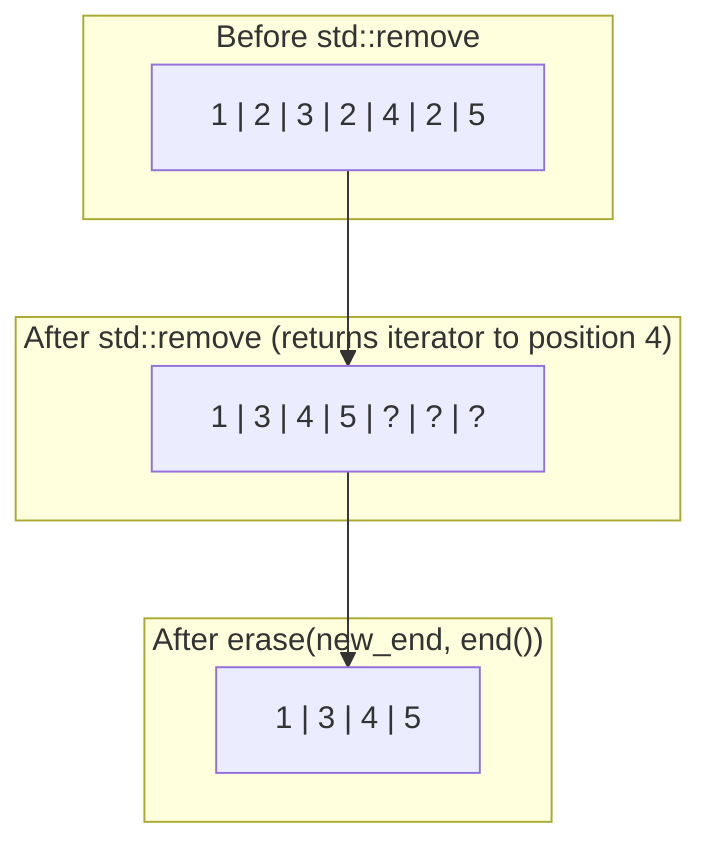
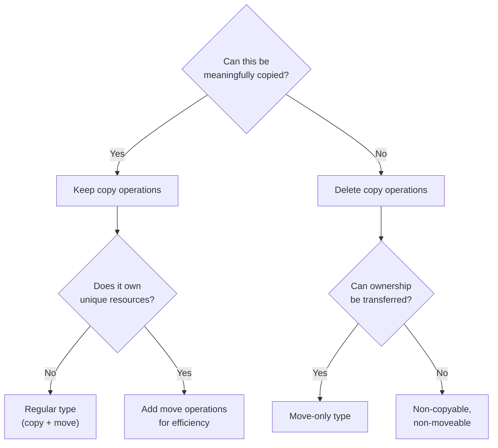

# Erase-Remove Idiom and Non-Copyable/Non-Moveable Types

> The erase-remove idiom is the correct way to remove elements from STL containers because `std::remove` doesn't actually remove anything — and understanding when to delete copy or move operations lets you enforce ownership semantics at compile time.

## Table of Contents
- [Core Concepts](#core-concepts)
- [Code Examples](#code-examples)
- [Common Pitfalls](#common-pitfalls)
- [Key Takeaways](#key-takeaways)
- [Exercises](#exercises)

## Core Concepts

### Why `std::remove` Doesn't Actually Remove

#### What

`std::remove` (and `std::remove_if`) from `<algorithm>` does not remove elements from a container. It cannot. Algorithms operate on iterator ranges, and iterators don't know how to resize the container they point into. `std::remove` only *rearranges* elements — it moves the elements you want to keep to the front of the range and returns an iterator to the "new logical end." Everything from that iterator to the actual end of the container is leftover garbage (valid but unspecified values).

This is one of the most counterintuitive aspects of the STL for programmers coming from other languages. In Python, `list.remove(x)` actually removes the element and shrinks the list. In Java, `collection.remove(x)` does the same. In C++, `std::remove` is a two-step process because of a deliberate design separation between **algorithms** (which transform data) and **containers** (which own data).

#### How

Here's what happens when you call `std::remove` on a vector `{1, 2, 3, 2, 4, 2, 5}` to remove all `2`s:



`std::remove` shifts the non-matching elements (`1, 3, 4, 5`) to the front. The last three positions contain unspecified values (they might be `2`, they might be moved-from values — you can't rely on what's there). The vector's `size()` is still 7. No elements were actually erased.

To actually remove them, you must call the container's `.erase()` method on the range from the new logical end to the actual end. This is the erase-remove idiom.

#### Why It Matters

The STL separates algorithms from containers by design. Algorithms work on iterator ranges and know nothing about the container behind those iterators. This separation means `std::remove` works on vectors, deques, arrays, raw C arrays — anything with forward iterators. The price is that the algorithm can't resize the container, so you need the two-step erase-remove idiom.

Understanding this separation is key to thinking like a C++ developer. The STL is not an object-oriented framework where methods live on containers. It's a generic programming framework where algorithms are decoupled from data structures through iterators.

### The Erase-Remove Idiom

#### What

The erase-remove idiom combines `std::remove` (or `std::remove_if`) with the container's `.erase()` method to actually remove elements. It's a one-liner that does what you'd expect `remove` to do:

```cpp
v.erase(std::remove(v.begin(), v.end(), value), v.end());
```

Reading from inside out:
1. `std::remove(v.begin(), v.end(), value)` — shifts keepers to the front, returns iterator to new logical end.
2. `v.erase(new_end, v.end())` — erases everything from the new logical end to the actual end.

#### How

The idiom works because `std::vector::erase` has an overload that takes a range (two iterators) and removes all elements in that range, actually shrinking the container.

For `std::remove_if`, you provide a predicate instead of a value:

```cpp
v.erase(
    std::remove_if(v.begin(), v.end(), [](int x) { return x % 2 == 0; }),
    v.end()
);
```

This removes all even numbers from the vector.

#### Why It Matters

This idiom is so common that C++20 added `std::erase` and `std::erase_if` as free functions that do the entire operation in one call. But in C++17 (our target standard), you still need the two-step idiom. Knowing it is essential — it appears in virtually every C++ codebase.

### Erase-Remove for Different Container Types

#### What

The erase-remove idiom applies to **sequence containers** (`std::vector`, `std::deque`, `std::string`). For **associative containers** (`std::set`, `std::map`) and **unordered containers** (`std::unordered_set`, `std::unordered_map`), you use a different approach because these containers provide their own `erase` method that works by key or iterator.

#### How

| Container Type | How to Remove Elements |
|---------------|----------------------|
| `std::vector`, `std::deque` | Erase-remove idiom |
| `std::string` | Erase-remove idiom (yes, `std::string` is a sequence container) |
| `std::list`, `std::forward_list` | Use `.remove()` / `.remove_if()` member functions (more efficient than erase-remove) |
| `std::set`, `std::map` | Use `.erase(key)` or iterate with `.erase(iterator)` |
| `std::unordered_set`, `std::unordered_map` | Use `.erase(key)` or iterate with `.erase(iterator)` |

For `std::list`, the container has its own `.remove()` and `.remove_if()` member functions that are O(n) and actually remove elements. Using the generic `std::remove` algorithm on a list is wasteful because the algorithm doesn't know it can splice nodes instead of moving values.

For associative containers, you loop and erase. In C++17 this is cleaner than in C++11 because `erase` returns the next iterator:

```cpp
for (auto it = my_map.begin(); it != my_map.end(); /* no increment */) {
    if (should_remove(it->second)) {
        it = my_map.erase(it);  // C++11: erase returns next iterator
    } else {
        ++it;
    }
}
```

#### Why It Matters

Using the wrong removal technique for the wrong container type is a common mistake. `std::remove` on a `std::list` compiles and works, but it copies elements instead of relinking nodes — needlessly expensive. `std::remove` on a `std::set` won't compile at all (set iterators are const). Knowing which technique matches which container prevents performance bugs and compilation errors.

### Non-Copyable Classes

#### What

A non-copyable class is one where the copy constructor and copy assignment operator are explicitly deleted. This prevents anyone from copying instances of the class. You do this when copying doesn't make semantic sense — when each instance represents a unique, non-duplicable resource.

#### How

Since C++11, you delete the copy operations explicitly:

```cpp
class UniqueResource {
public:
    UniqueResource(const UniqueResource&) = delete;
    UniqueResource& operator=(const UniqueResource&) = delete;

    // ... rest of the class
};
```

Before C++11, the trick was to declare the copy operations `private` and not implement them. This caused a linker error if anyone tried to copy. The `= delete` syntax is strictly better — it produces a clear compiler error at the call site.

#### Why It Matters

Making a class non-copyable communicates intent: "this object represents a unique resource that cannot be duplicated." It prevents bugs at compile time rather than at runtime.

Common non-copyable types in the standard library:
- `std::unique_ptr` — unique ownership of a heap object.
- `std::mutex` — a mutex is a system resource, not a value.
- `std::thread` — a thread of execution is unique.
- `std::fstream` — (in practice) an open file handle shouldn't be duplicated.
- `std::lock_guard` — scoped lock ownership is non-transferable.

If your class owns a unique resource (file handle, socket, hardware handle, thread), it should almost certainly be non-copyable. Allowing copies would mean two objects think they own the same resource, leading to double-free bugs.

### Non-Moveable Classes

#### What

A non-moveable class deletes both the move constructor and move assignment operator (in addition to or alongside the copy operations). This means instances of the class cannot be transferred — they are permanently tied to their location in memory.

#### How

```cpp
class Pinned {
public:
    Pinned(const Pinned&) = delete;
    Pinned& operator=(const Pinned&) = delete;
    Pinned(Pinned&&) = delete;
    Pinned& operator=(Pinned&&) = delete;

    // ... rest of the class
};
```

A non-moveable class can only be constructed in place. You cannot return it from a function (except via guaranteed copy elision in C++17), you cannot store it in a `std::vector` (which needs to move elements when it grows), and you cannot use `std::swap` on it.

#### Why It Matters

Non-moveable types are rarer than non-copyable types, but they exist for good reasons:

- **`std::mutex`** — a mutex is non-copyable AND non-moveable. The OS associates the mutex with a specific memory address. Moving it would invalidate that association. Other threads might be waiting on the original address.
- **`std::atomic<T>`** — atomics are non-moveable because the hardware might be operating on that specific memory location. Moving it would break concurrent access.
- **`std::condition_variable`** — same reason as mutex; threads are waiting on a specific address.

The pattern is: if other code (threads, OS, hardware) holds a reference or pointer to this object's address, moving it would silently invalidate those references. Making the type non-moveable prevents this.

### When to Make a Type Non-Copyable or Non-Moveable

#### What

Choosing the right combination of copy/move semantics is a design decision that communicates your class's ownership model. There are four common configurations.

#### How

| Configuration | Copy Ctor | Copy Assign | Move Ctor | Move Assign | Use Case |
|--------------|-----------|-------------|-----------|-------------|----------|
| **Regular type** (value semantics) | Yes | Yes | Yes | Yes | `int`, `std::string`, `std::vector` |
| **Move-only** | Deleted | Deleted | Yes | Yes | `std::unique_ptr`, RAII wrappers for unique resources |
| **Non-copyable, non-moveable** | Deleted | Deleted | Deleted | Deleted | `std::mutex`, `std::atomic`, singletons |
| **Copy-only** (no move) | Yes | Yes | Deleted | Deleted | Rare — but if you delete moves, copies still work (move falls back to copy) |

The decision tree:

1. **Can this type be meaningfully duplicated?** If no, delete copy operations.
2. **Can ownership of this type be transferred?** If yes, implement move operations. If no, delete them.
3. **Does other code (threads, OS, hardware) hold pointers to this object's address?** If yes, it must be non-moveable.



#### Why It Matters

Getting copy/move semantics right is one of the most important design decisions in C++. It determines:

- Whether your type can be stored in standard containers (vectors require move or copy).
- Whether your type can be returned from functions efficiently.
- Whether resource ownership is correctly enforced at compile time.
- Whether your type is safe in concurrent code.

The compiler helps you here: if you declare ANY of the special member functions (destructor, copy constructor, copy assignment, move constructor, move assignment), the compiler's implicit generation of the others changes. This is the "Rule of Zero/Five" — either declare none of them (Rule of Zero) or declare all five (Rule of Five). Declaring only some leads to surprising behavior.

### The Relationship Between `= delete` and Implicit Generation

#### What

When you explicitly delete a special member function, the compiler still considers it "declared" — it exists, but calling it is a compile error. This is different from the function simply not existing. The distinction matters for overload resolution.

#### How

If you delete the copy constructor, the compiler will NOT implicitly generate a move constructor (since C++11). The rationale: if you explicitly said "no copies," the compiler assumes you have a reason and won't silently provide moves either. This means:

```cpp
class NoCopy {
public:
    NoCopy() = default;
    NoCopy(const NoCopy&) = delete;
    NoCopy& operator=(const NoCopy&) = delete;

    // Move constructor and move assignment are NOT implicitly generated
    // because copy operations are user-declared (even though deleted).
    // This class is non-copyable AND non-moveable by default.
};
```

If you want a move-only type, you must explicitly default or define the move operations:

```cpp
class MoveOnly {
public:
    MoveOnly() = default;
    MoveOnly(const MoveOnly&) = delete;
    MoveOnly& operator=(const MoveOnly&) = delete;
    MoveOnly(MoveOnly&&) = default;             // Explicitly defaulted
    MoveOnly& operator=(MoveOnly&&) = default;  // Explicitly defaulted
};
```

#### Why It Matters

This implicit generation behavior catches many developers off guard. They delete the copy operations expecting the class to still be moveable, but it isn't — because the compiler suppresses move generation when any copy operation is user-declared. Always be explicit about all five special member functions when you declare any of them.

## Code Examples

### Erase-Remove Idiom: Removing Values from a Vector

```cpp
#include <algorithm>
#include <iostream>
#include <string>
#include <vector>

// Helper: print a vector with a label
template <typename T>
void print_vec(std::string_view label, const std::vector<T>& v) {
    std::cout << label << ": ";
    for (const auto& elem : v) {
        std::cout << elem << ' ';
    }
    std::cout << "(size=" << v.size() << ")\n";
}

int main() {
    // --- Remove by value ---
    std::vector<int> numbers = {1, 2, 3, 2, 4, 2, 5, 2};
    print_vec("Before remove", numbers);

    // Step 1: std::remove shifts non-2 elements to the front.
    // Returns iterator to the new logical end.
    auto new_end = std::remove(numbers.begin(), numbers.end(), 2);

    // At this point, size is still 8! The "removed" slots contain junk.
    print_vec("After std::remove (before erase)", numbers);
    std::cout << "  Distance to new_end: "
              << std::distance(numbers.begin(), new_end) << '\n';

    // Step 2: erase from new_end to actual end — actually shrinks the vector.
    numbers.erase(new_end, numbers.end());
    print_vec("After erase", numbers);

    // --- The idiomatic one-liner ---
    std::vector<int> more_numbers = {10, 20, 30, 20, 40};
    more_numbers.erase(
        std::remove(more_numbers.begin(), more_numbers.end(), 20),
        more_numbers.end()
    );
    print_vec("One-liner result", more_numbers);

    // --- Remove by predicate ---
    std::vector<std::string> words = {"hello", "", "world", "", "foo", ""};
    words.erase(
        std::remove_if(words.begin(), words.end(),
                        [](const std::string& s) { return s.empty(); }),
        words.end()
    );
    print_vec("After removing empty strings", words);

    return 0;
}
```

### Erase-Remove on Strings

```cpp
#include <algorithm>
#include <cctype>
#include <iostream>
#include <string>

int main() {
    // std::string is a sequence container — erase-remove works on it.
    // This is the idiomatic way to strip characters from a string.

    // Remove all spaces from a string
    std::string text = "Hello, World! How are you?";
    text.erase(
        std::remove(text.begin(), text.end(), ' '),
        text.end()
    );
    std::cout << "No spaces: " << text << '\n';

    // Remove all non-alphanumeric characters
    std::string messy = "H3ll0, W0rld!! -- [2026]";
    messy.erase(
        std::remove_if(messy.begin(), messy.end(),
                        [](unsigned char c) { return !std::isalnum(c); }),
        messy.end()
    );
    std::cout << "Alphanumeric only: " << messy << '\n';

    // Remove all digits
    std::string mixed = "abc123def456ghi";
    mixed.erase(
        std::remove_if(mixed.begin(), mixed.end(),
                        [](unsigned char c) { return std::isdigit(c); }),
        mixed.end()
    );
    std::cout << "No digits: " << mixed << '\n';

    return 0;
}
```

### Removing from Associative Containers (Not Erase-Remove)

```cpp
#include <iostream>
#include <map>
#include <set>
#include <string>

int main() {
    // --- std::set: erase by value ---
    std::set<int> numbers = {1, 2, 3, 4, 5, 6, 7, 8, 9, 10};

    // Remove a single element by value — O(log n)
    numbers.erase(5);

    // Remove elements by predicate — iterate and erase
    for (auto it = numbers.begin(); it != numbers.end(); /* no increment */) {
        if (*it % 2 == 0) {
            it = numbers.erase(it);  // erase returns next valid iterator
        } else {
            ++it;
        }
    }

    std::cout << "Set (odd only): ";
    for (const auto n : numbers) { std::cout << n << ' '; }
    std::cout << '\n';

    // --- std::map: erase by key or predicate ---
    std::map<std::string, int> scores = {
        {"Alice", 95}, {"Bob", 60}, {"Carol", 82},
        {"Dave", 45}, {"Eve", 91}
    };

    // Remove by key — O(log n)
    scores.erase("Dave");

    // Remove all entries where score < 80
    for (auto it = scores.begin(); it != scores.end(); ) {
        if (it->second < 80) {
            it = scores.erase(it);
        } else {
            ++it;
        }
    }

    std::cout << "High scorers: ";
    for (const auto& [name, score] : scores) {
        std::cout << name << "=" << score << " ";
    }
    std::cout << '\n';

    return 0;
}
```

### Non-Copyable RAII Wrapper (Move-Only)

```cpp
#include <iostream>
#include <string>
#include <string_view>
#include <utility>
#include <vector>

// A timer handle from a hypothetical C library.
// Represents a unique system resource — copying makes no sense.
// Moving (transferring ownership) is perfectly fine.
class TimerHandle {
public:
    // Construct with a name and interval.
    // In a real system, this would call a C API to create the timer.
    explicit TimerHandle(std::string_view name, int interval_ms)
        : name_{name}
        , interval_ms_{interval_ms}
        , active_{true}
    {
        std::cout << "Timer '" << name_ << "' created ("
                  << interval_ms_ << "ms)\n";
    }

    // Destructor releases the timer resource.
    ~TimerHandle() {
        if (active_) {
            std::cout << "Timer '" << name_ << "' destroyed\n";
        }
    }

    // Non-copyable — a timer handle is a unique resource.
    // You can't have two objects managing the same OS timer.
    TimerHandle(const TimerHandle&) = delete;
    TimerHandle& operator=(const TimerHandle&) = delete;

    // Moveable — ownership can transfer.
    TimerHandle(TimerHandle&& other) noexcept
        : name_{std::move(other.name_)}
        , interval_ms_{other.interval_ms_}
        , active_{std::exchange(other.active_, false)}
    {
        std::cout << "Timer '" << name_ << "' moved\n";
    }

    TimerHandle& operator=(TimerHandle&& other) noexcept {
        if (this != &other) {
            // Release our current timer
            if (active_) {
                std::cout << "Timer '" << name_ << "' released (via move-assign)\n";
            }
            name_ = std::move(other.name_);
            interval_ms_ = other.interval_ms_;
            active_ = std::exchange(other.active_, false);
        }
        return *this;
    }

    std::string_view name() const { return name_; }
    int interval_ms() const { return interval_ms_; }

private:
    std::string name_;
    int interval_ms_;
    bool active_;  // false after move
};

// Factory function — creates a timer and returns it by value.
// The move constructor enables this without copying.
TimerHandle create_heartbeat_timer() {
    return TimerHandle{"heartbeat", 1000};
}

int main() {
    // Create via factory — move semantics make this efficient
    auto heartbeat = create_heartbeat_timer();

    // Store in a vector — vector requires move (or copy), and this type is move-only
    std::vector<TimerHandle> timers;
    timers.push_back(TimerHandle{"watchdog", 5000});
    timers.push_back(std::move(heartbeat));  // Must use std::move for lvalues

    // This would NOT compile:
    // TimerHandle copy = timers[0];  // Error: copy constructor is deleted

    std::cout << "\nTimers in vector:\n";
    for (const auto& t : timers) {
        std::cout << "  " << t.name() << " (" << t.interval_ms() << "ms)\n";
    }

    // All timers destroyed when vector goes out of scope
    return 0;
}
```

### Non-Copyable, Non-Moveable Type (Pinned)

```cpp
#include <iostream>
#include <memory>
#include <mutex>
#include <string>
#include <string_view>

// A thread-safe singleton logger.
// Non-copyable AND non-moveable because:
// 1. Other threads may hold pointers/references to this object.
// 2. Moving it would invalidate those references.
// 3. The mutex inside it is itself non-moveable.
class Logger {
public:
    // Singleton access — the instance is created once, at a fixed address.
    static Logger& instance() {
        static Logger the_logger;  // Thread-safe in C++11 and later
        return the_logger;
    }

    // Non-copyable, non-moveable.
    Logger(const Logger&) = delete;
    Logger& operator=(const Logger&) = delete;
    Logger(Logger&&) = delete;
    Logger& operator=(Logger&&) = delete;

    void log(std::string_view message) {
        // std::mutex is itself non-moveable — another reason
        // this class can't be moved.
        const std::lock_guard<std::mutex> lock{mutex_};
        std::cout << "[LOG] " << message << '\n';
    }

private:
    Logger() {
        std::cout << "[LOG] Logger initialized at address "
                  << static_cast<const void*>(this) << '\n';
    }

    ~Logger() {
        std::cout << "[LOG] Logger destroyed\n";
    }

    std::mutex mutex_;  // Non-moveable member makes the class non-moveable
};

// When you need a non-moveable object that isn't a singleton,
// use std::unique_ptr to manage it on the heap.
// The pointer is moveable even though the pointee is not.
class HardwareRegister {
public:
    explicit HardwareRegister(std::string_view name, std::uint32_t address)
        : name_{name}
        , address_{address}
    {
        std::cout << "HardwareRegister '" << name_ << "' mapped at 0x"
                  << std::hex << address_ << std::dec << '\n';
    }

    // Non-copyable, non-moveable — the hardware is at a fixed address.
    // Other code may hold raw pointers to this object.
    HardwareRegister(const HardwareRegister&) = delete;
    HardwareRegister& operator=(const HardwareRegister&) = delete;
    HardwareRegister(HardwareRegister&&) = delete;
    HardwareRegister& operator=(HardwareRegister&&) = delete;

    void write(std::uint32_t value) {
        std::cout << "Write 0x" << std::hex << value
                  << " to " << name_ << std::dec << '\n';
    }

    std::string_view name() const { return name_; }

private:
    std::string name_;
    std::uint32_t address_;
};

int main() {
    // Singleton usage — always the same address
    Logger::instance().log("Application started");
    Logger::instance().log("Processing data...");

    // For non-singleton non-moveable types, use unique_ptr.
    // The pointer is moveable; the object is not.
    auto reg = std::make_unique<HardwareRegister>("GPIOA_ODR", 0x40020014);
    reg->write(0xFF);

    // Can transfer ownership of the pointer (not the object)
    auto transferred = std::move(reg);
    transferred->write(0x00);

    return 0;
}
```

### Combining Erase-Remove with Move-Only Types

```cpp
#include <algorithm>
#include <iostream>
#include <memory>
#include <string>
#include <vector>

// Erase-remove works with move-only types because std::remove
// uses move assignment (not copy) to shift elements.
// This is important — it means you can erase-remove a
// vector<unique_ptr<T>> without any issues.

struct Task {
    std::string name;
    int priority;
    bool completed;
};

int main() {
    // Vector of unique_ptr — each task is uniquely owned
    std::vector<std::unique_ptr<Task>> tasks;
    tasks.push_back(std::make_unique<Task>(Task{"Build UI", 3, true}));
    tasks.push_back(std::make_unique<Task>(Task{"Write tests", 2, false}));
    tasks.push_back(std::make_unique<Task>(Task{"Fix bug", 1, true}));
    tasks.push_back(std::make_unique<Task>(Task{"Deploy", 4, false}));
    tasks.push_back(std::make_unique<Task>(Task{"Code review", 2, true}));

    std::cout << "Before removal (" << tasks.size() << " tasks):\n";
    for (const auto& t : tasks) {
        std::cout << "  " << t->name << " (completed=" << t->completed << ")\n";
    }

    // Remove completed tasks using erase-remove_if.
    // std::remove_if moves unique_ptrs (not copies) to shift elements.
    // The moved-from unique_ptrs at the end are nullptr — erase cleans them up.
    tasks.erase(
        std::remove_if(tasks.begin(), tasks.end(),
                        [](const std::unique_ptr<Task>& t) {
                            return t && t->completed;
                        }),
        tasks.end()
    );

    std::cout << "\nAfter removing completed (" << tasks.size() << " tasks):\n";
    for (const auto& t : tasks) {
        std::cout << "  " << t->name << " (priority=" << t->priority << ")\n";
    }

    return 0;
}
```

## Common Pitfalls

### Using `std::remove` without `erase`

```cpp
// BAD — std::remove alone doesn't change the container's size
#include <algorithm>
#include <iostream>
#include <vector>

int main() {
    std::vector<int> v = {1, 2, 3, 2, 4};

    std::remove(v.begin(), v.end(), 2);

    // Developer expects size 3, but size is still 5!
    // The "removed" elements are still taking up space.
    std::cout << "Size: " << v.size() << '\n';  // Prints 5, not 3

    // Iterating prints garbage values at the end
    for (const auto n : v) {
        std::cout << n << ' ';  // Might print: 1 3 4 2 4 (unspecified tail)
    }
}
```

The vector still has 5 elements. The last 2 positions contain unspecified values. Any logic based on `v.size()` will be wrong. Any iteration will process garbage.

```cpp
// GOOD — always pair std::remove with erase
#include <algorithm>
#include <iostream>
#include <vector>

int main() {
    std::vector<int> v = {1, 2, 3, 2, 4};

    v.erase(std::remove(v.begin(), v.end(), 2), v.end());

    std::cout << "Size: " << v.size() << '\n';  // Prints 3
    for (const auto n : v) {
        std::cout << n << ' ';  // Prints: 1 3 4
    }
}
```

### Erasing elements while iterating with an index-based loop

```cpp
// BAD — modifying a vector while iterating with indices
#include <iostream>
#include <vector>

int main() {
    std::vector<int> v = {1, 2, 3, 4, 5, 6};

    // Trying to remove even numbers with an index loop
    for (std::size_t i = 0; i < v.size(); ++i) {
        if (v[i] % 2 == 0) {
            v.erase(v.begin() + i);
            // BUG: after erasing element at index i, the next element
            // shifts into position i, but the loop increments i,
            // skipping the shifted element. We'll miss consecutive
            // even numbers.
        }
    }

    // Result: {1, 3, 5, 6} — missed the 6 because 4 and 6 were adjacent.
    // (Actual behavior depends on the data — this is a subtle, intermittent bug.)
    for (const auto n : v) { std::cout << n << ' '; }
}
```

Erasing inside an index-based loop shifts all subsequent elements. The loop's index increment then skips the element that shifted into the erased position. This causes intermittent bugs that depend on the data.

```cpp
// GOOD — use erase-remove idiom
#include <algorithm>
#include <iostream>
#include <vector>

int main() {
    std::vector<int> v = {1, 2, 3, 4, 5, 6};

    v.erase(
        std::remove_if(v.begin(), v.end(),
                        [](int x) { return x % 2 == 0; }),
        v.end()
    );

    // Correctly removes ALL even numbers: {1, 3, 5}
    for (const auto n : v) { std::cout << n << ' '; }
}
```

### Assuming a class is moveable after deleting copy operations

```cpp
// BAD — deleting copy operations suppresses implicit move generation
#include <vector>

class Sensor {
public:
    Sensor(int id) : id_{id} {}

    // Delete copy — this is correct, sensors are unique resources
    Sensor(const Sensor&) = delete;
    Sensor& operator=(const Sensor&) = delete;

    // BUG: No move operations declared.
    // Because copy ops are user-declared (even deleted), the compiler
    // does NOT generate implicit move constructor/assignment.
    // This class is now non-copyable AND non-moveable.

private:
    int id_;
};

void example() {
    // This won't compile! vector::push_back needs copy or move.
    std::vector<Sensor> sensors;
    // sensors.push_back(Sensor{42});  // Error: no copy, no move
}
```

Declaring (including deleting) any copy operation suppresses implicit move generation. If you want a move-only type, you must explicitly default or define the move operations.

```cpp
// GOOD — explicitly default move operations for a move-only type
#include <iostream>
#include <vector>

class Sensor {
public:
    explicit Sensor(int id) : id_{id} {}

    // Non-copyable
    Sensor(const Sensor&) = delete;
    Sensor& operator=(const Sensor&) = delete;

    // Explicitly moveable
    Sensor(Sensor&& other) noexcept = default;
    Sensor& operator=(Sensor&& other) noexcept = default;

    int id() const { return id_; }

private:
    int id_;
};

int main() {
    std::vector<Sensor> sensors;
    sensors.push_back(Sensor{1});  // Move construction — works!
    sensors.push_back(Sensor{2});
    sensors.emplace_back(3);       // Constructs in place — even better

    for (const auto& s : sensors) {
        std::cout << "Sensor " << s.id() << '\n';
    }
    return 0;
}
```

### Using erase-remove on associative containers

```cpp
// BAD — erase-remove idiom on a std::set or std::map
#include <algorithm>
#include <set>

void example() {
    std::set<int> s = {1, 2, 3, 4, 5};

    // This will NOT compile.
    // std::set iterators are const (you can't move set elements),
    // and std::remove needs to write through the iterator.
    // s.erase(std::remove(s.begin(), s.end(), 3), s.end());  // Compile error!
}
```

`std::remove` requires mutable forward iterators because it writes (moves) elements through the iterators. Set and map iterators are const because modifying an element in-place could break the container's ordering invariant.

```cpp
// GOOD — use the container's own erase method for associative containers
#include <iostream>
#include <set>

int main() {
    std::set<int> s = {1, 2, 3, 4, 5, 6, 7, 8, 9, 10};

    // Remove a specific value
    s.erase(3);

    // Remove by predicate: iterate with erase
    for (auto it = s.begin(); it != s.end(); ) {
        if (*it % 2 == 0) {
            it = s.erase(it);  // Returns next iterator
        } else {
            ++it;
        }
    }

    for (const auto n : s) { std::cout << n << ' '; }
    // Output: 1 5 7 9
    return 0;
}
```

## Key Takeaways

- **`std::remove` does not remove elements.** It moves keepers to the front and returns an iterator to the new logical end. You must follow it with the container's `.erase()` to actually shrink the container. This two-step process is the erase-remove idiom: `v.erase(std::remove(...), v.end())`.
- **Use the right removal technique for the right container.** Erase-remove for `vector`, `deque`, and `string`. Member `.remove()` for `list`. Iterator-based `.erase()` for `set`, `map`, and their unordered variants. Using the wrong technique causes compilation errors or performance bugs.
- **Make types non-copyable (`= delete`) when copying doesn't make semantic sense** — unique resources, RAII wrappers, system handles. This prevents double-free bugs and communicates ownership intent at compile time.
- **Deleting copy operations suppresses implicit move generation.** If you want a move-only type, you must explicitly default or define the move constructor and move assignment operator. Always follow the Rule of Five: declare all five special member functions, or none.
- **Non-moveable types are for objects whose address matters** — mutexes, atomics, condition variables, hardware register mappings. Use `std::unique_ptr` to manage non-moveable objects on the heap when you need indirection.

## Exercises

1. Explain step by step what `std::remove(v.begin(), v.end(), 3)` does to the vector `{1, 3, 5, 3, 7, 3, 9}`. Draw the vector state after `std::remove` returns (before `erase`). What is the return value? What are the values in the "garbage" tail positions?

2. Write a function `remove_duplicates(std::vector<int>& v)` that removes all duplicate elements from a vector, keeping only the first occurrence of each value. You may use `std::sort` and `std::unique` (which follows the same pattern as `std::remove` — it doesn't actually erase, it returns a new logical end). Use the erase idiom to actually shrink the vector.

3. You have a `std::map<std::string, int>` representing student scores. Write code that removes all entries where the score is below 60. Explain why you cannot use the erase-remove idiom here and what technique you must use instead.

4. Design a `ConnectionPool` class that is non-copyable but moveable. It should hold a `std::vector<std::unique_ptr<Connection>>` (where `Connection` is a simple struct with a `bool connected` field). Implement the constructor, destructor, move constructor, and move assignment. Explain why this type should be non-copyable, and why it should be moveable.

5. A colleague proposes this class and says it's "move-only":
   ```cpp
   class Handle {
       int fd_;
   public:
       Handle(int fd) : fd_{fd} {}
       ~Handle() { close(fd_); }
       Handle(const Handle&) = delete;
       Handle& operator=(const Handle&) = delete;
   };
   ```
   Explain why this class is actually non-moveable (despite the intent), what will happen if someone tries `Handle h2 = std::move(h1);`, and how to fix the class to make it truly move-only.

---
up:: [Schedule](../../Schedule.md)
#type/learning #source/self-study #status/evergreen
