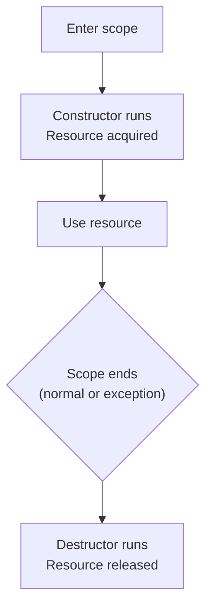
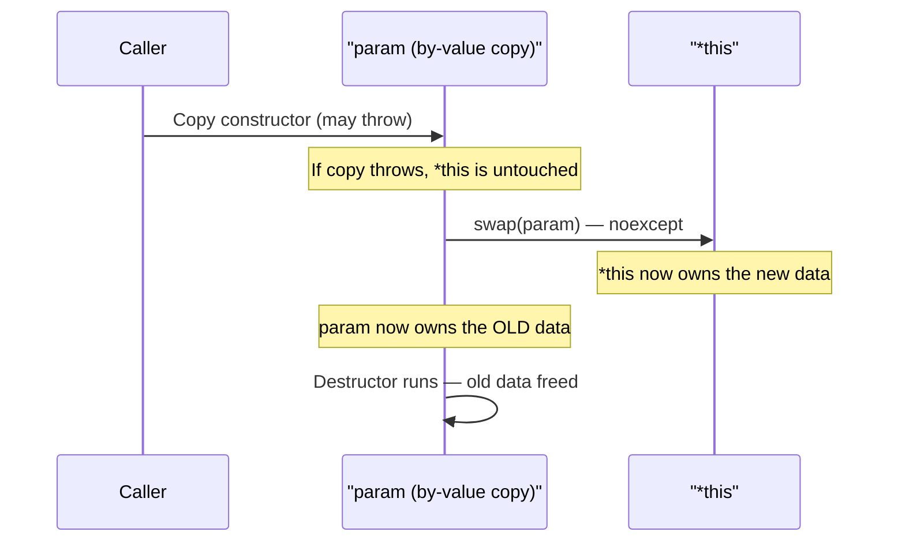

# RAII and the Copy-and-Swap Idiom

> RAII is the single most important idiom in C++ — it binds resource lifetime to object scope so that cleanup is automatic and deterministic — and the copy-and-swap idiom builds on RAII to give you exception-safe assignment operators with minimal effort.

## Table of Contents
- [Core Concepts](#core-concepts)
- [Code Examples](#code-examples)
- [Common Pitfalls](#common-pitfalls)
- [Key Takeaways](#key-takeaways)
- [Exercises](#exercises)

## Core Concepts

### RAII (Resource Acquisition Is Initialization)

#### What

RAII is a design principle where you tie the lifetime of a resource — memory, file handle, mutex lock, network socket, database connection — to the lifetime of an object. The resource is acquired in the constructor and released in the destructor. When the object goes out of scope, the destructor fires automatically, and the resource is freed. No manual cleanup. No forgotten `close()` calls. No leaked memory.

The name is slightly misleading. "Resource Acquisition Is Initialization" sounds like it's about *acquiring* resources. It's really about *releasing* them. A better name would be "Scope-Bound Resource Management" (SBRM), which is what the C++ community sometimes calls it. But RAII stuck, so RAII it is.

#### How

The pattern is simple:

1. **Constructor** acquires the resource (opens a file, allocates memory, locks a mutex).
2. **Destructor** releases the resource (closes the file, frees memory, unlocks the mutex).
3. The object lives on the stack (or inside another RAII object), so the destructor runs automatically when scope ends — whether by normal flow, `return`, or exception.



Every smart pointer in the standard library (`std::unique_ptr`, `std::shared_ptr`), every lock guard (`std::lock_guard`, `std::unique_lock`), every file stream (`std::fstream`) — they all follow RAII. You have been using this pattern since the first time you declared a `std::string` on the stack. The string's destructor frees its heap buffer when the string goes out of scope.

#### Why It Matters

RAII is what makes C++ fundamentally different from both C and garbage-collected languages.

In **C**, you must manually pair every `malloc` with a `free`, every `fopen` with `fclose`, every `pthread_mutex_lock` with `pthread_mutex_unlock`. If any code path between the acquire and release throws or returns early, you leak. Developers write convoluted goto-chains or nested if-blocks to handle cleanup, and they still get it wrong.

In **Java** or **Python**, a garbage collector eventually reclaims memory — but "eventually" is the problem. The GC doesn't know about non-memory resources. A file handle, a database connection, a mutex lock — these can't wait for "eventually." Java added `try-with-resources` (Java 7) and Python added `with` statements to address this, but both require the programmer to remember to use them. If you forget, the resource leaks.

In **C++**, RAII makes cleanup automatic and deterministic. The destructor runs at a predictable point — the end of scope — every single time. You don't need discipline. You don't need `finally` blocks. You don't need `defer` (Go) or `with` (Python). The compiler enforces cleanup for you. This is why Bjarne Stroustrup calls RAII "the most important technical contribution of C++."

### Why Deterministic Destruction Matters

#### What

"Deterministic destruction" means you know *exactly* when an object's destructor will run: at the closing brace of its enclosing scope. This is not a property of garbage-collected languages, where object finalization is unpredictable and may never happen at all.

#### How

Consider this stack frame:

```cpp
void process_data() {
    std::ifstream file{"data.csv"};       // 1. File opened
    std::lock_guard lock{some_mutex};     // 2. Mutex locked
    std::vector<Record> records;          // 3. Dynamic array allocated

    // ... work with file, lock, and records ...

}   // <-- Destructors run in REVERSE order:
    //     3. vector freed
    //     2. mutex unlocked
    //     1. file closed
```

The destructors run in reverse order of construction — always. Even if an exception is thrown on any line between the declarations and the closing brace, the destructors of all fully-constructed objects run during stack unwinding. This guarantee is what makes C++ exception safety possible.

#### Why It Matters

Deterministic destruction is the foundation of:

- **Exception safety** — resources are always released, even when exceptions propagate.
- **Lock safety** — `lock_guard` ensures a mutex is always unlocked, preventing deadlocks.
- **Memory safety** — smart pointers ensure heap memory is always freed.
- **Transactional patterns** — "do something in the constructor, undo it in the destructor" enables commit/rollback designs without explicit cleanup code.

Without deterministic destruction, you need explicit cleanup in every error path. With it, you write the happy path and the cleanup happens for free.

### The RAII Principle Applied: Common Standard Library Types

#### What

You don't need to write your own RAII wrappers for common resources — the standard library already provides them. Understanding which standard types are RAII wrappers helps you recognize the pattern everywhere.

#### How

| Resource | RAII Wrapper | Acquires In | Releases In |
|----------|-------------|-------------|-------------|
| Heap memory | `std::unique_ptr<T>` | Constructor (or `make_unique`) | Destructor (`delete`) |
| Shared heap memory | `std::shared_ptr<T>` | Constructor (or `make_shared`) | Destructor (when refcount hits 0) |
| Dynamic array | `std::vector<T>` | Constructor / `push_back` | Destructor (`delete[]`) |
| String buffer | `std::string` | Constructor / assignment | Destructor |
| File handle | `std::fstream` | Constructor / `open()` | Destructor / `close()` |
| Mutex lock | `std::lock_guard<M>` | Constructor (`lock()`) | Destructor (`unlock()`) |
| Mutex lock (flexible) | `std::unique_lock<M>` | Constructor (`lock()`) | Destructor (`unlock()`) |

#### Why It Matters

If you find yourself writing `new`/`delete`, `fopen`/`fclose`, `lock`/`unlock` manually, you're fighting the language. There is almost certainly a standard RAII wrapper that does it for you. The correct C++ instinct is: "What object can I create that will manage this resource's lifetime for me?"

### Writing Your Own RAII Wrapper

#### What

When the standard library doesn't have a wrapper for your resource (a C library handle, a GPU context, a custom allocator), you write your own RAII class. The pattern is always the same: acquire in the constructor, release in the destructor.

#### How

The key decisions:

1. **Should the wrapper be copyable?** Usually no — most resources can't be meaningfully duplicated (you can't "copy" a file handle or a mutex lock). Delete the copy constructor and copy assignment operator.
2. **Should the wrapper be movable?** Usually yes — transferring ownership is useful (returning an RAII object from a factory function). Implement move constructor and move assignment with a "null state" that the destructor can check.
3. **What's the null/invalid state?** After a move, the moved-from object must be in a valid state where the destructor is a no-op. For pointers this is `nullptr`. For file descriptors this is `-1`. For handles this is some sentinel value.

The rule of thumb: RAII wrappers are **move-only** types. They follow the Rule of Five (or delegate to the Rule of Zero by wrapping the raw resource in a `unique_ptr` with a custom deleter).

#### Why It Matters

Writing correct RAII wrappers is a core competence for C++ developers. Every time you interact with a C library (POSIX, OpenGL, SQLite, libcurl), you should wrap its handles in RAII objects. This transforms error-prone C-style resource management into safe, automatic C++ resource management.

### The Copy-and-Swap Idiom

#### What

The copy-and-swap idiom is a technique for implementing the copy assignment operator that is:

1. **Exception-safe** — if the copy fails (throws), the original object is untouched.
2. **Self-assignment safe** — `x = x` works correctly without a special check.
3. **Simple** — the implementation is three lines: copy, swap, done.

It works by taking the parameter **by value** (which triggers the copy constructor), then swapping the copy's contents with `*this`. The old data, now in the temporary copy, is destroyed when the temporary goes out of scope.

#### How

The idiom has three ingredients:

1. A working **copy constructor** (you need this anyway).
2. A **non-throwing `swap`** function — typically a `friend` function that swaps each member. This function must be `noexcept`.
3. The assignment operator takes its parameter **by value**, then calls `swap`.



The key insight is **the copy happens before any mutation**. If the copy constructor throws (e.g., `std::bad_alloc`), `*this` is completely unchanged — strong exception guarantee. And because we swap rather than assign member-by-member, self-assignment (`a = a`) creates a copy and swaps with itself, which is harmless. No `if (this != &other)` check needed.

#### Why It Matters

Writing a correct copy assignment operator by hand is surprisingly tricky. You need to handle:

- Self-assignment (`a = a`)
- Exception safety (what if allocation fails mid-assignment?)
- Proper cleanup of old resources before assigning new ones

Getting any of these wrong leads to bugs. The copy-and-swap idiom handles all three automatically. It's the idiomatic way to implement copy assignment in C++ when you need to write one manually (i.e., when the Rule of Zero doesn't apply).

### Why Take the Parameter by Value?

#### What

The copy-and-swap idiom takes the assignment operator parameter by value — `operator=(T other)` instead of `operator=(const T& other)`. This is deliberate and serves multiple purposes.

#### How

When you write `operator=(T other)`, two things happen:

1. **If the caller passes an lvalue** (`a = b`), `other` is copy-constructed from `b`. The copy constructor does the allocation.
2. **If the caller passes an rvalue** (`a = std::move(b)` or `a = make_thing()`), `other` is move-constructed from the rvalue. No copy, no allocation.

This means the same assignment operator handles both copy assignment and move assignment. You get move semantics for free. If your class has a move constructor (which it should), passing an rvalue to the assignment operator triggers the move constructor for `other`, making the assignment as efficient as a move.

#### Why It Matters

By-value parameter passing lets the compiler choose the most efficient construction path. Lvalues get copied, rvalues get moved. You write one function that covers both cases. This is the "want speed? Pass by value" technique applied to assignment operators, and it avoids the need to write a separate `operator=(T&&)` move assignment operator.

### The `swap` Function

#### What

The `swap` function is the heart of the copy-and-swap idiom. It must exchange the contents of two objects without throwing exceptions.

#### How

There are two common approaches:

1. **Member swap** — a member function `void swap(T& other) noexcept` that swaps each data member using `std::swap`.
2. **Friend swap** — a `friend` function `friend void swap(T& a, T& b) noexcept` that does the same thing but enables ADL (Argument-Dependent Lookup), allowing `std::swap` to find your custom swap.

The friend approach is preferred because it integrates with the standard library. When generic code calls `using std::swap; swap(a, b);`, ADL finds your custom swap function. If you only have a member function, generic code won't find it.

The swap function must be `noexcept`. The entire point of copy-and-swap is that the swap step cannot fail. If swap could throw, the exception safety guarantee breaks — you'd be left in a partially-swapped state.

#### Why It Matters

A well-written `swap` function is a building block for many C++ patterns. It enables:

- Copy-and-swap assignment (this lesson).
- Efficient `std::sort` and other algorithms that swap elements.
- Exception-safe move operations.
- Transaction-like commit/rollback semantics.

If your class has members that are more expensive to swap via the default `std::swap` (which uses a temporary + three moves), you should write a custom swap that does direct member swaps.

## Code Examples

### Basic RAII Wrapper for a C-style File Handle

```cpp
#include <cstdio>
#include <stdexcept>
#include <string>
#include <string_view>
#include <utility>

// RAII wrapper for a C-style FILE*.
// Demonstrates the fundamental pattern: acquire in constructor, release in destructor.
// This class is MOVE-ONLY — you can't copy a file handle.
class FileHandle {
public:
    // Constructor acquires the resource.
    // If acquisition fails, we throw — the object is never fully constructed,
    // so the destructor won't run (no double-free risk).
    explicit FileHandle(std::string_view path, std::string_view mode)
        : file_{std::fopen(std::string(path).c_str(), std::string(mode).c_str())}
    {
        if (!file_) {
            throw std::runtime_error{"Failed to open file: " + std::string(path)};
        }
    }

    // Destructor releases the resource.
    // noexcept by default for destructors — never throw from a destructor.
    ~FileHandle() {
        if (file_) {
            std::fclose(file_);
        }
    }

    // Delete copy operations — a file handle is a unique resource.
    FileHandle(const FileHandle&) = delete;
    FileHandle& operator=(const FileHandle&) = delete;

    // Move constructor — transfer ownership from 'other' to 'this'.
    // After the move, 'other' holds nullptr (the null state).
    FileHandle(FileHandle&& other) noexcept
        : file_{std::exchange(other.file_, nullptr)}
    {}

    // Move assignment — swap with a temporary built from 'other'.
    // The old file_ is closed when 'other' (now holding it) is destroyed.
    FileHandle& operator=(FileHandle&& other) noexcept {
        if (this != &other) {
            // Close our current file (if any)
            if (file_) {
                std::fclose(file_);
            }
            file_ = std::exchange(other.file_, nullptr);
        }
        return *this;
    }

    // Provide access to the underlying resource for C API calls.
    // This is a NON-OWNING observation — the caller must not fclose() it.
    FILE* get() const noexcept { return file_; }

    // Convenience: write a string to the file
    void write(std::string_view data) {
        if (!file_) {
            throw std::runtime_error{"Cannot write to a moved-from FileHandle"};
        }
        std::fwrite(data.data(), 1, data.size(), file_);
    }

private:
    FILE* file_ = nullptr;  // nullptr is the null/invalid state
};

int main() {
    // RAII in action: the file is opened here and closed automatically
    // when 'log' goes out of scope — even if an exception is thrown.
    FileHandle log{"output.log", "w"};
    log.write("Application started\n");
    log.write("Processing data...\n");

    // Transfer ownership to another variable
    FileHandle transferred = std::move(log);
    // 'log' is now in the null state (file_ == nullptr)
    // 'transferred' owns the file handle

    transferred.write("Still writing after move\n");

    // Both 'log' and 'transferred' are destroyed at end of scope.
    // 'log' destructor checks for nullptr — no-op.
    // 'transferred' destructor closes the file.
    return 0;
}
```

### RAII with `unique_ptr` and Custom Deleter

```cpp
#include <cstdio>
#include <iostream>
#include <memory>
#include <string_view>

// Instead of writing a full RAII wrapper class, you can use std::unique_ptr
// with a custom deleter to wrap any C-style resource.
// This is the "lazy RAII" approach — less boilerplate, same safety.

// Custom deleter for FILE*
struct FileDeleter {
    void operator()(FILE* f) const noexcept {
        if (f) {
            std::fclose(f);
            std::cout << "File closed by custom deleter\n";
        }
    }
};

// Type alias makes the interface clean
using UniqueFile = std::unique_ptr<FILE, FileDeleter>;

// Factory function — the idiomatic way to create RAII-wrapped resources
UniqueFile open_file(std::string_view path, std::string_view mode) {
    FILE* raw = std::fopen(std::string(path).c_str(), std::string(mode).c_str());
    if (!raw) {
        throw std::runtime_error{"Failed to open: " + std::string(path)};
    }
    return UniqueFile{raw};
}

int main() {
    // The unique_ptr manages the FILE* lifetime.
    // When 'file' goes out of scope, FileDeleter::operator() runs.
    auto file = open_file("test.txt", "w");

    // Use the raw pointer for C API calls via .get()
    std::fprintf(file.get(), "Hello from unique_ptr RAII\n");

    // Ownership can be transferred
    auto another = std::move(file);
    // file is now nullptr, another owns the FILE*

    return 0;
    // another's destructor calls FileDeleter → fclose
}
```

### RAII Scope Guard (Generic Cleanup)

```cpp
#include <functional>
#include <iostream>
#include <utility>

// A scope guard runs an arbitrary cleanup action when it goes out of scope.
// This is a generalization of RAII — instead of tying a specific resource
// to an object, you tie an arbitrary function to scope exit.
//
// C++17 with CTAD (Class Template Argument Deduction) makes this clean.
// Production codebases often use libraries like folly::ScopeGuard or gsl::finally.

template <typename Func>
class ScopeGuard {
public:
    explicit ScopeGuard(Func&& cleanup) noexcept
        : cleanup_{std::move(cleanup)}
        , active_{true}
    {}

    ~ScopeGuard() {
        if (active_) {
            cleanup_();
        }
    }

    // Dismiss the guard — cancel the cleanup action.
    // Useful for commit/rollback patterns: dismiss on success, run cleanup on failure.
    void dismiss() noexcept { active_ = false; }

    // Move-only
    ScopeGuard(ScopeGuard&& other) noexcept
        : cleanup_{std::move(other.cleanup_)}
        , active_{other.active_}
    {
        other.active_ = false;
    }

    ScopeGuard(const ScopeGuard&) = delete;
    ScopeGuard& operator=(const ScopeGuard&) = delete;
    ScopeGuard& operator=(ScopeGuard&&) = delete;

private:
    Func cleanup_;
    bool active_;
};

// Factory function — deduces the lambda type automatically
template <typename Func>
[[nodiscard]] ScopeGuard<Func> make_scope_guard(Func&& f) {
    return ScopeGuard<Func>{std::forward<Func>(f)};
}

int main() {
    std::cout << "Starting operation\n";

    // The scope guard ensures cleanup runs no matter how the scope exits.
    auto guard = make_scope_guard([] {
        std::cout << "Cleanup: rolling back partial work\n";
    });

    // Simulate some work
    const bool success = false;

    if (success) {
        guard.dismiss();  // Success — no rollback needed
        std::cout << "Operation committed\n";
    }

    // If we reach here without dismissing, the guard runs cleanup.
    // Even if an exception were thrown above, the guard would still run.
    return 0;
}
```

### Copy-and-Swap Idiom: Complete Implementation

```cpp
#include <algorithm>
#include <cstddef>
#include <iostream>
#include <utility>

// A simplified dynamic array class that demonstrates copy-and-swap.
// This is intentionally NOT using std::vector — the point is to show
// manual resource management done correctly with the idiom.
class DynamicBuffer {
public:
    // Default constructor — empty buffer
    DynamicBuffer() noexcept
        : data_{nullptr}
        , size_{0}
    {}

    // Parameterized constructor — allocate and zero-initialize
    explicit DynamicBuffer(std::size_t size)
        : data_{new int[size]{}}   // {} zero-initializes
        , size_{size}
    {}

    // Copy constructor — deep copy of the buffer.
    // This is the "copy" part of copy-and-swap.
    // If new[] throws std::bad_alloc, no object is created — clean failure.
    DynamicBuffer(const DynamicBuffer& other)
        : data_{other.size_ > 0 ? new int[other.size_] : nullptr}
        , size_{other.size_}
    {
        std::copy(other.data_, other.data_ + size_, data_);
    }

    // Destructor — release the resource
    ~DynamicBuffer() {
        delete[] data_;
    }

    // THE COPY-AND-SWAP ASSIGNMENT OPERATOR.
    //
    // Takes the parameter BY VALUE — this triggers the copy constructor
    // for lvalues, or the move constructor for rvalues.
    //
    // Then swaps: the old data is now in 'other', and will be freed
    // when 'other' goes out of scope at the end of this function.
    //
    // Exception safety: if the copy constructor throws (during parameter
    // construction), *this is completely untouched. Strong guarantee.
    //
    // Self-assignment safety: a = a creates a copy, swaps, destroys the
    // copy. Wasteful but correct — no special check needed.
    DynamicBuffer& operator=(DynamicBuffer other) noexcept {
        swap(*this, other);
        return *this;
    }

    // Move constructor — steal the guts of 'other'.
    // Leaves 'other' in a valid, empty state.
    DynamicBuffer(DynamicBuffer&& other) noexcept
        : data_{std::exchange(other.data_, nullptr)}
        , size_{std::exchange(other.size_, 0)}
    {}

    // The friend swap function — the "swap" part of copy-and-swap.
    // Must be noexcept. Swaps each member individually.
    // Friend function enables ADL — generic code can find it.
    friend void swap(DynamicBuffer& a, DynamicBuffer& b) noexcept {
        using std::swap;  // Enable ADL for member types too
        swap(a.data_, b.data_);
        swap(a.size_, b.size_);
    }

    // Accessors
    std::size_t size() const noexcept { return size_; }

    int& operator[](std::size_t idx) { return data_[idx]; }
    const int& operator[](std::size_t idx) const { return data_[idx]; }

    // Debug: print contents
    void print(std::string_view label) const {
        std::cout << label << " [size=" << size_ << "]: ";
        for (std::size_t i = 0; i < size_; ++i) {
            std::cout << data_[i] << ' ';
        }
        std::cout << '\n';
    }

private:
    int* data_;
    std::size_t size_;
};

int main() {
    DynamicBuffer a{5};
    a[0] = 10;
    a[1] = 20;
    a[2] = 30;
    a.print("a");

    // Copy assignment — triggers copy constructor for 'other' parameter,
    // then swaps. Old data in b (empty) is destroyed.
    DynamicBuffer b;
    b = a;
    b.print("b (copied from a)");
    a.print("a (unchanged)");

    // Move assignment — triggers move constructor for 'other' parameter,
    // then swaps. No allocation happens.
    DynamicBuffer c;
    c = std::move(a);
    c.print("c (moved from a)");
    a.print("a (moved-from, empty)");

    // Self-assignment — copy-and-swap handles it correctly.
    // Wasteful (creates a copy for nothing) but safe.
    b = b;
    b.print("b (self-assigned)");

    return 0;
}
```

### RAII Lock Guard Pattern

```cpp
#include <iostream>
#include <mutex>
#include <string>
#include <thread>
#include <vector>

// This example shows RAII at work with mutex locking — one of the
// most critical RAII use cases in multithreaded code.

class ThreadSafeCounter {
public:
    void increment(std::string_view thread_name) {
        // lock_guard is RAII: constructor locks, destructor unlocks.
        // If ANY code between here and the closing brace throws,
        // the mutex is still unlocked. No manual unlock() needed.
        const std::lock_guard<std::mutex> lock{mutex_};

        ++count_;
        std::cout << thread_name << " incremented to " << count_ << '\n';

        // Even if we add an early return here, the mutex is unlocked.
        // Even if we add code that throws, the mutex is unlocked.
        // RAII makes it impossible to forget.
    }

    int count() const {
        const std::lock_guard<std::mutex> lock{mutex_};
        return count_;
    }

private:
    mutable std::mutex mutex_;
    int count_ = 0;
};

int main() {
    ThreadSafeCounter counter;

    // Spawn multiple threads that all increment the same counter.
    // lock_guard ensures no data races.
    std::vector<std::thread> threads;
    for (int i = 0; i < 5; ++i) {
        threads.emplace_back([&counter, i] {
            const std::string name = "Thread-" + std::to_string(i);
            for (int j = 0; j < 3; ++j) {
                counter.increment(name);
            }
        });
    }

    for (auto& t : threads) {
        t.join();
    }

    std::cout << "Final count: " << counter.count() << '\n';
    return 0;
}
```

## Common Pitfalls

### Manual resource management instead of RAII

```cpp
// BAD — manually managing a resource with new/delete
#include <stdexcept>

void process() {
    int* data = new int[1000];

    // If this function throws, 'data' is NEVER freed.
    do_something_that_might_throw(data);

    // Even if it doesn't throw, adding an early return later
    // will leak. Every maintenance change is a risk.
    delete[] data;
}
```

Any code path that skips the `delete[]` — an exception, an early return added during maintenance, a `continue` in a loop — causes a memory leak. This is the bug pattern that RAII eliminates entirely.

```cpp
// GOOD — use RAII (vector or unique_ptr) to manage the allocation
#include <memory>
#include <vector>

void process_with_vector() {
    // std::vector is RAII for dynamic arrays.
    // Memory is freed automatically when 'data' goes out of scope.
    std::vector<int> data(1000);
    do_something_that_might_throw(data.data());
    // No delete needed. Exception-safe. Maintenance-proof.
}

void process_with_unique_ptr() {
    // If you genuinely need a raw array (rare), use unique_ptr.
    auto data = std::make_unique<int[]>(1000);
    do_something_that_might_throw(data.get());
    // Automatically freed. Exception-safe.
}
```

### Writing assignment operators without copy-and-swap

```cpp
// BAD — hand-written assignment operator with multiple bugs
class Buffer {
public:
    Buffer(std::size_t n) : data_{new int[n]{}}, size_{n} {}
    Buffer(const Buffer& other) : data_{new int[other.size_]{}}, size_{other.size_} {
        std::copy(other.data_, other.data_ + size_, data_);
    }
    ~Buffer() { delete[] data_; }

    Buffer& operator=(const Buffer& other) {
        // BUG 1: self-assignment (a = a) deletes data_ then reads from it
        delete[] data_;

        // BUG 2: if new[] throws here, *this is in a corrupted state
        // (data_ is deleted, size_ is stale). No exception safety.
        data_ = new int[other.size_];
        size_ = other.size_;
        std::copy(other.data_, other.data_ + size_, data_);
        return *this;
    }

private:
    int* data_;
    std::size_t size_;
};
```

This assignment operator has two bugs: self-assignment corruption and no exception safety. Adding a `this != &other` check fixes bug 1, but bug 2 (allocation failure leaves `*this` in a broken state) remains.

```cpp
// GOOD — copy-and-swap handles both problems automatically
class Buffer {
public:
    Buffer(std::size_t n) : data_{new int[n]{}}, size_{n} {}

    Buffer(const Buffer& other)
        : data_{new int[other.size_]{}}
        , size_{other.size_}
    {
        std::copy(other.data_, other.data_ + size_, data_);
    }

    Buffer(Buffer&& other) noexcept
        : data_{std::exchange(other.data_, nullptr)}
        , size_{std::exchange(other.size_, 0)}
    {}

    ~Buffer() { delete[] data_; }

    // Copy-and-swap: by-value parameter, then swap.
    // Self-assignment safe. Exception-safe. Handles both copy and move.
    Buffer& operator=(Buffer other) noexcept {
        swap(*this, other);
        return *this;
    }

    friend void swap(Buffer& a, Buffer& b) noexcept {
        using std::swap;
        swap(a.data_, b.data_);
        swap(a.size_, b.size_);
    }

private:
    int* data_;
    std::size_t size_;
};
```

### Forgetting that swap must be noexcept

```cpp
// BAD — swap function that might throw
class Widget {
public:
    // ... constructors, destructor ...

    friend void swap(Widget& a, Widget& b) {
        // If this string swap throws (it shouldn't, but the compiler
        // doesn't know that without noexcept), the copy-and-swap
        // exception safety guarantee breaks. The two objects could be
        // left in a partially-swapped, inconsistent state.
        std::swap(a.name_, b.name_);
        std::swap(a.data_, b.data_);
    }

private:
    std::string name_;
    int* data_;
};
```

If `swap` can throw, the entire copy-and-swap guarantee collapses. You'd be halfway through swapping members when an exception leaves both objects in an inconsistent state.

```cpp
// GOOD — swap is noexcept
class Widget {
public:
    // ... constructors, destructor ...

    friend void swap(Widget& a, Widget& b) noexcept {
        using std::swap;  // Enable ADL
        // std::string::swap is noexcept, and std::swap on pointers
        // and integers is noexcept. Mark the function noexcept to
        // make the guarantee explicit.
        swap(a.name_, b.name_);
        swap(a.data_, b.data_);
    }

private:
    std::string name_;
    int* data_;
};
```

### Throwing from a destructor

```cpp
// BAD — destructor that throws
class DatabaseConnection {
public:
    ~DatabaseConnection() {
        // If this throws while stack unwinding is in progress
        // (during exception handling), std::terminate is called.
        // Your program aborts with no cleanup.
        if (!close_connection()) {
            throw std::runtime_error{"Failed to close DB connection"};
        }
    }

    // ...
private:
    bool close_connection();
};
```

Destructors are implicitly `noexcept` in C++11 and later. Throwing from a destructor calls `std::terminate`. Even in C++03, throwing during stack unwinding (when another exception is already in flight) calls `std::terminate`. There is no safe way to throw from a destructor.

```cpp
// GOOD — destructor handles errors without throwing
#include <iostream>

class DatabaseConnection {
public:
    ~DatabaseConnection() noexcept {
        // Best effort cleanup. Log the error, but don't throw.
        if (!close_connection()) {
            // Log the failure — swallow the error in the destructor.
            // If the caller needs to handle close failures, provide
            // an explicit close() method they can call before destruction.
            std::cerr << "Warning: failed to close DB connection\n";
        }
    }

    // Explicit close for callers who want to handle errors.
    // Call this BEFORE the destructor if you care about close failures.
    void close() {
        if (!close_connection()) {
            throw std::runtime_error{"Failed to close DB connection"};
        }
    }

    // ...
private:
    bool close_connection();
};
```

## Key Takeaways

- **RAII is the most important C++ idiom.** Bind resource lifetime to object scope. Acquire in the constructor, release in the destructor. Every standard library container, smart pointer, and lock guard follows this pattern. If you're writing manual cleanup code, you're doing it wrong.
- **Deterministic destruction is what makes RAII work.** Unlike garbage-collected languages, C++ destructors run at a predictable point (end of scope), even when exceptions are thrown. This is the foundation of exception safety, lock safety, and memory safety.
- **The copy-and-swap idiom gives you exception-safe, self-assignment-safe assignment operators with minimal code.** Take the parameter by value (triggers copy or move), swap with `*this`, let the temporary destroy the old data. Three lines, zero bugs.
- **The `swap` function must be `noexcept`.** The entire exception safety guarantee of copy-and-swap depends on the swap step being non-throwing. Always mark it `noexcept`.
- **Prefer standard RAII wrappers over rolling your own.** `unique_ptr`, `shared_ptr`, `lock_guard`, `fstream`, `vector`, `string` — these already manage resources correctly. Write your own RAII wrapper only when wrapping a resource the standard library doesn't cover (C library handles, hardware resources, etc.).

## Exercises

1. Explain why RAII is strictly more powerful than Java's `try-with-resources` or Python's `with` statement. Consider what happens when you have multiple resources that must be acquired in sequence and released in reverse order. How does each approach handle this? Which requires the least discipline from the programmer?

2. Write an RAII wrapper class `SocketHandle` for a POSIX socket (represented as an `int` file descriptor, where `-1` is the invalid state). The class should be move-only (non-copyable). Implement: constructor that takes an `int` fd, destructor that calls `close(fd)` if valid, move constructor, move assignment operator, and a `get()` accessor. Use `std::exchange` in the move operations.

3. Given the `DynamicBuffer` class from the code examples, trace what happens step by step when the line `b = a;` executes using the copy-and-swap idiom. Identify: (a) when the copy constructor runs, (b) when the swap happens, (c) when the old data is destroyed. Then trace `c = std::move(a);` and explain how the by-value parameter avoids a copy in this case.

4. A colleague writes the following assignment operator and claims it's exception-safe:
   ```cpp
   MyClass& operator=(const MyClass& other) {
       if (this != &other) {
           delete[] data_;
           data_ = new int[other.size_];  // What if this throws?
           size_ = other.size_;
           std::copy(other.data_, other.data_ + size_, data_);
       }
       return *this;
   }
   ```
   Explain why this is NOT exception-safe, describe exactly what state `*this` is in if `new[]` throws, and rewrite it using copy-and-swap.

5. Implement a `UniqueFunction` class — a simplified, move-only version of `std::function` that stores a callable using type erasure (a `void*` to a heap-allocated callable + a function pointer for invocation + a function pointer for deletion). Use RAII to manage the heap allocation, and implement copy-and-swap for the assignment operator. The class should support `operator()` to invoke the stored callable.

---
up:: [Schedule](../../Schedule.md)
#type/learning #source/self-study #status/evergreen
