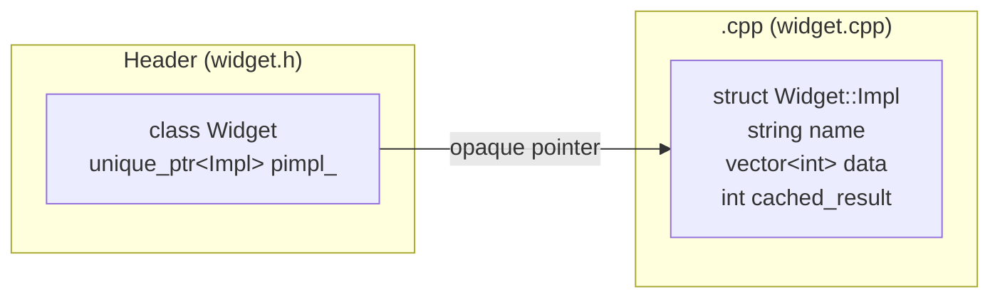
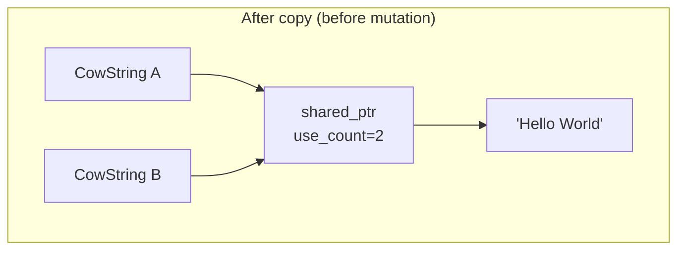
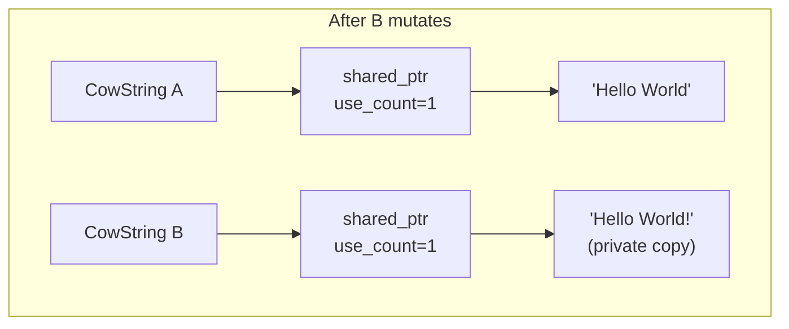
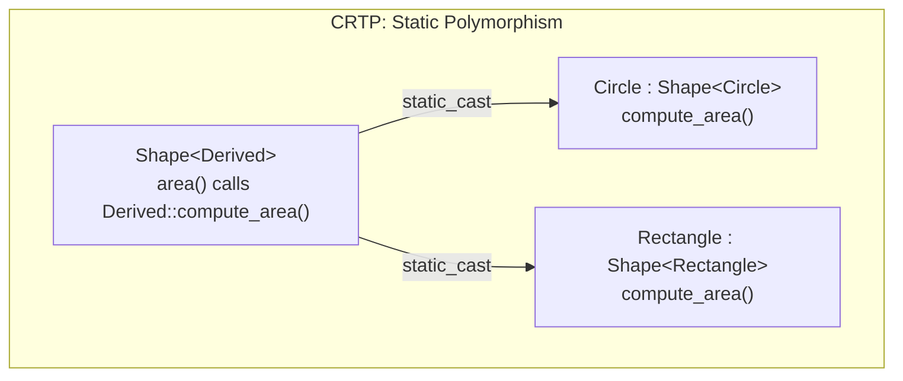
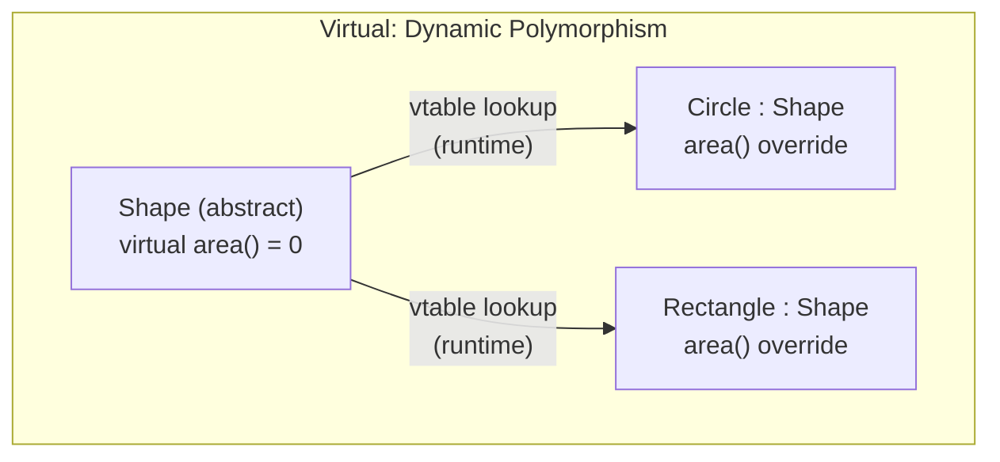

# Pimpl, Copy-on-Write & CRTP

> Three advanced C++ idioms that solve real engineering problems: Pimpl hides implementation to stabilize ABIs, COW defers expensive copies until mutation, and CRTP delivers polymorphism at zero runtime cost.

## Table of Contents
- [Core Concepts](#core-concepts)
- [Code Examples](#code-examples)
- [Common Pitfalls](#common-pitfalls)
- [Key Takeaways](#key-takeaways)
- [Exercises](#exercises)

## Core Concepts

### Pimpl (Pointer to Implementation)

#### What

Pimpl is an idiom where a class's private data members and implementation details are moved into a separate, forward-declared class. The public class holds only a pointer (typically `std::unique_ptr`) to this hidden implementation. The name literally means "pointer to implementation."

The public header exposes only the class's interface — no private data members, no private helper functions, no `#include` directives for implementation-only dependencies. The implementation class lives entirely in the `.cpp` file.

#### How

The pattern has two parts. The header declares the public class with a forward-declared `Impl` and a `unique_ptr<Impl>`:

```cpp
// widget.h
#include <memory>
#include <string_view>

class Widget {
public:
    explicit Widget(std::string_view name);
    ~Widget();                           // must be declared here, defined in .cpp

    Widget(Widget&& other) noexcept;     // move operations must also be declared
    Widget& operator=(Widget&& other) noexcept;

    Widget(const Widget& other);         // copy if needed — deep-copies the Impl
    Widget& operator=(const Widget& other);

    void do_work();
    int result() const;

private:
    struct Impl;                         // forward declaration — opaque
    std::unique_ptr<Impl> pimpl_;        // the only data member
};
```

The `.cpp` file defines the `Impl` struct with all the actual data, then implements every member function by delegating to `pimpl_`:

```cpp
// widget.cpp
#include "widget.h"
#include <vector>       // only needed in .cpp — not leaked into the header
#include <algorithm>

struct Widget::Impl {
    std::string name;
    std::vector<int> data;
    int cached_result = 0;
};

Widget::Widget(std::string_view name)
    : pimpl_{std::make_unique<Impl>()} {
    pimpl_->name = name;
}

Widget::~Widget() = default;  // defined here where Impl is complete

Widget::Widget(Widget&&) noexcept = default;
Widget& Widget::operator=(Widget&&) noexcept = default;

Widget::Widget(const Widget& other)
    : pimpl_{std::make_unique<Impl>(*other.pimpl_)} {}

Widget& Widget::operator=(const Widget& other) {
    *pimpl_ = *other.pimpl_;
    return *this;
}
```

The key mechanical requirement: the destructor, move operations, and copy operations *must* be declared in the header but *defined* in the `.cpp` file. The compiler needs `Impl` to be a complete type to destroy, move, or copy it. If you default the destructor in the header, the compiler tries to instantiate `unique_ptr<Impl>`'s deleter there, where `Impl` is incomplete — that's undefined behavior or a compile error.



#### Why It Matters

Pimpl solves two distinct problems:

**1. Compile-time firewall.** In a large codebase, changing a private data member in a header forces every file that includes that header to recompile. With Pimpl, the header never changes when implementation details change — only the `.cpp` file is recompiled. In codebases with hundreds of translation units, this can reduce incremental build times from minutes to seconds.

**2. ABI stability.** When you ship a shared library (`.so` / `.dylib` / `.dll`), clients link against your class's binary layout. If you add a private data member, the class's size changes, and every client must recompile and relink. With Pimpl, the class is always the same size (one pointer), so you can add, remove, or reorder implementation details without breaking binary compatibility. This is essential for system libraries, plugin APIs, and any library distributed in binary form.

The cost is a heap allocation per object (the `Impl` lives on the heap) and one level of pointer indirection for every member access. For most applications this is negligible, but in tight inner loops with millions of small objects, it can matter. Profile before deciding.

### Copy-on-Write (COW)

#### What

Copy-on-Write is a lazy optimization strategy: multiple objects share the same underlying data, and a private copy is made only when one of them needs to modify the data. Until mutation occurs, "copies" are essentially free — they just increment a reference count on the shared data.

Think of it like a shared Google Doc where everyone has read access to the same document. The moment someone wants to edit, they get their own private copy.

#### How

The typical COW implementation uses `std::shared_ptr` to manage the shared data. Every "copy" of the COW wrapper shares the same `shared_ptr`. When a non-const operation is called, the wrapper checks `shared_ptr::use_count()`: if it's greater than 1, the data is shared, so the wrapper deep-copies the data into a new allocation before mutating it. This is called "detaching."





The detach logic looks like this:

```cpp
void detach() {
    if (data_.use_count() > 1) {
        data_ = std::make_shared<Data>(*data_);  // deep copy
    }
}
```

Every mutating operation calls `detach()` before modifying the data. Read-only operations skip it entirely.

#### Why It Matters

COW shines when you have large objects that are frequently copied but rarely modified. Classic examples:

- **Large strings** — `std::string` in older libstdc++ implementations used COW internally (pre-C++11). C++11 banned COW for `std::string` because it causes data races in multithreaded programs (two threads sharing the same buffer might both try to detach simultaneously).
- **Document models** — a text editor's undo stack might store "copies" of the document at each state, but most states share most of their data.
- **Immutable data structures** — functional programming patterns where data is conceptually immutable but occasionally forked.

The key trade-off: COW moves the cost from copy time to mutation time. If your objects are copied often and mutated rarely, COW wins. If every copy is immediately mutated, COW is strictly worse than a plain deep copy (you pay the reference counting overhead *plus* the deep copy).

**Thread safety warning**: COW requires careful synchronization in multithreaded code. The `use_count()` check and the detach must be atomic with respect to other threads that might be reading or copying the same data. `std::shared_ptr`'s reference counting is thread-safe, but the detach logic is not — you need external synchronization or a lock in the detach function. This is exactly why C++11 banned COW for `std::string`.

### CRTP (Curiously Recurring Template Pattern)

#### What

CRTP is a pattern where a class derives from a base class template, passing *itself* as the template argument:

```cpp
template <typename Derived>
class Base {
    // can call static_cast<Derived*>(this) to access Derived's members
};

class Concrete : public Base<Concrete> {
    // inherits from Base<Concrete>
};
```

The "curious" part: the base class knows the derived class's type at compile time. This lets the base class call derived-class methods without virtual dispatch — the base uses `static_cast<Derived*>(this)` to access the derived object directly.

#### How

CRTP enables **static polymorphism**: the base class template defines a common interface, and derived classes provide the implementation — all resolved at compile time, with zero runtime overhead.

Consider the classic example: a base class that provides a common interface and delegates to the derived class for the actual behavior.

```cpp
template <typename Derived>
class Shape {
public:
    double area() const {
        // Call the derived class's implementation — no virtual dispatch
        return static_cast<const Derived*>(this)->compute_area();
    }

    void describe() const {
        std::cout << "Area: " << area() << '\n';
    }
};

class Circle : public Shape<Circle> {
public:
    explicit Circle(double radius) : radius_{radius} {}

    double compute_area() const {
        return 3.14159265358979 * radius_ * radius_;
    }

private:
    double radius_;
};
```

When you call `circle.area()`, the compiler resolves the `static_cast<const Circle*>(this)->compute_area()` call at compile time. There is no vtable, no pointer indirection, no branch misprediction — just a direct function call that can be inlined.



Compare this with virtual dispatch:



The critical difference: with CRTP, each derived class has its own unique base type (`Shape<Circle>` is a different type from `Shape<Rectangle>`). You cannot store them in a `std::vector<Shape*>` and call methods polymorphically at runtime. CRTP is for compile-time polymorphism — when you know the types at compile time and want maximum performance.

#### Why It Matters

CRTP is used extensively in production C++ for three purposes:

**1. Static polymorphism.** When you have a family of types with the same interface but want to avoid virtual dispatch overhead. This matters in performance-critical code — game engines, numerical libraries, embedded systems — where virtual calls in tight loops cause measurable cache misses and branch mispredictions.

**2. Mixin injection.** A CRTP base can inject functionality into any derived class. The STL itself uses this: `std::enable_shared_from_this<T>` is a CRTP base that injects the `shared_from_this()` method into any class `T` that derives from it.

```cpp
class MyClass : public std::enable_shared_from_this<MyClass> {
    // gains shared_from_this() method via CRTP
};
```

**3. Static interface enforcement.** The base class can document what methods the derived class must provide. If the derived class forgets `compute_area()`, you get a compile error — not at link time, not at runtime, but immediately when you try to use the class. This is like a compile-time abstract interface.

The limitation of CRTP is that it does not support runtime polymorphism. You cannot have a container of different CRTP-derived types and iterate over them calling a common method. For that, you need virtual functions (or `std::variant` with `std::visit`). CRTP and virtual dispatch are complementary tools — choose based on whether the type is known at compile time or runtime.

## Code Examples

### Pimpl — Stable ABI for a Logger Class

```cpp
// === logger.h ===
// This header is what clients include. Notice: no implementation details leaked.
// Adding new logging backends or changing internal data structures
// will never force clients to recompile.

#ifndef LOGGER_H
#define LOGGER_H

#include <memory>
#include <string_view>

class Logger {
public:
    enum class Level { debug, info, warning, error };

    explicit Logger(std::string_view log_file_path);
    ~Logger();

    // Move-only — a logger owns a file handle
    Logger(Logger&&) noexcept;
    Logger& operator=(Logger&&) noexcept;

    Logger(const Logger&) = delete;
    Logger& operator=(const Logger&) = delete;

    void log(Level level, std::string_view message);
    void flush();

private:
    struct Impl;
    std::unique_ptr<Impl> pimpl_;
};

#endif // LOGGER_H
```

```cpp
// === logger.cpp ===
// All implementation details live here. Clients never see this file.

#include <fstream>
#include <chrono>
#include <string>
#include <sstream>
#include <iomanip>
#include <iostream>
#include <vector>

// Simulating logger.h include — in a real project, #include "logger.h"
// (For this example, imagine the header above is included)

struct Logger::Impl {
    std::ofstream file;
    std::string file_path;
    std::vector<std::string> buffer;  // internal buffering — hidden from clients
    static constexpr std::size_t BUFFER_FLUSH_THRESHOLD = 100;

    explicit Impl(std::string_view path)
        : file{std::string{path}, std::ios::app}
        , file_path{path}
    {
        if (!file.is_open()) {
            throw std::runtime_error("Failed to open log file: " + file_path);
        }
    }

    void write_line(std::string_view level_str, std::string_view message) {
        // Build the log line with timestamp
        const auto now = std::chrono::system_clock::now();
        const auto time = std::chrono::system_clock::to_time_t(now);

        std::ostringstream oss;
        oss << std::put_time(std::localtime(&time), "%Y-%m-%d %H:%M:%S")
            << " [" << level_str << "] " << message;

        buffer.push_back(oss.str());

        if (buffer.size() >= BUFFER_FLUSH_THRESHOLD) {
            flush_buffer();
        }
    }

    void flush_buffer() {
        for (const auto& line : buffer) {
            file << line << '\n';
        }
        buffer.clear();
        file.flush();
    }
};

Logger::Logger(std::string_view log_file_path)
    : pimpl_{std::make_unique<Impl>(log_file_path)}
{}

// Defined here where Impl is a complete type — this is critical
Logger::~Logger() {
    if (pimpl_) {
        pimpl_->flush_buffer();  // flush remaining buffered lines on destruction
    }
}

Logger::Logger(Logger&&) noexcept = default;
Logger& Logger::operator=(Logger&&) noexcept = default;

void Logger::log(Level level, std::string_view message) {
    // Map the enum to a string — this logic is entirely hidden from clients
    static constexpr const char* level_strings[] = {
        "DEBUG", "INFO", "WARN", "ERROR"
    };
    const auto idx = static_cast<std::size_t>(level);
    pimpl_->write_line(level_strings[idx], message);
}

void Logger::flush() {
    pimpl_->flush_buffer();
}
```

### Copy-on-Write — Shared Immutable Buffer

```cpp
#include <algorithm>
#include <cstddef>
#include <iostream>
#include <memory>
#include <numeric>
#include <vector>

// A COW buffer: copies are cheap (shared_ptr copy), and a deep copy
// only happens when a non-const operation is called on a shared buffer.
class CowBuffer {
public:
    explicit CowBuffer(std::size_t size)
        : data_{std::make_shared<std::vector<double>>(size, 0.0)}
    {}

    // Copy is cheap — just increments the reference count
    CowBuffer(const CowBuffer&) = default;
    CowBuffer& operator=(const CowBuffer&) = default;

    CowBuffer(CowBuffer&&) noexcept = default;
    CowBuffer& operator=(CowBuffer&&) noexcept = default;

    // Read-only access — no detach needed, shared data is safe to read
    double operator[](std::size_t index) const {
        return (*data_)[index];
    }

    std::size_t size() const { return data_->size(); }

    double sum() const {
        return std::accumulate(data_->begin(), data_->end(), 0.0);
    }

    // Mutating access — must detach first to avoid modifying shared data
    void set(std::size_t index, double value) {
        detach();  // make a private copy if shared
        (*data_)[index] = value;
    }

    void fill(double value) {
        detach();
        std::fill(data_->begin(), data_->end(), value);
    }

    // Diagnostic: how many CowBuffers share this data?
    long use_count() const { return data_.use_count(); }

private:
    std::shared_ptr<std::vector<double>> data_;

    // The core COW mechanism: if the data is shared (use_count > 1),
    // make a private deep copy before mutating.
    void detach() {
        if (data_.use_count() > 1) {
            data_ = std::make_shared<std::vector<double>>(*data_);
        }
    }
};

int main() {
    // Create a large buffer
    CowBuffer original(1'000'000);
    original.fill(3.14);

    // "Copy" is instant — no data is duplicated, just a shared_ptr copy
    CowBuffer copy1 = original;
    CowBuffer copy2 = original;

    std::cout << "After copies:\n";
    std::cout << "  original use_count: " << original.use_count() << '\n';  // 3
    std::cout << "  copy1 use_count:    " << copy1.use_count() << '\n';     // 3
    std::cout << "  copy2 use_count:    " << copy2.use_count() << '\n';     // 3

    // Reading is shared — no copy triggered
    std::cout << "  copy1[0]: " << copy1[0] << '\n';  // 3.14

    // Mutation triggers a detach — copy2 gets its own private data
    copy2.set(0, 999.0);

    std::cout << "\nAfter copy2.set(0, 999.0):\n";
    std::cout << "  original use_count: " << original.use_count() << '\n';  // 2
    std::cout << "  copy1 use_count:    " << copy1.use_count() << '\n';     // 2
    std::cout << "  copy2 use_count:    " << copy2.use_count() << '\n';     // 1

    // original and copy1 still share, copy2 is independent
    std::cout << "  original[0]: " << original[0] << '\n';  // 3.14
    std::cout << "  copy1[0]:    " << copy1[0] << '\n';     // 3.14
    std::cout << "  copy2[0]:    " << copy2[0] << '\n';     // 999.0

    return 0;
}
```

### CRTP — Static Polymorphism for Numeric Types

```cpp
#include <cmath>
#include <iostream>

// CRTP base: provides common operations for any numeric-like type.
// The derived class must implement:
//   - value() const -> double
//   - negate() const -> Derived
// The base provides abs() and is_zero() for free.
template <typename Derived>
class Numeric {
public:
    // "Free" operations derived from the interface the derived class provides
    double abs() const {
        return std::abs(self().value());
    }

    bool is_zero(double epsilon = 1e-9) const {
        return abs() < epsilon;
    }

    // Comparison operator — provided once, works for all derived types
    bool operator==(const Derived& other) const {
        return std::abs(self().value() - other.value()) < 1e-9;
    }

    bool operator!=(const Derived& other) const {
        return !(*this == other);
    }

    friend std::ostream& operator<<(std::ostream& os, const Derived& d) {
        return os << d.value();
    }

private:
    // The CRTP "self" cast — the base accesses the derived object
    const Derived& self() const {
        return static_cast<const Derived&>(*this);
    }
};

// Concrete type: a temperature value with unit
class Celsius : public Numeric<Celsius> {
public:
    constexpr explicit Celsius(double degrees) : degrees_{degrees} {}

    constexpr double value() const { return degrees_; }

    constexpr Celsius negate() const { return Celsius{-degrees_}; }

    // Domain-specific operation
    double to_fahrenheit() const { return degrees_ * 9.0 / 5.0 + 32.0; }

private:
    double degrees_;
};

// Another concrete type: a voltage value
class Voltage : public Numeric<Voltage> {
public:
    constexpr explicit Voltage(double volts) : volts_{volts} {}

    constexpr double value() const { return volts_; }

    constexpr Voltage negate() const { return Voltage{-volts_}; }

    // Domain-specific operation
    double to_millivolts() const { return volts_ * 1000.0; }

private:
    double volts_;
};

int main() {
    const Celsius temp{-40.0};
    const Voltage reading{3.3};

    // abs() and is_zero() come from the CRTP base — no code duplication
    std::cout << "Temperature: " << temp << " C\n";
    std::cout << "  abs: " << temp.abs() << '\n';
    std::cout << "  is_zero: " << std::boolalpha << temp.is_zero() << '\n';
    std::cout << "  Fahrenheit: " << temp.to_fahrenheit() << '\n';

    std::cout << "\nVoltage: " << reading << " V\n";
    std::cout << "  abs: " << reading.abs() << '\n';
    std::cout << "  millivolts: " << reading.to_millivolts() << '\n';

    // Type safety: Celsius and Voltage are different types.
    // This would NOT compile:
    // if (temp == reading) { ... }  // ERROR: no operator==(Celsius, Voltage)

    const Celsius zero{0.0};
    std::cout << "\n0 C is_zero: " << zero.is_zero() << '\n';  // true

    return 0;
}
```

### CRTP Mixin — Adding Counting to Any Class

```cpp
#include <cstdint>
#include <iostream>
#include <string>
#include <string_view>

// A CRTP mixin that tracks how many instances of a class exist.
// This is the "mixin injection" use of CRTP — the base class adds
// functionality to any derived class without virtual dispatch.
template <typename Derived>
class InstanceCounted {
public:
    InstanceCounted() { ++count_; }
    InstanceCounted(const InstanceCounted&) { ++count_; }
    InstanceCounted(InstanceCounted&&) noexcept { ++count_; }

    ~InstanceCounted() { --count_; }

    // These are deleted to prevent slicing — the derived class should
    // define its own assignment operators if needed
    InstanceCounted& operator=(const InstanceCounted&) = default;
    InstanceCounted& operator=(InstanceCounted&&) noexcept = default;

    static std::int64_t instance_count() { return count_; }

private:
    // Each unique Derived type gets its own counter because
    // InstanceCounted<Player> and InstanceCounted<Enemy> are different types.
    static inline std::int64_t count_ = 0;  // inline variable (C++17)
};

// Example: game entities that track their population
class Player : public InstanceCounted<Player> {
public:
    explicit Player(std::string_view name) : name_{name} {}
    const std::string& name() const { return name_; }
private:
    std::string name_;
};

class Enemy : public InstanceCounted<Enemy> {
public:
    explicit Enemy(int power) : power_{power} {}
    int power() const { return power_; }
private:
    int power_;
};

int main() {
    std::cout << "Players: " << Player::instance_count() << '\n';  // 0
    std::cout << "Enemies: " << Enemy::instance_count() << '\n';   // 0

    Player p1{"Alice"};
    Player p2{"Bob"};
    Enemy e1{50};

    std::cout << "\nAfter creating 2 players and 1 enemy:\n";
    std::cout << "Players: " << Player::instance_count() << '\n';  // 2
    std::cout << "Enemies: " << Enemy::instance_count() << '\n';   // 1

    {
        Player p3{"Charlie"};
        std::cout << "\nInside scope (3 players):\n";
        std::cout << "Players: " << Player::instance_count() << '\n';  // 3
    }

    std::cout << "\nAfter scope exit (p3 destroyed):\n";
    std::cout << "Players: " << Player::instance_count() << '\n';  // 2

    // Each type has its own independent counter — this is because
    // InstanceCounted<Player> and InstanceCounted<Enemy> are distinct types,
    // each with their own static count_ variable.

    return 0;
}
```

### CRTP in the Standard Library — `enable_shared_from_this`

```cpp
#include <iostream>
#include <memory>
#include <string>
#include <string_view>
#include <vector>

// std::enable_shared_from_this is a CRTP base in the standard library.
// It allows an object managed by shared_ptr to safely obtain a shared_ptr
// to itself from within its own methods.

class Session : public std::enable_shared_from_this<Session> {
public:
    // Factory function — ensures the object is always managed by shared_ptr.
    // The constructor is private to prevent stack allocation, which would
    // make shared_from_this() undefined behavior.
    static std::shared_ptr<Session> create(std::string_view name) {
        // Can't use make_shared with private constructor,
        // so we use the shared_ptr constructor directly
        return std::shared_ptr<Session>(new Session{name});
    }

    void start() {
        std::cout << "Session '" << name_ << "' started.\n";

        // shared_from_this() returns a shared_ptr<Session> pointing to *this.
        // This is safe because Session is managed by shared_ptr (enforced by
        // the factory function). Without enable_shared_from_this, obtaining
        // a shared_ptr from a raw 'this' pointer would create a second
        // control block — a guaranteed double-free.
        auto self = shared_from_this();
        std::cout << "  use_count during start(): " << self.use_count() << '\n';
    }

    // A method that registers this session in an external collection.
    // Without CRTP + enable_shared_from_this, we'd need the caller
    // to pass in the shared_ptr, which is awkward and error-prone.
    void register_in(std::vector<std::shared_ptr<Session>>& registry) {
        registry.push_back(shared_from_this());
    }

    ~Session() {
        std::cout << "Session '" << name_ << "' destroyed.\n";
    }

private:
    explicit Session(std::string_view name) : name_{name} {}
    std::string name_;
};

int main() {
    std::vector<std::shared_ptr<Session>> registry;

    {
        auto session = Session::create("alpha");
        session->start();
        session->register_in(registry);

        std::cout << "use_count after register: "
                  << session.use_count() << '\n';  // 2 (session + registry)
    }
    // 'session' local var destroyed, but registry still holds a reference
    std::cout << "\nSession still alive in registry.\n";
    std::cout << "Registry size: " << registry.size() << '\n';

    registry.clear();  // last reference dropped — Session destroyed
    std::cout << "Registry cleared.\n";

    return 0;
}
```

## Common Pitfalls

### Defaulting the Pimpl destructor in the header

```cpp
// BAD — destructor defaulted in the header where Impl is incomplete
#include <memory>

class Widget {
public:
    Widget();
    ~Widget() = default;  // ERROR: unique_ptr tries to delete incomplete Impl

private:
    struct Impl;
    std::unique_ptr<Impl> pimpl_;
};
```

`unique_ptr`'s default deleter calls `delete` on the managed pointer, which requires the type to be complete (so the compiler can determine the size and call the destructor). When you `= default` the destructor in the header, the compiler instantiates the deleter right there — where `Impl` is only forward-declared.

```cpp
// GOOD — declare destructor in header, define in .cpp where Impl is complete
// widget.h
#include <memory>

class Widget {
public:
    Widget();
    ~Widget();  // declared, not defined

private:
    struct Impl;
    std::unique_ptr<Impl> pimpl_;
};

// widget.cpp
// #include "widget.h"
// struct Widget::Impl { ... };
// Widget::Widget() : pimpl_{std::make_unique<Impl>()} {}
// Widget::~Widget() = default;  // safe — Impl is complete here
```

### COW without handling thread safety

```cpp
// BAD — COW detach() races with concurrent reads
#include <memory>
#include <vector>

class CowBuffer {
public:
    explicit CowBuffer(std::size_t size)
        : data_{std::make_shared<std::vector<int>>(size)} {}

    void set(std::size_t i, int value) {
        // RACE CONDITION: another thread might be reading data_ via operator[]
        // at the same time we're checking use_count and potentially replacing data_.
        // use_count() itself is thread-safe, but the detach-then-mutate sequence is not.
        if (data_.use_count() > 1) {
            data_ = std::make_shared<std::vector<int>>(*data_);
        }
        (*data_)[i] = value;
    }

    int operator[](std::size_t i) const {
        return (*data_)[i];  // reading shared data while another thread detaches
    }

private:
    std::shared_ptr<std::vector<int>> data_;
};
```

The `shared_ptr` reference count is atomic, but the detach-check-then-copy sequence is not. Thread A could be reading through the old `data_` pointer while Thread B replaces it. This is a data race — undefined behavior.

```cpp
// GOOD — protect the detach with a mutex, or document single-threaded use only
#include <memory>
#include <mutex>
#include <vector>

class CowBuffer {
public:
    explicit CowBuffer(std::size_t size)
        : data_{std::make_shared<std::vector<int>>(size)} {}

    void set(std::size_t i, int value) {
        std::lock_guard<std::mutex> lock{mutex_};
        if (data_.use_count() > 1) {
            data_ = std::make_shared<std::vector<int>>(*data_);
        }
        (*data_)[i] = value;
    }

    int operator[](std::size_t i) const {
        std::lock_guard<std::mutex> lock{mutex_};
        return (*data_)[i];
    }

private:
    std::shared_ptr<std::vector<int>> data_;
    mutable std::mutex mutex_;
};
```

### Passing the wrong type to a CRTP base

```cpp
// BAD — Circle derives from Shape<Rectangle> instead of Shape<Circle>
template <typename Derived>
class Shape {
public:
    double area() const {
        return static_cast<const Derived*>(this)->compute_area();
    }
};

class Rectangle : public Shape<Rectangle> {
public:
    double compute_area() const { return width_ * height_; }
private:
    double width_ = 10.0, height_ = 5.0;
};

// OOPS: Circle passes Rectangle as the template argument!
class Circle : public Shape<Rectangle> {  // should be Shape<Circle>
public:
    double compute_area() const { return 3.14159 * r_ * r_; }
private:
    double r_ = 1.0;
};
```

When `Circle` inherits from `Shape<Rectangle>`, the `static_cast<const Rectangle*>(this)` inside `area()` casts a `Circle*` to a `Rectangle*`. This is undefined behavior — the memory layout is wrong, and calling `compute_area()` will read garbage or crash. The compiler won't catch this because the static_cast "trusts" you.

```cpp
// GOOD — each class passes itself as the template argument
// To prevent this mistake, you can add a static_assert in the CRTP base (C++17):
template <typename Derived>
class Shape {
public:
    double area() const {
        // Verify at compile time that Derived actually inherits from Shape<Derived>
        static_assert(std::is_base_of_v<Shape<Derived>, Derived>,
                      "CRTP misuse: Derived must inherit from Shape<Derived>");
        return static_cast<const Derived*>(this)->compute_area();
    }
};

class Circle : public Shape<Circle> {  // correct: Circle passes Circle
public:
    double compute_area() const { return 3.14159 * r_ * r_; }
private:
    double r_ = 1.0;
};
```

### Calling `shared_from_this()` on a stack-allocated object

```cpp
// BAD — shared_from_this() requires the object to be managed by shared_ptr
#include <iostream>
#include <memory>

class Widget : public std::enable_shared_from_this<Widget> {
public:
    std::shared_ptr<Widget> get_self() {
        return shared_from_this();  // UNDEFINED BEHAVIOR if not managed by shared_ptr
    }
};

int main() {
    Widget w;                    // stack-allocated — NOT managed by shared_ptr
    auto sp = w.get_self();     // throws std::bad_weak_ptr (or UB in older implementations)
    return 0;
}
```

`enable_shared_from_this` works by storing a `weak_ptr` to the object's control block. That control block only exists if the object is managed by `shared_ptr`. A stack-allocated object has no control block.

```cpp
// GOOD — always create the object via make_shared or a factory function
#include <iostream>
#include <memory>

class Widget : public std::enable_shared_from_this<Widget> {
public:
    // Factory function ensures the object is always managed by shared_ptr
    static std::shared_ptr<Widget> create() {
        return std::make_shared<Widget>();
    }

    std::shared_ptr<Widget> get_self() {
        return shared_from_this();  // safe — managed by shared_ptr
    }
};

int main() {
    auto w = Widget::create();
    auto sp = w->get_self();    // OK — same control block
    std::cout << "use_count: " << sp.use_count() << '\n';  // 2
    return 0;
}
```

## Key Takeaways

- **Pimpl provides compile-time isolation and ABI stability** at the cost of one heap allocation and one level of indirection. Declare the destructor (and move/copy operations) in the header, define them in the `.cpp` where `Impl` is a complete type.
- **COW optimizes read-heavy workloads** by deferring copies until mutation. It is not thread-safe by default — C++11 banned COW for `std::string` precisely because of multithreading hazards. Use COW only when profiling shows copy costs are a bottleneck and the usage pattern is mostly reads.
- **CRTP enables static polymorphism** — compile-time dispatch with zero overhead. It's the backbone of mixin patterns and is used by the STL itself (`std::enable_shared_from_this`). The trade-off: each CRTP-derived type is a unique base type, so you lose the ability to store them in a common container.
- **Choose the right polymorphism**: CRTP when types are known at compile time and performance matters; virtual functions when you need runtime type flexibility; `std::variant` + `std::visit` when the set of types is closed and known in advance.
- **All three idioms encode design decisions in the type system**: Pimpl separates interface from implementation, COW separates logical copying from physical copying, and CRTP separates interface definition from implementation dispatch.

## Exercises

1. **Pimpl migration.** Take the following class and refactor it to use Pimpl. Write both the header and the `.cpp` file. Make sure the class is moveable but non-copyable.
   ```cpp
   class HttpClient {
   public:
       HttpClient(std::string base_url, int timeout_ms);
       std::string get(std::string_view endpoint);
   private:
       std::string base_url_;
       int timeout_ms_;
       std::vector<std::string> request_history_;
       std::map<std::string, std::string> default_headers_;
   };
   ```

2. **COW analysis.** You have a `CowString` class that uses COW. A function copies the string 1000 times into a vector, then iterates the vector and appends one character to each copy. Explain step-by-step what happens internally: how many heap allocations occur, when do detaches happen, and how does this compare to a `std::string` (which does not use COW in modern C++)?

3. **CRTP static interface.** Design a CRTP base class `Serializable<Derived>` that provides a `to_json()` method. The derived class must implement `field_count()` and `field_at(std::size_t index)` (returning a `std::pair<std::string, std::string>` for each field name and value). The base's `to_json()` should iterate the fields and build a JSON string. Implement two derived classes: `Person` (name, age) and `Config` (key, value).

4. **CRTP guard.** The "wrong type argument" pitfall (deriving `Circle` from `Shape<Rectangle>`) is one of the most dangerous CRTP bugs. Write a CRTP base class with a constructor that uses `static_assert` to verify at compile time that `Derived` actually inherits from `Base<Derived>`. Then prove it works by writing a test case that would trigger the assertion.

5. **When to use what.** For each of the following scenarios, state whether you would use Pimpl, COW, CRTP, virtual functions, or `std::variant`, and explain your reasoning:
   - A shared library that must maintain binary compatibility across versions
   - A game engine that needs polymorphic behavior for different entity types (player, enemy, NPC) in a tight update loop running at 60 FPS
   - A document editor where undo/redo stores snapshots of the document state
   - A plugin system where third-party developers can add new behavior types at runtime

---
up:: [Schedule](../../Schedule.md)
#type/learning #source/self-study #status/evergreen
