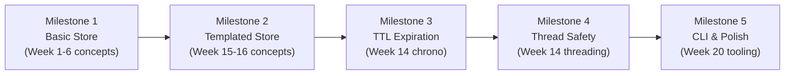

# Capstone Project — In-Memory Key-Value Store

> Build a production-quality in-memory key-value store that exercises templates, smart pointers, RAII, STL containers, operator overloading, exception handling, and multithreading — tying together every major concept from the past 20 weeks.

## Table of Contents
- [Core Concepts](#core-concepts)
- [Code Examples](#code-examples)
- [Common Pitfalls](#common-pitfalls)
- [Key Takeaways](#key-takeaways)
- [Exercises](#exercises)

## Core Concepts

### Why a Key-Value Store?

#### What

A key-value store (KVS) is one of the most fundamental data structures in systems programming. At its core, it maps keys to values — like `std::unordered_map` — but a real KVS adds expiration (TTL), thread safety, serialization, and a clean API. This project is a microcosm of production C++: it touches nearly every topic from this curriculum.

#### How

The project is structured in five milestones, each building on the last. You start with a simple single-threaded store, then layer on templates, TTL expiration, thread safety, and finally a command-line interface. Each milestone exercises specific concepts from previous weeks.

#### Why It Matters

Building a non-trivial project forces you to make real design decisions — the kind that don't arise in isolated exercises. Should the store own the values or hold references? Should expiration be checked on every access (lazy) or on a background timer (eager)? Should the API throw exceptions or return `std::optional`? These decisions require you to synthesize knowledge from multiple weeks into a coherent design.

### Project Architecture

#### What

The KVS is organized as a library (`kvstore/`) with a separate CLI driver (`main.cpp`). This mirrors how production C++ projects are structured: a reusable library with clean headers, and a thin executable that uses it.

#### How

```
capstone/
├── CMakeLists.txt
├── include/
│   └── kvstore/
│       ├── kvstore.hpp        # Main store class template
│       ├── entry.hpp          # Entry with value + metadata (TTL)
│       ├── serializer.hpp     # Serialization interface
│       └── exceptions.hpp     # Custom exception hierarchy
├── src/
│   └── main.cpp               # CLI driver
└── tests/
    └── kvstore_test.cpp       # Unit tests (gtest)
```

#### Why It Matters

Separating the library from the executable forces you to think about API design, header dependencies, and compilation units — the exact skills from Week 7. The `include/kvstore/` directory structure follows the convention used by Boost, Google's libraries, and most open-source C++ projects.

### Milestone Breakdown



### Milestone 1: Basic Single-Type Store

#### What

A `StringStore` class that maps `std::string` keys to `std::string` values. This milestone focuses on getting the fundamentals right: clean API, proper resource management, and idiomatic C++.

#### How

**Concepts exercised**: RAII (Week 18), smart pointers (Week 6), operator overloading (Week 3), exception handling (Week 10), STL containers (Week 13).

**Requirements**:

1. Store string key-value pairs using `std::unordered_map`
2. Support `put(key, value)`, `get(key)`, `remove(key)`, `contains(key)`, `size()`, `clear()`
3. `get()` returns `std::optional<std::string>` — no exceptions for missing keys
4. Overload `operator[]` for convenient access (returns a reference, throws `KeyNotFoundError` if missing)
5. Define a custom exception hierarchy: `KVStoreError` (base) → `KeyNotFoundError`
6. Follow the Rule of Zero — no manual resource management

**Interface sketch**:

```cpp
#include <optional>
#include <string>
#include <string_view>
#include <unordered_map>

class KeyNotFoundError : public std::runtime_error {
public:
    explicit KeyNotFoundError(std::string_view key);
};

class StringStore {
public:
    // Insert or update a key-value pair.
    void put(std::string_view key, std::string value);

    // Retrieve a value by key. Returns std::nullopt if the key doesn't exist.
    [[nodiscard]] std::optional<std::string> get(std::string_view key) const;

    // Access a value by key. Throws KeyNotFoundError if the key doesn't exist.
    [[nodiscard]] const std::string& operator[](std::string_view key) const;
    [[nodiscard]] std::string& operator[](std::string_view key);

    // Remove a key-value pair. Returns true if the key existed.
    bool remove(std::string_view key);

    // Check if a key exists.
    [[nodiscard]] bool contains(std::string_view key) const;

    // Return the number of entries.
    [[nodiscard]] std::size_t size() const noexcept;

    // Remove all entries.
    void clear() noexcept;

private:
    std::unordered_map<std::string, std::string> data_;
};
```

#### Why It Matters

This milestone establishes the API contract that all future milestones build on. Getting the `const`-correctness right now prevents headaches later. Using `std::optional` for `get()` and exceptions for `operator[]` demonstrates the "two error strategies for two use cases" pattern from Week 10: `get()` is for "key might not exist" (expected), `operator[]` is for "key must exist" (programmer error).

### Milestone 2: Templated Store

#### What

Generalize `StringStore` into `KVStore<Key, Value>` — a class template that works with any key and value types.

#### How

**Concepts exercised**: Templates (Week 15), template specialization (Week 16), type traits (Week 16), SFINAE / `if constexpr` (Week 17).

**Requirements**:

1. Convert `StringStore` to `KVStore<Key, Value>` using class templates
2. Constrain `Key` to be hashable (`std::hash<Key>` must exist) — use `static_assert` or SFINAE
3. Add a `for_each(callable)` method that takes a callable and applies it to every entry
4. Support structured bindings for iteration: `for (const auto& [key, value] : store)`
5. Write a `Serializer<T>` trait with `to_string()` and `from_string()` — specialize for `int`, `double`, `std::string`

**Key design decisions**:

```cpp
template<typename Key, typename Value,
         typename Hash = std::hash<Key>,
         typename KeyEqual = std::equal_to<Key>>
class KVStore {
    // ...
private:
    std::unordered_map<Key, Value, Hash, KeyEqual> data_;
};
```

The `Hash` and `KeyEqual` template parameters mirror `std::unordered_map`'s design — they let users provide custom hash functions for custom key types without modifying the store.

#### Why It Matters

This is where templates earn their keep. A `KVStore<std::string, int>` stores configuration settings. A `KVStore<int, std::vector<double>>` stores sensor readings by ID. The same code, zero runtime overhead, full type safety. You'll also experience the practical pain of templates: everything goes in headers, error messages get longer, and compilation slows down.

### Milestone 3: TTL (Time-To-Live) Expiration

#### What

Add expiration support: each entry can optionally have a TTL (time-to-live) after which it's automatically considered expired.

#### How

**Concepts exercised**: `<chrono>` (Week 14), `std::optional` (Week 5), RAII cleanup patterns (Week 18).

**Requirements**:

1. Add an `Entry<Value>` wrapper that holds the value, insertion time, and optional TTL
2. Extend `put()` to accept an optional `std::chrono::seconds` TTL parameter
3. `get()` and `operator[]` check expiration before returning — expired entries return `std::nullopt` / throw
4. Add `cleanup()` to remove all expired entries (lazy expiration on access, batch cleanup on demand)
5. Use `std::chrono::steady_clock` for timing — never `system_clock` (which can jump when the system clock is adjusted)

**Entry structure**:

```cpp
template<typename Value>
struct Entry {
    Value value;
    std::chrono::steady_clock::time_point created_at;
    std::optional<std::chrono::seconds> ttl;

    [[nodiscard]] bool is_expired() const noexcept {
        if (!ttl) return false;  // No TTL means never expires
        const auto elapsed = std::chrono::steady_clock::now() - created_at;
        return elapsed >= *ttl;
    }
};
```

#### Why It Matters

TTL expiration is a real-world requirement in caches, session stores, and rate limiters. The design choice between lazy expiration (check on access) and eager expiration (background timer) has real performance implications. Lazy is simpler but can leave stale entries consuming memory. Eager requires a background thread — which you'll add in Milestone 4.

### Milestone 4: Thread Safety

#### What

Make the store safe for concurrent access from multiple threads.

#### How

**Concepts exercised**: `std::mutex`, `std::lock_guard`, `std::shared_mutex` (Week 14), RAII for locks (Week 18), data races and UB (Week 12).

**Requirements**:

1. Add a `std::shared_mutex` to the store
2. Use `std::shared_lock` for read operations (`get`, `contains`, `size`) — allows concurrent readers
3. Use `std::unique_lock` for write operations (`put`, `remove`, `clear`) — exclusive access
4. Ensure exception safety: locks are RAII-managed, so they release even if an exception propagates
5. Add a `ConcurrentKVStore<Key, Value>` wrapper (or make thread safety a template policy)
6. Write a stress test that spawns multiple reader/writer threads

**Reader-writer lock pattern**:

```cpp
#include <shared_mutex>

template<typename Key, typename Value>
class ConcurrentKVStore {
public:
    void put(const Key& key, Value value) {
        std::unique_lock lock(mutex_);  // Exclusive access for writes
        store_.put(key, std::move(value));
    }

    [[nodiscard]] std::optional<Value> get(const Key& key) const {
        std::shared_lock lock(mutex_);  // Shared access for reads
        return store_.get(key);
    }

    // ... other methods follow the same pattern

private:
    mutable std::shared_mutex mutex_;  // mutable: locked in const methods
    KVStore<Key, Value> store_;
};
```

#### Why It Matters

Thread safety is where C++ gets hard. A single missing lock turns a correct program into one with undefined behavior — and the bug might not manifest until production, under load, on a different CPU architecture. Using `std::shared_mutex` (C++17) demonstrates the reader-writer pattern: multiple threads can read simultaneously, but writes require exclusive access. The `mutable` keyword on the mutex is essential — without it, `const` methods like `get()` can't lock the mutex.

### Milestone 5: CLI Interface and Polish

#### What

Build a command-line interface that lets you interact with the store, and add CMake build support.

#### How

**Concepts exercised**: CMake (Week 20), iostream (Week 13), string parsing, error handling.

**Requirements**:

1. Create a `CMakeLists.txt` that builds the library and the CLI executable
2. Parse commands: `PUT key value [ttl_seconds]`, `GET key`, `DEL key`, `KEYS`, `SIZE`, `CLEAR`, `QUIT`
3. Handle invalid input gracefully — print error messages, don't crash
4. Add a `DUMP` command that serializes all entries to stdout using the `Serializer` trait
5. Write at least 5 gtest unit tests covering: basic put/get, TTL expiration, missing key behavior, concurrent access, and serialization round-trip

**CMake skeleton**:

```cmake
cmake_minimum_required(VERSION 3.16)
project(kvstore LANGUAGES CXX)

set(CMAKE_CXX_STANDARD 17)
set(CMAKE_CXX_STANDARD_REQUIRED ON)

# Library target
add_library(kvstore_lib INTERFACE)
target_include_directories(kvstore_lib INTERFACE include/)

# Executable target
add_executable(kvstore src/main.cpp)
target_link_libraries(kvstore PRIVATE kvstore_lib)

# Tests (requires gtest)
find_package(GTest QUIET)
if(GTest_FOUND)
    add_executable(kvstore_test tests/kvstore_test.cpp)
    target_link_libraries(kvstore_test PRIVATE kvstore_lib GTest::GTest GTest::Main)
    add_test(NAME kvstore_test COMMAND kvstore_test)
endif()
```

#### Why It Matters

This milestone connects everything to the real world. CMake is the build system you'll use in every professional C++ project. Writing tests forces you to think about edge cases. The CLI gives you a tangible, interactive result — something you can demo, extend, and put on your resume.

## Code Examples

### Custom Exception Hierarchy

```cpp
#include <stdexcept>
#include <string>
#include <string_view>

// Base exception for all KVStore errors.
// Inheriting from std::runtime_error gives us what() for free.
class KVStoreError : public std::runtime_error {
public:
    using std::runtime_error::runtime_error;
};

// Thrown when accessing a key that doesn't exist via operator[].
// Stores the key for diagnostic purposes.
class KeyNotFoundError : public KVStoreError {
public:
    explicit KeyNotFoundError(std::string_view key)
        : KVStoreError("Key not found: " + std::string(key))
        , key_(key) {}

    [[nodiscard]] std::string_view key() const noexcept { return key_; }

private:
    std::string key_;
};

// Thrown when a serialization/deserialization operation fails.
class SerializationError : public KVStoreError {
public:
    using KVStoreError::KVStoreError;
};
```

### Entry with TTL Support

```cpp
#include <chrono>
#include <optional>
#include <utility>

// Wraps a value with metadata: creation time and optional TTL.
// This is the internal representation — users of the store never see it.
template<typename Value>
struct Entry {
    Value value;
    std::chrono::steady_clock::time_point created_at;
    std::optional<std::chrono::seconds> ttl;

    // Construct an entry with an optional TTL.
    // steady_clock is used because it's monotonic — immune to system clock changes.
    explicit Entry(Value val, std::optional<std::chrono::seconds> time_to_live = std::nullopt)
        : value(std::move(val))
        , created_at(std::chrono::steady_clock::now())
        , ttl(time_to_live) {}

    // Check if this entry has expired.
    // No TTL means the entry never expires.
    [[nodiscard]] bool is_expired() const noexcept {
        if (!ttl) return false;
        const auto elapsed = std::chrono::steady_clock::now() - created_at;
        return elapsed >= *ttl;
    }

    // Return the remaining time before expiration.
    // Returns nullopt if the entry has no TTL or has already expired.
    [[nodiscard]] std::optional<std::chrono::seconds> remaining() const noexcept {
        if (!ttl) return std::nullopt;
        const auto elapsed = std::chrono::steady_clock::now() - created_at;
        if (elapsed >= *ttl) return std::chrono::seconds{0};
        return std::chrono::duration_cast<std::chrono::seconds>(*ttl - elapsed);
    }
};
```

### Serializer Trait with Specializations

```cpp
#include <sstream>
#include <stdexcept>
#include <string>
#include <type_traits>

// Primary template — unspecialized.
// If someone tries to serialize an unsupported type, they get a clear error.
template<typename T, typename = void>
struct Serializer {
    static_assert(sizeof(T) == 0,
        "No Serializer specialization for this type. "
        "Provide a specialization with to_string() and from_string().");
};

// Specialization for std::string — identity transformation.
template<>
struct Serializer<std::string> {
    static std::string to_string(const std::string& value) {
        return value;
    }
    static std::string from_string(const std::string& str) {
        return str;
    }
};

// Specialization for int.
template<>
struct Serializer<int> {
    static std::string to_string(int value) {
        return std::to_string(value);
    }
    static int from_string(const std::string& str) {
        try {
            return std::stoi(str);
        } catch (const std::exception&) {
            throw SerializationError("Cannot parse '" + str + "' as int");
        }
    }
};

// Specialization for double.
template<>
struct Serializer<double> {
    static std::string to_string(double value) {
        std::ostringstream oss;
        oss << value;
        return oss.str();
    }
    static double from_string(const std::string& str) {
        try {
            return std::stod(str);
        } catch (const std::exception&) {
            throw SerializationError("Cannot parse '" + str + "' as double");
        }
    }
};

// Specialization for any arithmetic type not already specialized.
// Uses if constexpr to handle integral vs floating-point.
template<typename T>
struct Serializer<T, std::enable_if_t<std::is_arithmetic_v<T>
                                       && !std::is_same_v<T, int>
                                       && !std::is_same_v<T, double>>> {
    static std::string to_string(T value) {
        return std::to_string(value);
    }
    static T from_string(const std::string& str) {
        if constexpr (std::is_integral_v<T>) {
            return static_cast<T>(std::stoll(str));
        } else {
            return static_cast<T>(std::stold(str));
        }
    }
};
```

### Thread-Safe Store with Reader-Writer Lock

```cpp
#include <functional>
#include <mutex>
#include <optional>
#include <shared_mutex>
#include <string>
#include <unordered_map>
#include <utility>
#include <vector>

// A thread-safe key-value store using std::shared_mutex for concurrent reads.
// Read operations (get, contains, size) use shared locks — multiple readers allowed.
// Write operations (put, remove, clear) use unique locks — exclusive access.
template<typename Key, typename Value,
         typename Hash = std::hash<Key>,
         typename KeyEqual = std::equal_to<Key>>
class ConcurrentKVStore {
public:
    void put(const Key& key, Value value) {
        std::unique_lock lock(mutex_);
        data_.insert_or_assign(key, std::move(value));
    }

    [[nodiscard]] std::optional<Value> get(const Key& key) const {
        std::shared_lock lock(mutex_);
        const auto it = data_.find(key);
        if (it == data_.end()) return std::nullopt;
        return it->second;
    }

    bool remove(const Key& key) {
        std::unique_lock lock(mutex_);
        return data_.erase(key) > 0;
    }

    [[nodiscard]] bool contains(const Key& key) const {
        std::shared_lock lock(mutex_);
        return data_.count(key) > 0;
    }

    [[nodiscard]] std::size_t size() const {
        std::shared_lock lock(mutex_);
        return data_.size();
    }

    void clear() {
        std::unique_lock lock(mutex_);
        data_.clear();
    }

    // Snapshot all keys under a single lock — prevents inconsistent reads.
    [[nodiscard]] std::vector<Key> keys() const {
        std::shared_lock lock(mutex_);
        std::vector<Key> result;
        result.reserve(data_.size());
        for (const auto& [key, value] : data_) {
            result.push_back(key);
        }
        return result;
    }

    // Apply a callable to every entry under a shared lock.
    // The callable receives const references — no modification allowed.
    void for_each(std::function<void(const Key&, const Value&)> fn) const {
        std::shared_lock lock(mutex_);
        for (const auto& [key, value] : data_) {
            fn(key, value);
        }
    }

private:
    // mutable: must be lockable in const methods (get, contains, size, keys).
    // This is one of the few legitimate uses of mutable — synchronization
    // primitives don't affect the logical constness of the object.
    mutable std::shared_mutex mutex_;
    std::unordered_map<Key, Value, Hash, KeyEqual> data_;
};
```

### CLI Command Loop

```cpp
#include <iostream>
#include <sstream>
#include <string>

// Minimal CLI command loop — extend with your KVStore type.
// This demonstrates iostream parsing and error handling from Week 13 and Week 10.

void run_cli() {
    ConcurrentKVStore<std::string, std::string> store;
    std::string line;

    std::cout << "kvstore> ";
    while (std::getline(std::cin, line)) {
        std::istringstream iss(line);
        std::string command;
        iss >> command;

        if (command == "PUT") {
            std::string key, value;
            if (iss >> key >> value) {
                store.put(key, std::move(value));
                std::cout << "OK\n";
            } else {
                std::cout << "Usage: PUT <key> <value>\n";
            }
        } else if (command == "GET") {
            std::string key;
            if (iss >> key) {
                const auto result = store.get(key);
                if (result) {
                    std::cout << *result << '\n';
                } else {
                    std::cout << "(nil)\n";
                }
            } else {
                std::cout << "Usage: GET <key>\n";
            }
        } else if (command == "DEL") {
            std::string key;
            if (iss >> key) {
                std::cout << (store.remove(key) ? "(1)" : "(0)") << '\n';
            } else {
                std::cout << "Usage: DEL <key>\n";
            }
        } else if (command == "SIZE") {
            std::cout << store.size() << '\n';
        } else if (command == "KEYS") {
            for (const auto& key : store.keys()) {
                std::cout << key << '\n';
            }
        } else if (command == "CLEAR") {
            store.clear();
            std::cout << "OK\n";
        } else if (command == "QUIT" || command == "EXIT") {
            break;
        } else if (!command.empty()) {
            std::cout << "Unknown command: " << command << '\n';
            std::cout << "Commands: PUT, GET, DEL, SIZE, KEYS, CLEAR, QUIT\n";
        }

        std::cout << "kvstore> ";
    }
}

int main() {
    run_cli();
    return 0;
}
```

## Common Pitfalls

### Locking at the wrong granularity

```cpp
// BAD — locking inside get() and contains() separately creates a TOCTOU race
void bad_pattern(ConcurrentKVStore<std::string, int>& store) {
    // Thread A checks contains(), then calls get().
    // Thread B removes the key between the two calls.
    // Result: get() returns nullopt even though contains() returned true.
    if (store.contains("counter")) {
        auto val = store.get("counter");  // May be nullopt — race condition!
        // ...
    }
}

// GOOD — use get() directly, which does both under a single lock
void good_pattern(ConcurrentKVStore<std::string, int>& store) {
    // get() is atomic — the key is either present or it isn't.
    // No window for another thread to remove it between check and access.
    if (auto val = store.get("counter"); val) {
        // Use *val safely
    }
}
```

The "check-then-act" pattern (TOCTOU — Time Of Check, Time Of Use) is the most common concurrency bug. Even though `contains()` and `get()` are each individually thread-safe, calling them in sequence is not atomic. Another thread can modify the store between the two calls. Always prefer a single atomic operation.

### Forgetting to mark the mutex `mutable`

```cpp
// BAD — const methods can't lock a non-mutable mutex
template<typename K, typename V>
class BrokenStore {
public:
    std::optional<V> get(const K& key) const {
        std::shared_lock lock(mutex_);  // ERROR: mutex_ is not mutable
        // ...
    }
private:
    std::shared_mutex mutex_;  // Not mutable — can't lock in const methods
};

// GOOD — mutable mutex allows locking in const methods
template<typename K, typename V>
class CorrectStore {
public:
    std::optional<V> get(const K& key) const {
        std::shared_lock lock(mutex_);  // OK: mutex_ is mutable
        // ...
    }
private:
    mutable std::shared_mutex mutex_;  // mutable: locking doesn't affect logical constness
};
```

A mutex protects data integrity, not logical state. Locking and unlocking a mutex doesn't change the "value" of the store — it's a synchronization concern, orthogonal to `const`-correctness. This is one of the few legitimate uses of `mutable`.

### Exposing internal references from a thread-safe container

```cpp
// BAD — returning a reference from a locked method
template<typename K, typename V>
class LeakyStore {
public:
    const V& get(const K& key) const {
        std::shared_lock lock(mutex_);
        return data_.at(key);
        // Lock is released here — the returned reference is now unprotected!
        // Another thread can modify or delete the entry while the caller uses it.
    }
};

// GOOD — return by value from thread-safe containers
template<typename K, typename V>
class SafeStore {
public:
    std::optional<V> get(const K& key) const {
        std::shared_lock lock(mutex_);
        auto it = data_.find(key);
        if (it == data_.end()) return std::nullopt;
        return it->second;  // Return a copy — safe after lock release
    }
};
```

Returning a reference from a thread-safe container defeats the purpose of the lock. The reference outlives the lock, so another thread can invalidate it (by removing or modifying the entry) while the caller is still using it. Always return by value from concurrent containers.

### Not testing with sanitizers

```cpp
// BAD — running tests without sanitizers
// $ g++ -std=c++17 -O2 test.cpp -o test && ./test
// "All tests pass!" — but data races exist and will crash in production.

// GOOD — always test concurrent code with ThreadSanitizer
// $ g++ -std=c++17 -fsanitize=thread -g test.cpp -o test && ./test
// ThreadSanitizer reports: "WARNING: ThreadSanitizer: data race"
// Now you know there's a bug to fix.
```

Concurrency bugs are non-deterministic. A program with a data race might pass thousands of test runs and only crash under production load on a different CPU. ThreadSanitizer (`-fsanitize=thread`) detects data races at runtime — use it for every test run during development.

## Key Takeaways

- **Design the API first, then implement.** Writing the class interface (public methods, parameter types, return types, `const`-qualification) before the implementation forces you to think about how the class will be used. The best APIs are hard to misuse.
- **Start simple, then generalize.** Milestone 1 is a concrete `StringStore`. Only after it works do you generalize to `KVStore<Key, Value>`. Premature generalization adds complexity before you understand the problem. Templates are a tool for *proven* patterns, not speculative ones.
- **Thread safety is a property of the API, not the implementation.** A thread-safe container must return values by copy (not reference), provide atomic operations (not check-then-act sequences), and use `mutable` for synchronization primitives. These are API-level decisions that affect the interface.
- **Test with sanitizers from the start.** Compile with `-fsanitize=thread,undefined,address` during development. Finding a data race through sanitizer output takes minutes. Finding the same bug in production takes days.
- **Use CMake and gtest for any project you want to maintain.** A proper build system and test suite are not optional extras — they're the minimum bar for professional C++ code.

## Exercises

The exercises for this lesson are the five milestones themselves. Complete them in order:

1. **Milestone 1 — Basic StringStore**: Implement the `StringStore` class with `put`, `get`, `remove`, `contains`, `size`, `clear`, and `operator[]`. Write at least 3 gtest unit tests covering normal operations, missing key behavior, and overwriting an existing key.

2. **Milestone 2 — Templated Store**: Convert `StringStore` to `KVStore<Key, Value>`. Add a `static_assert` that `Key` is hashable. Implement the `Serializer<T>` trait with specializations for `int`, `double`, and `std::string`. Write a test that uses `KVStore<int, std::string>`.

3. **Milestone 3 — TTL Expiration**: Add the `Entry<Value>` wrapper with TTL support. Extend `put()` to accept an optional TTL. Implement lazy expiration (check on access) and a `cleanup()` method for batch removal. Write a test that inserts an entry with a 1-second TTL, sleeps for 2 seconds, and verifies the entry is expired.

4. **Milestone 4 — Thread Safety**: Wrap the store in `ConcurrentKVStore` using `std::shared_mutex`. Write a stress test that spawns 4 writer threads and 8 reader threads, each performing 1000 operations. Run with `-fsanitize=thread` and verify no data races are reported.

5. **Milestone 5 — CLI & Polish**: Create the `CMakeLists.txt`, implement the command-line interface, and add a `DUMP` command that serializes all entries. Ensure the project builds with `cmake --build .` and all tests pass with `ctest`.

---
up:: [Schedule](../../Schedule.md)
#type/learning #source/self-study #status/evergreen
