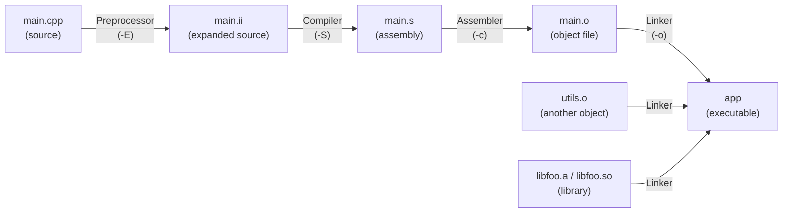
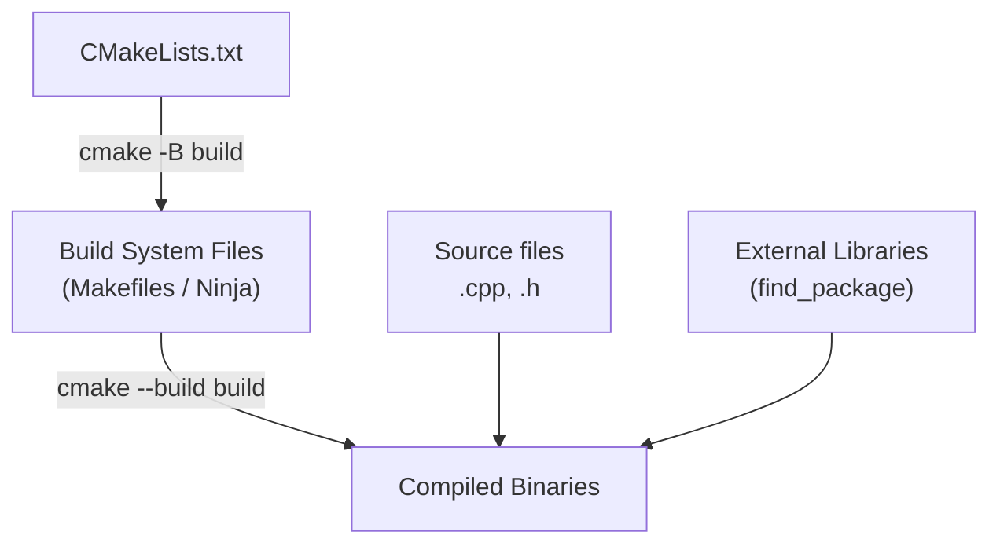
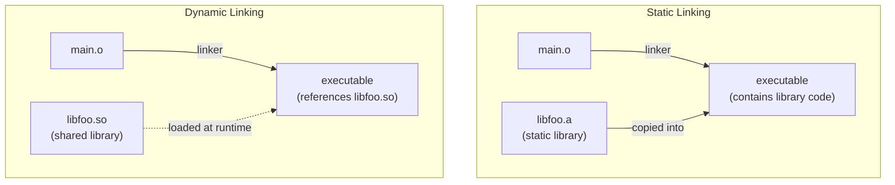

# Tooling, Libraries & the Build Ecosystem

> The C++ language is only half the story — without understanding compiler stages, build systems, debugging tools, and the library ecosystem, you'll spend more time fighting toolchain errors than writing code.

## Table of Contents
- [Core Concepts](#core-concepts)
- [Code Examples](#code-examples)
- [Common Pitfalls](#common-pitfalls)
- [Key Takeaways](#key-takeaways)
- [Exercises](#exercises)

## Core Concepts

### Compiler Stages — From Source to Executable

#### What

When you run `g++ -o app main.cpp`, the compiler doesn't do one thing — it does four, in sequence: **preprocessing**, **compilation**, **assembly**, and **linking**. Each stage takes a specific input, produces a specific output, and can fail in its own characteristic way. Understanding this pipeline is the difference between staring at a cryptic error for an hour and diagnosing it in ten seconds.

#### How



**Stage 1 — Preprocessing (`g++ -E`).** The preprocessor handles directives: `#include` (textual copy-paste of header files), `#define` (macro expansion), `#ifdef`/`#ifndef` (conditional compilation), and `#pragma`. The output is a single, massive translation unit with all headers inlined. You can inspect it with `g++ -E main.cpp -o main.ii`. This is why including large headers (like `<iostream>`) adds thousands of lines — the preprocessor literally pastes the entire header contents.

**Stage 2 — Compilation (`g++ -S`).** The compiler takes the preprocessed source and translates it to assembly language for the target architecture. This is where syntax errors, type errors, and template instantiation errors appear. The output is a `.s` file containing human-readable assembly. Optimization happens here (`-O1`, `-O2`, `-O3`).

**Stage 3 — Assembly (`g++ -c`).** The assembler converts the assembly language to machine code, producing an **object file** (`.o` on Linux/macOS, `.obj` on Windows). Each `.cpp` file becomes one `.o` file. Object files contain machine code, but with unresolved references — calls to functions defined in other files are left as placeholders (symbols).

**Stage 4 — Linking (`g++ -o`).** The linker takes all object files and libraries, resolves every unresolved symbol (matching each function call to its definition), and produces the final executable. This is where "undefined reference to `foo()`" errors appear — the linker found a call to `foo()` but no object file or library provided a definition.

#### Why It Matters

Each stage has its own failure mode, and the error messages are radically different:

| Stage | Typical Error | Diagnosis |
|---|---|---|
| Preprocessor | `fatal error: 'foo.h' file not found` | Wrong `-I` include path, missing header |
| Compiler | `error: 'x' was not declared in this scope` | Syntax error, missing include, typo |
| Compiler | `error: no matching function for call to...` | Wrong argument types, missing overload |
| Linker | `undefined reference to 'foo()'` | Missing `.o` file, forgot to link library, function declared but not defined |
| Linker | `multiple definition of 'foo'` | ODR violation — function defined in a header without `inline` |

The linker errors are the ones that trip people up, because they look nothing like compiler errors. They report mangled symbol names, reference object files you didn't know about, and give no line numbers. Once you understand that the linker's job is to stitch together separately compiled pieces, these errors become logical.

### Debugging Symbols and Build Types

#### What

**Debugging symbols** are metadata embedded in the compiled binary that map machine code addresses back to source file names, line numbers, function names, and variable names. Without them, a debugger can only show you raw memory addresses. With them, you see your actual source code, step through lines, and inspect variables by name.

#### How

The `-g` flag tells the compiler to emit debugging information in the DWARF format (on Linux/macOS) or PDB format (on Windows). This metadata is stored in a separate section of the object file and executable — it increases binary size but does not affect the actual machine code or runtime performance (unless you also disable optimizations).

The two standard build configurations:

| Configuration | Flags | Purpose |
|---|---|---|
| **Debug** | `-g -O0` | Full debug symbols, no optimization. Variables aren't optimized away, code flow matches source exactly. Use for development. |
| **Release** | `-O2 -DNDEBUG` | Full optimization, no debug symbols (usually), `assert()` disabled. Use for production. |

The `-O0` flag in debug builds is crucial: with optimizations enabled, the compiler reorders, inlines, and eliminates code, making the debugger's line-by-line stepping confusing or impossible. A variable might be "optimized out" — the debugger literally can't show you its value.

You can combine `-g` with optimization flags (e.g., `-g -O2`) for profiling — you get debug symbols for stack traces but the code is still optimized. This is useful for production crash analysis.

#### Why It Matters

When your program crashes in production, you get a core dump or a stack trace. Without debug symbols, that stack trace is a wall of hexadecimal addresses: `0x7f3a2b...`, `0x7f3a2c...`. With debug symbols, it becomes: `main.cpp:42 in process_data()`, `utils.cpp:17 in parse_input()`. The difference between "I can debug this in five minutes" and "I have no idea what happened" is the `-g` flag.

### Reading Stack Traces and Sanitizer Output

#### What

A **stack trace** (or backtrace) shows the chain of function calls that led to a crash or error, from the most recent call back to `main()`. **Sanitizers** are compiler-instrumented runtime checks that detect bugs like memory corruption, data races, and undefined behavior — and they produce detailed diagnostic output when a violation is found.

#### How

A typical stack trace from a segfault (with debug symbols) looks like:

```
Program received signal SIGSEGV, Segmentation fault.
#0  0x00005555555551a3 in process_item (item=0x0) at engine.cpp:42
#1  0x0000555555555237 in run_pipeline (data=...) at pipeline.cpp:78
#2  0x00005555555552f1 in main () at main.cpp:15
```

Read it **top to bottom**: frame `#0` is where the crash happened (dereferencing a null pointer at `engine.cpp:42`), frame `#1` is the caller, and so on back to `main()`. The key information is the file name, line number, and function arguments — they tell you exactly where and why.

The three essential sanitizers:

| Sanitizer | Flag | Detects |
|---|---|---|
| **AddressSanitizer (ASan)** | `-fsanitize=address` | Buffer overflow, use-after-free, use-after-scope, double-free, memory leaks |
| **UndefinedBehaviorSanitizer (UBSan)** | `-fsanitize=undefined` | Signed integer overflow, null pointer dereference, misaligned access, shift out of bounds |
| **ThreadSanitizer (TSan)** | `-fsanitize=thread` | Data races, lock-order inversions |

ASan output looks like this:

```
==12345==ERROR: AddressSanitizer: heap-use-after-free on address 0x602000000010
READ of size 4 at 0x602000000010 thread T0
    #0 0x555555555203 in process() main.cpp:18
    #1 0x555555555267 in main main.cpp:25

0x602000000010 is located 0 bytes inside of 4-byte region [0x602000000010,0x602000000014)
freed by thread T0 here:
    #0 0x7ffff7a8e617 in operator delete(void*) (libasan.so)
    #1 0x5555555551c3 in cleanup() main.cpp:12

previously allocated by thread T0 here:
    #0 0x7ffff7a8d458 in operator new(unsigned long) (libasan.so)
    #1 0x555555555189 in init() main.cpp:7
```

ASan tells you three things: (1) what went wrong (use-after-free), (2) where the bad access happened (`main.cpp:18`), and (3) where the memory was freed (`main.cpp:12`) and originally allocated (`main.cpp:7`). This level of detail makes memory bugs trivial to diagnose.

#### Why It Matters

In C and C++, memory bugs and undefined behavior are silent by default — the program doesn't crash, it just does something unpredictable. Sanitizers make these bugs loud and immediate. Compiling your test suite with `-fsanitize=address,undefined` should be a non-negotiable part of your development workflow. It catches bugs that no amount of code review or manual testing will find.

### CMake — The De Facto Build System

#### What

**CMake** is a meta-build system: it doesn't compile your code directly. Instead, it generates build files for a native build system (Makefiles, Ninja files, Visual Studio projects) from a declarative `CMakeLists.txt` file. It handles compiler detection, dependency management, platform differences, and build configuration — all the things that are painful to do manually.

#### How

A CMake project has a `CMakeLists.txt` at the root. The fundamental building blocks are **targets** — executables or libraries that CMake knows how to build.



The core commands in `CMakeLists.txt`:

| Command | Purpose |
|---|---|
| `cmake_minimum_required(VERSION 3.16)` | Set the minimum CMake version for compatibility |
| `project(MyApp LANGUAGES CXX)` | Name the project, specify language(s) |
| `set(CMAKE_CXX_STANDARD 17)` | Set the C++ standard (non-negotiable — always set this) |
| `add_executable(app src/main.cpp src/utils.cpp)` | Create an executable target from source files |
| `add_library(mylib src/lib.cpp)` | Create a library target (static by default) |
| `target_link_libraries(app PRIVATE mylib)` | Link a library to a target |
| `target_include_directories(app PRIVATE src/)` | Add include paths for a target |
| `find_package(GTest REQUIRED)` | Find an installed external library |

The **PRIVATE / PUBLIC / INTERFACE** keywords on `target_link_libraries` and `target_include_directories` control transitive propagation:

- **PRIVATE**: only this target uses the dependency
- **PUBLIC**: this target and anything that links to it
- **INTERFACE**: only things that link to this target (not this target itself — used for header-only libraries)

The standard workflow:

```bash
mkdir build && cd build
cmake ..              # generate build files (or: cmake -B build -S .)
cmake --build .       # compile (or: make -j$(nproc), or: ninja)
ctest                 # run tests (if configured)
```

#### Why It Matters

Every major C++ project uses CMake — LLVM, Qt, OpenCV, gtest, Boost (partially), and thousands of others. If you can read and write `CMakeLists.txt`, you can build and contribute to any of them. If you can't, you'll be blocked before you write a single line of C++. CMake also handles the hard problems: cross-platform compilation, finding system libraries, and managing complex dependency graphs between dozens of targets.

### Static vs Dynamic Linking

#### What

When your program uses a library, the linker must resolve calls to that library's functions. There are two approaches: **static linking** (copy the library's code into your executable at build time) and **dynamic linking** (leave a reference to a shared library that's loaded at runtime).

#### How



| Aspect | Static (`libfoo.a`) | Dynamic (`libfoo.so` / `.dylib` / `.dll`) |
|---|---|---|
| **Linking time** | Build time — code is copied into the executable | Runtime — library is loaded when the program starts |
| **Binary size** | Larger — includes all library code | Smaller — just references the shared library |
| **Deployment** | Self-contained — no external dependencies | Must ship the `.so`/`.dll` alongside the executable (or install it system-wide) |
| **Updates** | Must rebuild to pick up library fixes | Just replace the `.so` — the executable picks up changes automatically |
| **Performance** | Slightly faster — no indirection, better inlining opportunities | Slight overhead from PLT/GOT indirection on function calls |
| **License implications** | Statically linking a GPL library makes your entire binary GPL | Dynamically linking a LGPL library lets you keep your code proprietary |

To create and use a static library:

```bash
# Compile source files to object files
g++ -c foo.cpp -o foo.o
g++ -c bar.cpp -o bar.o

# Archive object files into a static library
ar rcs libmylib.a foo.o bar.o

# Link the static library into an executable
g++ main.cpp -L. -lmylib -o app
```

To create and use a dynamic library:

```bash
# Compile with position-independent code (required for shared libraries)
g++ -fPIC -c foo.cpp -o foo.o
g++ -fPIC -c bar.cpp -o bar.o

# Create the shared library
g++ -shared -o libmylib.so foo.o bar.o

# Link against it (the linker records the dependency, but doesn't copy code)
g++ main.cpp -L. -lmylib -o app

# At runtime, the dynamic linker must find libmylib.so
# (via LD_LIBRARY_PATH, /etc/ld.so.conf, or rpath)
```

#### Why It Matters

The choice between static and dynamic linking affects deployment, binary size, update strategy, and legal obligations. Most C++ projects use a mix: small, tightly-coupled internal libraries are linked statically, while large external libraries (OpenSSL, SQLite, Qt) are linked dynamically. Understanding this distinction also explains why "works on my machine" failures happen — the dynamic linker can't find the `.so` file on the target machine.

### Licensing — What You Can and Can't Do

#### What

Open-source licenses define the legal terms under which you can use, modify, and distribute someone else's code. Getting this wrong can force you to open-source your proprietary code or face legal liability. The four licenses you'll encounter most often in the C++ ecosystem:

#### How

| License | Permits | Requires | Key Restriction |
|---|---|---|---|
| **MIT** | Use, modify, distribute freely (commercial or not) | Include the original copyright notice | None — the most permissive |
| **Apache 2.0** | Same as MIT, plus explicit patent grant | Include copyright notice, state changes, include the license text | None significant — like MIT but with patent protection |
| **LGPL** | Use in proprietary software via dynamic linking | If you modify the LGPL library itself, publish those modifications | Static linking may require you to provide object files so users can re-link |
| **GPL** | Use, modify, distribute | Any binary containing GPL code must be distributed under GPL — all source must be available | "Viral" — if your code links to a GPL library, your entire codebase becomes GPL |

The critical distinction is between **permissive** licenses (MIT, Apache 2.0) and **copyleft** licenses (GPL, LGPL). Permissive licenses let you do almost anything as long as you include the copyright notice. Copyleft licenses require that derivative works also be open-source.

#### Why It Matters

Accidentally including a GPL library in a proprietary commercial product is a legal disaster — you'd be required to release your entire source code under GPL, or face a lawsuit. This is not theoretical; it has happened. Before adding any third-party dependency, check its license. MIT and Apache 2.0 are safe for any use. LGPL is safe if you dynamically link. GPL requires your entire product to be GPL.

Most C++ standard library implementations (libstdc++, libc++) have special runtime exceptions that allow linking without GPL obligations, even though GCC itself is GPL. This is intentional — the GPL runtime exception exists specifically so that compiling with GCC doesn't make your code GPL.

### Boost — The STL Incubator

#### What

**Boost** is a collection of peer-reviewed, high-quality C++ libraries that serve as a testing ground for features that often get adopted into the C++ standard library. Many standard library features — `shared_ptr`, `optional`, `variant`, `filesystem`, `regex`, `any` — started life as Boost libraries. Boost is to C++ what Apache Commons is to Java: a curated set of production-quality utilities that fill gaps in the standard library.

#### How

Boost contains over 160 libraries. Some are header-only (just `#include` them), while others require compilation (you link against pre-built `.a`/`.so` files). Key libraries:

| Boost Library | Now In Standard | Purpose |
|---|---|---|
| `boost::shared_ptr` | `std::shared_ptr` (C++11) | Shared ownership smart pointer |
| `boost::optional` | `std::optional` (C++17) | Nullable value type |
| `boost::filesystem` | `std::filesystem` (C++17) | Cross-platform file system operations |
| `boost::variant` | `std::variant` (C++17) | Type-safe union |
| `boost::any` | `std::any` (C++17) | Type-erased container for any value |
| `boost::asio` | Not yet standardized | Asynchronous I/O, networking, timers |
| `boost::program_options` | Not standardized | Command-line argument parsing |
| `boost::serialization` | Not standardized | Object serialization/deserialization |
| `boost::test` | Not standardized | Unit testing framework (alternative to gtest) |

Installing Boost varies by platform:

```bash
# macOS (Homebrew)
brew install boost

# Ubuntu/Debian
sudo apt install libboost-all-dev

# Using with CMake
find_package(Boost REQUIRED COMPONENTS filesystem system)
target_link_libraries(app PRIVATE Boost::filesystem Boost::system)
```

#### Why It Matters

You will encounter Boost in existing codebases. Many C++ projects written before C++17 use `boost::optional`, `boost::filesystem`, and `boost::variant` — understanding that these are now in the standard library helps you modernize legacy code. Boost.Asio is still the dominant C++ networking library (the Networking TS is based on it), and Boost.Test and Boost.Program_options have no direct standard library equivalent.

More importantly, reading Boost source code is one of the best ways to learn advanced C++ — it's written by some of the best C++ programmers in the world, peer-reviewed, and documented extensively.

### Google Test (gtest) & Google Mock (gmock)

#### What

**Google Test** (gtest) is the de facto unit testing framework for C++. It provides macros for writing test cases, assertions, test fixtures, parameterized tests, and death tests (testing that code crashes as expected). **Google Mock** (gmock) is its companion mocking framework, used to create mock objects for dependency injection in tests.

#### How

A gtest test file looks like this:

```cpp
#include <gtest/gtest.h>

// TEST(TestSuiteName, TestCaseName)
TEST(MathTest, AdditionWorks) {
    EXPECT_EQ(2 + 2, 4);        // non-fatal: test continues if this fails
    ASSERT_NE(nullptr, ptr);     // fatal: test stops immediately if this fails
}
```

Key assertion macros:

| Macro | Checks | Fatality |
|---|---|---|
| `EXPECT_EQ(a, b)` | `a == b` | Non-fatal (test continues) |
| `ASSERT_EQ(a, b)` | `a == b` | Fatal (test stops) |
| `EXPECT_TRUE(cond)` | `cond` is true | Non-fatal |
| `EXPECT_THROW(stmt, exc)` | `stmt` throws `exc` | Non-fatal |
| `EXPECT_NEAR(a, b, eps)` | `|a - b| <= eps` | Non-fatal (for floating-point) |
| `ASSERT_DEATH(stmt, regex)` | `stmt` crashes with output matching `regex` | Fatal |

**Test fixtures** let you share setup/teardown code across tests:

```cpp
class DatabaseTest : public ::testing::Test {
protected:
    void SetUp() override {
        db = open_test_database();
    }
    void TearDown() override {
        close_database(db);
    }
    Database* db = nullptr;
};

TEST_F(DatabaseTest, InsertSucceeds) {
    EXPECT_TRUE(db->insert("key", "value"));
}
```

**gmock** lets you create mock classes to isolate the unit under test:

```cpp
class MockLogger : public Logger {
public:
    MOCK_METHOD(void, log, (std::string_view message), (override));
    MOCK_METHOD(int, error_count, (), (const, override));
};
```

Integrating gtest with CMake:

```cmake
find_package(GTest REQUIRED)
add_executable(tests test_math.cpp test_utils.cpp)
target_link_libraries(tests PRIVATE GTest::gtest_main GTest::gmock)
include(GoogleTest)
gtest_discover_tests(tests)
```

#### Why It Matters

Testing is not optional in professional C++ development. gtest is the industry standard — used by Google, LLVM, Chromium, TensorFlow, and thousands of other projects. Knowing gtest means you can contribute to any of them and write reliable code in your own projects. gmock is essential for testing code with external dependencies (databases, network, file systems) — you mock the dependency to test the logic in isolation.

The `EXPECT_` vs `ASSERT_` distinction matters in practice: `ASSERT_` stops the test immediately (useful when a failed check means subsequent checks would crash), while `EXPECT_` continues to report all failures (useful for diagnosing multiple issues at once).

## Code Examples

### Inspecting Compiler Stages Manually

```cpp
// save as: stages_demo.cpp
// This example is meant to be compiled step-by-step to observe each stage.
// The code itself is trivial — the focus is on the build commands.

#include <iostream>

// A simple function in another "module" (imagine this in a separate .cpp)
int compute(int x) {
    return x * x + 1;
}

int main() {
    const int result = compute(5);
    std::cout << "Result: " << result << '\n';
    return 0;
}

// --- Build commands to inspect each stage ---
//
// 1. Preprocessing — see all headers expanded:
//    g++ -E stages_demo.cpp -o stages_demo.ii
//    (stages_demo.ii will be ~30,000 lines — all of <iostream> pasted in)
//
// 2. Compilation — generate assembly:
//    g++ -S -std=c++17 stages_demo.cpp -o stages_demo.s
//    (open stages_demo.s to see x86-64 assembly instructions)
//
// 3. Assembly — generate object file:
//    g++ -c -std=c++17 stages_demo.cpp -o stages_demo.o
//    (stages_demo.o is a binary file; inspect symbols with: nm stages_demo.o)
//
// 4. Linking — produce the final executable:
//    g++ stages_demo.o -o stages_demo
//    (or all at once: g++ -std=c++17 stages_demo.cpp -o stages_demo)
//
// 5. Debug build — add symbols for gdb/lldb:
//    g++ -g -O0 -std=c++17 stages_demo.cpp -o stages_demo_debug
//
// 6. Release build — optimize, strip debug info:
//    g++ -O2 -DNDEBUG -std=c++17 stages_demo.cpp -o stages_demo_release
//
// 7. Sanitizer build — catch memory bugs at runtime:
//    g++ -g -O1 -fsanitize=address,undefined -std=c++17 stages_demo.cpp -o stages_demo_asan
```

### A Complete CMake Project

```cmake
# CMakeLists.txt — a realistic multi-target project
#
# Project structure:
#   project_root/
#   ├── CMakeLists.txt        (this file)
#   ├── src/
#   │   ├── main.cpp
#   │   ├── engine.cpp
#   │   └── engine.h
#   ├── tests/
#   │   └── test_engine.cpp
#   └── build/                (generated by cmake)

cmake_minimum_required(VERSION 3.16)

# Name the project and specify C++ as the language.
# VERSION is useful for packaging and install targets.
project(KVStore VERSION 1.0 LANGUAGES CXX)

# Set the C++ standard globally for all targets.
# REQUIRED means cmake will error if the compiler doesn't support C++17.
set(CMAKE_CXX_STANDARD 17)
set(CMAKE_CXX_STANDARD_REQUIRED ON)
set(CMAKE_CXX_EXTENSIONS OFF)  # Disable GNU extensions — use strict ISO C++17

# --- Library target ---
# This creates a static library from engine.cpp.
# Other targets can link against it without recompiling engine.cpp.
add_library(engine STATIC src/engine.cpp)

# PUBLIC means: anything that links to 'engine' also gets src/ in its include path.
# This is how headers propagate transitively through the dependency graph.
target_include_directories(engine PUBLIC src/)

# Add warning flags. PRIVATE because these are only for compiling this target.
target_compile_options(engine PRIVATE -Wall -Wextra -Wpedantic)

# --- Executable target ---
add_executable(kvstore src/main.cpp)

# Link the engine library. PRIVATE because main.cpp uses engine,
# but nothing links to kvstore (it's the final executable).
target_link_libraries(kvstore PRIVATE engine)
target_compile_options(kvstore PRIVATE -Wall -Wextra -Wpedantic)

# --- Test target (optional, enabled with -DBUILD_TESTS=ON) ---
option(BUILD_TESTS "Build the unit tests" OFF)

if(BUILD_TESTS)
    enable_testing()
    find_package(GTest REQUIRED)

    add_executable(tests tests/test_engine.cpp)
    target_link_libraries(tests PRIVATE engine GTest::gtest_main)
    target_compile_options(tests PRIVATE -Wall -Wextra -Wpedantic)

    # Register tests so 'ctest' can discover and run them
    include(GoogleTest)
    gtest_discover_tests(tests)
endif()

# --- Build instructions ---
# mkdir build && cd build
# cmake .. -DBUILD_TESTS=ON       # generate with tests enabled
# cmake --build .                  # compile all targets
# ctest --output-on-failure        # run tests
```

### Writing Tests with gtest and gmock

```cpp
// test_calculator.cpp
// A self-contained gtest example demonstrating assertions, fixtures, and mocking.
//
// Compile with:
//   g++ -std=c++17 test_calculator.cpp -lgtest -lgtest_main -lgmock -pthread -o test_calculator
//   ./test_calculator

#include <gmock/gmock.h>
#include <gtest/gtest.h>

#include <cmath>
#include <stdexcept>
#include <string>
#include <vector>

// ============================================================
// A simple Calculator class to test
// ============================================================

class Calculator {
public:
    double add(double a, double b) const { return a + b; }
    double divide(double a, double b) const {
        if (b == 0.0) {
            throw std::invalid_argument("Division by zero");
        }
        return a / b;
    }

    // Accumulates results in history
    void compute_and_store(double a, double b) {
        history_.push_back(add(a, b));
    }

    const std::vector<double>& history() const { return history_; }

private:
    std::vector<double> history_;
};

// ============================================================
// Basic tests — TEST(SuiteName, TestName)
// ============================================================

TEST(CalculatorTest, AddPositiveNumbers) {
    const Calculator calc;
    EXPECT_DOUBLE_EQ(calc.add(2.0, 3.0), 5.0);
}

TEST(CalculatorTest, AddNegativeNumbers) {
    const Calculator calc;
    EXPECT_DOUBLE_EQ(calc.add(-1.0, -2.0), -3.0);
}

TEST(CalculatorTest, DivideByZeroThrows) {
    const Calculator calc;
    // EXPECT_THROW checks that the statement throws the specified exception type
    EXPECT_THROW(calc.divide(1.0, 0.0), std::invalid_argument);
}

TEST(CalculatorTest, DivideNormal) {
    const Calculator calc;
    // EXPECT_NEAR is essential for floating-point comparisons with tolerance
    EXPECT_NEAR(calc.divide(10.0, 3.0), 3.3333, 0.001);
}

// ============================================================
// Test fixture — shared setup/teardown for related tests
// ============================================================

class CalculatorHistoryTest : public ::testing::Test {
protected:
    // SetUp runs before each TEST_F in this fixture
    void SetUp() override {
        calc_.compute_and_store(1.0, 2.0);  // 3.0
        calc_.compute_and_store(4.0, 5.0);  // 9.0
    }

    // TearDown runs after each TEST_F (not strictly needed here — RAII handles cleanup)
    Calculator calc_;
};

// Note: TEST_F (not TEST) — the first argument must be the fixture class name
TEST_F(CalculatorHistoryTest, HistoryHasTwoEntries) {
    ASSERT_EQ(calc_.history().size(), 2u);
}

TEST_F(CalculatorHistoryTest, HistoryValuesCorrect) {
    EXPECT_DOUBLE_EQ(calc_.history()[0], 3.0);
    EXPECT_DOUBLE_EQ(calc_.history()[1], 9.0);
}

// ============================================================
// gmock example — mocking a dependency
// ============================================================

// Suppose Calculator depends on a Logger interface for audit logging.
// We mock the logger to test Calculator in isolation.

class Logger {
public:
    virtual ~Logger() = default;
    virtual void log(std::string_view message) = 0;
    virtual int message_count() const = 0;
};

class MockLogger : public Logger {
public:
    MOCK_METHOD(void, log, (std::string_view message), (override));
    MOCK_METHOD(int, message_count, (), (const, override));
};

// A version of Calculator that logs operations
class AuditableCalculator {
public:
    explicit AuditableCalculator(Logger& logger) : logger_{logger} {}

    double add(double a, double b) {
        const double result = a + b;
        logger_.log("add operation performed");
        return result;
    }

private:
    Logger& logger_;  // non-owning reference — we don't own the logger
};

TEST(AuditableCalculatorTest, AddLogsMessage) {
    MockLogger mock_logger;

    // Set expectation: log() must be called exactly once with any argument
    EXPECT_CALL(mock_logger, log(::testing::_)).Times(1);

    AuditableCalculator calc{mock_logger};
    const double result = calc.add(2.0, 3.0);

    EXPECT_DOUBLE_EQ(result, 5.0);
    // Mock expectations are verified automatically when mock_logger is destroyed
}

TEST(AuditableCalculatorTest, AddLogsSpecificMessage) {
    MockLogger mock_logger;

    // Set expectation: log() must be called with a specific message
    EXPECT_CALL(mock_logger, log(::testing::HasSubstr("add")))
        .Times(1);

    AuditableCalculator calc{mock_logger};
    calc.add(1.0, 1.0);
}
```

### Using Sanitizers to Catch Bugs

```cpp
// sanitizer_demo.cpp
// This program has deliberate bugs that sanitizers will catch.
// Compile and run with each sanitizer to see the diagnostic output.
//
// AddressSanitizer:
//   g++ -g -O1 -fsanitize=address -std=c++17 sanitizer_demo.cpp -o demo_asan
//   ./demo_asan
//
// UndefinedBehaviorSanitizer:
//   g++ -g -O1 -fsanitize=undefined -std=c++17 sanitizer_demo.cpp -o demo_ubsan
//   ./demo_ubsan

#include <iostream>
#include <memory>
#include <vector>

// Bug 1: Heap buffer overflow (caught by ASan)
void heap_overflow_demo() {
    auto data = std::make_unique<int[]>(10);

    // Writing one past the end of the allocated array.
    // This is undefined behavior — it may silently corrupt adjacent memory
    // or crash. ASan will catch it immediately.
    data[10] = 999;  // BUG: valid indices are 0-9

    std::cout << "heap_overflow_demo completed (ASan should catch this)\n";
}

// Bug 2: Use-after-free (caught by ASan)
void use_after_free_demo() {
    int* ptr = new int(42);
    delete ptr;

    // Accessing memory after it has been freed.
    // Without ASan, this might "work" (the old value might still be there),
    // giving a false sense of correctness.
    std::cout << "Dangling value: " << *ptr << '\n';  // BUG: use-after-free
}

// Bug 3: Signed integer overflow (caught by UBSan)
void integer_overflow_demo() {
    int x = 2'147'483'647;  // INT_MAX

    // Signed integer overflow is undefined behavior in C++.
    // Most compilers wrap around silently, but the standard says anything
    // can happen. UBSan catches this.
    int y = x + 1;  // BUG: signed overflow

    std::cout << "INT_MAX + 1 = " << y << '\n';
}

int main() {
    // Uncomment one at a time to see the sanitizer output:
    // heap_overflow_demo();
    // use_after_free_demo();
    // integer_overflow_demo();

    std::cout << "Select a demo by uncommenting in main()\n";
    return 0;
}
```

### Boost.Asio — Minimal Timer Example

```cpp
// boost_asio_timer.cpp
// Demonstrates Boost.Asio with a simple asynchronous timer.
//
// Compile with:
//   g++ -std=c++17 boost_asio_timer.cpp -lboost_system -pthread -o timer
//
// On macOS with Homebrew:
//   g++ -std=c++17 -I/opt/homebrew/include -L/opt/homebrew/lib \
//       boost_asio_timer.cpp -lboost_system -pthread -o timer

#include <boost/asio.hpp>
#include <iostream>

int main() {
    // io_context is the core of Boost.Asio — it runs the event loop.
    // All asynchronous operations are submitted to this object.
    boost::asio::io_context io;

    // Create a timer that expires 2 seconds from now
    boost::asio::steady_timer timer{io, std::chrono::seconds(2)};

    std::cout << "Starting 2-second timer...\n";

    // async_wait submits an asynchronous operation to the io_context.
    // The lambda is called when the timer expires (or is cancelled).
    timer.async_wait([](const boost::system::error_code& ec) {
        if (!ec) {
            std::cout << "Timer expired! (2 seconds elapsed)\n";
        } else {
            std::cerr << "Timer error: " << ec.message() << '\n';
        }
    });

    // io.run() blocks until all asynchronous operations complete.
    // Without this call, the program would exit immediately —
    // async_wait just *schedules* the callback, it doesn't block.
    io.run();

    std::cout << "Done.\n";
    return 0;
}
```

## Common Pitfalls

### Forgetting to link a library — "undefined reference"

```cpp
// BAD — compiles but fails at the link stage
// You wrote:
//   g++ -std=c++17 main.cpp -o app
// But main.cpp calls functions from engine.cpp, which isn't compiled or linked.
//
// Error:
//   /usr/bin/ld: main.o: undefined reference to 'Engine::process()'
//   collect2: error: ld returned 1 exit status

// The compiler stage succeeds (main.cpp compiles to main.o), but the linker
// can't find the definition of Engine::process(). This isn't a typo or syntax
// error — it's a missing translation unit.
```

```cpp
// GOOD — compile all source files and link them together
//   g++ -std=c++17 main.cpp engine.cpp -o app
//
// Or with separate compilation (better for large projects):
//   g++ -std=c++17 -c main.cpp -o main.o
//   g++ -std=c++17 -c engine.cpp -o engine.o
//   g++ main.o engine.o -o app
//
// With CMake (the right approach for any non-trivial project):
//   add_executable(app main.cpp engine.cpp)
```

The fix is always the same: ensure every function that's *declared* somewhere (via a header) is also *defined* somewhere (in a `.cpp` file that's compiled and linked into the final binary). "Undefined reference" means the linker found the declaration but not the definition.

### Defining a non-inline function in a header — ODR violation

```cpp
// BAD — function defined in a header included by multiple .cpp files
// utils.h
#pragma once

// This function is defined (not just declared) in the header.
// If two .cpp files include utils.h, both get a definition of helper(),
// and the linker sees two definitions — a violation of the One Definition Rule.
int helper(int x) {
    return x * 2;
}
```

```cpp
// GOOD — three valid approaches:

// Option 1: Declare in header, define in .cpp
// utils.h
#pragma once
int helper(int x);  // declaration only

// utils.cpp
#include "utils.h"
int helper(int x) { return x * 2; }  // single definition

// Option 2: Mark as inline (allows multiple identical definitions)
// utils.h
#pragma once
inline int helper(int x) {
    return x * 2;
}

// Option 3: Use constexpr (implicitly inline)
// utils.h
#pragma once
constexpr int helper(int x) {
    return x * 2;
}
```

The One Definition Rule (ODR) says: across all translation units, every non-inline function and variable must have exactly one definition. Headers are included in multiple translation units, so any non-inline definition in a header creates multiple definitions. The `inline` keyword doesn't mean "inline the function call" — it means "this definition may appear in multiple translation units, and the linker should merge them."

### Misusing CMake's PUBLIC/PRIVATE/INTERFACE

```cmake
# BAD — making everything PUBLIC "just to be safe"
add_library(mylib src/lib.cpp)
target_include_directories(mylib PUBLIC src/ third_party/ internal/)
target_link_libraries(mylib PUBLIC heavy_dependency)

# This makes every consumer of mylib inherit all include paths and dependencies,
# even if they don't need them. This increases compile times, pollutes the
# namespace, and creates unnecessary coupling.
```

```cmake
# GOOD — use PRIVATE for implementation details, PUBLIC only for interface
add_library(mylib src/lib.cpp)

# PUBLIC: consumers need src/ because mylib's headers are there
target_include_directories(mylib PUBLIC src/)

# PRIVATE: internal/ and third_party/ are implementation details
target_include_directories(mylib PRIVATE internal/ third_party/)

# PRIVATE: heavy_dependency is used only inside mylib's .cpp files,
# not in its public headers. Consumers don't need to link against it.
target_link_libraries(mylib PRIVATE heavy_dependency)
```

The rule of thumb: if a dependency appears in your library's **public headers** (the ones consumers `#include`), it's PUBLIC. If it's only used in your `.cpp` files, it's PRIVATE. Getting this right keeps build times low and dependency graphs clean.

### Ignoring license compatibility

```
BAD — using a GPL library in a proprietary product without realizing the implications.
You find a useful C++ library on GitHub, see that it's "open source," and link it
into your commercial product. But the library is GPL-licensed, which requires you to
release your entire product's source code under GPL.

"Open source" does not mean "free to use however you want." The license terms vary
wildly between MIT (do anything), Apache 2.0 (do anything + patent protection),
LGPL (dynamic linking OK, static linking has conditions), and GPL (your entire
binary becomes GPL).
```

```
GOOD — check the license BEFORE adding a dependency.
1. Look for a LICENSE or COPYING file in the repository root.
2. If it's MIT or Apache 2.0 → safe for any use (commercial, proprietary, etc.).
3. If it's LGPL → safe if you dynamically link. Static linking may require
   providing object files so users can re-link against a modified library.
4. If it's GPL → your entire binary must be GPL. If that's not acceptable,
   find an alternative library with a permissive license.
5. Document every third-party dependency and its license in your project.
```

### Not enabling sanitizers during development

```bash
# BAD — developing without sanitizers, relying on manual testing to catch memory bugs
g++ -std=c++17 -O2 app.cpp -o app
./app
# "It works!" — but there's a use-after-free that happens to not crash on your machine.
# It will crash on a different machine, or with a different input, or in production.
```

```bash
# GOOD — always develop and test with sanitizers enabled
# Debug build with ASan + UBSan:
g++ -std=c++17 -g -O1 -fsanitize=address,undefined -fno-omit-frame-pointer app.cpp -o app
./app
# ASan catches the use-after-free immediately with a clear diagnostic.

# In CMake, add a sanitizer build type:
# cmake -DCMAKE_CXX_FLAGS="-fsanitize=address,undefined -fno-omit-frame-pointer" ..
```

The `-fno-omit-frame-pointer` flag ensures sanitizer stack traces include every frame — without it, the compiler may optimize away frame pointers, making stack traces incomplete.

## Key Takeaways

- **The four compiler stages — preprocessing, compilation, assembly, linking — each fail in characteristic ways.** "Undefined reference" is a linker error (missing definition), not a compiler error. Understanding which stage produced an error immediately narrows the diagnosis.
- **Compile with `-g -O0` for debugging, `-O2 -DNDEBUG` for release, and `-fsanitize=address,undefined` for every test run.** Sanitizers catch memory bugs and undefined behavior that no amount of manual testing will find. They should be a non-negotiable part of your development workflow.
- **CMake is the language of C++ build systems.** Learn `add_executable`, `add_library`, `target_link_libraries`, `target_include_directories`, and `find_package`. Understand PRIVATE vs PUBLIC. This knowledge transfers to every C++ project you'll ever work on.
- **Check the license before adding any dependency.** MIT and Apache 2.0 are safe for any use. GPL requires your entire binary to be GPL. LGPL is safe with dynamic linking. Getting this wrong has real legal consequences.
- **gtest is the industry-standard testing framework.** Use `EXPECT_` macros for non-fatal assertions and `ASSERT_` for fatal ones. Use test fixtures for shared setup. Use gmock to isolate units from their dependencies.

## Exercises

1. **Compiler stage identification.** For each error message below, identify which compiler stage produced it and explain how you would fix it:
   - `fatal error: 'config.h' file not found`
   - `undefined reference to 'Database::connect()'`
   - `multiple definition of 'int global_counter'`
   - `error: no matching function for call to 'sort(int, int)'`

2. **Build a CMake project.** Create a `CMakeLists.txt` for a project with the following structure: a `mathlib` static library (containing `math_utils.cpp` with basic arithmetic functions), a `main` executable that uses `mathlib`, and a `tests` executable that uses both `mathlib` and gtest. The tests target should only be built when `-DBUILD_TESTS=ON` is passed to cmake.

3. **Sanitizer investigation.** Write a C++ program that contains: (a) a heap buffer overflow, (b) a use-after-free, and (c) a signed integer overflow. Compile it with AddressSanitizer and UndefinedBehaviorSanitizer separately. Run each and compare the diagnostic output. Which sanitizer catches which bug?

4. **License audit.** You are building a proprietary commercial application. You want to use the following libraries: nlohmann/json (MIT), OpenSSL (Apache 2.0), Qt (LGPL/commercial), and FFmpeg (GPL/LGPL depending on configuration). For each library, determine: (a) can you use it in a proprietary product? (b) do you need to dynamically link? (c) what obligations do you have?

5. **gtest fixture.** Write a gtest test fixture for a `StringBuffer` class that has `append(std::string_view)`, `size()`, and `to_string()` methods. The fixture should create a `StringBuffer` in `SetUp()` with some initial content. Write at least three tests using `TEST_F`: one testing `append`, one testing `size`, and one testing `to_string`. Use both `EXPECT_` and `ASSERT_` macros appropriately.

---
up:: [Schedule](../../Schedule.md)
#type/learning #source/self-study #status/evergreen
